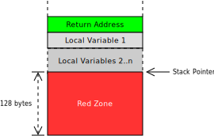
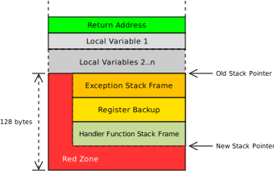

+++
title = "Red Zone'u Devre Dışı Bırakmak"
weight = 1
path = "tr/red-zone"
template = "edition-2/extra.html"

[extra]
# Please update this when updating the translation
translation_based_on_commit = "9d079e6d3e03359469d6cf1759bb1a196d8a11ac"
# GitHub usernames of the people that translated this post
translators = ["rhotav"]
+++

[Red zone], fonksiyonların, stack pointer'ı ayarlamadan stack frame'lerinin altındaki 128 baytı geçici olarak kullanmasına olanak tanıyan bir [System V ABI] optimizasyonudur:

[red zone]: https://eli.thegreenplace.net/2011/09/06/stack-frame-layout-on-x86-64#the-red-zone
[System V ABI]: https://wiki.osdev.org/System_V_ABI

<!-- more -->

Görsel, `n` yerel değişkene sahip bir fonksiyonun stack frame'ini gösteriyor. Fonksiyona girişte, dönüş adresi ve yerel değişkenler için stack'te yer açmak amacıyla stack pointer ayarlanır.

Red zone, ayarlanmış stack pointer'ın altındaki 128 bayt olarak tanımlanır. Fonksiyon bu alanı, fonksiyon çağrıları boyunca gerekmeyen geçici veriler için kullanabilir. Böylece, stack pointer'ı ayarlamak için kullanılan iki komut bazı durumlarda (örneğin küçük yaprak (leaf) fonksiyonlarda) önlenebilir.

Ancak bu optimizasyon, exception'lar veya donanım interrupt'larıyla büyük sorunlara yol açar. Bir fonksiyon red zone'u kullanırken bir exception oluştuğunu varsayalım:

CPU ve exception handler, red zone'daki verilerin üzerine yazar. Ancak bu veri, kesintiye uğramış fonksiyon tarafından hâlâ ihtiyaç duyulan veridir. Bu yüzden exception handler'dan döndüğümüzde fonksiyon artık doğru çalışmayacaktır. Bu durum, [hata ayıklaması haftalar süren][take weeks to debug] tuhaf hatalara yol açabilir.

[take weeks to debug]: https://forum.osdev.org/viewtopic.php?t=21720

Gelecekte exception işleme uyguladığımızda bu tür hatalardan kaçınmak için, red zone'u en baştan devre dışı bırakıyoruz. Bu, hedef yapılandırma dosyamıza `"disable-redzone": true` satırını ekleyerek sağlanır.
