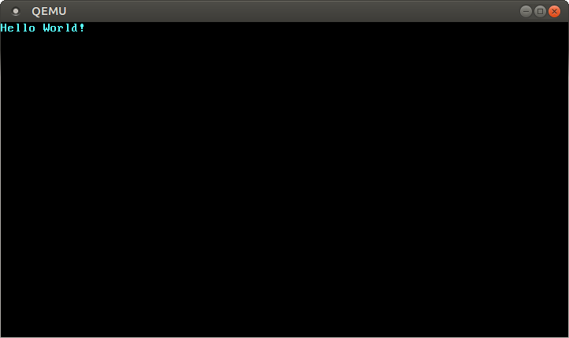

+++
title = "نواة Rust بسيطة للغاية"
weight = 2
path = "ar/minimal-rust-kernel"
date = 2018-02-10

[extra]
chapter = "Bare Bones"
# GitHub usernames of the people that translated this post
translators = ["mindfreq"]
rtl = true
+++

في هذا المقال، سنقوم بإنشاء نواة Rust بسيطة من 64-bit لمعمارية x86. نحن نبني على [الثنائي المستقل لـ Rust][freestanding Rust binary] من المقال السابق لإنشاء صورة قرص قابلة للإقلاع تطبع شيئًا ما على الشاشة.

[freestanding Rust binary]: @/edition-2/posts/01-freestanding-rust-binary/index.md

<!-- more -->

هذا المدونة مطوّرة بشكل مفتوح على [GitHub]. إذا كان لديك أي مشاكل أو أسئلة، يرجى فتح issue هناك. يمكنك أيضًا ترك تعليقات [في الأسفل]. يمكن العثور على الكود المصدري الكامل لهذا المقال في فرع [`post-02`][post branch].

[GitHub]: https://github.com/phil-opp/blog_os
[at the bottom]: #comments
<!-- fix for zola anchor checker (target is in template): <a id="comments"> -->
[post branch]: https://github.com/phil-opp/blog_os/tree/post-02

<!-- toc -->

## عملية الإقلاع {#the-boot-process}
عند تشغيل الكمبيوتر، يبدأ بتنفيذ كود الـ firmware المخزن في [ROM] على اللوحة الأم. يقوم هذا الكود بإجراء [power-on self-test]، واكتشاف الـ RAM المتاح، والتهيئة المسبقة لوحدة المعالجة المركزية والأجهزة. بعد ذلك، يبحث عن قرص قابل للإقلاع ويبدأ في تحميل نواة نظام التشغيل.

[ROM]: https://en.wikipedia.org/wiki/Read-only_memory
[power-on self-test]: https://en.wikipedia.org/wiki/Power-on_self-test

في x86، هناك معياران للـ firmware: “نظام الإدخال/الإخراج الأساسي“ (**[BIOS]**) والمعيار الأحدث “واجهة البرامج الثابتة الموسعة الموحدة” (**[UEFI]**). معيار BIOS قديم ومتجاوز، لكنه بسيط ومدعوم جيدًا على أي جهاز x86 منذ الثمانينيات. على النقيض من ذلك، UEFI أكثر حداثة ولديه ميزات أكثر بكثير، لكن إعداده أكثر تعقيدًا (على الأقل في رأيي).

[BIOS]: https://en.wikipedia.org/wiki/BIOS
[UEFI]: https://en.wikipedia.org/wiki/Unified_Extensible_Firmware_Interface

حاليًا، نحن ندعم BIOS فقط، لكن دعم UEFI مخطط له أيضًا. إذا كنت ترغب في مساعدتنا في هذا الأمر، راجع [Github issue](https://github.com/phil-opp/blog_os/issues/349).

### الإقلاع عبر BIOS
جميع تقريبًا أنظمة x86 تدعم الإقلاع عبر BIOS، بما في ذلك أجهزة UEFI الأحدث التي تستخدم BIOS محاكى. هذا رائع، لأنك يمكنك استخدام نفس منطق الإقلاع عبر جميع الأجهزة من القرن الماضي. لكن هذه التوافقية الواسعة هي في الوقت نفسه أكبر عيوب الإقلاع عبر BIOS، لأنها تعني أن وحدة المعالجة المركزية توضع في وضع توافقية من 16-bit يسمى [real mode] قبل الإقلاع حتى تعمل أجهزة الإقلاع القديمة من الثمانينيات.

ولكن لنبدأ من البداية:

عند تشغيل الكمبيوتر، يقوم بتحميل BIOS من ذاكرة flash خاصة موجودة على اللوحة الأم. يقوم BIOS بتشغيل routines الفحص الذاتي والتهيئة للأجهزة، ثم يبحث عن أقراص قابلة للإقلاع. إذا وجد واحدًا، يتم نقل التحكم إلى الـ _bootloader_ الخاص به، وهو جزء من الكود التنفيذي بحجم 512-byte مخزن في بداية القرص. معظم أجهزة الإقلاع أكبر من 512 byte، لذلك عادةً ما تُقسم أجهزة الإقلاع إلى مرحلة أولى صغيرة تتسع في 512 byte، ومرحلة ثانية يتم تحميلها لاحقًا بواسطة المرحلة الأولى.

يجب على الـ bootloader تحديد موقع صورة النواة على القرص وتحميلها في الذاكرة. كما يحتاج إلى تبديل وحدة المعالجة المركزية من [real mode] من 16-bit إلى [protected mode] من 32-bit، ثم إلى [long mode] من 64-bit، حيث تتوفر سجلات 64-bit وذاكرة الرئيسية الكاملة. وظيفته الثالثة هي الاستعلام عن معلومات معينة (مثل خريطة الذاكرة) من BIOS وتمريرها إلى نواة نظام التشغيل.

[real mode]: https://en.wikipedia.org/wiki/Real_mode
[protected mode]: https://en.wikipedia.org/wiki/Protected_mode
[long mode]: https://en.wikipedia.org/wiki/Long_mode
[memory segmentation]: https://en.wikipedia.org/wiki/X86_memory_segmentation

كتابة bootloader أمر مرهق بعض الشيء لأنه يتطلب لغة assembly وعددًا كبيرًا من الخطوات غير البديهية مثل "اكتب هذه القيمة السحرية في هذا السجل". لذلك، لن نغطي إنشاء الـ bootloader في هذا المقال، وبدلاً من ذلك نوفر أداة تسمى [bootimage] تضيف تلقائيًا bootloader إلى نواتك.

[bootimage]: https://github.com/rust-osdev/bootloader

إذا كنت مهتمًا ببناء bootloader خاص بك: ترقب، فمجموعة مقالات حول هذا الموضوع مخطط لها بالفعل! <!-- , check out our “_[Writing a Bootloader]_” posts, where we explain in detail how a bootloader is built. -->

#### معيار Multiboot
لتجنب أن يقوم كل نظام تشغيل بتطبيق bootloader خاص به، والذي يتوافق مع نظام واحد فقط، أنشأت [Free Software Foundation] معيارًا مفتوحًا لـ bootloader يسمى [Multiboot] في عام 1995. يحدد المعيار واجهة بين الـ bootloader ونظام التشغيل، بحيث يمكن لأي bootloader متوافق مع Multiboot تحميل أي نظام تشغيل متوافق مع Multiboot. التطبيق المرجعي هو [GNU GRUB]، وهو أشهر bootloader لأنظمة Linux.

[Free Software Foundation]: https://en.wikipedia.org/wiki/Free_Software_Foundation
[Multiboot]: https://wiki.osdev.org/Multiboot
[GNU GRUB]: https://en.wikipedia.org/wiki/GNU_GRUB

لجعل النواة متوافقة مع Multiboot، يلزم فقط إدراج ما يسمى [Multiboot header] في بداية ملف النواة. هذا يجعل من السهل جدًا إقلاع نظام التشغيل من GRUB. ومع ذلك، فإن GRUB ومعيار Multiboot لديهما بعض المشاكل أيضًا:

[Multiboot header]: https://www.gnu.org/software/grub/manual/multiboot/multiboot.html#OS-image-format

- يدعمان فقط protected mode من 32-bit. هذا يعني أنه لا يزال عليك القيام بتكوين وحدة المعالجة المركزية للتبديل إلى long mode من 64-bit.
- تم تصميمهما لجعل الـ bootloader بسيطًا بدلاً من النواة. على سبيل المثال، يجب ربط النواة مع [adjusted default page size]، لأن GRUB لا يمكنه العثور على Multiboot header بخلاف ذلك. مثال آخر هو أن [boot information]، التي يتم تمريرها إلى النواة، تحتوي على العديد من الهياكل المعتمدة على المعمارية بدلاً من توفير تجريدات نظيفة.
- كل من GRUB ومعيار Multiboot موثقان بشكل ضعيف فقط.
- يجب تثبيت GRUB على نظام المضيف لإنشاء صورة قرص قابلة للإقلاع من ملف النواة. هذا يجعل التطوير على Windows أو Mac أكثر صعوبة.

[adjusted default page size]: https://wiki.osdev.org/Multiboot#Multiboot_2
[boot information]: https://www.gnu.org/software/grub/manual/multiboot/multiboot.html#Boot-information-format

بسبب هذه العيوب، قررنا عدم استخدام GRUB أو معيار Multiboot. ومع ذلك، نخطط لإضافة دعم Multiboot إلى أداة [bootimage] الخاصة بنا، بحيث يمكن تحميل نواتك على نظام GRUB أيضًا. إذا كنت مهتمًا بكتابة نواة متوافقة مع Multiboot، راجع [الإصدار الأول][first edition] من هذه السلسلة.

[first edition]: @/edition-1/_index.md

### UEFI

(نحن لا ندعم UEFI في الوقت الحالي، لكننا نود ذلك! إذا كنت ترغب في المساعدة، يرجى إخبارنا في [Github issue](https://github.com/phil-opp/blog_os/issues/349).)

## نواة بسيطة للغاية
الآن بعد أن عرفنا تقريبًا كيف يقلع الكمبيوتر، حان الوقت لإنشاء نواتنا البسيطة. هدفنا هو إنشاء صورة قرص تطبع "Hello World!" على الشاشة عند الإقلاع. نحن نفعل ذلك من خلال توسيع [الثنائي المستقل لـ Rust][freestanding Rust binary] من المقال السابق.

كما قد تتذكر، قمنا ببناء الثنائي المستقل من خلال `cargo`، ولكن بناءً على نظام التشغيل، كنا بحاجة إلى أسماء entry point مختلفة وأعلام تجميع مختلفة. وذلك لأن `cargo` يبني لنظام المضيف _host system_ افتراضيًا، أي النظام الذي تعمل عليه. هذا ليس شيئًا نريده لنواتنا، لأن نواة تعمل على نظام مثل Windows لا معنى لها. بدلاً من ذلك، نريد التجميع لنظام هدف _target system_ محدد بوضوح.

### تثبيت Rust Nightly
لدى Rust قنوات إصدار ثلاث: _stable_ و _beta_ و _nightly_. يشرح Rust Book الفرق بين هذه القنوات بشكل جيد جدًا، خذ دقيقة و[تحقق منه](https://doc.rust-lang.org/book/appendix-07-nightly-rust.html#choo-choo-release-channels-and-riding-the-trains). لبناء نظام تشغيل، سنحتاج إلى بعض الميزات التجريبية المتوفرة فقط على قناة nightly، لذلك نحتاج إلى تثبيت نسخة nightly من Rust.

لإدارة تثبيتات Rust، أوصي بشدة بـ [rustup]. يسمح لك بتثبيت مترجمات nightly و beta و stable جنبًا إلى جنب ويجعل تحديثها سهلًا. مع rustup، يمكنك استخدام مترجم nightly للدليل الحالي عن طريق تشغيل `rustup override set nightly`. بدلاً من ذلك، يمكنك إضافة ملف يسمى `rust-toolchain` بالمحتوى `nightly` إلى الدليل الجذري للمشروع. يمكنك التحقق من أن لديك نسخة nightly مثبتة عن طريق تشغيل `rustc --version`: يجب أن يحتوي رقم الإصدار على `-nightly` في النهاية.

[rustup]: https://www.rustup.rs/

يسمح لك المترجم nightly بالتفعيل لميزات تجريبية مختلفة باستخدام ما يسمى _feature flags_ في أعلى ملفك. على سبيل المثال، يمكننا تفعيل [`asm!` macro] التجريبي لـ inline assembly عن طريق إضافة `#![feature(asm)]` إلى أعلى `main.rs` الخاص بنا. لاحظ أن هذه الميزات التجريبية غير مستقرة تمامًا، مما يعني أن إصدارات Rust المستقبلية قد تغيرها أو تزيلها دون إنذار مسبق. لهذا السبب، سنستخدمها فقط عند الضرورة القصوى.

[`asm!` macro]: https://doc.rust-lang.org/stable/reference/inline-assembly.html

### مواصفة الهدف
يدعم Cargo أنظمة هدف مختلفة من خلال المعلمة `--target`. يتم وصف الهدف من خلال ما يسمى _[target triple]_، الذي يصف معمارية CPU والبائع ونظام التشغيل و[ABI]. على سبيل المثال، target triple `x86_64-unknown-linux-gnu` يصف نظامًا بـ CPU من نوع `x86_64`، بدون بائع واضح، ونظام تشغيل Linux مع GNU ABI. يدعم Rust [عديد من target triples المختلفة][platform-support]، بما في ذلك `arm-linux-androideabi` لـ Android أو [`wasm32-unknown-unknown` لـ WebAssembly](https://www.hellorust.com/setup/wasm-target/).

[target triple]: https://clang.llvm.org/docs/CrossCompilation.html#target-triple
[ABI]: https://stackoverflow.com/a/2456882
[platform-support]: https://forge.rust-lang.org/release/platform-support.html
[custom-targets]: https://doc.rust-lang.org/nightly/rustc/targets/custom.html

بالنسبة لنظام الهدف الخاص بنا، نحتاج إلى بعض معاملات التكوين الخاصة (مثل عدم وجود نظام تشغيل أساسي)، لذلك لا يوجد من [target triples الموجودة][platform-support] ما يناسبنا. لحسن الحظ، يسمح لنا Rust بتحديد [هدفنا الخاص][custom-targets] من خلال ملف JSON. على سبيل المثال، ملف JSON الذي يصف هدف `x86_64-unknown-linux-gnu` يبدو كالتالي:

```json
{
    "llvm-target": "x86_64-unknown-linux-gnu",
    "data-layout": "e-m:e-p270:32:32-p271:32:32-p272:64:64-i64:64-i128:128-f80:128-n8:16:32:64-S128",
    "arch": "x86_64",
    "target-endian": "little",
    "target-pointer-width": 64,
    "target-c-int-width": 32,
    "os": "linux",
    "executables": true,
    "linker-flavor": "gcc",
    "pre-link-args": ["-m64"],
    "morestack": false
}
```

معظم الحقول مطلوبة من قبل LLVM لتوليد الكود لتلك المنصة. على سبيل المثال، حقل [`data-layout`] يحدد أحجام الأنواع المختلفة من الأعداد الصحيحة والكسور العشرية وأنواع المؤشرات. ثم هناك حقول يستخدمها Rust للتجميع الشرطي، مثل `target-pointer-width`. النوع الثالث من الحقول يحدد كيفية بناء الـ crate. على سبيل المثال، حقل `pre-link-args` يحدد الوسائط التي يتم تمريرها إلى الـ [linker].

[`data-layout`]: https://llvm.org/docs/LangRef.html#data-layout
[linker]: https://en.wikipedia.org/wiki/Linker_(computing)

نحن نستهدف أيضًا أنظمة `x86_64` بنواتنا، لذلك سيكون مواصفات الهدف الخاصة بنا مشابهة جدًا لما سبق. لنبدأ بإنشاء ملف `x86_64-blog_os.json` (اختر أي اسم تريده) بالمحتوى التالي:

```json
{
    "llvm-target": "x86_64-unknown-none",
    "data-layout": "e-m:e-p270:32:32-p271:32:32-p272:64:64-i64:64-i128:128-f80:128-n8:16:32:64-S128",
    "arch": "x86_64",
    "target-endian": "little",
    "target-pointer-width": 64,
    "target-c-int-width": 32,
    "os": "none",
    "executables": true
}
```

لاحظ أننا غيّرنا نظام التشغيل في `llvm-target` وحقل `os` إلى `none`، لأننا ستعمل على bare metal.

نضيف الإدخالات التالية المتعلقة بالبناء:


```json
"linker-flavor": "ld.lld",
"linker": "rust-lld",
```

بدلاً من استخدام linker الافتراضي للمنصة (الذي قد لا يدعم أهداف Linux)، نستخدم linker [LLD] عبر الأنظمة الذي يأتي مع Rust لربط نواتنا.

[LLD]: https://lld.llvm.org/

```json
"panic-strategy": "abort",
```

تحدد هذه الإعدادات أن الهدف لا يدعم [stack unwinding] عند الـ panic، لذلك يجب أن يتوقف البرنامج مباشرة بدلاً من ذلك. لهذا نفس تأثير خيار `panic = "abort"` في Cargo.toml الخاص بنا، لذلك يمكننا إزالته من هناك. (لاحظ أنه على عكس خيار Cargo.toml، ينطبق هذا الخيار أيضًا عند إعادة تجميع مكتبة `core` لاحقًا في هذا المقال. لذلك، حتى لو كنت تفضل الاحتفاظ بخيار Cargo.toml، تأكد من تضمين هذا الخيار.)

[stack unwinding]: https://www.bogotobogo.com/cplusplus/stackunwinding.php

```json
"disable-redzone": true,
```

نحن نكتب نواة، لذلك سنحتاج إلى معالجة المقاطعات في مرحلة ما. للقيام بذلك بأمان، يجب علينا تعطيل تحسين معين لمؤشر الـ stack يسمى _"red zone"_، لأنه سيؤدي إلى تلف الـ stack بخلاف ذلك. لمزيد من المعلومات، راجع مقالنا المنفصل حول [تعطيل red zone][disabling the red zone].

[disabling the red zone]: @/edition-2/posts/02-minimal-rust-kernel/disable-red-zone/index.md

```json
"features": "-mmx,-sse,+soft-float",
```

يتحكم حقل `features` في تفعيل/تعطيل ميزات الهدف. نحن نعطل ميزتي `mmx` و `sse` بإضافة بادئة سالبة إليها ونفعّل ميزة `soft-float` بإضافة بادئة موجبة إليها. لاحظ أنه يجب عدم وجود مسافات بين الأعلام المختلفة، وإلا فإن LLVM يفشل في تفسير سلسلة الميزات.

ميزتا `mmx` و `sse` تحددان دعم تعليمات [SIMD][Single Instruction Multiple Data (SIMD)]، التي غالبًا ما تسرع البرامج بشكل كبير. ومع ذلك، فإن استخدام سجلات SIMD الكبيرة في أنظمة التشغيل يؤدي إلى مشاكل في الأداء. السبب هو أن النواة تحتاج إلى استعادة جميع السجلات إلى حالتها الأصلية قبل استئناف برنامج تم مقاطعته. هذا يعني أن النواة يجب أن تحفظ حالة SIMD الكاملة في الذاكرة الرئيسية عند كل system call أو مقاطعة أجهزة. بما أن حالة SIMD كبيرة جدًا (512–1600 byte) ويمكن أن تحدث المقاطعات بشكل متكرر جدًا، فإن عمليات الحفظ/الاستعادة الإضافية هذه تضر بالأداء بشكل ملحوظ. لتجنب ذلك، نحن نعطل SIMD لنواتنا (وليس للتطبيقات التي تعمل عليها!).

[Single Instruction Multiple Data (SIMD)]: https://en.wikipedia.org/wiki/SIMD

مشكلة تعطيل SIMD هي أن عمليات الكسور العشرية على `x86_64` تتطلب سجلات SIMD افتراضيًا. لحل هذه المشكلة، نضيف ميزة `soft-float`، التي تحاكي جميع عمليات الكسور العشرية عبر دوال برمجية تعتمد على الأعداد الصحيحة العادية.

لمزيد من المعلومات، راجع مقالتنا حول [تعطيل SIMD][disabling SIMD](@/edition-2/posts/02-minimal-rust-kernel/disable-simd/index.md).

```json
"rustc-abi": "x86-softfloat"
```

بما أننا نريد استخدام ميزة `soft-float`، نحتاج أيضًا إلى إخبار مترجم Rust `rustc` أننا نريد استخدام ABI المقابل. يمكننا ذلك عن طريق تعيين حقل `rustc-abi` إلى `x86-softfloat`.

#### دمج كل شيء
ملف مواصفات الهدف الخاص بنا يبدو الآن كالتالي:

```json
{
    "llvm-target": "x86_64-unknown-none",
    "data-layout": "e-m:e-p270:32:32-p271:32:32-p272:64:64-i64:64-i128:128-f80:128-n8:16:32:64-S128",
    "arch": "x86_64",
    "target-endian": "little",
    "target-pointer-width": 64,
    "target-c-int-width": 32,
    "os": "none",
    "executables": true,
    "linker-flavor": "ld.lld",
    "linker": "rust-lld",
    "panic-strategy": "abort",
    "disable-redzone": true,
    "features": "-mmx,-sse,+soft-float",
    "rustc-abi": "x86-softfloat"
}
```

### بناء النواة
سيستخدم التجميع لهدفنا الجديد اصطلاحات Linux، لأن ld.lld linker-flavor يوجّه llvm للتجميع مع العلم `-flavor gnu` (لمزيد من خيارات linker، راجع [توثيق rustc](https://doc.rust-lang.org/rustc/codegen-options/index.html#linker-flavor)). هذا يعني أننا نحتاج إلى entry point باسم `_start` كما هو موضح في [المقال السابق][previous post]:

[previous post]: @/edition-2/posts/01-freestanding-rust-binary/index.md

```rust
// src/main.rs

#![no_std] // don't link the Rust standard library
#![no_main] // disable all Rust-level entry points

use core::panic::PanicInfo;

/// This function is called on panic.
#[panic_handler]
fn panic(_info: &PanicInfo) -> ! {
    loop {}
}

#[unsafe(no_mangle)] // don't mangle the name of this function
pub extern "C" fn _start() -> ! {
    // this function is the entry point, since the linker looks for a function
    // named `_start` by default
    loop {}
}
```

لاحظ أن الـ entry point يجب أن يسمى `_start` بغض النظر عن نظام التشغيل المضيف.

يمكننا الآن بناء النواة لهدفنا الجديد عن طريق تمرير اسم ملف JSON كـ `--target`:

```
> cargo build --target x86_64-blog_os.json

error: `.json` target specs require -Zjson-target-spec
```

فشل! يخبرنا الخطأ أن مواصفات JSON target المخصصة هي ميزة غير مستقرة تتطلب تفعيلًا صريحًا. وذلك لأن تنسيق ملفات JSON target غير مستقر بعد، لذلك قد تحدث تغييرات عليه في إصدارات Rust المستقبلية. راجع [issue التتبع لمواصفات JSON target المخصصة][json-target-spec-issue] لمزيد من المعلومات.

[json-target-spec-issue]: https://github.com/rust-lang/rust/issues/151528

#### خيار `json-target-spec`

لتفعيل دعم مواصفات JSON target المخصصة، نحتاج إلى إنشاء ملف [تكوين cargo][cargo configuration] محلي في `.cargo/config.toml` (يجب أن يكون مجلد `.cargo` بجانب مجلد `src`) بالمحتوى التالي:

[cargo configuration]: https://doc.rust-lang.org/cargo/reference/config.html

```toml
# in .cargo/config.toml

[unstable]
json-target-spec = true
```

هذا يفعل ميزة `json-target-spec` غير المستقرة، مما يسمح لنا بملفات JSON target المخصصة.

مع هذا التكوين في مكانه، لنحاول البناء مرة أخرى:

```
> cargo build --target x86_64-blog_os.json

error[E0463]: can't find crate for `core`
```

لا يزال يفشل، ولكن بخطأ جديد. يخبرنا الخطأ أن مترجم Rust لا يجد [مكتبة `core`][`core` library]. تحتوي هذه المكتبة على أنواع Rust الأساسية مثل `Result` و `iterators` و `Option`، وهي مرتبطة ضمنيًا بجميع `no_std` crates.

[`core` library]: https://doc.rust-lang.org/nightly/core/index.html

المشكلة هي أن مكتبة core موزعة مع مترجم Rust كمكتبة _مجمّعة مسبقًا_. لذلك فهي صالحة فقط لـ host triples المدعومة (مثل `x86_64-unknown-linux-gnu`) ولكن ليس لهدفنا المخصص. إذا أردنا تجميع كود لأهداف أخرى، نحتاج إلى إعادة تجميع `core` لهذه الأهداف أولاً.

#### خيار `build-std`

هنا يأتي دور ميزة [`build-std` feature] في cargo. تسمح بإعادة تجميع `core` وغيرها من crates مكتبة القياسية عند الطلب، بدلاً من استخدام النسخ المجمّعة مسبقًا المتوفرة مع تثبيت Rust. هذه الميزة جديدة جدًا وما زالت غير مكتملة، لذلك هي محددة كـ "غير مستقرة" ومتوفرة فقط على [مترجمات Rust nightly].

[`build-std` feature]: https://doc.rust-lang.org/nightly/cargo/reference/unstable.html#build-std
[nightly Rust compilers]: #installing-rust-nightly

لاستخدام الميزة، نحتاج إلى إضافة ما يلي إلى ملف [تكوين cargo][cargo configuration] في `.cargo/config.toml`:

```toml
# in .cargo/config.toml

[unstable]
json-target-spec = true
build-std = ["core", "compiler_builtins"]
```

هذا يخبر cargo أنه يجب إعادة تجميع مكتبتي `core` و `compiler_builtins`. هذه الأخيرة مطلوبة لأنها dependency لـ `core`. من أجل إعادة تجميع هذه المكتبات، يحتاج cargo إلى الوصول إلى كود مصدر Rust، الذي يمكننا تثبيته مع `rustup component add rust-src`.

<div class="note">

**ملاحظة:** يتطلب مفتاح التكوين `unstable.build-std` على الأقل Rust nightly من 2020-07-15.

</div>

بعد تعيين مفتاح التكوين `unstable.build-std` وتثبيت مكون `rust-src`، يمكننا إعادة تشغيل أمر البناء:

```
> cargo build --target x86_64-blog_os.json
   Compiling core v0.0.0 (/…/rust/src/libcore)
   Compiling rustc-std-workspace-core v1.99.0 (/…/rust/src/tools/rustc-std-workspace-core)
   Compiling compiler_builtins v0.1.32
   Compiling blog_os v0.1.0 (/…/blog_os)
    Finished dev [unoptimized + debuginfo] target(s) in 0.29 secs
```

نرى أن `cargo build` الآن يعيد تجميع مكتبات `core` و `rustc-std-workspace-core` (dependency لـ `compiler_builtins`) و `compiler_builtins` لهدفنا المخصص.

#### الدوال المتعلقة بالذاكرة

يفترض مترجم Rust أن مجموعة معينة من الدوال المدمجة متوفرة لجميع الأنظمة. معظم هذه الدوال توفرها مكتبة `compiler_builtins` التي أعدنا تجميعها للتو. ومع ذلك، هناك بعض الدوال المتعلقة بالذاكرة في تلك المكتبة غير مفعلة افتراضيًا لأنها عادةً ما توفرها مكتبة C على النظام. تشمل هذه الدوال `memset`، التي تضع جميع البايتات في كتلة ذاكرة بقيمة معينة، و `memcpy`، التي تنسخ كتلة ذاكرة إلى أخرى، و `memcmp`، التي تقارن كتلتي ذاكرة. بينما لم نكن بحاجة إلى أي من هذه الدوال لتجميع نواتنا الآن، ستكون مطلوبة بمجرد إضافة المزيد من الكود إليها (مثل نسخ الـ structs).

بما أننا لا يمكننا الربط بمكتبة C لنظام التشغيل، نحتاج إلى طريقة بديلة لتوفير هذه الدوال للمترجم. نهج ممكن لذلك قد يكون تنفيذ دوال `memset` الخاصة بنا وتطبيق السمة `#[unsafe(no_mangle)]` عليها (لتجنب إعادة التسمية التلقائية أثناء التجميع). ومع ذلك، هذا خطير لأن أصغر خطأ في تنفيذ هذه الدوال قد يؤدي إلى سلوك غير محدد. على سبيل المثال، تنفيذ `memcpy` بحلقة `for` قد يؤدي إلى recursion غير محدود لأن حلقات `for` تستدعي ضمنياً دالة trait [`IntoIterator::into_iter`]، التي قد تستدعي `memcpy` مرة أخرى. لذلك من الجيد إعادة استخدام التطبيقات الموجودة والمجربة بدلاً من ذلك.

[`IntoIterator::into_iter`]: https://doc.rust-lang.org/stable/core/iter/trait.IntoIterator.html#tymethod.into_iter

لحسن الحظ، تحتوي مكتبة `compiler_builtins` بالفعل على تطبيقات لجميع الدوال المطلوبة، ولكنها معطلة افتراضيًا حتى لا تتصادم مع التطبيقات من مكتبة C. يمكننا تفعيلها عن طريق تعيين العلم [`build-std-features`] في cargo إلى `["compiler-builtins-mem"]`. مثل علم `build-std`، يمكن تمرير هذا العلم إما في سطر الأوامر كعلم `-Z` أو تكوينه في جدول `unstable` في ملف `.cargo/config.toml`. بما أننا نريد دائمًا البناء مع هذا العلم، فإن خيار ملف التكوين مناسب أكثر بالنسبة لنا:

[`build-std-features`]: https://doc.rust-lang.org/nightly/cargo/reference/unstable.html#build-std-features

```toml
# in .cargo/config.toml

[unstable]
json-target-spec = true
build-std-features = ["compiler-builtins-mem"]
build-std = ["core", "compiler_builtins"]
```

(دعم ميزة `compiler-builtins-mem` تمت [إضافته مؤخرًا جدًا](https://github.com/rust-lang/rust/pull/77284)، لذلك تحتاج على الأقل إلى Rust nightly `2020-09-30` لها.)

خلف الكواليس، يفعل هذا العلم ميزة [`mem` feature] في مكتبة `compiler_builtins`. تأثير هذا هو أن السمة `#[unsafe(no_mangle)]` تُطبق على [تطبيقات `memcpy` وغيرها][`memcpy` etc. implementations] في المكتبة، مما يجعلها متاحة لـ linker.

[`mem` feature]: https://github.com/rust-lang/compiler-builtins/blob/eff506cd49b637f1ab5931625a33cef7e91fbbf6/Cargo.toml#L54-L55
[`memcpy` etc. implementations]: https://github.com/rust-lang/compiler-builtins/blob/eff506cd49b637f1ab5931625a33cef7e91fbbf6/src/mem.rs#L12-L69

مع هذا التغيير، تحتوي نواتنا على تطبيقات صالحة لجميع الدوال المطلوبة من المترجم، لذلك ستستمر في التجميع حتى لو أصبح كودنا أكثر تعقيدًا.

#### تعيين هدف افتراضي

لتجنب تمرير المعلمة `--target` في كل مرة نستدعي فيها `cargo build`، يمكننا تجاوز الهدف الافتراضي. للقيام بذلك، نضيف ما يلي إلى ملف [تكوين cargo][cargo configuration] في `.cargo/config.toml`:

[cargo configuration]: https://doc.rust-lang.org/cargo/reference/config.html

```toml
# in .cargo/config.toml

[build]
target = "x86_64-blog_os.json"
```

هذا يخبر `cargo` باستخدام هدف `x86_64-blog_os.json` الخاص بنا عندما لا يتم تمرير وسيطة `--target` صريحة. هذا يعني أننا يمكننا الآن بناء نواتنا بـ `cargo build` بسيط. لمزيد من المعلومات حول خيارات تكوين cargo، راجع [التوثيق الرسمي][cargo configuration].

الآن نحن قادرون على بناء نواتنا لهدف bare metal بـ `cargo build` بسيط. ومع ذلك، فإن entry point `_start` الخاص بنا، الذي سيتم استدعاؤه من قبل bootloader، لا يزال فارغًا. حان الوقت أن نخرج شيئًا ما على الشاشة منه.

### الطباعة على الشاشة
أسهل طباعة نص على الشاشة في هذه المرحلة هي [VGA text buffer]. وهي منطقة ذاكرة خاصة مُعيّنة على أجهزة VGA تحتوي على المحتويات المعروضة على الشاشة. عادةً ما تتكون من 25 سطرًا يحتوي كل منها على 80 خلية حرف. تعرض كل خلية حرف ASCII مع بعض ألوان الخلفية والمقدمة. يبدو الإخراج على الشاشة كالتالي:

[VGA text buffer]: https://en.wikipedia.org/wiki/VGA-compatible_text_mode


سنناقش التخطيط الدقيق لـ buffer VGA في المقال التالي، حيث سنكتب أول driver صغير له. لطباعة "Hello World!"، نحتاج فقط إلى معرفة أن الـ buffer موجود على العنوان `0xb8000` وأن كل خلية حرف تتكون من بايت ASCII وبايت لون.

يبدو التنفيذ كالتالي:

```rust
static HELLO: &[u8] = b"Hello World!";

#[unsafe(no_mangle)]
pub extern "C" fn _start() -> ! {
    let vga_buffer = 0xb8000 as *mut u8;

    for (i, &byte) in HELLO.iter().enumerate() {
        unsafe {
            *vga_buffer.offset(i as isize * 2) = byte;
            *vga_buffer.offset(i as isize * 2 + 1) = 0xb;
        }
    }

    loop {}
}
```

أولاً، نحول العدد الصحيح `0xb8000` إلى [مؤشر خام][raw pointer]. ثم ن[تكرار][iterate] على بايتات [السلسلة النصية من البايتات][byte string] `HELLO` [الثابتة][static]. نستخدم الدالة [`enumerate`] للحصول على متغير عدّاد `i` أيضًا. في جسم حلقة for، نستخدم الدالة [`offset`] لكتابة بايت السلسلة وبايت اللون المقابل (`0xb` هو لون سيان فاتح).

[iterate]: https://doc.rust-lang.org/stable/book/ch13-02-iterators.html
[static]: https://doc.rust-lang.org/book/ch10-03-lifetime-syntax.html#the-static-lifetime
[`enumerate`]: https://doc.rust-lang.org/core/iter/trait.Iterator.html#method.enumerate
[byte string]: https://doc.rust-lang.org/reference/tokens.html#byte-string-literals
[raw pointer]: https://doc.rust-lang.org/book/ch20-01-unsafe-rust.html#dereferencing-a-raw-pointer
[`offset`]: https://doc.rust-lang.org/std/primitive.pointer.html#method.offset

لاحظ أن هناك كتلة [`unsafe`] حول جميع عمليات الكتابة في الذاكرة. السبب هو أن مترجم Rust لا يستطيع إثبات أن المؤشرات الخام التي ننشئها صالحة. يمكنها الإشارة إلى أي مكان وتؤدي إلى تلف البيانات. بوضعها في كتلة `unsafe`، نحن نخبر المترجم أننا متأكدون تمامًا من أن العمليات صالحة. لاحظ أن كتلة `unsafe` لا توقف فحوصات الأمان في Rust. إنها تسمح لك فقط بـ [خمسة أشياء إضافية][five additional things].

[`unsafe`]: https://doc.rust-lang.org/stable/book/ch19-01-unsafe-rust.html
[five additional things]: https://doc.rust-lang.org/stable/book/ch20-01-unsafe-rust.html#unsafe-superpowers

أريد التأكيد على أن **هذا ليس الطريقة التي نريد القيام بها في Rust!** من السهل جدًا ارتكاب أخطاء عند العمل مع المؤشرات الخام داخل كتل unsafe. على سبيل المثال، يمكننا بسهولة الكتابة بعد نهاية buffer إذا لم نكن حذرين.

لذلك نريد تقليل استخدام `unsafe` قدر الإمكان. يمنحنا Rust القدرة على القيام بذلك بإنشاء تجريدات آمنة. على سبيل المثال، يمكننا إنشاء نوع buffer VGA يجمع كل عدم الأمان ويضمن أنه من _المستحيل_ القيام بأي شيء خاطئ من الخارج. بهذه الطريقة، سنحتاج فقط إلى كميات قليلة من كود `unsafe` ونضمن عدم انتهاك [أمان الذاكرة][memory safety]. سنقوم بإنشاء مثل هذا التجريد الآمن لـ buffer VGA في المقال التالي.

[memory safety]: https://en.wikipedia.org/wiki/Memory_safety

## تشغيل النواة

الآن بعد أن لدينا ملف قابل للتنفيذ يفعل شيئًا محسوسًا، حان الوقت لتشغيله. أولاً، نحتاج إلى تحويل نواتنا المجمّعة إلى صورة قرص قابلة للإقلاع عن طريق ربطها بـ bootloader. ثم يمكننا تشغيل صورة القرص في الآلة الافتراضية [QEMU] أو إقلاعها على أجهزة حقيقية باستخدام USB stick.

### إنشاء صورة إقلاع

لتحويل نواتنا المجمّعة إلى صورة قرص قابلة للإقلاع، نحتاج إلى ربطها بـ bootloader. كما تعلمنا في [القسم حول الإقلاع][section about booting]، فإن الـ bootloader مسؤول عن تهيئة وحدة المعالجة المركزية وتحميل نواتنا.

[section about booting]: #the-boot-process

بدلاً من كتابة bootloader خاص بنا، وهو مشروع بحد ذاته، نستخدم مكتبة [`bootloader`]. تنفذ هذه المكتبة bootloader أساسي لـ BIOS بدون أي تبعيات C، فقط Rust و inline assembly. لاستخدامها لإقلاع نواتنا، نحتاج إلى إضافة dependency عليها:

[`bootloader`]: https://crates.io/crates/bootloader

```toml
# in Cargo.toml

[dependencies]
bootloader = "0.9"
```

**ملاحظة:** هذا المقال متوافق فقط مع `bootloader v0.9`. الإصدارات الأحدث تستخدم نظام بناء مختلف وستؤدي إلى أخطاء بناء عند اتباع هذا المقال.

إضافة bootloader كـ dependency لا يكفي لإنشاء صورة قرص قابلة للإقلاع فعليًا. المشكلة هي أننا نحتاج إلى ربط نواتنا مع bootloader بعد التجميع، ولكن cargo لا يدعم [سكريپتات ما بعد البناء][post-build scripts].

[post-build scripts]: https://github.com/rust-lang/cargo/issues/545

لحل هذه المشكلة، أنشأنا أداة تسمى `bootimage` تقوم أولاً بتجميع النواة و bootloader، ثم تربطهما معًا لإنشاء صورة قرص قابلة للإقلاع. لتثبيت الأداة، اذهب إلى الدليل الرئيسي (أو أي دليل خارج مشروع cargo) ونفّذ الأمر التالي في terminal:

```
cargo install bootimage
```

لتشغيل `bootimage` وبناء الـ bootloader، تحتاج إلى تثبيت مكون `llvm-tools-preview` rustup. يمكنك ذلك بتنفيذ `rustup component add llvm-tools-preview`.

بعد تثبيت `bootimage` وإضافة مكون `llvm-tools-preview`، يمكنك إنشاء صورة قرص قابلة للإقلاع بالعودة إلى دليل مشروع cargo وتنفيذ:

```
> cargo bootimage
```

نرى أن الأداة تعيد تجميع نواتنا باستخدام `cargo build`، لذلك ستلتقط تلقائيًا أي تغييرات تقوم بها. بعد ذلك، تجمع الـ bootloader، وقد يستغرق ذلك بعض الوقت. مثل جميع تبعيات crates، يتم بناؤها مرة واحدة فقط ثم يتم تخزينها مؤقتًا، لذلك ستكون البناءات اللاحقة أسرع بكثير. أخيرًا، تجمع `bootimage` bootloader ونواتك في صورة قرص قابلة للإقلاع.

بعد تنفيذ الأمر، يجب أن ترى صورة قرص قابلة للإقلاع باسم `bootimage-blog_os.bin` في دليل `target/x86_64-blog_os/debug`. يمكنك إقلاعها على آلة افتراضية أو نسخها على USB drive لإقلاعها على أجهزة حقيقية. (لاحظ أن هذا ليس صورة CD، التي لها تنسيق مختلف، لذلك حرقها على CD لا يعمل).

#### كيف تعمل؟
تقوم أداة `bootimage` بالخطوات التالية خلف الكواليس:

- تجمع نواتنا إلى ملف [ELF].
- تجمع dependency bootloader كـ executable مستقل.
- تربط بايتات ملف ELF للنواة مع bootloader.

[ELF]: https://en.wikipedia.org/wiki/Executable_and_Linkable_Format
[rust-osdev/bootloader]: https://github.com/rust-osdev/bootloader

عند الإقلاع، يقرأ الـ bootloader ملف ELF المُلحق ويحلله. ثم يعيّن أجزاء البرنامج إلى عناوين افتراضية في page tables، ويصفّر قسم `.bss`، ويُعدّ stack. أخيرًا، يقرأ عنوان entry point (دالة `_start` الخاصة بنا) ويقفز إليها.

### تشغيلها في QEMU

يمكننا الآن إقلاع صورة القرص في آلة افتراضية. لإقلاعها في [QEMU]، نفّذ الأمر التالي:

[QEMU]: https://www.qemu.org/

```
> qemu-system-x86_64 -drive format=raw,file=target/x86_64-blog_os/debug/bootimage-blog_os.bin
```

يفتح هذا نافذة منفصلة يجب أن تبدو مشابهة لهذا:



نرى أن "Hello World!" الخاصة بنا مرئية على الشاشة.

### جهاز حقيقي

من الممكن أيضًا كتابتها على USB stick وإقلاعها على جهاز حقيقي، **لكن كن حذرًا** في اختيار اسم الجهاز الصحيح، لأن **كل شيء على ذلك الجهاز يتم الكتابة فوقه**:

```
> dd if=target/x86_64-blog_os/debug/bootimage-blog_os.bin of=/dev/sdX && sync
```

حيث `sdX` هو اسم جهاز USB stick.

بعد كتابة الصورة على USB stick، يمكنك تشغيلها على أجهزة حقيقية عن طريق الإقلاع منها. ربما تحتاج إلى استخدام قائمة إقلاع خاصة أو تغيير ترتيب الإقلاع في تكوين BIOS للإقلاع من USB stick. لاحظ أنها لا تعمل حاليًا لأجهزة UEFI، لأن مكتبة `bootloader` لا تدعم UEFI بعد.

### استخدام `cargo run`

لتسهيل تشغيل نواتنا في QEMU، يمكننا تعيين مفتاح التكوين `runner` لـ cargo:

```toml
# in .cargo/config.toml

[target.'cfg(target_os = "none")']
runner = "bootimage runner"
```

جدول `target.'cfg(target_os = "none")'` ينطبق على جميع الأهداف التي يكون فيها حقل `"os"` في ملف تكوين الهدف مُعيّن إلى `"none"`. هذا يشمل هدف `x86_64-blog_os.json` الخاص بنا. يحدد المفتاح `runner` الأمر الذي يجب استدعاؤه لـ `cargo run`. يتم تشغيل الأمر بعد بناء ناجح مع تمرير مسار executable كوسيطة أولى. راجع [توثيق cargo][cargo configuration] لمزيد من التفاصيل.

أمر `bootimage runner` مصمم خصيصًا ليكون قابلاً للاستخدام كـ executable `runner`. يربط الملف التنفيذي المعطى مع dependency bootloader للمشروع ثم يطلق QEMU. راجع [Readme لـ `bootimage`] لمزيد من التفاصيل وخيارات التكوين الممكنة.

[Readme of `bootimage`]: https://github.com/rust-osdev/bootimage

الآن يمكننا استخدام `cargo run` لتجميع نواتنا وإقلاعها في QEMU.

## ما التالي؟

في المقال التالي، سنستكشف VGA text buffer بمزيد من التفصيل وسنكتب واجهة آمنة له. سنضيف أيضًا دعم macro `println`.
