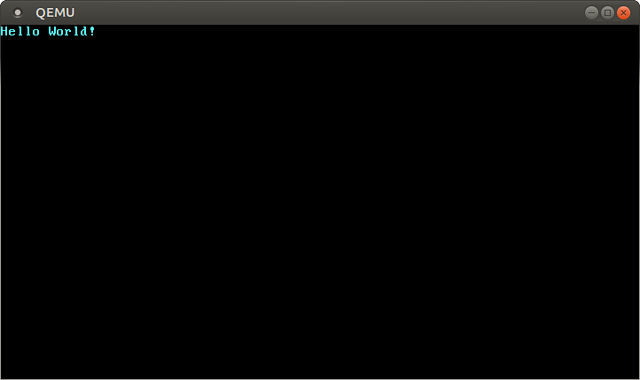

+++
title = "Минимально возможное ядро на Rust"
weight = 2
path = "ru/minimal-rust-kernel"
date = 2018-02-10

[extra]
chapter = "С нуля"
translators = ["MrZloHex"]
+++

В этом посте мы создадим минимальное 64-битное ядро на Rust для архитектуры x86_64. Мы будем отталкиваться от [независимого бинарного файла][freestanding Rust binary] из предыдущего поста для создания загрузочного образа диска, который может что-то выводить на экран.

[freestanding Rust binary]: @/edition-2/posts/01-freestanding-rust-binary/index.ru.md

<!-- more -->
Этот блог открыто разрабатывается на [GitHub]. Если у вас есть несколько проблем или вопросов, пожалуйста откройте _issue_. Также можете оставлять комментарии [в конце файла][at the bottom]. Полный исходный код для этого поста вы можете найти [`post-02`][post branch] ветке репозитория.

[GitHub]: https://github.com/phil-opp/blog_os
[at the bottom]: #comments
[post branch]: https://github.com/phil-opp/blog_os/tree/post-02

<!-- toc -->

## Последовательность процессов запуска

Когда вы включаете компьютер, он начинает выполнять код микропрограммы, который хранится в [ПЗУ][ROM] материнской платы. Этот код выполняет [самотестирование при включении][power-on self-test], определяет доступную оперативную память и выполняет предварительную инициализацию процессора и аппаратного обеспечения. После этого он ищет загрузочный диск и начинает загрузку ядра операционной системы.

[ROM]: https://en.wikipedia.org/wiki/Read-only_memory
[power-on self-test]: https://en.wikipedia.org/wiki/Power-on_self-test

Для архитектуры x86 существует два стандарта прошивки: “Basic Input/Output System“ ("Базовая система ввода/вывода" **[BIOS]**) и более новый “Unified Extensible Firmware Interface”  ("Унифицированный расширяемый интерфейс прошивки" **[UEFI]**). Стандарт BIOS - старый и устаревший, но простой и хорошо поддерживаемый на любой машине x86 с 1980-х годов. UEFI, напротив, более современный и имеет гораздо больше возможностей, но более сложен в настройке (по крайней мере, на мой взгляд).

[BIOS]: https://en.wikipedia.org/wiki/BIOS
[UEFI]: https://en.wikipedia.org/wiki/Unified_Extensible_Firmware_Interface

В данный момент, мы обеспечиваем поддержку только BIOS, но планируется поддержка и UEFI. Если вы хотите помочь нам в этом, обратитесь к [Github issue](https://github.com/phil-opp/blog_os/issues/349).

## Запуск BIOS

Почти все системы x86 имеют поддержку загрузки BIOS, включая более новые машины на базе UEFI, которые используют эмулированный BIOS. Это замечательно, потому что вы можете использовать одну и ту же логику загрузки на всех машинах из прошлых веков. Но такая широкая совместимость одновременно является и самым большим недостатком загрузки BIOS, поскольку это означает, что перед загрузкой процессор переводится в 16-битный режим совместимости под названием [реальный режим], чтобы архаичные загрузчики 1980-х годов все еще работали.

Но давайте начнем с самого начала:

Когда вы включаете компьютер, он загружает BIOS из специальной флэш-памяти, расположенной на материнской плате. BIOS запускает процедуры самодиагностики и инициализации оборудования, затем ищет загрузочные диски. Если он находит такой, управление передается _загрузчику_, который представляет собой 512-байтовую порцию исполняемого кода, хранящуюся в начале диска. Большинство загрузчиков имеют размер более 512 байт, поэтому загрузчики обычно разделяются на небольшой первый этап, который помещается в 512 байт, и второй этап, который впоследствии загружается первым этапом.

Загрузчик должен определить расположение образа ядра на диске и загрузить его в память. Он также должен переключить процессор из 16-битного [реального режима][real mode] сначала в 32-битный [защищенный режим][protected mode], а затем в 64-битный [длинный режим][long mode], где доступны 64-битные регистры и вся основная память. Третья задача - запросить определенную информацию (например, карту памяти) у BIOS и передать ее ядру ОС.

[real mode]: https://en.wikipedia.org/wiki/Real_mode
[protected mode]: https://en.wikipedia.org/wiki/Protected_mode
[long mode]: https://en.wikipedia.org/wiki/Long_mode
[memory segmentation]: https://en.wikipedia.org/wiki/X86_memory_segmentation

Написание загрузчика немного громоздко, поскольку требует использования языка ассемблера и множества неинтересных действий, таких как "запишите это магическое значение в этот регистр процессора". Поэтому мы не рассматриваем создание загрузчика в этом посте и вместо этого предоставляем инструмент под названием [bootimage], который автоматически добавляет загрузчик к вашему ядру.

[bootimage]: https://github.com/rust-osdev/bootimage

Если вы заинтересованы в создании собственного загрузчика: Оставайтесь с нами, набор постов на эту тему уже запланирован! <!-- , check out our “_[Writing a Bootloader]_” posts, where we explain in detail how a bootloader is built. -->

#### Стандарт Multiboot

Чтобы избежать того, что каждая операционная система реализует свой собственный загрузчик, который совместим только с одной ОС, [Free Software Foundation] в 1995 году создал открытый стандарт загрузчика под названием [Multiboot]. Стандарт определяет интерфейс между загрузчиком и операционной системой, так что любой совместимый с Multiboot загрузчик может загружать любую совместимую с Multiboot операционную систему. Эталонной реализацией является [GNU GRUB], который является самым популярным загрузчиком для систем Linux.

[Free Software Foundation]: https://en.wikipedia.org/wiki/Free_Software_Foundation
[Multiboot]: https://wiki.osdev.org/Multiboot
[GNU GRUB]: https://en.wikipedia.org/wiki/GNU_GRUB

Чтобы сделать ядро совместимым с Multiboot, нужно просто вставить так называемый [Multiboot заголовок][Multiboot header] в начало файла ядра. Это делает загрузку ОС в GRUB очень простой. Однако у GRUB и стандарта Multiboot есть и некоторые проблемы:

[Multiboot header]: https://www.gnu.org/software/grub/manual/multiboot/multiboot.html#OS-image-format

- Они поддерживают только 32-битный защищенный режим. Это означает, что для перехода на 64-битный длинный режим необходимо выполнить конфигурацию процессора.
- Они предназначены для того, чтобы упростить загрузчик вместо ядра. Например, ядро должно быть связано с [скорректированным размером страницы по умолчанию][adjusted default page size], потому что иначе GRUB не сможет найти заголовок Multiboot. Другой пример - [информация запуска][boot information], которая передается ядру, содержит множество структур, зависящих от архитектуры, вместо того, чтобы предоставлять чистые абстракции.
- И GRUB, и стандарт Multiboot документированы очень скудно.
- GRUB должен быть установлен на хост-системе, чтобы создать загрузочный образ диска из файла ядра. Это усложняет разработку под Windows или Mac.

[adjusted default page size]: https://wiki.osdev.org/Multiboot#Multiboot_2
[boot information]: https://www.gnu.org/software/grub/manual/multiboot/multiboot.html#Boot-information-format

Из-за этих недостатков мы решили не использовать GRUB или стандарт Multiboot. Однако мы планируем добавить поддержку Multiboot в наш инструмент [bootimage], чтобы можно было загружать ваше ядро и на системе GRUB. Если вы заинтересованы в написании ядра, совместимого с Multiboot, ознакомьтесь с [первым выпуском][first edition] этой серии блогов.

[first edition]: @/edition-1/_index.md

### UEFI

(На данный момент мы не предоставляем поддержку UEFI, но мы бы хотели! Если вы хотите помочь, пожалуйста, сообщите нам об этом в [Github issue](https://github.com/phil-opp/blog_os/issues/349).)

## Минимально возможное ядро

Теперь, когда мы примерно знаем, как запускается компьютер, пришло время создать собственное минимально возможное ядро. Наша цель - создать образ диска, который при загрузке выводит на экран "Hello World!". Для этого мы будем используем [Независимый бинарный файл на Rust][freestanding Rust binary] из предыдущего поста.

Как вы помните, мы собирали независимый бинарный файл с помощью `cargo`, но в зависимости от операционной системы нам требовались разные имена точек входа и флаги компиляции. Это потому, что `cargo` по умолчанию компилирует для _хостовой системы_, то есть системы, на которой вы работаете. Это не то, что мы хотим для нашего ядра, потому что ядро, работающее поверх, например, Windows, не имеет особого смысла. Вместо этого мы хотим компилировать для четко определенной _целевой системы_.

### Установка Rust Nightly

Rust имеет три релизный канала: _stable_, _beta_ и _nightly_. В книге Rust Book очень хорошо объясняется разница между этими каналами, поэтому уделите минуту и [ознакомьтесь с ней](https://doc.rust-lang.org/book/appendix-07-nightly-rust.html#choo-choo-release-channels-and-riding-the-trains). Для создания операционной системы нам понадобятся некоторые экспериментальные возможности, которые доступны только на канале nightly, поэтому нам нужно установить nightly версию Rust.

Для управления установками Rust я настоятельно рекомендую [rustup]. Он позволяет устанавливать nightly, beta и stable компиляторы рядом друг с другом и облегчает их обновление. С помощью rustup вы можете использовать nightly компилятор для текущего каталога, выполнив команду `rustup override set nightly`. В качестве альтернативы вы можете добавить файл `rust-toolchain` с содержимым `nightly` в корневой каталог проекта. Вы можете проверить, установлена ли у вас версия nightly, выполнив команду `rustc --version`: Номер версии должен содержать `-nightly` в конце.

[rustup]: https://www.rustup.rs/

Nightly версия компилятора позволяет нам подключаться к различным экспериментальным возможностям с помощью так называемых _флагов_ в верхней части нашего файла. Например, мы можем включить экспериментальный [`asm!` макрос][`asm!` macro] для поточной сборки, добавив `#![feature(asm)]` в начало нашего `main.rs`. Обратите внимание, что такие экспериментальные возможности совершенно нестабильны, что означает, что будущие версии Rust могут изменить или удалить их без предварительного предупреждения. По этой причине мы будем использовать их только в случае крайней необходимости.

[`asm!` macro]: https://doc.rust-lang.org/unstable-book/library-features/asm.html

### Спецификация целевой платформы

Cargo поддерживает различные целевые системы через параметр `--target`. Цель описывается так называемой тройкой _[target triple]_, которая описывает архитектуру процессора, производителя, операционную систему и [ABI]. Например, тройка целей `x86_64-unknown-linux-gnu` описывает систему с процессором `x86_64`, неизвестным поставщиком и операционной системой Linux с GNU ABI. Rust поддерживает [множество различных целевых троек][many different target triples] [поддержка платформы][platform-support], включая `arm-linux-androideabi` для Android или [`wasm32-unknown-unknown` для WebAssembly] (https://www.hellorust.com/setup/wasm-target/).

[target triple]: https://clang.llvm.org/docs/CrossCompilation.html#target-triple
[ABI]: https://stackoverflow.com/a/2456882
[platform-support]: https://forge.rust-lang.org/release/platform-support.html
[custom-targets]: https://doc.rust-lang.org/nightly/rustc/targets/custom.html

Однако для нашей целевой системы нам требуются некоторые специальные параметры конфигурации (например, отсутствие базовой ОС), поэтому ни одна из [существующих целевых троек][platform-support] не подходит. К счастью, Rust позволяет нам определить [собственную цель][custom-targets] через JSON-файл. Например, JSON-файл, описывающий цель `x86_64-unknown-linux-gnu`, выглядит следующим образом:

```json
{
    "llvm-target": "x86_64-unknown-linux-gnu",
    "data-layout": "e-m:e-i64:64-f80:128-n8:16:32:64-S128",
    "arch": "x86_64",
    "target-endian": "little",
    "target-pointer-width": "64",
    "target-c-int-width": "32",
    "os": "linux",
    "executables": true,
    "linker-flavor": "gcc",
    "pre-link-args": ["-m64"],
    "morestack": false
}
```

Большинство полей требуется LLVM для генерации кода для данной платформы. Например, поле [`data-layout`] определяет размер различных типов целых чисел, чисел с плавающей точкой и указателей. Затем есть поля, которые Rust использует для условной компиляции, такие как `target-pointer-width`. Третий вид полей определяет, как должен быть собран крейт. Например, поле `pre-link-args` определяет аргументы, передаваемые [компоновщику][linker].

[`data-layout`]: https://llvm.org/docs/LangRef.html#data-layout
[linker]: https://en.wikipedia.org/wiki/Linker_(computing)

Нам также нужно архитектура `x86_64` системы с нашим ядром, поэтому наша спецификация цели будет очень похожа на приведенную выше. Начнем с создания файла `x86_64-blog_os.json` (выберите любое имя, которое вам нравится) с общим содержанием:

```json
{
    "llvm-target": "x86_64-unknown-none",
    "data-layout": "e-m:e-i64:64-f80:128-n8:16:32:64-S128",
    "arch": "x86_64",
    "target-endian": "little",
    "target-pointer-width": "64",
    "target-c-int-width": "32",
    "os": "none",
    "executables": true
}
```

Обратите внимание, что мы изменили ОС в поле `llvm-target` и `os` на `none`, потому что мы будем работать на пустом металле.

Добавляем дополнительные параметры для сборки ядра:

```json
"linker-flavor": "ld.lld",
"linker": "rust-lld",
```

Вместо того чтобы использовать компоновщик по умолчанию платформы (который может не поддерживать цели Linux), мы используем кроссплатформенный компоновщик [LLD], поставляемый с Rust для компоновки нашего ядра.

[LLD]: https://lld.llvm.org/

```json
"panic-strategy": "abort",
```

Этот параметр указывает, что цель не поддерживает [раскрутку стека][stack unwinding] при панике, поэтому вместо этого программа должна прерваться напрямую. Это имеет тот же эффект, что и опция `panic = "abort"` в нашем Cargo.toml, поэтому мы можем удалить ее оттуда. (Обратите внимание, что в отличие от опции Cargo.toml, эта опция также применяется, когда мы перекомпилируем библиотеку `core` позже в этом посте. Поэтому не забудьте добавить эту опцию, даже если вы предпочитаете оставить опцию Cargo.toml).

[stack unwinding]: https://www.bogotobogo.com/cplusplus/stackunwinding.php

```json
"disable-redzone": true,
```

Мы пишем ядро, поэтому в какой-то момент нам понадобится обрабатывать прерывания. Чтобы сделать это безопасно, мы должны отключить определенную оптимизацию указателя стека, называемую _"красной зоной"_, поскольку в противном случае она приведет к повреждениям стека. Для получения дополнительной информации см. нашу отдельную статью об [отключении красной зоны][disabling the red zone].

[disabling the red zone]: @/edition-2/posts/02-minimal-rust-kernel/disable-red-zone/index.md

```json
"features": "-mmx,-sse,+soft-float",
```

Поле `features` включает/выключает функции целевой платформы. Мы отключаем функции `mmx` и `sse`, добавляя к ним минус, и включаем функцию `soft-float`, добавляя к ней плюс. Обратите внимание, что между разными флагами не должно быть пробелов, иначе LLVM не сможет интерпретировать строку features.

Функции `mmx` и `sse` определяют поддержку инструкций [Single Instruction Multiple Data (SIMD)], которые часто могут значительно ускорить работу программ. Однако использование больших регистров SIMD в ядрах ОС приводит к проблемам с производительностью. Причина в том, что ядру необходимо восстановить все регистры в исходное состояние перед продолжением прерванной программы. Это означает, что ядро должно сохранять полное состояние SIMD в основной памяти при каждом системном вызове или аппаратном прерывании. Поскольку состояние SIMD очень велико (512-1600 байт), а прерывания могут происходить очень часто, эти дополнительные операции сохранения/восстановления значительно снижают производительность. Чтобы избежать этого, мы отключили SIMD для нашего ядра (не для приложений, работающих поверх него!).

[Single Instruction Multiple Data (SIMD)]: https://en.wikipedia.org/wiki/SIMD

Проблема с отключением SIMD заключается в том, что операции с плавающей точкой на `x86_64` по умолчанию требуют регистров SIMD. Чтобы решить эту проблему, мы добавили функцию `soft-float`, которая эмулирует все операции с плавающей точкой через программные функции, основанные на обычных целых числах.

Для получения дополнительной информации см. наш пост об [отключении SIMD](@/edition-2/posts/02-minimal-rust-kernel/disable-simd/index.md).

#### Соединяем все вместе

Наша спецификация целовой платформы выглядит следующим образом:

```json
{
  "llvm-target": "x86_64-unknown-none",
  "data-layout": "e-m:e-i64:64-f80:128-n8:16:32:64-S128",
  "arch": "x86_64",
  "target-endian": "little",
  "target-pointer-width": "64",
  "target-c-int-width": "32",
  "os": "none",
  "executables": true,
  "linker-flavor": "ld.lld",
  "linker": "rust-lld",
  "panic-strategy": "abort",
  "disable-redzone": true,
  "features": "-mmx,-sse,+soft-float"
}
```

### Компиляция ядра

Компиляция для нашей новой целевой платформы будет использовать соглашения Linux (я не совсем уверен, почему, я предполагаю, что это просто LLVM по умолчанию). Это означает, что нам нужна точка входа с именем `_start`, как описано в [предыдущем посте][previous post]:

[previous post]: @/edition-2/posts/01-freestanding-rust-binary/index.ru.md

```rust
// src/main.rs

#![no_std] // don't link the Rust standard library
#![no_main] // disable all Rust-level entry points

use core::panic::PanicInfo;

/// This function is called on panic.
#[panic_handler]
fn panic(_info: &PanicInfo) -> ! {
    loop {}
}

#[no_mangle] // don't mangle the name of this function
pub extern "C" fn _start() -> ! {
    // this function is the entry point, since the linker looks for a function
    // named `_start` by default
    loop {}
}
```

Обратите внимание, что точка входа должна называться `_start` независимо от используемой ОС.

Теперь мы можем собрать ядро для нашей новой цели, передав имя файла JSON в качестве `--target`:

```
> cargo build --target x86_64-blog_os.json

error[E0463]: can't find crate for `core`
```

Не получается! Ошибка сообщает нам, что компилятор Rust больше не находит [библиотеку `core`][`core` library]. Эта библиотека содержит основные типы Rust, такие как `Result`, `Option` и итераторы, и неявно связана со всеми модулями `no_std`.

[`core` library]: https://doc.rust-lang.org/nightly/core/index.html

Проблема в том, что корневая (`core`) библиотека распространяется вместе с компилятором Rust как _прекомпилированная_ библиотека. Поэтому она действительна только для поддерживаемых тройных хостов (например, `x86_64-unknown-linux-gnu`), но не для нашей пользовательской целевой платформы. Если мы хотим скомпилировать код для других целевых платформ, нам нужно сначала перекомпилировать `core` для этих целей.

### Функция `build-std`

Вот тут-то и приходит на помощь функция [`build-std`][`build-std` feature] в cargo. Она позволяет перекомпилировать `core` и другие стандартные библиотеки по требованию, вместо того, чтобы использовать предварительно скомпилированные версии, поставляемые вместе с установкой Rust. Эта функция очень новая и еще не закончена, поэтому она помечена как "нестабильная" и доступна только на [nightly Rust].

[`build-std` feature]: https://doc.rust-lang.org/nightly/cargo/reference/unstable.html#build-std
[nightly Rust]: #установка-rust-nightly

Чтобы использовать эту функцию, нам нужно создать файл [конфигураций cargo][cargo configuration] по адресу `.cargo/config.toml` со следующим содержимым:

[cargo configuration]: https://doc.rust-lang.org/cargo/reference/config.html


```toml
# in .cargo/config.toml

[unstable]
build-std = ["core", "compiler_builtins"]
```

Это говорит cargo, что он должен перекомпилировать библиотеки `core` и `compiler_builtins`. Последняя необходима, поскольку является зависимостью от `core`. Чтобы перекомпилировать эти библиотеки, cargo нужен доступ к исходному коду rust, который мы можем установить с помощью команды `rustup component add rust-src`.

<div class="note">

**Note:** Ключ конфигурации `unstable.build-std` требует как минимум Rust nightly от 2020-07-15.

</div>

```
> cargo build --target x86_64-blog_os.json
   Compiling core v0.0.0 (/…/rust/src/libcore)
   Compiling rustc-std-workspace-core v1.99.0 (/…/rust/src/tools/rustc-std-workspace-core)
   Compiling compiler_builtins v0.1.32
   Compiling blog_os v0.1.0 (/…/blog_os)
    Finished dev [unoptimized + debuginfo] target(s) in 0.29 secs
```

Мы видим, что `cargo build` теперь перекомпилирует библиотеки `core`, `rustc-std-workspace-core` (зависимость от `compiler_builtins`) и `compiler_builtins` для нашей пользовательской целевой платформы.

#### Внутренности зависимые от памяти

Компилятор Rust предполагает, что определенный набор встроенных функций доступен для всех систем. Большинство этих функций обеспечивается модулем `compiler_builtins`, который мы только что перекомпилировали. Однако в этом модуле есть некоторые функции, связанные с памятью, которые не включены по умолчанию, потому что они обычно предоставляются библиотекой C в системе. Эти функции включают `memset`, которая устанавливает все байты в блоке памяти в заданное значение, `memcpy`, которая копирует один блок памяти в другой, и `memcmp`, которая сравнивает два блока памяти. Хотя ни одна из этих функций нам сейчас не понадобилась для компиляции нашего ядра, они потребуются, как только мы добавим в него дополнительный код (например, при копировании структур).

Поскольку мы не можем ссылаться на С библиотеку хостовой операционной системы, нам нужен альтернативный способ предоставления этих функций компилятору. Одним из возможных подходов для этого может быть реализация наших собственных функций `memset` и т.д. и применение к ним атрибута `#[no_mangle]` (чтобы избежать автоматического переименования во время компиляции). Однако это опасно, поскольку малейшая ошибка в реализации этих функций может привести к неопределенному поведению. Например, при реализации `memcpy` с помощью цикла `for` вы можете получить бесконечную рекурсию, поскольку циклы `for` неявно вызывают метод трейта [`IntoIterator::into_iter`], который может снова вызвать `memcpy`. Поэтому хорошей идеей будет повторное использование существующих хорошо протестированных реализаций.

[`IntoIterator::into_iter`]: https://doc.rust-lang.org/stable/core/iter/trait.IntoIterator.html#tymethod.into_iter

К счастью, модуль `compiler_builtins` уже содержит реализации всех необходимых функций, они просто отключены по умолчанию, чтобы не столкнуться с реализациями из С библиотеки. Мы можем включить их, установив флаг cargo [`build-std-features`] на `["compiler-builtins-mem"]`. Как и флаг `build-std`, этот флаг может быть передан в командной строке как флаг `-Z` или настроен в таблице `unstable` в файле `.cargo/config.toml`. Поскольку мы всегда хотим собирать с этим флагом, вариант с конфигурационным файлом имеет для нас больше смысла:

[`build-std-features`]: https://doc.rust-lang.org/nightly/cargo/reference/unstable.html#build-std-features

```toml
# in .cargo/config.toml

[unstable]
build-std-features = ["compiler-builtins-mem"]
build-std = ["core", "compiler_builtins"]
```

(Поддержка функции `compiler-builtins-mem` была [добавлена совсем недавно](https://github.com/rust-lang/rust/pull/77284), поэтому для нее вам нужен как минимум Rust nightly `2020-09-30`).

За кулисами этот флаг включает функцию [`mem`][`mem` feature] модуля `compiler_builtins`. Это приводит к тому, что атрибут `#[no_mangle]` применяется к [`memcpy` и т.п. реализациям][`memcpy` etc. implementations] этого ядра, что делает их доступными для компоновщика.

[`mem` feature]: https://github.com/rust-lang/compiler-builtins/blob/eff506cd49b637f1ab5931625a33cef7e91fbbf6/Cargo.toml#L54-L55
[`memcpy` etc. implementations]: https://github.com/rust-lang/compiler-builtins/blob/eff506cd49b637f1ab5931625a33cef7e91fbbf6/src/mem.rs#L12-L69

Благодаря этому изменению наше ядро имеет валидные реализации для всех функций, требуемых компилятором, поэтому оно будет продолжать компилироваться, даже если наш код станет сложнее.

#### Установка Стандартной цели

Чтобы избежать передачи параметра `--target` при каждом вызове `cargo build`, мы можем переопределить цель по умолчанию. Для этого мы добавим следующее в наш файл [конфигураций cargo][cargo configuration] по адресу `.cargo/config.toml`:

```toml
# in .cargo/config.toml

[build]
target = "x86_64-blog_os.json"
```

Это указывает `cargo` использовать нашу цель `x86_64-blog_os.json`, если не передан явный аргумент `--target`. Это означает, что теперь мы можем собрать наше ядро с помощью простой `cargo build`. Для получения дополнительной информации о параметрах конфигурации cargo ознакомьтесь с [официальной документацией][cargo configuration].

Теперь мы можем скомпилировать наше ядро для голого металла с помощью простой `cargo build`. Однако наша точка входа `_start`, которая будет вызываться загрузчиком, все еще пуста. Пришло время вывести что-нибудь на экран.

### Вывод на экран

Самым простым способом печати текста на экран на данном этапе является [текстовый буфер VGA][VGA text buffer]. Это специальная область памяти, сопоставленная с аппаратным обеспечением VGA, которая содержит содержимое, отображаемое на экране. Обычно он состоит из 25 строк, каждая из которых содержит 80 символьных ячеек. Каждая символьная ячейка отображает символ ASCII с некоторыми цветами переднего и заднего плана. Вывод на экран выглядит следующим образом:

[VGA text buffer]: https://en.wikipedia.org/wiki/VGA-compatible_text_mode


Точное расположение буфера VGA мы обсудим в следующем посте, где мы напишем первый небольшой драйвер для него. Для печати "Hello World!" нам достаточно знать, что буфер расположен по адресу `0xb8000` и что каждая символьная ячейка состоит из байта ASCII и байта цвета.

Реализация выглядит следующим образом:

```rust
static HELLO: &[u8] = b"Hello World!";

#[no_mangle]
pub extern "C" fn _start() -> ! {
    let vga_buffer = 0xb8000 as *mut u8;

    for (i, &byte) in HELLO.iter().enumerate() {
        unsafe {
            *vga_buffer.offset(i as isize * 2) = byte;
            *vga_buffer.offset(i as isize * 2 + 1) = 0xb;
        }
    }

    loop {}
}
```

Сначала мы приводим целое число `0xb8000` к [сырому  указателю][raw pointer]. Затем мы [итерируем][iterate] по байтам [статической][static] `HELLO` [байтовой строки][byte string]. Мы используем метод [`enumerate`], чтобы дополнительно получить бегущую переменную `i`. В теле цикла for мы используем метод [`offset`] для записи байта строки и соответствующего байта цвета (`0xb` - светло-голубой).

[iterate]: https://doc.rust-lang.org/stable/book/ch13-02-iterators.html
[static]: https://doc.rust-lang.org/book/ch10-03-lifetime-syntax.html#the-static-lifetime
[`enumerate`]: https://doc.rust-lang.org/core/iter/trait.Iterator.html#method.enumerate
[byte string]: https://doc.rust-lang.org/reference/tokens.html#byte-string-literals
[raw pointer]: https://doc.rust-lang.org/stable/book/ch19-01-unsafe-rust.html#dereferencing-a-raw-pointer
[`offset`]: https://doc.rust-lang.org/std/primitive.pointer.html#method.offset

Обратите внимание, что вокруг всех записей в память стоит блок [`unsafe`]. Причина в том, что компилятор Rust не может доказать, что сырые указатели, которые мы создаем, действительны. Они могут указывать куда угодно и привести к повреждению данных. Помещая их в блок `unsafe`, мы, по сути, говорим компилятору, что абсолютно уверены в правильности операций. Обратите внимание, что блок `unsafe` не отключает проверки безопасности Rust. Он только позволяет вам делать [пять дополнительных вещей][five additional things].

[`unsafe`]: https://doc.rust-lang.org/stable/book/ch19-01-unsafe-rust.html
[five additional things]: https://doc.rust-lang.org/stable/book/ch19-01-unsafe-rust.html#unsafe-superpowers

Я хочу подчеркнуть, что **это не тот способ, которым мы хотим делать вещи в Rust!** Очень легко ошибиться при работе с сырыми указателями внутри небезопасных блоков, например, мы можем легко записать за конец буфера, если мы не будем осторожны.

Поэтому мы хотим минимизировать использование `unsafe` настолько, насколько это возможно. Rust дает нам возможность сделать это путем создания безопасных абстракций. Например, мы можем создать тип буфера VGA, который инкапсулирует всю небезопасность и гарантирует, что извне _невозможно_ сделать что-либо неправильно. Таким образом, нам понадобится лишь минимальное количество `небезопасных` блоков и мы можем быть уверены, что не нарушаем [безопасность памяти][memory safety]. Мы создадим такую безопасную абстракцию буфера VGA в следующем посте.

[memory safety]: https://en.wikipedia.org/wiki/Memory_safety

## Запуск ядра

Теперь, когда у нас есть исполняемый файл, который делает что-то ощутимое, пришло время запустить его. Сначала нам нужно превратить наше скомпилированное ядро в загрузочный образ диска, связав его с загрузчиком. Затем мы можем запустить образ диска в виртуальной машине [QEMU] или загрузить его на реальном оборудовании с помощью USB-носителя.

### Создание загрузочного образа

Чтобы превратить наше скомпилированное ядро в загрузочный образ диска, нам нужно связать его с загрузчиком. Как мы узнали в [разделе о загрузке], загрузчик отвечает за инициализацию процессора и загрузку нашего ядра.

[разделе о загрузке]: #последовательность-процессов-запуска

Вместо того чтобы писать собственный загрузчик, который является самостоятельным проектом, мы используем модуль [`bootloader`]. Этот модуль реализует базовый BIOS-загрузчик без каких-либо C-зависимостей, только Rust и встроенный ассемблер. Чтобы использовать его для загрузки нашего ядра, нам нужно добавить зависимость от него:

[`bootloader`]: https://crates.io/crates/bootloader

```toml
# in Cargo.toml

[dependencies]
bootloader = "0.9.8"
```

Добавление загрузчика в качестве зависимости недостаточно для создания загрузочного образа диска. Проблема в том, что нам нужно связать наше ядро с загрузчиком после компиляции, но в cargo нет поддержки [скриптов после сборки][post-build scripts].

[post-build scripts]: https://github.com/rust-lang/cargo/issues/545

Для решения этой проблемы мы создали инструмент `bootimage`, который сначала компилирует ядро и загрузчик, а затем соединяет их вместе для создания загрузочного образа диска. Чтобы установить инструмент, выполните следующую команду в терминале:

```
cargo install bootimage
```

Для запуска `bootimage` и сборки загрузчика вам необходимо установить компонент rustup `llvm-tools-preview`. Это можно сделать, выполнив команду `rustup component add llvm-tools-preview`.

После установки `bootimage` и добавления компонента `llvm-tools-preview` мы можем создать образ загрузочного диска, выполнив команду:

```
> cargo bootimage
```

Мы видим, что инструмент перекомпилирует наше ядро с помощью `cargo build`, поэтому он автоматически подхватит все внесенные вами изменения. После этого он компилирует загрузчик, что может занять некоторое время. Как и все зависимости модулей, он собирается только один раз, а затем кэшируется, поэтому последующие сборки будут происходить гораздо быстрее. Наконец, `bootimage` объединяет загрузчик и ваше ядро в загрузочный образ диска.

После выполнения команды вы должны увидеть загрузочный образ диска с именем `bootimage-blog_os.bin` в каталоге `target/x86_64-blog_os/debug`. Вы можете загрузить его в виртуальной машине или скопировать на USB-накопитель, чтобы загрузить его на реальном оборудовании. (Обратите внимание, что это не образ CD, который имеет другой формат, поэтому запись на CD не работает).

#### Как этот работает?

Инструмент `bootimage` выполняет следующие действия за кулисами:

- Компилирует наше ядро в файл [ELF].
- Компилирует зависимость загрузчика как отдельный исполняемый файл.
- Он связывает байты ELF-файла ядра с загрузчиком.

[ELF]: https://en.wikipedia.org/wiki/Executable_and_Linkable_Format
[rust-osdev/bootloader]: https://github.com/rust-osdev/bootloader

При запуске загрузчик читает и разбирает приложенный файл ELF. Затем он сопоставляет сегменты программы с виртуальными адресами в таблицах страниц, обнуляет секцию `.bss` и устанавливает стек. Наконец, он считывает адрес точки входа (наша функция `_start`) и переходит к ней.

### Запуск через QEMU

Теперь мы можем загрузить образ диска в виртуальную машину. Чтобы загрузить его в [QEMU], выполните следующую команду:

[QEMU]: https://www.qemu.org/

```
> qemu-system-x86_64 -drive format=raw,file=target/x86_64-blog_os/debug/bootimage-blog_os.bin
warning: TCG doesn't support requested feature: CPUID.01H:ECX.vmx [bit 5]
```

Откроется отдельное окно, которое выглядит следующим образом:



Мы видим, что наш "Hello World!" отображается на экране.

### Настоящая машина

Также можно записать его на USB-накопитель и загрузить на реальной машине:

```
> dd if=target/x86_64-blog_os/debug/bootimage-blog_os.bin of=/dev/sdX && sync
```

Где `sdX` - имя устройства вашего USB-накопителя. **Будьте внимательны**, чтобы выбрать правильное имя устройства, потому что все, что находится на этом устройстве, будет перезаписано.

После записи образа на USB-накопитель его можно запустить на реальном оборудовании, загрузившись с него. Для загрузки с USB-накопителя вам, вероятно, потребуется использовать специальное меню загрузки или изменить порядок загрузки в конфигурации BIOS. Обратите внимание, что в настоящее время это не работает на машинах с UEFI, так как модуль `bootloader` пока не имеет поддержки UEFI.
