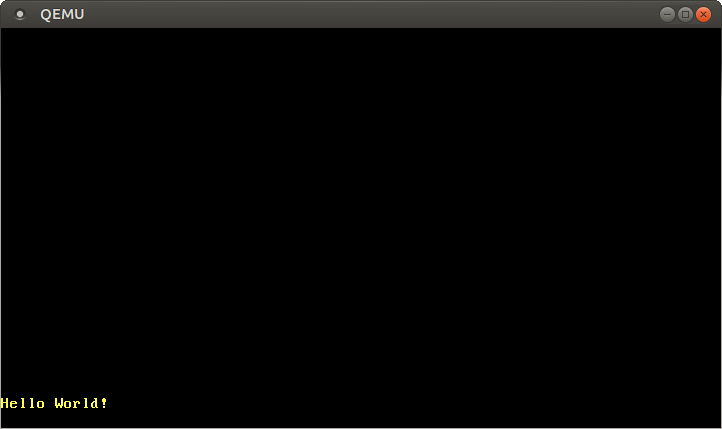
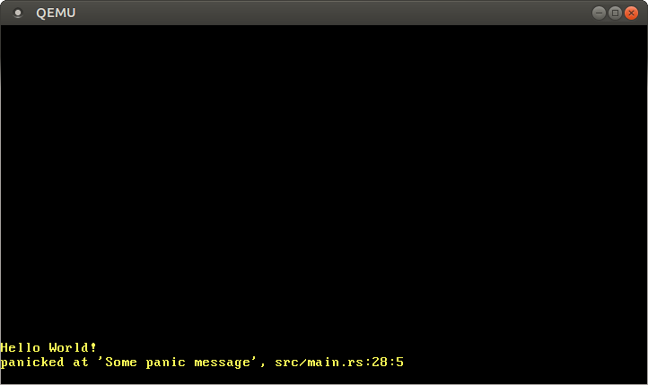

+++
title = "وضع نص VGA"
weight = 3
path = "ar/vga-text-mode"
date  = 2018-02-26

[extra]
chapter = "Bare Bones"
# Please update this when updating the translation
translation_based_on_commit = "087a464ed77361cff6c459fb42fc655cb9eacbea"
# GitHub usernames of the people that translated this post
translators = ["mindfreq"]
rtl = true
+++

[وضع نص VGA][VGA text mode] هو طريقة بسيطة لطباعة النص على الشاشة. في هذا المنشور، ننشئ واجهة تجعل استخدامه آمناً وبسيطاً عن طريق تغليف كل الكود غير الآمن في وحدة منفصلة. كما ننفّذ دعماً لـ[ماكرو التنسيق][formatting macros] في Rust.

[VGA text mode]: https://en.wikipedia.org/wiki/VGA-compatible_text_mode
[formatting macros]: https://doc.rust-lang.org/std/fmt/#related-macros

<!-- more -->

تم تطوير هذه المدونة بشكل مفتوح على [GitHub]. إذا كان لديك أي مشاكل أو أسئلة، يرجى فتح issue هناك. يمكنك أيضاً ترك تعليقات [في الأسفل]. يمكن العثور على الشيفرة المصدرية الكاملة لهذا المنشور في فرع [`post-03`][post branch].

[GitHub]: https://github.com/phil-opp/blog_os
[في الأسفل]: #comments
<!-- fix for zola anchor checker (target is in template): <a id="comments"> -->
[post branch]: https://github.com/phil-opp/blog_os/tree/post-03

<!-- toc -->

## The VGA Text Buffer

لطباعة حرف على الشاشة في وضع نص VGA، يجب كتابته في مخزن النص الخاص بعتاد VGA. مخزن نص VGA هو مصفوفة ثنائية الأبعاد تتكون عادةً من 25 صفاً و80 عموداً، وتُعرض مباشرةً على الشاشة. يصف كل إدخال في المصفوفة حرفاً واحداً على الشاشة وفق التنسيق التالي:

| البت(ات) | القيمة              |
| -------- | ------------------- |
| 0-7      | نقطة رمز ASCII      |
| 8-11     | لون المقدمة         |
| 12-14    | لون الخلفية         |
| 15       | وميض                |

يمثل البايت الأول الحرف الذي يجب طباعته بـ[ترميز ASCII][ASCII encoding]. لنكون أكثر دقة، هو ليس ASCII تماماً، بل مجموعة أحرف تُسمى [_code page 437_] مع بعض الأحرف الإضافية والتعديلات الطفيفة. للتبسيط، سنستمر في تسميته حرف ASCII في هذا المنشور.

[ASCII encoding]: https://en.wikipedia.org/wiki/ASCII
[_code page 437_]: https://en.wikipedia.org/wiki/Code_page_437

يحدد البايت الثاني كيفية عرض الحرف. تحدد الأربعة بتات الأولى لون المقدمة، والثلاثة بتات التالية لون الخلفية، والبت الأخير ما إذا كان الحرف يجب أن يومض. الألوان المتاحة هي:

| الرقم | اللون       | الرقم + بت السطوع | اللون الساطع  |
| ----- | ----------- | ----------------- | ------------- |
| 0x0   | أسود        | 0x8               | رمادي غامق    |
| 0x1   | أزرق        | 0x9               | أزرق فاتح     |
| 0x2   | أخضر        | 0xa               | أخضر فاتح     |
| 0x3   | سماوي       | 0xb               | سماوي فاتح    |
| 0x4   | أحمر        | 0xc               | أحمر فاتح     |
| 0x5   | أرجواني     | 0xd               | وردي          |
| 0x6   | بني         | 0xe               | أصفر          |
| 0x7   | رمادي فاتح  | 0xf               | أبيض          |

البت 4 هو _بت السطوع_، الذي يحول مثلاً الأزرق إلى أزرق فاتح. بالنسبة للون الخلفية، يُعاد توظيف هذا البت كبت وميض.

مخزن نص VGA متاح عبر [إدخال/إخراج مرتبط بالذاكرة][memory-mapped I/O] على العنوان `0xb8000`. هذا يعني أن القراءات والكتابات على هذا العنوان لا تصل إلى ذاكرة الوصول العشوائي (RAM) بل تصل مباشرةً إلى مخزن النص على عتاد VGA. وهذا يعني أنه يمكننا قراءته وكتابته من خلال عمليات الذاكرة العادية على ذلك العنوان.

[memory-mapped I/O]: https://en.wikipedia.org/wiki/Memory-mapped_I/O

لاحظ أن عتاد الذاكرة المرتبطة قد لا يدعم جميع عمليات RAM العادية. على سبيل المثال، قد يدعم الجهاز فقط القراءات بايت بايت ويعيد بيانات عشوائية عند قراءة `u64`. لحسن الحظ، يدعم مخزن النص [القراءات والكتابات العادية][supports normal reads and writes]، لذا لا يتعين علينا معاملته بطريقة خاصة.

[supports normal reads and writes]: https://web.stanford.edu/class/cs140/projects/pintos/specs/freevga/vga/vgamem.htm#manip

## A Rust Module

الآن بعد أن عرفنا كيف يعمل مخزن VGA، يمكننا إنشاء وحدة Rust للتعامل مع الطباعة:

```rust
// in src/main.rs
mod vga_buffer;
```

لمحتوى هذه الوحدة، ننشئ ملف `src/vga_buffer.rs` جديداً. كل الكود أدناه يدخل في وحدتنا الجديدة (ما لم يُحدد غير ذلك).

### Colors

أولاً، نمثل الألوان المختلفة باستخدام enum:

```rust
// in src/vga_buffer.rs

#[allow(dead_code)]
#[derive(Debug, Clone, Copy, PartialEq, Eq)]
#[repr(u8)]
pub enum Color {
    Black = 0,
    Blue = 1,
    Green = 2,
    Cyan = 3,
    Red = 4,
    Magenta = 5,
    Brown = 6,
    LightGray = 7,
    DarkGray = 8,
    LightBlue = 9,
    LightGreen = 10,
    LightCyan = 11,
    LightRed = 12,
    Pink = 13,
    Yellow = 14,
    White = 15,
}
```

نستخدم [enum شبيه بـC][C-like enum] هنا لتحديد الرقم لكل لون صراحةً. بسبب سمة `repr(u8)`، يُخزَّن كل متغير من متغيرات الـenum كـ`u8`. في الواقع، 4 بتات ستكون كافية، لكن Rust لا يمتلك نوع `u4`.

[C-like enum]: https://doc.rust-lang.org/rust-by-example/custom_types/enum/c_like.html

عادةً ما يصدر المترجم تحذيراً لكل متغير غير مستخدم. باستخدام سمة `#[allow(dead_code)]`، نعطّل هذه التحذيرات لـenum الـ`Color`.

عن طريق [اشتقاق][deriving] صفات [`Copy`] و[`Clone`] و[`Debug`] و[`PartialEq`] و[`Eq`]، نُمكّن [دلالات النسخ][copy semantics] للنوع ونجعله قابلاً للطباعة والمقارنة.

[deriving]: https://doc.rust-lang.org/rust-by-example/trait/derive.html
[`Copy`]: https://doc.rust-lang.org/nightly/core/marker/trait.Copy.html
[`Clone`]: https://doc.rust-lang.org/nightly/core/clone/trait.Clone.html
[`Debug`]: https://doc.rust-lang.org/nightly/core/fmt/trait.Debug.html
[`PartialEq`]: https://doc.rust-lang.org/nightly/core/cmp/trait.PartialEq.html
[`Eq`]: https://doc.rust-lang.org/nightly/core/cmp/trait.Eq.html
[copy semantics]: https://doc.rust-lang.org/1.30.0/book/first-edition/ownership.html#copy-types

لتمثيل رمز لون كامل يحدد لوني المقدمة والخلفية، ننشئ [newtype] فوق `u8`:

[newtype]: https://doc.rust-lang.org/rust-by-example/generics/new_types.html

```rust
// in src/vga_buffer.rs

#[derive(Debug, Clone, Copy, PartialEq, Eq)]
#[repr(transparent)]
struct ColorCode(u8);

impl ColorCode {
    fn new(foreground: Color, background: Color) -> ColorCode {
        ColorCode((background as u8) << 4 | (foreground as u8))
    }
}
```

تحتوي بنية `ColorCode` على بايت اللون الكامل الذي يتضمن لوني المقدمة والخلفية. كما من قبل، نشتق صفتَي `Copy` و`Debug` لها. لضمان أن `ColorCode` يمتلك نفس تخطيط البيانات تماماً كـ`u8`، نستخدم سمة [`repr(transparent)`].

[`repr(transparent)`]: https://doc.rust-lang.org/nomicon/other-reprs.html#reprtransparent

### Text Buffer

الآن يمكننا إضافة بنيات لتمثيل حرف الشاشة ومخزن النص:

```rust
// in src/vga_buffer.rs

#[derive(Debug, Clone, Copy, PartialEq, Eq)]
#[repr(C)]
struct ScreenChar {
    ascii_character: u8,
    color_code: ColorCode,
}

const BUFFER_HEIGHT: usize = 25;
const BUFFER_WIDTH: usize = 80;

#[repr(transparent)]
struct Buffer {
    chars: [[ScreenChar; BUFFER_WIDTH]; BUFFER_HEIGHT],
}
```

نظراً لأن ترتيب الحقول في البنيات الافتراضية غير محدد في Rust، نحتاج إلى سمة [`repr(C)`]. إذ تضمن أن حقول البنية مرتّبة تماماً كما في بنية C، وبالتالي تضمن الترتيب الصحيح للحقول. بالنسبة لبنية `Buffer`، نستخدم [`repr(transparent)`] مرة أخرى لضمان أنها تمتلك نفس تخطيط الذاكرة لحقلها الوحيد.

[`repr(C)`]: https://doc.rust-lang.org/nightly/nomicon/other-reprs.html#reprc

للكتابة الفعلية على الشاشة، ننشئ الآن نوع writer:

```rust
// in src/vga_buffer.rs

pub struct Writer {
    column_position: usize,
    color_code: ColorCode,
    buffer: &'static mut Buffer,
}
```

سيكتب الـwriter دائماً في آخر سطر ويزيح الأسطر للأعلى عندما يمتلئ السطر (أو عند `\n`). يتتبع حقل `column_position` الموضع الحالي في الصف الأخير. يحدد `color_code` ألوان المقدمة والخلفية الحالية، ويُخزَّن مرجع إلى مخزن VGA في `buffer`. لاحظ أننا نحتاج إلى [عمر صريح][explicit lifetime] هنا لإخبار المترجم بمدة صلاحية المرجع. يحدد عمر [`'static`] أن المرجع صالح طوال وقت تشغيل البرنامج بأكمله (وهو صحيح لمخزن نص VGA).

[explicit lifetime]: https://doc.rust-lang.org/book/ch10-03-lifetime-syntax.html#lifetime-annotation-syntax
[`'static`]: https://doc.rust-lang.org/book/ch10-03-lifetime-syntax.html#the-static-lifetime

### Printing

الآن يمكننا استخدام `Writer` لتعديل أحرف المخزن. أولاً ننشئ دالة لكتابة بايت ASCII واحد:

```rust
// in src/vga_buffer.rs

impl Writer {
    pub fn write_byte(&mut self, byte: u8) {
        match byte {
            b'\n' => self.new_line(),
            byte => {
                if self.column_position >= BUFFER_WIDTH {
                    self.new_line();
                }

                let row = BUFFER_HEIGHT - 1;
                let col = self.column_position;

                let color_code = self.color_code;
                self.buffer.chars[row][col] = ScreenChar {
                    ascii_character: byte,
                    color_code,
                };
                self.column_position += 1;
            }
        }
    }

    fn new_line(&mut self) {/* TODO */}
}
```

إذا كان البايت هو بايت [السطر الجديد][newline] `\n`، فإن الـwriter لا يطبع شيئاً. بدلاً من ذلك، يستدعي دالة `new_line` التي سننفذها لاحقاً. تُطبع البايتات الأخرى على الشاشة في حالة `match` الثانية.

[newline]: https://en.wikipedia.org/wiki/Newline

عند طباعة بايت، يتحقق الـwriter مما إذا كان السطر الحالي ممتلئاً. في هذه الحالة، يُستخدم استدعاء `new_line` لالتفاف السطر. ثم يكتب `ScreenChar` جديداً في المخزن عند الموضع الحالي. أخيراً، يتقدم موضع العمود الحالي.

لطباعة سلاسل كاملة، يمكننا تحويلها إلى بايتات وطباعتها واحدة تلو الأخرى:

```rust
// in src/vga_buffer.rs

impl Writer {
    pub fn write_string(&mut self, s: &str) {
        for byte in s.bytes() {
            match byte {
                // printable ASCII byte or newline
                0x20..=0x7e | b'\n' => self.write_byte(byte),
                // not part of printable ASCII range
                _ => self.write_byte(0xfe),
            }

        }
    }
}
```

يدعم مخزن نص VGA فقط ASCII والبايتات الإضافية لـ[code page 437]. سلاسل Rust هي [UTF-8] بشكل افتراضي، لذا قد تحتوي على بايتات غير مدعومة بمخزن نص VGA. نستخدم `match` للتمييز بين بايتات ASCII القابلة للطباعة (سطر جديد أو أي شيء بين حرف المسافة وحرف `~`) والبايتات غير القابلة للطباعة. بالنسبة للبايتات غير القابلة للطباعة، نطبع حرف `■` الذي يمتلك الرمز السداسي `0xfe` على عتاد VGA.

[code page 437]: https://en.wikipedia.org/wiki/Code_page_437
[UTF-8]: https://www.fileformat.info/info/unicode/utf8.htm

#### Try it out!

لكتابة بعض الأحرف على الشاشة، يمكنك إنشاء دالة مؤقتة:

```rust
// in src/vga_buffer.rs

pub fn print_something() {
    let mut writer = Writer {
        column_position: 0,
        color_code: ColorCode::new(Color::Yellow, Color::Black),
        buffer: unsafe { &mut *(0xb8000 as *mut Buffer) },
    };

    writer.write_byte(b'H');
    writer.write_string("ello ");
    writer.write_string("Wörld!");
}
```

أولاً تنشئ `Writer` جديداً يشير إلى مخزن VGA عند `0xb8000`. قد تبدو صياغة هذا غريبة بعض الشيء: أولاً، نُحوِّل العدد الصحيح `0xb8000` إلى [مؤشر خام][raw pointer] قابل للتعديل. ثم نحوله إلى مرجع قابل للتعديل عن طريق إلغاء مرجعيته (عبر `*`) واستعارته مباشرةً (عبر `&mut`). يتطلب هذا التحويل [كتلة `unsafe`][`unsafe` block]، لأن المترجم لا يستطيع ضمان صلاحية المؤشر الخام.

[raw pointer]: https://doc.rust-lang.org/book/ch20-01-unsafe-rust.html#dereferencing-a-raw-pointer
[`unsafe` block]: https://doc.rust-lang.org/book/ch19-01-unsafe-rust.html

ثم تكتب البايت `b'H'` فيه. البادئة `b` تنشئ [حرفاً حرفياً للبايت][byte literal]، الذي يمثل حرف ASCII. بكتابة السلاسل `"ello "` و`"Wörld!"`, نختبر دالة `write_string` ومعالجة الأحرف غير القابلة للطباعة. لرؤية الإخراج، نحتاج إلى استدعاء دالة `print_something` من دالة `_start`:

```rust
// in src/main.rs

#[unsafe(no_mangle)]
pub extern "C" fn _start() -> ! {
    vga_buffer::print_something();

    loop {}
}
```

عند تشغيل مشروعنا الآن، يجب أن يُطبع `Hello W■■rld!` في الزاوية _السفلية اليسرى_ من الشاشة باللون الأصفر:

[byte literal]: https://doc.rust-lang.org/reference/tokens.html#byte-literals


لاحظ أن `ö` تُطبع كحرفَي `■`. ذلك لأن `ö` تُمثَّل ببايتين في [UTF-8]، وكلاهما لا يقعان ضمن نطاق ASCII القابل للطباعة. في الواقع، هذه خاصية أساسية لـUTF-8: بايتات القيم متعددة البايتات ليست أبداً ASCII صالحة.

### Volatile

رأينا للتو أن رسالتنا طُبعت بشكل صحيح. ومع ذلك، قد لا تعمل مع مترجمات Rust المستقبلية التي تُحسِّن بشكل أكثر عدوانية.

المشكلة هي أننا نكتب فقط إلى `Buffer` ولا نقرأ منه مرةً أخرى أبداً. المترجم لا يعلم أننا نصل فعلاً إلى ذاكرة مخزن VGA (بدلاً من RAM العادية) ولا يعلم شيئاً عن التأثير الجانبي المتمثل في ظهور بعض الأحرف على الشاشة. لذا قد يقرر أن هذه الكتابات غير ضرورية ويمكن حذفها. لتجنب هذا التحسين الخاطئ، نحتاج إلى تحديد هذه الكتابات كـ_[volatile]_. هذا يخبر المترجم أن الكتابة لها آثار جانبية ولا يجب تحسينها.

[volatile]: https://en.wikipedia.org/wiki/Volatile_(computer_programming)

لاستخدام الكتابات volatile لمخزن VGA، نستخدم مكتبة [volatile][volatile crate]. يوفر هذا الـcrate نوع wrapper هو `Volatile` مع دوال `read` و`write`. تستخدم هذه الدوال داخلياً دالتَي [read_volatile] و[write_volatile] من مكتبة core وبالتالي تضمن عدم تحسين القراءات/الكتابات.

[volatile crate]: https://docs.rs/volatile
[read_volatile]: https://doc.rust-lang.org/nightly/core/ptr/fn.read_volatile.html
[write_volatile]: https://doc.rust-lang.org/nightly/core/ptr/fn.write_volatile.html

يمكننا إضافة تبعية على crate الـ`volatile` بإضافته إلى قسم `dependencies` في `Cargo.toml`:

```toml
# in Cargo.toml

[dependencies]
volatile = "0.2.6"
```

تأكد من تحديد إصدار `volatile` الإصدار `0.2.6`. الإصدارات الأحدث من الـcrate غير متوافقة مع هذا المنشور. `0.2.6` هو رقم الإصدار [الدلالي][semantic]. لمزيد من المعلومات، راجع دليل [تحديد التبعيات][Specifying Dependencies] في وثائق cargo.

[semantic]: https://semver.org/
[Specifying Dependencies]: https://doc.crates.io/specifying-dependencies.html

دعنا نستخدمه لجعل الكتابات إلى مخزن VGA volatile. نحدّث نوع `Buffer` كالتالي:

```rust
// in src/vga_buffer.rs

use volatile::Volatile;

struct Buffer {
    chars: [[Volatile<ScreenChar>; BUFFER_WIDTH]; BUFFER_HEIGHT],
}
```

بدلاً من `ScreenChar`، نستخدم الآن `Volatile<ScreenChar>`. (نوع `Volatile` هو [generic] ويمكنه تغليف أي نوع تقريباً). هذا يضمن أننا لا نستطيع الكتابة فيه "بشكل عادي" عن طريق الخطأ. بدلاً من ذلك، يجب علينا الآن استخدام دالة `write`.

[generic]: https://doc.rust-lang.org/book/ch10-01-syntax.html

هذا يعني أننا يجب أن نحدّث دالة `Writer::write_byte`:

```rust
// in src/vga_buffer.rs

impl Writer {
    pub fn write_byte(&mut self, byte: u8) {
        match byte {
            b'\n' => self.new_line(),
            byte => {
                ...

                self.buffer.chars[row][col].write(ScreenChar {
                    ascii_character: byte,
                    color_code,
                });
                ...
            }
        }
    }
    ...
}
```

بدلاً من الإسناد النموذجي باستخدام `=`، نستخدم الآن دالة `write`. الآن يمكننا ضمان أن المترجم لن يُحسِّن هذه الكتابة أبداً.

### Formatting Macros

سيكون من الجيد دعم ماكرو التنسيق في Rust أيضاً. بهذه الطريقة، يمكننا بسهولة طباعة أنواع مختلفة، مثل الأعداد الصحيحة أو الأعداد العشرية. لدعمها، نحتاج إلى تنفيذ صفة [`core::fmt::Write`]. الدالة الوحيدة المطلوبة لهذه الصفة هي `write_str`، التي تبدو مشابهة جداً لدالة `write_string` الخاصة بنا، فقط مع نوع إرجاع `fmt::Result`:

[`core::fmt::Write`]: https://doc.rust-lang.org/nightly/core/fmt/trait.Write.html

```rust
// in src/vga_buffer.rs

use core::fmt;

impl fmt::Write for Writer {
    fn write_str(&mut self, s: &str) -> fmt::Result {
        self.write_string(s);
        Ok(())
    }
}
```

`Ok(())` هو مجرد نتيجة `Ok` تحتوي على النوع `()`.

الآن يمكننا استخدام ماكرو التنسيق المدمجة في Rust وهي `write!`/`writeln!`:

```rust
// in src/vga_buffer.rs

pub fn print_something() {
    use core::fmt::Write;
    let mut writer = Writer {
        column_position: 0,
        color_code: ColorCode::new(Color::Yellow, Color::Black),
        buffer: unsafe { &mut *(0xb8000 as *mut Buffer) },
    };

    writer.write_byte(b'H');
    writer.write_string("ello! ");
    write!(writer, "The numbers are {} and {}", 42, 1.0/3.0).unwrap();
}
```

الآن يجب أن ترى `Hello! The numbers are 42 and 0.3333333333333333` في أسفل الشاشة. يعيد استدعاء `write!` نتيجة `Result` مما يسبب تحذيراً إذا لم تُستخدم، لذا نستدعي دالة [`unwrap`] عليها، والتي تتسبب في panic إذا حدث خطأ. هذا ليس مشكلة في حالتنا، لأن الكتابات إلى مخزن VGA لا تفشل أبداً.

[`unwrap`]: https://doc.rust-lang.org/core/result/enum.Result.html#method.unwrap

### Newlines

في الوقت الحالي، نتجاهل الأسطر الجديدة والأحرف التي لم تعد تتسع في السطر. بدلاً من ذلك، نريد تحريك كل حرف سطراً واحداً للأعلى (يُحذف السطر العلوي) والبدء من بداية السطر الأخير مرة أخرى. للقيام بذلك، نضيف تنفيذاً لدالة `new_line` في `Writer`:

```rust
// in src/vga_buffer.rs

impl Writer {
    fn new_line(&mut self) {
        for row in 1..BUFFER_HEIGHT {
            for col in 0..BUFFER_WIDTH {
                let character = self.buffer.chars[row][col].read();
                self.buffer.chars[row - 1][col].write(character);
            }
        }
        self.clear_row(BUFFER_HEIGHT - 1);
        self.column_position = 0;
    }

    fn clear_row(&mut self, row: usize) {/* TODO */}
}
```

نكرر على جميع أحرف الشاشة ونحرك كل حرف صفاً واحداً للأعلى. لاحظ أن الحد العلوي لصيغة النطاق (`..`) حصري. نحذف أيضاً الصف رقم 0 (النطاق الأول يبدأ من `1`) لأنه الصف الذي يُزاح خارج الشاشة.

لإكمال كود السطر الجديد، نضيف دالة `clear_row`:

```rust
// in src/vga_buffer.rs

impl Writer {
    fn clear_row(&mut self, row: usize) {
        let blank = ScreenChar {
            ascii_character: b' ',
            color_code: self.color_code,
        };
        for col in 0..BUFFER_WIDTH {
            self.buffer.chars[row][col].write(blank);
        }
    }
}
```

تمسح هذه الدالة صفاً بالكتابة فوق جميع أحرفه بحرف مسافة.

## A Global Interface

لتوفير writer عام يمكن استخدامه كواجهة من وحدات أخرى دون حمل نسخة `Writer`، نحاول إنشاء `WRITER` ثابت (static):

```rust
// in src/vga_buffer.rs

pub static WRITER: Writer = Writer {
    column_position: 0,
    color_code: ColorCode::new(Color::Yellow, Color::Black),
    buffer: unsafe { &mut *(0xb8000 as *mut Buffer) },
};
```

ومع ذلك، إذا حاولنا تجميعه الآن، تحدث الأخطاء التالية:

```
error[E0015]: calls in statics are limited to constant functions, tuple structs and tuple variants
 --> src/vga_buffer.rs:7:17
  |
7 |     color_code: ColorCode::new(Color::Yellow, Color::Black),
  |                 ^^^^^^^^^^^^^^^^^^^^^^^^^^^^^^^^^^^^^^^^^^^

error[E0396]: raw pointers cannot be dereferenced in statics
 --> src/vga_buffer.rs:8:22
  |
8 |     buffer: unsafe { &mut *(0xb8000 as *mut Buffer) },
  |                      ^^^^^^^^^^^^^^^^^^^^^^^^^^^^^^ dereference of raw pointer in constant

error[E0017]: references in statics may only refer to immutable values
 --> src/vga_buffer.rs:8:22
  |
8 |     buffer: unsafe { &mut *(0xb8000 as *mut Buffer) },
  |                      ^^^^^^^^^^^^^^^^^^^^^^^^^^^^^^ statics require immutable values

error[E0017]: references in statics may only refer to immutable values
 --> src/vga_buffer.rs:8:13
  |
8 |     buffer: unsafe { &mut *(0xb8000 as *mut Buffer) },
  |             ^^^^^^^^^^^^^^^^^^^^^^^^^^^^^^^^^^^^^^^^^ statics require immutable values
```

لفهم ما يحدث هنا، نحتاج إلى معرفة أن المتغيرات الثابتة (statics) تتهيأ في وقت التجميع، على عكس المتغيرات العادية التي تتهيأ في وقت التشغيل. المكوِّن في مترجم Rust الذي يُقيِّم تعبيرات التهيئة هذه يُسمى "[مُقيِّم const][const evaluator]". لا تزال وظائفه محدودة، لكن هناك عمل جارٍ لتوسيعها، مثلاً في RFC "[السماح بـpanic في الثوابت][Allow panicking in constants]".

[const evaluator]: https://rustc-dev-guide.rust-lang.org/const-eval.html
[Allow panicking in constants]: https://github.com/rust-lang/rfcs/pull/2345

يمكن حل مشكلة `ColorCode::new` باستخدام [دوال `const`][`const` functions]، لكن المشكلة الجوهرية هنا هي أن مُقيِّم const في Rust غير قادر على تحويل المؤشرات الخام إلى مراجع في وقت التجميع. ربما سيعمل يوماً ما، لكن حتى ذلك الحين، علينا إيجاد حل آخر.

[`const` functions]: https://doc.rust-lang.org/reference/const_eval.html#const-functions

### Lazy Statics

التهيئة لمرة واحدة للمتغيرات الثابتة بدوال غير const مشكلة شائعة في Rust. لحسن الحظ، يوجد بالفعل حل جيد في crate يُسمى [lazy_static]. يوفر هذا الـcrate ماكرو `lazy_static!` الذي يعرّف `static` يتهيأ بشكل كسول. بدلاً من حساب قيمته في وقت التجميع، يتهيأ الـ`static` بشكل كسول عند الوصول إليه للمرة الأولى. وبالتالي، تحدث التهيئة في وقت التشغيل، لذا يمكن استخدام كود تهيئة معقد تعقيداً اعتباطياً.

[lazy_static]: https://docs.rs/lazy_static/1.0.1/lazy_static/

لنضيف crate الـ`lazy_static` إلى مشروعنا:

```toml
# in Cargo.toml

[dependencies.lazy_static]
version = "1.0"
features = ["spin_no_std"]
```

نحتاج إلى ميزة `spin_no_std`، لأننا لا نربط المكتبة القياسية.

مع `lazy_static`، يمكننا تعريف `WRITER` الثابت بدون مشاكل:

```rust
// in src/vga_buffer.rs

use lazy_static::lazy_static;

lazy_static! {
    pub static ref WRITER: Writer = Writer {
        column_position: 0,
        color_code: ColorCode::new(Color::Yellow, Color::Black),
        buffer: unsafe { &mut *(0xb8000 as *mut Buffer) },
    };
}
```

ومع ذلك، هذا `WRITER` عديم الفائدة إلى حد ما لأنه غير قابل للتعديل. هذا يعني أننا لا نستطيع كتابة أي شيء فيه (نظراً لأن جميع دوال الكتابة تأخذ `&mut self`). أحد الحلول الممكنة سيكون استخدام [static قابل للتعديل][mutable static]. لكن عندها كل قراءة وكتابة فيه ستكون غير آمنة لأنها يمكن أن تُدخل بسهولة سباقات البيانات (data races) وأشياء سيئة أخرى. استخدام `static mut` مثبَّط بشدة. كان هناك حتى مقترحات [لإزالته][remove static mut]. لكن ما هي البدائل؟ يمكننا محاولة استخدام static غير قابل للتعديل مع نوع cell مثل [RefCell] أو حتى [UnsafeCell] الذي يوفر [قابلية التعديل الداخلية][interior mutability]. لكن هذه الأنواع ليست [Sync] (لسبب وجيه)، لذا لا يمكننا استخدامها في المتغيرات الثابتة.

[mutable static]: https://doc.rust-lang.org/book/ch20-01-unsafe-rust.html#accessing-or-modifying-a-mutable-static-variable
[remove static mut]: https://internals.rust-lang.org/t/pre-rfc-remove-static-mut/1437
[RefCell]: https://doc.rust-lang.org/book/ch15-05-interior-mutability.html#keeping-track-of-borrows-at-runtime-with-refcellt
[UnsafeCell]: https://doc.rust-lang.org/nightly/core/cell/struct.UnsafeCell.html
[interior mutability]: https://doc.rust-lang.org/book/ch15-05-interior-mutability.html
[Sync]: https://doc.rust-lang.org/nightly/core/marker/trait.Sync.html

### Spinlocks

للحصول على قابلية تعديل داخلية متزامنة، يمكن لمستخدمي المكتبة القياسية استخدام [Mutex]. يوفر استبعاداً متبادلاً عن طريق حجب الخيوط عندما تكون الموارد مقفلة بالفعل. لكن نواتنا الأساسية لا تمتلك أي دعم للحجب أو حتى مفهوم الخيوط، لذا لا يمكننا استخدامه أيضاً. ومع ذلك، هناك نوع أساسي جداً من mutex في علم الحاسوب لا يتطلب ميزات نظام تشغيل: [الـspinlock]. بدلاً من الحجب، تحاول الخيوط ببساطة قفله مراراً وتكراراً في حلقة مستمرة، وبالتالي تستهلك وقت المعالج حتى يصبح الـmutex حراً مرة أخرى.

[Mutex]: https://doc.rust-lang.org/nightly/std/sync/struct.Mutex.html
[الـspinlock]: https://en.wikipedia.org/wiki/Spinlock

لاستخدام spinning mutex، يمكننا إضافة [crate الـspin][spin crate] كتبعية:

[spin crate]: https://crates.io/crates/spin

```toml
# in Cargo.toml
[dependencies]
spin = "0.5.2"
```

ثم يمكننا استخدام spinning mutex لإضافة [قابلية تعديل داخلية][interior mutability] آمنة إلى `WRITER` الثابت:

```rust
// in src/vga_buffer.rs

use spin::Mutex;
...
lazy_static! {
    pub static ref WRITER: Mutex<Writer> = Mutex::new(Writer {
        column_position: 0,
        color_code: ColorCode::new(Color::Yellow, Color::Black),
        buffer: unsafe { &mut *(0xb8000 as *mut Buffer) },
    });
}
```

الآن يمكننا حذف دالة `print_something` والطباعة مباشرةً من دالة `_start`:

```rust
// in src/main.rs
#[unsafe(no_mangle)]
pub extern "C" fn _start() -> ! {
    use core::fmt::Write;
    vga_buffer::WRITER.lock().write_str("Hello again").unwrap();
    write!(vga_buffer::WRITER.lock(), ", some numbers: {} {}", 42, 1.337).unwrap();

    loop {}
}
```

نحتاج إلى استيراد صفة `fmt::Write` لكي نتمكن من استخدام دوالها.

### Safety

لاحظ أن لدينا كتلة `unsafe` واحدة فقط في كودنا، وهي مطلوبة لإنشاء مرجع `Buffer` يشير إلى `0xb8000`. بعد ذلك، جميع العمليات آمنة. يستخدم Rust فحص الحدود للوصول إلى المصفوفات بشكل افتراضي، لذا لا يمكننا الكتابة عن طريق الخطأ خارج المخزن. وبالتالي، قمنا بترميز الشروط المطلوبة في نظام النوع وأصبحنا قادرين على توفير واجهة آمنة للخارج.

### A println Macro

الآن بعد أن أصبح لدينا writer عام، يمكننا إضافة ماكرو `println` يمكن استخدامه من أي مكان في قاعدة الكود. [صيغة ماكرو][macro syntax] Rust غريبة بعض الشيء، لذا لن نحاول كتابة ماكرو من الصفر. بدلاً من ذلك، ننظر إلى مصدر [ماكرو `println!`][`println!` macro] في المكتبة القياسية:

[macro syntax]: https://doc.rust-lang.org/nightly/book/ch20-05-macros.html#declarative-macros-for-general-metaprogramming
[`println!` macro]: https://doc.rust-lang.org/nightly/std/macro.println!.html

```rust
#[macro_export]
macro_rules! println {
    () => (print!("\n"));
    ($($arg:tt)*) => (print!("{}\n", format_args!($($arg)*)));
}
```

تُعرَّف الماكرو من خلال قاعدة أو أكثر، مشابهة لأذرع `match`. يمتلك ماكرو `println` قاعدتين: القاعدة الأولى للاستدعاءات بدون وسيطات، مثل `println!()`, والتي تتوسع إلى `print!("\n")` وبالتالي تطبع فقط سطراً جديداً. القاعدة الثانية للاستدعاءات مع معاملات مثل `println!("Hello")` أو `println!("Number: {}", 4)`. تتوسع أيضاً إلى استدعاء ماكرو `print!`, مع تمرير جميع الوسيطات وسطر جديد إضافي `\n` في النهاية.

سمة `#[macro_export]` تجعل الماكرو متاحاً لكامل الـcrate (وليس فقط الوحدة التي عُرِّف فيها) والـcrates الخارجية. كما تضع الماكرو في مساحة الاسم الجذرية للـcrate، مما يعني أننا يجب استيراد الماكرو عبر `use std::println` بدلاً من `std::macros::println`.

[ماكرو `print!`][`print!` macro] مُعرَّف كالتالي:

[`print!` macro]: https://doc.rust-lang.org/nightly/std/macro.print!.html

```rust
#[macro_export]
macro_rules! print {
    ($($arg:tt)*) => ($crate::io::_print(format_args!($($arg)*)));
}
```

يتوسع الماكرو إلى استدعاء [دالة `_print`][`_print` function] في وحدة `io`. [متغير `$crate`][`$crate` variable] يضمن أن الماكرو يعمل أيضاً من خارج crate الـ`std` عن طريق التوسع إلى `std` عند استخدامه في crates أخرى.

[ماكرو `format_args`][`format_args` macro] يبني نوع [fmt::Arguments] من الوسيطات الممررة، والتي تُمرَّر إلى `_print`. تستدعي [دالة `_print`][`_print` function] في libstd دالة `print_to`، وهي معقدة بعض الشيء لأنها تدعم أجهزة `Stdout` مختلفة. لسنا بحاجة إلى هذا التعقيد لأننا نريد فقط الطباعة إلى مخزن VGA.

[`_print` function]: https://github.com/rust-lang/rust/blob/29f5c699b11a6a148f097f82eaa05202f8799bbc/src/libstd/io/stdio.rs#L698
[`$crate` variable]: https://doc.rust-lang.org/1.30.0/book/first-edition/macros.html#the-variable-crate
[`format_args` macro]: https://doc.rust-lang.org/nightly/std/macro.format_args.html
[fmt::Arguments]: https://doc.rust-lang.org/nightly/core/fmt/struct.Arguments.html

للطباعة إلى مخزن VGA، نقوم فقط بنسخ ماكرو `println!` و`print!`، لكن نعدّلهما لاستخدام دالة `_print` الخاصة بنا:

```rust
// in src/vga_buffer.rs

#[macro_export]
macro_rules! print {
    ($($arg:tt)*) => ($crate::vga_buffer::_print(format_args!($($arg)*)));
}

#[macro_export]
macro_rules! println {
    () => ($crate::print!("\n"));
    ($($arg:tt)*) => ($crate::print!("{}\n", format_args!($($arg)*)));
}

#[doc(hidden)]
pub fn _print(args: fmt::Arguments) {
    use core::fmt::Write;
    WRITER.lock().write_fmt(args).unwrap();
}
```

أحد الأشياء التي غيّرناها من تعريف `println` الأصلي هو أننا أضفنا بادئة `$crate` لاستدعاءات ماكرو `print!` أيضاً. هذا يضمن أننا لسنا بحاجة إلى استيراد ماكرو `print!` أيضاً إذا أردنا فقط استخدام `println`.

كما في المكتبة القياسية، نضيف سمة `#[macro_export]` لكلا الماكرو لجعلهما متاحين في كل مكان في crate الخاص بنا. لاحظ أن هذا يضع الماكرو في مساحة الاسم الجذرية للـcrate، لذا استيرادهما عبر `use crate::vga_buffer::println` لن يعمل. بدلاً من ذلك، يجب علينا كتابة `use crate::println`.

تقفل دالة `_print` `WRITER` الثابت وتستدعي دالة `write_fmt` عليه. هذه الدالة من صفة `Write` التي نحتاج إلى استيرادها. `unwrap()` الإضافية في النهاية تتسبب في panic إذا فشلت الطباعة. لكن نظراً لأننا نعيد دائماً `Ok` في `write_str`، لا يجب أن يحدث ذلك.

نظراً لأن الماكرو يجب أن تكون قادرة على استدعاء `_print` من خارج الوحدة، يجب أن تكون الدالة عامة. ومع ذلك، نظراً لأننا نعتبر هذا تفصيلاً خاصاً بالتنفيذ، نضيف [سمة `doc(hidden)`][`doc(hidden)` attribute] لإخفائها من الوثائق المولّدة.

[`doc(hidden)` attribute]: https://doc.rust-lang.org/nightly/rustdoc/write-documentation/the-doc-attribute.html#hidden

### Hello World using `println`

الآن يمكننا استخدام `println` في دالة `_start`:

```rust
// in src/main.rs

#[unsafe(no_mangle)]
pub extern "C" fn _start() -> ! {
    println!("Hello World{}", "!");

    loop {}
}
```

لاحظ أننا لسنا بحاجة إلى استيراد الماكرو في الدالة الرئيسية، لأنه يعيش بالفعل في مساحة الاسم الجذرية.

كما هو متوقع، نرى الآن _"Hello World!"_ على الشاشة:



### Printing Panic Messages

الآن بعد أن أصبح لدينا ماكرو `println`، يمكننا استخدامه في دالة panic لطباعة رسالة الـpanic وموقعه:

```rust
// in main.rs

/// هذه الدالة تُستدعى عند حدوث panic
#[panic_handler]
fn panic(info: &PanicInfo) -> ! {
    println!("{}", info);
    loop {}
}
```

عندما ندرج الآن `panic!("Some panic message");` في دالة `_start`، نحصل على الإخراج التالي:



إذن نعلم ليس فقط أن panic قد حدث، بل أيضاً رسالة الـpanic والمكان في الكود الذي حدث فيه.

## Summary

في هذا المنشور، تعلمنا عن بنية مخزن نص VGA وكيف يمكن الكتابة إليه من خلال تعيين الذاكرة على العنوان `0xb8000`. أنشأنا وحدة Rust تُغلِّف عدم الأمان في الكتابة إلى هذا المخزن المرتبط بالذاكرة وتقدم واجهة آمنة ومريحة للخارج.

بفضل cargo، رأينا أيضاً مدى سهولة إضافة تبعيات على مكتبات طرف ثالث. التبعيتان اللتان أضفناهما، `lazy_static` و`spin`، مفيدتان جداً في تطوير أنظمة التشغيل وسنستخدمهما في المزيد من الأماكن في المنشورات المستقبلية.

## What's next?

يشرح المنشور التالي كيفية إعداد إطار اختبارات الوحدة المدمج في Rust. ثم سننشئ بعض اختبارات الوحدة الأساسية لوحدة مخزن VGA من هذا المنشور.