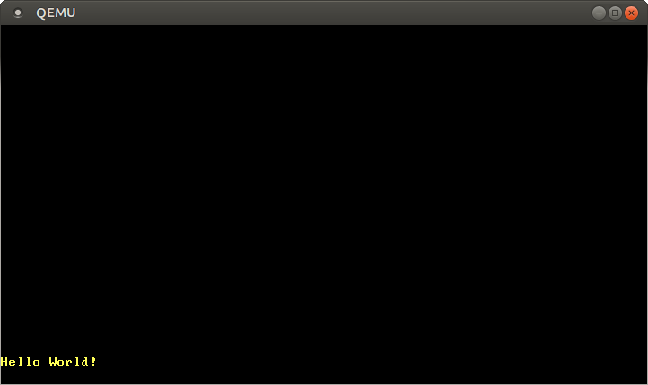

+++
title = "VGA 텍스트 모드"
weight = 3
path = "ko/vga-text-mode"
date  = 2018-02-26

[extra]
chapter = "Bare Bones"
# Please update this when updating the translation
translation_based_on_commit = "1c9b5edd6a5a667e282ca56d6103d3ff1fd7cfcb"
# GitHub usernames of the people that translated this post
translators = ["JOE1994", "Quqqu"]
+++

[VGA 텍스트 모드][VGA text mode]를 통해 쉽게 화면에 텍스트를 출력할 수 있습니다. 이 글에서는 안전하지 않은 작업들을 분리된 모듈에 격리해 쉽고 안전하게 VGA 텍스트 모드를 이용할 수 있는 인터페이스를 구현합니다. 또한 Rust의 [서식 정렬 매크로 (formatting macro)][formatting macros]에 대한 지원을 추가할 것입니다.

[VGA text mode]: https://en.wikipedia.org/wiki/VGA-compatible_text_mode
[formatting macros]: https://doc.rust-lang.org/std/fmt/#related-macros

<!-- more -->

이 블로그는 [GitHub 저장소][GitHub]에서 오픈 소스로 개발되고 있으니, 문제나 문의사항이 있다면 저장소의 'Issue' 기능을 이용해 제보해주세요. [페이지 맨 아래][at the bottom]에 댓글을 남기실 수도 있습니다. 이 포스트와 관련된 모든 소스 코드는 저장소의 [`post-03 브랜치`][post branch]에서 확인하실 수 있습니다.

[GitHub]: https://github.com/phil-opp/blog_os
[at the bottom]: #comments
<!-- fix for zola anchor checker (target is in template): <a id="comments"> -->
[post branch]: https://github.com/phil-opp/blog_os/tree/post-03

<!-- toc -->

## VGA 텍스트 버퍼
VGA 텍스트 모드에서 화면에 문자를 출력하려면 VGA 하드웨어의 텍스트 버퍼에 해당 문자를 저장해야 합니다. VGA 텍스트 버퍼는 보통 25행 80열 크기의 2차원 배열이며, 해당 버퍼에 저장된 값들은 즉시 화면에 렌더링 됩니다. 배열의 각 원소는 화면에 출력될 문자를 아래의 형식으로 표현합니다:

비트   | 값
------ | ----------------
0-7    | ASCII 코드
8-11   | 전경색
12-14  | 배경색
15     | 깜빡임 여부

첫 바이트는 [ASCII 인코딩][ASCII encoding]으로 출력될 문자를 나타냅니다. 엄밀히 따지자면 ASCII 인코딩이 아닌, 해당 인코딩에 문자들을 추가하고 살짝 변형한 [_code page 437_] 이라는 인코딩을 이용합니다. 설명을 간소화하기 위해 이하 본문에서는 그냥 ASCII 문자로 지칭하겠습니다.

[ASCII encoding]: https://en.wikipedia.org/wiki/ASCII
[_code page 437_]: https://en.wikipedia.org/wiki/Code_page_437

두 번째 바이트는 표현하는 문자가 어떻게 표시될 것인지를 정의합니다. 두 번째 바이트의 첫 4비트는 전경색을 나타내고, 그 다음 3비트는 배경색을 나타내며, 마지막 비트는 해당 문자가 화면에서 깜빡이도록 할지 결정합니다. 아래의 색상들을 이용할 수 있습니다:

숫자 값 | 색상       | 색상 + 밝기 조정 비트 | 밝기 조정 후 최종 색상
------ | ---------- | ------------------- | -------------
0x0    | Black      | 0x8                 | Dark Gray
0x1    | Blue       | 0x9                 | Light Blue
0x2    | Green      | 0xa                 | Light Green
0x3    | Cyan       | 0xb                 | Light Cyan
0x4    | Red        | 0xc                 | Light Red
0x5    | Magenta    | 0xd                 | Pink
0x6    | Brown      | 0xe                 | Yellow
0x7    | Light Gray | 0xf                 | White

두 번째 바이트의 네 번째 비트 (_밝기 조정 비트_)를 통해 파란색을 하늘색으로 조정하는 등 색의 밝기를 변경할 수 있습니다. 배경색을 지정하는 3비트 이후의 마지막 비트는 깜빡임 여부를 지정합니다.

[메모리 맵 입출력 (memory-mapped I/O)][memory-mapped I/O]으로 메모리 주소 `0xb8000`을 통해 VGA 텍스트 버퍼에 접근할 수 있습니다. 해당 주소에 읽기/쓰기 작업을 하면 RAM 대신 VGA 텍스트 버퍼에 직접 읽기/쓰기가 적용됩니다.

[memory-mapped I/O]: https://en.wikipedia.org/wiki/Memory-mapped_I/O

메모리 맵 입출력 적용 대상 하드웨어가 일부 RAM 작업을 지원하지 않을 가능성을 염두해야 합니다. 예를 들어, 바이트 단위 읽기만 지원하는 장치로부터 메모리 맵 입출력을 통해 `u64`를 읽어들일 경우 쓰레기 값이 반환될 수도 있습니다. 다행히 텍스트 버퍼는 [일반적인 읽기/쓰기 작업들을 모두 지원하기에][supports normal reads and writes] 읽기/쓰기를 위한 특수 처리가 필요하지 않습니다.

[supports normal reads and writes]: https://web.stanford.edu/class/cs140/projects/pintos/specs/freevga/vga/vgamem.htm#manip

## Rust 모듈
이제 VGA 버퍼가 어떻게 작동하는지 알았으니, 버퍼를 이용해 출력하는 것을 담당할 Rust 모듈을 만들어봅시다:

```rust
// in src/main.rs
mod vga_buffer;
```

새로운 모듈 `vga_buffer`를 위해 파일 `src/vga_buffer.rs`을 만듭니다. 이후 나타나는 모든 코드는 이 모듈에 들어갈 내용입니다 (별도의 지시 사항이 붙는 경우 제외).

### 색상
우선 enum을 이용하여 사용 가능한 여러 색상들을 표현합니다:

```rust
// in src/vga_buffer.rs

#[allow(dead_code)]
#[derive(Debug, Clone, Copy, PartialEq, Eq)]
#[repr(u8)]
pub enum Color {
    Black = 0,
    Blue = 1,
    Green = 2,
    Cyan = 3,
    Red = 4,
    Magenta = 5,
    Brown = 6,
    LightGray = 7,
    DarkGray = 8,
    LightBlue = 9,
    LightGreen = 10,
    LightCyan = 11,
    LightRed = 12,
    Pink = 13,
    Yellow = 14,
    White = 15,
}
```
각 색상마다 고유 숫자 값을 배정할 수 있도록 우리는 [C언어와 같은 enum][C-like enum]을 사용합니다. `repr(u8)` 속성 때문에 enum의 각 분류 값은 `u8` 타입으로 저장됩니다. 사실 저장 공간은 4 비트만으로도 충분하지만, Rust에는 `u4` 타입이 없습니다.

[C-like enum]: https://doc.rust-lang.org/rust-by-example/custom_types/enum/c_like.html

사용되지 않는 enum 분류 값이 있을 때마다 컴파일러는 불필요한 코드가 있다는 경고 메시지를 출력합니다. 하지만 위처럼 `#[allow(dead_code)]` 속성을 적용하면 `Color` enum에 대해서는 컴파일러가 해당 경고 메시지를 출력하지 않습니다.

`Color` 타입에 [`Copy`], [`Clone`], [`Debug`], [`PartialEq`] 그리고 [`Eq`] 트레이트들을 [구현 (derive)][deriving] 함으로써 `Color` 타입이 [copy semantics] 를 따르도록 하고 또한 `Color` 타입 변수를 출력하거나 두 `Color` 타입 변수를 서로 비교할 수 있도록 합니다.

[deriving]: https://doc.rust-lang.org/rust-by-example/trait/derive.html
[`Copy`]: https://doc.rust-lang.org/nightly/core/marker/trait.Copy.html
[`Clone`]: https://doc.rust-lang.org/nightly/core/clone/trait.Clone.html
[`Debug`]: https://doc.rust-lang.org/nightly/core/fmt/trait.Debug.html
[`PartialEq`]: https://doc.rust-lang.org/nightly/core/cmp/trait.PartialEq.html
[`Eq`]: https://doc.rust-lang.org/nightly/core/cmp/trait.Eq.html
[copy semantics]: https://doc.rust-lang.org/1.30.0/book/first-edition/ownership.html#copy-types

전경색과 배경색을 모두 표현할 수 있는 색상 코드를 표현하기 위해 `u8` 타입을 감싸는 [newtype]을 선언합니다:

[newtype]: https://doc.rust-lang.org/rust-by-example/generics/new_types.html

```rust
// in src/vga_buffer.rs

#[derive(Debug, Clone, Copy, PartialEq, Eq)]
#[repr(transparent)]
struct ColorCode(u8);

impl ColorCode {
    fn new(foreground: Color, background: Color) -> ColorCode {
        ColorCode((background as u8) << 4 | (foreground as u8))
    }
}
```
`ColorCode` 구조체는 전경색 및 배경색을 모두 표현하는 색상 바이트 전체의 정보를 지닙니다. 이전처럼 `Copy` 및 `Debug` 트레이트를 구현 (derive) 해줍니다. `ColorCode` 구조체가 메모리 상에서 `u8` 타입과 같은 저장 형태를 가지도록 [`repr(transparent)`] 속성을 적용합니다.

[`repr(transparent)`]: https://doc.rust-lang.org/nomicon/other-reprs.html#reprtransparent

### 텍스트 버퍼
스크린 상의 문자 및 텍스트 버퍼를 표현하는 구조체들을 아래와 같이 추가합니다:

```rust
// in src/vga_buffer.rs

#[derive(Debug, Clone, Copy, PartialEq, Eq)]
#[repr(C)]
struct ScreenChar {
    ascii_character: u8,
    color_code: ColorCode,
}

const BUFFER_HEIGHT: usize = 25;
const BUFFER_WIDTH: usize = 80;

#[repr(transparent)]
struct Buffer {
    chars: [[ScreenChar; BUFFER_WIDTH]; BUFFER_HEIGHT],
}
```
Rust에서는 구조체 정의 코드에서의 필드 정렬 순서와 메모리 상에서 구조체의 각 필드가 저장되는 순서가 동일하지 않을 수 있습니다. 구조체의 각 필드 정렬 순서가 컴파일 중에 바뀌지 않도록 하려면 [`repr(C)`] 속성이 필요합니다. 이 속성을 사용하면 C언어의 구조체처럼 컴파일러가 구조체 내 각 필드의 정렬 순서를 임의로 조정할 수 없게 되기에, 우리는 메모리 상에서 구조체의 각 필드가 어떤 순서로 저장되는지 확신할 수 있습니다. 또한 `Buffer` 구조체에 [`repr(transparent)`] 속성을 적용하여 메모리 상에서 해당 구조체가 저장되는 형태가 `chars` 필드의 저장 형태와 동일하도록 해줍니다.

[`repr(C)`]: https://doc.rust-lang.org/nightly/nomicon/other-reprs.html#reprc

이제 아래와 같은 Writer 타입을 만들어 실제로 화면에 출력하는 데에 이용할 것입니다:

```rust
// in src/vga_buffer.rs

pub struct Writer {
    column_position: usize,
    color_code: ColorCode,
    buffer: &'static mut Buffer,
}
```
Writer는 언제나 가장 마지막 행에 값을 작성할 것이며, 작성 중인 행이 꽉 차거나 개행문자를 입력받은 경우에는 작성 중이던 행을 마치고 새로운 행으로 넘어갈 것입니다. 전경색 및 배경색은 `color_code`를 통해 표현되고 `buffer`에 VGA 버퍼에 대한 레퍼런스를 저장합니다. `buffer`에 대한 레퍼런스가 유효한 기간을 컴파일러에게 알리기 위해서 [명시적인 lifetime][explicit lifetime]이 필요합니다. [`'static`] lifetime 표기는 VGA 버퍼에 대한 레퍼런스가 프로그램 실행 시간 내내 유효하다는 것을 명시합니다.

[explicit lifetime]: https://doc.rust-lang.org/book/ch10-03-lifetime-syntax.html#lifetime-annotation-syntax
[`'static`]: https://doc.rust-lang.org/book/ch10-03-lifetime-syntax.html#the-static-lifetime

### 출력하기
이제 `Writer`를 이용하여 VGA 버퍼에 저장된 문자들을 변경할 수 있게 되었습니다. 우선 아래와 같이 하나의 ASCII 바이트를 출력하는 함수를 만듭니다:

```rust
// in src/vga_buffer.rs

impl Writer {
    pub fn write_byte(&mut self, byte: u8) {
        match byte {
            b'\n' => self.new_line(),
            byte => {
                if self.column_position >= BUFFER_WIDTH {
                    self.new_line();
                }

                let row = BUFFER_HEIGHT - 1;
                let col = self.column_position;

                let color_code = self.color_code;
                self.buffer.chars[row][col] = ScreenChar {
                    ascii_character: byte,
                    color_code,
                };
                self.column_position += 1;
            }
        }
    }

    fn new_line(&mut self) {/* TODO */}
}
```
주어진 바이트 값이 [개행 문자][newline] `\n`일 경우, Writer는 아무것도 출력하지 않고 대신 `new_line` 함수 (아래에서 함께 구현할 예정)를 호출합니다. 다른 바이트 값들은 match문의 두 번째 패턴에 매치되어 화면에 출력됩니다.

[newline]: https://en.wikipedia.org/wiki/Newline

바이트를 출력할 때, Writer는 현재 행이 가득 찼는지 확인합니다. 현재 행이 가득 찬 경우, 개행을 위해 `new_line` 함수를 먼저 호출해야 합니다. 그 후 버퍼에서의 현재 위치에 새로운 `ScreenChar`를 저장합니다. 마지막으로 현재 열 위치 값을 한 칸 올립니다.

위에서 구현한 함수로 문자열의 각 문자를 하나씩 출력함으로써 문자열 전체를 출력할 수도 있습니다:

```rust
// in src/vga_buffer.rs

impl Writer {
    pub fn write_string(&mut self, s: &str) {
        for byte in s.bytes() {
            match byte {
                // 출력 가능한 ASCII 바이트 혹은 개행 문자
                0x20..=0x7e | b'\n' => self.write_byte(byte),
                // ASCII 코드 범위 밖의 값
                _ => self.write_byte(0xfe),
            }

        }
    }
}
```

VGA 텍스트 버퍼는 ASCII 문자 및 [코드 페이지 437][code page 437] 인코딩의 문자들만 지원합니다. Rust의 문자열은 기본 인코딩이 [UTF-8]이기에 VGA 텍스트 버퍼가 지원하지 않는 바이트들을 포함할 수 있습니다. 그렇기에 위 함수에서 `match`문을 통해 VGA 버퍼를 통해 출력 가능한 문자 (개행 문자 및 스페이스 문자와 `~` 문자 사이의 모든 문자)와 그렇지 않은 문자를 구분하여 처리합니다. 출력 불가능한 문자의 경우, VGA 하드웨어에서 16진수 코드 `0xfe`를 가지는 문자 (`■`)을 출력합니다.

[code page 437]: https://en.wikipedia.org/wiki/Code_page_437
[UTF-8]: https://www.fileformat.info/info/unicode/utf8.htm

#### 테스트 해봅시다!
간단한 함수를 하나 만들어 화면에 문자들을 출력해봅시다:

```rust
// in src/vga_buffer.rs

pub fn print_something() {
    let mut writer = Writer {
        column_position: 0,
        color_code: ColorCode::new(Color::Yellow, Color::Black),
        buffer: unsafe { &mut *(0xb8000 as *mut Buffer) },
    };

    writer.write_byte(b'H');
    writer.write_string("ello ");
    writer.write_string("Wörld!");
}
```
우선 메모리 주소 `0xb8000`을 가리키는 새로운 Writer 인스턴스를 생성합니다. 이를 구현한 코드가 다소 난해하게 느껴질 수 있으니 단계별로 나누어 설명드리겠습니다: 먼저 정수 `0xb8000`을 읽기/쓰기 모두 가능한 (mutable) [포인터][raw pointer]로 타입 변환합니다. 그 후 `*` 연산자를 통해 이 포인터를 역참조 (dereference) 하고 `&mut`를 통해 즉시 borrow 함으로써 해당 주소에 저장된 값을 변경할 수 있는 레퍼런스 (mutable reference)를 만듭니다. 여기서 Rust 컴파일러는 포인터의 유효성 및 안전성을 보증할 수 없기에, [`unsafe` 블록][`unsafe` block]을 사용해야만 포인터를 레퍼런스로 변환할 수 있습니다.

[raw pointer]: https://doc.rust-lang.org/book/ch19-01-unsafe-rust.html#dereferencing-a-raw-pointer
[`unsafe` block]: https://doc.rust-lang.org/book/ch19-01-unsafe-rust.html

그 다음 Writer 인스턴스에 바이트 `b'H'`를 적습니다. 접두사 `b`는 ASCII 문자를 나타내는 [바이트 상수 (literal)][byte literal] 를 생성합니다. 문자열 `"ello "`와 `"Wörld!"`를 적음으로써 `write_string` 함수 및 출력 불가능한 문자에 대한 특수 처리가 잘 구현되었는지 테스트 해봅니다. 화면에 메시지가 출력되는지 확인하기 위해 `print_something` 함수를 `_start` 함수에서 호출합니다:

```rust
// in src/main.rs

#[no_mangle]
pub extern "C" fn _start() -> ! {
    vga_buffer::print_something();

    loop {}
}
```

프로젝트를 실행하면 `Hello W■■rld!` 라는 메시지가 화면 왼쪽 _아래_ 구석에 노란 텍스트로 출력됩니다:

[byte literal]: https://doc.rust-lang.org/reference/tokens.html#byte-literals


문자 `ö` 대신 두 개의 `■` 문자가 출력되었습니다. 문자 `ö`는 [UTF-8] 인코딩에서 두 바이트로 표현되는데, 각각의 바이트가 출력 가능한 ASCII 문자 범위에 있지 않기 때문입니다. 이는 사실 UTF-8 인코딩의 핵심 특징으로, 두 바이트 이상으로 표현되는 문자들의 각 바이트는 유효한 ASCII 값을 가질 수 없습니다.

### Volatile
위에서 화면에 메시지가 출력되는 것을 확인했습니다. 하지만 미래의 Rust 컴파일러가 더 공격적으로 프로그램 최적화를 하게 된다면 메시지가 출력되지 않을 수 있습니다.

여기서 주목해야 할 것은 우리가 `Buffer`에 데이터를 쓰기만 할 뿐 읽지는 않는다는 점입니다. 컴파일러는 우리가 일반 RAM 메모리가 아닌 VGA 버퍼 메모리에 접근한다는 사실을 알지 못하며, 해당 버퍼에 쓰인 값이 화면에 출력되는 현상 (외부에서 관찰 가능한 상태 변화)에 대해서도 이해하지 못합니다. 그렇기에 컴파일러가 VGA 버퍼에 대한 쓰기 작업이 불필요하다고 판단하여 프로그램 최적화 중에 해당 작업들을 삭제할 수도 있습니다. 이를 방지하려면 VGA 버퍼에 대한 쓰기 작업이 _[volatile]_ 하다고 명시함으로써 해당 쓰기 작업이 관찰 가능한 상태 변화 (side effect)를 일으킨다는 것을 컴파일러에게 알려야 합니다.

[volatile]: https://en.wikipedia.org/wiki/Volatile_(computer_programming)

VGA 버퍼에 volatile한 방식으로 데이터를 쓰기 위해 우리는 [volatile][volatile crate] 크레이트를 사용합니다. 이 _크레이트_ (패키지 형태의 Rust 라이브러리) 는 `Volatile` 이라는 포장 타입 (wrapper type)과 함께 `read` 및 `write` 함수들을 제공합니다. 이 함수들은 내부적으로 Rust 코어 라이브러리의 [read_volatile] 및 [write_volatile] 함수들을 사용함으로써 읽기/쓰기 작업이 프로그램 최적화 중에 제거되지 않게 합니다.

[volatile crate]: https://docs.rs/volatile
[read_volatile]: https://doc.rust-lang.org/nightly/core/ptr/fn.read_volatile.html
[write_volatile]: https://doc.rust-lang.org/nightly/core/ptr/fn.write_volatile.html

`Cargo.toml`의 `dependencies` 섹션에 `volatile` 크레이트를 추가합니다:

```toml
# in Cargo.toml

[dependencies]
volatile = "0.2.6"
```

꼭 `volatile` 크레이트의 `0.2.6` 버전을 사용하셔야 합니다. 그 이후 버전의 `volatile` 크레이트는 이 포스트의 코드와 호환되지 않습니다. `0.2.6`은 [semantic] 버전 넘버를 나타내는데, 자세한 내용은 cargo 문서의 [Specifying Dependencies] 챕터를 확인해주세요.

[semantic]: https://semver.org/
[Specifying Dependencies]: https://doc.crates.io/specifying-dependencies.html

이제 이 크레이트를 써서 VGA 버퍼에 대한 쓰기 작업이 volatile 하도록 만들 것입니다. `Buffer` 타입을 정의하는 코드를 아래처럼 수정해주세요:

```rust
// in src/vga_buffer.rs

use volatile::Volatile;

struct Buffer {
    chars: [[Volatile<ScreenChar>; BUFFER_WIDTH]; BUFFER_HEIGHT],
}
```
`ScreenChar` 대신 `Volatile<ScreenChar>`를 사용합니다. (`Volatile` 타입은 [제네릭 (generic)][generic] 타입이며 거의 모든 타입을 감쌀 수 있습니다). 이로써 해당 타입에 대해 실수로 “일반” 쓰기 작업을 하는 실수를 방지할 수 있게 되었습니다. 이제 쓰기 작업 구현 시 `write` 함수만을 이용해야 합니다.

[generic]: https://doc.rust-lang.org/book/ch10-01-syntax.html

`Writer::write_byte` 함수가 `write`함수를 사용하도록 아래처럼 변경합니다:

```rust
// in src/vga_buffer.rs

impl Writer {
    pub fn write_byte(&mut self, byte: u8) {
        match byte {
            b'\n' => self.new_line(),
            byte => {
                ...

                self.buffer.chars[row][col].write(ScreenChar {
                    ascii_character: byte,
                    color_code,
                });
                ...
            }
        }
    }
    ...
}
```

일반 대입 연산자 `=` 대신에 `write` 함수를 사용하였기에, 컴파일러는 최적화 단계에 절대로 해당 쓰기 작업을 삭제하지 않을 것입니다.

### 서식 정렬 매크로
`Writer` 타입이 Rust의 서식 정렬 매크로 (formatting macro) 를 지원한다면 정수나 부동 소수점 값 등 다양한 타입의 값들을 편리하고 쉽게 출력할 수 있을 것입니다. `Writer`가 Rust의 서식 정렬 매크로를 지원하려면 [`core::fmt::Write`] 트레이트를 구현해야 합니다. 해당 트레이트를 구현하기 위해서는 `write_str` 함수만 구현하면 되는데, 이 함수는 우리가 위에서 구현한 `write_string` 함수와 거의 유사하나 반환 타입이 `fmt::Result` 타입인 함수입니다:

[`core::fmt::Write`]: https://doc.rust-lang.org/nightly/core/fmt/trait.Write.html

```rust
// in src/vga_buffer.rs

use core::fmt;

impl fmt::Write for Writer {
    fn write_str(&mut self, s: &str) -> fmt::Result {
        self.write_string(s);
        Ok(())
    }
}
```
반환 값 `Ok(())` 는 `()` 타입을 감싸는 `Result` 타입의 `Ok` 입니다.

이제 Rust에서 기본적으로 제공되는 서식 정렬 매크로 `write!`/`writeln!`을 사용할 수 있습니다:

```rust
// in src/vga_buffer.rs

pub fn print_something() {
    use core::fmt::Write;
    let mut writer = Writer {
        column_position: 0,
        color_code: ColorCode::new(Color::Yellow, Color::Black),
        buffer: unsafe { &mut *(0xb8000 as *mut Buffer) },
    };

    writer.write_byte(b'H');
    writer.write_string("ello! ");
    write!(writer, "The numbers are {} and {}", 42, 1.0/3.0).unwrap();
}
```

화면 맨 아래에 메시지 `Hello! The numbers are 42 and 0.3333333333333333`가 출력될 것입니다. `write!` 매크로는 `Result`를 반환하는데, `Result`가 사용되지 않았다는 오류가 출력되지 않도록 [`unwrap`] 함수를 호출합니다. 반환된 `Result`가 `Err()`일 경우 프로그램이 패닉 (panic) 하겠지만, 우리가 작성한 코드는 VGA 버퍼에 대한 쓰기 후 언제나 `Ok()`를 반환하기에 패닉이 발생하지 않습니다.

[`unwrap`]: https://doc.rust-lang.org/core/result/enum.Result.html#method.unwrap

### 개행
현재 행이 꽉 찬 상태에서 입력받은 문자 및 개행 문자에 대해 우리는 아직 아무런 대응을 하지 않습니다. 이러한 경우 현재 행의 모든 문자들을 한 행씩 위로 올려 출력하고 (맨 위 행은 지우고) 비워진 현재 행의 맨 앞 칸에서부터 다시 시작해야 합니다. 아래의 `new_line` 함수를 통해 해당 작업을 구현합니다:

```rust
// in src/vga_buffer.rs

impl Writer {
    fn new_line(&mut self) {
        for row in 1..BUFFER_HEIGHT {
            for col in 0..BUFFER_WIDTH {
                let character = self.buffer.chars[row][col].read();
                self.buffer.chars[row - 1][col].write(character);
            }
        }
        self.clear_row(BUFFER_HEIGHT - 1);
        self.column_position = 0;
    }

    fn clear_row(&mut self, row: usize) {/* TODO */}
}
```
화면에 출력된 각 문자들을 순회하며 전부 한 행씩 위로 올려 출력합니다. 범위를 나타내는 `..` 표기는 범위의 상한 값을 포함하지 않는다는 것을 주의해 주세요. 0번째 행은 화면 밖으로 사라질 행이기에 순회하지 않습니다.

아래의 `clear_row` 함수를 추가하여 개행 문자 처리 코드를 완성합니다:

```rust
// in src/vga_buffer.rs

impl Writer {
    fn clear_row(&mut self, row: usize) {
        let blank = ScreenChar {
            ascii_character: b' ',
            color_code: self.color_code,
        };
        for col in 0..BUFFER_WIDTH {
            self.buffer.chars[row][col].write(blank);
        }
    }
}
```
이 함수는 한 행의 모든 문자를 스페이스 문자로 덮어쓰는 방식으로 한 행의 내용을 전부 지웁니다.

## 전역 접근 가능한 인터페이스
`Writer` 인스턴스를 이리저리 옮겨다닐 필요가 없도록 전역 접근 가능한 `Writer`를 제공하기 위해 정적 변수 `WRITER`를 만들어 봅시다:

```rust
// in src/vga_buffer.rs

pub static WRITER: Writer = Writer {
    column_position: 0,
    color_code: ColorCode::new(Color::Yellow, Color::Black),
    buffer: unsafe { &mut *(0xb8000 as *mut Buffer) },
};
```

컴파일 시 아래의 오류 메시지가 출력될 것입니다:

```
error[E0015]: calls in statics are limited to constant functions, tuple structs and tuple variants
 --> src/vga_buffer.rs:7:17
  |
7 |     color_code: ColorCode::new(Color::Yellow, Color::Black),
  |                 ^^^^^^^^^^^^^^^^^^^^^^^^^^^^^^^^^^^^^^^^^^^

error[E0396]: raw pointers cannot be dereferenced in statics
 --> src/vga_buffer.rs:8:22
  |
8 |     buffer: unsafe { &mut *(0xb8000 as *mut Buffer) },
  |                      ^^^^^^^^^^^^^^^^^^^^^^^^^^^^^^ dereference of raw pointer in constant

error[E0017]: references in statics may only refer to immutable values
 --> src/vga_buffer.rs:8:22
  |
8 |     buffer: unsafe { &mut *(0xb8000 as *mut Buffer) },
  |                      ^^^^^^^^^^^^^^^^^^^^^^^^^^^^^^ statics require immutable values

error[E0017]: references in statics may only refer to immutable values
 --> src/vga_buffer.rs:8:13
  |
8 |     buffer: unsafe { &mut *(0xb8000 as *mut Buffer) },
  |             ^^^^^^^^^^^^^^^^^^^^^^^^^^^^^^^^^^^^^^^^^ statics require immutable values
```

여기서 오류가 왜 발생했는지 이해하려면 우선 알아야 할 것이 있습니다. 그것은 바로 일반 자동 변수들이 프로그램 실행 시간에 초기화 되는 반면에 정적 (static) 변수들은 컴파일 시간에 초기화된다는 점입니다. Rust 컴파일러의 "[const evaluator]" 컴포넌트가 정적 변수를 컴파일 시간에 초기화합니다. 아직 구현된 기능이 많지는 않지만, 해당 컴포넌트의 기능을 확장하는 작업이 진행 중입니다 (예시: “[Allow panicking in constants]” RFC).

[const evaluator]: https://rustc-dev-guide.rust-lang.org/const-eval.html
[Allow panicking in constants]: https://github.com/rust-lang/rfcs/pull/2345

`ColorCode::new`에 대한 오류는 [`const` 함수][`const` functions]를 이용해 쉽게 해결할 수 있습니다. 더 큰 문제는 바로 Rust의 const evaluator가 컴파일 시간에 raw pointer를 레퍼런스로 전환하지 못한다는 것입니다. 미래에는 이것이 가능해질 수도 있겠지만, 현재로서는 다른 해법을 찾아야 합니다.

[`const` functions]: https://doc.rust-lang.org/reference/const_eval.html#const-functions

### 정적 변수의 초기화 지연
Rust 개발을 하다 보면 const가 아닌 함수를 이용해 1회에 한해 정적 변수의 값을 설정해야 하는 상황이 자주 발생합니다. [lazy_static] 크레이트의 `lazy_static!` 매크로를 이용하면, 정적 변수의 값을 컴파일 시간에 결정하지 않고 초기화 시점을 해당 프로그램 실행 중 변수에 대한 접근이 처음 일어나는 시점까지 미룰 수 있습니다. 즉, 정적 변수 초기화가 프로그램 실행 시간에 진행되기에 초기 값을 계산할 때 const가 아닌 복잡한 함수들을 사용할 수 있습니다.

[lazy_static]: https://docs.rs/lazy_static/1.0.1/lazy_static/

프로젝트 의존 라이브러리로서 `lazy_static` 크레이트를 추가해줍니다:

```toml
# in Cargo.toml

[dependencies.lazy_static]
version = "1.0"
features = ["spin_no_std"]
```

우리는 러스트 표준 라이브러리를 링크하지 않기에 `spin_no_std` 기능이 필요합니다.

`lazy_static` 크레이트 덕분에 이제 오류 없이 `WRITER`를 정의할 수 있습니다:

```rust
// in src/vga_buffer.rs

use lazy_static::lazy_static;

lazy_static! {
    pub static ref WRITER: Writer = Writer {
        column_position: 0,
        color_code: ColorCode::new(Color::Yellow, Color::Black),
        buffer: unsafe { &mut *(0xb8000 as *mut Buffer) },
    };
}
```

현재 `WRITER`는 immutable (읽기 가능, 쓰기 불가능) 하여 실질적인 쓸모가 없습니다. 모든 쓰기 함수들은 첫 인자로 `&mut self`를 받기 때문에 `WRITER`로 어떤 쓰기 작업도 할 수가 없습니다. 이에 대한 해결책으로 [mutable static]은 어떨까요? 이 선택지를 고른다면 모든 읽기 및 쓰기 작업이 데이터 레이스 (data race) 및 기타 위험에 노출되기에 안전을 보장할 수 없게 됩니다. Rust에서 `static mut`는 웬만하면 사용하지 않도록 권장되며, 심지어 [Rust 언어에서 완전히 `static mut`를 제거하자는 제안][remove static mut]이 나오기도 했습니다. 이것 이외에도 대안이 있을까요? [내부 가변성 (interior mutability)][interior mutability]을 제공하는 [RefCell] 혹은 [UnsafeCell] 을 통해 immutable한 정적 변수를 만드는 것은 어떨까요? 이 타입들은 중요한 이유로 [Sync] 트레이트를 구현하지 않기에 정적 변수를 선언할 때에는 사용할 수 없습니다.

[mutable static]: https://doc.rust-lang.org/book/ch19-01-unsafe-rust.html#accessing-or-modifying-a-mutable-static-variable
[remove static mut]: https://internals.rust-lang.org/t/pre-rfc-remove-static-mut/1437
[RefCell]: https://doc.rust-lang.org/book/ch15-05-interior-mutability.html#keeping-track-of-borrows-at-runtime-with-refcellt
[UnsafeCell]: https://doc.rust-lang.org/nightly/core/cell/struct.UnsafeCell.html
[interior mutability]: https://doc.rust-lang.org/book/ch15-05-interior-mutability.html
[Sync]: https://doc.rust-lang.org/nightly/core/marker/trait.Sync.html

### 스핀 락 (Spinlocks)
표준 라이브러리의 [Mutex]는 동기화된 내부 가변성 (interior mutability)을 제공합니다. Mutex는 접근하려는 리소스가 잠겼을 때 현재 스레드를 블로킹 (blocking) 하는 것으로 상호 배제 (mutual exclusion)를 구현합니다. 우리의 커널은 스레드 블로킹은 커녕 스레드의 개념조차 구현하지 않기에 [Mutex]를 사용할 수 없습니다. 그 대신 우리에게는 운영체제 기능이 필요 없는 원시적인 [스핀 락 (spinlock)][spinlock]이 있습니다. 스핀 락은 Mutex와 달리 스레드를 블로킹하지 않고, 리소스의 잠김이 풀릴 때까지 반복문에서 계속 리소스 취득을 시도하면서 CPU 시간을 소모합니다.

[Mutex]: https://doc.rust-lang.org/nightly/std/sync/struct.Mutex.html
[spinlock]: https://en.wikipedia.org/wiki/Spinlock

스핀 락을 사용하기 위해 [spin 크레이트][spin crate] 를 의존 크레이트 목록에 추가합니다:

[spin crate]: https://crates.io/crates/spin

```toml
# in Cargo.toml
[dependencies]
spin = "0.5.2"
```

이제 스핀 락을 이용해 전역 변수 `WRITER`에 안전하게 [내부 가변성 (interior mutability)][interior mutability] 을 구현할 수 있습니다:

```rust
// in src/vga_buffer.rs

use spin::Mutex;
...
lazy_static! {
    pub static ref WRITER: Mutex<Writer> = Mutex::new(Writer {
        column_position: 0,
        color_code: ColorCode::new(Color::Yellow, Color::Black),
        buffer: unsafe { &mut *(0xb8000 as *mut Buffer) },
    });
}
```
`print_something` 함수를 삭제하고 `_start` 함수에서 직접 메시지를 출력할 수 있습니다:

```rust
// in src/main.rs
#[no_mangle]
pub extern "C" fn _start() -> ! {
    use core::fmt::Write;
    vga_buffer::WRITER.lock().write_str("Hello again").unwrap();
    write!(vga_buffer::WRITER.lock(), ", some numbers: {} {}", 42, 1.337).unwrap();

    loop {}
}
```
`fmt::Write` 트레이트를 가져와야 이 트레이트가 제공하는 함수들을 사용할 수 있습니다.

### 메모리 안전성
우리가 작성한 코드에는 unsafe 블록이 단 하나 존재합니다. 이 unsafe 블록은 주소 `0xb8000`을 가리키는 레퍼런스 `Buffer`를 초기화 하는 로직을 담기 위해 필요합니다. `Buffer`에 대한 초기화 이외 모든 작업들은 안전합니다 (메모리 안전성 측면에서). Rust는 배열의 원소에 접근하는 코드에는 인덱스 값과 배열의 길이를 비교하는 로직을 자동으로 삽입하기에, 버퍼의 정해진 공간 밖에 실수로 데이터를 쓰는 것은 불가능합니다. 타입 시스템에서 요구하는 조건들을 코드에 알맞게 구현함으로써 외부 사용자에게 안전한 인터페이스를 제공할 수 있게 되었습니다.

### println 매크로
전역 변수 `Writer`도 갖추었으니 이제 프로젝트 내 어디서든 사용할 수 있는 `println` 매크로를 추가할 수 있습니다. Rust의 [매크로 문법][macro syntax]은 다소 난해하기에, 우리에게 필요한 매크로를 밑바닥부터 작성하지는 않을 것입니다. 그 대신 표준 라이브러리의 [`println!` 매크로][`println!` macro] 구현 코드를 참조할 것입니다:

[macro syntax]: https://doc.rust-lang.org/nightly/book/ch19-06-macros.html#declarative-macros-with-macro_rules-for-general-metaprogramming
[`println!` macro]: https://doc.rust-lang.org/nightly/std/macro.println!.html

```rust
#[macro_export]
macro_rules! println {
    () => (print!("\n"));
    ($($arg:tt)*) => (print!("{}\n", format_args!($($arg)*)));
}
```

매크로는 `match`문의 여러 패턴들을 선언하듯 한 개 이상의 규칙을 통해 정의됩니다. `println` 매크로는 두 개의 규칙을 가집니다: 첫 번째 규칙은 매크로에 아무 인자도 전달되지 않았을 때 (예: `println!()`)에 적용되어 개행 문자를 출력하는 `print!("\n")` 코드를 생성합니다. 두 번째 규칙은 매크로에 여러 인자들이 주어졌을 때 적용됩니다 (예: `println!("Hello")` 혹은 `println!("Number: {}", 4)`). 두 번째 규칙은 주어진 인자들을 그대로 `print!` 매크로에 전달하고 인자 문자열 끝에 개행 문자를 추가한 코드를 생성합니다.

`#[macro_export]` 속성이 적용된 매크로는 외부 크레이트 및 현재 크레이트 내 어디서든 사용 가능해집니다 (기본적으로는 매크로가 정의된 모듈 내에서만 그 매크로를 쓸 수 있습니다). 또한 이 속성이 적용된 매크로는 크레이트의 최고 상위 네임스페이스에 배치되기에, 매크로를 쓰기 위해 가져올 때 `use std::println` 대신 `use std::macros::println`을 적어야 합니다.

[`print!` 매크로][`print!` macro]는 아래와 같이 정의되어 있습니다:

[`print!` macro]: https://doc.rust-lang.org/nightly/std/macro.print!.html

```rust
#[macro_export]
macro_rules! print {
    ($($arg:tt)*) => ($crate::io::_print(format_args!($($arg)*)));
}
```

이 매크로는 `io` 모듈의 [`print` 함수][`_print` function]를 호출하는 코드로 변환됩니다. [변수 `$crate`][`$crate` variable]가 `std`로 변환되기에 다른 크레이트에서도 이 매크로를 사용할 수 있습니다.

[`format_args` 매크로][`format_args` macro]는 주어진 인자들로부터 [fmt::Arguments] 타입 오브젝트를 만들고, 이 오브젝트가 `_print` 함수에 전달됩니다. 표준 라이브러리의 [`_print` 함수][`_print` function]는 `print_to` 함수를 호출합니다. `print_to` 함수는 다양한 `Stdout` (표준 출력) 장치들을 모두 지원하기에 구현이 제법 복잡합니다. 우리는 VGA 버퍼에 출력하는 것만을 목표로 하기에 굳이 `print_to` 함수의 복잡한 구현을 가져올 필요가 없습니다.

[`_print` function]: https://github.com/rust-lang/rust/blob/29f5c699b11a6a148f097f82eaa05202f8799bbc/src/libstd/io/stdio.rs#L698
[`$crate` variable]: https://doc.rust-lang.org/1.30.0/book/first-edition/macros.html#the-variable-crate
[`format_args` macro]: https://doc.rust-lang.org/nightly/std/macro.format_args.html
[fmt::Arguments]: https://doc.rust-lang.org/nightly/core/fmt/struct.Arguments.html

VGA 버퍼에 메시지를 출력하기 위해 `println!` 및 `print!` 매크로 구현 코드를 복사해 온 뒤 우리가 직접 정의한 `_print` 함수를 사용하도록 변경해줍니다:

```rust
// in src/vga_buffer.rs

#[macro_export]
macro_rules! print {
    ($($arg:tt)*) => ($crate::vga_buffer::_print(format_args!($($arg)*)));
}

#[macro_export]
macro_rules! println {
    () => ($crate::print!("\n"));
    ($($arg:tt)*) => ($crate::print!("{}\n", format_args!($($arg)*)));
}

#[doc(hidden)]
pub fn _print(args: fmt::Arguments) {
    use core::fmt::Write;
    WRITER.lock().write_fmt(args).unwrap();
}
```

기존 `println` 구현에서 `print!` 매크로를 호출하는 코드에 우리는 `$crate` 접두어를 추가했습니다.
이로써 `println` 매크로만 사용하고 싶은 경우에 `print` 매크로를 별도로 import 하지 않아도 됩니다.

표준 라이브러리의 구현과 마찬가지로, 두 매크로에 `#[macro_export]` 속성을 추가하여 크레이트 어디에서나 사용할 수 있도록 합니다. 이 속성이 추가된 두 매크로는 크레이트의 최고 상위 네임스페이스에 배정되기에, `use crate::vga_buffer::println` 대신 `use crate::println`을 사용하여 import 합니다.

`_print` 함수는 정적 변수 `WRITER`를 잠그고 `write_fmt` 함수를 호출합니다. 이 함수는 `Write` 트레이트를 통해 제공되기에, 이 트레이트를 import 해야 합니다. `write_fmt` 함수 호출 이후의 `unwrap()`으로 인해 출력이 실패할 경우 패닉이 발생합니다. 하지만 `write_str` 함수가 언제나 `Ok`를 반환하기에 패닉이 일어날 일은 없습니다.

우리의 매크로들이 모듈 밖에서 `_print` 함수를 호출할 수 있으려면 이 함수를 public 함수로 설정해야 합니다. public 함수이지만 구체적인 구현 방식은 드러나지 않도록 [`doc(hidden)` 속성][`doc(hidden)` attribute]을 추가하여 이 함수가 프로젝트 문서에 노출되지 않게 합니다.

[`doc(hidden)` attribute]: https://doc.rust-lang.org/nightly/rustdoc/write-documentation/the-doc-attribute.html#hidden

### `println`을 이용해 "Hello World" 출력하기
이제 `_start` 함수에서 `println`을 사용할 수 있습니다:

```rust
// in src/main.rs

#[no_mangle]
pub extern "C" fn _start() {
    println!("Hello World{}", "!");

    loop {}
}
```

`println!` 매크로가 이미 루트 네임스페이스에 배정되었기에, main 함수에서 사용하기 위해 다시 매크로를 import 할 필요가 없습니다.

예상한 대로, 화면에 _“Hello World!”_ 가 출력된 것을 확인할 수 있습니다:



### 패닉 메시지 출력하기
`println` 매크로를 이용하여 `panic` 함수에서도 패닉 메시지 및 패닉이 발생한 코드 위치를 출력할 수 있게 되었습니다:

```rust
// in main.rs

/// This function is called on panic.
#[panic_handler]
fn panic(info: &PanicInfo) -> ! {
    println!("{}", info);
    loop {}
}
```

`_start` 함수에 `panic!("Some panic message")` 을 추가한 후 빌드 및 실행하면 아래와 같은 출력 내용을 확인할 수 있을 것입니다:


출력 내용을 통해 패닉 발생 여부, 패닉 메시지 그리고 패닉이 일어난 코드 위치까지도 알 수 있습니다.

## 정리
이 포스트에서는 VGA 텍스트 버퍼의 구조 및 메모리 주소 `0xb8000`로의 메모리 매핑을 통해 어떻게 VGA 텍스트 버퍼에 쓰기 작업을 할 수 있는지에 대해 다뤘습니다. 또한 메모리 매핑 된 버퍼에 대한 쓰기 기능 (안전하지 않은 작업)을 안전하고 편리한 인터페이스로 제공하는 Rust 모듈을 작성했습니다.

또한 cargo를 이용하여 의존 크레이트를 추가하는 것이 얼마나 쉬운지 직접 확인해볼 수 있었습니다.
이번 포스트에서 추가한 의존 크레이트 `lazy_static`과 `spin`은 운영체제 개발에 매우 유용하기에 이후 포스트에서도 자주 사용할 것입니다.

## 다음 단계는 무엇일까요?
다음 포스트에서는 Rust의 자체 유닛 테스트 프레임워크를 설정하는 법에 대해 설명할 것입니다. 그리고 나서 이번 포스트에서 작성한 VGA 버퍼 모듈을 위한 기본적인 유닛 테스트들을 작성할 것입니다.
