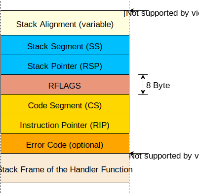

+++
title = "استثناءات وحدة المعالجة المركزية"
weight = 5
path = "ar/cpu-exceptions"
date  = 2018-06-17

[extra]
chapter = "Interrupts"

# GitHub usernames of the people that translated this post
translators = ["mindfreq"]
rtl = true
+++

تحدث CPU exceptions في حالات خاطئة مختلفة، على سبيل المثال، عند الوصول إلى عنوان ذاكرة غير صالح أو عند القسمة على صفر. للتفاعل معها، يجب علينا إعداد _interrupt descriptor table_ يوفر دوال معالجة. في نهاية هذا المقال، ستتمكن نواتنا من catch [breakpoint exceptions] واستئناف التنفيذ العادي بعدها.

[breakpoint exceptions]: https://wiki.osdev.org/Exceptions#Breakpoint

<!-- more -->

هذا المدونة مطوّرة بشكل مفتوح على [GitHub]. إذا كان لديك أي مشاكل أو أسئلة، يرجى فتح issue هناك. يمكنك أيضًا ترك تعليقات [في الأسفل]. يمكن العثور على الكود المصدري الكامل لهذا المقال في فرع [`post-05`][post branch].

[GitHub]: https://github.com/phil-opp/blog_os
[at the bottom]: #comments
<!-- fix for zola anchor checker (target is in template): <a id="comments"> -->
[post branch]: https://github.com/phil-opp/blog_os/tree/post-05

<!-- toc -->

## نظرة عامة
تشير exception إلى أن شيئًا ما خاطئ في التعليمات الحالية. على سبيل المثال، يصدر وحدة المعالجة المركزية exception إذا كانت التعليمات الحالية تحاول القسمة على 0. عندما تحدث exception، تقطع وحدة المعالجة المركزية عملها الحالي وتستدعي فورًا دالة معالجة exception محددة، حسب نوع exception.

على x86، هناك حوالي 20 نوعًا مختلفًا من CPU exceptions. أهمها:

- **Page Fault**: يحدث page fault عند الوصول غير القانوني للذاكرة. على سبيل المثال، إذا كانت التعليمات الحالية تحاول القراءة من صفحة غير مُعيّنة أو تحاول الكتابة إلى صفحة للقراءة فقط.
- **Invalid Opcode**: تحدث هذه exception عندما تكون التعليمات الحالية غير صالحة، على سبيل المثال، عندما نحاول استخدام [SSE instructions] جديدة على CPU قديم لا يدعمها.
- **General Protection Fault**: هذه هي exception ذات النطاق الأوسع للأسباب. تحدث في أنواع مختلفة من انتهاكات الوصول، مثل محاولة تنفيذ تعليمة خاصة في كود مستوى المستخدم أو كتابة حقول محجوزة في سجلات التكوين.
- **Double Fault**: عندما تحدث exception، يحاول وحدة المعالجة المركزية استدعاء دالة المعالجة المقابلة. إذا حدثت exception أخرى _أثناء استدعاء معالج exception_، يرفع وحدة المعالجة المركزية double fault exception. تحدث هذه exception أيضًا عندما لا توجد دالة معالجة مسجلة لـ exception.
- **Triple Fault**: إذا حدثت exception بينما يحاول وحدة المعالجة المركزية استدعاء دالة double fault handler، يصدر _triple fault_ قاتلة. لا يمكننا catch أو handle triple fault. تتفاعل معظم المعالجات بإعادة ضبط نفسها وإعادة إقلاع نظام التشغيل.

[SSE instructions]: https://en.wikipedia.org/wiki/Streaming_SIMD_Extensions

للقائمة الكاملة للـ exceptions، راجع [OSDev wiki][exceptions].

[exceptions]: https://wiki.osdev.org/Exceptions

### جدول واصف المقاطعات
لـ catch و handle exceptions، يجب علينا إعداد ما يسمى _Interrupt Descriptor Table_ (IDT). في هذا الجدول، يمكننا تحديد دالة معالجة لكل CPU exception. يستخدم الجهاز هذا الجدول مباشرة، لذلك نحتاج إلى اتباع تنسيق محدد مسبقًا. يجب أن يكون لكل entry البنية التالية من 16 byte:

| Type | Name                     | Description                                                  |
| ---- | ------------------------ | ------------------------------------------------------------ |
| u16  | Function Pointer [0:15]  | البتات الأقل من المؤشر إلى دالة المعالجة.       |
| u16  | GDT selector             | محدد لsegment كود في [global descriptor table]. |
| u16  | Options                  | (انظر أدناه)                                                  |
| u16  | Function Pointer [16:31] | البتات الوسطى من المؤشر إلى دالة المعالجة.      |
| u32  | Function Pointer [32:63] | البتات المتبقية من المؤشر إلى دالة المعالجة.   |
| u32  | Reserved                 |

[global descriptor table]: https://en.wikipedia.org/wiki/Global_Descriptor_Table

حقل options له التنسيق التالي:

| Bits  | Name                             | Description                                                                                                     |
| ----- | -------------------------------- | --------------------------------------------------------------------------------------------------------------- |
| 0-2   | Interrupt Stack Table Index      | 0: لا تبدل stacks، 1-7: انتقل إلى الـ n في Interrupt Stack Table عند استدعاء هذا المعالج. |
| 3-7   | Reserved                         |
| 8     | 0: Interrupt Gate, 1: Trap Gate  | إذا كانت هذه البتة 0، يتم تعطيل المقاطعات عند استدعاء هذا المعالج.                                          |
| 9-11  | must be one                      |
| 12    | must be zero                     |
| 13‑14 | Descriptor Privilege Level (DPL) | الحد الأدنى من مستوى الامتياز المطلوب لاستدعاء هذا المعالج.                                                  |
| 15    | Present                          |

لكل exception فهرس IDT محدد مسبقًا. على سبيل المثال، invalid opcode exception لها فهرس جدول 6 و page fault exception لها فهرس جدول 14. بذلك، يمكن للجهاز تحميل IDT entry المقابل لكل exception تلقائيًا. يُظهر [Exception Table][exceptions] في OSDev wiki فهارس IDT لجميع exceptions في عمود "Vector nr.".

عندما تحدث exception، يفعل وحدة المعالجة المركزية تقريبًا ما يلي:

1. يدفع بعض السجلات على stack، بما في ذلك instruction pointer وسجل [RFLAGS]. (سنستخدم هذه القيم لاحقًا في هذا المقال.)
2. يقرأ entry المقابل من Interrupt Descriptor Table (IDT). على سبيل المثال، يقرأ وحدة المعالجة المركزية entry الرابع عشر عند حدوث page fault.
3. يتحقق مما إذا كان entry موجودًا وإذا لم يكن كذلك، يرفع double fault.
4. يعطل hardware interrupts إذا كان entry interrupt gate (البتة 8 غير محددة).
5. يحمل [GDT] selector المحدد في CS (code segment).
6. يقفز إلى دالة المعالجة المحددة.

[RFLAGS]: https://en.wikipedia.org/wiki/FLAGS_register
[GDT]: https://en.wikipedia.org/wiki/Global_Descriptor_Table

لا تقلق بشأن الخطوتين 4 و5 الآن؛ سنتعلم عن global descriptor table و hardware interrupts في مقالات مستقبلية.

## نوع IDT
بدلاً من إنشاء نوع IDT خاص بنا، سنستخدم [`InterruptDescriptorTable` struct] من مكتبة `x86_64`، التي تبدو كالتالي:

[`InterruptDescriptorTable` struct]: https://docs.rs/x86_64/0.14.2/x86_64/structures/idt/struct.InterruptDescriptorTable.html

``` rust
#[repr(C)]
pub struct InterruptDescriptorTable {
    pub divide_by_zero: Entry<HandlerFunc>,
    pub debug: Entry<HandlerFunc>,
    pub non_maskable_interrupt: Entry<HandlerFunc>,
    pub breakpoint: Entry<HandlerFunc>,
    pub overflow: Entry<HandlerFunc>,
    pub bound_range_exceeded: Entry<HandlerFunc>,
    pub invalid_opcode: Entry<HandlerFunc>,
    pub device_not_available: Entry<HandlerFunc>,
    pub double_fault: Entry<HandlerFuncWithErrCode>,
    pub invalid_tss: Entry<HandlerFuncWithErrCode>,
    pub segment_not_present: Entry<HandlerFuncWithErrCode>,
    pub stack_segment_fault: Entry<HandlerFuncWithErrCode>,
    pub general_protection_fault: Entry<HandlerFuncWithErrCode>,
    pub page_fault: Entry<PageFaultHandlerFunc>,
    pub x87_floating_point: Entry<HandlerFunc>,
    pub alignment_check: Entry<HandlerFuncWithErrCode>,
    pub machine_check: Entry<HandlerFunc>,
    pub simd_floating_point: Entry<HandlerFunc>,
    pub virtualization: Entry<HandlerFunc>,
    pub security_exception: Entry<HandlerFuncWithErrCode>,
    // some fields omitted
}
```

الحقول لها النوع [`idt::Entry<F>`]، وهو struct يمثل حقول IDT entry (انظر الجدول أعلاه). يحدد parameter النوع `F` نوع دالة المعالجة المتوقعة. نرى أن بعض entries تتطلب [`HandlerFunc`] وبعضها تتطلب [`HandlerFuncWithErrCode`]. حتى page fault لها نوعها الخاص: [`PageFaultHandlerFunc`].

[`idt::Entry<F>`]: https://docs.rs/x86_64/0.14.2/x86_64/structures/idt/struct.Entry.html
[`HandlerFunc`]: https://docs.rs/x86_64/0.14.2/x86_64/structures/idt/type.HandlerFunc.html
[`HandlerFuncWithErrCode`]: https://docs.rs/x86_64/0.14.2/x86_64/structures/idt/type.HandlerFuncWithErrCode.html
[`PageFaultHandlerFunc`]: https://docs.rs/x86_64/0.14.2/x86_64/structures/idt/type.PageFaultHandlerFunc.html

لننظر في نوع `HandlerFunc` أولاً:

```rust
type HandlerFunc = extern "x86-interrupt" fn(_: InterruptStackFrame);
```

إنه [type alias] لنوع `extern "x86-interrupt" fn`. كلمة `extern` تحدد دالة بـ [calling convention أجنبية][foreign calling convention] وتُستخدم غالبًا للتواصل مع كود C (`extern "C" fn`). لكن ما هو calling convention `x86-interrupt`؟

[type alias]: https://doc.rust-lang.org/book/ch20-03-advanced-types.html#creating-type-synonyms-with-type-aliases
[foreign calling convention]: https://doc.rust-lang.org/nomicon/ffi.html#foreign-calling-conventions

## اتفاقية استدعاء المقاطعات
Exceptions مشابهة جدًا لاستدعاءات الدوال: يقفز وحدة المعالجة المركزية إلى أول تعليمة لدالة المُستدعاة وينفذها. بعد ذلك، يقفز وحدة المعالجة المركزية إلى عنوان العودة ويستمر في تنفيذ الدالة الأصل.

ومع ذلك، هناك فرق رئيسي بين exceptions واستدعاءات الدوال: استدعاء الدالة يُستدعى طواعية بواسطة تعليمة `call` مُدرجة من المترجم، بينما قد تحدث exception عند _أي_ تعليمة. لفهم عواقب هذا الفرق، نحتاج إلى فحص استدعاءات الدوال بمزيد من التفصيل.

تحدد [Calling conventions] تفاصيل استدعاء الدالة. على سبيل المثال، تحدد أين توضع معاملات الدالة (مثل في السجلات أو على stack) وكيف تُعاد النتائج. على x86_64 Linux، تنطبق القواعد التالية لدوال C (محددة في [System V ABI]):

[Calling conventions]: https://en.wikipedia.org/wiki/Calling_convention
[System V ABI]: https://refspecs.linuxbase.org/elf/x86_64-abi-0.99.pdf

- تمرر أول ستة معاملات صحيحة في السجلات `rdi` و `rsi` و `rdx` و `rcx` و `r8` و `r9`
- تمرر المعاملات الإضافية على stack
- تُعاد النتائج في `rax` و `rdx`

لاحظ أن Rust لا يتبع C ABI (في الواقع، [لا يوجد حتى Rust ABI بعد][rust abi])، لذلك تنطبق هذه القواعد فقط على الدوال المعلنة كـ `extern "C" fn`.

[rust abi]: https://github.com/rust-lang/rfcs/issues/600

### السجلات المحفوظة والمؤقتة
يقسم calling convention السجلات إلى جزأين: _preserved_ و _scratch_ registers.

يجب أن تبقى قيم _preserved_ registers دون تغيير عبر استدعاءات الدوال. لذلك يُسمح فقط للدالة المُستدعاة (_"callee"_) بالكتابة فوق هذه السجلات إذا استعادت قيمها الأصلية قبل العودة. لذلك، تُسمى هذه السجلات _"callee-saved"_. النمط الشائع هو حفظ هذه السجلات إلى stack في بداية الدالة واستعادتها مباشرة قبل العودة.

على النقيض، يُسمح للدالة المُستدعاة بالكتابة فوق _scratch_ registers دون قيود. إذا أراد المستدعي الحفاظ على قيمة scratch register عبر استدعاء دالة، يحتاج إلى نسخ احتياطي واستعادة قبل استدعاء الدالة (بدفعه إلى stack). لذلك scratch registers هي _caller-saved_.

على x86_64، يحدد calling convention C preserved و scratch registers التالية:

| preserved registers                             | scratch registers                                           |
| ----------------------------------------------- | ----------------------------------------------------------- |
| `rbp`, `rbx`, `rsp`, `r12`, `r13`, `r14`, `r15` | `rax`, `rcx`, `rdx`, `rsi`, `rdi`, `r8`, `r9`, `r10`, `r11` |
| _callee-saved_                                  | _caller-saved_                                              |

يعرف المترجم هذه القواعد، لذلك يولّد الكود وفقًا لذلك. على سبيل المثال، تبدأ معظم الدوال بـ `push rbp`، الذي ينسخ احتياطي `rbp` على stack (لأنه callee-saved register).

### حفظ جميع السجلات
على عكس استدعاءات الدوال، يمكن أن تحدث exceptions عند _أي_ تعليمة. في معظم الحالات، لا نعرف حتى وقت التجميع إذا كان الكود المولّد سيسبب exception. على سبيل المثال، لا يمكن للمترجم معرفة إذا كانت تعليمة تسبب stack overflow أو page fault.

بما أننا لا نعرف متى تحدث exception، لا يمكننا نسخ أي سجلات احتياطيًا قبل ذلك. هذا يعني أننا لا نستطيع استخدام calling convention يعتمد على caller-saved registers لمعالجي exceptions. بدلاً من ذلك، نحتاج إلى calling convention يحافظ على _جميع السجلات_. calling convention `x86-interrupt` هو مثل هذا الـ calling convention، لذلك يضمن أن جميع قيم السجلات تُستعاد إلى قيمها الأصلية عند عودة الدالة.

لاحظ أن هذا لا يعني أن جميع السجلات تُحفظ على stack عند دخول الدالة. بدلاً من ذلك، ينسخ المترجم احتياطيًا فقط السجلات التي تُكتب فوقها من قبل الدالة. بهذه الطريقة، يمكن توليد كود فعال جدًا للدوال القصيرة التي تستخدم عددًا قليلًا من السجلات.

### إطار مقطع المقاطعات
عند استدعاء دالة عادية (باستخدام تعليمة `call`)، يدفع وحدة المعالجة المركزية عنوان العودة قبل القفز إلى الدالة المستهدفة. عند عودة الدالة (باستخدام تعليمة `ret`)، يسحب وحدة المعالجة المركزية عنوان العودة هذا وتقفز إليه. لذلك stack frame لاستدعاء دالة عادية يبدو كالتالي:


بالنسبة لمعالجي exceptions و interrupts، لن يكفي دفع عنوان عودة، لأن معالجي interrupts يعملون غالبًا في سياق مختلف (مؤشر stack، أعلام CPU، إلخ). بدلاً من ذلك، ينفذ وحدة المعالجة المركزية الخطوات التالية عند حدوث interrupt:

0. **حفظ مؤشر stack القديم**: يقرأ وحدة المعالجة مركزية مؤشر stack (`rsp`) وسجل stack segment (`ss`) ويتذكرها في buffer داخلي.
1. **محاذاة مؤشر Stack**: يمكن أن يحدث interrupt عند أي تعليمة، لذلك يمكن أن يكون لمؤشر stack أي قيمة أيضًا. ومع ذلك، بعض تعليمات CPU (مثل بعض تعليمات SSE) تتطلب أن يكون مؤشر Stack محاذاً على حدود 16 byte، لذلك ينفذ وحدة المعالجة المركزية مثل هذه المحاذاة مباشرة بعد interrupt.
2. **تبديل stacks** (في بعض الحالات): يحدث تبديل stack عندما يتغير مستوى امتياز وحدة المعالجة المركزية، على سبيل المثال، عندما تحدث CPU exception في برنامج وضع المستخدم. من الممكن أيضًا تكوين تبديل stacks لـ interrupts محددة باستخدام ما يسمى _Interrupt Stack Table_ (موضح في المقال التالي).
3. **دفع مؤشر Stack القديم**: يدفع وحدة المعالجة المركزية قيم `rsp` و `ss` من الخطوة 0 إلى stack. هذا يجعل من الممكن استعادة مؤشر Stack الأصلي عند العودة من interrupt handler.
4. **دفع وتحديث سجل `RFLAGS`**: يحتوي سجل [`RFLAGS`] على various control and status bits. عند دخول interrupt، يغير وحدة المعالجة المركزية بعض البتات ويدفع القيمة القديمة.
5. **دفع instruction pointer**: قبل القفز إلى دالة interrupt handler، يدفع وحدة المعالجة المركزية instruction pointer (`rip`) و code segment (`cs`). هذا يعادل دفع عنوان العودة لاستدعاء دالة عادية.
6. **دفع error code** (لبعض exceptions): لبعض exceptions المحددة، مثل page faults، يدفع وحدة المعالجة المركزية error code، الذي يصف سبب exception.
7. **استدعاء interrupt handler**: يقرأ وحدة المعالجة مركزية عنوان و segment descriptor لدالة interrupt handler من الحقل المقابل في IDT. ثم يستدعي هذا المعالج بتحميل القيم في سجلات `rip` و `cs`.

[`RFLAGS`]: https://en.wikipedia.org/wiki/FLAGS_register

لذلك _interrupt stack frame_ يبدو كالتالي:



في مكتبة `x86_64`، يُمثَّل interrupt stack frame بـ [`InterruptStackFrame`] struct. يُمرر إلى معالجي interrupts كـ `&mut` ويمكن استخدامه لاسترداد معلومات إضافية عن سبب exception. لا يحتوي struct على حقل error code، لأن عددًا قليلًا من exceptions يدفع error code. تستخدم هذه exceptions نوع الدالة المنفصل [`HandlerFuncWithErrCode`]، الذي لديه وسيطة `error_code` إضافية.

[`InterruptStackFrame`]: https://docs.rs/x86_64/0.14.2/x86_64/structures/idt/struct.InterruptStackFrame.html

### خلف الكواليس
calling convention `x86-interrupt` هو تجريد قوي يخفي جميع التفاصيل المعقدة لعملية معالجة exceptions. ومع ذلك، أحيانًا يكون من المفيد معرفة ما يحدث خلف الكواليس. إليك نظرة عامة قصيرة على الأشياء التي يعتني بها calling convention `x86-interrupt`:

- **استرداد الوسائط**: تتوقع معظم calling conventions أن الوسائط تُمرر في السجلات. هذا غير ممكن لمعالجي exceptions لأننا يجب ألا نكتب فوق أي قيم سجلات قبل نسخها احتياطيًا على stack. بدلاً من ذلك، calling convention `x86-interrupt` يدرك أن الوسائط موجودة بالفعل على stack عند offset محدد.
- **العودة باستخدام `iretq`**: بما أن interrupt stack frame يختلف completely عن stack frames لاستدعاءات الدوال العادية، لا يمكننا العودة من دوال المعالجة عبر تعليمة `ret` العادية. لذلك بدلاً من ذلك، يجب استخدام تعليمة `iretq`.
- **معالجة error code**: error code، الذي يُدفع لبعض exceptions، يجعل الأمور أكثر تعقيدًا. يغير محاذاة stack (انظر النقطة التالية) وينبغي أن يُسحب من stack قبل العودة. calling convention `x86-interrupt` يعالج كل هذا التعقيد. ومع ذلك، لا يعرف أي دالة معالجة تُستخدم لأي exception، لذلك يحتاج إلى استنتاج تلك المعلومات من عدد معاملات الدالة. هذا يعني أن المبرمج لا يزال مسؤولًا عن استخدام نوع الدالة الصحيح لكل exception. لحسن الحظ، يضمن نوع `InterruptDescriptorTable` المحدد من مكتبة `x86_64` استخدام أنواع الدوال الصحيحة.
- **محاذاة stack**: بعض التعليمات (خاصة تعليمات SSE) تتطلب محاذاة 16 byte لـ stack. يضمن وحدة المعالجة المركزية هذه المحاذاة whenever يحدث exception، لكن لبعض exceptions يدمرها مرة أخرى عندما يدفع error code. calling convention `x86-interrupt` يعتني بهذا بإعادة محاذاة stack في هذه الحالة.

إذا كنت مهتمًا بمزيد من التفاصيل، لدينا أيضًا سلسلة مقالات تشرح معالجة exceptions باستخدام [naked functions] مرتبطة [في نهاية هذا المقال][too-much-magic].

[naked functions]: https://github.com/rust-lang/rfcs/blob/master/text/1201-naked-fns.md
[too-much-magic]: #too-much-magic

## التنفيذ
الآن بعد أن فهمنا النظرية، حان الوقت لمعالجة CPU exceptions في نواتنا. سنبدأ بإنشاء interrupts module جديد في `src/interrupts.rs`، ينشئ أولاً دالة `init_idt` تنشئ `InterruptDescriptorTable` جديد:

``` rust
// in src/lib.rs

pub mod interrupts;

// in src/interrupts.rs

use x86_64::structures::idt::InterruptDescriptorTable;

pub fn init_idt() {
    let mut idt = InterruptDescriptorTable::new();
}
```

الآن يمكننا إضافة دوال المعالجة. سنبدأ بإضافة معالج لـ [breakpoint exception]. breakpoint exception هي exception المثالية لاختبار معالجة exceptions. غرضها الوحيد هو إيقاف البرنامج مؤقتًا عند تنفيذ تعليمة breakpoint `int3`.

[breakpoint exception]: https://wiki.osdev.org/Exceptions#Breakpoint

breakpoint exception تُستخدم عادة في debuggers: عندما يحدد المستخدم breakpoint، يحل debugger محل التعليمة المقابلة بتعليمة `int3` بحيث يرمي وحدة المعالجة المركزية breakpoint exception عندما يصل إلى ذلك السطر. عندما يريد المستخدم استئناف البرنامج، يحل debugger محل تعليمة `int3` بالتعليمة الأصلية ويستمر البرنامج. لمزيد من التفاصيل، انظر سلسلة ["_How debuggers work_"].

["_How debuggers work_"]: https://eli.thegreenplace.net/2011/01/27/how-debuggers-work-part-2-breakpoints

لحالتنا، لا نحتاج إلى استبدال أي تعليمات. بدلاً من ذلك، نريد فقط طباعة رسالة عند تنفيذ تعليمة breakpoint ثم استئناف البرنامج. لننشئ دالة `breakpoint_handler` بسيطة ونضيفها إلى IDT:

```rust
// in src/interrupts.rs

use x86_64::structures::idt::{InterruptDescriptorTable, InterruptStackFrame};
use crate::println;

pub fn init_idt() {
    let mut idt = InterruptDescriptorTable::new();
    idt.breakpoint.set_handler_fn(breakpoint_handler);
}

extern "x86-interrupt" fn breakpoint_handler(
    stack_frame: InterruptStackFrame)
{
    println!("EXCEPTION: BREAKPOINT\n{:#?}", stack_frame);
}
```

المعالج يخرج فقط رسالة ويطبع interrupt stack frame بشكل جميل.

عندما نحاول تجميعه، يحدث الخطأ التالي:

```
error[E0658]: x86-interrupt ABI is experimental and subject to change (see issue #40180)
  --> src/main.rs:53:1
   |
53 | / extern "x86-interrupt" fn breakpoint_handler(stack_frame: InterruptStackFrame) {
54 | |     println!("EXCEPTION: BREAKPOINT\n{:#?}", stack_frame);
55 | | }
   | |_^
   |
   = help: add #![feature(abi_x86_interrupt)] to the crate attributes to enable
```

هذا الخطأ يحدث لأن calling convention `x86-interrupt` لا يزال غير مستقر. لاستخدامه على أي حال، يجب علينا تفعيله صراحة بإضافة `#![feature(abi_x86_interrupt)]` في أعلى `lib.rs`.

### تحميل IDT
لكي يستخدم وحدة المعالجة المركزية interrupt descriptor table الجديد، نحتاج إلى تحميله باستخدام تعليمة [`lidt`]. يوفر struct `InterruptDescriptorTable` من مكتبة `x86_64` دالة [`load`][InterruptDescriptorTable::load] لذلك. لنحاول استخدامها:

[`lidt`]: https://www.felixcloutier.com/x86/lgdt:lidt
[InterruptDescriptorTable::load]: https://docs.rs/x86_64/0.14.2/x86_64/structures/idt/struct.InterruptDescriptorTable.html#method.load

```rust
// in src/interrupts.rs

pub fn init_idt() {
    let mut idt = InterruptDescriptorTable::new();
    idt.breakpoint.set_handler_fn(breakpoint_handler);
    idt.load();
}
```

عندما نحاول تجميعه الآن، يحدث الخطأ التالي:

```
error: `idt` does not live long enough
  --> src/interrupts/mod.rs:43:5
   |
43 |     idt.load();
   |     ^^^ does not live long enough
44 | }
   | - borrowed value only lives until here
   |
   = note: borrowed value must be valid for the static lifetime...
```

لذلك دالة `load` تتوقع `&'static self`، أي مرجع صالح لفترة التشغيل الكاملة للبرنامج. السبب هو أن وحدة المعالجة المركزية ستصل إلى هذا الجدول في كل interrupt حتى نحمل IDT مختلف. لذلك استخدام lifetime أقصر من `'static` قد يؤدي إلى use-after-free bugs.

في الواقع، هذا بالضبط ما يحدث هنا. يُنشأ `idt` على stack، لذلك هو صالح فقط داخل دالة `init`. بعد ذلك، تُعاد استخدام ذاكرة stack لدوال أخرى، لذلك قد يفسر وحدة المعالجة المركزية ذاكرة stack عشوائية كـ IDT. لحسن الحظ، ترمي دالة `InterruptDescriptorTable::load` هذا المتطلب في تعريف الدالة، بحيث يمكن لـ Rust compiler منع هذا الـ bug المحتمل وقت التجميع.

لحل هذه المشكلة، نحتاج إلى تخزين `idt` في مكان يكون له lifetime `'static`. لتحقيق ذلك، يمكننا تخصيص IDT على heap باستخدام [`Box`] ثم تحويله إلى مرجع `'static`، لكننا نكتب OS kernel وبالتالي ليس لدينا heap (بعد).

[`Box`]: https://doc.rust-lang.org/std/boxed/struct.Box.html


كبدائل، يمكننا محاولة تخزين IDT كـ `static`:

```rust
static IDT: InterruptDescriptorTable = InterruptDescriptorTable::new();

pub fn init_idt() {
    IDT.breakpoint.set_handler_fn(breakpoint_handler);
    IDT.load();
}
```

ومع ذلك، هناك مشكلة: Statics غير قابلة للتغيير، لذلك لا يمكننا تعديل breakpoint entry من دالة `init`. يمكننا حل هذه المشكلة باستخدام [`static mut`]:

[`static mut`]: https://doc.rust-lang.org/book/ch20-01-unsafe-rust.html#accessing-or-modifying-a-mutable-static-variable

```rust
static mut IDT: InterruptDescriptorTable = InterruptDescriptorTable::new();

pub fn init_idt() {
    unsafe {
        IDT.breakpoint.set_handler_fn(breakpoint_handler);
        IDT.load();
    }
}
```

هذا النموذج يتجمع بدون أخطاء لكنه بعيد عن أن يكون idiomatic. `static mut`s عرضة جدًا لـ data races، لذلك نحتاج إلى كتلة [`unsafe`] عند كل وصول.

[`unsafe` block]: https://doc.rust-lang.org/1.30.0/book/second-edition/ch19-01-unsafe-rust.html#unsafe-superpowers

#### Lazy Statics to the Rescue
لحسن الحظ، يوجد macro `lazy_static`. بدلاً من تقييم `static` وقت التجميع، ينفذ macro التهيئة عند أول إشارة إلى `static`. بذلك، يمكننا فعل كل شيء تقريبًا في كتلة التهيئة وحتى قراءة قيم وقت التشغيل.

لقد استوردنا بالفعل مكتبة `lazy_static` عندما [أنشأنا تجريدًا لـ VGA text buffer][vga text buffer lazy static]. لذلك يمكننا استخدام macro `lazy_static!` مباشرة لإنشاء static IDT:

[vga text buffer lazy static]: @/edition-2/posts/03-vga-text-buffer/index.md#lazy-statics

```rust
// in src/interrupts.rs

use lazy_static::lazy_static;

lazy_static! {
    static ref IDT: InterruptDescriptorTable = {
        let mut idt = InterruptDescriptorTable::new();
        idt.breakpoint.set_handler_fn(breakpoint_handler);
        idt
    };
}

pub fn init_idt() {
    IDT.load();
}
```

لاحظ كيف لا تتطلب هذه الحل أي كتل `unsafe`. يستخدم macro `lazy_static!` `unsafe` خلف الكواليس، لكنه يُتجسد في واجهة آمنة.

### التشغيل

الخطوة الأخيرة لجعل exceptions تعمل في نواتنا هي استدعاء دالة `init_idt` من `main.rs`. بدلاً من استدعائها مباشرة، نقدم دالة `init` عامة في `lib.rs`:

```rust
// in src/lib.rs

pub fn init() {
    interrupts::init_idt();
}
```

مع هذه الدالة، لدينا الآن مكان مركزي لـ routines التهيئة التي يمكن مشاركتها بين دوال `_start` المختلفة في `main.rs` و `lib.rs` و integration tests.

الآن يمكننا تحديث دالة `_start` في `main.rs` لاستدعاء `init` ثم إثارة breakpoint exception:

```rust
// in src/main.rs

#[unsafe(no_mangle)]
pub extern "C" fn _start() -> ! {
    println!("Hello World{}", "!");

    blog_os::init(); // new

    // invoke a breakpoint exception
    x86_64::instructions::interrupts::int3(); // new

    // as before
    #[cfg(test)]
    test_main();

    println!("It did not crash!");
    loop {}
}
```

عندما نشغّله في QEMU الآن (باستخدام `cargo run`)، نرى ما يلي:


لقد نجح! يستدعي وحدة المعالجة المركزية breakpoint handler بنجاح، الذي يطبع الرسالة، ثم يعود إلى دالة `_start`، حيث تُطبع رسالة `It did not crash!`.

نرى أن interrupt stack frame يخبرنا بعنوان التعليمات ومؤشرات Stack عند وقت حدوث exception. هذه المعلومات مفيدة جدًا عند تصحيح exceptions غير متوقعة.

### Adding a Test

لننشئ اختبارًا يضمن أن ما سبق يستمر في العمل. أولاً، نحدّث دالة `_start` لتستدعي أيضًا `init`:

```rust
// in src/lib.rs

/// Entry point for `cargo test`
#[cfg(test)]
#[unsafe(no_mangle)]
pub extern "C" fn _start() -> ! {
    init();      // new
    test_main();
    loop {}
}
```

تذكر، تُستخدم دالة `_start` هذه عند تشغيل `cargo test --lib`، لأن Rust يختبر `lib.rs` completely بشكل مستقل عن `main.rs`. نحتاج إلى استدعاء `init` هنا لإعداد IDT قبل تشغيل الاختبارات.

الآن يمكننا إنشاء اختبار `test_breakpoint_exception`:

```rust
// in src/interrupts.rs

#[test_case]
fn test_breakpoint_exception() {
    // invoke a breakpoint exception
    x86_64::instructions::interrupts::int3();
}
```

الاختبار يستدعي دالة `int3` لإثارة breakpoint exception. بالتحقق من أن التنفيذ يستمر بعده، نتحقق من أن breakpoint handler يعمل بشكل صحيح.

يمكنك تجربة هذا الاختبار الجديد بتشغيل `cargo test` (جميع الاختبارات) أو `cargo test --lib` (فقط اختبارات `lib.rs` و modules). يجب أن ترى ما يلي في الإخراج:

```
blog_os::interrupts::test_breakpoint_exception...	[ok]
```

## Too much Magic?
calling convention `x86-interrupt` ونوع [`InterruptDescriptorTable`] جعل عملية معالجة exceptions مباشرة وخالية من الألم. إذا كان هذا سحرًا كبيرًا عليك وتعلم جميع التفاصيل المعقدة لمعالجة exceptions، فقد غطينا ذلك لك: سلسلة ["Handling Exceptions with Naked Functions"] الخاصة بنا تظهر كيفية معالجة exceptions بدون calling convention `x86-interrupt` وتُنشئ أيضًا نوع IDT خاص بها. تاريخيًا، كانت هذه المقالات مقالات معالجة exceptions الرئيسية قبل وجود calling convention `x86-interrupt` ومكتبة `x86_64`. لاحظ أن هذه المقالات مبنية على [الإصدار الأول][first edition] من هذه المدونة وقد تكون قديمة.

["Handling Exceptions with Naked Functions"]: @/edition-1/extra/naked-exceptions/_index.md
[`InterruptDescriptorTable`]: https://docs.rs/x86_64/0.14.2/x86_64/structures/idt/struct.InterruptDescriptorTable.html
[first edition]: @/edition-1/_index.md

## What's next?
لقد التقطنا أول exception وعدنا منها بنجاح! الخطوة التالية هي ضمان التقاط جميع exceptions لأن exception غير ملتقط يسبب [triple fault] قاتلة، التي تؤدي إلى إعادة ضبط النظام. المقال التالي يشرح كيف نتجنب ذلك بـ catch صحيح لـ [double faults].

[triple fault]: https://wiki.osdev.org/Triple_Fault
[double faults]: https://wiki.osdev.org/Double_Fault#Double_Fault
