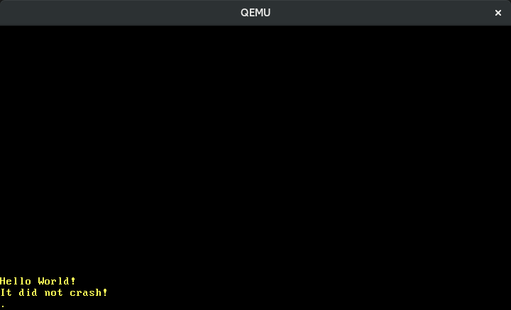
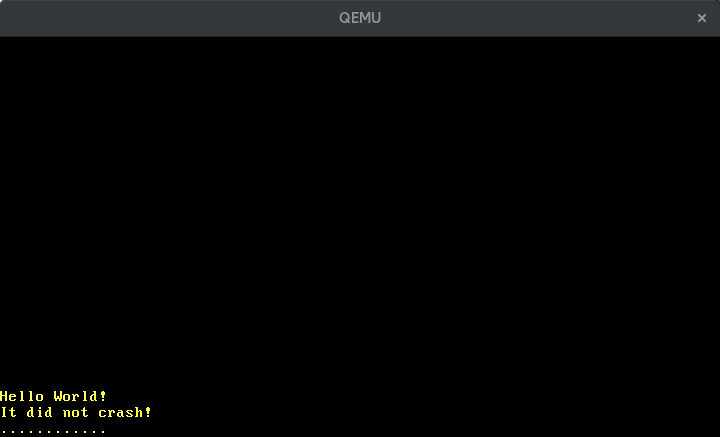
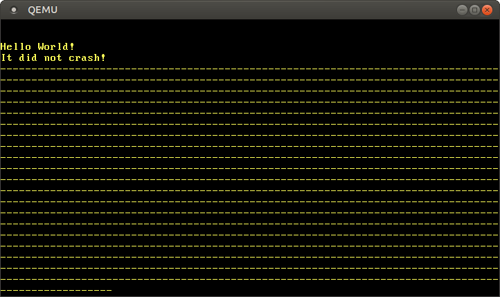
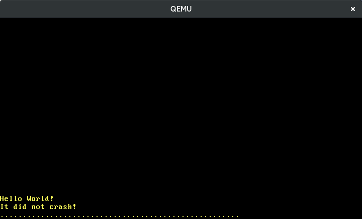
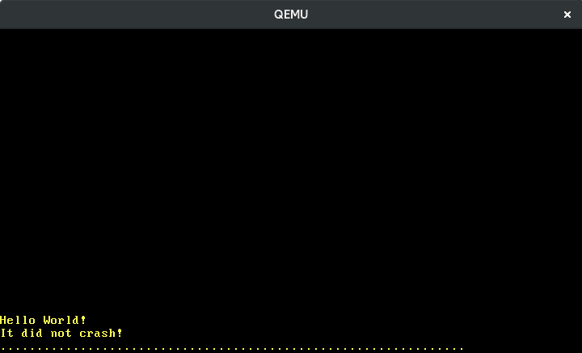
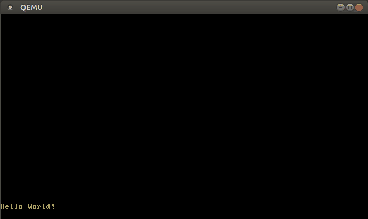

+++
title = "مقاطعات العتاد"
weight = 7
path = "ar/hardware-interrupts"
date = 2018-10-22

[extra]
chapter = "Interrupts"

# GitHub usernames of the people that translated this post
translators = ["mindfreq"]
rtl = true
+++

في هذا المقال، نُعدّ متحكم المقاطعات القابل للبرمجة لإعادة توجيه المقاطعات العتادية إلى وحدة المعالجة المركزية بشكل صحيح. لمعالجة هذه المقاطعات، نضيف entries جديدة إلى interrupt descriptor table، تمامًا كما فعلنا لمعالجي exceptions. سنتعلم كيفية الحصول على timer interrupts دورية وكيفية الحصول على إدخال من لوحة المفاتيح.

<!-- more -->

هذا المدونة مطوّرة بشكل مفتوح على [GitHub]. إذا كان لديك أي مشاكل أو أسئلة، يرجى فتح issue هناك. يمكنك أيضًا ترك تعليقات [في الأسفل].  يمكن العثور على الكود المصدري الكامل لهذا المقال في فرع [`post-07`][post branch].

[GitHub]: https://github.com/phil-opp/blog_os
[at the bottom]: #comments
<!-- fix for zola anchor checker (target is in template): <a id="comments"> -->
[post branch]: https://github.com/phil-opp/blog_os/tree/post-07

<!-- toc -->

## نظرة عامة

توفر المقاطعات طريقة لإخطار وحدة المعالجة المركزية من الأجهزة المتصلة. لذلك بدلاً من ترك النواة تتفقد لوحة المفاتيح دورياً بحثاً عن أحرف جديدة (عملية تسمى [_polling_])، يمكن للوحة المفاتيح إخطار النواة بكل ضغطة مفتاح. هذا أكثر كفاءة بكثير لأن النواة تحتاج فقط للتحرك عندما يحدث شيء ما. يسمح أيضًا بأوقات رد فعل أسرع لأن النواة يمكنها التفاعل فورًا وليس فقط عند التفتيش التالي.

[_polling_]: https://en.wikipedia.org/wiki/Polling_(computer_science)

توصيل جميع أجهزة الأجهزة مباشرة بـ وحدة المعالجة المركزية غير ممكن. بدلاً من ذلك، _interrupt controller_ منفصل يجمع المقاطعات من جميع الأجهزة ثم يُخطِر وحدة المعالجة المركزية:

```
                                    ____________             _____
               Timer ------------> |            |           |     |
               Keyboard ---------> | Interrupt  |---------> | CPU |
               Other Hardware ---> | Controller |           |_____|
               Etc. -------------> |____________|

```

معظم interrupt controllers قابلة للبرمجة، مما يعني أنها تدعم مستويات أولويات مختلفة للمقاطعات. على سبيل المثال، هذا يسمح بمنح timer interrupts أولوية أعلى من keyboard interrupts لضمان إبقاء الوقت بدقة.

على عكس exceptions، تحدث hardware interrupts _بشكل غير متزامن_. هذا يعني أنها completely مستقلة عن الكود المُنفّذ ويمكن أن تحدث في أي وقت. لذلك، نحصل فجأة على شكل من التزامن في نواتنا مع جميع الـ bugs المحتملة المرتبطة بالتزامن. نموذج الملكية الصارم في Rust يساعدنا هنا لأنه يمنع حالة العالم القابلة للتغيير. ومع ذلك، لا تزال الـ deadlocks ممكنة، كما سنرى لاحقًا في هذا المقال.

## متحكم المقاطعات 8259 PIC {#the-8259-pic}

[Intel 8259] هو programmable interrupt controller (PIC) طُرح عام 1976. تم استبداله منذ فترة بالـ [APIC] الأحدث، لكن واجهته لا تزال مدعومة على الأنظمة الحالية لأسباب توافقية. 8259 PIC أسهل بكثير في الإعداد من APIC، لذلك سنستخدمه للتعرف على المقاطعات قبل التبديل إلى APIC في مقال لاحق.

[APIC]: https://en.wikipedia.org/wiki/Intel_APIC_Architecture

لدى 8259 ثماني خطوط interrupts وعدة خطوط للتواصل مع وحدة المعالجة المركزية. كانت الأنظمة النموذجية آنذاك مزودة بنسخة واحدة من 8259 PIC، واحد أساسي وواحد ثانوي PIC، متصل بواحدة من خطوط interrupt للرئيسي:

[Intel 8259]: https://en.wikipedia.org/wiki/Intel_8259

```
                     ____________                          ____________
Real Time Clock --> |            |   Timer -------------> |            |
ACPI -------------> |            |   Keyboard-----------> |            |      _____
Available --------> | Secondary  |----------------------> | Primary    |     |     |
Available --------> | Interrupt  |   Serial Port 2 -----> | Interrupt  |---> | CPU |
Mouse ------------> | Controller |   Serial Port 1 -----> | Controller |     |_____|
Co-Processor -----> |            |   Parallel Port 2/3 -> |            |
Primary ATA ------> |            |   Floppy disk -------> |            |
Secondary ATA ----> |____________|   Parallel Port 1----> |____________|

```

يُظهر هذا الرسم التعيين النموذجي لخطوط interrupts. نرى أن معظم الـ 15 سطرًا لها تعيين ثابت، مثلاً، السطر 4 من PIC الثانوي مخصص للماوس.

يمكن تكوين كل controller عبر [I/O ports] واحد، واحد "command" port وواحد "data" port. بالنسبة للرئيسي، هذه الـ ports هي `0x20` (command) و `0x21` (data). بالنسبة للثانوي، هي `0xa0` (command) و `0xa1` (data). لمزيد من المعلومات حول كيفية تكوين PICs، راجع [المقال على osdev.org].

[I/O ports]: @/edition-2/posts/04-testing/index.md#i-o-ports
[article on osdev.org]: https://wiki.osdev.org/8259_PIC

### التنفيذ

التكوين الافتراضي لـ PICs غير قابل للاستخدام لأنه يرسل interrupt vector numbers في النطاق 0–15 إلى وحدة المعالجة المركزية. هذه الأرقام مشغولة بالفعل من قبل CPU exceptions. على سبيل المثال، الرقم 8 يتوافق مع double fault. لإصلاح مشكلة التداخل هذه، نحتاج إلى إعادة تعيين PIC interrupts إلى أرقام مختلفة. النطاق الفعلي لا يهم طالما لا يتداخل مع exceptions، لكن عادةً يُختار النطاق 32–47، لأن هذه هي الأرقام الحرة الأولى بعد 32 exception slots.

يحدث التكوين بكتابة قيم خاصة إلى command و data ports لـ PICs. لحسن الحظ، هناك بالفعل مكتبة تسمى [`pic8259`]، لذلك لا نحتاج إلى كتابة sequence التهيئة بأنفسنا. ومع ذلك، إذا كنت مهتمًا بكيفية عملها، راجع [source code][pic crate source]. إنها صغيرة نسبيًا وموثقة جيدًا.

[pic crate source]: https://docs.rs/crate/pic8259/0.10.1/source/src/lib.rs

لإضافة المكتبة كـ dependency، نضيف ما يلي إلى مشروعنا:

[`pic8259`]: https://docs.rs/pic8259/0.10.1/pic8259/

```toml
# in Cargo.toml

[dependencies]
pic8259 = "0.10.1"
```

التجريد الرئيسي الذي توفره المكتبة هو struct [`ChainedPics`] الذي يمثل تخطيط primary/secondary PIC الذي رأيناه أعلاه. مصمم للاستخدام بالطريقة التالية:

[`ChainedPics`]: https://docs.rs/pic8259/0.10.1/pic8259/struct.ChainedPics.html

```rust
// in src/interrupts.rs

use pic8259::ChainedPics;
use spin;

pub const PIC_1_OFFSET: u8 = 32;
pub const PIC_2_OFFSET: u8 = PIC_1_OFFSET + 8;

pub static PICS: spin::Mutex<ChainedPics> =
    spin::Mutex::new(unsafe { ChainedPics::new(PIC_1_OFFSET, PIC_2_OFFSET) });
```

كما لوحظ أعلاه، نعيّن offsets لـ PICs إلى النطاق 32–47. بوضع `ChainedPics` struct في `Mutex`، نحصل على وصول آمن قابل للتغيير (عبر [دالة `lock`][spin mutex lock])، الذي نحتاجه في الخطوة التالية. دالة `ChainedPics::new` غير آمنة لأن offsets خاطئة قد تسبب undefined behavior.

[spin mutex lock]: https://docs.rs/spin/0.5.2/spin/struct.Mutex.html#method.lock

يمكننا الآن تهيئة 8259 PIC في دالة `init`:

```rust
// in src/lib.rs

pub fn init() {
    gdt::init();
    interrupts::init_idt();
    unsafe { interrupts::PICS.lock().initialize() }; // new
}
```

نستخدم دالة [`initialize`] لتنفيذ تهيئة PIC. مثل دالة `ChainedPics::new`، هذه الدالة أيضًا غير آمنة لأنها قد تسبب undefined behavior إذا كان PIC مُكوّنًا بشكل خاطئ.

[`initialize`]: https://docs.rs/pic8259/0.10.1/pic8259/struct.ChainedPics.html#method.initialize

إذا سار كل شيء على ما يرام، يجب أن نستمر في رؤية رسالة "It did not crash" عند تنفيذ `cargo run`.

## تفعيل المقاطعات

حتى الآن، لم يحدث شيء لأن المقاطعات لا تزال معطلة في تكوين وحدة المعالجة المركزية. هذا يعني أن وحدة المعالجة المركزية لا تستمع إلى interrupt controller على الإطلاق، لذلك لا يمكن لأي interrupts الوصول إلى وحدة المعالجة المركزية. لنغيّر ذلك:

```rust
// in src/lib.rs

pub fn init() {
    gdt::init();
    interrupts::init_idt();
    unsafe { interrupts::PICS.lock().initialize() };
    x86_64::instructions::interrupts::enable();     // new
}
```

دالة `interrupts::enable` من مكتبة `x86_64` تنفذ تعليمة `sti` الخاصة ("set interrupts") لتفعيل external interrupts. عندما نجرب `cargo run` الآن، نرى أن double fault تحدث:


سبب هذه double fault هو أن hardware timer ([Intel 8253] بالضبط) مُفعّل افتراضيًا، لذلك نبدأ في تلقي timer interrupts بمجرد تفعيل المقاطعات. بما أننا لم نحدد لها دالة معالجة بعد، يُستدعى double fault handler.

[Intel 8253]: https://en.wikipedia.org/wiki/Intel_8253

## معالجة مقاطعات المؤقت

كما نرى من الرسم [أعلاه](#the-8259-pic)، يستخدم timer السطر 0 من primary PIC. هذا يعني أنه يصل إلى وحدة المعالجة المركزية كـ interrupt 32 (0 + offset 32). بدلاً من hardcoding فهرس 32، نخزّنه في enum `InterruptIndex`:

```rust
// in src/interrupts.rs

#[derive(Debug, Clone, Copy)]
#[repr(u8)]
pub enum InterruptIndex {
    Timer = PIC_1_OFFSET,
}

impl InterruptIndex {
    fn as_u8(self) -> u8 {
        self as u8
    }

    fn as_usize(self) -> usize {
        usize::from(self.as_u8())
    }
}
```

الـ enum هو [C-like enum] حتى نتمكن من تحديد الفهرس مباشرة لكل variant. السمة `repr(u8)` تحدد أن كل variant ممثل كـ `u8`. سنضيف variants أخرى لـ interrupts أخرى في المستقبل.

[C-like enum]: https://doc.rust-lang.org/reference/items/enumerations.html#custom-discriminant-values-for-fieldless-enumerations

الآن يمكننا إضافة دالة معالجة لـ timer interrupt:

```rust
// in src/interrupts.rs

use crate::print;

lazy_static! {
    static ref IDT: InterruptDescriptorTable = {
        let mut idt = InterruptDescriptorTable::new();
        idt.breakpoint.set_handler_fn(breakpoint_handler);
        […]
        idt[InterruptIndex::Timer.as_usize()]
            .set_handler_fn(timer_interrupt_handler); // new

        idt
    };
}

extern "x86-interrupt" fn timer_interrupt_handler(
    _stack_frame: InterruptStackFrame)
{
    print!(".");
}
```

دالة `timer_interrupt_handler` لها نفس التوقيع كـ exception handlers، لأن وحدة المعالجة المركزية تتفاعل بشكل متطابق مع exceptions و external interrupts (الفرق الوحيد هو أن بعض exceptions تدفع error code). struct [`InterruptDescriptorTable`] ينفذ trait [`IndexMut`]، لذلك يمكننا الوصول إلى entries فردية عبر array indexing syntax.

[`InterruptDescriptorTable`]: https://docs.rs/x86_64/0.14.2/x86_64/structures/idt/struct.InterruptDescriptorTable.html
[`IndexMut`]: https://doc.rust-lang.org/core/ops/trait.IndexMut.html

في timer interrupt handler، نطبع نقطة على الشاشة. بما أن timer interrupt يحدث بشكل دوري، نتوقع رؤية نقطة تظهر عند كل tick timer. ومع ذلك، عندما نشغّله، نرى أن نقطة واحدة فقط تُطبع:



### نهاية المقاطعة

السبب هو أن PIC يتوقع إشارة "end of interrupt" (EOI) صريحة من interrupt handler. هذه الإشارة تُخبر controller أن interrupt تمت معالجته و أن النظام جاهز لاستقبال interrupt التالي. لذلك PIC يعتقد أننا لا نزال مشغولين بمعالجة أول timer interrupt وينتظر بصبر إشارة EOI قبل إرسال التالي.

لإرسال EOI، نستخدم static `PICS` مرة أخرى:

```rust
// in src/interrupts.rs

extern "x86-interrupt" fn timer_interrupt_handler(
    _stack_frame: InterruptStackFrame)
{
    print!(".");

    unsafe {
        PICS.lock()
            .notify_end_of_interrupt(InterruptIndex::Timer.as_u8());
    }
}
```

دالة `notify_end_of_interrupt` تكتشف ما إذا كان primary أو secondary PIC أرسل interrupt ثم تستخدم command و data ports لإرسال إشارة EOI إلى controllers المقابلة. إذا أرسل secondary PIC interrupt، يجب إخطار كلا PICs لأن secondary PIC متصل بـ input line لـ primary PIC.

يجب أن نكون حذرين في استخدام interrupt vector number الصحيح، وإلا قد نتجاهل عن طريق الخطأ مقاطعة مهمة أو نُدخل النظام في حالة غير مستقرة أو نتسبب في تجمد النظام. هذا السبب أن الدالة غير آمنة.

عندما ننفّذ `cargo run` الآن نرى نقاط تظهر بشكل دوري على الشاشة:



### تهيئة المؤقت

hardware timer الذي نستخدمه يسمى _Programmable Interval Timer_ أو PIT باختصار. كما يوحي الاسم، يمكن تكوين الفاصل الزمني بين interruptين. لن نتعمق في التفاصيل هنا لأننا سننتقل إلى [APIC timer] قريبًا، لكن OSDev wiki لديه مقال شامل حول [تكوين PIT].

[APIC timer]: https://wiki.osdev.org/APIC_timer
[configuring the PIT]: https://wiki.osdev.org/Programmable_Interval_Timer

## الجمود المتبادل (Deadlocks)

الآن لدينا شكل من التزامن في نواتنا: timer interrupts تحدث بشكل غير متزامن، لذلك يمكنها مقاطعة دالة `_start` في أي وقت. لحسن الحظ، يمنع نظام ملكية Rust العديد من أنواع الـ bugs المرتبطة بالتزامن وقت التجميع. استثناء ملحوظ هو deadlocks. تحدث deadlocks إذا حاول thread اقتناء lock لن يصبح حرًا أبدًا. لذلك، يعلق thread إلى أجل غير مسمى.

يمكننا بالفعل إثارة deadlock في نواتنا. تذكر، macro `println` تستدعي دالة `vga_buffer::_print`، التي [تقفل `WRITER`][vga spinlock] باستخدام spinlock:

[vga spinlock]: @/edition-2/posts/03-vga-text-buffer/index.md#spinlocks

```rust
// in src/vga_buffer.rs

[…]

#[doc(hidden)]
pub fn _print(args: fmt::Arguments) {
    use core::fmt::Write;
    WRITER.lock().write_fmt(args).unwrap();
}
```

تقفل `WRITER`، تستدعي `write_hat` عليها، وتفتحها ضمنيًا في نهاية الدالة. تخيل الآن أن interrupt يحدث بينما `WRITER` مقفل و interrupt handler يحاول طباعة شيء أيضًا:

| Timestep | _start                 | interrupt_handler                               |
| -------- | ---------------------- | ----------------------------------------------- |
| 0        | calls `println!`       | &nbsp;                                          |
| 1        | `print` locks `WRITER` | &nbsp;                                          |
| 2        |                        | **interrupt occurs**, handler begins to run     |
| 3        |                        | calls `println!`                                |
| 4        |                        | `print` tries to lock `WRITER` (already locked) |
| 5        |                        | `print` tries to lock `WRITER` (already locked) |
| …        |                        | …                                               |
| _never_  | _unlock `WRITER`_      |

`WRITER` مقفل، لذلك ينتظر interrupt handler حتى تصبح حرة. لكن هذا لا يحدث أبدًا، لأن دالة `_start` تستأنف فقط بعد عودة interrupt handler. لذلك، يعلق النظام بالكامل.

### إثارة deadlock

يمكننا بسهولة إثارة مثل هذا deadlock في نواتنا بطباعة شيء في loop في نهاية دالة `_start`:

```rust
// in src/main.rs

#[unsafe(no_mangle)]
pub extern "C" fn _start() -> ! {
    […]
    loop {
        use blog_os::print;
        print!("-");        // new
    }
}
```

عندما نشغّله في QEMU، نحصل على إخراج من الشكل:



نرى أن عددًا محدودًا منشرطات يُطبع حتى يحدث أول timer interrupt. ثم يعلق النظام لأن timer interrupt handler يُ deadlock عندما يحاول طباعة نقطة. هذا السبب أننا لا نرى نقاط في الإخراج أعلاه.

عدد شرطات الفعلي يختلف بين التشغيلات لأن timer interrupt يحدث بشكل غير متزامن. هذا non-determinism هو ما يجعل الـ bugs المرتبطة بالتزامن صعبة جدًا في التصحيح.

### إصلاح الـ deadlock

لتجنب هذا deadlock، يمكننا تعطيل المقاطعات طالما `Mutex` مقفل:

```rust
// in src/vga_buffer.rs

/// Prints the given formatted string to the VGA text buffer
/// through the global `WRITER` instance.
#[doc(hidden)]
pub fn _print(args: fmt::Arguments) {
    use core::fmt::Write;
    use x86_64::instructions::interrupts;   // new

    interrupts::without_interrupts(|| {     // new
        WRITER.lock().write_fmt(args).unwrap();
    });
}
```

دالة [`without_interrupts`] تأخذ [closure] وتنفذه في بيئة خالية من المقاطعات. نستخدمها لضمان عدم حدوث interrupt طالما `Mutex` مقفل. عندما نشغّل نواتنا الآن، نرى أنها تستمر في العمل دون توقف. (لا نزال لا نلاحظ أي نقاط، لكن هذا لأنها تمر بسرعة كبيرة جدًا. حاول إبطاء الطباعة، مثلاً بوضع `for _ in 0..10000 {}` داخل loop.)

[`without_interrupts`]: https://docs.rs/x86_64/0.14.2/x86_64/instructions/interrupts/fn.without_interrupts.html
[closure]: https://doc.rust-lang.org/book/ch13-01-closures.html

يمكننا تطبيق نفس التغيير على دالة serial printing لضمان عدم حدوث deadlocks معها أيضًا:

```rust
// in src/serial.rs

#[doc(hidden)]
pub fn _print(args: ::core::fmt::Arguments) {
    use core::fmt::Write;
    use x86_64::instructions::interrupts;       // new

    interrupts::without_interrupts(|| {         // new
        SERIAL1
            .lock()
            .write_fmt(args)
            .expect("Printing to serial failed");
    });
}
```

لاحظ أن تعطيل المقاطعات يجب ألا يكون حلًا عامًا. المشكلة هي أنه يزيد من worst-case interrupt latency، أي الوقت حتى يتفاعل النظام مع interrupt. لذلك، يجب تعطيل المقاطعات لفترة قصيرة جدًا فقط.

## إصلاح حالة السباق

إذا شغّلت `cargo test`، قد ترى اختبار `test_println_output` يفشل:

```
> cargo test --lib
[…]
Running 4 tests
test_breakpoint_exception...[ok]
test_println... [ok]
test_println_many... [ok]
test_println_output... [failed]

Error: panicked at 'assertion failed: `(left == right)`
  left: `'.'`,
 right: `'S'`', src/vga_buffer.rs:205:9
```

السبب هو _race condition_ بين الاختبار ومعالج timer. تذكر، يبدو الاختبار كالتالي:

```rust
// in src/vga_buffer.rs

#[test_case]
fn test_println_output() {
    let s = "Some test string that fits on a single line";
    println!("{}", s);
    for (i, c) in s.chars().enumerate() {
        let screen_char = WRITER.lock().buffer.chars[BUFFER_HEIGHT - 2][i].read();
        assert_eq!(char::from(screen_char.ascii_character), c);
    }
}
```

الاختبار يطبع سلسلة نصية إلى VGA buffer ثم يتحقق من الإخراج بالمرور يدويًا على مصفوفة `buffer_chars`. تحدث race condition لأن timer interrupt handler قد يعمل بين `println` وقراءة أحرف الشاشة. لاحظ أن هذا ليس _data race_ خطيرًا، الذي يمنعه Rust completely وقت التجميع. راجع [_Rustonomicon_][nomicon-races] للتفاصيل.

[nomicon-races]: https://doc.rust-lang.org/nomicon/races.html

لحل هذا، نحتاج إلى إبقاء `WRITER` مقفلة طوال مدة الاختبار، حتى لا يتمكن timer handler من كتابة `.` إلى الشاشة بينهما. يبدو الاختبار المُصلح كالتالي:

```rust
// in src/vga_buffer.rs

#[test_case]
fn test_println_output() {
    use core::fmt::Write;
    use x86_64::instructions::interrupts;

    let s = "Some test string that fits on a single line";
    interrupts::without_interrupts(|| {
        let mut writer = WRITER.lock();
        writeln!(writer, "\n{}", s).expect("writeln failed");
        for (i, c) in s.chars().enumerate() {
            let screen_char = writer.buffer.chars[BUFFER_HEIGHT - 2][i].read();
            assert_eq!(char::from(screen_char.ascii_character), c);
        }
    });
}
```

قمنا بالتغييرات التالية:

- نبقي writer مقفلة طوال الاختبار باستخدام دالة `lock()` صراحة. بدلاً من `println`، نستخدم macro [`writeln`] الذي يسمح بالطباعة إلى writer مقفل بالفعل.
- لتجنب deadlock آخر، نعطل المقاطعات طوال مدة الاختبار. وإلا، قد يُقاطع الاختبار بينما writer لا تزال مقفلة.
- بما أن timer interrupt handler قد يعمل قبل الاختبار، نطبع سطرًا جديدًا إضافيًا `\n` قبل طباعة السلسلة `s`. بهذه الطريقة، نتجنب فشل الاختبار عندما يكون timer handler قد طبع بالفعل بعض أحرف `.` إلى السطر الحالي.

[`writeln`]: https://doc.rust-lang.org/core/macro.writeln.html

مع التغييرات أعلاه، ينجح `cargo test` بشكل حتمي مرة أخرى.

كان هذا race condition ضررًا بسيطًا تسبب فقط في فشل اختبار. كما يمكنك التخيل، يمكن أن تكون race conditions أخرى أصعب بكثير في التصحيح بسبب طبيعتها non-deterministic. لحسن الحظ، يمنعنا Rust من data races، وهي الفئة الأكثر خطورة من race conditions لأنها قد تسبب جميع أنواع undefined behavior، بما في ذلك انهيار النظام وتلف ذاكرة صامت.

## The `hlt` Instruction

حتى الآن، استخدمنا عبارة loop فارغة بسيطة في نهاية دوال `_start` و `panic`. هذا يجعل وحدة المعالجة المركزية تدور بلا نهاية، وبالتالي يعمل كما هو متوقع. لكنه أيضًا غير فعال جدًا، لأن وحدة المعالجة المركزية تستمر في العمل بأقصى سرعة حتى لو لم يكن هناك عمل للقيام به. يمكنك رؤية هذه المشكلة في task manager عندما تشغّل نواتك: تحتاج عملية QEMU إلى ما يقارب 100% CPU طوال الوقت.

ما نريد فعله حقًا هو إيقاف وحدة المعالجة المركزية حتى يصل interrupt التالي. هذا يسمح لوحدة المعالجة المركزية بدخول حالة نوم تستهلك طاقة أقل بكثير. تعليمة [`hlt`] تفعل بالضبط ذلك. لنستخدم هذه التعليمة لإنشاء loop غير محدود موفر للطاقة:

[`hlt` instruction]: https://en.wikipedia.org/wiki/HLT_(x86_instruction)

```rust
// in src/lib.rs

pub fn hlt_loop() -> ! {
    loop {
        x86_64::instructions::hlt();
    }
}
```

دالة `instructions::hlt` هي فقط [thin wrapper] حول تعليمة assembly. إنها آمنة لأنه لا توجد طريقة يمكنها المساس بأمان الذاكرة.

[thin wrapper]: https://github.com/rust-osdev/x86_64/blob/5e8e218381c5205f5777cb50da3ecac5d7e3b1ab/src/instructions/mod.rs#L16-L22

يمكننا الآن استخدام `hlt_loop` بدلاً من loops غير المحدودة في دوال `_start` و `panic`:

```rust
// in src/main.rs

#[unsafe(no_mangle)]
pub extern "C" fn _start() -> ! {
    […]

    println!("It did not crash!");
    blog_os::hlt_loop();            // new
}


#[cfg(not(test))]
#[panic_handler]
fn panic(info: &PanicInfo) -> ! {
    println!("{}", info);
    blog_os::hlt_loop();            // new
}

```

لنحدّث `lib.rs` أيضًا:

```rust
// in src/lib.rs

/// Entry point for `cargo test`
#[cfg(test)]
#[unsafe(no_mangle)]
pub extern "C" fn _start() -> ! {
    init();
    test_main();
    hlt_loop();         // new
}

pub fn test_panic_handler(info: &PanicInfo) -> ! {
    serial_println!("[failed]\n");
    serial_println!("Error: {}\n", info);
    exit_qemu(QemuExitCode::Failed);
    hlt_loop();         // new
}
```

عندما نشغّل نواتنا الآن في QEMU، نرى استخدام CPU أقل بكثير.

## Keyboard Input

الآن بعد أن أصبحنا قادرين على معالجة interrupts من الأجهزة الخارجية، أخيرًا يمكننا إضافة دعم keyboard input. سيسمح لنا هذا بالتفاعل مع نواتنا لأول مرة.

<aside class="post_aside">

لاحظ أننا نصف فقط كيفية معالجة [PS/2] keyboards هنا، وليس USB keyboards. ومع ذلك، يحاكي mainboard USB keyboards كأجهزة PS/2 لدعم البرامج القديمة، لذلك يمكننا تجاهل USB keyboards بأمان حتى يكون لدينا دعم USB في نواتنا.

</aside>

[PS/2]: https://en.wikipedia.org/wiki/PS/2_port

مثل hardware timer، keyboard controller مُفعّل افتراضيًا بالفعل. لذلك عندما تضغط على مفتاح، يرسل keyboard controller interrupt إلى PIC، الذي يحوله إلى وحدة المعالجة المركزية. يبحث وحدة المعالجة مركزية عن دالة معالجة في IDT لكن entry المقابل فارغ. لذلك، تحدث double fault.

لنضيف دالة معالجة لـ keyboard interrupt. إنها مشابهة جدًا لتعريف معالج timer interrupt؛ تستخدم فقط رقم interrupt مختلف:

```rust
// in src/interrupts.rs

#[derive(Debug, Clone, Copy)]
#[repr(u8)]
pub enum InterruptIndex {
    Timer = PIC_1_OFFSET,
    Keyboard, // new
}

lazy_static! {
    static ref IDT: InterruptDescriptorTable = {
        let mut idt = InterruptDescriptorTable::new();
        idt.breakpoint.set_handler_fn(breakpoint_handler);
        […]
        // new
        idt[InterruptIndex::Keyboard.as_usize()]
            .set_handler_fn(keyboard_interrupt_handler);

        idt
    };
}

extern "x86-interrupt" fn keyboard_interrupt_handler(
    _stack_frame: InterruptStackFrame)
{
    print!("k");

    unsafe {
        PICS.lock()
            .notify_end_of_interrupt(InterruptIndex::Keyboard.as_u8());
    }
}
```

كما نرى من الرسم [أعلاه](#the-8259-pic)، يستخدم keyboard السطر 1 من primary PIC. هذا يعني أنه يصل إلى وحدة المعالجة المركزية كـ interrupt 33 (1 + offset 32). نضيف هذا الفهرس كـ variant `Keyboard` جديدة إلى enum `InterruptIndex`. لا نحتاج إلى تحديد القيمة صراحة، لأنها تفتراضيًا القيمة السابقة زائد واحد، وهو أيضًا 33. في interrupt handler، نطبع `k` ونرسل end of interrupt signal إلى interrupt controller.

الآن نرى أن `k` تظهر على الشاشة عندما نضغط مفتاحًا. ومع ذلك، هذا يعمل فقط لأول مفتاح نضغطه. حتى لو استمررنا في الضغط على المفاتيح، لا تظهر المزيد من `k`s على الشاشة. هذا لأن keyboard controller لن يرسل interrupt آخر حتى نقرأ ما يسمى _scancode_ للمفتاح المضغوط.

### Reading the Scancodes

لاكتشاف _أي_ مفتاح ضُغط، نحتاج إلى الاستعلام من keyboard controller. نفعل ذلك بقراءة data port لـ PS/2 controller، الذي هو [I/O port] برقم `0x60`:

[I/O port]: @/edition-2/posts/04-testing/index.md#i-o-ports

```rust
// in src/interrupts.rs

extern "x86-interrupt" fn keyboard_interrupt_handler(
    _stack_frame: InterruptStackFrame)
{
    use x86_64::instructions::port::Port;

    let mut port = Port::new(0x60);
    let scancode: u8 = unsafe { port.read() };
    print!("{}", scancode);

    unsafe {
        PICS.lock()
            .notify_end_of_interrupt(InterruptIndex::Keyboard.as_u8());
    }
}
```

نستخدم نوع [`Port`] من مكتبة `x86_64` لقراءة بايت من data port للوحة المفاتيح. هذا البايت يسمى [_scancode_] ويمثل ضغط/إطلاق المفتاح. لا نفعل أي شيء بالـ scancode بعد، سوى طباعته على الشاشة:

[`Port`]: https://docs.rs/x86_64/0.14.2/x86_64/instructions/port/struct.Port.html
[_scancode_]: https://en.wikipedia.org/wiki/Scancode



يُظهر الصورة أعلاني أكتب "123" ببطء. نرى أن المفاتيح المجاورة لها scancodes متجاورة وأن الضغط على مفتاح يسبب scancode مختلف عن إطلاقه. لكن كيف نترجم scancodes إلى أفعال المفاتيح الفعلية بالضبط؟

### Interpreting the Scancodes

هناك ثلاثة معايير مختلفة لتعيين scancodes إلى المفاتيح، ما يسمى _scancode sets_. الثلاثة جميعها تعود إلى keyboards أجهزة IBM المبكرة: [IBM XT] و [IBM 3270 PC] و [IBM AT]. لحسن الحظ، لم تستمر أجهزة الكمبيوتر اللاحقة في اتجاه تحديد scancode sets جديدة، بل حاكت المجموعات الموجودة ووسعتها. اليوم، يمكن تكوين معظم keyboards لمحاكاة أي من المجموعات الثلاث.

[IBM XT]: https://en.wikipedia.org/wiki/IBM_Personal_Computer_XT
[IBM 3270 PC]: https://en.wikipedia.org/wiki/IBM_3270_PC
[IBM AT]: https://en.wikipedia.org/wiki/IBM_Personal_Computer/AT

افتراضيًا، تحاكي PS/2 keyboards scancode set 1 ("XT"). في هذه المجموعة، البتات السبعة الدنيا من بايت scancode تحدد المفتاح، والبت الأكثر أهمية يحدد ما إذا كان ضغطًا ("0") أو إطلاقًا ("1"). المفاتيح التي لم تكن موجودة على keyboard IBM XT الأصلي، مثل مفتاح Enter على لوحة الأرقام، تُولّد scancodeين متتاليين: بايت escape `0xe0` ثم بايت يمثل المفتاح. لقائمة جميع scancodes set 1 ومفاتيحها المقابلة، راجع [OSDev Wiki][scancode set 1].

[scancode set 1]: https://wiki.osdev.org/Keyboard#Scan_Code_Set_1

لترجمة scancodes إلى المفاتيح، يمكننا استخدام عبارة `match`:

```rust
// in src/interrupts.rs

extern "x86-interrupt" fn keyboard_interrupt_handler(
    _stack_frame: InterruptStackFrame)
{
    use x86_64::instructions::port::Port;

    let mut port = Port::new(0x60);
    let scancode: u8 = unsafe { port.read() };

    // new
    let key = match scancode {
        0x02 => Some('1'),
        0x03 => Some('2'),
        0x04 => Some('3'),
        0x05 => Some('4'),
        0x06 => Some('5'),
        0x07 => Some('6'),
        0x08 => Some('7'),
        0x09 => Some('8'),
        0x0a => Some('9'),
        0x0b => Some('0'),
        _ => None,
    };
    if let Some(key) = key {
        print!("{}", key);
    }

    unsafe {
        PICS.lock()
            .notify_end_of_interrupt(InterruptIndex::Keyboard.as_u8());
    }
}
```

الكود أعلاه يترجم ضغطات مفاتيح الأرقام 0–9 ويتجاهل جميع المفاتيح الأخرى. يستخدم عبارة [match] لتعيين حرف أو `None` لكل scancode. ثم يستخدم [`if let`] لفتح الـ `key` الاختياري. باستخدام نفس اسم المتغير `key` في النمط، نقوم بـ [shadow] للإعلان السابق، وهو نمط شائع لفتح أنواع `Option` في Rust.

[match]: https://doc.rust-lang.org/book/ch06-02-match.html
[`if let`]: https://doc.rust-lang.org/book/ch19-01-all-the-places-for-patterns.html#conditional-if-let-expressions
[shadow]: https://doc.rust-lang.org/book/ch03-01-variables-and-mutability.html#shadowing

الآن يمكننا كتابة أرقام:



ترجمة المفاتيح الأخرى تعمل بنفس الطريقة. لحسن الحظ، هناك مكتبة تسمى [`pc-keyboard`] لترجمة scancodes من scancode sets 1 و 2، لذلك لا نحتاج إلى تنفيذ هذا بأنفسنا. لاستخدام المكتبة، نضيفها إلى `Cargo.toml` ونستوردها في `lib.rs`:

[`pc-keyboard`]: https://docs.rs/pc-keyboard/0.7.0/pc_keyboard/

```toml
# in Cargo.toml

[dependencies]
pc-keyboard = "0.7.0"
```

الآن يمكننا استخدام هذه المكتبة لإعادة كتابة `keyboard_interrupt_handler`:

```rust
// in/src/interrupts.rs

extern "x86-interrupt" fn keyboard_interrupt_handler(
    _stack_frame: InterruptStackFrame)
{
    use pc_keyboard::{layouts, DecodedKey, HandleControl, Keyboard, ScancodeSet1};
    use spin::Mutex;
    use x86_64::instructions::port::Port;

    lazy_static! {
        static ref KEYBOARD: Mutex<Keyboard<layouts::Us104Key, ScancodeSet1>> =
            Mutex::new(Keyboard::new(ScancodeSet1::new(),
                layouts::Us104Key, HandleControl::Ignore)
            );
    }

    let mut keyboard = KEYBOARD.lock();
    let mut port = Port::new(0x60);

    let scancode: u8 = unsafe { port.read() };
    if let Ok(Some(key_event)) = keyboard.add_byte(scancode) {
        if let Some(key) = keyboard.process_keyevent(key_event) {
            match key {
                DecodedKey::Unicode(character) => print!("{}", character),
                DecodedKey::RawKey(key) => print!("{:?}", key),
            }
        }
    }

    unsafe {
        PICS.lock()
            .notify_end_of_interrupt(InterruptIndex::Keyboard.as_u8());
    }
}
```

نستخدم macro `lazy_static` لإنشاء object [`Keyboard`] ثابت محمي بـ Mutex. نُهيئة `Keyboard` بـ US keyboard layout و scancode set 1. parameter [`HandleControl`] يسمح بتعيين `ctrl+[a-z]` إلى Unicode characters `U+0001` إلى `U+001A`. لا نريد فعل ذلك، لذلك نستخدم خيار `Ignore` للتعامل مع `ctrl` كمفاتيح عادية.

[`HandleControl`]: https://docs.rs/pc-keyboard/0.7.0/pc_keyboard/enum.HandleControl.html

في كل interrupt، نقفل Mutex، نقرأ scancode من keyboard controller، ونمرره إلى دالة [`add_byte`]، التي تترجم scancode إلى `Option<KeyEvent>`. يحتوي [`KeyEvent`] على المفتاح الذي تسبب في الحدث وما إذا كان حدث ضغط أو إطلاق.

[`Keyboard`]: https://docs.rs/pc-keyboard/0.7.0/pc_keyboard/struct.Keyboard.html
[`add_byte`]: https://docs.rs/pc-keyboard/0.7.0/pc_keyboard/struct.Keyboard.html#method.add_byte
[`KeyEvent`]: https://docs.rs/pc-keyboard/0.7.0/pc_keyboard/struct.KeyEvent.html

لتفسير هذا key event، نمرره إلى دالة [`process_keyevent`]، التي تترجم key event إلى حرف، إذا كان ممكنًا. على سبيل المثال، تترجم حدث ضغط مفتاح `A` إلى حرف `a` صغير أو حرف `A` كبير، بناءً على ما إذا كان مفتاح shift مضغوطًا.

[`process_keyevent`]: https://docs.rs/pc-keyboard/0.7.0/pc_keyboard/struct.Keyboard.html#method.process_keyevent

مع interrupt handler المعدّل، يمكننا الآن كتابة نص:



### Configuring the Keyboard

من الممكن تكوين بعض جوانب PS/2 keyboard، على سبيل المثال، أي scancode set يجب أن تستخدم. لن نغطيه هنا لأن المقال طويل بما فيه الكفاية بالفعل، لكن OSDev Wiki لديه نظرة عامة على [أوامر التكوين الممكنة].

[configuration commands]: https://wiki.osdev.org/PS/2_Keyboard#Commands

## Summary

شرح هذا المقال كيفية تفعيل ومعالجة external interrupts. تعلمنا عن 8259 PIC و تخطيطه primary/secondary، و إعادة تعيين interrupt numbers، و إشارة "end of interrupt". نفذنا معالجين لـ hardware timer و keyboard وتعلمنا عن تعليمة `hlt` التي توقف وحدة المعالجة المركزية حتى interrupt التالي.

الآن نحن قادرون على التفاعل مع نواتنا ولدينا بعض building blocks الأساسية لإنشاء shell بسيطة أو ألعاب بسيطة.

## What's next?

timer interrupts ضرورية لنظام التشغيل لأنها توفر طريقة لمقاطعة العملية الجارية بشكل دوري وترك النواة تستعيد التحكم. يمكن للنواة بعد ذلك التبديل إلى عملية مختلفة وإنشاء وهم عمليات متعددة تعمل بالتوازي.

لكن قبل أن ننشئ عمليات أو threads، نحتاج إلى طريقة لتخصيص ذاكرة لها. المقالات التالية ستستكشف إدارة الذاكرة لتوفير building block الأساسية هذه.
