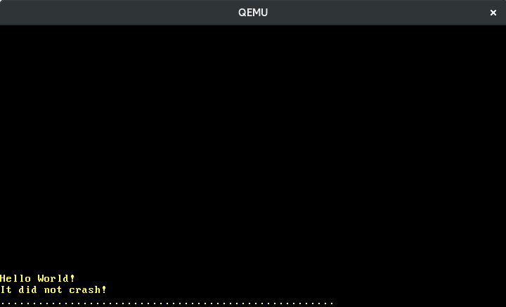

+++
title = "ハードウェア割り込み"
weight = 7
path = "ja/hardware-interrupts"
date = 2018-10-22

[extra]
chapter = "Interrupts"
# Please update this when updating the translation
translation_based_on_commit = "6e6d9cbe05a0e60294424e0b40fbb79f0b90ecab"
# GitHub usernames of the people that translated this post
translators = ["d0iasm"]
+++

この記事では、ハードウェア割り込みを正しくCPUに転送するために、プログラマブル割込みコントローラを設定します。これらの割り込みを処理するために、例外ハンドラと同じように割り込みディスクリプタテーブルに新しいエントリを追加します。周期的なタイマ割り込みとキーボードからの入力を取得する方法を学びます。

<!-- more -->

このブログの内容は[GitHub]上で公開・開発されています。何か問題や質問などがあればissueをたててください (訳注: リンクは原文(英語)のものになります)。また[こちら][at the bottom]にコメントを残すこともできます。この記事の完全なソースコードは[`post-07`][post branch]ブランチにあります。

[GitHub]: https://github.com/phil-opp/blog_os
[at the bottom]: #comments
[post branch]: https://github.com/phil-opp/blog_os/tree/post-07

<!-- toc -->

## 概要

割り込みは、接続されたハードウェアデバイスからCPUに通知する方法を提供します。そのため、カーネルに定期的にキーボードの新しい文字をチェックさせる（[__polling__]と呼ばれるプロセス）代わりに、キーボードはキーを押すたびにカーネルに通知することができます。カーネルは何かが起こったときだけ行動する必要があるので、これははるかに効率的です。また、カーネルは次のポーリング時だけでなく、すぐに反応することができるので、反応時間を短縮することができます。

[__polling__]: https://en.wikipedia.org/wiki/Polling_(computer_science)

すべてのハードウェアデバイスを直接CPUに接続することはできません。その代わりに、別の**割り込みコントローラ**が全てのデバイスからの割り込みを集約してCPUに通知します:

```
                                    ____________             _____
               Timer ------------> |            |           |     |
               Keyboard ---------> | Interrupt  |---------> | CPU |
               Other Hardware ---> | Controller |           |_____|
               Etc. -------------> |____________|

```

ほとんどの割り込みコントローラはプログラム可能で、割り込みの異なる優先度をサポートしています。例えば、キーボード割り込みよりもタイマ割り込みの方が優先度が高く、正確な時間の計測が可能になります。

例外とは異なり、ハードウェア割り込みは**非同期的**に発生します。これは、実行されるコードから完全に独立しており、いつでも発生する可能性があることを意味します。
このようにして、私たちのカーネルは、並行処理に関するバグを潜在的に含むようになります。Rustの厳密な所有権モデルは、グローバルな状態の変更を禁止しているので、ここで役立ちます。しかし、この記事で後述するように、デッドロックはまだ可能です。

## 8259 PIC

[Intel 8259]は、1976年に登場したプログラマブル割り込みコントローラ（PIC）です。長い間、新しい[APIC]に置き換えられてきましたが、下位互換性の理由から、現在のシステムでもそのインターフェイスはサポートされています。8259 PICはAPICよりもセットアップが格段に簡単なので、後の記事でAPICに切り替える前に、これを使って割込みについて紹介します。

[APIC]: https://en.wikipedia.org/wiki/Intel_APIC_Architecture

Intel 8259は8本の割り込みラインと、CPUと通信するための複数のラインを持っています。当時の典型的なシステムは、プライマリとセカンダリの2つのインスタンスの8259 PICを搭載しており、セカンダリのPICはプライマリの割り込みラインの1つに接続されていました:

[Intel 8259]: https://en.wikipedia.org/wiki/Intel_8259

```
                     ____________                          ____________
Real Time Clock --> |            |   Timer -------------> |            |
ACPI -------------> |            |   Keyboard-----------> |            |      _____
Available --------> | Secondary  |----------------------> | Primary    |     |     |
Available --------> | Interrupt  |   Serial Port 2 -----> | Interrupt  |---> | CPU |
Mouse ------------> | Controller |   Serial Port 1 -----> | Controller |     |_____|
Co-Processor -----> |            |   Parallel Port 2/3 -> |            |
Primary ATA ------> |            |   Floppy disk -------> |            |
Secondary ATA ----> |____________|   Parallel Port 1----> |____________|

```

この図は典型的な割り込みラインの割り当てを示しています。15本のラインのほとんどが固定マッピングされており、例えば、セカンダリのPICのライン4がマウスに割り当てられていることがわかります。

各コントローラは2つの[I/O ポート][I/O ports]を介して設定することができ、1つの"コマンド"ポートと1つの"データ"ポートがあります。プライマリコントローラの場合、これらのポートは `0x20` (コマンド) と `0x21` (データ) です。セカンダリコントローラでは、`0xa0` (コマンド) と `0xa1` (データ) です。PICの設定方法の詳細については、[osdev.orgの記事][article on osdev.org]を参照してください。

[I/O ports]: @/edition-2/posts/04-testing/index.md#i-o-ports
[article on osdev.org]: https://wiki.osdev.org/8259_PIC

### 実装

PICのデフォルト構成では、0〜15の範囲の割り込みベクタ番号をCPUに送信するため、使用できません。これらの番号は既にCPUの例外によって占有されており、例えば番号8はダブルフォルトに対応しています。この重複問題を解決するには、PICの割り込みを別の番号にリマップする必要があります。実際の範囲は例外と重ならない限り問題ではありませんが、一般的には32～47の範囲が選択されます。

設定は、PICのコマンドポートとデータポートに特別な値を書き込むことによって行われます。幸いなことに、[`pic8259_simple`]というクレートがすでにあるので、自分で初期化シーケンスを書く必要はありません。どのように動作するのか興味がある場合は、[そのソースコード][pic crate source]をチェックしてください。

[`pic8259_simple`]: https://docs.rs/pic8259_simple/0.2.0/pic8259_simple/
[pic crate source]: https://docs.rs/crate/pic8259_simple/0.2.0/source/src/lib.rs

依存関係としてクレートを追加するには、以下のようにプロジェクトに追加します。

```toml
# in Cargo.toml

[dependencies]
pic8259_simple = "0.2.0"
```

The main abstraction provided by the crate is the [`ChainedPics`] struct that represents the primary/secondary PIC layout we saw above. It is designed to be used in the following way:

クレートによって提供される主な抽象化は、上で紹介したプライマリ/セカンダリPICレイアウトを表す[`ChainedPics`]構造体です。これは以下のように設計されています。

[`ChainedPics`]: https://docs.rs/pic8259_simple/0.2.0/pic8259_simple/struct.ChainedPics.html

```rust
// in src/interrupts.rs

use pic8259_simple::ChainedPics;
use spin;

pub const PIC_1_OFFSET: u8 = 32;
pub const PIC_2_OFFSET: u8 = PIC_1_OFFSET + 8;

pub static PICS: spin::Mutex<ChainedPics> =
    spin::Mutex::new(unsafe { ChainedPics::new(PIC_1_OFFSET, PIC_2_OFFSET) });
```

上で述べたように、PICSのオフセットを32〜47の範囲に設定しています。このように `ChainedPics` 構造体を `Mutex` で包むことで、次のステップで必要となる安全なミューティアブルアクセスを得ることができます([`lock` メソッド][spin mutex lock]を使用して)。関数 `ChainedPics::new` は、オフセットを間違えると未定義の動作を引き起こす可能性があるため、安全ではありません。

[spin mutex lock]: https://docs.rs/spin/0.5.2/spin/struct.Mutex.html#method.lock

これで、`init`関数で8259 PICを初期化することができます。

```rust
// in src/lib.rs

pub fn init() {
    gdt::init();
    interrupts::init_idt();
    unsafe { interrupts::PICS.lock().initialize() }; // new
}
```

PICの初期化を行うには、[`initialize`]関数を使用します。この関数も `ChainedPics::new` 関数と同様に、PICの設定を誤ると未定義の動作を引き起こす可能性があるため、安全ではありません。

すべてがうまくいけば、`cargo run`を実行したときに"It did not crash"というメッセージが表示されるようになるはずです。

[`initialize`]: https://docs.rs/pic8259_simple/0.2.0/pic8259_simple/struct.ChainedPics.html#method.initialize

## 割り込みの有効化

今まではCPUの設定で割り込みが無効化されたままなので、何も起こりませんでした。つまり、CPUは割り込みコントローラを全く聞かないので、割り込みがCPUに届かないということです。これを変更してみましょう。

```rust
// in src/lib.rs

pub fn init() {
    gdt::init();
    interrupts::init_idt();
    unsafe { interrupts::PICS.lock().initialize() };
    x86_64::instructions::interrupts::enable();     // new
}
```

x86_64クレートの `interrupts::enable` 関数は、外部からの割り込みを有効にするために特別な `sti` 命令 (「割り込みの設定」) を実行します。`cargo run` を実行してみると、ダブルフォルトが発生していることがわかります。


このダブルフォルトの理由は、ハードウェアタイマー（正確には [Intel 8253]）がデフォルトで有効になっているため、割り込みを有効にするとすぐにタイマー割り込みの受信を開始するからです。まだハンドラ関数を定義していないので、ダブルフォルトハンドラが呼び出されます。

[Intel 8253]: https://en.wikipedia.org/wiki/Intel_8253

## タイマー割り込みのハンドラー

[8259 PICの図](#8259-PIC)を見るとわかるように、タイマーはプライマリPICの0行目を使用しています。これは、割り込み番号32(0 + オフセット32)としてCPUに到着することを意味します。インデックス32をハードコーディングする代わりに、`InterruptIndex` enumに格納します。

```rust
// in src/interrupts.rs

#[derive(Debug, Clone, Copy)]
#[repr(u8)]
pub enum InterruptIndex {
    Timer = PIC_1_OFFSET,
}

impl InterruptIndex {
    fn as_u8(self) -> u8 {
        self as u8
    }

    fn as_usize(self) -> usize {
        usize::from(self.as_u8())
    }
}
```

enumは[Cのようなenum][C-like enum]なので、各変数のインデックスを直接指定することができます。`repr(u8)` 属性は、各変数が `u8` として表現されることを指定します。将来的には、他の割り込み用の変数を追加する予定です。

[C-like enum]: https://doc.rust-lang.org/reference/items/enumerations.html#custom-discriminant-values-for-fieldless-enumerations

これで、タイマー割り込みのハンドラ関数を追加することができるようになりました。

```rust
// in src/interrupts.rs

use crate::print;

lazy_static! {
    static ref IDT: InterruptDescriptorTable = {
        let mut idt = InterruptDescriptorTable::new();
        idt.breakpoint.set_handler_fn(breakpoint_handler);
        […]
        idt[InterruptIndex::Timer.as_usize()]
            .set_handler_fn(timer_interrupt_handler); // new

        idt
    };
}

extern "x86-interrupt" fn timer_interrupt_handler(
    _stack_frame: &mut InterruptStackFrame)
{
    print!(".");
}
```

この`timer_interrupt_handler`は、CPUは例外や外部割り込みに対しても同じように反応するので、例外ハンドラと同じシグネチャを持っています。（唯一の違いはいくつかの例外はエラーコードをプッシュするということです。）構造体 [`InterruptDescriptorTable`] は [`IndexMut`] を実装しているので、配列にインデックスを用いて個々のエントリにアクセスすることができます。

[`InterruptDescriptorTable`]: https://docs.rs/x86_64/0.13.2/x86_64/structures/idt/struct.InterruptDescriptorTable.html
[`IndexMut`]: https://doc.rust-lang.org/core/ops/trait.IndexMut.html

タイマー割り込みハンドラでは、画面にドットを表示します。タイマー割り込みは周期的に発生するので、タイマーの目盛りごとにドットが表示されることを期待しています。しかし、実行してみると、1つのドットしか印刷されていません。


### 割り込み終了の通知

その理由は、PICが割り込みハンドラからの明示的な "割り込み終了"（EOI）信号を期待しているからです。この信号は、割り込みが処理されたこと、システムが次の割り込みを受信する準備ができたことをコントローラに伝えます。PICは最初のタイマ割込みの処理でまだ忙しいと考え、次のタイマ割込みを送信する前にEOI信号を待ちます。

EOIを送信するには、`PICS`構造体を使用します。

```rust
// in src/interrupts.rs

extern "x86-interrupt" fn timer_interrupt_handler(
    _stack_frame: &mut InterruptStackFrame)
{
    print!(".");

    unsafe {
        PICS.lock()
            .notify_end_of_interrupt(InterruptIndex::Timer.as_u8());
    }
}
```

`notify_end_of_interrupt`はプライマリPICとセカンダリPICのどちらが割り込みを送信したかを判別し、`command`ポートと`data`ポートを使ってそれぞれのコントローラにEOI信号を送信します。セカンダリPICが割り込みを送信した場合、セカンダリPICはプライマリPICの入力ラインに接続されているため、両方のPICに通知する必要があります。

正しい割り込みベクタ番号を使用するように注意しなければなりません、そうしないと送信されていない重要な割り込みを誤って削除してしまったり、 システムがハングアップしてしまう可能性があります。これがこの関数が安全でない理由です。

ここで `cargo run` を実行すると、画面上にドットが周期的に現れるのがわかります。


### タイマーの設定

使用しているハードウェアタイマは、**Progammable Interval Timer**、略してPITと呼ばれています。その名の通り、割り込みの間隔を設定することができます。近いうちに[APICタイマー][APIC timer]に切り替える予定なので、ここでは詳しくは触れませんが、OSDevのwikiには[PITの設定][configuring the PIT]についての豊富な記事があります。

[APIC timer]: https://wiki.osdev.org/APIC_timer
[configuring the PIT]: https://wiki.osdev.org/Programmable_Interval_Timer

## デッドロック

これでカーネルに並行処理ができました。タイマー割り込みは非同期的に発生するので、いつでも`_start`関数に割り込みをかけることができます。幸いなことに、Rustの所有権システムはコンパイル時に多くのタイプの同時実行に関連するバグを防ぎます。注目すべき例外として、デッドロックがあります。デッドロックは、スレッドが決して自由にならないロックを取得しようとすると発生します。そのため、スレッドはハングアップしてしまいます。

カーネル内ではすでにデッドロックを引き起こすことができます。`println`マクロは`vga_buffer::_print`関数を呼び出しており、スピンロックを使って[`WRITER`をロック][vga spinlock]することを覚えておいてください。

[vga spinlock]: @/edition-2/posts/03-vga-text-buffer/index.md#spinlocks

```rust
// in src/vga_buffer.rs

[…]

#[doc(hidden)]
pub fn _print(args: fmt::Arguments) {
    use core::fmt::Write;
    WRITER.lock().write_fmt(args).unwrap();
}
```

これは`WRITER`をロックして`write_fmt`を呼び出し、関数の最後に暗黙のうちにロックを解除します。ここで`WRITER`がロックされている間に割り込みが発生し、割り込みハンドラも何かを印刷しようとしたとします。

Timestep | _start | interrupt_handler
---------|------|------------------
0 | calls `println!`      | &nbsp;
1 | `print` locks `WRITER` | &nbsp;
2 | | **interrupt occurs**, handler begins to run
3 | | calls `println!` |
4 | | `print` tries to lock `WRITER` (already locked)
5 | | `print` tries to lock `WRITER` (already locked)
… | | …
_never_ | _unlock `WRITER`_ |

`WRITER`はロックされているので、割り込みハンドラはそれがフリーになるまで待ちます。しかし、`_start`関数は割り込みハンドラが戻ってきた後も実行を続けるだけなので、このようなことは決して起こりません。このようにして、システム全体がハングアップしてしまいます。

### デッドロックを起こす

関数`_start`の最後にループ内の何かを表示することで、カーネル内でこのようなデッドロックを簡単に引き起こすことができます。

```rust
// in src/main.rs

#[no_mangle]
pub extern "C" fn _start() -> ! {
    […]
    loop {
        use blog_os::print;
        print!("-");        // new
    }
}
```

これをQEMUで実行すると、以下のような出力が得られます。


最初のタイマー割り込みが発生するまで、限られた数のハイフンしか印刷されないことがわかります。タイマー割り込みハンドラがドットを印刷しようとするとデッドロックしてしまうため、システムはハングアップしてしまいます。これが、上の出力でドットが表示されない理由です。

タイマー割り込みは非同期的に発生するため、実際のハイフンの数は実行中に変化します。このような非決定性が、並行処理関連のバグのデバッグを困難にしています。

### デッドロックの修正

このデッドロックを避けるために、`Mutex`がロックされている限り割り込みを無効にすることができる。

```rust
// in src/vga_buffer.rs

/// Prints the given formatted string to the VGA text buffer
/// through the global `WRITER` instance.
#[doc(hidden)]
pub fn _print(args: fmt::Arguments) {
    use core::fmt::Write;
    use x86_64::instructions::interrupts;   // new

    interrupts::without_interrupts(|| {     // new
        WRITER.lock().write_fmt(args).unwrap();
    });
}
```

関数[without_interrupts`]は [クロージャ][closure]を受け取り、割り込みが発生しない環境で実行します。これは`Mutex`がロックされている限り割り込みが発生しないようにするために使用します。今カーネルを実行してみると、ハングアップすることなく実行し続けていることがわかります。(まだドットを見ることができませんが、これはスクロールの速度が速すぎるためです。ループの中に `for _ in 0..10000 {}` を入れるなどして、印刷を遅くしてみてください。)

[`without_interrupts`]: https://docs.rs/x86_64/0.13.2/x86_64/instructions/interrupts/fn.without_interrupts.html
[closure]: https://doc.rust-lang.org/book/ch13-01-closures.html

同じ変更をシリアルモジュールの`_print`関数にも適用することで、デッドロックが発生しないようにすることができます。

```rust
// in src/serial.rs

#[doc(hidden)]
pub fn _print(args: ::core::fmt::Arguments) {
    use core::fmt::Write;
    use x86_64::instructions::interrupts;       // new

    interrupts::without_interrupts(|| {         // new
        SERIAL1
            .lock()
            .write_fmt(args)
            .expect("Printing to serial failed");
    });
}
```

割り込みを無効にすることは一般的な解決策ではないことに注意してください。問題は、最悪の場合の割り込み待ち時間、つまりシステムが割り込みに反応するまでの時間が長くなってしまうことです。したがって、割り込みは非常に短い時間だけ無効にすべきです。

## 競合状態の修正

`cargo test`を実行すると、`test_println_output`テストが失敗しているのがわかるでしょう。

```
> cargo test --lib
[…]
Running 4 tests
test_breakpoint_exception...[ok]
test_println... [ok]
test_println_many... [ok]
test_println_output... [failed]

Error: panicked at 'assertion failed: `(left == right)`
  left: `'.'`,
 right: `'S'`', src/vga_buffer.rs:205:9
```

理由は、テストとタイマーハンドラの間にある**競合状態（レースコンディション）**です。テストは以下のようになっていることを思い出してください。

```rust
// in src/vga_buffer.rs

#[test_case]
fn test_println_output() {
    let s = "Some test string that fits on a single line";
    println!("{}", s);
    for (i, c) in s.chars().enumerate() {
        let screen_char = WRITER.lock().buffer.chars[BUFFER_HEIGHT - 2][i].read();
        assert_eq!(char::from(screen_char.ascii_character), c);
    }
}
```

このテストでは、VGAバッファに文字列を印刷してから、`buffer_chars`配列を手動で繰り返して出力をチェックします。競合状態が発生するのは、`println`と画面文字の読み込みの間にタイマ割り込みハンドラが実行される可能性があるためです。これは危険な**データ競合**ではないことに注意してください。詳細は[**Rustonomicon**][nomicon-races]を参照してください。

[nomicon-races]: https://doc.rust-lang.org/nomicon/races.html

これを修正するには、タイマーハンドラが`.`を画面に出力できないように、テストの全期間にわたって`WRITER`をロックしておく必要があります。修正されたテストは以下のようになります。

```rust
// in src/vga_buffer.rs

#[test_case]
fn test_println_output() {
    use core::fmt::Write;
    use x86_64::instructions::interrupts;

    let s = "Some test string that fits on a single line";
    interrupts::without_interrupts(|| {
        let mut writer = WRITER.lock();
        writeln!(writer, "\n{}", s).expect("writeln failed");
        for (i, c) in s.chars().enumerate() {
            let screen_char = writer.buffer.chars[BUFFER_HEIGHT - 2][i].read();
            assert_eq!(char::from(screen_char.ascii_character), c);
        }
    });
}
```

以下の変更を行いました。

- `lock()`メソッドを明示的に使用することで、テスト全体でライターをロックしておきます。`println`の代わりに、既にロックされているライターへの出力を可能にする [`writeln`]マクロを使用します。
- 別のデッドロックを避けるために、テスト期間中は割り込みを無効にします。そうしないと、ライターがロックされている間にテストが中断されてしまうかもしれません。
- タイマー割り込みハンドラはまだテストの前に実行される可能性があるので、文字列`s`を印刷する前に改行`\n`を追加で印刷します。こうすることで、タイマーハンドラが既に現在の行に`.`文字を印刷していた場合のテスト失敗を避けることができます。

[`writeln`]: https://doc.rust-lang.org/core/macro.writeln.html

上記の変更により、`cargo test`は再び成功するようになりました。

これはテストの失敗を引き起こすだけの非常に無害な競合状態でした。ご想像の通り、他の競合状態はその非決定論的な性質のため、デバッグが非常に困難になることがあります。幸いなことに、Rustはデータ競合を防ぐことができます。データ競合は、システムの破壊やサイレントメモリ破損など、あらゆる種類の未定義な動作を引き起こす可能性があるため、最も深刻な競合状態です。

## `hlt`命令

これまでは`_start`と`panic`関数の最後に単純な空のループ文を使用していました。これにより、CPUは無限に実行するようになり、期待通りに動作します。しかし、何の作業もしていないのにCPUがフル回転し続けるので、非常に非効率的でもあります。この問題は、カーネルを実行するとタスクマネージャで確認できます。QEMUプロセスは常に100%近くのCPUを必要としています。

私たちが本当にしたいことは、次の割り込みが来るまでCPUを停止させることです。これにより、CPUはスリープ状態になり、消費するエネルギーが大幅に少なくなります。[`hlt`命令][hlt instruction]はまさにこれを実行します。この命令を使って、エネルギー効率の良いエンドレスループを作ってみましょう。

[hlt instruction]: https://en.wikipedia.org/wiki/HLT_(x86_instruction)

```rust
// in src/lib.rs

pub fn hlt_loop() -> ! {
    loop {
        x86_64::instructions::hlt();
    }
}
```


関数`instructions::hlt`は、アセンブリ命令を[薄いラッパー (thin wrapper)][thin wrapper]で囲んだだけのものです。メモリの安全性を損なうことがないので安全です。

[thin wrapper]: https://github.com/rust-osdev/x86_64/blob/5e8e218381c5205f5777cb50da3ecac5d7e3b1ab/src/instructions/mod.rs#L16-L22


これで、`_start`や`panic`関数の無限ループの代わりに`hlt_loop`を使うことができるようになりました。

```rust
// in src/main.rs

#[no_mangle]
pub extern "C" fn _start() -> ! {
    […]

    println!("It did not crash!");
    blog_os::hlt_loop();            // new
}


#[cfg(not(test))]
#[panic_handler]
fn panic(info: &PanicInfo) -> ! {
    println!("{}", info);
    blog_os::hlt_loop();            // new
}

```

同様に`lib.rs`も更新しましょう。

```rust
// in src/lib.rs

/// Entry point for `cargo test`
#[cfg(test)]
#[no_mangle]
pub extern "C" fn _start() -> ! {
    init();
    test_main();
    hlt_loop();         // new
}

pub fn test_panic_handler(info: &PanicInfo) -> ! {
    serial_println!("[failed]\n");
    serial_println!("Error: {}\n", info);
    exit_qemu(QemuExitCode::Failed);
    hlt_loop();         // new
}
```

QEMUでカーネルを実行すると、CPUの使用量が大幅に減りました。

## キーボード入力

外部デバイスからの割り込みを扱えるようになったので、ついにキーボード入力のサポートを追加することができます。これにより、初めてカーネルと対話できるようになります。

<aside class="post_aside">

ここでは[PS/2]キーボードの扱い方を記述しているだけで、USBキーボードの扱い方は記述していないことに注意してください。しかし、メインボードは古いソフトウェアをサポートするためにUSBキーボードをPS/2デバイスとしてエミュレートするので、カーネルでUSBをサポートするまではUSBキーボードを無視しても問題ありません。

</aside>

[PS/2]: https://en.wikipedia.org/wiki/PS/2_port

ハードウェアタイマーと同様に、キーボードコントローラはデフォルトですでに有効になっています。そのため、キーを押すとキーボードコントローラはPICに割り込みを送り、それをCPUに転送します。CPUはIDTでハンドラ関数を探しますが、対応するエントリは空です。そのため、ダブルフォルトが発生します。

そこで、キーボード割り込みのハンドラ関数を追加してみましょう。タイマー割り込みのハンドラを定義したのと似ており、割り込み番号が違うだけです。

```rust
// in src/interrupts.rs

#[derive(Debug, Clone, Copy)]
#[repr(u8)]
pub enum InterruptIndex {
    Timer = PIC_1_OFFSET,
    Keyboard, // new
}

lazy_static! {
    static ref IDT: InterruptDescriptorTable = {
        let mut idt = InterruptDescriptorTable::new();
        idt.breakpoint.set_handler_fn(breakpoint_handler);
        […]
        // new
        idt[InterruptIndex::Keyboard.as_usize()]
            .set_handler_fn(keyboard_interrupt_handler);

        idt
    };
}

extern "x86-interrupt" fn keyboard_interrupt_handler(
    _stack_frame: &mut InterruptStackFrame)
{
    print!("k");

    unsafe {
        PICS.lock()
            .notify_end_of_interrupt(InterruptIndex::Keyboard.as_u8());
    }
}
```

We now see that a `k` appears on the screen when we press a key. However, this only works for the first key we press, even if we continue to press keys no more `k`s appear on the screen. This is because the keyboard controller won't send another interrupt until we have read the so-called _scancode_ of the pressed key.

[8259 PICの図](#8259-PIC)を見るとわかるように、キーボードはプライマリPICの1行目を使用しています。これは、割り込み33(1 + オフセット32)としてCPUに到達することを意味します。このインデックスを `InterruptIndex` enumに新しい`Keyboard`変数として追加します。割り込みハンドラでは`k`を出力して割り込み終了信号を割り込みコントローラに送信します。

これで、キーを押すと`k`が画面に表示されることがわかります。しかし、これは最初に押されたキーに対してのみ機能し、キーを押し続けても画面に`k`が表示されなくなります。これは、押されたキーの**スキャンコード (scancode) **を読み取るまで、キーボードコントローラが次の割り込みを送信しないためです。

### スキャンコードの読み取り

どのキーが押されたかを調べるには、キーボードコントローラに問い合わせる必要があります。これを行うには、PS/2コントローラのデータポート（番号`0x60`の[I/Oポート][I/O port]）から読み込む必要がある。

[I/O port]: @/edition-2/posts/04-testing/index.md#i-o-ports

```rust
// in src/interrupts.rs

extern "x86-interrupt" fn keyboard_interrupt_handler(
    _stack_frame: &mut InterruptStackFrame)
{
    use x86_64::instructions::port::Port;

    let mut port = Port::new(0x60);
    let scancode: u8 = unsafe { port.read() };
    print!("{}", scancode);

    unsafe {
        PICS.lock()
            .notify_end_of_interrupt(InterruptIndex::Keyboard.as_u8());
    }
}
```

キーボードのデータポートからバイトを読み込むには、`x86_64`クレートの[`Port`]型を使います。このバイトは[__scancode__]と呼ばれ、キーを押す/離すときを表す数値です。このスキャンコードに対してまだ何もせず、画面に印刷だけをします。

[`Port`]: https://docs.rs/x86_64/0.13.2/x86_64/instructions/port/struct.Port.html
[__scancode__]: https://en.wikipedia.org/wiki/Scancode



上の画像は、私がゆっくりと"123"を入力しているところを示しています。隣接するキーには隣接するスキャンコードがあり、キーを押すと離すのとは異なるスキャンコードが発生することがわかります。しかし、スキャンコードを実際のキー操作に正確に変換するにはどうすればいいのでしょうか？

### スキャンコードの解釈

スキャンコードとキーの間のマッピングには3つの異なる標準があり、いわゆる**スキャンコードセット**と呼ばれています。これら3つの規格はすべて初期のIBMコンピュータのキーボードにさかのぼります：[IBM XT]、[IBM 3270 PC]、そして[IBM AT]です。後のコンピュータは幸いにも、新しいスキャンコードセットを定義する傾向を継続することはなく、むしろ既存のセットをエミュレートして拡張しました。今日では、ほとんどのキーボードは3つのセットのいずれかをエミュレートするように設定できます。

[IBM XT]: https://en.wikipedia.org/wiki/IBM_Personal_Computer_XT
[IBM 3270 PC]: https://en.wikipedia.org/wiki/IBM_3270_PC
[IBM AT]: https://en.wikipedia.org/wiki/IBM_Personal_Computer/AT

By default, PS/2 keyboards emulate scancode set 1 ("XT"). In this set, the lower 7 bits of a scancode byte define the key, and the most significant bit defines whether it's a press ("0") or a release ("1"). Keys that were not present on the original [IBM XT] keyboard, such as the enter key on the keypad, generate two scancodes in succession: a `0xe0` escape byte and then a byte representing the key. For a list of all set 1 scancodes and their corresponding keys, check out the [OSDev Wiki][scancode set 1].

デフォルトでは、PS/2キーボードはスキャンコードセット1（"XT"）をエミュレートします。このセットでは、スキャンコードバイトの下位7ビットがキーを定義し、最上位ビットがプレス（"0"）かリリース（"1"）かを定義します。オリジナルの[IBM XT]キーボードには存在しなかったキー、例えばキーパッドのエンターキーは、連続して2つのスキャンコードを生成します。`0xe0`エスケープバイトとキーを表すバイトです。すべてのセット1のスキャンコードとそれに対応するキーのリストについては、[OSDev Wiki][scancode set 1]を参照してください。

[scancode set 1]: https://wiki.osdev.org/Keyboard#Scan_Code_Set_1

スキャンコードをキーに変換するには、`match`文を使用します。

```rust
// in src/interrupts.rs

extern "x86-interrupt" fn keyboard_interrupt_handler(
    _stack_frame: &mut InterruptStackFrame)
{
    use x86_64::instructions::port::Port;

    let mut port = Port::new(0x60);
    let scancode: u8 = unsafe { port.read() };

    // new
    let key = match scancode {
        0x02 => Some('1'),
        0x03 => Some('2'),
        0x04 => Some('3'),
        0x05 => Some('4'),
        0x06 => Some('5'),
        0x07 => Some('6'),
        0x08 => Some('7'),
        0x09 => Some('8'),
        0x0a => Some('9'),
        0x0b => Some('0'),
        _ => None,
    };
    if let Some(key) = key {
        print!("{}", key);
    }

    unsafe {
        PICS.lock()
            .notify_end_of_interrupt(InterruptIndex::Keyboard.as_u8());
    }
}
```

上記のコードは、数字キー0~9のキー押下を翻訳し、他のすべてのキーを無視します。[match]文を用いて、各スキャンコードに文字または`None`を割り当てます。次に、オプションの`key`をデストラクトするために[`if let`]を使います。パターン内で同じ変数名`key`を使用することで、前の宣言を[シャドーイング][shadow]しています。

[match]: https://doc.rust-lang.org/book/ch06-02-match.html
[`if let`]: https://doc.rust-lang.org/book/ch18-01-all-the-places-for-patterns.html#conditional-if-let-expressions
[shadow]: https://doc.rust-lang.org/book/ch03-01-variables-and-mutability.html#shadowing

これで数字が書けるようになりました。


他のキーの翻訳も同じように行います。幸いなことに、スキャンコードセット1と2を翻訳するためのクレート[`pc-keyboard`]があるので、自分たちで実装する必要はありません。クレートを使うには、それを`Cargo.toml`に追加して`lib.rs`にインポートします。

[`pc-keyboard`]: https://docs.rs/pc-keyboard/0.5.0/pc_keyboard/

```toml
# in Cargo.toml

[dependencies]
pc-keyboard = "0.5.0"
```

このクレートを使って`keyboard_interrupt_handler`を書き換えることができます。

```rust
// in/src/interrupts.rs

extern "x86-interrupt" fn keyboard_interrupt_handler(
    _stack_frame: &mut InterruptStackFrame)
{
    use pc_keyboard::{layouts, DecodedKey, HandleControl, Keyboard, ScancodeSet1};
    use spin::Mutex;
    use x86_64::instructions::port::Port;

    lazy_static! {
        static ref KEYBOARD: Mutex<Keyboard<layouts::Us104Key, ScancodeSet1>> =
            Mutex::new(Keyboard::new(layouts::Us104Key, ScancodeSet1,
                HandleControl::Ignore)
            );
    }

    let mut keyboard = KEYBOARD.lock();
    let mut port = Port::new(0x60);

    let scancode: u8 = unsafe { port.read() };
    if let Ok(Some(key_event)) = keyboard.add_byte(scancode) {
        if let Some(key) = keyboard.process_keyevent(key_event) {
            match key {
                DecodedKey::Unicode(character) => print!("{}", character),
                DecodedKey::RawKey(key) => print!("{:?}", key),
            }
        }
    }

    unsafe {
        PICS.lock()
            .notify_end_of_interrupt(InterruptIndex::Keyboard.as_u8());
    }
}
```

マクロ`lazy_static`を用いて、Mutexで保護された静的な[`Keyboard`]オブジェクトを作成します。この `Keyboard`をUSキーボードレイアウトで初期化し、スキャンコードセットを1に設定します。[`HandleControl`]パラメータでは、`ctrl+[a-z]`をUnicode文字`U+0001`から`U+001A`にマップすることができます。これを行いたくないので、`Ignore`オプションを使用して`ctrl`を通常のキーのように扱うようにします。

[`HandleControl`]: https://docs.rs/pc-keyboard/0.5.0/pc_keyboard/enum.HandleControl.html

On each interrupt, we lock the Mutex, read the scancode from the keyboard controller and pass it to the [`add_byte`] method, which translates the scancode into an `Option<KeyEvent>`. The [`KeyEvent`] contains which key caused the event and whether it was a press or release event.

各割り込みでは、Mutexをロックし、キーボードコントローラからスキャンコードを読み取り、それを[`add_byte`]メソッドに渡し、スキャンコードを`Option<KeyEvent>`に変換します。[`KeyEvent`]には、イベントの原因となったキーと、それがプレスイベントなのかリリースイベントなのかが含まれています。

[`Keyboard`]: https://docs.rs/pc-keyboard/0.5.0/pc_keyboard/struct.Keyboard.html
[`add_byte`]: https://docs.rs/pc-keyboard/0.5.0/pc_keyboard/struct.Keyboard.html#method.add_byte
[`KeyEvent`]: https://docs.rs/pc-keyboard/0.5.0/pc_keyboard/struct.KeyEvent.html

このキーイベントを解釈するために、[`process_keyevent`]メソッドに渡すと、変換可能であれば、キーイベントを文字に変換してくれます。例えば、シフトキーが押されたかどうかに応じて、`A`キーの押下イベントを小文字の`a`文字か大文字の`A`文字に変換します。

[`process_keyevent`]: https://docs.rs/pc-keyboard/0.5.0/pc_keyboard/struct.Keyboard.html#method.process_keyevent

この修正された割り込みハンドラを使って、テキストを書くことができるようになりました。


### キーボードの設定

PS/2キーボードのいくつかの側面、例えばどのスキャンコードセットを使用するかなどを設定することができます。この記事はすでに十分に長いのでここでは取り上げませんが、OSDev Wikiには可能な[設定コマンド][configuration commands]の概要が記載されています。

[configuration commands]: https://wiki.osdev.org/PS/2_Keyboard#Commands

## まとめ

この投稿では、外部割り込みを有効にして処理する方法を説明しました。8259 PICとそのプライマリ/セカンダリレイアウト、割り込み番号のリマッピング、「割り込み終了（EOI）」信号について学びました。ハードウェアタイマーとキーボードのハンドラを実装し、次の割り込みまでCPUを停止させる`hlt`命令について学びました。

これで、カーネルと対話できるようになり、小さなシェルや簡単なゲームを作成するための基本的な構成要素を手に入れることができました。

## 次の記事は？

タイマー割り込みは、実行中のプロセスを定期的に中断してカーネルの制御を取り戻す方法を提供するため、オペレーティングシステムにとって不可欠です。カーネルは別のプロセスに切り替えて、複数のプロセスが並列に走っているような錯覚を起こすことができます。

しかし、プロセスやスレッドを作成する前に、それらのためにメモリを割り当てる方法が必要です。次の記事では、この基本的な構成要素を提供するためのメモリ管理を探っていきます。
