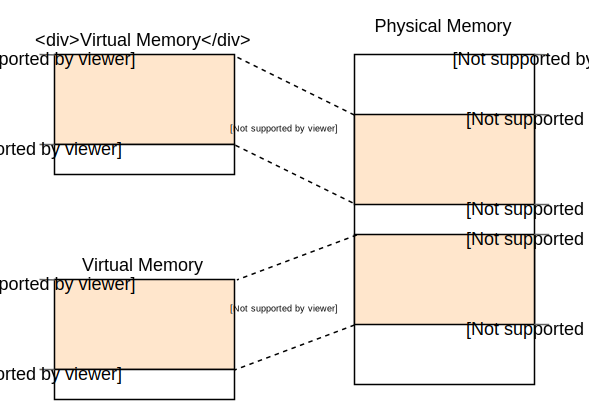
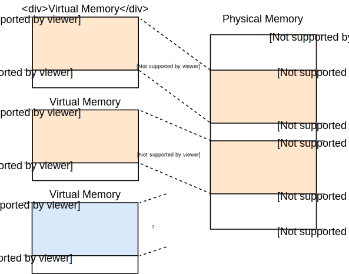
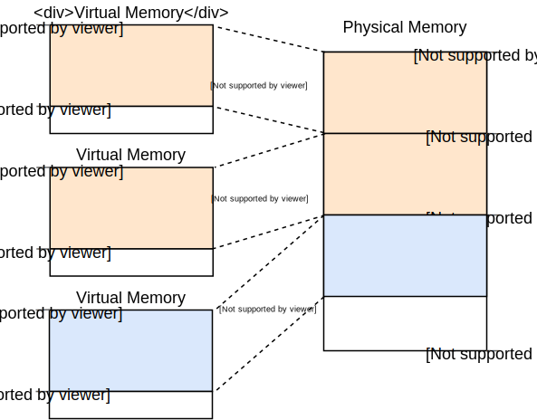
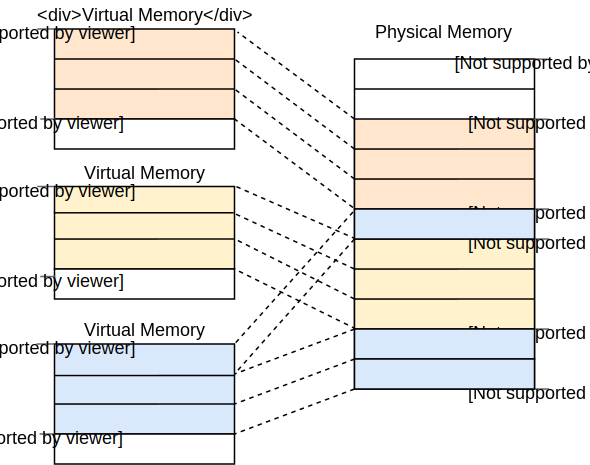
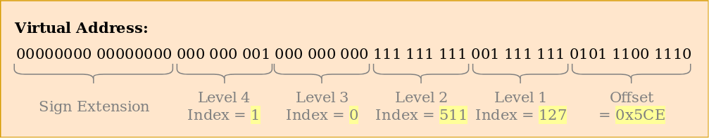
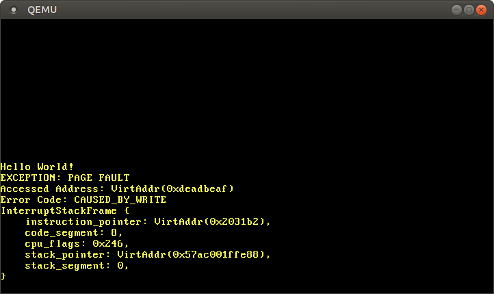
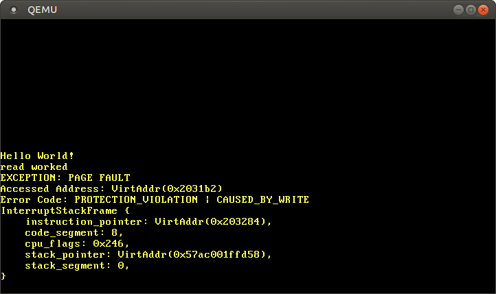

+++
title = "مقدمة إلى Paging"
weight = 8
path = "ar/paging-introduction"
date = 2019-01-14

[extra]
chapter = "Memory Management"

# GitHub usernames of the people that translated this post
translators = ["mindfreq"]
rtl = true
+++

يقدم هذا المقال _paging_، مخطط إدارة ذاكرة شائع جدًا سنستخدمه أيضًا لنظام التشغيل الخاص بنا. يشرح لماذا نحتاج إلى عزل الذاكرة، كيف تعمل _segmentation_، ما هي _virtual memory_، وكيف يحل paging مشكلة تجزئة الذاكرة. يستكشف أيضًا تخطيط multilevel page tables على معمارية x86_64.

<!-- more -->

هذا المدونة مطوّرة بشكل مفتوح على [GitHub]. إذا كان لديك أي مشاكل أو أسئلة، يرجى فتح issue هناك. يمكنك أيضًا ترك تعليقات [في الأسفل].  يمكن العثور على الكود المصدري الكامل لهذا المقال في فرع [`post-08`][post branch].

[GitHub]: https://github.com/phil-opp/blog_os
[at the bottom]: #comments
<!-- fix for zola anchor checker (target is in template): <a id="comments"> -->
[post branch]: https://github.com/phil-opp/blog_os/tree/post-08

<!-- toc -->

## حماية الذاكرة

واحدة من المهام الرئيسية لنظام التشغيل هي عزل البرامج عن بعضها. متصفح الويب الخاص بك يجب ألا يتمكن من التدخل في محرر النصوص، على سبيل المثال. لتحقيق هذا الهدف، تستفيد أنظمة التشغيل من وظائف الأجهزة لضمان أن مناطق ذاكرة عملية واحدة غير قابلة للوصول من قبل عمليات أخرى. هناك نهج مختلفة حسب الأجهزة وتنفيذ نظام التشغيل.

كمثال، بعض معالجات ARM Cortex-M (المستخدمة في الأنظمة المدمجة) لديها [_Memory Protection Unit_] (MPU)، التي تسمح لك بتحديد عدد صغير (مثل 8) من مناطق الذاكرة مع أذونات وصول مختلفة (مثل عدم الوصول، للقراءة فقط، قراءة وكتابة). في كل وصول للذاكرة، يضمن MPU أن العنوان في منطقة بأذونات وصول صحيحة ويرمي exception بخلاف ذلك. بتغيير المناطق وأذونات الوصول في كل تبديل عملية، يمكن لنظام التشغيل ضمان أن كل عملية تصل فقط إلى ذاكرتها الخاصة وبالتالي يعزل العمليات عن بعضها.

[_Memory Protection Unit_]: https://developer.arm.com/docs/ddi0337/e/memory-protection-unit/about-the-mpu

على x86، تدعم الأجهزة نهجين مختلفين لحماية الذاكرة: [segmentation] و [paging].

[segmentation]: https://en.wikipedia.org/wiki/X86_memory_segmentation
[paging]: https://en.wikipedia.org/wiki/Virtual_memory#Paged_virtual_memory

## التجزئة (Segmentation)

طُرحت Segmentation بالفعل في عام 1978، أصلًا لزيادة مقدار الذاكرة القابلة للعنونة. كان الوضع آنذاك أن CPUs تستخدم فقط عناوين 16-bit، التي حددت مقدار الذاكرة القابلة للعنونة بـ 64&nbsp;KiB. لجعل أكثر من هذه الـ 64&nbsp;KiB قابلة للوصول، أُدخلت segment registers إضافية، كل منها يحتوي على عنوان offset. أضاف وحدة المعالجة المركزية هذا offset تلقائيًا في كل وصول للذاكرة، حتى يمكن الوصول إلى ما يصل إلى 1&nbsp;MiB من الذاكرة.

يتم اختيار segment register تلقائيًا من قبل وحدة المعالجة المركزية بناءً على نوع الوصول للذاكرة: لجلب التعليمات، يُستخدم code segment `CS`، ولعمليات Stack (push/pop)، يُستخدم stack segment `SS`. التعليمات الأخرى تستخدم data segment `DS` أو extra segment `ES`. لاحقًا، أُضيفت segment register إضافيتان، `FS` و `GS`، يمكن استخدامهما بحرية.

في الإصدار الأول من segmentation، كانت segment registers تحتوي مباشرة على offset ولم يتم إجراء تحكم في الوصول. تغير هذا لاحقًا مع إدخال [_protected mode_]. عندما يعمل وحدة المعالجة المركزية في هذا الوضع، تحتوي segment descriptors على فهرس في [_descriptor table_] محلي أو عالمي، الذي يحتوي – بالإضافة إلى عنوان offset – على حجم segment وأذونات الوصول. بتحميل descriptor tables عالمية/محلية منفصلة لكل عملية، التي تقيد الوصول إلى الذاكرة في مناطق ذاكرة العملية الخاصة بها، يمكن لنظام التشغيل عزل العمليات عن بعضها.

[_protected mode_]: https://en.wikipedia.org/wiki/X86_memory_segmentation#Protected_mode
[_descriptor table_]: https://en.wikipedia.org/wiki/Global_Descriptor_Table

بتعديل عناوين الذاكرة قبل الوصول الفعلي، استخدمت segmentation بالفعل تقنية تُستخدم الآن في كل مكان تقريبًا: _virtual memory_.

### الذاكرة الافتراضية

فكرة virtual memory هي تجريد عناوين الذاكرة عن جهاز التخزين الأساسي. بدلاً من الوصول مباشرة إلى جهاز التخزين، تُنفّذ خطوة ترجمة أولاً. لـ segmentation، خطوة الترجمة هي إضافة عنوان offset للsegment النشط. تخيل برنامج يصل إلى عنوان ذاكرة `0x1234000` في segment بـ offset `0x1111000`: العنوان الذي يصل إليه فعلًا هو `0x2345000`.

للتمييز بين نوعي العنوان، تُسمى العناوين قبل الترجمة _virtual_، والعناوين بعد الترجمة _physical_. فرق مهم بين هذين النوعين من العناوين هو أن العناوين الفيزيائية فريدة وتشير دائمًا إلى نفس موقع الذاكرة المميز. العناوين الافتراضية، من ناحية أخرى، تعتمد على دالة الترجمة. من الممكن تمامًا أن يشير عنوانان افتراضيان مختلفان إلى نفس العنوان الفيزيائي. أيضًا، يمكن لعناوين افتراضية متطابقة أن تشير إلى عناوين فيزيائية مختلفة عندما تستخدم دوال ترجمة مختلفة.

مثال حيث تكون هذه الخاصية مفيدة هو تشغيل نفس البرنامج مرتين بالتوازي:




هنا نفس البرنامج يعمل مرتين، لكن بدوال ترجمة مختلفة. النسخة الأولى لها segment offset 100، لذلك عناوينها الافتراضية 0–150 تُترجم إلى العناوين الفيزيائية 100–250. النسخة الثانية لها offset 300، الذي يترجم عناوينها الافتراضية 0–150 إلى العناوين الفيزيائية 300–450. هذا يسمح لكلا البرنامجين بتشغيل نفس الكود واستخدام نفس العناوين الافتراضية دون التداخل مع بعضهما.

ميزة أخرى هي أن البرامج يمكن الآن وضعها في مواقع ذاكرة فيزيائية عشوائية، حتى لو تستخدم عناوين افتراضية completely مختلفة. لذلك، يمكن لنظام التشغيل استخدام كامل الذاكرة المتاحة دون الحاجة لإعادة تجميع البرامج.

### التجزئة

التمييز بين العناوين الافتراضية والفيزيائية يجعل segmentation قوية حقًا. ومع ذلك، لها مشكلة التجزئة. كمثال، تخيل أننا نريد تشغيل نسخة ثالثة من البرنامج الذي رأيناه أعلاه:



لا توجد طريقة لتعيين النسخة الثالثة من البرنامج إلى ذاكرة افتراضية دون التداخل، حتى لو كان هناك أكثر من ذاكرة حرة كافية. المشكلة هي أننا نحتاج إلى ذاكرة _مستمرة_ ولا نستطيع استخدام القطع الصغيرة الحرة.

طريقة واحدة لمكافحة هذه التجزئة هي إيقاف التنفيذ، نقل أجزاء الذاكرة المستخدمة أقرب معًا، تحديث الترجمة، ثم استئناف التنفيذ:



الآن هناك مساحة مستمرة كافية لبدء النسخة الثالثة من برنامجنا.

عيب عملية إزالة التجزئة هذه هي أنها تحتاج إلى نسخ كميات كبيرة من الذاكرة، الذي يقلل الأداء. تحتاج أيضًا إلى أن تُنفّذ بانتظام قبل أن تصبح الذاكرة مجزأة جدًا. هذا يجعل الأداء غير متوقع لأن البرامج تُوقف في أوقات عشوائية وقد تصبح غير مستجيبة.

مشكلة التجزئة هي واحدة من الأسباب التي لم تعد segmentation تُستخدم من قبل معظم الأنظمة. في الواقع، لم تعد segmentation مدعومة حتى في وضع 64-bit على x86 بعد الآن. بدلاً من ذلك، يُستخدم _paging_، الذي يتجنب مشكلة التجزئة completely.

## التصفح (Paging)

الفكرة هي تقسيم كل من ذاكرة الافتراضية والفيزيائية إلى كتل صغيرة ذات حجم ثابت. كتل ذاكرة الافتراضية تسمى _pages_، وكتل العنونة الفيزيائية تسمى _frames_. يمكن تعيين كل page إلى frame بشكل فردي، مما يجعل من الممكن تقسيم مناطق ذاكرة أكبر عبر physical frames غير متصلة.

ميزة ذلك تصبح مرئية إذا أعدنا مراجعة مثال مساحة الذاكرة المجزأة، لكننا نستخدم paging بدلاً من segmentation هذه المرة:



في هذا المثال، لدينا حجم page 50 byte، مما يعني أن كل منطقة ذاكرة لدينا مقسمة عبر ثلاث pages. كل page مُعيّنة إلى frame بشكل فردي، لذلك يمكن لمنطقة ذاكرة افتراضية مستمرة أن تُعيّن إلى physical frames غير متصلة. هذا يسمح لنا ببدء النسخة الثالثة من البرنامج دون إجراء أي إزالة تجزئة قبل ذلك.

### التجزئة المخفية

مقارنة بـ segmentation، يستخدم paging العديد من مناطق الذاكرة الصغيرة ذات الأحجام الثابتة بدلاً من عدد قليل من المناطق الكبيرة ذات الأحجام المتغيرة. بما أن كل frame لها نفس الحجم، لا توجد frames صغيرة جدًا للاستخدام، لذلك لا تحدث تجزئة.

أو _تبدو_ وكأنها لا تحدث تجزئة. لا تزال هناك نوع خفي من التجزئة، ما يسمى _internal fragmentation_. تحدث internal fragmentation لأن ليس كل منطقة ذاكرة مضاعف دقيق لحجم page. تخيل برنامج بحجم 101 في المثال أعلاه: سيحتاج إلى ثلاث pages بحجم 50، لذلك سيشغل 49 byte أكثر من المطلوب. للتمييز بين النوعين من التجزئة، يُسمى نوع التجزئة الذي يحدث عند استخدام segmentation _external fragmentation_.

internal fragmentation مؤسفة لكنها غالبًا أفضل من external fragmentation التي تحدث مع segmentation. لا تزال تُهدر ذاكرة، لكنها لا تتطلب إزالة تجزئة وتجعل مقدار التجزئة متوقعًا (في المتوسط نصف page لكل منطقة ذاكرة).

### جداول التصفح

رأينا أن كل page من الملايين المحتملة مُعيّنة بشكل فردي إلى frame. معلومات التعيين هذه تحتاج إلى التخزين في مكان ما. تستخدم segmentation segment selector register فردي لكل منطقة ذاكرة نشطة، الذي ليس ممكنًا لـ paging لأن هناك عددًا أكبر بكثير من pages من registers. بدلاً من ذلك، يستخدم paging بنية جدول تسمى _page table_ لتخزين معلومات التعيين.

لمثالنا أعلاه، ستبدو page tables كالتالي:


نرى أن كل instance للبرنامج لها page table خاصة بها. مؤشر إلى table النشطة حاليًا مخزن في register خاص بـ وحدة المعالجة المركزية. على `x86`، يسمى هذا register `CR3`. وظيفة نظام التشغيل هي تحميل هذا register بمؤشر إلى page table الصحيحة قبل تشغيل كل instance للبرنامج.

في كل وصول للذاكرة، يقرأ وحدة المعالجة مركزية مؤشر الجدول من register ويبحث عن frame المُعيّنة للصفحة المُتصلة في الجدول. هذا يتم completely في الأجهزة و completely غير مرئي للبرنامج الذي يعمل. لتسريع عملية الترجمة، لدي العديد من معماريات CPU cache خاص يتذكر نتائج الترجمات الأخيرة.

حسب المعمارية، يمكن لـ page table entries أيضًا تخزين سمات مثل أذونات الوصول في حقل flags. في المثال أعلاه، يتيح flag "r/w" الصفحة للقراءة والكتابة.

### جداول التصفح متعددة المستويات

الـ page tables البسيطة التي رأيناها للتو لها مشكلة في مساحات العنونة الأكبر: تُهدر ذاكرة. على سبيل المثال، تخيل برنامج يستخدم الصفحات الافتراضية الأربع `0` و `1_000_000` و `1_000_050` و `1_000_100` (نستخدم `_` كفاصل آلاف):


يحتاج فقط إلى 4 physical frames، لكن page table لها أكثر من مليون entry. لا يمكننا تجاهل entries الفارغة لأن وحدة المعالجة المركزية لن تكون قادرة بعد ذلك على القفز مباشرة إلى entry الصحيحة في عملية الترجمة (مثلًا، لم يعد مضمونًا أن الصفحة الرابعة تستخدم entry الرابعة).

لتقليل الذاكرة المُهدرة، يمكننا استخدام **two-level page table**. الفكرة هي أننا نستخدم page tables مختلفة لمناطق العنونة المختلفة. جدول إضافي يسمى _level 2_ page table يحتوي على التعيين بين مناطق العنونة و page tables (المستوى 1).

يُشرح هذا بشكل أفضل بمثال. لنحدد أن كل level 1 page table مسؤولة عن منطقة بحجم `10_000`. ثم ستكون الجداول التالية موجودة لتعيين المثال أعلاه:


الصفحة 0 تقع في أول `10_000` byte region، لذلك تستخدم أول entry من level 2 page table. هذا entry يشير إلى level 1 page table T1، التي تحدد أن الصفحة `0` تشير إلى frame `0`.

الصفحات `1_000_000` و `1_000_050` و `1_000_100` جميعها تقع في الـ 100 `10_000` byte region، لذلك تستخدم entry الـ 100 من level 2 page table. هذا entry يشير إلى level 1 page table مختلفة T2، التي تُعيّن الصفحات الثلاث إلى frames `100` و `150` و `200`. لاحظ أن عنوان الصفحة في level 1 tables لا يشمل region offset. على سبيل المثال، entry للصفحة `1_000_050` هو فقط `50`.

لا نزال لدينا 100 entry فارغة في level 2 table، لكن أقل بكثير من مليون entry فارغة قبل. سبب هذه التوفيرات هو أننا لا نحتاج إلى إنشاء level 1 page tables لمناطق الذاكرة غير المُعيّنة بين `10_000` و `1_000_000`.

مبدأ two-level page tables يمكن تمديده إلى ثلاثة أو أربعة أو مستويات أكثر. ثم يشير page table register إلى table المستوى الأعلى، الذي يشير إلى table المستوى الأدنى التالي، الذي يشير إلى المستوى الأدنى التالي، وما إلى ذلك. level 1 page table تشير بعد ذلك إلى frame المُعيّنة. المبدأ العام يسمى _multilevel_ أو _hierarchical_ page table.

الآن بعد أن نعرف كيف تعمل paging و multilevel page tables، يمكننا النظر في كيفية تنفيذ paging في معمارية x86_64 (نفترض في ما يلي أن وحدة المعالجة المركزية تعمل في وضع 64-bit).

## التصفح على x86_64

تستخدم معمارية x86_64 4-level page table و حجم page 4&nbsp;KiB. كل page table، بغض النظر عن المستوى، لها حجم ثابت 512 entries. كل entry لها حجم 8 bytes، لذلك كل table بحجم 512 * 8&nbsp;B = 4&nbsp;KiB وبالتالي تتناسب تمامًا في صفحة واحدة.

page table index لكل مستوى مشتق مباشرة من العنوان الافتراضي:


نرى أن كل table index يتكون من 9 bits، مما منطقي لأن كل table لها 2^9 = 512 entries. أدنى 12 bits هي offset في page من 4&nbsp;KiB (2^12 bytes = 4&nbsp;KiB). البتات 48 إلى 64 مُهملة، مما يعني أن x86_64 ليس 64-bit فعليًا لأنه يدعم فقط عناوين 48-bit.

حتى لو أن البتات 48 إلى 64 مُهملة، لا يمكن تعيينها بقيم عشوائية. بدلاً من ذلك، يجب أن تكون جميع البتات في هذا النطاق نسخًا من البت 47 للحفاظ على العناوين فريدة والسماح بتوسيعات مستقبلية مثل 5-level page table. هذا يسمى _sign-extension_ لأنه مشابه جدًا لـ [sign extension in two's complement]. عندما لا يكون العنوان مُمتدًا بالإشارة بشكل صحيح، يرمي وحدة المعالجة المركزية exception.

[sign extension in two's complement]: https://en.wikipedia.org/wiki/Two's_complement#Sign_extension

من الجدير بالذكر أن معالجات Intel "Ice Lake" الحديثة تدعم اختياريًا [5-level page tables] لتوسيع العناوين الافتراضية من 48-bit إلى 57-bit. بالنظر إلى أن تحسين نواتنا لمعالج محدد لا معنى له في هذه المرحلة، سنعمل فقط مع 4-level page tables القياسية في هذا المقال.

[5-level page tables]: https://en.wikipedia.org/wiki/Intel_5-level_paging

### مثال على الترجمة

لنمر عبر مثال لفهم كيفية عمل عملية الترجمة بالتفصيل:


العنوان الفيزيائي لـ level 4 page table النشطة حاليًا، التي هي جذر 4-level page table، مخزن في register `CR3`. كل page table entry يشير بعد ذلك إلى physical frame لـ table المستوى التالي. entry لـ level 1 table تشير بعد ذلك إلى frame المُعيّنة. لاحظ أن جميع العناوين في page tables فيزيائية بدلاً من افتراضية، لأن وحدة المعالجة المركزية ستحتاج إلى ترجمة تلك العناوين أيضًا (وقد يسبب recursion لا نهائي).

page table hierarchy أعلاه تُعيّن صفحاتين (باللون الأزرق). من page table indices، يمكننا استنتاج أن العناوين الافتراضية لهاتين الصفحتين هما `0x803FE7F000` و `0x803FE00000`. لنرى ماذا يحدث عندما يحاول البرنامج القراءة من العنوان `0x803FE7F5CE`. أولاً، نحول العنوان إلى binary ونحدد page table indices و page offset للعنوان:



مع هذه الفهارس، يمكننا الآن السير عبر page table hierarchy لتحديد frame المُعيّنة للعنوان:

- نبدأ بقراءة عنوان level 4 table من register `CR3`.
- فهرس level 4 هو 1، لذلك ننظر إلى entry برقم 1 من تلك table، الذي يخبرنا أن level 3 table مخزنة في العنوان 16&nbsp;KiB.
- نحمّل level 3 table من ذلك العنوان وننظر إلى entry برقم 0، الذي يشير إلى level 2 table في 24&nbsp;KiB.
- فهرس level 2 هو 511، لذلك ننظر إلى entry الأخيرة من تلك الصفحة لإيجاد عنوان level 1 table.
- عبر entry برقم 127 من level 1 table، أخيرًا نجد أن الصفحة مُعيّنة إلى frame 12&nbsp;KiB، أو 0x3000 في hexadecimal.
- الخطوة الأخيرة هي إضافة page offset إلى عنوان frame للحصول على العنوان الفيزيائي 0x3000 + 0x5ce = 0x35ce.


أذونات الصفحة في level 1 table هي `r`، مما يعني للقراءة فقط. تفرض الأجهزة هذه الأذونات وترمي exception إذا حاولنا الكتابة إلى تلك الصفحة. الأذونات في المستويات الأعلى تقيد الأذونات الممكنة في المستويات الأدنى، لذلك إذا عيّننا level 3 entry إلى read-only، لن تكون أي صفحات تستخدم هذا entry قابلة للكتابة، حتى لو حددت المستويات الأدنى أذونات read/write.

من المهم ملاحظة أنه حتى لو استخدم هذا المثال نسخة واحدة فقط من كل table، عادةً ما توجد نسخ متعددة من كل مستوى في كل مساحة عنونة. كحد أقصى، هناك:

- one level 4 table,
- 512 level 3 tables (لأن level 4 table لها 512 entries),
- 512 * 512 level 2 tables (لأن كل من 512 level 3 tables لها 512 entries), و
- 512 * 512 * 512 level 1 tables (512 entries لكل level 2 table).

### Page Table Format

page tables على معمارية x86_64 هي أساسًا مصفوفة من 512 entries. في صياغة Rust:

```rust
#[repr(align(4096))]
pub struct PageTable {
    entries: [PageTableEntry; 512],
}
```

كما هو موضح بـ attribute `repr`، تحتاج page tables إلى page-aligned، أي محاذاة على حدود 4&nbsp;KiB. يضمن هذا المتطلب أن page table تملأ دائمًا صفحة كاملة ويسمح بتحسين يجعل entries مدمجة جدًا.

كل entry بحجم 8 bytes (64 bits) لها التنسيق التالي:

Bit(s) | Name | Meaning
------ | ---- | -------
0 | present | الصفحة حاليًا في الذاكرة
1 | writable | يُسمح بالكتابة إلى هذه الصفحة
2 | user accessible | إذا لم تكن محددة، فقط كود وضع kernel يمكنه الوصول إلى هذه الصفحة
3 | write-through caching | الكتابات تذهب مباشرة إلى الذاكرة
4 | disable cache | لا يُستخدم cache لهذه الصفحة
5 | accessed | يحدد وحدة المعالجة المركزية هذه البتة عند استخدام هذه الصفحة
6 | dirty | يحدد وحدة المعالجة المركزية هذه البتة عند كتابة إلى هذه الصفحة
7 | huge page/null | يجب أن تكون 0 في P1 و P4، تُنشئ صفحة 1&nbsp;GiB في P3، تُنشئ صفحة 2&nbsp;MiB في P2
8 | global | الصفحة لا تُمسح من caches عند تبديل مساحة العنونة (يجب تعيين PGE bit في سجل CR4)
9-11 | available | يمكن استخدامها بحرية من قبل نظام التشغيل
12-51 | physical address | العنوان الفيزيائي page-aligned من 52bit لـ frame أو page table التالية
52-62 | available | يمكن استخدامها بحرية من قبل نظام التشغيل
63 | no execute | منع تنفيذ الكود على هذه الصفحة (يجب تعيين NXE bit في سجل EFER)

نرى أن البتات 12–51 فقط تُستخدم لتخزين عنوان physical frame. البتات المتبقية تُستخدم كـ flags أو يمكن لنظام التشغيل استخدامها بحرية. هذا ممكن لأننا نشير دائمًا إلى عنوان مُحاذاً على 4096 byte، إما إلى page table page-aligned أو إلى بداية frame المُعيّنة. هذا يعني أن البتات 0–11 دائمًا صفر، لذلك لا يوجد سبب لتخزين هذه البتات لأن الأجهزة يمكنها تعيينها إلى صفر قبل استخدام العنوان. نفس الشيء صحيح للبتات 52–63، لأن معمارية x86_64 تدعم فقط عناوين فيزيائية 52-bit (مشابه لكيفية دعمها فقط عناوين افتراضية 48-bit).

لننظر عن كثب في flags المتاحة:

- يميز flag `present` بين الصفحات المُعيّنة وغير المُعيّنة. يمكن استخدامه للتبديل المؤقت للصفحات إلى القرص عندما تمتلئ الذاكرة الرئيسية. عندما تُتصل الصفحة لاحقًا، تحدث exception خاصة تسمى _page fault_، التي يمكن لنظام التشغيل التفاعل معها بإعادة تحميل الصفحة المفقودة من القرص ثم استئناف البرنامج.
- flags `writable` و `no execute` تتحكم في ما إذا كانت محتويات الصفحة قابلة للكتابة أو تحتوي على تعليمات قابلة للتنفيذ، على التوالي.
- flags `accessed` و `dirty` تُعيّن تلقائيًا من قبل وحدة المعالجة المركزية عند قراءة أو كتابة إلى الصفحة. يمكن لنظام التشغيل الاستفادة من هذه المعلومات، مثلًا، لتحديد أي صفحات تُبدّل أو ما إذا كانت محتويات الصفحة قد تغيرت منذ آخر حفظ إلى القرص.
- flags `write-through caching` و `disable cache` تسمح بالتحكم في caches لكل صفحة بشكل فردي.
- flag `user accessible` يجعل الصفحة متاحة لـ userspace code، وإلا، تكون قابلة للوصول فقط عندما يكون وحدة المعالجة المركزية في وضع kernel. يمكن استخدام هذه الميزة لجعل [system calls] أسرع بإبقاء kernel مُعيّنة بينما يعمل برنامج userspace. ومع ذلك، يمكن لـ [Spectre] vulnerability أن تسمح لبرامج userspace بقراءة هذه الصفحات على أي حال.
- flag `global` يُشير إلى الأجهزة أن الصفحة متاحة في جميع مساحات العنونة وبالتالي لا تحتاج إلى إزالتها من translation cache (انظر القسم حول TLB أدناه) عند تبديل مساحات العنونة. يُستخدم هذا flag عادة مع flag `user accessible` المُمسح لتعيين kernel code إلى جميع مساحات العنونة.
- flag `huge page` يسمح بإنشاء أحجام صفحات أكبر بترك entries من level 2 أو level 3 page tables تشير مباشرة إلى frame مُعيّنة. مع تعيين هذه البتة، يزيد حجم الصفحة بعامل 512 إلى إما 2&nbsp;MiB = 512 * 4&nbsp;KiB لـ level 2 entries أو حتى 1&nbsp;GiB = 512 * 2&nbsp;MiB لـ level 3 entries. ميزة استخدام صفحات أكبر هي الحاجة إلى عدد أقل من سطور translation cache وعدد أقل من page tables.

[system calls]: https://en.wikipedia.org/wiki/System_call
[Spectre]: https://en.wikipedia.org/wiki/Spectre_(security_vulnerability)

توفر مكتبة `x86_64` أنواعًا لـ [page tables] و [entries] الخاصة بها، لذلك لا نحتاج إلى إنشاء هذه الهياكل بأنفسنا.

[page tables]: https://docs.rs/x86_64/0.14.2/x86_64/structures/paging/page_table/struct.PageTable.html
[entries]: https://docs.rs/x86_64/0.14.2/x86_64/structures/paging/page_table/struct.PageTableEntry.html

### The Translation Lookaside Buffer

تجعل 4-level page table ترجمة العناوين الافتراضية مكلفة لأن كل ترجمة تحتاج إلى أربع وصولات ذاكرة. لتحسين الأداء، تخزن معمارية x86_64 آخر ترجمات قليلة في ما يسمى _translation lookaside buffer_ (TLB). هذا يسمح بتجاوز الترجمة عندما تكون لا تزال مخزنة.

على عكس caches الأخرى لـ وحدة المعالجة المركزية، ليس TLB transparent بالكامل ولا يحدّث أو يزيل الترجمات عندما تتغير محتويات page tables. هذا يعني أن النواة يجب أن تحدّث TLB يدويًا whenever تعديل page table. لذلك، هناك تعليمة CPU خاصة تسمى [`invlpg`] ("invalidate page") التي تزيل الترجمة للصفحة المحددة من TLB، حتى تُحمّل مرة أخرى من page table عند الوصول التالي. يمكن أيضًا مسح TLB completely بإعادة تحميل register `CR3`، الذي يحاكي تبديل مساحة العنونة. توفر مكتبة `x86_64` دوال Rust لكلا الخيارين في [`tlb` module].

[`invlpg`]: https://www.felixcloutier.com/x86/INVLPG.html
[`tlb` module]: https://docs.rs/x86_64/0.14.2/x86_64/instructions/tlb/index.html

من المهم تذكر مسح TLB عند كل تعديل page table لأن وحدة المعالجة المركزية قد تستمر في استخدام الترجمة القديمة، الذي قد يؤدي إلى bugs non-deterministic صعبة جدًا في التصحيح.

## Implementation

شيء واحد لم نذكره بعد: **نواتنا تعمل بالفعل على paging**. الـ bootloader الذي أضفناه في مقال ["A minimal Rust Kernel"] قد أعد بالفعل 4-level paging hierarchy تُعيّن كل صفحة من نواتنا إلى physical frame. يفعل bootloader هذا لأن paging إلزامي في وضع 64-bit على x86_64.

["A minimal Rust kernel"]: @/edition-2/posts/02-minimal-rust-kernel/index.md#creating-a-bootimage

هذا يعني أن كل عنوان ذاكرة استخدمناه في نواتنا كان عنوانًا افتراضيًا. الوصول إلى VGA buffer في العنوان `0xb8000` عمل فقط لأن bootloader _identity mapped_ تلك صفحة الذاكرة، الذي يعني أنه عيّن الصفحة الافتراضية `0xb8000` إلى physical frame `0xb8000`.

يجعل paging نواتنا relatively safe بالفعل، لأن كل وصول ذاكرة خارج الحدود يسبب page fault exception بدلاً من الكتابة إلى ذاكرة فيزيائية عشوائية. يُعيّن bootloader حتى أذونات الوصول الصحيحة لكل صفحة، مما يعني أن فقط الصفحات التي تحتوي على كود قابلة للتنفيذ وفقط صفحات البيانات قابلة للكتابة.

### Page Faults

لنحاول إثارة page fault بالوصول إلى بعض الذاكرة خارج نواتنا. أولاً، نُنشئ page fault handler ونُسجّله في IDT، حتى نرى page fault exception بدلاً من [double fault] العام:

[double fault]: @/edition-2/posts/06-double-faults/index.md

```rust
// in src/interrupts.rs

lazy_static! {
    static ref IDT: InterruptDescriptorTable = {
        let mut idt = InterruptDescriptorTable::new();

        […]

        idt.page_fault.set_handler_fn(page_fault_handler); // new

        idt
    };
}

use x86_64::structures::idt::PageFaultErrorCode;
use crate::hlt_loop;

extern "x86-interrupt" fn page_fault_handler(
    stack_frame: InterruptStackFrame,
    error_code: PageFaultErrorCode,
) {
    use x86_64::registers::control::Cr2;

    println!("EXCEPTION: PAGE FAULT");
    println!("Accessed Address: {:?}", Cr2::read());
    println!("Error Code: {:?}", error_code);
    println!("{:#?}", stack_frame);
    hlt_loop();
}
```

register [`CR2`] يُعيّن تلقائيًا من قبل وحدة المعالجة المركزية عند page fault ويحتوي على العنوان الافتراضي الذي تسبب في page fault. نستخدم دالة [`Cr2::read`] من مكتبة `x86_64` لقراءة وطباعته. نوع [`PageFaultErrorCode`] يوفر مزيدًا من المعلومات حول نوع الوصول للذاكرة الذي تسبب في page fault، على سبيل المثال، ما إذا كان بسبب عملية قراءة أو كتابة. لهذا السبب، نطبعه أيضًا. لا نستطيع استئناف التنفيذ دون حل page fault، لذلك ندخل [`hlt_loop`] في النهاية.

[`CR2`]: https://en.wikipedia.org/wiki/Control_register#CR2
[`Cr2::read`]: https://docs.rs/x86_64/0.14.2/x86_64/registers/control/struct.Cr2.html#method.read
[`PageFaultErrorCode`]: https://docs.rs/x86_64/0.14.2/x86_64/structures/idt/struct.PageFaultErrorCode.html
[LLVM bug]: https://github.com/rust-lang/rust/issues/57270
[`hlt_loop`]: @/edition-2/posts/07-hardware-interrupts/index.md#the-hlt-instruction

الآن يمكننا محاولة الوصول إلى بعض الذاكرة خارج نواتنا:

```rust
// in src/main.rs

#[unsafe(no_mangle)]
pub extern "C" fn _start() -> ! {
    println!("Hello World{}", "!");

    blog_os::init();

    // new
    let ptr = 0xdeadbeaf as *mut u8;
    unsafe { *ptr = 42; }

    // as before
    #[cfg(test)]
    test_main();

    println!("It did not crash!");
    blog_os::hlt_loop();
}
```

عندما نشغّله، نرى أن page fault handler يُستدعى:



register `CR2` يحتوي بالفعل على `0xdeadbeaf`، العنوان الذي حاولنا الوصول إليه. error code يخبرنا عبر [`CAUSED_BY_WRITE`] أن fault حدث أثناء محاولة تنفيذ عملية كتابة. يخبرنا حتى أكثر عبر [البتات التي _ليست_ مُعيّنة][`PageFaultErrorCode`]. على سبيل المثال، حقيقة أن flag `PROTECTION_VIOLATION` غير مُعيّنة تعني أن page fault حدث لأن الصفحة المستهدفة لم تكن موجودة.

[`CAUSED_BY_WRITE`]: https://docs.rs/x86_64/0.14.2/x86_64/structures/idt/struct.PageFaultErrorCode.html#associatedconstant.CAUSED_BY_WRITE

نرى أن instruction pointer الحالي هو `0x2031b2`، لذلك نعرف أن هذا العنوان يشير إلى code page. code pages مُعيّنة read-only من قبل bootloader، لذلك القراءة من هذا العنوان تعمل لكن الكتابة تسبب page fault. يمكنك تجربة هذا بتغيير المؤشر `0xdeadbeaf` إلى `0x2031b2`:

```rust
// Note: The actual address might be different for you. Use the address that
// your page fault handler reports.
let ptr = 0x2031b2 as *mut u8;

// read from a code page
unsafe { let x = *ptr; }
println!("read worked");

// write to a code page
unsafe { *ptr = 42; }
println!("write worked");
```

بتعليق السطر الأخير، نرى أن read access تعمل، لكن write access تسبب page fault:



نرى أن رسالة _"read worked"_ مطبوعة، التي تشير إلى أن read operation لم تسبب أي أخطاء. ومع ذلك، بدلاً من رسالة _"write worked"_، تحدث page fault. هذه المرة flag [`PROTECTION_VIOLATION`] مُعيّنة بالإضافة إلى flag [`CAUSED_BY_WRITE`]، التي تشير إلى أن الصفحة كانت موجودة، لكن العملية لم تكن مسموحة عليها. في هذه الحالة، الكتابة إلى الصفحة غير مسموحة لأن code pages مُعيّنة read-only.

[`PROTECTION_VIOLATION`]: https://docs.rs/x86_64/0.14.2/x86_64/structures/idt/struct.PageFaultErrorCode.html#associatedconstant.PROTECTION_VIOLATION

### Accessing the Page Tables

لنحاول إلقاء نظرة على page tables التي تحدد كيف تُعيّن نواتنا:

```rust
// in src/main.rs

#[unsafe(no_mangle)]
pub extern "C" fn _start() -> ! {
    println!("Hello World{}", "!");

    blog_os::init();

    use x86_64::registers::control::Cr3;

    let (level_4_page_table, _) = Cr3::read();
    println!("Level 4 page table at: {:?}", level_4_page_table.start_address());

    […] // test_main(), println(…), and hlt_loop()
}
```

دالة [`Cr3::read`] من `x86_64` تُعيد level 4 page table النشطة حاليًا من register `CR3`. تُعيد tuple من نوع [`PhysFrame`] ونوع [`Cr3Flags`]. نحن مهتمون فقط بالframe، لذلك نتجاهل العنصر الثاني من tuple.

[`Cr3::read`]: https://docs.rs/x86_64/0.14.2/x86_64/registers/control/struct.Cr3.html#method.read
[`PhysFrame`]: https://docs.rs/x86_64/0.14.2/x86_64/structures/paging/frame/struct.PhysFrame.html
[`Cr3Flags`]: https://docs.rs/x86_64/0.14.2/x86_64/registers/control/struct.Cr3Flags.html

عندما نشغّله، نرى الإخراج التالي:

```
Level 4 page table at: PhysAddr(0x1000)
```

level 4 page table النشطة حاليًا مخزنة في العنوان `0x1000` في الذاكرة _الفزيائية_، كما يشير نوع wrapper [`PhysAddr`]. السؤال الآن: كيف نصل إلى هذه table من نواتنا؟

[`PhysAddr`]: https://docs.rs/x86_64/0.14.2/x86_64/addr/struct.PhysAddr.html

الوصول إلى الذاكرة الفزيائية مباشرة غير ممكن عندما يكون paging مُفعّل، لأن البرامج يمكنها بسهولة تجاوز حماية الذاكرة والوصول إلى ذاكرة برامج أخرى. لذلك الطريقة الوحيدة للوصول إلى table هي عبر بعض virtual page المُعيّنة إلى physical frame في العنوان `0x1000`. مشكلة إنشاء تعيينات لـ page table frames هي مشكلة عامة لأن النواة تحتاج إلى الوصول إلى page tables بشكل منتظم، على سبيل المثال، عند تخصيص stack لـ thread جديد.

تُشرح الحلول لهذه المشكلة بالتفصيل في المقال التالي.

## Summary

قدم هذا المقال تقنيتي حماية ذاكرة: segmentation و paging. بينما تستخدم الأولى مناطق ذاكرة ذات أحجام متغيرة وتعاني من external fragmentation، تستخدم الثانية pages ذات أحجام ثابتة وتسمح بتحكم أكثر دقة في أذونات الوصول.

يخزن paging معلومات التعيين لـ pages في page tables بمستوى واحد أو أكثر. تستخدم معمارية x86_64 4-level page tables و حجم page 4&nbsp;KiB. يمشي الأجهزة تلقائيًا عبر page tables ويُخزن الترجمات الناتجة في translation lookaside buffer (TLB). هذا buffer لا يُحدّث transparently ويجب مسحه يدويًا عند تغييرات page table.

تعلمنا أن نواتنا تعمل بالفعل على paging وأن الوصول غير القانوني للذاكرة يسبب page fault exceptions. حاولنا الوصول إلى page tables النشطة حاليًا، لكن لم نتمكن من ذلك لأن register CR3 يخزن عنوان فيزيائي لا نستطيع الوصول إليه مباشرة من نواتنا.

## What's next?

المقال التالي يشرح كيفية تنفيذ دعم paging في نواتنا. يعرض طرق مختلفة للوصول إلى الذاكرة الفزيائية من نواتنا، الذي يجعل من الممكن الوصول إلى page tables التي تعمل عليها نواتنا. في هذه المرحلة، نحن قادرون على تنفيذ دوال لترجمة العناوين الافتراضية إلى فيزيائية ولإنشاء تعيينات جديدة في page tables.
