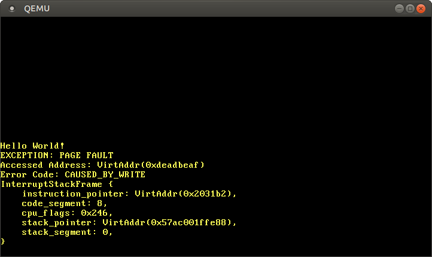
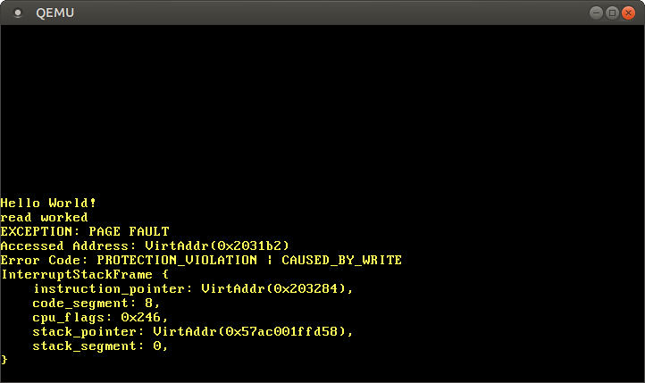

+++
title = "ページング入門"
weight = 8
path = "ja/paging-introduction"
date = 2019-01-14

[extra]
chapter = "Memory Management"
# Please update this when updating the translation
translation_based_on_commit = "3315bfe2f63571f5e6e924d58ed32afd8f39f892"
# GitHub usernames of the people that translated this post
translators = ["woodyZootopia"]
+++

この記事では**ページング**を紹介します。これは、私達のオペレーティングシステムにも使う、とても一般的なメモリ管理方式です。なぜメモリの<ruby>分離<rp> (</rp><rt>isolation</rt><rp>) </rp></ruby>が必要なのか、**セグメンテーション**がどのようにして働くのか、**仮想メモリ**とは何なのか、ページングがいかにしてメモリ<ruby>断片化<rp> (</rp><rt>フラグメンテーション</rt><rp>) </rp></ruby>の問題を解決するのかを説明します。また、x86_64アーキテクチャにおける、マルチレベルページテーブルのレイアウトについても説明します。

<!-- more -->

このブログの内容は [GitHub] 上で公開・開発されています。何か問題や質問などがあれば issue をたててください（訳注: リンクは原文(英語)のものになります）。また[こちら][at the bottom]にコメントを残すこともできます。この記事の完全なソースコードは[`post-08` ブランチ][post branch]にあります。

[GitHub]: https://github.com/phil-opp/blog_os
[at the bottom]: #comments
[post branch]: https://github.com/phil-opp/blog_os/tree/post-08

<!-- toc -->

## メモリの保護

オペレーティングシステムの主な役割の一つに、プログラムを互いに分離するということがあります。例えば、ウェブブラウザがテキストエディタに干渉してはいけません。この目的を達成するために、オペレーティングシステムはハードウェアの機能を利用して、あるプロセスのメモリ領域に他のプロセスがアクセスできないようにします。ハードウェアやOSの実装によって、さまざまなアプローチがあります。

例として、ARM Cortex-Mプロセッサ（組み込みシステムに使われています）のいくつかには、[メモリ保護ユニット][_Memory Protection Unit_] (Memory Protection Unit, MPU) が搭載されており、異なるアクセス権限（例えば、アクセス不可、読み取り専用、読み書きなど）を持つメモリ領域を少数（例えば8個）定義することができます。MPUは、メモリアクセスのたびに、そのアドレスが正しいアクセス許可を持つ領域にあるかどうかを確認し、そうでなければ例外を投げます。プロセスを変更するごとにその領域とアクセス許可を変更すれば、オペレーティングシステムはそれぞれのプロセスが自身のメモリにのみアクセスすることを保証し、したがってプロセスを互いに分離することができます。

[_Memory Protection Unit_]: https://developer.arm.com/docs/ddi0337/e/memory-protection-unit/about-the-mpu

x86においては、ハードウェアは2つの異なるメモリ保護の方法をサポートしています：[セグメンテーション][segmentation]と[ページング][paging]です。

[segmentation]: https://en.wikipedia.org/wiki/X86_memory_segmentation
[paging]: https://en.wikipedia.org/wiki/Virtual_memory#Paged_virtual_memory

## セグメンテーション

セグメンテーションは1978年にはすでに導入されており、当初の目的はアドレス可能なメモリの量を増やすためでした。当時、CPUは16bitのアドレスしか使えなかったので、アドレス可能なメモリは64KiBに限られていました。この64KiBを超えてアクセスするために、セグメントレジスタが追加され、それぞれにオフセットアドレスが設定されました。CPUがメモリにアクセスするとき、毎回このオフセットを自動的に加算するので、最大1MiBのメモリにアクセスできるようになりました。

メモリアクセスの種類によって、セグメントレジスタは自動的にCPUによって選ばれます。命令の<ruby>引き出し<rp> (</rp><rt>フェッチ</rt><rp>) </rp></ruby>にはコードセグメント`CS`が使用され、スタック操作（プッシュ・ポップ）にはスタックセグメント`SS`が使用されます。その他の命令では、データセグメント`DS`やエクストラセグメント`ES`が使用されます。その後、自由に使用できる`FS`と`GS`というセグメントレジスタも追加されました。

セグメンテーションの初期バージョンでは、セグメントレジスタは直接オフセットを格納しており、アクセス制御は行われていませんでした。これは後に[<ruby>プロテクトモード<rp> (</rp><rt>protected mode</rt><rp>) </rp></ruby>][_protected mode_]が導入されたことで変更されました。CPUがこのモードで実行している時、セグメント<ruby>記述子<rp> (</rp><rt>ディスクリプタ</rt><rp>) </rp></ruby>は<ruby>局所<rp> (</rp><rt>ローカル</rt><rp>) </rp></ruby>または<ruby>大域<rp> (</rp><rt>グローバル</rt><rp>) </rp>[**</ruby><ruby>記述子表<rp> (</rp><rt>ディスクリプタテーブル</rt><rp>) </rp></ruby>**][_descriptor table_]を格納します。これには（オフセットアドレスに加えて）セグメントのサイズとアクセス許可が格納されます。それぞれのプロセスに対し、メモリアクセスをプロセス自身のメモリ領域にのみ制限するような大域/局所記述子表をロードすることで、OSはプロセスを互いに隔離することができます。

[_protected mode_]: https://en.wikipedia.org/wiki/X86_memory_segmentation#Protected_mode
[_descriptor table_]: https://en.wikipedia.org/wiki/Global_Descriptor_Table

メモリアドレスを実際にアクセスされる前に変更するという点において、セグメンテーションは今やほぼすべての場所で使われている**仮想メモリ**というテクニックをすでに採用していたと言えます。

### 仮想メモリ

仮想メモリの背景にある考え方は、下層にある物理的なストレージデバイスからメモリアドレスを抽象化することです。ストレージデバイスに直接アクセスするのではなく、先に何らかの変換ステップが踏まれます。セグメンテーションの場合、この変換ステップとはアクティブなセグメントのオフセットアドレスを追加することです。例えば、オフセット`0x1111000`のセグメントにあるプログラムが`0x1234000`というメモリアドレスにアクセスすると、実際にアクセスされるアドレスは`0x2345000`になります。

この2種類のアドレスを区別するため、変換前のアドレスを **仮想（アドレス）** と、変換後のアドレスを **物理（アドレス）** と呼びます。この2種類のアドレスの重要な違いの一つは、物理アドレスは常に同じ一意なメモリ位置を指すということです。いっぽう仮想アドレス（の指す場所）は変換する関数に依存します。二つの異なる仮想アドレスが同じ物理アドレスを指すということは十分にありえます。また、変換関数が異なっていれば、同じ仮想アドレスが別の物理アドレスを示すということもありえます。

この特性が役立つ例として、同じプログラムを2つ並行して実行するという状況が挙げられます。


同じプログラムを2つ実行していますが、別の変換関数が使われています。1つ目のインスタンスではセグメントのオフセットが100なので、0から150の仮想アドレスは100から250に変換されます。2つ目のインスタンスではオフセットが300なので、0から150の仮想アドレスが300から450に変換されます。これにより、プログラムが互いに干渉することなく同じコード、同じ仮想アドレスを使うことができます。

もう一つの利点は、プログラムが全く異なる仮想アドレスを使っていたとしても、物理メモリ上の任意の場所に置くことができるということです。したがって、OSはプログラムを再コンパイルすることなく、利用可能なメモリをフルに活用することができます。

### <ruby>断片化<rp> (</rp><rt>fragmentation</rt><rp>) </rp></ruby>

物理アドレスと仮想アドレスを分けることにより、セグメンテーションは非常に強力なものとなっています。しかし、これにより断片化という問題が発生します。例として、上で見たプログラムの3つ目を実行したいとしましょう：


開放されているメモリは十分にあるにも関わらず、プログラムのインスタンスを重ねることなく物理メモリに対応づけることはできません。ここで必要なのは **連続した** メモリであり、開放されたメモリが小さな塊であっては使えないためです。

この断片化に対処する方法の一つは、実行を一時停止し、メモリの使用されている部分を寄せ集めて、変換関数を更新し、実行を再開することでしょう：


これで、プログラムの3つ目のインスタンスを開始するのに十分な連続したスペースができました。

このデフラグメンテーションという処理の欠点は、大量のメモリをコピーしなければならず、パフォーマンスを低下させてしまうことです。また、メモリが断片化しすぎる前に定期的に実行しないといけません。すると、プログラムが時々一時停止して、反応がなくなるので、性能が予測不可能になってしまいます。

ほとんどのシステムでセグメンテーションが用いられなくなった理由の一つに、この断片化の問題があります。実際、x86の64ビットモードでは、セグメンテーションはもはやサポートされていません。代わりに **ページング** が使用されており、これにより断片化の問題は完全に回避されます。

## ページング

ページングの考え方は、仮想メモリ空間と物理メモリ空間の両方を、サイズの固定された小さなブロックに分割するというものです。仮想メモリ空間のブロックは **ページ** と呼ばれ、物理アドレス空間のブロックは **フレーム** と呼ばれます。各ページはフレームに独立してマッピングできるので、大きなメモリ領域を連続していない物理フレームに分割することが可能です。

この方法の利点は、セグメンテーションの代わりにページングを使ってもう一度上のメモリ空間断片化の状況を見てみれば明らかになります：


この例では、ページサイズは50バイトなので、それぞれのメモリ領域が3つのページに分割されます。それぞれのページは個別にフレームに対応付けられるので、連続した仮想メモリ領域を非連続な物理フレームへと対応付けられるのです。これにより、デフラグを事前に実行することなく、3つ目のプログラムのインスタンスを開始することができるようになります。

### 隠された断片化

少ない数の可変なサイズのメモリ領域を使っていたセグメンテーションと比べると、ページングでは大量の小さい固定サイズのメモリ領域を使います。すべてのフレームが同じ大きさなので、「小さすぎて使えないフレーム」などというものは存在せず、したがって断片化も起きません。

というより、**目に見える** 断片化は起きていない、という方が正しいでしょう。**<ruby>内部<rp> (</rp><rt>internal</rt><rp>) </rp></ruby>断片化**と呼ばれる、目に見えない断片化は依然として起こっています。内部断片化は、すべてのメモリ領域がページサイズの整数倍ぴったりにはならないために生じます。例えば、上の例でサイズが101のプログラムを考えてみてください：この場合でもサイズ50のページが3つ必要で、必要な量より49バイト多く占有します。これらの2種類の断片化を区別するため、セグメンテーションを使うときに起きる断片化は **<ruby>外部<rp> (</rp><rt>external</rt><rp>) </rp></ruby>断片化** と呼ばれます。

内部断片化が起こるのは残念なことですが、セグメンテーションで発生していた外部断片化よりも優れていることが多いです。確かにメモリ領域は無駄にしますが、デフラグメンテーションをする必要がなく、また断片化の量も予想できるからです（平均するとメモリ領域ごとにページの半分）。

### ページテーブル

最大で何百万ものページがそれぞれ独立にフレームに対応付けられることを見てきました。この対応付けの情報はどこかに保存されなければなりません。セグメンテーションでは、有効なメモリ領域ごとに個別のセグメントセレクタを使っていましたが、ページングではレジスタよりも遥かに多くのページが使われるので、これは不可能です。代わりにページングでは **ページテーブル** と呼ばれる<ruby>表<rp> (</rp><rt>テーブル</rt><rp>) </rp></ruby>構造を使って対応付の情報を保存します。

上の例では、ページテーブルは以下のようになります：


それぞれのプログラムのインスタンスが独自のページテーブルを持っているのが分かります。現在有効なテーブルへのポインタは、特殊なCPUのレジスタに格納されます。`x86`においては、このレジスタは`CR3`と呼ばれています。それぞれのプログラムのインスタンスを実行する前に、正しいページテーブルを指すポインタをこのレジスタにロードするのはOSの役割です。

それぞれのメモリアクセスにおいて、CPUはテーブルへのポインタをレジスタから読み出し、テーブル内のアクセスされたページから対応するフレームを見つけ出します。これは完全にハードウェア内で行われ、実行しているプログラムからはこの動作は見えません。変換プロセスを高速化するために、多くのCPUアーキテクチャは前回の変換の結果を覚えておく専用のキャッシュを持っています。

アーキテクチャによっては、ページテーブルのエントリは"Flags"フィールドにあるアクセス許可のような属性も保持することができます。上の例では、"r/w"フラグがあることにより、このページは読み書きのどちらも可能だということを示しています。

### <ruby>複数層<rp> (</rp><rt>Multilevel</rt><rp>) </rp></ruby>ページテーブル

上で見たシンプルなページテーブルには、アドレス空間が大きくなってくると問題が発生します：メモリが無駄になるのです。たとえば、`0`, `1_000_000`, `1_000_050` および `1_000_100`（3ケタごとの区切りとして`_`を用いています）の4つの仮想ページを使うプログラムを考えてみましょう。


このプログラムはたった4つしか物理フレームを必要としていないのに、テーブルには100万以上ものエントリが存在してしまっています。空のエントリを省略した場合、変換プロセスにおいてCPUが正しいエントリに直接ジャンプすることができなくなってしまうので、それはできません（たとえば、4つめのページが4つめのエントリを使っていることが保証されなくなってしまいます）。

この無駄になるメモリを減らすことができる、 **2層ページテーブル** を使ってみましょう。発想としては、それぞれのアドレス領域に異なるページテーブルを使うというものです。**レベル2** ページテーブルと呼ばれる追加のページテーブルは、アドレス領域と（レベル1の）ページテーブルのあいだの対応を格納します。

これを理解するには、例を見るのが一番です。それぞれのレベル1テーブルは大きさ`10_000`の領域に対応するとします。すると、以下のテーブルが上のマッピングの例に対応するものとなります：


ページ0は最初の`10_000`バイト領域に入るので、レベル2ページテーブルの最初のエントリを使います。このエントリはT1というレベル1ページテーブルを指し、このページテーブルはページ`0`はフレーム`0`に対応すると指定します。

ページ`1_000_000`, `1_000_050`および`1_000_100`はすべて、`10_000`バイトの大きさの領域100個目に入るので、レベル2ページテーブルの100個目のエントリを使います。このエントリは、T2というべつのレベル1テーブルを指しており、このレベル1テーブルはこれらの3つのページをフレーム`100`, `150`および`200`に対応させています。レベル1テーブルにおけるページアドレスには領域のオフセットは含まれていない、つまり例えば、`1_000_050`というページのエントリは単に`50`である、ということに注意してください。

レベル2テーブルにはまだ100個の空のエントリがありますが、前の100万にくらべればこれはずっと少ないです。これほど節約できる理由は、`10_000`から`10_000_000`の、対応付けのないメモリ領域のためのレベル1テーブルを作る必要がないためです。

2層ページテーブルの理論は、3、4、それ以上に多くの層に拡張することができます。このとき、ページテーブルレジスタは最も高いレベルのテーブルを指し、そのテーブルは次に低いレベルのテーブルを指し、それはさらに低いレベルのものを、と続きます。そして、レベル1のテーブルは対応するフレームを指します。この理論は一般に **<ruby>複数層<rp> (</rp><rt>multilevel</rt><rp>) </rp></ruby>** ページテーブルや、 **<ruby>階層型<rp> (</rp><rt>hierarchical</rt><rp>) </rp></ruby>** ページテーブルと呼ばれます。

ページングと複数層ページテーブルのしくみが理解できたので、x86_64アーキテクチャにおいてどのようにページングが実装されているのかについて見ていきましょう（以下では、CPUは64ビットモードで動いているとします）。

## x86_64におけるページング

x86_64アーキテクチャは4層ページテーブルを使っており、ページサイズは4KiBです。それぞれのページテーブルは、層によらず512のエントリを持っています。それぞれのエントリの大きさは8バイトなので、それぞれのテーブルは512 * 8B = 4KiBであり、よってぴったり1ページに収まります。

（各）レベルのページテーブルインデックスは、仮想アドレスから直接求められます：


それぞれのテーブルインデックスは9ビットからなることがわかります。それぞれのテーブルに2^9 = 512エントリあることを考えるとこれは妥当です。最下位の12ビットは4KiBページ内でのオフセット（2^12バイト = 4KiB）です。48ビットから64ビットは捨てられます。つまり、x86_64は48ビットのアドレスにしか対応しておらず、そのため実際には64ビットではないということです。

[5-level page table]: https://en.wikipedia.org/wiki/Intel_5-level_paging

48ビットから64ビットが捨てられるからといって、任意の値にしてよいということではありません。この範囲のすべてのビットは、アドレスを一意にし、5層ページテーブルのような将来の拡張に備えるため、47ビットの値と同じにしないといけません。これは、[2の補数における符号拡張][sign extension in two's complement]によく似ているので、 **<ruby>符号<rp> (</rp><rt>sign</rt><rp>) </rp></ruby><ruby>拡張<rp> (</rp><rt>extension</rt><rp>) </rp></ruby>** とよばれています。アドレスが適切に符号拡張されていない場合、CPUは例外を投げます。

[sign extension in two's complement]: https://en.wikipedia.org/wiki/Two's_complement#Sign_extension

近年発売されたIntelのIce LakeというCPUは、[5層ページテーブル][5-level page tables]にオプションで対応していて、仮想アドレスが48ビットから57ビットまで延長されているということは書いておく価値があるでしょう。いまの段階で私たちのカーネルをこの特定のCPUに最適化する意味はないので、この記事では標準の4層ページテーブルのみを使うことにします。

[5-level page tables]: https://en.wikipedia.org/wiki/Intel_5-level_paging

### 変換の例

この変換プロセスの仕組みをより詳細に理解するために、例を挙げてみてみましょう。


現在有効なレベル4ページテーブルの物理アドレス、つまりレベル4ページテーブルの「<ruby>根<rp> (</rp><rt>root</rt><rp>) </rp></ruby>」は`CR3`レジスタに格納されています。それぞれのページテーブルエントリは、次のレベルのテーブルの物理フレームを指しています。そして、レベル1のテーブルは対応するフレームを指しています。なお、ページテーブル内のアドレスは全て仮想ではなく物理アドレスであることに注意してください。さもなければ、CPUは（変換プロセス中に）それらのアドレスも変換しなくてはならず、無限再帰に陥ってしまうかもしれません。

上のページテーブル階層構造は、最終的に（青色の）2つのページへの対応を行っています。ページテーブルのインデックスから、これらの2つのページの仮想アドレスは`0x803FE7F000`と`0x803FE00000`であると推論できます。プログラムがアドレス`0x803FE7F5CE`から読み込もうとしたときに何が起こるかを見てみましょう。まず、アドレスを2進数に変換し、アドレスのページテーブルインデックスとページオフセットが何であるかを決定します：


これらのインデックス情報をもとにページテーブル階層構造を移動して、このアドレスに対応するフレームを決定します：

- まず、`CR3`レジスタからレベル4テーブルのアドレスを読み出します。
- レベル4のインデックスは1なので、このテーブルの1つ目のインデックスを見ます。すると、レベル3テーブルはアドレス16KiBに格納されていると分かります。
- レベル3テーブルをそのアドレスから読み出し、インデックス0のエントリを見ると、レベル2テーブルは24KiBにあると教えてくれます。
- レベル2のインデックスは511なので、このページの最後のエントリを見て、レベル1テーブルのアドレスを見つけます。
- レベル1テーブルの127番目のエントリを読むことで、ついに対象のページは12KiB（16進数では0x3000）のフレームに対応づけられていると分かります。
- 最後のステップは、ページオフセットをフレームアドレスに足して、物理アドレスを得ることです。0x3000 + 0x5ce = 0x35ce


レベル1テーブルにあるこのページのパーミッション（訳注：ページテーブルにおいて、Flagsとある列）は`r`であり、これは読み込み専用という意味です。これらのようなパーミッションに対する侵害はハードウェアによって保護されており、このページに書き込もうとした場合は例外が投げられます。より高いレベルのページにおけるパーミッションは、下のレベルにおいて可能なパーミッションを制限します。たとえばレベル3エントリを読み込み専用にした場合、下のレベルで読み書きを許可したとしても、このエントリをつかうページはすべて書き込み不可になります。

この例ではそれぞれのテーブルの<ruby>実体<rp> (</rp><rt>インスタンス</rt><rp>) </rp></ruby>を1つずつしか使いませんでしたが、普通それぞれのアドレス空間において、各レベルに対して複数のインスタンスが使われるということは知っておく価値があるでしょう。最大で

- 1個のレベル4テーブル
- 512個のレベル3テーブル（レベル4テーブルには512エントリあるので）
- 512 * 512個のレベル2テーブル（512個のレベル3テーブルそれぞれに512エントリあるので）
- 512 * 512 * 512個のレベル1テーブル（それぞれのレベル2テーブルに512エントリあるので）

があります。

### ページテーブルの形式

x86_64アーキテクチャにおけるページテーブルは詰まるところ512個のエントリの配列です。Rustの構文では：

```rust
#[repr(align(4096))]
pub struct PageTable {
    entries: [PageTableEntry; 512],
}
```

`repr`属性で示されるように、ページテーブルはアラインされる必要があります。つまり4KiBごとの境界に揃えられる必要がある、ということです。この要求により、ページテーブルはつねにページひとつを完全に使うので、エントリをとても小さくできる最適化が可能になります。
As indicated by the `repr` attribute, page tables need to be page aligned, i.e. aligned on a 4KiB boundary. This requirement guarantees that a page table always fills a complete page and allows an optimization that makes entries very compact.

それぞれのエントリは8バイト（64ビット）の大きさであり、以下の形式です：

ビット | 名前                  | 意味
------ | ----                  | -------
0      | present               | このページはメモリ内にある
1      | writable              | このページへの書き込みは許可されている
2      | user accessible       | 0の場合、カーネルモードのみこのページにアクセスできる
3      | write through caching | 書き込みはメモリに対して直接行われる
4      | disable cache         | このページにキャッシュを使わない
5      | accessed              | このページが使われているとき、CPUはこのビットを1にする
6      | dirty                 | このページへの書き込みが行われたとき、CPUはこのビットを1にする
7      | huge page/null        | P1とP4においては0で、P3においては1GiBのページを、P2においては2MiBのページを作る
8      | global                | キャッシュにあるこのページはアドレス空間変更の際に初期化されない（CR4レジスタのPGEビットが1である必要がある）
9-11   | available             | OSが自由に使える
12-51  | physical address      | 
52-62  | available             | OSが自由に使える
63     | no execute            | このページにおいてプログラムを実行することを禁じる（EFERレジスタのNXEビットが1である必要がある）

12-51ビットだけが物理フレームアドレスを格納するのに使われていて、残りのビットはフラグやオペレーティングシステムが自由に使うようになっていることがわかります。これが可能なのは、常に4096バイト単位のページに<ruby>揃え<rp> (</rp><rt>アライン</rt><rp>) </rp></ruby>られたアドレス（ページテーブルか、対応づけられたフレームの先頭）を指しているからです。これは、0-11ビットは常にゼロであることを意味し、したがってこれらのビットを格納しておく必要はありません。ハードウェアがアドレスを使用する前に、それらのビットをゼロとして（追加して）やれば良いからです。同じことが52-63ビットについてもいえます。なぜならx86_64アーキテクチャは52ビットの物理アドレスしかサポートしていないからです（仮想アドレスを48ビットしかサポートしていないのと似ています）。

上のフラグについてより詳しく見てみましょう：

- `present`フラグは、対応付けられているページとそうでないページを区別します。このフラグは、メインメモリが一杯になったとき、ページを一時的にディスクにスワップしたいときに使うことができます。後でページがアクセスされたら、 **ページフォルト** という特別な例外が発生するので、オペレーティングシステムは不足しているページをディスクから読み出すことでこれに対応し、プログラムを再開します。
- `writable`と`no execute`フラグはそれぞれ、このページの中身が書き込み可能かと、実行可能な命令であるかを制御します。
- `accessed`と`dirty`フラグは、ページへの読み込みか書き込みが行われたときにCPUによって自動的に1にセットされます。この情報はオペレーティングシステムによって活用することができます――例えば、どのページをスワップするかや、ページの中身が最後にディスクに保存されて以降に修正されたかを確認することができます。
- `write through caching`と`disable cache`フラグで、キャッシュの制御をページごとに独立して行うことができます。
- `user accessible`フラグはページをユーザー空間のプログラムに利用可能にします。このフラグが1になっていない場合、CPUがカーネルモードのときにのみアクセスできます。この機能は、ユーザ空間のプログラムが実行している間もカーネル（の使用しているメモリ）を対応付けたままにしておくことで、[システムコール][system calls]を高速化するために使うことができます。しかし、[Spectre]脆弱性を使うと、この機能があるにもかかわらず、ユーザ空間プログラムがこれらのページを読むことができてしまいます。
- `global`フラグは、このページはすべてのアドレス空間で利用可能であり、よってアドレス空間の変更時に変換キャッシュ（TLBに関する下のセクションを読んでください）から取り除く必要がないことをハードウェアに伝えます。
- `huge page`フラグを使うと、レベル2か3のページが対応付けられたフレームを直接指すようにすることで、より大きいサイズのページを作ることができます。このビットが1のとき、ページの大きさは512倍になるので、レベル2のエントリの場合は2MiB = 512 * 4KiBに、レベル3のエントリの場合は1GiB = 512 * 2MiBにもなります。大きいページを使うことのメリットは、必要な変換キャッシュのラインの数やページテーブルの数が少なくなることです。

[system calls]: https://en.wikipedia.org/wiki/System_call
[Spectre]: https://en.wikipedia.org/wiki/Spectre_(security_vulnerability)

`x86_64`クレートが[ページテーブル][page tables]とその[エントリ][entries]のための型を提供してくれているので、これらの構造体を私達自身で作る必要はありません。

[page tables]: https://docs.rs/x86_64/0.13.2/x86_64/structures/paging/page_table/struct.PageTable.html
[entries]: https://docs.rs/x86_64/0.13.2/x86_64/structures/paging/page_table/struct.PageTableEntry.html

### The Translation Lookaside Buffer

A 4-level page table makes the translation of virtual addresses expensive, because each translation requires 4 memory accesses. To improve performance, the x86_64 architecture caches the last few translations in the so-called _translation lookaside buffer_ (TLB). This allows to skip the translation when the translation is still cached.

Unlike the other CPU caches, the TLB is not fully transparent and does not update or remove translations when the contents of page tables change. This means that the kernel must manually update the TLB whenever it modifies a page table. To do this, there is a special CPU instruction called [`invlpg`] (“invalidate page”) that removes the translation for the specified page from the TLB, so that it is loaded again from the page table on the next access. The TLB can also be flushed completely by reloading the `CR3` register, which simulates an address space switch. The `x86_64` crate provides Rust functions for both variants in the [`tlb` module].

[`invlpg`]: https://www.felixcloutier.com/x86/INVLPG.html
[`tlb` module]: https://docs.rs/x86_64/0.13.2/x86_64/instructions/tlb/index.html

It is important to remember flushing the TLB on each page table modification because otherwise the CPU might keep using the old translation, which can lead to non-deterministic bugs that are very hard to debug.

## Implementation

One thing that we did not mention yet: **Our kernel already runs on paging**. The bootloader that we added in the ["A minimal Rust Kernel"] post already set up a 4-level paging hierarchy that maps every page of our kernel to a physical frame. The bootloader does this because paging is mandatory in 64-bit mode on x86_64.

["A minimal Rust kernel"]: @/edition-2/posts/02-minimal-rust-kernel/index.md#creating-a-bootimage

This means that every memory address that we used in our kernel was a virtual address. Accessing the VGA buffer at address `0xb8000` only worked because the bootloader _identity mapped_ that memory page, which means that it mapped the virtual page `0xb8000` to the physical frame `0xb8000`.

Paging makes our kernel already relatively safe, since every memory access that is out of bounds causes a page fault exception instead of writing to random physical memory. The bootloader even set the correct access permissions for each page, which means that only the pages containing code are executable and only data pages are writable.

### Page Faults

Let's try to cause a page fault by accessing some memory outside of our kernel. First, we create a page fault handler and register it in our IDT, so that we see a page fault exception instead of a generic [double fault] :

[double fault]: @/edition-2/posts/06-double-faults/index.md

```rust
// in src/interrupts.rs

lazy_static! {
    static ref IDT: InterruptDescriptorTable = {
        let mut idt = InterruptDescriptorTable::new();

        […]

        idt.page_fault.set_handler_fn(page_fault_handler); // new

        idt
    };
}

use x86_64::structures::idt::PageFaultErrorCode;
use crate::hlt_loop;

extern "x86-interrupt" fn page_fault_handler(
    stack_frame: &mut InterruptStackFrame,
    error_code: PageFaultErrorCode,
) {
    use x86_64::registers::control::Cr2;

    println!("EXCEPTION: PAGE FAULT");
    println!("Accessed Address: {:?}", Cr2::read());
    println!("Error Code: {:?}", error_code);
    println!("{:#?}", stack_frame);
    hlt_loop();
}
```

The [`CR2`] register is automatically set by the CPU on a page fault and contains the accessed virtual address that caused the page fault. We use the [`Cr2::read`] function of the `x86_64` crate to read and print it. The [`PageFaultErrorCode`] type provides more information about the type of memory access that caused the page fault, for example whether it was caused by a read or write operation. For this reason we print it too. We can't continue execution without resolving the page fault, so we enter a [`hlt_loop`] at the end.

[`CR2`]: https://en.wikipedia.org/wiki/Control_register#CR2
[`Cr2::read`]: https://docs.rs/x86_64/0.13.2/x86_64/registers/control/struct.Cr2.html#method.read
[`PageFaultErrorCode`]: https://docs.rs/x86_64/0.13.2/x86_64/structures/idt/struct.PageFaultErrorCode.html
[LLVM bug]: https://github.com/rust-lang/rust/issues/57270
[`hlt_loop`]: @/edition-2/posts/07-hardware-interrupts/index.md#the-hlt-instruction

Now we can try to access some memory outside our kernel:

```rust
// in src/main.rs

#[no_mangle]
pub extern "C" fn _start() -> ! {
    println!("Hello World{}", "!");

    blog_os::init();

    // new
    let ptr = 0xdeadbeaf as *mut u32;
    unsafe { *ptr = 42; }

    // as before
    #[cfg(test)]
    test_main();

    println!("It did not crash!");
    blog_os::hlt_loop();
}
```

When we run it, we see that our page fault handler is called:



The `CR2` register indeed contains `0xdeadbeaf`, the address that we tried to access. The error code tells us through the [`CAUSED_BY_WRITE`] that the fault occurred while trying to perform a write operation. It tells us even more through the [bits that are _not_ set][`PageFaultErrorCode`]. For example, the fact that the `PROTECTION_VIOLATION` flag is not set means that the page fault occurred because the target page wasn't present.

[`CAUSED_BY_WRITE`]: https://docs.rs/x86_64/0.13.2/x86_64/structures/idt/struct.PageFaultErrorCode.html#associatedconstant.CAUSED_BY_WRITE

We see that the current instruction pointer is `0x2031b2`, so we know that this address points to a code page. Code pages are mapped read-only by the bootloader, so reading from this address works but writing causes a page fault. You can try this by changing the `0xdeadbeaf` pointer to `0x2031b2`:

```rust
// Note: The actual address might be different for you. Use the address that
// your page fault handler reports.
let ptr = 0x2031b2 as *mut u32;

// read from a code page
unsafe { let x = *ptr; }
println!("read worked");

// write to a code page
unsafe { *ptr = 42; }
println!("write worked");
```

By commenting out the last line, we see that the read access works, but the write access causes a page fault:



We see that the _"read worked"_ message is printed, which indicates that the read operation did not cause any errors. However, instead of the _"write worked"_ message a page fault occurs. This time the [`PROTECTION_VIOLATION`] flag is set in addition to the [`CAUSED_BY_WRITE`] flag, which indicates that the page was present, but the operation was not allowed on it. In this case, writes to the page are not allowed since code pages are mapped as read-only.

[`PROTECTION_VIOLATION`]: https://docs.rs/x86_64/0.13.2/x86_64/structures/idt/struct.PageFaultErrorCode.html#associatedconstant.PROTECTION_VIOLATION

### Accessing the Page Tables

Let's try to take a look at the page tables that define how our kernel is mapped:

```rust
// in src/main.rs

#[no_mangle]
pub extern "C" fn _start() -> ! {
    println!("Hello World{}", "!");

    blog_os::init();

    use x86_64::registers::control::Cr3;

    let (level_4_page_table, _) = Cr3::read();
    println!("Level 4 page table at: {:?}", level_4_page_table.start_address());

    […] // test_main(), println(…), and hlt_loop()
}
```

The [`Cr3::read`] function of the `x86_64` returns the currently active level 4 page table from the `CR3` register. It returns a tuple of a [`PhysFrame`] and a [`Cr3Flags`] type. We are only interested in the frame, so we ignore the second element of the tuple.

[`Cr3::read`]: https://docs.rs/x86_64/0.13.2/x86_64/registers/control/struct.Cr3.html#method.read
[`PhysFrame`]: https://docs.rs/x86_64/0.13.2/x86_64/structures/paging/frame/struct.PhysFrame.html
[`Cr3Flags`]: https://docs.rs/x86_64/0.13.2/x86_64/registers/control/struct.Cr3Flags.html

When we run it, we see the following output:

```
Level 4 page table at: PhysAddr(0x1000)
```

So the currently active level 4 page table is stored at address `0x1000` in _physical_ memory, as indicated by the [`PhysAddr`] wrapper type. The question now is: how can we access this table from our kernel?

[`PhysAddr`]: https://docs.rs/x86_64/0.13.2/x86_64/addr/struct.PhysAddr.html

Accessing physical memory directly is not possible when paging is active, since programs could easily circumvent memory protection and access memory of other programs otherwise. So the only way to access the table is through some virtual page that is mapped to the physical frame at address `0x1000`. This problem of creating mappings for page table frames is a general problem, since the kernel needs to access the page tables regularly, for example when allocating a stack for a new thread.

Solutions to this problem are explained in detail in the next post.

## Summary

This post introduced two memory protection techniques: segmentation and paging. While the former uses variable-sized memory regions and suffers from external fragmentation, the latter uses fixed-sized pages and allows much more fine-grained control over access permissions.

Paging stores the mapping information for pages in page tables with one or more levels. The x86_64 architecture uses 4-level page tables and a page size of 4KiB. The hardware automatically walks the page tables and caches the resulting translations in the translation lookaside buffer (TLB). This buffer is not updated transparently and needs to be flushed manually on page table changes.

We learned that our kernel already runs on top of paging and that illegal memory accesses cause page fault exceptions. We tried to access the currently active page tables, but we weren't able to do it because the CR3 register stores a physical address that we can't access directly from our kernel.

## What's next?

The next post explains how to implement support for paging in our kernel. It presents different ways to access physical memory from our kernel, which makes it possible to access the page tables that our kernel runs on. At this point we are able to implement functions for translating virtual to physical addresses and for creating new mappings in the page tables.
