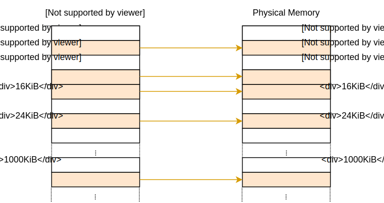
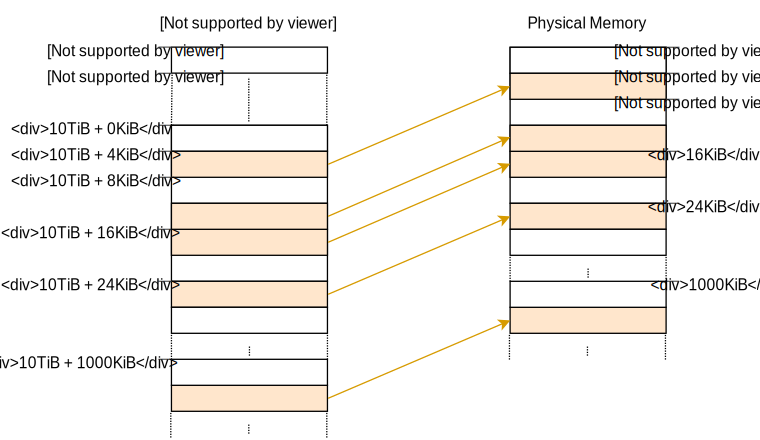
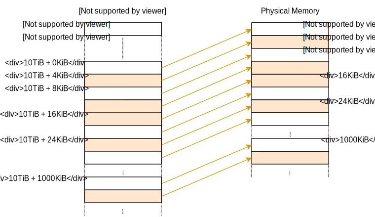
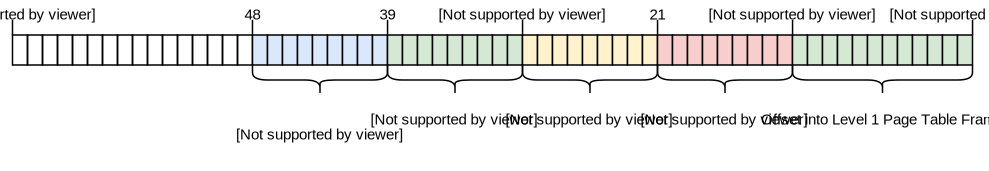
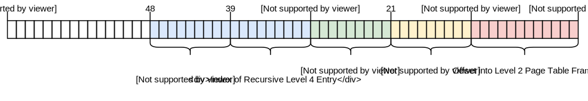
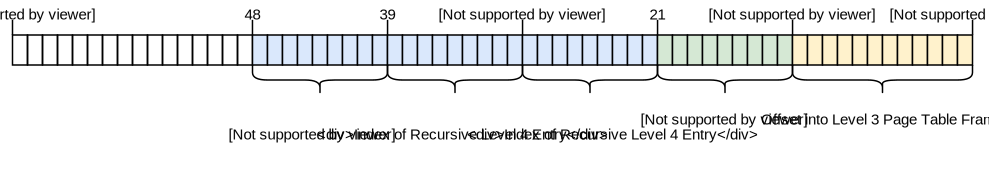
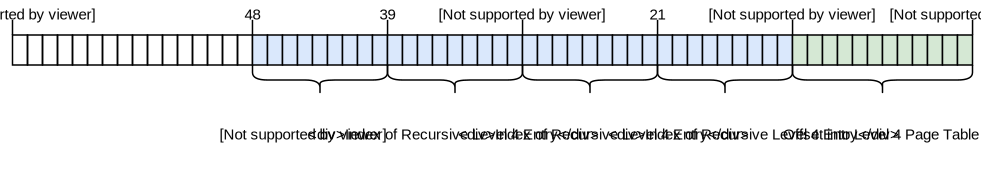
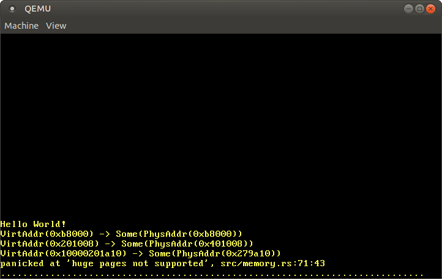
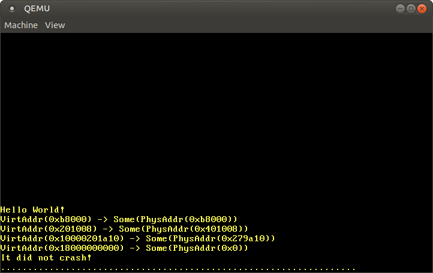
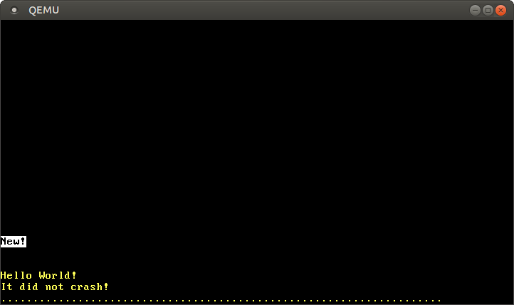

+++
title = "تنفيذ Paging"
weight = 9
path = "ar/paging-implementation"
date = 2019-03-14

[extra]
chapter = "Memory Management"

# GitHub usernames of the people that translated this post
translators = ["mindfreq"]
rtl = true
+++

يُظهر هذا المقال كيفية تنفيذ دعم paging في نواتنا. يستكشف أولاً تقنيات مختلفة لجعل physical page table frames قابلة للوصول من النواة ويناقش مزاياها وعيوبها. ثم ينفذ دالة ترجمة عنوان ودالة لإنشاء تعيين جديد.

<!-- more -->

هذا المدونة مطوّرة بشكل مفتوح على [GitHub]. إذا كان لديك أي مشاكل أو أسئلة، يرجى فتح issue هناك. يمكنك أيضًا ترك تعليقات [في الأسفل]. يمكن العثور على الكود المصدري الكامل لهذا المقال في فرع [`post-09`][post branch].

[GitHub]: https://github.com/phil-opp/blog_os
[at the bottom]: #comments
<!-- fix for zola anchor checker (target is in template): <a id="comments"> -->
[post branch]: https://github.com/phil-opp/blog_os/tree/post-09

<!-- toc -->

## المقدمة

قدم [المقال السابق][previous post] مفهوم paging. وظّف paging بمقارنته مع segmentation، شرح كيف يعمل paging و page tables، ثم قدّم تصميم 4-level page table لـ `x86_64`. وجدنا أن bootloader قد أعد بالفعل page table hierarchy لنواتنا، مما يعني أن نواتنا تعمل بالفعل على عناوين افتراضية. هذا يحسن الأمان لأن الوصول غير القانوني للذاكرة يسبب page fault exceptions بدلاً من تعديل ذاكرة فيزيائية عشوائية.

[previous post]: @/edition-2/posts/08-paging-introduction/index.md

انتهى المقال بمشكلة أننا [لا نستطيع الوصول إلى page tables من نواتنا][end of previous post] لأنها مخزنة في ذاكرة فيزيائية ونواتنا تعمل بالفعل على عناوين افتراضية. يستكشف هذا المقال نهجًا مختلفة لجعل page table frames قابلة للوصول لنواتنا. سنناقش مزايا وعيوب كل نهج ثم نقرر نهجًا لنواتنا.

[end of previous post]: @/edition-2/posts/08-paging-introduction/index.md#accessing-the-page-tables

لتنفيذ النهج، سنحتاج إلى دعم من bootloader، لذلك سنكوّنه أولاً. بعد ذلك، سننفذ دالة تمر عبر page table hierarchy لترجمة العناوين الافتراضية إلى فيزيائية. أخيرًا، نتعلم كيفية إنشاء تعيينات جديدة في page tables وكيفية إيجاد memory frames غير مستخدمة لإنشاء page tables جديدة.

## الوصول إلى جداول التصفح {#accessing-page-tables}

الوصول إلى page tables من نواتنا ليس سهلًا كما قد يبدو. لفهم المشكلة، لننظر في مثال page table hierarchy من المقال السابق مرة أخرى:


الشيء المهم هنا هو أن كل page entry تخزن العنوان _الفزيائي_ لـ table التالية. هذا يتجنب الحاجة لتشغيل ترجمة لهذه العناوين أيضًا، الذي سيكون سيئًا للأداء ويمكن أن يسبب بسهولة translation loops غير محدودة.

المشكلة بالنسبة لنا هي أننا لا نستطيع الوصول مباشرة إلى العناوين الفيزيائية من نواتنا لأن نواتنا تعمل أيضًا على عناوين افتراضية. على سبيل المثال، عندما نصل إلى العنوان `4 KiB` نصل إلى العنوان _الافتراضي_ `4 KiB`، وليس العنوان _الفزيائي_ `4 KiB` حيث level 4 page table مخزنة. عندما نريد الوصول إلى العنوان الفيزيائي `4 KiB`، نستطيع ذلك فقط عبر بعض العنوان الافتراضي الذي يشير إليه.

لذلك من أجل الوصول إلى page table frames، نحتاج إلى تعيين بعض virtual pages إليها. هناك طرق مختلفة لإنشاء هذه التعيينات جميعها تسمح لنا بالوصول إلى page table frames عشوائية.

### الربط بالتطابق (Identity Mapping)

حل بسيط هو **identity mapping لجميع page tables**:



في هذا المثال، نرى عدة page table frames مُعيّنة بـ identity mapping. بهذه الطريقة، العناوين الفيزيائية لـ page tables هي أيضًا عناوين افتراضية صالحة حتى نتمكن بسهولة من الوصول إلى page tables لجميع المستويات بدءًا من register CR3.

ومع ذلك، يُ clutter مساحة العنونة الافتراضية ويجعل من الصعب أكثر إيجاد مناطق ذاكرة متصلة بأحجام أكبر. على سبيل المثال، تخيل أننا نريد إنشاء منطقة ذاكرة افتراضية بحجم 1000&nbsp;KiB في الرسم أعلاه، مثلًا لـ [memory-mapping a file]. لا نستطيع بدء المنطقة في `28 KiB` لأنها ستتصادم مع الصفحة المُعيّنة بالفعل في `1004 KiB`. لذلك نحتاج للنظر أبعد حتى نجد منطقة غير مُعيّنة كبيرة بما يكفي، على سبيل المثال في `1008 KiB`. هذه مشكلة تجزئة مشابهة لـ [segmentation].

[memory-mapping a file]: https://en.wikipedia.org/wiki/Memory-mapped_file
[segmentation]: @/edition-2/posts/08-paging-introduction/index.md#fragmentation

بالمثل، يجعل إنشاء page tables جديدة أصعب بكثير لأننا نحتاج لإيجاد physical frames whose pages المقابلة غير مستخدمة بالفعل. على سبيل المثال، لنفترض أننا حجزنا الذاكرة الافتراضية _الافتراضية_ 1000&nbsp;KiB starting at `1008 KiB` لملف memory-mapped. الآن لا نستطيع استخدام أي frame بعنوان _فيزيائي_ بين `1000 KiB` و `2008 KiB` بعد الآن، لأننا لا نستطيع identity map لها.

### التعيين عند إزاحة ثابتة

لتجنب مشكلة cluttering مساحة العنونة الافتراضية، يمكننا **استخدام منطقة ذاكرة منفصلة لتعيينات page table**. لذلك بدلاً من identity mapping لـ page table frames، نعيّنها بـ offset ثابت في مساحة العنونة الافتراضية. على سبيل المثال، يمكن أن يكون offset 10&nbsp;TiB:



باستخدام الذاكرة الافتراضية في النطاق `10 TiB..(10 TiB + physical memory size)` exclusively لتعيينات page table، نتجنب مشاكل التصادم لـ identity mapping. حجز مثل هذه المنطقة الكبيرة من مساحة العنونة الافتراضية ممكن فقط إذا كانت مساحة العنونة الافتراضية أكبر بكثير من حجم الذاكرة الفيزيائية. هذا ليس مشكلة على x86_64 لأن مساحة العنونة 48-bit بحجم 256&nbsp;TiB.

لا يزال هذا النهج له عيب أننا نحتاج لإنشاء تعيين جديد whenever نُنشئ page table جديدة. أيضًا، لا يسمح بالوصول إلى page tables لمساحات عنونة أخرى، الذي سيكون مفيدًا عند إنشاء عملية جديدة.

### تعيين الذاكرة الفيزيائية بالكامل {#map-the-complete-physical-memory}

يمكننا حل هذه المشاكل بـ **تعيين الذاكرة الفيزيائية بالكامل** بدلاً من page table frames فقط:



يسمح هذا النهج لنواتنا بالوصول إلى ذاكرة فيزيائية عشوائية، بما في ذلك page table frames لمساحات عنونة أخرى. نطاق الذاكرة الافتراضية المحجوزة له نفس الحجم كما قبل، مع أن الاختلاف أنه لم يعد يحتوي على صفحات غير مُعيّنة.

عيب هذا النهج هو أن page tables إضافية مطلوبة لتخزين تعيين الذاكرة الفيزيائية. هذه page tables تحتاج للتخزين في مكان ما، لذلك تستهلك جزءًا من الذاكرة الفيزيائية، الذي يمكن أن يكون مشكلة على أجهزة ذات ذاكرة صغيرة.

على x86_64، ومع ذلك، يمكننا استخدام [huge pages] بحجم 2&nbsp;MiB للتعيين، بدلاً من 4&nbsp;KiB pages الافتراضية. بهذه الطريقة، تعيين 32&nbsp;GiB من الذاكرة الفيزيائية يحتاج فقط 132&nbsp;KiB لـ page tables لأن فقط level 3 table واحدة و 32 level 2 tables مطلوبة. huge pages أكثر كفاءة في cache أيضًا لأنها تستخدم entries أقل في translation lookaside buffer (TLB).

[huge pages]: https://en.wikipedia.org/wiki/Page_%28computer_memory%29#Multiple_page_sizes

### التعيينات المؤقتة

للأجهزة ذات كميات صغيرة جدًا من الذاكرة الفيزيائية، يمكننا **تعيين page table frames مؤقتًا فقط** عندما نحتاج للوصول إليها. لتمكين إنشاء التعيينات المؤقتة، نحتاج فقط إلى level 1 table واحدة مُعيّنة بشكل identity:


level 1 table في هذا الرسم تتحكم في أول 2&nbsp;KiB من مساحة العنونة الافتراضية. هذا لأنها قابلة للوصول ببدء من register CR3 واتباع entry الـ 0 في level 4 و level 3 و level 2 page tables. entry برقم `8` تُعيّن virtual page في العنوان `32 KiB` إلى physical frame في العنوان `32 KiB`، وبالتالي identity mapping لـ level 1 table نفسها. يُظهر الرسم هذا identity-mapping بالسهم الأفقي في `32 KiB`.

بالكتابة إلى level 1 table المُعيّنة بـ identity، يمكن لنواتنا إنشاء ما يصل إلى 511 temporary mappings (512 minus entry المطلوبة لـ identity mapping). في المثال أعلاه، أنشأت النواة temporary mappingين:

- بتعيين entry الـ 0 من level 1 table إلى frame بالعنوان `24 KiB`، أنشأت temporary mapping لـ virtual page في `0 KiB` إلى physical frame لـ level 2 page table، موضحة بالسهم المنقط.
- بتعيين entry الـ 9 من level 1 table إلى frame بالعنوان `4 KiB`، أنشأت temporary mapping لـ virtual page في `36 KiB` إلى physical frame لـ level 4 page table، موضحة بالسهم المنقط.

الآن يمكن للنواة الوصول إلى level 2 page table بالكتابة إلى page `0 KiB` و level 4 page table بالكتابة إلى page `36 KiB`.

عملية الوصول إلى page table frame عشوائية مع temporary mappings ستكون:

- البحث عن entry فارغة في identity-mapped level 1 table.
- تعيين ذلك entry إلى physical frame لـ page table التي نريد الوصول إليها.
- الوصول إلى frame المستهدف عبر virtual page المُعيّنة إلى entry.
- تعيين entry إلى unused، وبالتالي إزالة temporary mapping مرة أخرى.

هذا النهج يعيد استخدام نفس 512 virtual pages لإنشاء التعيينات وبالتالي يحتاج فقط 4&nbsp;KiB من الذاكرة الفيزيائية. العيب هو أنه مرهق بعض الشيء، خاصة لأن تعيين جديد قد يحتاج تعديلات على مستويات table متعددة، مما يعني أننا سنحتاج لتكرار العملية أعلاه عدة مرات.

### جداول التصفح العودية {#recursive-page-tables}

نهج آخر مثير، لا يحتاج أي page tables إضافية على الإطلاق، هو **تعيين page table بشكل recursive**. الفكرة خلف هذا النهج هي تعيين entry من level 4 page table إلى level 4 table نفسها. بفعل هذا، نحجز فعليًا جزءًا من مساحة العنونة الافتراضية ونُعيّن جميع page table frames الحالية والمستقبلية إلى تلك المساحة.

لنمر عبر مثال لفهم كيف يعمل هذا:


الفرق الوحيد عن [مثال بداية هذا المقال][example at the beginning of this post] هو entry الإضافية في الفهرس `511` في level 4 table، المُعيّنة إلى physical frame `4 KiB`، frame لـ level 4 table نفسها.

[example at the beginning of this post]: #accessing-page-tables

بترك وحدة المعالجة المركزية تتبع هذا entry في ترجمة، لا تصل إلى level 3 table بل نفس level 4 table مرة أخرى. هذا مشابه لـ recursive function تستدعي نفسها، لذلك تُسمى هذه table _recursive page table_. الشيء المهم هو أن وحدة المعالجة المركزية تفترض أن كل entry في level 4 table تشير إلى level 3 table، لذلك تتعامل الآن مع level 4 table كـ level 3 table. هذا يعمل لأن tables لجميع المستويات لها نفس التخطيط بالضبط على x86_64.

باتباع recursive entry مرة أو مرات متعددة قبل بدء الترجمة الفعلية، يمكننا تقصير عدد المستويات التي يمر عليها وحدة المعالجة المركزية. على سبيل المثال، إذا اتبعنا recursive entry مرة ثم proceed إلى level 3 table، تعتقد وحدة المعالجة المركزية أن level 3 table هي level 2 table. بالمزيد، تتعامل مع level 2 table كـ level 1 table و level 1 table كـ frame المُعيّنة. هذا يعني أننا الآن نستطيع قراءة وكتابة level 1 page table لأن وحدة المعالجة المركزية تعتقد أنها frame المُعيّنة. الرسم أدناه يوضح خطوات الترجمة الخمسة:


بالمثل، يمكننا اتباع recursive entry مرتين قبل بدء الترجمة لتقليل عدد المستويات المُمر عليها إلى اثنين:


لنمر عبرها خطوة بخطوة: أولاً، تتبع وحدة المعالجة المركزية recursive entry على level 4 table وتصل إلى level 3 table. ثم تتبع recursive entry مرة أخرى وتصل إلى level 2 table. لكن في الواقع، لا تزال على level 4 table. عندما تتبع وحدة المعالجة المركزية entry مختلفة الآن، تهبط على level 3 table لكنها تعتقد أنها على level 1 table. لذلك بينما entry التالية تشير إلى level 2 table، تعتقد وحدة المعالجة المركزية أنها تشير إلى frame المُعيّنة، الذي يسمح لنا بقراءة وكتابة level 2 table.

الوصول إلى tables للمستويين 3 و 4 يعمل بنفس الطريقة. للوصول إلى level 3 table، نتبع recursive entry ثلاث مرات، نخدع وحدة المعالجة المركزية لتظن أنها على level 1 table. ثم نتبع entry أخرى ونصل إلى level 3 table، التي تتعامل معها وحدة المعالجة المركزية كـ frame المُعيّنة. للوصول إلى level 4 table نفسها، نتبع recursive entry أربع مرات حتى تعامل وحدة المعالجة المركزية level 4 table نفسها كـ frame المُعيّنة (باللون الأزرق في الرسم أدناه).


قد يستغرق بعض الوقت لفهم المفهوم، لكنه يعمل بشكل جيد في الممارسة العملية.

في القسم أدناه، نشرح كيفية بناء عناوين افتراضية لاتباع recursive entry مرة أو مرات متعددة. لن نستخدم recursive paging لتنفيذنا، لذلك لا تحتاج لقراءته لمتابعة المقال. إذا كان يهمك، فقط اضغط على _"Address Calculation"_ لتوسيعه.

---

<details>
<summary><h4>Address Calculation</h4></summary>

رأينا أننا نستطيع الوصول إلى tables لجميع المستويات باتباع recursive entry مرة أو مرات متعددة قبل الترجمة الفعلية. بما أن فهارس tables للمستويات الأربعة مشتقة مباشرة من العنوان الافتراضي، نحتاج لبناء عناوين افتراضية خاصة لهذه التقنية. تذكر، page table indexes مشتقة من العنوان بالطريقة التالية:


لنفترض أننا نريد الوصول إلى level 1 page table التي تُعيّن صفحة محددة. كما تعلمنا أعلاه، هذا يعني أننا نتبع recursive entry مرة واحدة قبل المتابعة مع level 4 و level 3 و level 2 indexes. لذلك، ننقل كل كتلة من العنوان كتلة واحدة إلى اليمين ونعين level 4 index الأصلي إلى فهرس recursive entry:



للوصول إلى level 2 table لتلك الصفحة، ننقل كل كتلة فهرس كتلتين إلى اليمين ونعين كتلتي level 4 index الأصلي و level 3 index الأصلي إلى فهرس recursive entry:



الوصول إلى level 3 table يعمل بنقل كل كتلة ثلاث كتل إلى اليمين واستخدام recursive index لكتل العنوان level 4 و level 3 و level 2 الأصلية:



أخيرًا، يمكننا الوصول إلى level 4 table بنقل كل كتلة أربع كتل إلى اليمين واستخدام recursive index لجميع كتل العنوان باستثناء offset:



الآن يمكننا حساب عناوين افتراضية لـ page tables لجميع المستويات الأربعة. يمكننا حتى حساب عنوان يشير بالضبط إلى page table entry محددة بضرب فهرسها بـ 8، حجم page table entry.

الجدول أدناه يلخص بنية العنوان للوصول إلى الأنواع المختلفة من frames:

Virtual Address for | Address Structure ([octal])
------------------- | -------------------------------
Page                | `0o_SSSSSS_AAA_BBB_CCC_DDD_EEEE`
Level 1 Table Entry | `0o_SSSSSS_RRR_AAA_BBB_CCC_DDDD`
Level 2 Table Entry | `0o_SSSSSS_RRR_RRR_AAA_BBB_CCCC`
Level 3 Table Entry | `0o_SSSSSS_RRR_RRR_RRR_AAA_BBBB`
Level 4 Table Entry | `0o_SSSSSS_RRR_RRR_RRR_RRR_AAAA`

[octal]: https://en.wikipedia.org/wiki/Octal

حيث `AAA` هو level 4 index، و `BBB` level 3 index، و `CCC` level 2 index، و `DDD` level 1 index لـ frame المُعيّنة، و `EEEE` offset إليها. `RRR` هو فهرس recursive entry. عندما يتحول index (ثلاثة أرقام) إلى offset (أربعة أرقام)، يتم بضربه بـ 8 (حجم page table entry). مع هذا offset، يشير العنوان الناتج مباشرة إلى page table entry المقابلة.

`SSSSSS` هي sign extension bits، مما يعني أنها جميعها نسخ من bit 47. هذا متطلب خاص للعناوين الصالحة على معمارية x86_64. شرحناه في [المقال السابق][sign extension].

[sign extension]: @/edition-2/posts/08-paging-introduction/index.md#paging-on-x86-64

نستخدم أرقام [octal] لتمثيل العناوين لأن كل حرف octal يمثل ثلاثة bits، الذي يسمح لنا بفصل 9-bit indexes للمستويات المختلفة من page table بوضوح. هذا غير ممكن مع نظام hexadecimal، حيث كل حرف يمثل أربعة bits.

##### في كود Rust

لبناء مثل هذه العناوين في كود Rust، يمكنك استخدام عمليات bitwise:

```rust
// the virtual address whose corresponding page tables you want to access
let addr: usize = […]

let r = 0o777; // recursive index
let sign = 0o177777 << 48; // sign extension

// retrieve the page table indices of the address that we want to translate
let l4_idx = (addr >> 39) & 0o777; // level 4 index
let l3_idx = (addr >> 30) & 0o777; // level 3 index
let l2_idx = (addr >> 21) & 0o777; // level 2 index
let l1_idx = (addr >> 12) & 0o777; // level 1 index
let page_offset = addr & 0o7777;

// calculate the table addresses
let level_4_table_addr =
    sign | (r << 39) | (r << 30) | (r << 21) | (r << 12);
let level_3_table_addr =
    sign | (r << 39) | (r << 30) | (r << 21) | (l4_idx << 12);
let level_2_table_addr =
    sign | (r << 39) | (r << 30) | (l4_idx << 21) | (l3_idx << 12);
let level_1_table_addr =
    sign | (r << 39) | (l4_idx << 30) | (l3_idx << 21) | (l2_idx << 12);
```

الكود أعلاه يفترض أن level 4 entry الأخيرة برقم `0o777` (511) مُعيّنة بشكل recursive. هذا ليس الحالة حاليًا، لذلك لن يعمل الكود بعد. انظر أدناه لكيفية إخبار bootloader لإعداد recursive mapping.

بدلاً من تنفيذ عمليات bitwise يدويًا، يمكنك استخدام نوع [`RecursivePageTable`] من مكتبة `x86_64`، الذي يوفر تجريدات آمنة لعمليات page table مختلفة. على سبيل المثال، الكود أدناه يُظهر كيفية ترجمة عنوان افتراضي إلى عنوانه الفزيائي المُعيّن:

[`RecursivePageTable`]: https://docs.rs/x86_64/0.14.2/x86_64/structures/paging/mapper/struct.RecursivePageTable.html

```rust
// in src/memory.rs

use x86_64::structures::paging::{Mapper, Page, PageTable, RecursivePageTable};
use x86_64::{VirtAddr, PhysAddr};

/// Creates a RecursivePageTable instance from the level 4 address.
let level_4_table_addr = […];
let level_4_table_ptr = level_4_table_addr as *mut PageTable;
let recursive_page_table = unsafe {
    let level_4_table = &mut *level_4_table_ptr;
    RecursivePageTable::new(level_4_table).unwrap();
}


/// Retrieve the physical address for the given virtual address
let addr: u64 = […]
let addr = VirtAddr::new(addr);
let page: Page = Page::containing_address(addr);

// perform the translation
let frame = recursive_page_table.translate_page(page);
frame.map(|frame| frame.start_address() + u64::from(addr.page_offset()))
```

مرة أخرى، recursive mapping صالح مطلوب لهذا الكود. مع مثل هذا التعيين، يمكن حساب `level_4_table_addr` المفقود كما في مثال الكود الأول.

</details>

---

Recursive Paging تقنية مثيرة تُظهر كيف يمكن لتعيين واحد في page table أن يكون قويًا. من السهل نسبيًا تنفيذها وتحتاج فقط إلى أقل قدر من الإعداد (فقط recursive entry واحدة)، لذلك هي خيار جيد للتجارب الأولى مع paging.

ومع ذلك، لها أيضًا بعض العيوب:

- تحتل مساحة كبيرة من الذاكرة الافتراضية (512&nbsp;GiB). هذا ليس مشكلة كبيرة في مساحة العنونة 48-bit الكبيرة، لكنه قد يؤدي إلى سلوك cache غير مثالي.
- تسمح فقط بالوصول السهل إلى مساحة العنونة النشطة حاليًا. لا يزال الوصول إلى مساحات عنونة أخرى ممكنًا بتغيير recursive entry، لكن temporary mapping مطلوب للعودة. شرحنا كيفية فعل ذلك في مقال [_Remap The Kernel_] (القديم).
- تعتمد بشكل كبير على page table format لـ x86 وقد لا تعمل على معماريات أخرى.

[_Remap The Kernel_]: https://os.phil-opp.com/remap-the-kernel/#overview

## دعم bootloader

جميع هذه النهج تحتاج تعديلات page table لإعدادها. على سبيل المثال، تعيينات الذاكرة الفيزيائية تحتاج إلى الإنشاء أو entry من level 4 table تحتاج إلى التعيين بشكل recursive. المشكلة هي أننا لا نستطيع إنشاء هذه التعيينات المطلوبة بدون طريقة موجودة للوصول إلى page tables.

هذا يعني أننا نحتاج إلى مساعدة bootloader، الذي يُنشئ page tables التي تعمل عليها نواتنا. لدى bootloader الوصول إلى page tables، لذلك يمكنه إنشاء أي تعيينات نحتاجها. في تنفيذه الحالي، مكتبة `bootloader` تدعم اثنين من النهج أعلاه، مُتحكم بها عبر [cargo features]:

[cargo features]: https://doc.rust-lang.org/cargo/reference/features.html#the-features-section

- ميزة `map_physical_memory` تُعيّن الذاكرة الفيزيائية بالكامل في مكان ما في مساحة العنونة الافتراضية. بذلك، لدى النواة وصول إلى جميع الذاكرة الفيزيائية ويمكنها اتباع نهج [_Map the Complete Physical Memory_](#map-the-complete-physical-memory).
- مع ميزة `recursive_page_table`، يُعيّن bootloader entry من level 4 page table بشكل recursive. هذا يسمح للنواة بالوصول إلى page tables كما هو موضح في قسم [_Recursive Page Tables_](#recursive-page-tables).

نختار النهج الأول لنواتنا لأنه بسيط ومستقل عن المنصة وأقوى (يسمح أيضًا بالوصول إلى non-page-table-frames). لتفعيل دعم bootloader المطلوب، نضيف ميزة `map_physical_memory` إلى dependency `bootloader`:

```toml
[dependencies]
bootloader = { version = "0.9", features = ["map_physical_memory"]}
```

مع تفعيل هذه الميزة، يُعيّن bootloader الذاكرة الفيزيائية بالكامل إلى نطاق عنوان افتراضي غير مستخدم. لتوصيل نطاق العنوان الافتراضي لنواتنا، يمرر bootloader بنية _boot information_.

### معلومات الإقلاع {#boot-information}

مكتبة `bootloader` تحدد struct [`BootInfo`] يحتوي على جميع المعلومات التي يمررها لنواتنا. لا يزال struct في مرحلة مبكرة، لذلك توقع بعض التكسرات عند التحديث إلى إصدارات bootloader غير متوافقة semver. مع تفعيل ميزة `map_physical_memory`، حاليًا لها حقلان `memory_map` و `physical_memory_offset`:

[`BootInfo`]: https://docs.rs/bootloader/0.9/bootloader/bootinfo/struct.BootInfo.html
[semver-incompatible]: https://doc.rust-lang.org/stable/cargo/reference/specifying-dependencies.html#caret-requirements

- حقل `memory_map` يحتوي على نظرة عامة على الذاكرة الفيزيائية المتاحة. يخبر نواتنا كم ذاكرة فيزيائية متاحة في النظام وأي مناطق ذاكرة محجوزة لأجهزة مثل VGA hardware. يمكن الاستعلام عن memory map من BIOS أو UEFI firmware، لكن فقط في وقت مبكر جدًا من عملية الإقلاع. لهذا السبب، يجب توفيره من قبل bootloader لأنه لا توجد طريقة للنواة لاستعادته لاحقًا. سنحتاج memory map لاحقًا في هذا المقال.
- `physical_memory_offset` يخبرنا بالعنوان الافتراضي البداية لـ physical memory mapping. بإضافة هذا offset إلى عنوان فيزيائي، نحصل على العنوان الافتراضي المقابل. هذا يسمح لنا بالوصول إلى ذاكرة فيزيائية عشوائية من نواتنا.
- يمكن تخصيص physical memory offset بإضافة جدول `[package.metadata.bootloader]` في Cargo.toml وتعيين الحقل `physical-memory-offset = "0x0000f00000000000"` (أو أي قيمة أخرى). ومع ذلك، لاحظ أن bootloader قد يُ panic إذا وصل إلى قيم عناوين فيزيائية تبدأ بالتداخل مع المساحة خارج offset، أي مناطق كان قد عيّنها سابقًا إلى عناوين فيزيائية مبكرة أخرى. لذلك بشكل عام، كلما كانت القيمة أعلى (> 1 TiB)، كان أفضل.

يمرر bootloader struct `BootInfo` لنواتنا في شكل وسيطة `&'static BootInfo` لدالة `_start`. ليس لدينا هذه الوسيطة معلنة في دالتنا بعد، لذلك لنضيفها:

```rust
// in src/main.rs

use bootloader::BootInfo;

#[unsafe(no_mangle)]
pub extern "C" fn _start(boot_info: &'static BootInfo) -> ! { // new argument
    […]
}
```

لم تكن مشكلة ترك هذه الوسيطة قبل لأن x86_64 calling convention تمرر الوسيطة الأولى في register CPU. لذلك، تُتجاهل الوسيطة ببساطة عندما لا تُعلّن. ومع ذلك، ستكون مشكلة إذا استخدمنا عن طريق الخطأ نوع وسيطة خاطئ، لأن المترجم لا يعرف type signature الصحيح لدالة entry point.

### الماكرو `entry_point`

بما أن دالة `_start` تُستدعى خارجيًا من bootloader، لا يحدث فحص لـ function signature. هذا يعني أننا يمكنها أن تأخذ وسيطات عشوائية دون أي أخطاء تجميع، لكنها ستفشل أو تسبب undefined behavior وقت التشغيل.

للتأكد من أن دالة entry point لها دائمًا signature الصحيح الذي يتوقعه bootloader، توفر مكتبة `bootloader` macro [`entry_point`] يوفر طريقة type-checked لتحديد دالة Rust كـ entry point. لنعد كتابة دالة entry point لاستخدام هذا macro:

[`entry_point`]: https://docs.rs/bootloader/0.6.4/bootloader/macro.entry_point.html

```rust
// in src/main.rs

use bootloader::{BootInfo, entry_point};

entry_point!(kernel_main);

fn kernel_main(boot_info: &'static BootInfo) -> ! {
    […]
}
```

لم نعد بحاجة لاستخدام `extern "C"` أو `no_mangle` لـ entry point، لأن macro يحدد `_start` entry point منخفض المستوى الحقيقي لنا. دالة `kernel_main` الآن دالة Rust عادية completely، لذلك يمكننا اختيار اسم عشوائي لها. الشيء المهم أنها type-checked حتى يحدث خطأ تجميع عندما نستخدم signature خاطئ، على سبيل المثال بإضافة وسيطة أو تغيير نوع الوسيطة.

لننفّذ نفس التغيير في `lib.rs`:

```rust
// in src/lib.rs

#[cfg(test)]
use bootloader::{entry_point, BootInfo};

#[cfg(test)]
entry_point!(test_kernel_main);

/// Entry point for `cargo test`
#[cfg(test)]
fn test_kernel_main(_boot_info: &'static BootInfo) -> ! {
    // like before
    init();
    test_main();
    hlt_loop();
}
```

بما أن entry point تُستخدم فقط في وضع الاختبار، نضيف السمة `#[cfg(test)]` لجميع العناصر. نعطي entry point الاختبار الاسم المميز `test_kernel_main` لتجنب الالتباس مع `kernel_main` في `main.rs`. لا نستخدم parameter `BootInfo` الآن، لذلك نضيف بادئة `_` إلى اسم parameter لكتم تحذير المتغير غير المستخدم.

## التنفيذ

الآن بعد أن لدينا وصول إلى الذاكرة الفيزيائية، يمكننا أخيرًا البدء بتنفيذ كود page table. أولاً، سنلقي نظرة على page tables النشطة حاليًا التي تعمل عليها نواتنا. في الخطوة الثانية، سننفذ دالة ترجمة تُعيد العنوان الفزيائي الذي يشير إليه العنوان الافتراضي. كخطوة أخيرة، سنحاول تعديل page tables لإنشاء تعيين جديد.

قبل أن نبدأ، نُنشئ module `memory` جديدًا لكودنا:

```rust
// in src/lib.rs

pub mod memory;
```

لـ module، نُنشئ ملف `src/memory.rs` فارغ.

### Accessing the Page Tables

في [نهاية المقال السابق][end of the previous post]، حاولنا إلقاء نظرة على page tables التي تعمل عليها نواتنا، لكننا فشلنا لأننا لم نتمكن من الوصول إلى physical frame التي يشير إليها register `CR3`. نحن الآن قادرون على المتابعة من هناك بإنشاء دالة `active_level_4_table` تُعيد مرجعًا إلى level 4 page table النشطة:

[end of the previous post]: @/edition-2/posts/08-paging-introduction/index.md#accessing-the-page-tables

```rust
// in src/memory.rs

use x86_64::{
    structures::paging::PageTable,
    VirtAddr,
};

/// Returns a mutable reference to the active level 4 table.
///
/// This function is unsafe because the caller must guarantee that the
/// complete physical memory is mapped to virtual memory at the passed
/// `physical_memory_offset`. Also, this function must be only called once
/// to avoid aliasing `&mut` references (which is undefined behavior).
pub unsafe fn active_level_4_table(physical_memory_offset: VirtAddr)
    -> &'static mut PageTable
{
    use x86_64::registers::control::Cr3;

    let (level_4_table_frame, _) = Cr3::read();

    let phys = level_4_table_frame.start_address();
    let virt = physical_memory_offset + phys.as_u64();
    let page_table_ptr: *mut PageTable = virt.as_mut_ptr();

    unsafe { &mut *page_table_ptr }
}
```

أولاً، نقرأ physical frame لـ level 4 table النشطة من register `CR3`. ثم نأخذ عنوانها الفزيائي البداية، نحوله إلى `u64`، ونضيفه إلى `physical_memory_offset` للحصول على العنوان الافتراضي حيث page table frame مُعيّنة. أخيرًا، نحول العنوان الافتراضي إلى `*mut PageTable` raw pointer عبر دالة `as_mut_ptr` ثم نُنشئ `&mut PageTable` reference بشكل unsafe. نُنشئ `&mut` reference بدلاً من `&` reference لأننا سنعدّل page tables لاحقًا في هذا المقال.

يمكننا الآن استخدام هذه الدالة لطباعة entries لـ level 4 table:

```rust
// in src/main.rs

fn kernel_main(boot_info: &'static BootInfo) -> ! {
    use blog_os::memory::active_level_4_table;
    use x86_64::VirtAddr;

    println!("Hello World{}", "!");
    blog_os::init();

    let phys_mem_offset = VirtAddr::new(boot_info.physical_memory_offset);
    let l4_table = unsafe { active_level_4_table(phys_mem_offset) };

    for (i, entry) in l4_table.iter().enumerate() {
        if !entry.is_unused() {
            println!("L4 Entry {}: {:?}", i, entry);
        }
    }

    // as before
    #[cfg(test)]
    test_main();

    println!("It did not crash!");
    blog_os::hlt_loop();
}
```

أولاً، نحول `physical_memory_offset` من struct `BootInfo` إلى [`VirtAddr`] ونمررها إلى دالة `active_level_4_table`. ثم نستخدم دالة `iter` للمرور على page table entries و combinator [`enumerate`] لإضافة فهرس `i` إضافيًا لكل عنصر. نطبع فقط entries غير الفارغة لأن جميع 512 entries لن تتسع على الشاشة.

[`VirtAddr`]: https://docs.rs/x86_64/0.14.2/x86_64/addr/struct.VirtAddr.html
[`enumerate`]: https://doc.rust-lang.org/core/iter/trait.Iterator.html#method.enumerate

عندما نشغّله، نرى الإخراج التالي:


نرى أن هناك عدة entries غير فارغة، جميعها تشير إلى level 3 tables مختلفة. هناك الكثير من المناطق لأن kernel code و kernel stack و physical memory mapping و boot information جميعها تستخدم مناطق ذاكرة منفصلة.

للمتابعة عبر page tables وإلقاء نظرة على level 3 table، يمكننا أخذ frame المُعيّنة لـ entry وتحويلها إلى عنوان افتراضي مرة أخرى:

```rust
// in the `for` loop in src/main.rs

use x86_64::structures::paging::PageTable;

if !entry.is_unused() {
    println!("L4 Entry {}: {:?}", i, entry);

    // get the physical address from the entry and convert it
    let phys = entry.frame().unwrap().start_address();
    let virt = phys.as_u64() + boot_info.physical_memory_offset;
    let ptr = VirtAddr::new(virt).as_mut_ptr();
    let l3_table: &PageTable = unsafe { &*ptr };

    // print non-empty entries of the level 3 table
    for (i, entry) in l3_table.iter().enumerate() {
        if !entry.is_unused() {
            println!("  L3 Entry {}: {:?}", i, entry);
        }
    }
}
```

للنظر في level 2 و level 1 tables، نكرر تلك العملية لـ level 3 و level 2 entries. كما يمكنك التخيل، هذا يصبح verbose جدًا بسرعة، لذلك لا نعرض الكود الكامل هنا.

المرور عبر page tables يدويًا مثير لأنه يساعد في فهم كيف تنفذ وحدة المعالجة المركزية الترجمة. ومع ذلك، معظم الوقت، نحن مهتمون فقط بالعنوان الفزيائي المُعيّن لعنوان افتراضي معين، لذلك لنُنشئ دالة لذلك.

### Translating Addresses

لترجمة عنوان افتراضي إلى فيزيائي، نحتاج للمرور عبر four-level page table حتى نصل إلى frame المُعيّنة. لنُنشئ دالة تنفذ هذه الترجمة:

```rust
// in src/memory.rs

use x86_64::PhysAddr;

/// Translates the given virtual address to the mapped physical address, or
/// `None` if the address is not mapped.
///
/// This function is unsafe because the caller must guarantee that the
/// complete physical memory is mapped to virtual memory at the passed
/// `physical_memory_offset`.
pub unsafe fn translate_addr(addr: VirtAddr, physical_memory_offset: VirtAddr)
    -> Option<PhysAddr>
{
    translate_addr_inner(addr, physical_memory_offset)
}
```

نحول الدالة إلى دالة `translate_addr_inner` آمنة لتقييد نطاق `unsafe`. كما لوحظ أعلاه، يتعامل Rust مع body الكامل لـ `unsafe fn` ككتلة unsafe كبيرة. بالاستدعاء إلى دالة خاصة آمنة، نجعل كل عملية `unsafe` صريحة مرة أخرى.

الدالة الخاصة الداخلية تحتوي على التنفيذ الحقيقي:

```rust
// in src/memory.rs

/// Private function that is called by `translate_addr`.
///
/// This function is safe to limit the scope of `unsafe` because Rust treats
/// the whole body of unsafe functions as an unsafe block. This function must
/// only be reachable through `unsafe fn` from outside of this module.
fn translate_addr_inner(addr: VirtAddr, physical_memory_offset: VirtAddr)
    -> Option<PhysAddr>
{
    use x86_64::structures::paging::page_table::FrameError;
    use x86_64::registers::control::Cr3;

    // read the active level 4 frame from the CR3 register
    let (level_4_table_frame, _) = Cr3::read();

    let table_indexes = [
        addr.p4_index(), addr.p3_index(), addr.p2_index(), addr.p1_index()
    ];
    let mut frame = level_4_table_frame;

    // traverse the multi-level page table
    for &index in &table_indexes {
        // convert the frame into a page table reference
        let virt = physical_memory_offset + frame.start_address().as_u64();
        let table_ptr: *const PageTable = virt.as_ptr();
        let table = unsafe {&*table_ptr};

        // read the page table entry and update `frame`
        let entry = &table[index];
        frame = match entry.frame() {
            Ok(frame) => frame,
            Err(FrameError::FrameNotPresent) => return None,
            Err(FrameError::HugeFrame) => panic!("huge pages not supported"),
        };
    }

    // calculate the physical address by adding the page offset
    Some(frame.start_address() + u64::from(addr.page_offset()))
}
```

بدلاً من إعادة استخدام دالة `active_level_4_table`، نقرأ level 4 frame من register `CR3` مرة أخرى. نفعل هذا لأنه يبسّط هذا التنفيذ الأولي. لا تقلق، سنُنشئ حلًا أفضل بعد لحظة.

struct `VirtAddr` يوفر بالفعل دوال لحساب الفهارس في page tables للمستويات الأربعة. نخزن هذه الفهارس في مصفوفة صغيرة لأنها تسمح لنا بالمرور عبر page tables باستخدام loop `for`. خارج loop، نتذكر آخر `frame` تمت زيارتها لحساب العنوان الفزيائي لاحقًا. يشير `frame` إلى page table frames أثناء التكرار وإلى frame المُعيّنة بعد آخر تكرار، أي بعد اتباع level 1 entry.

داخل loop، نستخدم مرة أخرى `physical_memory_offset` لتحويل frame إلى page table reference. ثم نقرأ entry لـ page table الحالية ونستخدم دالة [`PageTableEntry::frame`] لاسترداد frame المُعيّنة. إذا لم تكن entry مُعيّنة إلى frame، نُعيد `None`. إذا كانت entry تُعيّن صفحة 2&nbsp;MiB أو 1&nbsp;GiB ضخمة، نُ panic الآن.

[`PageTableEntry::frame`]: https://docs.rs/x86_64/0.14.2/x86_64/structures/paging/page_table/struct.PageTableEntry.html#method.frame

لنختبر دالة الترجمة بترجمة بعض العناوين:

```rust
// in src/main.rs

fn kernel_main(boot_info: &'static BootInfo) -> ! {
    // new import
    use blog_os::memory::translate_addr;

    […] // hello world and blog_os::init

    let phys_mem_offset = VirtAddr::new(boot_info.physical_memory_offset);

    let addresses = [
        // the identity-mapped vga buffer page
        0xb8000,
        // some code page
        0x201008,
        // some stack page
        0x0100_0020_1a10,
        // virtual address mapped to physical address 0
        boot_info.physical_memory_offset,
    ];

    for &address in &addresses {
        let virt = VirtAddr::new(address);
        let phys = unsafe { translate_addr(virt, phys_mem_offset) };
        println!("{:?} -> {:?}", virt, phys);
    }

    […] // test_main(), "it did not crash" printing, and hlt_loop()
}
```

عندما نشغله، نرى الإخراج التالي:



كما هو متوقع، العنوان المُعيّن بـ identity `0xb8000` يترجم إلى نفس العنوان الفيزيائي. code page و stack page يترجمان إلى عناوين فيزيائية عشوائية، تعتمد على كيفية إنشاء bootloader للتعيين الأولي لنواتنا. من الجدير بالملاحظة أن آخر 12 bit تبقى دائمًا نفسها بعد الترجمة، مما منطقي لأن هذه البتات هي [_page offset_] وليست جزءًا من الترجمة.

[_page offset_]: @/edition-2/posts/08-paging-introduction/index.md#paging-on-x86-64

بما أن كل عنوان فيزيائي يمكن الوصول إليه بإضافة `physical_memory_offset`، ترجمة العنوان `physical_memory_offset` نفسه يجب أن تشير إلى العنوان الفيزيائي `0`. ومع ذلك، تفشل الترجمة لأن التعيين يستخدم huge pages للكفاءة، الذي غير مدعوم في تنفيذنا بعد.

### Using `OffsetPageTable`

ترجمة العناوين الافتراضية إلى فيزيائية مهمة شائعة في OS kernel، لذلك توفر مكتبة `x86_64` تجريدًا لها. التنفيذ يدعم بالفعل huge pages وعدة دوال page table أخرى بجانب `translate_addr`، لذلك سنستخدمه في ما يلي بدلاً من إضافة دعم huge page لتنفيذنا الخاص.

في أساس التجريد هما traitان يحددان دوال تعيين page table مختلفة:

- trait [`Mapper`] عام على حجم page ويوفر دوال تعمل على pages. أمثلة [`translate_page`]، التي تترجم page معينة إلى frame بنفس الحجم، و [`map_to`]، التي تُنشئ تعيينًا جديدًا في page table.
- trait [`Translate`] يوفر دوال تعمل مع أحجام page متعددة، مثل [`translate_addr`] أو [`translate`] العام.

[`Mapper`]: https://docs.rs/x86_64/0.14.2/x86_64/structures/paging/mapper/trait.Mapper.html
[`translate_page`]: https://docs.rs/x86_64/0.14.2/x86_64/structures/paging/mapper/trait.Mapper.html#tymethod.translate_page
[`map_to`]: https://docs.rs/x86_64/0.14.2/x86_64/structures/paging/mapper/trait.Mapper.html#method.map_to
[`Translate`]: https://docs.rs/x86_64/0.14.2/x86_64/structures/paging/mapper/trait.Translate.html
[`translate_addr`]: https://docs.rs/x86_64/0.14.2/x86_64/structures/paging/mapper/trait.Translate.html#method.translate_addr
[`translate`]: https://docs.rs/x86_64/0.14.2/x86_64/structures/paging/mapper/trait.Translate.html#tymethod.translate

الـ traits تحدد فقط الواجهة، لا تقدم أي تنفيذ. توفر مكتبة `x86_64` حاليًا ثلاثة أنواع تنفذ الـ traits بمتطلبات مختلفة. نوع [`OffsetPageTable`] يفترض أن الذاكرة الفيزيائية بالكامل مُعيّنة إلى مساحة العنونة الافتراضية عند offset ما. [`MappedPageTable`] أكثر مرونة بعض الشيء: يحتاج فقط إلى أن كل page table frame مُعيّنة إلى مساحة العنونة الافتراضية عند عنوان قابل للحساب. أخيرًا، يمكن استخدام نوع [`RecursivePageTable`] للوصول إلى page table frames عبر [recursive page tables](#recursive-page-tables).

[`OffsetPageTable`]: https://docs.rs/x86_64/0.14.2/x86_64/structures/paging/mapper/struct.OffsetPageTable.html
[`MappedPageTable`]: https://docs.rs/x86_64/0.14.2/x86_64/structures/paging/mapper/struct.MappedPageTable.html
[`RecursivePageTable`]: https://docs.rs/x86_64/0.14.2/x86_64/structures/paging/mapper/struct.RecursivePageTable.html

في حالتنا، يُعيّن bootloader الذاكرة الفيزيائية بالكامل عند عنوان افتراضي محدد بمتغير `physical_memory_offset`، لذلك يمكننا استخدام نوع `OffsetPageTable`. لتهيئته، نُنشئ دالة `init` جديدة في module `memory`:

```rust
use x86_64::structures::paging::OffsetPageTable;

/// Initialize a new OffsetPageTable.
///
/// This function is unsafe because the caller must guarantee that the
/// complete physical memory is mapped to virtual memory at the passed
/// `physical_memory_offset`. Also, this function must be only called once
/// to avoid aliasing `&mut` references (which is undefined behavior).
pub unsafe fn init(physical_memory_offset: VirtAddr) -> OffsetPageTable<'static> {
    unsafe {
        let level_4_table = active_level_4_table(physical_memory_offset);
        OffsetPageTable::new(level_4_table, physical_memory_offset)
    }
}

// make private
unsafe fn active_level_4_table(physical_memory_offset: VirtAddr)
    -> &'static mut PageTable
{…}
```

الدالة تأخذ `physical_memory_offset` كوسيطة وتعيد instance `OffsetPageTable` جديدة بـ lifetime `'static`. هذا يعني أن instance تبقى صالحة طوال فترة تشغيل نواتنا. في body الدالة، نستدعي أولاً دالة `active_level_4_table` لاسترداد mutable reference إلى level 4 page table. ثم نستدعي دالة [`OffsetPageTable::new`] بهذا المرجع. كوسيطة ثانية، تتوقع دالة `new` العنوان الافتراضي حيث يبدأ تعيين الذاكرة الفيزيائية، المُعطى في متغير `physical_memory_offset`.

[`OffsetPageTable::new`]: https://docs.rs/x86_64/0.14.2/x86_64/structures/paging/mapper/struct.OffsetPageTable.html#method.new

يجب استدعاء دالة `active_level_4_table` فقط من دالة `init` من الآن فصاعدًا لأنها يمكن أن تؤدي بسهولة إلى aliased mutable references عند استدعائها مرات متعددة، الذي قد يسبب undefined behavior. لهذا السبب، نجعل الدالة خاصة بإزالة specifier `pub`.

يمكننا الآن استخدام دالة `Translate::translate_addr` بدلاً من دالة `memory::translate_addr` الخاصة بنا. نحتاج فقط لتغيير عدة أسطر في `kernel_main`:

```rust
// in src/main.rs

fn kernel_main(boot_info: &'static BootInfo) -> ! {
    // new: different imports
    use blog_os::memory;
    use x86_64::{structures::paging::Translate, VirtAddr};

    […] // hello world and blog_os::init

    let phys_mem_offset = VirtAddr::new(boot_info.physical_memory_offset);
    // new: initialize a mapper
    let mapper = unsafe { memory::init(phys_mem_offset) };

    let addresses = […] // same as before

    for &address in &addresses {
        let virt = VirtAddr::new(address);
        // new: use the `mapper.translate_addr` method
        let phys = mapper.translate_addr(virt);
        println!("{:?} -> {:?}", virt, phys);
    }

    […] // test_main(), "it did not crash" printing, and hlt_loop()
}
```

نحتاج لاستيراد trait `Translate` لاستخدام دالة [`translate_addr`] التي يوفرها.

عندما نشغله الآن، نرى نفس نتائج الترجمة كما قبل، مع أن الاختلاف أن ترجمة huge page تعمل الآن:



كما هو متوقع، ترجمات `0xb8000` وعناوين الكود وال stack تبقى نفسها كدالة الترجمة الخاصة بنا. بالإضافة، نرى الآن أن العنوان الافتراضي `physical_memory_offset` مُعيّن إلى العنوان الفيزيائي `0x0`.

باستخدام دالة الترجمة لنوع `MappedPageTable`، يمكننا توفير الجهد في تنفيذ دعم huge page. لدينا أيضًا الوصول إلى دوال page أخرى، مثل `map_to`، التي سنستخدمها في القسم التالي.

في هذه المرحلة، لم نعد بحاجة إلى دوال `memory::translate_addr` و `memory::translate_addr_inner`، لذلك يمكننا حذفها.

### Creating a new Mapping

حتى الآن، نظرنا فقط إلى page tables دون تعديل أي شيء. لنغير ذلك بإنشاء تعيين جديد لـ page غير مُعيّنة سابقًا.

سنستخدم دالة [`map_to`] من trait [`Mapper`] لتنفيذنا، لذلك لننظر إليها أولاً. التوثيق يخبرنا أنها تأخذ أربع وسيطات: page التي نريد تعيينها، frame التي يجب تعيين page إليها، مجموعة flags لـ page table entry، و `frame_allocator`. frame allocator مطلوب لأن تعيين page المحددة قد يحتاج إنشاء page tables إضافية، التي تحتاج frames غير مستخدمة كـ backing storage.

[`map_to`]: https://docs.rs/x86_64/0.14.2/x86_64/structures/paging/trait.Mapper.html#tymethod.map_to
[`Mapper`]: https://docs.rs/x86_64/0.14.2/x86_64/structures/paging/trait.Mapper.html

#### A `create_example_mapping` Function

الخطوة الأولى من تنفيذنا هي إنشاء دالة `create_example_mapping` جديدة تُعيّن virtual page معينة إلى `0xb8000`، physical frame لـ VGA text buffer. نختار ذلك frame لأنه يسمح لنا بسهولة اختبار ما إذا كان التعيين قد أُنشئ بشكل صحيح: نحتاج فقط للكتابة إلى page المُعيّنة حديثًا ونرى ما إذا ظهرت الكتابة على الشاشة.

دالة `create_example_mapping` تبدو كالتالي:

```rust
// in src/memory.rs

use x86_64::{
    PhysAddr,
    structures::paging::{Page, PhysFrame, Mapper, Size4KiB, FrameAllocator}
};

/// Creates an example mapping for the given page to frame `0xb8000`.
pub fn create_example_mapping(
    page: Page,
    mapper: &mut OffsetPageTable,
    frame_allocator: &mut impl FrameAllocator<Size4KiB>,
) {
    use x86_64::structures::paging::PageTableFlags as Flags;

    let frame = PhysFrame::containing_address(PhysAddr::new(0xb8000));
    let flags = Flags::PRESENT | Flags::WRITABLE;

    let map_to_result = unsafe {
        // FIXME: this is not safe, we do it only for testing
        mapper.map_to(page, frame, flags, frame_allocator)
    };
    map_to_result.expect("map_to failed").flush();
}
```

بالإضافة إلى `page` التي يجب تعيينها، تتوقع الدالة mutable reference إلى instance `OffsetPageTable` و `frame_allocator`. parameter `frame_allocator` يستخدم صياغة [`impl Trait`][impl-trait-arg] لتكون [generic] على جميع الأنواع التي تنفذ trait [`FrameAllocator`]. trait [`FrameAllocator`] عام على trait [`PageSize`] للعمل مع 4&nbsp;KiB pages القياسية و 2&nbsp;MiB/1&nbsp;GiB huge pages. نريد فقط إنشاء تعيين 4&nbsp;KiB، لذلك نعين generic parameter إلى `Size4KiB`.

[impl-trait-arg]: https://doc.rust-lang.org/book/ch10-02-traits.html#traits-as-parameters
[generic]: https://doc.rust-lang.org/book/ch10-00-generics.html
[`FrameAllocator`]: https://docs.rs/x86_64/0.14.2/x86_64/structures/paging/trait.FrameAllocator.html
[`PageSize`]: https://docs.rs/x86_64/0.14.2/x86_64/structures/paging/page/trait.PageSize.html

دالة [`map_to`] غير آمنة لأن المستدعي يجب أن يضمن أن frame غير مستخدمة بالفعل. السبب هو أن تعيين نفس frame مرتين قد يؤدي إلى undefined behavior، على سبيل المثال عندما يشير `&mut` referenceان مختلفان إلى نفس موقع الذاكرة الفيزيائية. في حالتنا، نعيد استخدام VGA text buffer frame، المُعيّنة بالفعل، لذلك نكسر الشرط المطلوب. ومع ذلك، دالة `create_example_mapping` هي فقط دالة اختبار مؤقتة وستُزال بعد هذا المقال، لذلك لا بأس. لتذكيرنا بعدم الأمان، نضع تعليق `FIXME` على السطر.

بالإضافة إلى `page` و `unused_frame`، تأخذ دالة `map_to` مجموعة flags للتعيين ومرجعًا إلى `frame_allocator`، الذي سيُشرح بعد لحظة. للflags، نعين flag `PRESENT` لأنها مطلوبة لجميع entries الصالحة و flag `WRITABLE` لجعل page المُعيّنة قابلة للكتابة. لقائمة جميع flags الممكنة، راجع قسم [_Page Table Format_] من المقال السابق.

[_Page Table Format_]: @/edition-2/posts/08-paging-introduction/index.md#page-table-format

#### A dummy `FrameAllocator`

لكي نتمكن من استدعاء `create_example_mapping`، نحتاج لإنشاء نوع ينفذ trait `FrameAllocator` أولاً. كما لوحظ أعلاه، مسؤول عن تخصيص frames لـ page tables جديدة إذا احتاجتها `map_to`.

لنبدأ بالحالة البسيطة ونفترض أننا لا نحتاج لإنشاء page tables جديدة. لهذه الحالة، frame allocator يُعيد دائمًا `None` يكفي. نُنشئ مثل هذا `EmptyFrameAllocator` لاختبار دالة التعيين:

```rust
// in src/memory.rs

/// A FrameAllocator that always returns `None`.
pub struct EmptyFrameAllocator;

unsafe impl FrameAllocator<Size4KiB> for EmptyFrameAllocator {
    fn allocate_frame(&mut self) -> Option<PhysFrame> {
        None
    }
}
```

تنفيذ `FrameAllocator` غير آمن لأن المنفذ يجب أن يضمن أن المُخصص يُعيد frames غير مستخدمة فقط. وإلا، قد يحدث undefined behavior، على سبيل المثال عندما تُعيّن virtual pageان إلى نفس physical frame. `EmptyFrameAllocator` يُعيد دائمًا `None`، لذلك هذا ليس مشكلة في هذه الحالة.

#### Choosing a Virtual Page

الآن لدينا frame allocator بسيط يمكننا تمريره لدالة `create_example_mapping`. ومع ذلك، المُخصص يُعيد دائمًا `None`، لذلك سيعمل فقط إذا لم تكن هناك page table frames إضافية مطلوبة لإنشاء التعيين. لفهم متى تكون page table frames إضافية مطلوبة ومتى لا، لنconsider مثالًا:


يُظهر الرسم مساحة العنونة الافتراضية على اليسار، مساحة العنونة الفيزيائية على اليمين، و page tables بينهما. page tables مخزنة في physical memory frames، موضحة بالخطوط المنقطة. مساحة العنونة الافتراضية تحتوي على page واحدة مُعيّنة في العنوان `0x803fe00000`، محددة باللون الأزرق. لترجمة هذه page إلى frame، يمشي وحدة المعالجة المركزية عبر 4-level page table حتى يصل إلى frame في العنوان 36&nbsp;KiB.

بالإضافة، يُظهر الرسم physical frame لـ VGA text buffer باللون الأحمر. هدفنا هو تعيين virtual page غير مُعيّنة سابقًا إلى هذا frame باستخدام دالة `create_example_mapping`. بما أن `EmptyFrameAllocator` يُعيد دائمًا `None`، نريد إنشاء التعيين بحيث لا تكون هناك frames إضافية مطلوبة من المُخصص. هذا يعتمد على virtual page التي نختارها للتعيين.

يُظهر الرسم pageين candidate في مساحة العنونة الافتراضية، كلاهما محدد باللون الأصفر. page في العنوان `0x803fdfd000`، الذي هو 3 pages قبل page المُعيّنة (بالأزرق). بينما level 4 و level 3 page table indexes نفسها كـ page الأزرق، level 2 و level 1 indexes مختلفة (انظر [المقال السابق][page-table-indices]). الفهرس المختلف في level 2 table يعني أن level 1 table مختلفة تُستخدم لهذه page. بما أن level 1 table هذه غير موجودة بعد، سنحتاج لإنشائها إذا اخترنا تلك page لتعييننا، الذي سيتطلب physical frame إضافي غير مستخدم. على النقيض، page candidate الثانية في العنوان `0x803fe02000` ليس لها هذه المشكلة لأنها تستخدم نفس level 1 page table كـ page الأزرق. لذلك، جميع page tables المطلوبة موجودة بالفعل.

[page-table-indices]: @/edition-2/posts/08-paging-introduction/index.md#paging-on-x86-64

في الخلاصة، صعوبة إنشاء تعيين جديد تعتمد على virtual page التي نريد تعيينها. في أسهل حالة، level 1 page table للصفحة موجودة بالفعل ونحتاج فقط لكتابة entry واحدة. في أصعب حالة، الصفحة في منطقة ذاكرة ليس لها level 3 موجود بعد، لذلك نحتاج لإنشاء level 3 و level 2 و level 1 page tables جديدة أولاً.

لاستدعاء دالة `create_example_mapping` مع `EmptyFrameAllocator`، نحتاج لاختيار page لها جميع page tables موجودة بالفعل. لإيجاد مثل هذه page، يمكننا استخدام حقيقة أن bootloader يُحمّل نفسه في أول megabyte من مساحة العنونة الافتراضية. هذا يعني أن level 1 table صالحة موجودة لجميع pages في هذه المنطقة. لذلك، يمكننا اختيار أي page غير مستخدمة في منطقة الذاكرة هذه لتعييننا، مثل page في العنوان `0`. عادةً، يجب أن تبقى هذه page غير مستخدمة لضمان أن dereferencing null pointer يسبب page fault، لذلك نعرف أن bootloader يتركها غير مُعيّنة.

#### Creating the Mapping

الآن لدينا جميع parameters المطلوبة لاستدعاء دالة `create_example_mapping`، لذلك لنعدّل دالة `kernel_main` لتعيين page في العنوان الافتراضي `0`. بما أننا نُعيّن page إلى frame لـ VGA text buffer، يجب أن نرى الكتابة إليها على الشاشة بعد ذلك. يبدو التنفيذ كالتالي:

```rust
// in src/main.rs

fn kernel_main(boot_info: &'static BootInfo) -> ! {
    use blog_os::memory;
    use x86_64::{structures::paging::Page, VirtAddr}; // new import

    […] // hello world and blog_os::init

    let phys_mem_offset = VirtAddr::new(boot_info.physical_memory_offset);
    let mut mapper = unsafe { memory::init(phys_mem_offset) };
    let mut frame_allocator = memory::EmptyFrameAllocator;

    // map an unused page
    let page = Page::containing_address(VirtAddr::new(0));
    memory::create_example_mapping(page, &mut mapper, &mut frame_allocator);

    // write the string `New!` to the screen through the new mapping
    let page_ptr: *mut u64 = page.start_address().as_mut_ptr();
    unsafe { page_ptr.offset(400).write_volatile(0x_f021_f077_f065_f04e)};

    […] // test_main(), "it did not crash" printing, and hlt_loop()
}
```

نُنشئ أولاً التعيين لـ page في العنوان `0` باستدعاء دالة `create_example_mapping` مع mutable reference إلى `mapper` و `frame_allocator`. هذا يُعيّن page إلى VGA text buffer frame، لذلك يجب أن نرى أي كتابة إليها على الشاشة.

ثم نحول page إلى raw pointer ونكتب قيمة إلى offset `400`. لا نكتب إلى بداية page لأن السطر العلوي لـ VGA buffer يُزاح مباشرة من الشاشة بـ `println` التالي. نكتب القيمة `0x_f021_f077_f065_f04e`، التي تمثل سلسلة _"New!"_ على خلفية بيضاء. كما تعلمنا [في مقال _"VGA Text Mode"_]، يجب أن تكون الكتابات إلى VGA buffer volatile، لذلك نستخدم دالة [`write_volatile`].

[in the _"VGA Text Mode"_ post]: @/edition-2/posts/03-vga-text-buffer/index.md#volatile
[`write_volatile`]: https://doc.rust-lang.org/std/primitive.pointer.html#method.write_volatile

عندما نشغله في QEMU، نرى الإخراج التالي:



_"New!"_ على الشاشة سببها كتابتنا إلى page `0`، مما يعني أننا أنشأنا تعيينًا جديدًا في page tables بنجاح.

إنشاء ذلك التعيين عمل فقط لأن level 1 table المسؤولة عن page في العنوان `0` موجودة بالفعل. عندما نحاول تعيين page ليس لها level 1 table موجود بعد، تفشل دالة `map_to` لأنها تحاول إنشاء page tables جديدة بتخصيص frames مع `EmptyFrameAllocator`. يمكننا رؤية ذلك يحدث عندما نحاول تعيين page `0xdeadbeaf000` بدلاً من `0`:

```rust
// in src/main.rs

fn kernel_main(boot_info: &'static BootInfo) -> ! {
    […]
    let page = Page::containing_address(VirtAddr::new(0xdeadbeaf000));
    […]
}
```

عندما نشغله، يحدث panic برسالة الخطأ التالية:

```
panicked at 'map_to failed: FrameAllocationFailed', /…/result.rs:999:5
```

لتعيين pages ليس لها level 1 page table بعد، نحتاج لإنشاء `FrameAllocator` مناسب. لكن كيف نعرف أي frames غير مستخدمة وكم ذاكرة فيزيائية متاحة؟

### Allocating Frames

من أجل إنشاء page tables جديدة، نحتاج لإنشاء frame allocator مناسب لذلك، نستخدم `memory_map` الممرر من قبل bootloader كجزء من struct `BootInfo`:

```rust
// in src/memory.rs

use bootloader::bootinfo::MemoryMap;

/// A FrameAllocator that returns usable frames from the bootloader's memory map.
pub struct BootInfoFrameAllocator {
    memory_map: &'static MemoryMap,
    next: usize,
}

impl BootInfoFrameAllocator {
    /// Create a FrameAllocator from the passed memory map.
    ///
    /// This function is unsafe because the caller must guarantee that the passed
    /// memory map is valid. The main requirement is that all frames that are marked
    /// as `USABLE` in it are really unused.
    pub unsafe fn init(memory_map: &'static MemoryMap) -> Self {
        BootInfoFrameAllocator {
            memory_map,
            next: 0,
        }
    }
}
```

الـ struct له حقلان: مرجع `'static` إلى memory map الممرر من قبل bootloader وحقل `next` يتتبع رقم frame التالي الذي يجب أن يُعيده المُخصص.

كما شرحنا في قسم [_Boot Information_](#boot-information)، memory map يُوفر من قبل BIOS/UEFI firmware. يمكن الاستعلام عنه فقط في وقت مبكر جدًا من عملية الإقلاع، لذلك يستدعي bootloader الدوال المقابلة لنا. memory map يتكون من قائمة [`MemoryRegion`] structs، التي تحتوي على عنوان البداية والطول ونوع (مثل unused و reserved و إلخ) لكل منطقة ذاكرة.

دالة `init` تُهيئة `BootInfoFrameAllocator` بـ memory map معينة. حقل `next` يُهيئة بـ `0` وسيزداد لكل frame allocation لتجنب إعادة نفس frame مرتين. بما أننا لا نعرف ما إذا كانت frames الصالحة من memory map قد استخدمت في مكان آخر، يجب أن تكون دالة `init` `unsafe` لتتطلب ضمانات إضافية من المستدعي.

#### A `usable_frames` Method

قبل تنفيذ trait `FrameAllocator`، نضيف دالة مساعدة تحول memory map إلى iterator من frames صالحة:

```rust
// in src/memory.rs

use bootloader::bootinfo::MemoryRegionType;

impl BootInfoFrameAllocator {
    /// Returns an iterator over the usable frames specified in the memory map.
    fn usable_frames(&self) -> impl Iterator<Item = PhysFrame> {
        // get usable regions from memory map
        let regions = self.memory_map.iter();
        let usable_regions = regions
            .filter(|r| r.region_type == MemoryRegionType::Usable);
        // map each region to its address range
        let addr_ranges = usable_regions
            .map(|r| r.range.start_addr()..r.range.end_addr());
        // transform to an iterator of frame start addresses
        let frame_addresses = addr_ranges.flat_map(|r| r.step_by(4096));
        // create `PhysFrame` types from the start addresses
        frame_addresses.map(|addr| PhysFrame::containing_address(PhysAddr::new(addr)))
    }
}
```

هذه الدالة تستخدم iterator combinator methods لتحويل `MemoryMap` الأولية إلى iterator من physical frames صالحة:

- أولاً، نستدعي دالة `iter` لتحويل memory map إلى iterator من [`MemoryRegion`]s.
- ثم نستخدم دالة [`filter`] لتخطي أي regions محجوزة أو غير متاحة بخلاف ذلك. يُحدّث bootloader memory map لجميع التعيينات التي يُنشئها، لذلك frames المستخدمة من قبل نواتنا (code أو data أو stack) أو لتخزين boot information محددة بالفعل كـ `InUse` أو مشابه. لذلك، نستطيع التأكد من أن frames `Usable` غير مستخدمة في مكان آخر.
- بعد ذلك، نستخدم combinator [`map`] و [range syntax] لتحويل iterator من memory regions إلى iterator من address ranges.
- ثم نستخدم [`flat_map`] لتحويل address ranges إلى iterator من frame start addresses، باختيار كل عنوان 4096 باستخدام [`step_by`]. بما أن 4096 bytes (= 4&nbsp;KiB) هو حجم page، نحصل على عنوان بداية كل frame. يُحاذي bootloader جميع مناطق الذاكرة الصالحة page-aligned لذلك لا نحتاج أي alignment أو rounding code هنا. باستخدام [`flat_map`] بدلاً من `map`، نحصل على `Iterator<Item = u64>` بدلاً من `Iterator<Item = Iterator<Item = u64>>`.
- أخيرًا، نحول start addresses إلى `PhysFrame` types لإنشاء `Iterator<Item = PhysFrame>`.

[`MemoryRegion`]: https://docs.rs/bootloader/0.6.4/bootloader/bootinfo/struct.MemoryRegion.html
[`filter`]: https://doc.rust-lang.org/core/iter/trait.Iterator.html#method.filter
[`map`]: https://doc.rust-lang.org/core/iter/trait.Iterator.html#method.map
[range syntax]: https://doc.rust-lang.org/core/ops/struct.Range.html
[`step_by`]: https://doc.rust-lang.org/core/iter/trait.Iterator.html#method.step_by
[`flat_map`]: https://doc.rust-lang.org/core/iter/trait.Iterator.html#method.flat_map

نوع عودة الدالة يستخدم ميزة [`impl Trait`]. بهذه الطريقة، نحدد أننا نُعيد نوعًا ينفذ trait [`Iterator`] بـ item type `PhysFrame` لكن لا نحتاج لتسمية نوع العودة المحدد. هذا مهم هنا لأننا _لا نستطيع_ تسمية النوع المحدد لأنه يعتمد على أنواع closure غير قابلة للتسمية.

[`impl Trait`]: https://doc.rust-lang.org/book/ch10-02-traits.html#returning-types-that-implement-traits
[`Iterator`]: https://doc.rust-lang.org/core/iter/trait.Iterator.html

#### Implementing the `FrameAllocator` Trait

الآن يمكننا تنفيذ trait `FrameAllocator`:

```rust
// in src/memory.rs

unsafe impl FrameAllocator<Size4KiB> for BootInfoFrameAllocator {
    fn allocate_frame(&mut self) -> Option<PhysFrame> {
        let frame = self.usable_frames().nth(self.next);
        self.next += 1;
        frame
    }
}
```

نستخدم أولاً دالة `usable_frames` للحصول على iterator من frames صالحة من memory map. ثم نستخدم دالة [`Iterator::nth`] للحصول على frame برقم `self.next` (بتخطي `(self.next - 1)` frames). قبل إعادة ذلك frame، نزيد `self.next` بأحد حتى نُعيد frame التالي في الاستدعاء التالي.

[`Iterator::nth`]: https://doc.rust-lang.org/core/iter/trait.Iterator.html#method.nth

هذا التنفيذ ليس مثاليًا تمامًا لأنه يُعيد إنشاء `usable_frame` allocator في كل allocation. سيكون أفضل تخزين iterator مباشرة كـ struct field بدلاً من ذلك. ثم لن نحتاج دالة `nth` ونستدعي [`next`] فقط في كل allocation. المشكلة مع هذا النهج أنه غير ممكن تخزين نوع `impl Trait` في struct field حاليًا. قد يعمل يومًا ما عندما تنفذ [_named existential types_] بالكامل.

[`next`]: https://doc.rust-lang.org/core/iter/trait.Iterator.html#tymethod.next
[_named existential types_]: https://github.com/rust-lang/rfcs/pull/2071

#### Using the `BootInfoFrameAllocator`

يمكننا الآن تعديل دالة `kernel_main` لتمرير instance `BootInfoFrameAllocator` بدلاً من `EmptyFrameAllocator`:

```rust
// in src/main.rs

fn kernel_main(boot_info: &'static BootInfo) -> ! {
    use blog_os::memory::BootInfoFrameAllocator;
    […]
    let mut frame_allocator = unsafe {
        BootInfoFrameAllocator::init(&boot_info.memory_map)
    };
    […]
}
```

مع boot info frame allocator، ينجح التعيين ونرى _"New!"_ بالأبيض على الأسود على الشاشة مرة أخرى. خلف الكواليس، تُنشئ دالة `map_to` page tables المفقودة بالطريقة التالية:

- استخدام `frame_allocator` الممرر لتخصيص frame غير مستخدمة.
- تصفير frame لإنشاء page table جديدة فارغة.
- تعيين entry لـ table المستوى الأعلى إلى ذلك frame.
- المتابعة مع مستوى table التالي.

بينما دالة `create_example_mapping` هي فقط كود مثال، نحن الآن قادرون على إنشاء تعيينات جديدة لـ pages عشوائية. هذا سيكون essential لتخصيص الذاكرة أو تنفيذ multithreading في مقالات مستقبلية.

في هذه المرحلة، يجب حذف دالة `create_example_mapping` مرة أخرى لتجنب إثارة undefined behavior عن طريق الخطأ، كما شرحنا [أعلاه](#a-create-example-mapping-function).

## Summary

في هذا المقال تعلمنا تقنيات مختلفة للوصول إلى physical frames لـ page tables، بما في ذلك identity mapping و mapping للذاكرة الفيزيائية بالكامل و temporary mapping و recursive page tables. اخترنا تعيين الذاكرة الفيزيائية بالكامل لأنه بسيط ومستقل عن المنصة وقوي.

لا نستطيع تعيين الذاكرة الفيزيائية من نواتنا بدون الوصول إلى page tables، لذلك نحتاج دعم من bootloader. مكتبة `bootloader` تدعم إنشاء التعيين المطلوب عبر cargo features اختيارية. تمرر المعلومات المطلوبة لنواتنا في شكل وسيطة `&BootInfo` لدالة entry point.

لتنفيذنا، مررنا أولاً عبر page tables يدويًا لتنفيذ دالة ترجمة، ثم استخدمنا نوع `MappedPageTable` من مكتبة `x86_64`. تعلمنا أيضًا كيفية إنشاء تعيينات جديدة في page table وكيفية إنشاء `FrameAllocator` المطلوب فوق memory map الممرر من bootloader.

## What's next?

المقال التالي سيُنشئ منطقة ذاكرة heap لنواتنا، الذي سيسمح لنا [بتخصيص ذاكرة][allocate memory] واستخدام [أنواع collections][collection types] مختلفة.

[allocate memory]: https://doc.rust-lang.org/alloc/boxed/struct.Box.html
[collection types]: https://doc.rust-lang.org/alloc/collections/index.html
