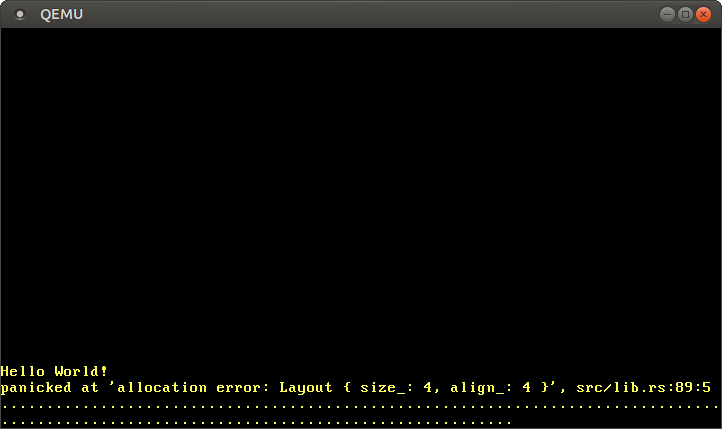

+++
title = "تخصيص Heap"
weight = 10
path = "ar/heap-allocation"
date = 2019-06-26

[extra]
chapter = "Memory Management"

# GitHub usernames of the people that translated this post
translators = ["mindfreq"]
rtl = true
+++

يضيف هذا المقال دعم تخصيص heap لنواتنا. أولاً، يقدم مقدمة عن الذاكرة الديناميكية ويُظهر كيف يمنع borrow checker أخطاء التخصيص الشائعة. ثم ينفذ واجهة التخصيص الأساسية في Rust، ويُنشئ منطقة ذاكرة heap، ويُعدّ allocator crate. في نهاية هذا المقال، ستكون جميع أنواع التخصيص والجمع لمكتبة `alloc` المدمجة متاحة لنواتنا.

<!-- more -->

هذا المدونة مطوّرة بشكل مفتوح على [GitHub]. إذا كان لديك أي مشاكل أو أسئلة، يرجى فتح issue هناك. يمكنك أيضًا ترك تعليقات [في الأسفل]. يمكن العثور على الكود المصدري الكامل لهذا المقال في فرع [`post-10`][post branch].

[GitHub]: https://github.com/phil-opp/blog_os
[at the bottom]: #comments
<!-- fix for zola anchor checker (target is in template): <a id="comments"> -->
[post branch]: https://github.com/phil-opp/blog_os/tree/post-10

<!-- toc -->

## المتغيرات المحلية والثابتة

نستخدم حاليًا نوعين من المتغيرات في نواتنا: local variables و `static` variables. local variables مخزنة على [call stack] وصالحة فقط حتى تعود الدالة المحيطة. static variables مخزنة في موقع ذاكرة ثابت وتعيش دائمًا طوال عمر البرنامج.

### المتغيرات المحلية

local variables مخزنة على [call stack]، الذي هو [stack data structure] يدعم عمليات `push` و `pop`. في كل دخول دالة، parameters و return address و local variables للدالة المُستدعاة يُدفعها المترجم:

[call stack]: https://en.wikipedia.org/wiki/Call_stack
[stack data structure]: https://en.wikipedia.org/wiki/Stack_(abstract_data_type)


يُظهر المثال أعلاه call stack بعد أن استدعت دالة `outer` دالة `inner`. نرى أن call stack تحتوي أولاً على local variables لـ `outer`. عند استدعاء `inner`، تم دفع parameter `1` و return address للدالة. ثم تم نقل التحكم إلى `inner`، التي دفعت local variables الخاصة بها.

بعد عودة دالة `inner`، تُزال جزءها من call stack وتبقى فقط local variables لـ `outer`:


نرى أن local variables لـ `inner` تعيش فقط حتى تعود الدالة. يفرض مترجم Rust هذه lifetimes ويرمي خطأ عندما نستخدم قيمة لفترة طويلة جدًا، على سبيل المثال عندما نحاول إعادة مرجع إلى local variable:

```rust
fn inner(i: usize) -> &'static u32 {
    let z = [1, 2, 3];
    &z[i]
}
```

([تشغيل المثال على playground](https://play.rust-lang.org/?version=stable&mode=debug&edition=2024&gist=6186a0f3a54f468e1de8894996d12819))

بينما إعادة مرجع لا معنى لها في هذا المثال، هناك حالات نريد فيها متغير أن يعيش أطول من الدالة. رأينا بالفعل مثل هذه الحالة في نواتنا عندما حاولنا [تحميل interrupt descriptor table] واحتجنا لاستخدام متغير `static` لتمديد lifetime.

[load an interrupt descriptor table]: @/edition-2/posts/05-cpu-exceptions/index.md#loading-the-idt

### المتغيرات الثابتة

static variables مخزنة في موقع ذاكرة ثابت منفصل عن stack. هذا الموقع يُعيّن وقت التجميع من قبل linker ويُرمز في executable. statics تعيش طوال تشغيل البرنامج، لذلك لها lifetime `'static` ويمكن دائمًا الرجوع إليها من local variables:

![The same outer/inner example, except that inner has a `static Z: [u32; 3] = [1,2,3];` and returns a `&Z[i]` reference](call-stack-static.svg)

عندما تعود دالة `inner` في المثال أعلاه، تُدمر جزءها من call stack. static variables تعيش في نطاق ذاكرة منفصل لا يُدمر أبدًا، لذلك مرجع `&Z[1]` لا يزال صالحًا بعد العودة.

بجانب lifetime `'static`، لـ static variables أيضًا خاصية مفيدة أن موقعها معروف وقت التجميع، حتى لا يكون هناك حاجة لمرجع للوصول إليها. استفدنا من هذه الخاصية لـ macro `println`: باستخدام [static `Writer`] داخليًا، لا يكون هناك `&mut Writer` reference مطلوب لاستدعاء macro، الذي مفيد جدًا في [exception handlers]، حيث لا نصل إلى أي متغيرات إضافية.

[static `Writer`]: @/edition-2/posts/03-vga-text-buffer/index.md#a-global-interface
[exception handlers]: @/edition-2/posts/05-cpu-exceptions/index.md#implementation

ومع ذلك، هذه الخاصية لـ static variables تجلب عيبًا حاسمًا: هي read-only افتراضيًا. يفرض Rust هذا لأن [data race] سيحدث إذا، مثلًا، عدّل threadان static variable في نفس الوقت. الطريقة الوحيدة لتعديل static variable هي تغليفه في نوع [`Mutex`]، الذي يضمن أن `&mut` reference واحدة فقط موجودة في أي نقطة زمنية. استخدمنا بالفعل `Mutex` لـ [static VGA buffer `Writer`][vga mutex].

[data race]: https://doc.rust-lang.org/nomicon/races.html
[`Mutex`]: https://docs.rs/spin/0.5.2/spin/struct.Mutex.html
[vga mutex]: @/edition-2/posts/03-vga-text-buffer/index.md#spinlocks

## الذاكرة الديناميكية

local و static variables قويتان معًا وتمكنان معظم حالات الاستخدام. ومع ذلك، رأينا أن كلتاهما لها قيودها:

- local variables تعيش فقط حتى نهاية الدالة أو الكتلة المحيطة. هذا لأنها تعيش على call stack وتُدمر بعد عودة الدالة المحيطة.
- static variables تعيش دائمًا طوال تشغيل البرنامج، لذلك لا توجد طريقة لاستعادة وإعادة استخدام ذاكرتها عندما لم تعد مطلوبة. أيضًا، لها semantics ملكية غير واضحة وقابلة للوصول من جميع الدوال، لذلك تحتاج للحماية بـ [`Mutex`] عندما نريد تعديلها.

قيود آخر لـ local و static variables هو أن لها حجم ثابت. لذلك لا يمكنها تخزين collection تنمو ديناميكيًا عند إضافة عناصر أكثر. (هناك مقترحات لـ [unsized rvalues] في Rust تسمح بـ local variables ذات حجم ديناميكي، لكنها تعمل فقط في بعض الحالات المحددة.)

[unsized rvalues]: https://github.com/rust-lang/rust/issues/48055

لتجاوز هذه العيوب، تدعم لغات البرمجة غالبًا منطقة ذاكرة ثالثة لتخزين المتغيرات تسمى **heap**. يدعم heap _dynamic memory allocation_ وقت التشغيل عبر دالتين تسميان `allocate` و `deallocate`. يعمل بالطريقة التالية: دالة `allocate` تُعيد chunk ذاكرة حرة بالحجم المحدد يمكن استخدامها لتخزين متغير. ثم يعيش هذا المتغير حتى يُحرر باستدعاء دالة `deallocate` بمرجع إلى المتغير.

لنمر عبر مثال:

![The inner function calls `allocate(size_of([u32; 3]))`, writes `z.write([1,2,3]);`, and returns `(z as *mut u32).offset(i)`. On the returned value `y`, the outer function performs `deallocate(y, size_of(u32))`.](call-stack-heap.svg)

هنا تستخدم دالة `inner` ذاكرة heap بدلاً من static variables لتخزين `z`. تخصص أولاً كتلة ذاكرة بالحجم المطلوب، التي تُعيد `*mut u32` [raw pointer]. ثم تستخدم دالة [`ptr::write`] لكتابة المصفوفة `[1,2,3]` إليها. في الخطوة الأخيرة، تستخدم دالة [`offset`] لحساب مؤشر إلى العنصر الـ `i` ثم تُعيده. (لاحظ أننا أغفلنا بعض casts و unsafe blocks المطلوبة في هذه الدالة المثال للاختصار.)

[raw pointer]: https://doc.rust-lang.org/book/ch20-01-unsafe-rust.html#dereferencing-a-raw-pointer
[`ptr::write`]: https://doc.rust-lang.org/core/ptr/fn.write.html
[`offset`]: https://doc.rust-lang.org/std/primitive.pointer.html#method.offset

الذاكرة المُخصصة تعيش حتى تُحرر صراحة عبر استدعاء `deallocate`. لذلك، المؤشر المُعاد لا يزال صالحًا حتى بعد عودة `inner` وتدمير جزءها من call stack. ميزة استخدام ذاكرة heap مقارنة بالذاكرة static هي أن الذاكرة يمكن إعادة استخدامها بعد تحريرها، الذي نفعله عبر استدعاء `deallocate` في `outer`. بعد ذلك الاستدعاء، تبدو الحالة كالتالي:

![The call stack contains the local variables of `outer`, the heap contains `z[0]` and `z[2]`, but no longer `z[1]`.](call-stack-heap-freed.svg)

نرى أن slot `z[1]` حر مرة أخرى ويمكن إعادة استخدامه لاستدعاء `allocate` التالي. ومع ذلك، نرى أيضًا أن `z[0]` و `z[2]` لا يُحرران أبدًا لأننا لا نُحررهما أبدًا. مثل هذا الـ bug يسمى _memory leak_ وغالبًا سبب استهلاك ذاكرة مفرط للبرامج (فقط تخيل ماذا يحدث عندما نستدعي `inner` بشكل متكرر في loop). قد يبدو هذا سيئًا، لكن هناك أنواع أكثر خطورة من الـ bugs التي يمكن أن تحدث مع التخصيص الديناميكي.

### الأخطاء الشائعة

بجانب memory leaks، التي مؤسفة لكنها لا تجعل البرنامج قابلًا للمهاجمين، هناك نوعان شائعان من الـ bugs بعواقب أكثر خطورة:

- عندما نستمر عن طريق الخطأ في استخدام متغير بعد استدعاء `deallocate` عليه، لدينا ما يسمى **use-after-free** vulnerability. مثل هذا الـ bug يسبب undefined behavior ويمكن غالبًا استغلاله من قبل المهاجمين لتنفيذ كود عشوائي.
- عندما نُحرر متغيرًا مرتين عن طريق الخطأ، لدينا **double-free** vulnerability. هذا إشكالي لأنه قد يُحرر allocation مختلف تم تخصيصه في نفس المكان بعد استدعاء `deallocate` الأول. لذلك، يمكن أن يؤدي إلى use-after-free vulnerability مرة أخرى.

هذه الأنواع من vulnerabilities معروفة عمومًا، لذلك قد يتوقع المرء أن الناس قد تعلموا كيفية تجنبها حتى الآن. لكن لا، مثل هذه vulnerabilities لا تزال تُكتشف بانتظام، على سبيل المثال هذا [use-after-free vulnerability في Linux][linux vulnerability] (2019)، الذي سمح بتنفيذ كود عشوائي. بحث مثل `use-after-free linux {current year}` سيُنتج نتائج دائمًا تقريبًا. هذا يُظهر أن حتى أفضل المبرمجين ليسوا دائمًا قادرين على التعامل بشكل صحيح مع الذاكرة الديناميكية في المشاريع المعقدة.

[linux vulnerability]: https://securityboulevard.com/2019/02/linux-use-after-free-vulnerability-found-in-linux-2-6-through-4-20-11/

لتجنب هذه المشاكل، العديد من اللغات مثل Java أو Python تدير الذاكرة الديناميكية تلقائيًا باستخدام تقنية تسمى [_garbage collection_]. الفكرة هي أن المبرمج لا يستدعي `deallocate` يدويًا أبدًا. بدلاً من ذلك، يُوقف البرنامج بانتظام ويُفحص بحثًا عن متغيرات heap غير مستخدمة، التي تُحرر تلقائيًا. لذلك، vulnerabilities أعلاه لا يمكن أن تحدث أبدًا. العيوب هي overhead الأداء للفحص الدوري وأوقات التوقف الطويلة المحتملة.

[_garbage collection_]: https://en.wikipedia.org/wiki/Garbage_collection_(computer_science)

يأخذ Rust نهجًا مختلفًا للمشكلة: يستخدم مفهومًا يسمى [_ownership_] قادر على فحص صحة عمليات الذاكرة الديناميكية وقت التجميع. لذلك، لا حاجة لـ garbage collection لتجنب vulnerabilities المذكورة، مما يعني أنه لا overhead أداء. ميزة أخرى لهذا النهج أن المبرمج لا يزال لديه تحكم دقيق في استخدام الذاكرة الديناميكية، تمامًا مثل C أو C++.

[_ownership_]: https://doc.rust-lang.org/book/ch04-01-what-is-ownership.html

### التخصيص في Rust

بدلاً من ترك الم♲رمع يستدعي `allocate` و `deallocate` يدويًا، توفر مكتبة Rust القياسية أنواع تجريدية تستدعي هذه الدوال ضمنيًا. النوع الأهم هو [**`Box`**]، الذي هو تجريد لقيمة مُخصصة على heap. يوفر دالة بناء [`Box::new`] تأخذ قيمة، تستدعي `allocate` بحجم القيمة، ثم تنقل القيمة إلى slot المُخصص حديثًا على heap. لتحرير ذاكرة heap مرة أخرى، ينفذ نوع `Box` trait [`Drop`] لاستدعاء `deallocate` عندما يخرج من النطاق:

[**`Box`**]: https://doc.rust-lang.org/std/boxed/index.html
[`Box::new`]: https://doc.rust-lang.org/alloc/boxed/struct.Box.html#method.new
[`Drop` trait]: https://doc.rust-lang.org/book/ch15-03-drop.html

```rust
{
    let z = Box::new([1,2,3]);
    […]
} // z goes out of scope and `deallocate` is called
```

هذا النمط له اسم غريب [_resource acquisition is initialization_] (أو _RAII_ باختصار). نشأ في C++، حيث يُستخدم لتنفيذ نوع تجريد مشابه يسمى [`std::unique_ptr`].

[_resource acquisition is initialization_]: https://en.wikipedia.org/wiki/Resource_acquisition_is_initialization
[`std::unique_ptr`]: https://en.cppreference.com/w/cpp/memory/unique_ptr

مثل هذا النوع وحده لا يكفي لمنع جميع use-after-free bugs لأن المبرمجين لا يزالون بإمكانهم الاحتفاظ بمراجع بعد خروج `Box` من النطاق وتحرير ذاكرة heap المقابلة:

```rust
let x = {
    let z = Box::new([1,2,3]);
    &z[1]
}; // z goes out of scope and `deallocate` is called
println!("{}", x);
```

هنا يأتي دور ownership في Rust. يُعيّن [lifetime] مجردًا لكل مرجع، الذي هو النطاق الذي يكون فيه المرجع صالحًا. في المثال أعلاه، مرجع `x` أُخذ من مصفوفة `z`، لذلك يصبح غير صالح بعد خروج `z` من النطاق. عندما [تشغّل المثال أعلاه على playground][playground-2] ترى أن مترجم Rust يرمي خطأ بالفعل:

[lifetime]: https://doc.rust-lang.org/book/ch10-03-lifetime-syntax.html
[playground-2]: https://play.rust-lang.org/?version=stable&mode=debug&edition=2024&gist=28180d8de7b62c6b4a681a7b1f745a48

```
error[E0597]: `z[_]` does not live long enough
 --> src/main.rs:4:9
  |
2 |     let x = {
  |         - borrow later stored here
3 |         let z = Box::new([1,2,3]);
  |             - binding `z` declared here
4 |         &z[1]
  |         ^^^^^ borrowed value does not live long enough
5 |     }; // z goes out of scope and `deallocate` is called
  |     - `z[_]` dropped here while still borrowed
```

مصطلحات قد تكون محيرة في البداية. أخذ مرجع لقيمة يسمى _borrowing_ للقيمة لأنه مشابه للاقتراض في الحياة الحقيقية: لديك وصول مؤقت للكائن لكن تحتاج لإعادته في وقت ما، ويجب ألا تدمره. بالتحقق من أن جميع borrows تنتهي قبل تدمير الكائن، يمكن لمترجم Rust ضمان عدم حدوث use-after-free.

نظام ownership في Rust يذهب أبعد، مانعًا ليس فقط use-after-free bugs لكن مقدمًا أيضًا [_memory safety_] كاملة، كما تفعل لغات garbage collected مثل Java أو Python. بالإضافة، يضمن [_thread safety_] وبالتالي حتى أمن أكثر من تلك اللغات في كود multi-threaded. والأهم من ذلك، كل هذه الفحوصات تحدث وقت التجميع، لذلك لا overhead وقت التشغيل مقارنة بإدارة الذاكرة المكتوبة يدويًا في C.

[_memory safety_]: https://en.wikipedia.org/wiki/Memory_safety
[_thread safety_]: https://en.wikipedia.org/wiki/Thread_safety

### حالات الاستخدام

نعرف الآن أساسيات dynamic memory allocation في Rust، لكن متى يجب استخدامها؟ لقد وصلنا بعيدًا جدًا مع نواتنا بدون dynamic memory allocation، فلماذا نحتاجها الآن؟

أولاً، dynamic memory allocation يأتي دائمًا مع بعض overhead أداء لأننا نحتاج لإيجاد slot حر على heap لكل allocation. لهذا السبب، local variables مفضلة بشكل عام، خاصة في كود النواة الحساس للأداء. ومع ذلك، هناك حالات يكون فيها dynamic memory allocation هو الخيار الأفضل.

كقاعدة أساسية، الذاكرة الديناميكية مطلوبة للمتغيرات التي لها lifetime ديناميكي أو حجم متغير. النوع الأهم بـ lifetime ديناميكي هو [**`Rc`**]، الذي يعد المراجع إلى قيمته المغلفة ويحررها بعد أن تخرج جميع المراجع من النطاق. أمثلة لأنواع بحجم متغير هي [**`Vec`**] و [**`String`**] و [collection types] أخرى تنمو ديناميكيًا عند إضافة عناصر أكثر. تعمل هذه الأنواع بتخصيص مساحة ذاكرة أكبر عندما تمتلئ، نسخ جميع العناصر إليها، ثم تحرير allocation القديم.

[**`Rc`**]: https://doc.rust-lang.org/alloc/rc/index.html
[**`Vec`**]: https://doc.rust-lang.org/alloc/vec/index.html
[**`String`**]: https://doc.rust-lang.org/alloc/string/index.html
[collection types]: https://doc.rust-lang.org/alloc/collections/index.html

لنواتنا، سنحتاج بشكل أساسي collection types، على سبيل المثال، لتخزين قائمة المهام النشطة عند تنفيذ multitasking في مقالات مستقبلية.

## واجهة المخصص

الخطوة الأولى في تنفيذ heap allocator هي إضافة dependency على مكتبة [`alloc`] المدمجة. مثل مكتبة [`core`]، هي مجموعة فرعية من مكتبة القياسية تحتوي بالإضافة على أنواع التخصيص والجمع. لإضافة dependency على `alloc`، نضيف ما يلي إلى `lib.rs`:

[`alloc`]: https://doc.rust-lang.org/alloc/
[`core`]: https://doc.rust-lang.org/core/

```rust
// in src/lib.rs

extern crate alloc;
```

على عكس dependencies العادية، لا نحتاج لتعديل `Cargo.toml`. السبب هو أن مكتبة `alloc` تأتي مع مترجم Rust كجزء من مكتبة القياسية، لذلك المترجم يعرف بالفعل عن المكتبة. بإضافة `extern crate` هذه، نحدد أن المترجم يجب أن يحاول تضمينها. (تاريخيًا، كانت جميع dependencies تحتاج `extern crate`، الذي هو الآن اختياري).

بما أننا نجمع لـ target مخصص، لا نستطيع استخدام النسخة المجمعة مسبقًا من `alloc` المتوفرة مع تثبيت Rust. بدلاً من ذلك، نحتاج لإخبار cargo بإعادة تجميع المكتبة من source. يمكننا ذلك بإضافتها إلى مصفوفة `unstable.build-std` في ملف `.cargo/config.toml`:

```toml
# in .cargo/config.toml

[unstable]
build-std = ["core", "compiler_builtins", "alloc"]
```

الآن سيُعيد المترجم تجميع وتضمين مكتبة `alloc` في نواتنا.

سبب أن مكتبة `alloc` معطلة افتراضيًا في crates `#[no_std]` هو أن لها متطلبات إضافية. عندما نحاول تجميع مشروعنا الآن، سترى هذه المتطلبات كأخطاء:

```
error: no global memory allocator found but one is required; link to std or add
       #[global_allocator] to a static item that implements the GlobalAlloc trait.
```

الخطأ يحدث لأن مكتبة `alloc` تحتاج heap allocator، الذي هو كائن يوفر دوال `allocate` و `deallocate`. في Rust، heap allocators تُوصف بـ trait [`GlobalAlloc`]، المذكور في رسالة الخطأ. لتعيين heap allocator لـ crate، يجب تطبيق السمة `#[global_allocator`] على متغير `static` ينفذ trait `GlobalAlloc`.

[`GlobalAlloc`]: https://doc.rust-lang.org/alloc/alloc/trait.GlobalAlloc.html

### السمة `GlobalAlloc`

يحدد trait [`GlobalAlloc`] الدوال التي يجب أن يوفرها heap allocator. Trait خاص لأنه نادرًا ما يُستخدم مباشرة من قبل المبرمج. بدلاً من ذلك، سيُدرج المترجم تلقائيًا استدعاءات مناسبة لـ trait methods عند استخدام أنواع التخصيص والجمع من `alloc`.

بما أننا سنحتاج لتنفيذ Trait لجميع أنواع المخصصات لدينا، يستحق إلقاء نظرة أقرب على إعلانه:

```rust
pub unsafe trait GlobalAlloc {
    unsafe fn alloc(&self, layout: Layout) -> *mut u8;
    unsafe fn dealloc(&self, ptr: *mut u8, layout: Layout);

    unsafe fn alloc_zeroed(&self, layout: Layout) -> *mut u8 { ... }
    unsafe fn realloc(
        &self,
        ptr: *mut u8,
        layout: Layout,
        new_size: usize
    ) -> *mut u8 { ... }
}
```

يحدد الدالتين المطلوبتين [`alloc`] و [`dealloc`]، المقابلتين لدالتَي `allocate` و `deallocate` اللتين استخدمناهما في أمثلتنا:
- دالة [`alloc`] تأخذ instance [`Layout`] كوسيطة، الذي يصف الحجم والمحاذاة المطلوبين للذاكرة المُخصصة. تُعيد [raw pointer] إلى أول byte من كتلة الذاكرة المُخصصة. بدلاً من قيمة خطأ صريحة، تُعيد دالة `alloc` null pointer للإشارة إلى خطأ allocation. هذا غير idiomatic بعض الشيء، لكنه ميزة أن تغليف allocators نظام موجودة سهل لأنها تستخدم نفس الاصطلاح.
- دالة [`dealloc`] هي counterpart ومسؤولة عن تحرير كتلة ذاكرة مرة أخرى. تستقبل وسيطتين: المؤشر الذي أعادته `alloc` و `Layout` الذي استُخدم لل allocation.

[`alloc`]: https://doc.rust-lang.org/alloc/alloc/trait.GlobalAlloc.html#tymethod.alloc
[`dealloc`]: https://doc.rust-lang.org/alloc/alloc/trait.GlobalAlloc.html#tymethod.dealloc
[`Layout`]: https://doc.rust-lang.org/alloc/alloc/struct.Layout.html

يحدد Trait أيضًا الدالتين [`alloc_zeroed`] و [`realloc`] بimplementations افتراضية:

- دالة [`alloc_zeroed`] معادلة لاستدعاء `alloc` ثم تصفير كتلة الذاكرة المُخصصة، الذي هو بالضبط ما يفعله implementation الافتراضي. يمكن لـ allocator implementation تجاوز implementations الافتراضية بـ implementation مخصص أكثر كفاءة إذا كان ممكنًا.
- دالة [`realloc`] تسمح بتكبير أو تصغير allocation. implementation الافتراضي يخصص كتلة ذاكرة بالحجم المطلوي وينسخ جميع المحتوى من allocation السابق. مرة أخرى، يمكن لـ allocator implementation تقديم implementation أكثر كفاءة لهذه الدالة، على سبيل المثال بتكبير/تصغير allocation في المكان إذا كان ممكنًا.

[`alloc_zeroed`]: https://doc.rust-lang.org/alloc/alloc/trait.GlobalAlloc.html#method.alloc_zeroed
[`realloc`]: https://doc.rust-lang.org/alloc/alloc/trait.GlobalAlloc.html#method.realloc

#### عدم الأمان

شيء واحد لاحظه هو أن كلًا من Trait نفسه وجميع trait methods معلنة كـ `unsafe`:

- سبب إعلان Trait كـ `unsafe` هو أن المبرمج يجب أن يضمن صحة trait implementation لنوع allocator. على سبيل المثال، يجب أن لا تُعيد دالة `alloc` كتلة ذاكرة مستخدمة في مكان آخر لأن هذا سيسبب undefined behavior.
- بالمثل، سبب أن الدوال `unsafe` هو أن المستدعي يجب أن يضمن various invariants عند استدعاء الدوال، على سبيل المثال، أن `Layout` الممررة إلى `alloc` تحدد حجمًا غير صفري. هذا ليس ذا صلة في الممارسة العملية لأن الدوال تُستدعى عادةً مباشرة من قبل المترجم، الذي يضمن استيفاء المتطلبات.

### مخصص وهمي

الآن نعرف ما يجب أن يوفره نوع allocator، يمكننا إنشاء dummy allocator بسيط. لذلك، نُنشئ module `allocator` جديدًا:

```rust
// in src/lib.rs

pub mod allocator;
```

Dummy allocator لدينا يفعل الحد الأدنى لتنفيذ Trait ويعيد دائمًا خطأ عند استدعاء `alloc`. يبدو كالتالي:

```rust
// in src/allocator.rs

use alloc::alloc::{GlobalAlloc, Layout};
use core::ptr::null_mut;

pub struct Dummy;

unsafe impl GlobalAlloc for Dummy {
    unsafe fn alloc(&self, _layout: Layout) -> *mut u8 {
        null_mut()
    }

    unsafe fn dealloc(&self, _ptr: *mut u8, _layout: Layout) {
        panic!("dealloc should be never called")
    }
}
```

الـ struct لا يحتاج أي حقول، لذلك نُنشئه كـ [zero-sized type]. كما ذكر أعلاه، نُعيد دائمًا null pointer من `alloc`، المقابل لخطأ allocation. بما أن المخصص لا يُعيد أي ذاكرة أبدًا، استدعاء `dealloc` يجب ألا يحدث أبدًا. لهذا السبب، نُ panic ببساطة في دالة `dealloc`. الدالتان `alloc_zeroed` و `realloc` لهما implementations افتراضية، لذلك لا نحتاج تقديم implementations لهما.

[zero-sized type]: https://doc.rust-lang.org/nomicon/exotic-sizes.html#zero-sized-types-zsts

الآن لدينا allocator بسيط، لكن لا نزال نحتاج لإخبار مترجم Rust أنه يجب استخدام هذا Allocator. هنا يأتي دور السمة `#[global_allocator]`.

### السمة `#[global_allocator]`

السمة `#[global_allocator]` تخبر مترجم Rust أي instance allocator يجب أن يُستخدم كـ global heap allocator. السمة قابلة للتطبيق فقط على `static` ينفذ trait `GlobalAlloc`. لنُسجّل instance من `Dummy` allocator كـ global allocator:

```rust
// in src/allocator.rs

#[global_allocator]
static ALLOCATOR: Dummy = Dummy;
```

بما أن `Dummy` allocator هو [zero-sized type]، لا نحتاج تحديد أي حقول في تعبير التهيئة.

مع هذا static، يجب أن تُصلح أخطاء التجميع. الآن يمكننا استخدام أنواع التخصيص والجمع من `alloc`. على سبيل المثال، يمكننا استخدام [`Box`] لتخصيص قيمة على heap:

[`Box`]: https://doc.rust-lang.org/alloc/boxed/struct.Box.html

```rust
// in src/main.rs

extern crate alloc;

use alloc::boxed::Box;

fn kernel_main(boot_info: &'static BootInfo) -> ! {
    // […] print "Hello World!", call `init`, create `mapper` and `frame_allocator`

    let x = Box::new(41);

    // […] call `test_main` in test mode

    println!("It did not crash!");
    blog_os::hlt_loop();
}

```

لاحظ أننا نحتاج لتحديد `extern crate alloc` في `main.rs` أيضًا. هذا مطلوب لأن أجزاء `lib.rs` و `main.rs` تُعامل كـ crates منفصلة. ومع ذلك، لا نحتاج لإنشاء `#[global_allocator]` static أخرى لأن global allocator ينطبق على جميع crates في المشروع. في الواقع، تحديد allocator إضافية في crate أخرى سيكون خطأ.

عندما نشغّل الكود أعلاه، نرى أن panic يحدث:



يحدث panic لأن دالة `Box::new` تستدعي ضمنيًا دالة `alloc` لـ global allocator. Dummy allocator يُعيد دائمًا null pointer، لذلك كل allocation يفشل. لإصلاح هذا، نحتاج لإنشاء allocator يُعيد ذاكرة قابلة للاستخدام فعلًا.

## إنشاء Heap للنواة

قبل أن نُنشئ allocator مناسب، نحتاج أولاً لإنشاء منطقة ذاكرة heap يمكن للمخصص تخصيص ذاكرة منها. لذلك، نحتاج لتحديد نطاق ذاكرة افتراضي لمنطقة heap ثم تعيين هذه المنطقة إلى physical frames. راجع [_"Introduction To Paging"_] لنظرية عامة على الذاكرة الافتراضية و page tables.

[_"Introduction To Paging"_]: @/edition-2/posts/08-paging-introduction/index.md

الخطوة الأولى هي تحديد منطقة ذاكرة افتراضية لـ heap. يمكننا اختيار أي نطاق عنوان افتراضي نريده، طالما أنه غير مستخدم بالفعل لمنطقة ذاكرة مختلفة. لنُحدد كذاكرة starting at address `0x_4444_4444_0000` حتى نتمكن بسهولة من التعرف على heap pointer لاحقًا:

```rust
// in src/allocator.rs

pub const HEAP_START: usize = 0x_4444_4444_0000;
pub const HEAP_SIZE: usize = 100 * 1024; // 100 KiB
```

نُعين حجم heap إلى 100&nbsp;KiB الآن. إذا احتجنا مساحة أكثر في المستقبل، يمكننا زيادتها ببساطة.

إذا حاولنا استخدام منطقة heap هذه الآن، سيحدث page fault لأن منطقة الذاكرة الافتراضية غير مُعيّنة إلى ذاكرة فيزيائية بعد. لحل هذا، نُنشئ دالة `init_heap` تُعيّن صفحات heap باستخدام [`Mapper` API] الذي قدمناه في مقال [_"Paging Implementation"_]:

[`Mapper` API]: @/edition-2/posts/09-paging-implementation/index.md#using-offsetpagetable
[_"Paging Implementation"_]: @/edition-2/posts/09-paging-implementation/index.md

```rust
// in src/allocator.rs

use x86_64::{
    structures::paging::{
        mapper::MapToError, FrameAllocator, Mapper, Page, PageTableFlags, Size4KiB,
    },
    VirtAddr,
};

pub fn init_heap(
    mapper: &mut impl Mapper<Size4KiB>,
    frame_allocator: &mut impl FrameAllocator<Size4KiB>,
) -> Result<(), MapToError<Size4KiB>> {
    let page_range = {
        let heap_start = VirtAddr::new(HEAP_START as u64);
        let heap_end = heap_start + HEAP_SIZE - 1u64;
        let heap_start_page = Page::containing_address(heap_start);
        let heap_end_page = Page::containing_address(heap_end);
        Page::range_inclusive(heap_start_page, heap_end_page)
    };

    for page in page_range {
        let frame = frame_allocator
            .allocate_frame()
            .ok_or(MapToError::FrameAllocationFailed)?;
        let flags = PageTableFlags::PRESENT | PageTableFlags::WRITABLE;
        unsafe {
            mapper.map_to(page, frame, flags, frame_allocator)?.flush()
        };
    }

    Ok(())
}
```

الدالة تأخذ mutable references إلى [`Mapper`] و [`FrameAllocator`]، كلاهما محدود إلى 4&nbsp;KiB pages باستخدام [`Size4KiB`] كـ generic parameter. نوع عودة الدالة هو [`Result`] مع نوع الوحدة `()` كـ success variant و [`MapToError`] كـ error variant، الذي هو نوع الخطأ الذي تُعيده دالة [`Mapper::map_to`]. إعادة استخدام نوع الخطأ منطقي هنا لأن دالة `map_to` هي مصدر الأخطاء الرئيسي في هذه الدالة.

[`Mapper`]:https://docs.rs/x86_64/0.14.2/x86_64/structures/paging/mapper/trait.Mapper.html
[`FrameAllocator`]: https://docs.rs/x86_64/0.14.2/x86_64/structures/paging/trait.FrameAllocator.html
[`Size4KiB`]: https://docs.rs/x86_64/0.14.2/x86_64/structures/paging/page/enum.Size4KiB.html
[`Result`]: https://doc.rust-lang.org/core/result/enum.Result.html
[`MapToError`]: https://docs.rs/x86_64/0.14.2/x86_64/structures/paging/mapper/enum.MapToError.html
[`Mapper::map_to`]: https://docs.rs/x86_64/0.14.2/x86_64/structures/paging/mapper/trait.Mapper.html#method.map_to

يمكن تقسيم التنفيذ إلى جزأين:

- **إنشاء نطاق page:** لإنشاء نطاق pages التي نريد تعيينها، نحول مؤشر `HEAP_START` إلى نوع [`VirtAddr`]. ثم نحسب عنوان نهاية heap بإضافة `HEAP_SIZE`. نريد bound inclusive (عنوان آخر byte لـ heap)، لذلك نطرح 1. ثم نحول العناوين إلى أنواع [`Page`] باستخدام دالة [`containing_address`]. أخيرًا، نُنشئ نطاق page من start و end pages باستخدام دالة [`Page::range_inclusive`].

- **تعيين pages:** الخطوة الثانية هي تعيين جميع pages لنطاق page الذي أنشأناه للتو. لذلك، نمرر عبر هذه pages باستخدام loop `for`. لكل page، نفعل ما يلي:

    - نخصص physical frame يجب تعيين page إليها باستخدام دالة [`FrameAllocator::allocate_frame`]. هذه الدالة تُعيد [`None`] عندما لا تبقى frames. نتعامل مع تلك الحالة بتعيينها إلى خطأ [`MapToError::FrameAllocationFailed`] عبر دالة [`Option::ok_or`] ثم تطبيق [question mark operator] للعودة المبكرة في حالة الخطأ.

    - نعين flag `PRESENT` المطلوبة و flag `WRITABLE` للصفحة. مع هذه flags، كلتا القراءة والكتابة مسموحتان، الذي منطقي لذاكرة heap.

    - نستخدم دالة [`Mapper::map_to`] لإنشاء التعيين في page table النشطة. الدالة قد تفشل، لذلك نستخدم [question mark operator] مرة أخرى لإعادة الخطأ إلى المستدعي. عند النجاح، تُعيد الدالة instance [`MapperFlush`] التي يمكننا استخدامها لتحديث [_translation lookaside buffer_] باستخدام دالة [`flush`].

[`VirtAddr`]: https://docs.rs/x86_64/0.14.2/x86_64/addr/struct.VirtAddr.html
[`Page`]: https://docs.rs/x86_64/0.14.2/x86_64/structures/paging/page/struct.Page.html
[`containing_address`]: https://docs.rs/x86_64/0.14.2/x86_64/structures/paging/page/struct.Page.html#method.containing_address
[`Page::range_inclusive`]: https://docs.rs/x86_64/0.14.2/x86_64/structures/paging/page/struct.Page.html#method.range_inclusive
[`FrameAllocator::allocate_frame`]: https://docs.rs/x86_64/0.14.2/x86_64/structures/paging/trait.FrameAllocator.html#tymethod.allocate_frame
[`None`]: https://doc.rust-lang.org/core/option/enum.Option.html#variant.None
[`MapToError::FrameAllocationFailed`]: https://docs.rs/x86_64/0.14.2/x86_64/structures/paging/mapper/enum.MapToError.html#variant.FrameAllocationFailed
[`Option::ok_or`]: https://doc.rust-lang.org/core/option/enum.Option.html#method.ok_or
[question mark operator]: https://doc.rust-lang.org/book/ch09-02-recoverable-errors-with-result.html
[`MapperFlush`]: https://docs.rs/x86_64/0.14.2/x86_64/structures/paging/mapper/struct.MapperFlush.html
[_translation lookaside buffer_]: @/edition-2/posts/08-paging-introduction/index.md#the-translation-lookaside-buffer
[`flush`]: https://docs.rs/x86_64/0.14.2/x86_64/structures/paging/mapper/struct.MapperFlush.html#method.flush

الخطوة الأخيرة هي استدعاء هذه الدالة من `kernel_main`:

```rust
// in src/main.rs

fn kernel_main(boot_info: &'static BootInfo) -> ! {
    use blog_os::allocator; // new import
    use blog_os::memory::{self, BootInfoFrameAllocator};

    println!("Hello World{}", "!");
    blog_os::init();

    let phys_mem_offset = VirtAddr::new(boot_info.physical_memory_offset);
    let mut mapper = unsafe { memory::init(phys_mem_offset) };
    let mut frame_allocator = unsafe {
        BootInfoFrameAllocator::init(&boot_info.memory_map)
    };

    // new
    allocator::init_heap(&mut mapper, &mut frame_allocator)
        .expect("heap initialization failed");

    let x = Box::new(41);

    // […] call `test_main` in test mode

    println!("It did not crash!");
    blog_os::hlt_loop();
}
```

نُظهر الدالة الكاملة للسياق هنا. الأسطر الجديدة الوحيدة هي import `blog_os::allocator` واستدعاء دالة `allocator::init_heap`. في حالة عودة دالة `init_heap` بخطأ، نُ panic باستخدام دالة [`Result::expect`] لأنه لا توجد طريقة منطقية لنا لمعالجة هذا الخطأ حاليًا.

[`Result::expect`]: https://doc.rust-lang.org/core/result/enum.Result.html#method.expect

الآن لدينا منطقة ذاكرة heap مُعيّنة جاهزة للاستخدام. استدعاء `Box::new` لا يزال يستخدم `Dummy` allocator القديم، لذلك سترى خطأ "out of memory" عندما تشغله. لنصلح هذا باستخدام allocator مناسب.

## استخدام مكتبة مخصص

بما أن تنفيذ allocator معقد بعض الشيء، نبدأ باستخدام external allocator crate. سنتعلم كيفية تنفيذ allocator خاص بنا في المقال التالي.

allocator crate بسيط لتطبيقات `no_std` هو مكتبة [`linked_list_allocator`]. اسمها يأتي من حقيقة أنها تستخدم linked list data structure لتتبع مناطق الذاكرة المُحررة. راجع المقال التالي لشرح أكثر تفصيلاً لهذا النهج.

لاستخدام المكتبة، نحتاج أولاً لإضافة dependency في `Cargo.toml`:

[`linked_list_allocator`]: https://github.com/phil-opp/linked-list-allocator/

```toml
# in Cargo.toml

[dependencies]
linked_list_allocator = "0.9.0"
```

ثم يمكننا استبدال dummy allocator بـ allocator المُوفر من المكتبة:

```rust
// in src/allocator.rs

use linked_list_allocator::LockedHeap;

#[global_allocator]
static ALLOCATOR: LockedHeap = LockedHeap::empty();
```

الـ struct يسمى `LockedHeap` لأنها تستخدم نوع [`spinning_top::Spinlock`] للمزامنة. هذا مطلوب لأن عدة threads يمكنها الوصول إلى static `ALLOCATOR` في نفس الوقت. كما دائمًا، عند استخدام spinlock أو mutex، نحتاج للحذر من عدم إثارة deadlock عن طريق الخطأ. هذا يعني أنه يجب ألا نفعل أي allocations في interrupt handlers، لأنها يمكن أن تعمل في وقت عشوائي وقد تقاطع allocation جارية.

[`spinning_top::Spinlock`]: https://docs.rs/spinning_top/0.1.0/spinning_top/type.Spinlock.html

تعيين `LockedHeap` كـ global allocator ليس كافيًا. السبب هو أننا نستخدم دالة بناء [`empty`]، التي تُنشئ allocator بدون أي backing memory. مثل dummy allocator، تُعيد دائمًا خطأ عند `alloc`. لإصلاح هذا، نحتاج لتهيئة Allocator بعد إنشاء heap:

[`empty`]: https://docs.rs/linked_list_allocator/0.9.0/linked_list_allocator/struct.LockedHeap.html#method.empty

```rust
// in src/allocator.rs

pub fn init_heap(
    mapper: &mut impl Mapper<Size4KiB>,
    frame_allocator: &mut impl FrameAllocator<Size4KiB>,
) -> Result<(), MapToError<Size4KiB>> {
    // […] map all heap pages to physical frames

    // new
    unsafe {
        ALLOCATOR.lock().init(HEAP_START, HEAP_SIZE);
    }

    Ok(())
}
```

نستخدم دالة [`lock`] على inner spinlock لنوع `LockedHeap` للحصول على مرجع حصري إلى instance [`Heap`] المغلفة، التي نستدعي عليها دالة [`init`] بحدود heap كوسيطات. لأن دالة [`init`] تحاول بالفعل الكتابة إلى ذاكرة heap، يجب أن نُهيئة heap فقط _بعد_ تعيين صفحات heap.

[`lock`]: https://docs.rs/lock_api/0.3.3/lock_api/struct.Mutex.html#method.lock
[`Heap`]: https://docs.rs/linked_list_allocator/0.9.0/linked_list_allocator/struct.Heap.html
[`init`]: https://docs.rs/linked_list_allocator/0.9.0/linked_list_allocator/struct.Heap.html#method.init

بعد تهيئة heap، يمكننا الآن استخدام جميع أنواع التخصيص والجمع من مكتبة [`alloc`] المدمجة بدون خطأ:

```rust
// in src/main.rs

use alloc::{boxed::Box, vec, vec::Vec, rc::Rc};

fn kernel_main(boot_info: &'static BootInfo) -> ! {
    // […] initialize interrupts, mapper, frame_allocator, heap

    // allocate a number on the heap
    let heap_value = Box::new(41);
    println!("heap_value at {:p}", heap_value);

    // create a dynamically sized vector
    let mut vec = Vec::new();
    for i in 0..500 {
        vec.push(i);
    }
    println!("vec at {:p}", vec.as_slice());

    // create a reference counted vector -> will be freed when count reaches 0
    let reference_counted = Rc::new(vec![1, 2, 3]);
    let cloned_reference = reference_counted.clone();
    println!("current reference count is {}", Rc::strong_count(&cloned_reference));
    core::mem::drop(reference_counted);
    println!("reference count is {} now", Rc::strong_count(&cloned_reference));

    // […] call `test_main` in test context
    println!("It did not crash!");
    blog_os::hlt_loop();
}
```

مثال الكود يُظهر بعض استخدامات أنواع [`Box`] و [`Vec`] و [`Rc`]. لأنواع `Box` و `Vec`، نطبع heap pointers الأساسية باستخدام [`{:p}` formatting specifier]. لإظهار `Rc`، نُنشئ قيمة heap بـ reference-counted ونستخدم دالة [`Rc::strong_count`] لطباعة reference count الحالية قبل وبعد إسقاط instance (باستخدام [`core::mem::drop`]).

[`Vec`]: https://doc.rust-lang.org/alloc/vec/
[`Rc`]: https://doc.rust-lang.org/alloc/rc/
[`{:p}` formatting specifier]: https://doc.rust-lang.org/core/fmt/trait.Pointer.html
[`Rc::strong_count`]: https://doc.rust-lang.org/alloc/rc/struct.Rc.html#method.strong_count
[`core::mem::drop`]: https://doc.rust-lang.org/core/mem/fn.drop.html

عندما نشغله، نرى ما يلي:


كما هو متوقع، نرى أن قيم `Box` و `Vec` تعيشان على heap، كما يشير المؤشر starting with prefix `0x_4444_4444_*`. قيمة reference-counted تتصرف أيضًا كما هو متوقع، مع reference count being 2 بعد استدعاء `clone`، و 1 مرة أخرى بعد إسقاط أحد instances.

سبب أن vector يبدأ عند offset `0x800` ليس أن boxed value بحجم `0x800` bytes، بل [reallocations] التي تحدث عندما يحتاج vector لزيادة capacity. على سبيل المثال، عندما يكون capacity لـ vector 32 ونحاول إضافة العنصر التالي، يخصص vector backing array جديدة بـ capacity 64 خلف الكواليس وينسخ جميع العناصر إليها. ثم يحرر allocation القديم.

[reallocations]: https://doc.rust-lang.org/alloc/vec/struct.Vec.html#capacity-and-reallocation

بالطبع، هناك المزيد من أنواع التخصيص والجمع في مكتبة `alloc` يمكننا استخدامها جميعًا الآن في نواتنا، بما في ذلك:

- المؤشر بـ reference-counted thread-safe [`Arc`]
- نوع السلسلة المملوك [`String`] و macro [`format!`]
- [`LinkedList`]
- ring buffer القابل للتكبير [`VecDeque`]
- [`BinaryHeap`] priority queue
- [`BTreeMap`] و [`BTreeSet`]

[`Arc`]: https://doc.rust-lang.org/alloc/sync/struct.Arc.html
[`String`]: https://doc.rust-lang.org/alloc/string/struct.String.html
[`format!`]: https://doc.rust-lang.org/alloc/macro.format.html
[`LinkedList`]: https://doc.rust-lang.org/alloc/collections/linked_list/struct.LinkedList.html
[`VecDeque`]: https://doc.rust-lang.org/alloc/collections/vec_deque/struct.VecDeque.html
[`BinaryHeap`]: https://doc.rust-lang.org/alloc/collections/binary_heap/struct.BinaryHeap.html
[`BTreeMap`]: https://doc.rust-lang.org/alloc/collections/btree_map/struct.BTreeMap.html
[`BTreeSet`]: https://doc.rust-lang.org/alloc/collections/btree_set/struct.BTreeSet.html

هذه الأنواع ستكون مفيدة جدًا عندما نريد تنفيذ قوائم threads و scheduling queues أو دعم async/await.

## Adding a Test

لضمان عدم كسر كود allocation الجديد عن طريق الخطأ، يجب إضافة integration test لذلك. نبدأ بإنشاء ملف `tests/heap_allocation.rs` جديد بالمحتوى التالي:

```rust
// in tests/heap_allocation.rs

#![no_std]
#![no_main]
#![feature(custom_test_frameworks)]
#![test_runner(blog_os::test_runner)]
#![reexport_test_harness_main = "test_main"]

extern crate alloc;

use bootloader::{entry_point, BootInfo};
use core::panic::PanicInfo;

entry_point!(main);

fn main(boot_info: &'static BootInfo) -> ! {
    unimplemented!();
}

#[panic_handler]
fn panic(info: &PanicInfo) -> ! {
    blog_os::test_panic_handler(info)
}
```

نعيد استخدام دالتَي `test_runner` و `test_panic_handler` من `lib.rs`. بما أننا نريد اختبار allocations، نفعل مكتبة `alloc` عبر `extern crate alloc`. لمزيد من المعلومات حول test boilerplate، راجع مقال [_Testing_].

[_Testing_]: @/edition-2/posts/04-testing/index.md

تنفيذ دالة `main` يبدو كالتالي:

```rust
// in tests/heap_allocation.rs

fn main(boot_info: &'static BootInfo) -> ! {
    use blog_os::allocator;
    use blog_os::memory::{self, BootInfoFrameAllocator};
    use x86_64::VirtAddr;

    blog_os::init();
    let phys_mem_offset = VirtAddr::new(boot_info.physical_memory_offset);
    let mut mapper = unsafe { memory::init(phys_mem_offset) };
    let mut frame_allocator = unsafe {
        BootInfoFrameAllocator::init(&boot_info.memory_map)
    };
    allocator::init_heap(&mut mapper, &mut frame_allocator)
        .expect("heap initialization failed");

    test_main();
    loop {}
}
```

مشابهة جدًا لدالة `kernel_main` في `main.rs`، مع أن الاختلافات أننا لا نستدعي `println` ولا نتضمن أي allocations مثال ونستدعي `test_main` بدون قيد.

الآن نحن مستعدون لإضافة عدة test cases. أولاً، نضيف اختبار ينفذ بعض allocations بسيطة باستخدام [`Box`] ويتحقق من القيم المُخصصة لضمان عمل allocations الأساسية:

```rust
// in tests/heap_allocation.rs
use alloc::boxed::Box;

#[test_case]
fn simple_allocation() {
    let heap_value_1 = Box::new(41);
    let heap_value_2 = Box::new(13);
    assert_eq!(*heap_value_1, 41);
    assert_eq!(*heap_value_2, 13);
}
```

الأهم، هذا الاختبار يتحقق من عدم حدوث خطأ allocation.

ثم نبني vector كبير بشكل تكراري، لاختبار كلًا من allocations الكبيرة و allocations المتعددة (بسبب reallocations):

```rust
// in tests/heap_allocation.rs

use alloc::vec::Vec;

#[test_case]
fn large_vec() {
    let n = 1000;
    let mut vec = Vec::new();
    for i in 0..n {
        vec.push(i);
    }
    assert_eq!(vec.iter().sum::<u64>(), (n - 1) * n / 2);
}
```

نتحقق من المجموع بمقارنته بمعادلة [n-th partial sum]. هذا يعطينا ثقة أن القيم المُخصصة جميعها صحيحة.

[n-th partial sum]: https://en.wikipedia.org/wiki/1_%2B_2_%2B_3_%2B_4_%2B_%E2%8B%AF#Partial_sums

كاختبار ثالث، نُنشئ عشرة آلاف allocation بعد بعضها:

```rust
// in tests/heap_allocation.rs

use blog_os::allocator::HEAP_SIZE;

#[test_case]
fn many_boxes() {
    for i in 0..HEAP_SIZE {
        let x = Box::new(i);
        assert_eq!(*x, i);
    }
}
```

هذا الاختبار يضمن أن المخصص يعيد استخدام الذاكرة المُحررة لallocations اللاحقة لأنه سينفد من الذاكرة بخلاف ذلك. قد يبدو هذا متطلبًا obvious لـ allocator، لكن هناك تصميمات allocators لا تفعل ذلك. مثال هو bump allocator design الذي سيُشرح في المقال التالي.

لنُشغّل integration test الجديد:

```
> cargo test --test heap_allocation
[…]
Running 3 tests
simple_allocation... [ok]
large_vec... [ok]
many_boxes... [ok]
```

جميع الاختبارات الثلاثة نجحت! يمكنك أيضًا استدعاء `cargo test` (بدون وسيطة `--test`) لتشغيل جميع unit و integration tests.

## Summary

قدم هذا المقال مقدمة عن dynamic memory وشرح لماذا وأين هو مطلوب. رأينا كيف يمنع borrow checker في Rust vulnerabilities الشائعة وتعلمنا كيف تعمل allocation API في Rust.

بعد إنشاء تنفيذ بسيط لـ allocator interface في Rust باستخدام dummy allocator، أنشأنا منطقة ذاكرة heap مناسبة لنواتنا. لذلك، حددنا نطاق عنوان افتراضي لـ heap ثم عيّننا جميع pages لذلك النطاق إلى physical frames باستخدام `Mapper` و `FrameAllocator` من المقال السابق.

أخيرًا، أضفنا dependency على `linked_list_allocator` لإضافة allocator مناسب لنواتنا. مع هذا Allocator، أصبحنا قادرين على استخدام `Box` و `Vec` وأنواع التخصيص والجمع الأخرى من مكتبة `alloc`.

## What's next?

بينما أضفنا دعم heap allocation في هذا المقال، تركنا معظم العمل لمكتبة `linked_list_allocator`. المقال التالي سيُظهر بالتفصيل كيف يمكن تنفيذ allocator من scratch. سيُقدم عدة تصميمات allocators ممكنة، يُظهر كيفية تنفيذ نسخ بسيطة منها، ويشرح مزاياها وعيوبها.
