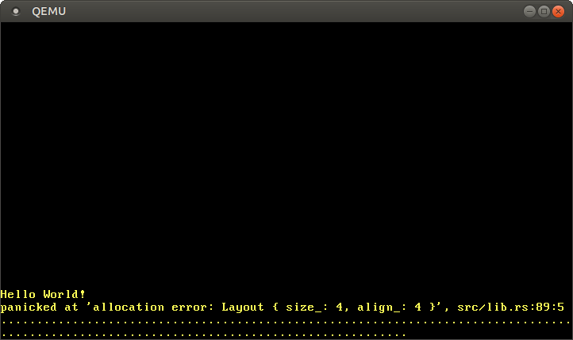

+++
title = "Asignación en el Heap"
weight = 10
path = "heap-allocation"
date = 2019-06-26

[extra]
chapter = "Gestión de Memoria"
+++

Este post añade soporte para la asignación en el heap a nuestro núcleo. Primero, proporciona una introducción a la memoria dinámica y muestra cómo el borrow checker (verificador de préstamos) previene errores comunes de asignación. Luego, implementa la interfaz básica de asignación de Rust, crea una región de memoria en el heap y configura una crate de asignador. Al final de este post, todos los tipos de asignación y recolección de la crate `alloc` integrada estarán disponibles para nuestro núcleo.

<!-- more -->

Este blog se desarrolla abiertamente en [GitHub]. Si tienes algún problema o preguntas, por favor abre un issue allí. También puedes dejar comentarios [al final]. El código fuente completo de este post se puede encontrar en la rama [`post-10`][post branch].

[GitHub]: https://github.com/phil-opp/blog_os
[al final]: #comments
<!-- fix for zola anchor checker (target is in template): <a id="comments"> -->
[post branch]: https://github.com/phil-opp/blog_os/tree/post-10

<!-- toc -->

## Variables Locales y Estáticas

Actualmente usamos dos tipos de variables en nuestro núcleo: variables locales y variables `static`. Las variables locales se almacenan en el [call stack] y son válidas solo hasta que la función envolvente retorna. Las variables estáticas se almacenan en una ubicación de memoria fija y viven siempre durante toda la duración del programa.

### Variables Locales

Las variables locales se almacenan en el [call stack], que es una [estructura de datos tipo pila] que soporta operaciones de `push` y `pop`. En cada entrada de función, los parámetros, la dirección de retorno y las variables locales de la función llamada son empujadas por el compilador:

[call stack]: https://en.wikipedia.org/wiki/Call_stack
[estructura de datos tipo pila]: https://en.wikipedia.org/wiki/Stack_(abstract_data_type)


El ejemplo anterior muestra la pila de llamadas después de que la función `outer` llamó a la función `inner`. Vemos que la pila de llamadas contiene primero las variables locales de `outer`. En la llamada a `inner`, el parámetro `1` y la dirección de retorno para la función fueron empujados. Luego, se transfirió el control a `inner`, que empujó sus variables locales.

Después de que la función `inner` retorna, su parte de la pila de llamadas se desapila nuevamente y solo permanecen las variables locales de `outer`:


Vemos que las variables locales de `inner` solo viven hasta que la función retorna. El compilador de Rust refuerza estas duraciones y lanza un error cuando usamos un valor durante demasiado tiempo, por ejemplo, cuando intentamos devolver una referencia a una variable local:

```rust
fn inner(i: usize) -> &'static u32 {
    let z = [1, 2, 3];
    &z[i]
}
```

([ejecutar el ejemplo en el playground](https://play.rust-lang.org/?version=stable&mode=debug&edition=2018&gist=6186a0f3a54f468e1de8894996d12819))

Si bien devolver una referencia no tiene sentido en este ejemplo, hay casos en los que queremos que una variable viva más que la función. Ya hemos visto tal caso en nuestro núcleo cuando intentamos [cargar una tabla de descriptores de interrupción] y tuvimos que usar una variable `static` para extender la duración.

[cargar una tabla de descriptores de interrupción]: @/edition-2/posts/05-cpu-exceptions/index.md#loading-the-idt

### Variables Estáticas

Las variables estáticas se almacenan en una ubicación de memoria fija separada de la pila. Esta ubicación de memoria se asigna en tiempo de compilación por el enlazador y se codifica en el ejecutable. Las variables estáticas viven durante toda la ejecución del programa, por lo que tienen la duración `'static` y siempre pueden ser referenciadas desde variables locales:

![El mismo ejemplo de outer/inner, excepto que inner tiene un `static Z: [u32; 3] = [1,2,3];` y devuelve una referencia `&Z[i]`](call-stack-static.svg)

Cuando la función `inner` retorna en el ejemplo anterior, su parte de la pila de llamadas se destruye. Las variables estáticas viven en un rango de memoria separado que nunca se destruye, por lo que la referencia `&Z[1]` sigue siendo válida después del retorno.

Aparte de la duración `'static`, las variables estáticas también tienen la propiedad útil de que su ubicación es conocida en tiempo de compilación, de modo que no se necesita ninguna referencia para acceder a ellas. Utilizamos esa propiedad para nuestra macro `println`: Al usar un [static `Writer`] internamente, no se necesita una referencia `&mut Writer` para invocar la macro, lo que es muy útil en [manejadores de excepciones], donde no tenemos acceso a variables adicionales.

[static `Writer`]: @/edition-2/posts/03-vga-text-buffer/index.md#a-global-interface
[manejadores de excepciones]: @/edition-2/posts/05-cpu-exceptions/index.md#implementation

Sin embargo, esta propiedad de las variables estáticas trae un inconveniente crucial: son de solo lectura por defecto. Rust refuerza esto porque ocurriría una [condición de carrera] si, por ejemplo, dos hilos modificaran una variable estática al mismo tiempo. La única forma de modificar una variable estática es encapsularla en un tipo [`Mutex`], que asegura que solo exista una sola referencia `&mut` en cualquier momento. Ya utilizamos un `Mutex` para nuestro [buffer `Writer` estático VGA][vga mutex].

[condición de carrera]: https://doc.rust-lang.org/nomicon/races.html
[`Mutex`]: https://docs.rs/spin/0.5.2/spin/struct.Mutex.html
[vga mutex]: @/edition-2/posts/03-vga-text-buffer/index.md#spinlocks

## Memoria Dinámica

Las variables locales y estáticas ya son muy poderosas juntas y habilitan la mayoría de los casos de uso. Sin embargo, vimos que ambas tienen sus limitaciones:

- Las variables locales solo viven hasta el final de la función o bloque envolvente. Esto se debe a que viven en la pila de llamadas y se destruyen después de que la función envolvente retorna.
- Las variables estáticas siempre viven durante toda la ejecución del programa, por lo que no hay forma de recuperar y reutilizar su memoria cuando ya no se necesitan. Además, tienen semánticas de propiedad poco claras y son accesibles desde todas las funciones, por lo que necesitan ser protegidas por un [`Mutex`] cuando queremos modificarlas.

Otra limitación de las variables locales y estáticas es que tienen un tamaño fijo. Por lo que no pueden almacenar una colección que crezca dinámicamente a medida que se añaden más elementos. (Hay propuestas para [valores rvalue sin tamaño] en Rust que permitirían variables locales con tamaño dinámico, pero solo funcionan en algunos casos específicos.)

[valores rvalue sin tamaño]: https://github.com/rust-lang/rust/issues/48055

Para eludir estas desventajas, los lenguajes de programación suelen soportar una tercera región de memoria para almacenar variables llamada **heap**. El heap soporta _asignación de memoria dinámica_ en tiempo de ejecución a través de dos funciones llamadas `allocate` y `deallocate`. Funciona de la siguiente manera: La función `allocate` devuelve un fragmento de memoria libre del tamaño especificado que se puede usar para almacenar una variable. Esta variable vive hasta que se libera llamando a la función `deallocate` con una referencia a la variable.

Pasemos por un ejemplo:

![La función inner llama `allocate(size_of([u32; 3]))`, escribe `z.write([1,2,3]);` y devuelve `(z as *mut u32).offset(i)`. En el valor devuelto `y`, la función outer realiza `deallocate(y, size_of(u32))`.](call-stack-heap.svg)

Aquí la función `inner` utiliza memoria del heap en lugar de variables estáticas para almacenar `z`. Primero asigna un bloque de memoria del tamaño requerido, que devuelve un `*mut u32` [puntero bruto]. Luego usa el método [`ptr::write`] para escribir el arreglo `[1,2,3]` en él. En el último paso, utiliza la función [`offset`] para calcular un puntero al elemento `i`-ésimo y luego lo devuelve. (Nota que omitimos algunos casts requeridos y bloques unsafe en esta función de ejemplo por brevedad.)

[puntero bruto]: https://doc.rust-lang.org/book/ch19-01-unsafe-rust.html#dereferencing-a-raw-pointer
[`ptr::write`]: https://doc.rust-lang.org/core/ptr/fn.write.html
[`offset`]: https://doc.rust-lang.org/std/primitive.pointer.html#method.offset

La memoria asignada vive hasta que se libera explícitamente mediante una llamada a `deallocate`. Por lo tanto, el puntero devuelto sigue siendo válido incluso después de que `inner` haya retornado y su parte de la pila de llamadas se haya destruido. La ventaja de usar memoria del heap en comparación con memoria estática es que la memoria se puede reutilizar después de que se libera, lo que hacemos a través de la llamada `deallocate` en `outer`. Después de esa llamada, la situación se ve así:

![La pila de llamadas contiene las variables locales de `outer`, el heap contiene `z[0]` y `z[2]`, pero ya no `z[1]`.](call-stack-heap-freed.svg)

Vemos que el espacio de `z[1]` está libre nuevamente y puede ser reutilizado para la siguiente llamada a `allocate`. Sin embargo, también vemos que `z[0]` y `z[2]` nunca se liberan porque nunca los desapilamos. Tal error se llama _fuga de memoria_ y es a menudo la causa del consumo excesivo de memoria de los programas (solo imagina lo que sucede cuando llamamos a `inner` repetidamente en un bucle). Esto puede parecer malo, pero hay tipos de errores mucho más peligrosos que pueden ocurrir con la asignación dinámica.

### Errores Comunes

Apartando las fugas de memoria, que son desafortunadas pero no hacen que el programa sea vulnerable a atacantes, hay dos tipos comunes de errores con consecuencias más severas:

- Cuando accidentalmente continuamos usando una variable después de llamar a `deallocate` sobre ella, tenemos una vulnerabilidad de **uso después de liberar**. Tal error causa comportamiento indefinido y a menudo puede ser explotado por atacantes para ejecutar código arbitrario.
- Cuando accidentalmente liberamos una variable dos veces, tenemos una vulnerabilidad de **double-free**. Esto es problemático porque podría liberar una asignación diferente que se había asignado en el mismo lugar después de la primera llamada a `deallocate`. Así, puede llevar nuevamente a una vulnerabilidad de uso después de liberar.

Estos tipos de vulnerabilidades son bien conocidos, por lo que uno podría esperar que las personas hayan aprendido a evitarlas hasta ahora. Pero no, tales vulnerabilidades todavía se encuentran regularmente, por ejemplo, esta [vulnerabilidad de uso después de liberar en Linux][linux vulnerability] (2019), que permitió la ejecución de código arbitrario. Una búsqueda en la web como `use-after-free linux {año actual}` probablemente siempre arrojará resultados. Esto muestra que incluso los mejores programadores no siempre son capaces de manejar correctamente la memoria dinámica en proyectos complejos.

[vulnerabilidad de linux]: https://securityboulevard.com/2019/02/linux-use-after-free-vulnerability-found-in-linux-2-6-through-4-20-11/

Para evitar estos problemas, muchos lenguajes, como Java o Python, gestionan la memoria dinámica automáticamente utilizando una técnica llamada [_recolección de basura_]. La idea es que el programador nunca invoca `deallocate` manualmente. En cambio, el programa se pausa regularmente y se escanea en busca de variables de heap no utilizadas, que luego se liberan automáticamente. Por lo tanto, las vulnerabilidades mencionadas no pueden ocurrir. Los inconvenientes son el costo de rendimiento de la verificación regular y las largas pausas que probablemente ocurran.

[_recolección de basura_]: https://en.wikipedia.org/wiki/Garbage_collection_(computer_science)

Rust adopta un enfoque diferente al problema: utiliza un concepto llamado [_propiedad_] que puede verificar la corrección de las operaciones de memoria dinámica en tiempo de compilación. Por lo tanto, no se necesita recolección de basura para evitar las vulnerabilidades mencionadas, lo que significa que no hay costos de rendimiento. Otra ventaja de este enfoque es que el programador aún tiene un control fino sobre el uso de la memoria dinámica, al igual que con C o C++.

[_propiedad_]: https://doc.rust-lang.org/book/ch04-01-what-is-ownership.html

### Asignaciones en Rust

En lugar de permitir que el programador llame manualmente a `allocate` y `deallocate`, la biblioteca estándar de Rust proporciona tipos de abstracción que llaman a estas funciones implícitamente. El tipo más importante es [**`Box`**], que es una abstracción para un valor asignado en el heap. Proporciona una función constructora [`Box::new`] que toma un valor, llama a `allocate` con el tamaño del valor y luego mueve el valor al espacio recién asignado en el heap. Para liberar la memoria del heap nuevamente, el tipo `Box` implementa el [`Drop` trait] para llamar a `deallocate` cuando sale del alcance:

[**`Box`**]: https://doc.rust-lang.org/std/boxed/index.html
[`Box::new`]: https://doc.rust-lang.org/alloc/boxed/struct.Box.html#method.new
[`Drop` trait]: https://doc.rust-lang.org/book/ch15-03-drop.html

```rust
{
    let z = Box::new([1,2,3]);
    […]
} // z sale del alcance y se llama a `deallocate`
```

Este patrón tiene el extraño nombre [_la adquisición de recursos es inicialización_] (o _RAII_ para abreviar). Se originó en C++, donde se utiliza para implementar un tipo de abstracción similar llamado [`std::unique_ptr`].

[_la adquisición de recursos es inicialización_]: https://en.wikipedia.org/wiki/Resource_acquisition_is_initialization
[`std::unique_ptr`]: https://en.cppreference.com/w/cpp/memory/unique_ptr

Tal tipo por sí solo no es suficiente para prevenir todos los errores de uso después de liberar, ya que los programadores aún pueden mantener referencias después de que el `Box` sale del alcance y la correspondencia de memoria del heap se libera:

```rust
let x = {
    let z = Box::new([1,2,3]);
    &z[1]
}; // z sale del alcance y se llama a `deallocate`
println!("{}", x);
```

Aquí es donde entra la propiedad de Rust. Asigna una [duración] abstracta a cada referencia, que es el ámbito en el que la referencia es válida. En el ejemplo anterior, la referencia `x` se toma del arreglo `z`, por lo que se vuelve inválida después de que `z` sale del alcance. Cuando [ejecutas el ejemplo anterior en el playground][playground-2], verás que el compilador de Rust efectivamente lanza un error:

[duración]: https://doc.rust-lang.org/book/ch10-03-lifetime-syntax.html
[playground-2]: https://play.rust-lang.org/?version=stable&mode=debug&edition=2018&gist=28180d8de7b62c6b4a681a7b1f745a48

```
error[E0597]: `z[_]` no vive lo suficiente
 --> src/main.rs:4:9
  |
2 |     let x = {
  |         - préstamo almacenado más tarde aquí
3 |         let z = Box::new([1,2,3]);
4 |         &z[1]
  |         ^^^^^ valor prestado no vive lo suficiente
5 |     }; // z sale del alcance y se llama a `deallocate`
  |     - `z[_]` se destruye aquí mientras aún está prestado
```

La terminología puede ser un poco confusa al principio. Tomar una referencia a un valor se llama _préstamo_ del valor, ya que es similar a un préstamo en la vida real: tienes acceso temporal a un objeto pero debes devolverlo en algún momento, y no debes destruirlo. Al verificar que todos los préstamos terminan antes de que se destruya un objeto, el compilador de Rust puede garantizar que no pueda ocurrir una situación de uso después de liberar.

El sistema de propiedad de Rust va aún más lejos, previniendo no solo errores de uso después de liberar, sino también proporcionando [_seguridad de memoria_], como lenguajes recolectores de basura como Java o Python. Además, garantiza [_seguridad de hilo_] y es, por lo tanto, incluso más seguro que esos lenguajes en código multihilo. Y lo más importante, todas estas verificaciones ocurren en tiempo de compilación, por lo que no hay sobrecarga en tiempo de ejecución en comparación con la gestión de memoria escrita a mano en C.

[_seguridad de memoria_]: https://en.wikipedia.org/wiki/Memory_safety
[_seguridad de hilo_]: https://en.wikipedia.org/wiki/Thread_safety

### Casos de Uso

Ahora conocemos los básicos de la asignación de memoria dinámica en Rust, pero ¿cuándo deberíamos usarla? Hemos llegado muy lejos con nuestro núcleo sin asignación de memoria dinámica, así que ¿por qué la necesitamos ahora?

Primero, la asignación de memoria dinámica siempre conlleva un poco de sobrecarga de rendimiento, ya que necesitamos encontrar un espacio libre en el heap para cada asignación. Por esta razón, las variables locales son generalmente preferibles, especialmente en código de núcleo sensible al rendimiento. Sin embargo, hay casos en los que la asignación de memoria dinámica es la mejor opción.

Como regla básica, se requiere memoria dinámica para variables que tienen una duración dinámica o un tamaño variable. El tipo más importante con una duración dinámica es [**`Rc`**], que cuenta las referencias a su valor envuelto y lo libera después de que todas las referencias han salido del alcance. Ejemplos de tipos con un tamaño variable son [**`Vec`**], [**`String`**] y otros [tipos de colección] que crecen dinámicamente cuando se añaden más elementos. Estos tipos funcionan al asignar una mayor cantidad de memoria cuando se llenan, copiando todos los elementos y luego liberando la antigua asignación.

[**`Rc`**]: https://doc.rust-lang.org/alloc/rc/index.html
[**`Vec`**]: https://doc.rust-lang.org/alloc/vec/index.html
[**`String`**]: https://doc.rust-lang.org/alloc/string/index.html
[tipos de colección]: https://doc.rust-lang.org/alloc/collections/index.html

Para nuestro núcleo, necesitaríamos principalmente los tipos de colección, por ejemplo, para almacenar una lista de tareas activas al implementar la multitarea en futuros posts.

## La Interfaz del Asignador

El primer paso en implementar un asignador de heap es agregar una dependencia en la crate integrada [`alloc`]. Al igual que la crate [`core`], es un subconjunto de la biblioteca estándar que además contiene los tipos de asignación y colección. Para agregar la dependencia en `alloc`, añadimos lo siguiente a nuestro `lib.rs`:

[`alloc`]: https://doc.rust-lang.org/alloc/
[`core`]: https://doc.rust-lang.org/core/

```rust
// en src/lib.rs

extern crate alloc;
```

A diferencia de las dependencias normales, no necesitamos modificar el `Cargo.toml`. La razón es que la crate `alloc` se envía con el compilador de Rust como parte de la biblioteca estándar, por lo que el compilador ya conoce la crate. Al agregar esta declaración `extern crate`, especificamos que el compilador debería intentar incluirla. (Históricamente, todas las dependencias necesitaban una declaración `extern crate`, que ahora es opcional).

Dado que estamos compilando para un objetivo personalizado, no podemos usar la versión precompilada de `alloc` que se envía con la instalación de Rust. En su lugar, debemos decirle a cargo que recompilar la crate desde la fuente. Podemos hacerlo añadiendo esta a la matriz `unstable.build-std` en nuestro archivo `.cargo/config.toml`:

```toml
# en .cargo/config.toml

[unstable]
build-std = ["core", "compiler_builtins", "alloc"]
```

Ahora el compilador recompilará e incluirá la crate `alloc` en nuestro núcleo.

La razón por la que la crate `alloc` está deshabilitada por defecto en crates `#[no_std]` es que tiene requisitos adicionales. Cuando intentamos compilar nuestro proyecto ahora, veremos estos requisitos como errores:

```
error: no se encontró ningún asignador de memoria global, pero se requiere uno; vincular a std o agregar #[global_allocator] a un elemento estático que implemente el trait GlobalAlloc.
```

El error ocurre porque la crate `alloc` requiere un asignador de heap, que es un objeto que proporciona las funciones `allocate` y `deallocate`. En Rust, los asignadores de heap se describen mediante el trait [`GlobalAlloc`], que se menciona en el mensaje de error. Para establecer el asignador de heap para la crate, el atributo `#[global_allocator]` debe aplicarse a una variable `static` que implemente el trait `GlobalAlloc`.

[`GlobalAlloc`]: https://doc.rust-lang.org/alloc/alloc/trait.GlobalAlloc.html

### El Trait `GlobalAlloc`

El trait [`GlobalAlloc`] define las funciones que debe proporcionar un asignador de heap. El trait es especial porque casi nunca se usa directamente por el programador. En su lugar, el compilador insertará automáticamente las llamadas apropiadas a los métodos del trait al utilizar los tipos de asignación y colección de `alloc`.

Dado que necesitaremos implementar el trait para todos nuestros tipos de asignadores, vale la pena echar un vistazo más de cerca a su declaración:

```rust
pub unsafe trait GlobalAlloc {
    unsafe fn alloc(&self, layout: Layout) -> *mut u8;
    unsafe fn dealloc(&self, ptr: *mut u8, layout: Layout);

    unsafe fn alloc_zeroed(&self, layout: Layout) -> *mut u8 { ... }
    unsafe fn realloc(
        &self,
        ptr: *mut u8,
        layout: Layout,
        new_size: usize
    ) -> *mut u8 { ... }
}
```

Define los dos métodos requeridos [`alloc`] y [`dealloc`], que corresponden a las funciones `allocate` y `deallocate` que usamos en nuestros ejemplos:
- El método [`alloc`] toma una instancia de [`Layout`] como argumento, que describe el tamaño y alineación deseados que debe tener el bloque de memoria asignada. Devuelve un [puntero bruto] al primer byte del bloque de memoria asignada. En lugar de un valor de error explícito, el método `alloc` devuelve un puntero nulo para señalar un error de asignación. Esto es un poco no idiomático, pero tiene la ventaja de que es fácil envolver asignadores de sistema existentes ya que utilizan la misma convención.
- El método [`dealloc`] es el contraparte y es responsable de liberar un bloque de memoria nuevamente. Recibe dos argumentos: el puntero devuelto por `alloc` y el `Layout` que se usó para la asignación.

[`alloc`]: https://doc.rust-lang.org/alloc/alloc/trait.GlobalAlloc.html#tymethod.alloc
[`dealloc`]: https://doc.rust-lang.org/alloc/alloc/trait.GlobalAlloc.html#tymethod.dealloc
[`Layout`]: https://doc.rust-lang.org/alloc/alloc/struct.Layout.html

El trait además define los dos métodos [`alloc_zeroed`] y [`realloc`] con implementaciones predeterminadas:

- El método [`alloc_zeroed`] es equivalente a llamar a `alloc` y luego establecer el bloque de memoria asignado a cero, lo cual es exactamente lo que hace la implementación predeterminada proporcionada. Una implementación de asignador puede reemplazar las implementaciones predeterminadas con una implementación personalizada más eficiente si es posible.
- El método [`realloc`] permite aumentar o disminuir una asignación. La implementación predeterminada asigna un nuevo bloque de memoria con el tamaño deseado y copia todo el contenido de la asignación anterior. Nuevamente, una implementación de asignador podría proporcionar probablemente una implementación más eficiente de este método, por ejemplo, aumentando/disminuyendo la asignación en su lugar si es posible.

[`alloc_zeroed`]: https://doc.rust-lang.org/alloc/alloc/trait.GlobalAlloc.html#method.alloc_zeroed
[`realloc`]: https://doc.rust-lang.org/alloc/alloc/trait.GlobalAlloc.html#method.realloc

#### Inseguridad

Una cosa a notar es que tanto el trait en sí como todos los métodos del trait se declaran como `unsafe`:

- La razón para declarar el trait como `unsafe` es que el programador debe garantizar que la implementación del trait para un tipo de asignador sea correcta. Por ejemplo, el método `alloc` nunca debe devolver un bloque de memoria que ya está siendo usado en otro lugar porque esto causaría comportamiento indefinido.
- De manera similar, la razón por la que los métodos son `unsafe` es que el llamador debe asegurar diversas invariantes al llamar a los métodos, por ejemplo, que el `Layout` pasado a `alloc` especifica un tamaño no nulo. Esto no es realmente relevante en la práctica ya que los métodos son normalmente llamados directamente por el compilador, que asegura que se cumplan los requisitos.

### Un `DummyAllocator`

Ahora que sabemos qué debe proporcionar un tipo de asignador, podemos crear un simple asignador nulo. Para eso, creamos un nuevo módulo `allocator`:

```rust
// en src/lib.rs

pub mod allocator;
```

Nuestro asignador nulo hace lo mínimo absoluto para implementar el trait y siempre devuelve un error cuando se llama a `alloc`. Se ve así:

```rust
// en src/allocator.rs

use alloc::alloc::{GlobalAlloc, Layout};
use core::ptr::null_mut;

pub struct Dummy;

unsafe impl GlobalAlloc for Dummy {
    unsafe fn alloc(&self, _layout: Layout) -> *mut u8 {
        null_mut()
    }

    unsafe fn dealloc(&self, _ptr: *mut u8, _layout: Layout) {
        panic!("dealloc no debería ser llamado nunca")
    }
}
```

La estructura no necesita ningún campo, así que la creamos como un [tipo de tamaño cero]. Como se mencionó anteriormente, siempre devolvemos el puntero nulo de `alloc`, que corresponde a un error de asignación. Dado que el asignador nunca devuelve memoria, una llamada a `dealloc` nunca debe ocurrir. Por esta razón, simplemente hacemos panic en el método `dealloc`. Los métodos `alloc_zeroed` y `realloc` tienen implementaciones predeterminadas, por lo que no necesitamos proporcionar implementaciones para ellos.

[tipo de tamaño cero]: https://doc.rust-lang.org/nomicon/exotic-sizes.html#zero-sized-types-zsts

Ahora tenemos un asignador simple, pero aún tenemos que decirle al compilador de Rust que debe usar este asignador. Aquí es donde entra el atributo `#[global_allocator]`.

### El Atributo `#[global_allocator]`

El atributo `#[global_allocator]` le dice al compilador de Rust qué instancia de asignador debe usar como el asignador global de heap. El atributo solo es aplicable a un `static` que implemente el trait `GlobalAlloc`. Registremos una instancia de nuestro asignador `Dummy` como el asignador global:

```rust
// en src/allocator.rs

#[global_allocator]
static ALLOCATOR: Dummy = Dummy;
```

Dado que el asignador `Dummy` es un [tipo de tamaño cero], no necesitamos especificar ningún campo en la expresión de inicialización.

Con este static, los errores de compilación deberían estar arreglados. Ahora podemos usar los tipos de asignación y colección de `alloc`. Por ejemplo, podemos usar un [`Box`] para asignar un valor en el heap:

[`Box`]: https://doc.rust-lang.org/alloc/boxed/struct.Box.html

```rust
// en src/main.rs

extern crate alloc;

use alloc::boxed::Box;

fn kernel_main(boot_info: &'static BootInfo) -> ! {
    // […] imprimir "¡Hola Mundo!", llamar a `init`, crear `mapper` y `frame_allocator`

    let x = Box::new(41);

    // […] llamar a `test_main` en modo de prueba

    println!("¡No se cayó!");
    blog_os::hlt_loop();
}
```

Nota que necesitamos especificar la declaración `extern crate alloc` en nuestro `main.rs` también. Esto es requerido porque las partes de `lib.rs` y `main.rs` se tratan como crates separadas. Sin embargo, no necesitamos crear otro static `#[global_allocator]` ya que el asignador global se aplica a todas las crates en el proyecto. De hecho, especificar un asignador adicional en otra crate sería un error.

Cuando ejecutamos el código anterior, vemos que ocurre un panic:



El panic ocurre porque la función `Box::new` llama implícitamente a la función `alloc` del asignador global. Nuestro asignador nulo siempre devuelve un puntero nulo, así que cada asignación falla. Para arreglar esto, necesitamos crear un asignador que realmente devuelva memoria utilizable.

## Creando un Heap para el Núcleo

Antes de que podamos crear un asignador adecuado, primero necesitamos crear una región de memoria heap de la que el asignador pueda asignar memoria. Para hacer esto, necesitamos definir un rango de memoria virtual para la región del heap y luego mapear esta región a un marco físico. Ve la publicación [_"Introducción a la Paginación"_] para una visión general de la memoria virtual y las tablas de páginas.

[_"Introducción a la Paginación"_]: @/edition-2/posts/08-paging-introduction/index.md

El primer paso es definir una región de memoria virtual para el heap. Podemos elegir cualquier rango de dirección virtual que nos guste, siempre que no esté ya utilizado para otra región de memoria. Definámoslo como la memoria que comienza en la dirección `0x_4444_4444_0000` para que podamos reconocer fácilmente un puntero de heap más tarde:

```rust
// en src/allocator.rs

pub const HEAP_START: usize = 0x_4444_4444_0000;
pub const HEAP_SIZE: usize = 100 * 1024; // 100 KiB
```

Establecemos el tamaño del heap en 100&nbsp;KiB por ahora. Si necesitamos más espacio en el futuro, simplemente podemos aumentarlo.

Si tratamos de usar esta región del heap ahora, ocurrirá un fallo de página ya que la región de memoria virtual no está mapeada a la memoria física todavía. Para resolver esto, creamos una función `init_heap` que mapea las páginas del heap usando la [API de Mapper] que introdujimos en la publicación [_"Implementación de Paginación"_]:

[API de Mapper]: @/edition-2/posts/09-paging-implementation/index.md#using-offsetpagetable
[_"Implementación de Paginación"_]: @/edition-2/posts/09-paging-implementation/index.md

```rust
// en src/allocator.rs

use x86_64::{
    structures::paging::{
        mapper::MapToError, FrameAllocator, Mapper, Page, PageTableFlags, Size4KiB,
    },
    VirtAddr,
};

pub fn init_heap(
    mapper: &mut impl Mapper<Size4KiB>,
    frame_allocator: &mut impl FrameAllocator<Size4KiB>,
) -> Result<(), MapToError<Size4KiB>> {
    let page_range = {
        let heap_start = VirtAddr::new(HEAP_START as u64);
        let heap_end = heap_start + HEAP_SIZE - 1u64;
        let heap_start_page = Page::containing_address(heap_start);
        let heap_end_page = Page::containing_address(heap_end);
        Page::range_inclusive(heap_start_page, heap_end_page)
    };

    for page in page_range {
        let frame = frame_allocator
            .allocate_frame()
            .ok_or(MapToError::FrameAllocationFailed)?;
        let flags = PageTableFlags::PRESENT | PageTableFlags::WRITABLE;
        unsafe {
            mapper.map_to(page, frame, flags, frame_allocator)?.flush()
        };
    }

    Ok(())
}
```

La función toma referencias mutables a una instancia [`Mapper`] y a una instancia [`FrameAllocator`], ambas limitadas a páginas de 4&nbsp;KiB usando [`Size4KiB`] como parámetro genérico. El valor de retorno de la función es un [`Result`] con el tipo unidad `()` como variante de éxito y un [`MapToError`] como variante de error, que es el tipo de error devuelto por el método [`Mapper::map_to`]. Reutilizar el tipo de error tiene sentido aquí porque el método `map_to` es la principal fuente de errores en esta función.

[`Mapper`]:https://docs.rs/x86_64/0.14.2/x86_64/structures/paging/mapper/trait.Mapper.html
[`FrameAllocator`]: https://docs.rs/x86_64/0.14.2/x86_64/structures/paging/trait.FrameAllocator.html
[`Size4KiB`]: https://docs.rs/x86_64/0.14.2/x86_64/structures/paging/page/enum.Size4KiB.html
[`Result`]: https://doc.rust-lang.org/core/result/enum.Result.html
[`MapToError`]: https://docs.rs/x86_64/0.14.2/x86_64/structures/paging/mapper/enum.MapToError.html
[`Mapper::map_to`]: https://docs.rs/x86_64/0.14.2/x86_64/structures/paging/mapper/trait.Mapper.html#method.map_to

La implementación se puede dividir en dos partes:

- **Creando el rango de páginas:** Para crear un rango de las páginas que queremos mapear, convertimos el puntero `HEAP_START` a un tipo [`VirtAddr`]. Luego calculamos la dirección del final del heap a partir de ella sumando el `HEAP_SIZE`. Queremos un límite inclusivo (la dirección del último byte del heap), por lo que restamos 1. A continuación, convertimos las direcciones en tipos [`Page`] usando la función [`containing_address`]. Finalmente, creamos un rango de páginas a partir de las páginas inicial y final utilizando la función [`Page::range_inclusive`].

- **Mapeo de las páginas:** El segundo paso es mapear todas las páginas del rango de páginas que acabamos de crear. Para eso, iteramos sobre estas páginas usando un bucle `for`. Para cada página, hacemos lo siguiente:

    - Asignamos un marco físico al que la página debería ser mapeada usando el método [`FrameAllocator::allocate_frame`]. Este método devuelve [`None`] cuando no quedan más marcos. Nos ocupamos de ese caso al mapearlo a un error [`MapToError::FrameAllocationFailed`] a través del método [`Option::ok_or`] y luego aplicando el [operador de signo de interrogación] para retornar temprano en caso de error.

    - Establecemos el flag `PRESENT` requerido y el flag `WRITABLE` para la página. Con estos flags, tanto los accesos de lectura como de escritura están permitidos, lo que tiene sentido para la memoria del heap.

    - Usamos el método [`Mapper::map_to`] para crear el mapeo en la tabla de páginas activa. El método puede fallar, así que usamos el [operador de signo de interrogación] otra vez para avanzar el error al llamador. En caso de éxito, el método devuelve una instancia de [`MapperFlush`] que podemos usar para actualizar el [_buffer de traducción de direcciones_] utilizando el método [`flush`].

[`VirtAddr`]: https://docs.rs/x86_64/0.14.2/x86_64/addr/struct.VirtAddr.html
[`Page`]: https://docs.rs/x86_64/0.14.2/x86_64/structures/paging/page/struct.Page.html
[`containing_address`]: https://docs.rs/x86_64/0.14.2/x86_64/structures/paging/page/struct.Page.html#method.containing_address
[`Page::range_inclusive`]: https://docs.rs/x86_64/0.14.2/x86_64/structures/paging/page/struct.Page.html#method.range_inclusive
[`FrameAllocator::allocate_frame`]: https://docs.rs/x86_64/0.14.2/x86_64/structures/paging/trait.FrameAllocator.html#tymethod.allocate_frame
[`None`]: https://doc.rust-lang.org/core/option/enum.Option.html#variant.None
[`MapToError::FrameAllocationFailed`]: https://docs.rs/x86_64/0.14.2/x86_64/structures/paging/mapper/enum.MapToError.html#variant.FrameAllocationFailed
[`Option::ok_or`]: https://doc.rust-lang.org/core/option/enum.Option.html#method.ok_or
[operador de signo de interrogación]: https://doc.rust-lang.org/edition-guide/rust-2018/error-handling-and-panics/the-question-mark-operator-for-easier-error-handling.html
[`MapperFlush`]: https://docs.rs/x86_64/0.14.2/x86_64/structures/paging/mapper/struct.MapperFlush.html
[_buffer de traducción de direcciones_]: @/edition-2/posts/08-paging-introduction/index.md#the-translation-lookaside-buffer
[`flush`]: https://docs.rs/x86_64/0.14.2/x86_64/structures/paging/mapper/struct.MapperFlush.html#method.flush

El último paso es llamar a esta función desde nuestro `kernel_main`:

```rust
// en src/main.rs

fn kernel_main(boot_info: &'static BootInfo) -> ! {
    use blog_os::allocator; // nueva importación
    use blog_os::memory::{self, BootInfoFrameAllocator};

    println!("¡Hola Mundo{}!", "");
    blog_os::init();

    let phys_mem_offset = VirtAddr::new(boot_info.physical_memory_offset);
    let mut mapper = unsafe { memory::init(phys_mem_offset) };
    let mut frame_allocator = unsafe {
        BootInfoFrameAllocator::init(&boot_info.memory_map)
    };

    // nueva
    allocator::init_heap(&mut mapper, &mut frame_allocator)
        .expect("falló la inicialización del heap");

    let x = Box::new(41);

    // […] llamar a `test_main` en contexto de prueba

    println!("¡No se cayó!");
    blog_os::hlt_loop();
}
```

Mostramos la función completa aquí para contexto. Las únicas nuevas líneas son la importación de `blog_os::allocator` y la llamada a la función `allocator::init_heap`. En caso de que la función `init_heap` devuelva un error, hacemos panic usando el método [`Result::expect`] ya que actualmente no hay una forma sensata para nosotros de manejar este error.

[`Result::expect`]: https://doc.rust-lang.org/core/result/enum.Result.html#method.expect

Ahora tenemos una región de memoria heap mapeada que está lista para ser utilizada. La llamada a `Box::new` aún utiliza nuestro antiguo asignador `Dummy`, así que todavía verás el error "sin memoria" cuando lo ejecutes. Arreglemos esto utilizando un asignador apropiado.

## Usando una Crate de Asignador

Dado que implementar un asignador es algo complicado, empezamos usando una crate de asignador externa. Aprenderemos cómo implementar nuestro propio asignador en el próximo post.

Una crate de asignador simple para aplicaciones `no_std` es la crate [`linked_list_allocator`]. Su nombre proviene del hecho de que utiliza una estructura de datos de lista enlazada para hacer un seguimiento de las regiones de memoria desasignadas. Ve la próxima publicación para una explicación más detallada de este enfoque.

[`linked_list_allocator`]: https://github.com/phil-opp/linked-list-allocator/

Para usar la crate, primero necesitamos agregar una dependencia en ella en nuestro `Cargo.toml`:

```toml
# en Cargo.toml

[dependencies]
linked_list_allocator = "0.9.0"
```

Luego podemos reemplazar nuestro asignador nulo con el asignador proporcionado por la crate:

```rust
// en src/allocator.rs

use linked_list_allocator::LockedHeap;

#[global_allocator]
static ALLOCATOR: LockedHeap = LockedHeap::empty();
```

La estructura se llama `LockedHeap` porque usa el tipo [`spinning_top::Spinlock`] para la sincronización. Esto es requerido porque múltiples hilos podrían acceder al static `ALLOCATOR` al mismo tiempo. Como siempre, al utilizar un spinlock o un mutex, debemos tener cuidado de no causar accidentalmente un deadlock. Esto significa que no debemos realizar ninguna asignación en manejadores de interrupciones, ya que pueden ejecutarse en cualquier momento y podrían interrumpir una asignación en progreso.

[`spinning_top::Spinlock`]: https://docs.rs/spinning_top/0.1.0/spinning_top/type.Spinlock.html

Configurar el `LockedHeap` como asignador global no es suficiente. La razón es que usamos la función constructora [`empty`], que crea un asignador sin ninguna memoria de respaldo. Al igual que nuestro asignador nulo, siempre devuelve un error en `alloc`. Para arreglar esto, necesitamos inicializar el asignador después de crear el heap:

[`empty`]: https://docs.rs/linked_list_allocator/0.9.0/linked_list_allocator/struct.LockedHeap.html#method.empty

```rust
// en src/allocator.rs

pub fn init_heap(
    mapper: &mut impl Mapper<Size4KiB>,
    frame_allocator: &mut impl FrameAllocator<Size4KiB>,
) -> Result<(), MapToError<Size4KiB>> {
    // […] mapear todas las páginas del heap a marcos físicos

    // nueva
    unsafe {
        ALLOCATOR.lock().init(HEAP_START, HEAP_SIZE);
    }

    Ok(())
}
```

Usamos el método [`lock`] sobre el spinlock interno del tipo `LockedHeap` para obtener una referencia exclusiva a la instancia [`Heap`] envuelta, sobre la cual luego llamamos al método [`init`] con los límites del heap como argumentos. Como la función [`init`] ya intenta escribir en la memoria del heap, debemos inicializar el heap solo _después_ de mapear las páginas del heap.

[`lock`]: https://docs.rs/lock_api/0.3.3/lock_api/struct.Mutex.html#method.lock
[`Heap`]: https://docs.rs/linked_list_allocator/0.9.0/linked_list_allocator/struct.Heap.html
[`init`]: https://docs.rs/linked_list_allocator/0.9.0/linked_list_allocator/struct.Heap.html#method.init

Después de inicializar el heap, ahora podemos usar todos los tipos de asignación y colección de la crate integrada [`alloc`] sin error:

```rust
// en src/main.rs

use alloc::{boxed::Box, vec, vec::Vec, rc::Rc};

fn kernel_main(boot_info: &'static BootInfo) -> ! {
    // […] inicializar interrupciones, mapper, frame_allocator, heap

    // asignar un número en el heap
    let heap_value = Box::new(41);
    println!("valor del heap en {:p}", heap_value);

    // crear un vector de tamaño dinámico
    let mut vec = Vec::new();
    for i in 0..500 {
        vec.push(i);
    }
    println!("vector en {:p}", vec.as_slice());

    // crear un vector contado por referencias -> será liberado cuando el conteo llegue a 0
    let reference_counted = Rc::new(vec![1, 2, 3]);
    let cloned_reference = reference_counted.clone();
    println!("el conteo de referencia actual es {}", Rc::strong_count(&cloned_reference));
    core::mem::drop(reference_counted);
    println!("el conteo de referencia ahora es {} ahora", Rc::strong_count(&cloned_reference));

    // […] llamar a `test_main` en contexto de prueba
    println!("¡No se cayó!");
    blog_os::hlt_loop();
}
```

Este ejemplo de código muestra algunos usos de los tipos [`Box`], [`Vec`] y [`Rc`]. Para los tipos `Box` y `Vec`, imprimimos los punteros del heap subyacente usando el especificador de formato [`{:p}`]. Para mostrar `Rc`, creamos un valor del heap contado por referencias y usamos la función [`Rc::strong_count`] para imprimir el conteo de referencias actual antes y después de soltar una de las instancias (usando [`core::mem::drop`]).

[`Vec`]: https://doc.rust-lang.org/alloc/vec/
[`Rc`]: https://doc.rust-lang.org/alloc/rc/
[`{:p}` especificador de formato]: https://doc.rust-lang.org/core/fmt/trait.Pointer.html
[`Rc::strong_count`]: https://doc.rust-lang.org/alloc/rc/struct.Rc.html#method.strong_count
[`core::mem::drop`]: https://doc.rust-lang.org/core/mem/fn.drop.html

Cuando lo ejecutamos, vemos lo siguiente:


Como se esperaba, vemos que los valores `Box` y `Vec` viven en el heap, como lo indica el puntero que comienza con el prefijo `0x_4444_4444_*`. El valor contado por referencias también se comporta como se esperaba, con el conteo de referencias siendo 2 después de la llamada a `clone`, y 1 nuevamente después de que se eliminó una de las instancias.

La razón por la que el vector comienza en el desplazamiento `0x800` no es que el valor `Box` sea `0x800` bytes grande, sino las [reasignaciones] que ocurren cuando el vector necesita aumentar su capacidad. Por ejemplo, cuando la capacidad del vector es 32 y tratamos de añadir el siguiente elemento, el vector asigna un nuevo arreglo de respaldo con una capacidad de 64 tras las escenas y copia todos los elementos. Luego libera la antigua asignación.

[reasignaciones]: https://doc.rust-lang.org/alloc/vec/struct.Vec.html#capacity-and-reallocation

Por supuesto, hay muchos más tipos de asignación y colección en la crate `alloc` que ahora podemos usar todos en nuestro núcleo, incluyendo:

- el puntero contado por referencias seguro para hilos [`Arc`]
- el tipo de cadena propia [`String`] y la macro [`format!`]
- [`LinkedList`]
- el búfer de anillo creciente [`VecDeque`]
- la cola de prioridad [`BinaryHeap`]
- [`BTreeMap`] y [`BTreeSet`]

[`Arc`]: https://doc.rust-lang.org/alloc/sync/struct.Arc.html
[`String`]: https://doc.rust-lang.org/alloc/string/struct.String.html
[`format!`]: https://doc.rust-lang.org/alloc/macro.format.html
[`LinkedList`]: https://doc.rust-lang.org/alloc/collections/linked_list/struct.LinkedList.html
[`VecDeque`]: https://doc.rust-lang.org/alloc/collections/vec_deque/struct.VecDeque.html
[`BinaryHeap`]: https://doc.rust-lang.org/alloc/collections/binary_heap/struct.BinaryHeap.html
[`BTreeMap`]: https://doc.rust-lang.org/alloc/collections/btree_map/struct.BTreeMap.html
[`BTreeSet`]: https://doc.rust-lang.org/alloc/collections/btree_set/struct.BTreeSet.html

Estos tipos serán muy útiles cuando queramos implementar listas de hilos, colas de programación o soporte para async/await.

## Añadiendo una Prueba

Para asegurarnos de que no rompemos accidentalmente nuestro nuevo código de asignación, deberíamos agregar una prueba de integración para ello. Comenzamos creando un nuevo archivo `tests/heap_allocation.rs` con el siguiente contenido:

```rust
// en tests/heap_allocation.rs

#![no_std]
#![no_main]
#![feature(custom_test_frameworks)]
#![test_runner(blog_os::test_runner)]
#![reexport_test_harness_main = "test_main"]

extern crate alloc;

use bootloader::{entry_point, BootInfo};
use core::panic::PanicInfo;

entry_point!(main);

fn main(boot_info: &'static BootInfo) -> ! {
    unimplemented!();
}

#[panic_handler]
fn panic(info: &PanicInfo) -> ! {
    blog_os::test_panic_handler(info)
}
```

Reutilizamos las funciones `test_runner` y `test_panic_handler` de nuestro `lib.rs`. Dado que queremos probar asignaciones, habilitamos la crate `alloc` a través de la declaración `extern crate alloc`. Para más información sobre el boilerplate de la prueba, consulta la publicación [_Pruebas_] .

[_Pruebas_]: @/edition-2/posts/04-testing/index.md

La implementación de la función `main` se ve así:

```rust
// en tests/heap_allocation.rs

fn main(boot_info: &'static BootInfo) -> ! {
    use blog_os::allocator;
    use blog_os::memory::{self, BootInfoFrameAllocator};
    use x86_64::VirtAddr;

    blog_os::init();
    let phys_mem_offset = VirtAddr::new(boot_info.physical_memory_offset);
    let mut mapper = unsafe { memory::init(phys_mem_offset) };
    let mut frame_allocator = unsafe {
        BootInfoFrameAllocator::init(&boot_info.memory_map)
    };
    allocator::init_heap(&mut mapper, &mut frame_allocator)
        .expect("falló la inicialización del heap");

    test_main();
    loop {}
}
```

Es muy similar a la función `kernel_main` en nuestro `main.rs`, con las diferencias de que no invocamos `println`, no incluimos ninguna asignación de ejemplo y llamamos a `test_main` incondicionalmente.

Ahora estamos listos para agregar algunos casos de prueba. Primero, agregamos una prueba que realiza algunas asignaciones simples usando [`Box`] y verifica los valores asignados para asegurar que las asignaciones básicas funcionan:

```rust
// en tests/heap_allocation.rs
use alloc::boxed::Box;

#[test_case]
fn simple_allocation() {
    let heap_value_1 = Box::new(41);
    let heap_value_2 = Box::new(13);
    assert_eq!(*heap_value_1, 41);
    assert_eq!(*heap_value_2, 13);
}
```

Lo más importante es que esta prueba verifica que no ocurre error de asignación.

A continuación, construimos iterativamente un gran vector, para probar tanto grandes asignaciones como múltiples asignaciones (debido a reasignaciones):

```rust
// en tests/heap_allocation.rs

use alloc::vec::Vec;

#[test_case]
fn large_vec() {
    let n = 1000;
    let mut vec = Vec::new();
    for i in 0..n {
        vec.push(i);
    }
    assert_eq!(vec.iter().sum::<u64>(), (n - 1) * n / 2);
}
```

Verificamos la suma comparándola con la fórmula para la [n-ésima suma parcial]. Esto nos da algo de confianza en que los valores asignados son todos correctos.

[n-ésima suma parcial]: https://en.wikipedia.org/wiki/1_%2B_2_%2B_3_%2B_4_%2B_%E2%8B%AF#Partial_sums

Como tercera prueba, creamos diez mil asignaciones una tras otra:

```rust
// en tests/heap_allocation.rs

use blog_os::allocator::HEAP_SIZE;

#[test_case]
fn many_boxes() {
    for i in 0..HEAP_SIZE {
        let x = Box::new(i);
        assert_eq!(*x, i);
    }
}
```

Esta prueba asegura que el asignador reutiliza la memoria liberada para asignaciones subsecuentes, ya que de lo contrario se quedaría sin memoria. Esto puede parecer un requisito obvio para un asignador, pero hay diseños de asignador que no hacen esto. Un ejemplo es el diseño del asignador bump que se explicará en el próximo post.

¡Vamos a ejecutar nuestra nueva prueba de integración!

```
> cargo test --test heap_allocation
[…]
Ejecutando 3 pruebas
simple_allocation... [ok]
large_vec... [ok]
many_boxes... [ok]
```

¡Las tres pruebas tuvieron éxito! También puedes invocar `cargo test` (sin el argumento `--test`) para ejecutar todas las pruebas unitarias e integradas.

## Resumen

Este post dio una introducción a la memoria dinámica y explicó por qué y dónde se necesita. Vimos cómo el borrow checker previene vulnerabilidades comunes y aprendimos cómo funciona la API de asignación de Rust.

Después de crear una implementación mínima de la interfaz de asignador de Rust usando un asignador nulo, creamos una región de memoria heap adecuada para nuestro núcleo. Para eso, definimos un rango de direcciones virtuales para el heap y luego mapeamos todas las páginas de ese rango a marcos físicos usando el `Mapper` y `FrameAllocator` de la publicación anterior.

Finalmente, agregamos una dependencia en la crate `linked_list_allocator` para añadir un asignador adecuado a nuestro núcleo. Con este asignador, pudimos utilizar `Box`, `Vec` y otros tipos de asignación y colección de la crate `alloc`.

## ¿Qué sigue?

Si bien ya hemos añadido soporte para la asignación en el heap en este post, dejamos la mayor parte del trabajo a la crate `linked_list_allocator`. El próximo post mostrará en detalle cómo se puede implementar un asignador desde cero. Presentará múltiples posibles diseños de asignadores, mostrará cómo implementar versiones simples de ellos y explicará sus ventajas y desventajas.