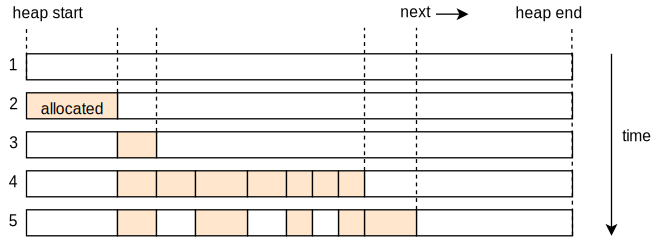
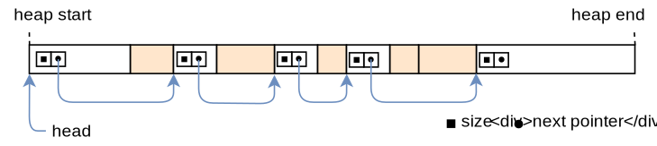
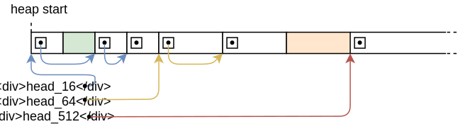

+++
title = "تصاميم المخصصات"
weight = 11
path = "ar/allocator-designs"
date = 2020-01-20

[extra]
# Please update this when updating the translation
translation_based_on_commit = "211f460251cd332905225c93eb66b1aff9f4aefd"
chapter = "إدارة الذاكرة"

# GitHub usernames of the people that translated this post
translators = ["mindfreq"]
rtl = true
+++

يشرح هذا المقال كيفية تنفيذ مخصصات heap من الصفر. يعرض ويناقش تصاميم مختلفة للمخصصات، بما في ذلك bump allocation و linked list allocation و fixed-size block allocation. لكل من التصاميم الثلاثة، سننشئ تنفيذًا أساسيًا يمكن استخدامه لنواتنا.

<!-- more -->

هذا المدونة مطوّرة بشكل مفتوح على [GitHub]. إذا كان لديك أي مشاكل أو أسئلة، يرجى فتح issue هناك. يمكنك أيضًا ترك تعليقات [في الأسفل]. يمكن العثور على الكود المصدري الكامل لهذا المقال في فرع [`post-11`][post branch].

[GitHub]: https://github.com/phil-opp/blog_os
[في الأسفل]: #comments
<!-- fix for zola anchor checker (target is in template): <a id="comments"> -->
[post branch]: https://github.com/phil-opp/blog_os/tree/post-11

<!-- toc -->

## المقدمة

في [المقال السابق][previous post]، أضفنا دعمًا أساسيًا لتخصيص heap لنواتنا. لتحقيق ذلك، [أنشأنا منطقة ذاكرة جديدة][map-heap] في page tables و[استخدمنا crate `linked_list_allocator`][use-alloc-crate] لإدارة تلك الذاكرة. بينما أصبح لدينا heap يعمل، تركنا معظم العمل لـ crate المخصص دون محاولة فهم كيفية عمله.

[previous post]: @/edition-2/posts/10-heap-allocation/index.md
[map-heap]: @/edition-2/posts/10-heap-allocation/index.md#creating-a-kernel-heap
[use-alloc-crate]: @/edition-2/posts/10-heap-allocation/index.md#using-an-allocator-crate

في هذا المقال، سنُظهر كيفية إنشاء مخصص heap الخاص بنا من الصفر بدلاً من الاعتماد على crate مخصص موجود. سنناقش تصاميم مختلفة للمخصصات، بما في ذلك _bump allocator_ بسيط و _fixed-size block allocator_ أساسي، وسنستخدم هذه المعرفة لتنفيذ مخصص بأداء محسّن (مقارنة بـ crate `linked_list_allocator`).

### أهداف التصميم

مسؤولية المخصص هي إدارة ذاكرة heap المتاحة. يحتاج إلى إرجاع ذاكرة غير مستخدمة عند استدعاءات `alloc` وتتبع الذاكرة المحرّرة بواسطة `dealloc` حتى يمكن إعادة استخدامها. والأهم من ذلك، يجب ألا يوزّع أبدًا ذاكرة مستخدمة بالفعل في مكان آخر لأن ذلك سيسبب سلوكًا غير معرّف.

بجانب الصحة، هناك العديد من أهداف التصميم الثانوية. على سبيل المثال، يجب على المخصص استخدام الذاكرة المتاحة بفعالية وإبقاء [_fragmentation_] منخفضًا. علاوة على ذلك، يجب أن يعمل جيدًا للتطبيقات المتزامنة ويتوسع لأي عدد من المعالجات. لأقصى أداء، يمكنه حتى تحسين تخطيط الذاكرة فيما يتعلق بـ CPU caches لتحسين [cache locality] وتجنب [false sharing].

[cache locality]: https://www.geeksforgeeks.org/locality-of-reference-and-cache-operation-in-cache-memory/
[_fragmentation_]: https://en.wikipedia.org/wiki/Fragmentation_(computing)
[false sharing]: https://mechanical-sympathy.blogspot.de/2011/07/false-sharing.html

يمكن لهذه المتطلبات أن تجعل المخصصات الجيدة معقدة للغاية. على سبيل المثال، يحتوي [jemalloc] على أكثر من 30,000 سطر من الكود. غالبًا ما يكون هذا التعقيد غير مرغوب فيه في كود kernel، حيث يمكن أن يؤدي خطأ واحد إلى ثغرات أمنية خطيرة. لحسن الحظ، أنماط التخصيص لكود kernel غالبًا ما تكون أبسط بكثير من كود userspace، بحيث تكفي تصاميم المخصصات البسيطة نسبيًا.

[jemalloc]: http://jemalloc.net/

فيما يلي، نقدم ثلاثة تصاميم ممكنة لمخصصات kernel ونشرح مزاياها وعيوبها.

## Bump Allocator

أبسط تصميم للمخصص هو _bump allocator_ (يُعرف أيضًا بـ _stack allocator_). يخصص الذاكرة خطيًا ويتتبع فقط عدد البايتات المخصصة وعدد التخصيصات. يكون مفيدًا فقط في حالات استخدام محددة جدًا لأنه يحتوي على قيد كبير: لا يمكنه freeing كل الذاكرة دفعة واحدة.

### الفكرة

الفكرة وراء bump allocator هي تخصيص الذاكرة خطيًا بزيادة (_"bumping"_) متغير `next`، الذي يشير إلى بداية الذاكرة غير المستخدمة. في البداية، يكون `next` مساويًا لعنوان بداية heap. في كل تخصيص، يتم زيادة `next` بحجم التخصيص بحيث يشير دائمًا إلى الحد الفاصل بين الذاكرة المستخدمة وغير المستخدمة:


يتحرك مؤشر `next` في اتجاه واحد فقط وبالتالي لا يوزّع نفس منطقة الذاكرة مرتين. عندما يصل إلى نهاية heap، لا يمكن تخصيص المزيد من الذاكرة، مما ينتج عنه خطأ نفاد الذاكرة في التخصيص التالي.

غالبًا ما يتم تنفيذ bump allocator مع عداد تخصيصات، يتم زيادته بمقدار 1 عند كل استدعاء `alloc` وإنقاصه بمقدار 1 عند كل استدعاء `dealloc`. عندما يصل عداد التخصيصات إلى الصفر، فهذا يعني أن جميع التخصيصات على heap قد تم تحريرها. في هذه الحالة، يمكن إعادة تعيين مؤشر `next` إلى عنوان بداية heap، بحيث تصبح ذاكرة heap بالكامل متاحة للتخصيصات مرة أخرى.

### التنفيذ

نبدأ تنفيذنا بإعلان submodule جديد `allocator::bump`:

```rust
// in src/allocator.rs

pub mod bump;
```

محتوى submodule يعيش في ملف جديد `src/allocator/bump.rs`، الذي ننشئه بالمحتوى التالي:

```rust
// in src/allocator/bump.rs

pub struct BumpAllocator {
    heap_start: usize,
    heap_end: usize,
    next: usize,
    allocations: usize,
}

impl BumpAllocator {
    /// Creates a new empty bump allocator.
    pub const fn new() -> Self {
        BumpAllocator {
            heap_start: 0,
            heap_end: 0,
            next: 0,
            allocations: 0,
        }
    }

    /// Initializes the bump allocator with the given heap bounds.
    ///
    /// This method is unsafe because the caller must ensure that the given
    /// memory range is unused. Also, this method must be called only once.
    pub unsafe fn init(&mut self, heap_start: usize, heap_size: usize) {
        self.heap_start = heap_start;
        self.heap_end = heap_start + heap_size;
        self.next = heap_start;
    }
}
```

الحقول `heap_start` و `heap_end` تتتبع الحدود الدنيا والعليا لمنطقة ذاكرة heap. يحتاج المتصل إلى التأكد من أن هذه العناوين صالحة، وإلا فسيرجع المخصص ذاكرة غير صالحة. لهذا السبب، الدالة `init` تحتاج إلى أن تكون `unsafe` للاستدعاء.

الغرض من الحقل `next` هو أن يشير دائمًا إلى أول بايت غير مستخدم من heap، أي عنوان بداية التخصيص التالي. يتم تعيينه إلى `heap_start` في دالة `init` لأنه في البداية، الكومة بالكامل غير مستخدمة. في كل تخصيص، سيتم زيادة هذا الحقل بحجم التخصيص (_"bumped"_) لضمان عدم إرجاع نفس منطقة الذاكرة مرتين.

الحقل `allocations` هو عداد بسيط للتخصيصات النشطة بهدف إعادة تعيين المخصص بعد تحرير آخر تخصيص. يتم تهيئته بـ 0.

اخترنا إنشاء دالة `init` منفصلة بدلاً من إجراء التهيئة مباشرة في `new` للحفاظ على الواجهة مطابقة للمخصص المقدم من crate `linked_list_allocator`. بهذه الطريقة، يمكن تبديل المخصصات دون تغييرات إضافية في الكود.

### تنفيذ `GlobalAlloc`

كما [شرحنا في المقال السابق][global-alloc]، جميع مخصصات heap تحتاج إلى تنفيذ trait [`GlobalAlloc`]، الذي يُعرّف هكذا:

[global-alloc]: @/edition-2/posts/10-heap-allocation/index.md#the-allocator-interface
[`GlobalAlloc`]: https://doc.rust-lang.org/alloc/alloc/trait.GlobalAlloc.html

```rust
pub unsafe trait GlobalAlloc {
    unsafe fn alloc(&self, layout: Layout) -> *mut u8;
    unsafe fn dealloc(&self, ptr: *mut u8, layout: Layout);

    unsafe fn alloc_zeroed(&self, layout: Layout) -> *mut u8 { ... }
    unsafe fn realloc(
        &self,
        ptr: *mut u8,
        layout: Layout,
        new_size: usize
    ) -> *mut u8 { ... }
}
```

فقط طريقتا `alloc` و `dealloc` مطلوبتان؛ الطريقتان الأخرى لهما تنفيذات افتراضية ويمكن إهمالهما.

#### محاولة التنفيذ الأولى

لنحاول تنفيذ طريقة `alloc` لـ `BumpAllocator` الخاص بنا:

```rust
// in src/allocator/bump.rs

use alloc::alloc::{GlobalAlloc, Layout};

unsafe impl GlobalAlloc for BumpAllocator {
    unsafe fn alloc(&self, layout: Layout) -> *mut u8 {
        // TODO alignment and bounds check
        let alloc_start = self.next;
        self.next = alloc_start + layout.size();
        self.allocations += 1;
        alloc_start as *mut u8
    }

    unsafe fn dealloc(&self, _ptr: *mut u8, _layout: Layout) {
        todo!();
    }
}
```

أولاً، نستخدم الحقل `next` كعنوان بداية لتخصيصنا. ثم نحدّث `next` ليشير إلى عنوان نهاية التخصيص، وهو أول عنوان غير مستخدم على heap. قبل إرجاع عنوان بداية التخصيص كمؤشر `*mut u8`، نزيد عداد `allocations` بمقدار 1.

لاحظ أننا لا نجرِي أي فحوصات حدود أو تعديلات محاذاة، لذا هذا التنفيذ ليس آمنًا بعد. هذا لا يهم كثيرًا لأنه يفشل في التجميع على أي حال مع الخطأ التالي:

```
error[E0594]: cannot assign to `self.next` which is behind a `&` reference
  --> src/allocator/bump.rs:29:9
   |
29 |         self.next = alloc_start + layout.size();
   |         ^^^^^^^^^^^^^^^^^^^^^^^^^^^^^^^^^^^^^^^ `self` is a `&` reference, so the data it refers to cannot be written
```

(يحدث نفس الخطأ أيضًا لسطر `self.allocations += 1`. حذفناه هنا للاختصار.)

يحدث الخطأ لأن طريقتي [`alloc`] و [`dealloc`] لـ trait `GlobalAlloc` تعملان فقط على مرجع غير قابل للتعديل `&self`، لذا تحديث الحقول `next` و `allocations` غير ممكن. هذا مشكلة لأن تحديث `next` في كل تخصيص هو المبدأ الأساسي لـ bump allocator.

[`alloc`]: https://doc.rust-lang.org/alloc/alloc/trait.GlobalAlloc.html#tymethod.alloc
[`dealloc`]: https://doc.rust-lang.org/alloc/alloc/trait.GlobalAlloc.html#tymethod.dealloc

#### `GlobalAlloc` والقابلية للتعديل

قبل أن ننظر إلى حل ممكن لمشكلة القابلية للتعديل هذه، دعنا نحاول فهم لماذا طرائق trait `GlobalAlloc` مُعرّفة بوسائط `&self`: كما رأينا [في المقال السابق][global-allocator]، يتم تعريف مخصص heap العالمي بإضافة السمة `#[global_allocator]` إلى `static` ينفذ trait `GlobalAlloc`. المتغيرات الثابتة غير قابلة للتعديل في Rust، لذا لا توجد طريقة لاستدعاء دالة تأخذ `&mut self` على المخصص الثابت. لهذا السبب، جميع طرائق `GlobalAlloc` تأخذ فقط مرجع `&self` غير قابل للتعديل.

[global-allocator]:  @/edition-2/posts/10-heap-allocation/index.md#the-global-allocator-attribute

لحسن الحظ، هناك طريقة للحصول على مرجع `&mut self` من مرجع `&self`: يمكننا استخدام [interior mutability] متزامن بلف المخصص في [`spin::Mutex`] spinlock. هذا النوع يوفر دالة `lock` تنفذ [mutual exclusion] وبالتالي تحول بأمان مرجع `&self` إلى مرجع `&mut self`. استخدمنا النوع wrapper عدة مرات في kernel الخاص بنا، على سبيل المثال لـ [VGA text buffer][vga-mutex].

[interior mutability]: https://doc.rust-lang.org/book/ch15-05-interior-mutability.html
[vga-mutex]: @/edition-2/posts/03-vga-text-buffer/index.md#spinlocks
[`spin::Mutex`]: https://docs.rs/spin/0.5.0/spin/struct.Mutex.html
[mutual exclusion]: https://en.wikipedia.org/wiki/Mutual_exclusion

#### نوع `Locked` Wrapper

بمساعدة النوع wrapper `spin::Mutex`، يمكننا تنفيذ trait `GlobalAlloc` لـ bump allocator الخاص بنا. الحيلة هي تنفيذ trait ليس لـ `BumpAllocator` مباشرة، بل للنوع الملفوف `spin::Mutex<BumpAllocator>`:

```rust
unsafe impl GlobalAlloc for spin::Mutex<BumpAllocator> {…}
```

للأسف، هذا لا يزال لا يعمل لأن مترجم Rust لا يسمح بتنفيذات trait لأنواع مُعرّفة في crates أخرى:

```
error[E0117]: only traits defined in the current crate can be implemented for arbitrary types
  --> src/allocator/bump.rs:28:1
   |
28 | unsafe impl GlobalAlloc for spin::Mutex<BumpAllocator> {
   | ^^^^^^^^^^^^^^^^^^^^^^^^^^^^--------------------------
   | |                           |
   | |                           `spin::mutex::Mutex` is not defined in the current crate
   | impl doesn't use only types from inside the current crate
   |
   = note: define and implement a trait or new type instead
```

لإصلاح هذا، نحتاج إلى إنشاء نوع wrapper خاص بنا حول `spin::Mutex`:

```rust
// in src/allocator.rs

/// A wrapper around spin::Mutex to permit trait implementations.
pub struct Locked<A> {
    inner: spin::Mutex<A>,
}

impl<A> Locked<A> {
    pub const fn new(inner: A) -> Self {
        Locked {
            inner: spin::Mutex::new(inner),
        }
    }

    pub fn lock(&self) -> spin::MutexGuard<A> {
        self.inner.lock()
    }
}
```

النوع هو wrapper عام حول `spin::Mutex<A>`. لا يفرض أي قيود على النوع الملفوف `A`، لذا يمكن استخدامه للف جميع أنواع الأنواع، ليس فقط المخصصات. يوفر دالة بناء بسيطة `new` تلتف قيمة معينة. للراحة، يوفر أيضًا دالة `lock` تستدعي `lock` على `Mutex` الملفوف. بما أن النوع `Locked` عام بما يكفي ليكون مفيدًا لتنفيذات مخصصات أخرى أيضًا، نضعه في الوحدة الأب `allocator`.

#### تنفيذ `Locked<BumpAllocator>`

النوع `Locked` مُعرّف في crate الخاص بنا (على عكس `spin::Mutex`)، لذا يمكننا استخدامه لتنفيذ `GlobalAlloc` لـ bump allocator الخاص بنا. التنفيذ الكامل يبدو هكذا:

```rust
// in src/allocator/bump.rs

use super::{align_up, Locked};
use alloc::alloc::{GlobalAlloc, Layout};
use core::ptr;

unsafe impl GlobalAlloc for Locked<BumpAllocator> {
    unsafe fn alloc(&self, layout: Layout) -> *mut u8 {
        let mut bump = self.lock(); // get a mutable reference

        let alloc_start = align_up(bump.next, layout.align());
        let alloc_end = match alloc_start.checked_add(layout.size()) {
            Some(end) => end,
            None => return ptr::null_mut(),
        };

        if alloc_end > bump.heap_end {
            ptr::null_mut() // out of memory
        } else {
            bump.next = alloc_end;
            bump.allocations += 1;
            alloc_start as *mut u8
        }
    }

    unsafe fn dealloc(&self, _ptr: *mut u8, _layout: Layout) {
        let mut bump = self.lock(); // get a mutable reference

        bump.allocations -= 1;
        if bump.allocations == 0 {
            bump.next = bump.heap_start;
        }
    }
}
```

الخطوة الأولى لكل من `alloc` و `dealloc` هي استدعاء دالة [`Mutex::lock`] عبر الحقل `inner` للحصول على مرجع قابل للتعديل لنوع المخصص الملفوف. يبقى المثقف مقفلاً حتى نهاية الدالة، بحيث لا يمكن أن يحدث data race في سياقات متعددة الخيوط (سنضيف دعم threading قريبًا).

[`Mutex::lock`]: https://docs.rs/spin/0.5.0/spin/struct.Mutex.html#method.lock

مقارنة بالنموذج الأولي السابق، تنفيذ `alloc` يحترم الآن متطلبات المحاذاة ويجري فحص حدود لضمان بقاء التخصيصات داخل منطقة ذاكرة heap. الخطوة الأولى هي تقريب عنوان `next` لأعلى إلى المحاذاة المحددة بواسطة وسيطة `Layout`. كود دالة `align_up` سيُعرض بعد لحظة. ثم نضيف حجم التخصيص المطلوب إلى `alloc_start` للحصول على عنوان نهاية التخصيص. لمنع overflow الأعداد الصحيحة في التخصيصات الكبيرة، نستخدم دالة [`checked_add`]. إذا حدث overflow أو إذا كان عنوان نهاية التخصيص أكبر من عنوان نهاية heap، نرجع مؤشر null للإشارة إلى حالة نفاد الذاكرة. خلاف ذلك، نحدّث عنوان `next` ونزيد عداد `allocations` بمقدار 1 كما كان من قبل. أخيرًا، نرجع عنوان `alloc_start` المحوّل إلى مؤشر `*mut u8`.

[`checked_add`]: https://doc.rust-lang.org/std/primitive.usize.html#method.checked_add
[`Layout`]: https://doc.rust-lang.org/alloc/alloc/struct.Layout.html

دالة `dealloc` تتجاهل وسيطتي المؤشر و `Layout` المعطاتين. بدلاً من ذلك، تنقص فقط عداد `allocations`. إذا وصل العداد إلى `0` مرة أخرى، فهذا يعني أن جميع التخصيصات تم تحريرها. في هذه الحالة، تعيد تعيين عنوان `next` إلى عنوان `heap_start` لجعل ذاكرة heap بالكامل متاحة مرة أخرى.

#### محاذاة العنوان

دالة `align_up` عامة بما يكفي لوضعها في الوحدة الأب `allocator`. تنفيذ أساسي يبدو هكذا:

```rust
// in src/allocator.rs

/// Align the given address `addr` upwards to alignment `align`.
fn align_up(addr: usize, align: usize) -> usize {
    let remainder = addr % align;
    if remainder == 0 {
        addr // addr already aligned
    } else {
        addr - remainder + align
    }
}
```

تحسب الدالة أولاً [remainder] قسمة `addr` على `align`. إذا كان الباقي `0`، فإن العنوان محاذاة بالفعل مع المحاذاة المعطاة. خلاف ذلك، نحاذاة العنوان بطرح الباقي (بحيث يصبح الباقي الجديد 0) ثم إضافة المحاذاة (بحيث لا يصبح العنوان أصغر من العنوان الأصلي).

[remainder]: https://en.wikipedia.org/wiki/Euclidean_division

لاحظ أن هذا ليس الطريقة الأكثر كفاءة لتنفيذ هذه الدالة. تنفيذ أسرع بكثير يبدو هكذا:

```rust
/// Align the given address `addr` upwards to alignment `align`.
///
/// Requires that `align` is a power of two.
fn align_up(addr: usize, align: usize) -> usize {
    (addr + align - 1) & !(align - 1)
}
```

هذه الطريقة تتطلب أن يكون `align` قوة للعدد 2، وهو ما يمكن ضمانه باستخدام trait `GlobalAlloc` (ووسيطته [`Layout`]). هذا يجعل من الممكن إنشاء [bitmask] لمحاذاة العنوان بطريقة فعالة جدًا. لفهم كيف تعمل، دعنا نمر بها خطوة بخطوة، بدءًا من الجانب الأيمن:

[`Layout`]: https://doc.rust-lang.org/alloc/alloc/struct.Layout.html
[bitmask]: https://en.wikipedia.org/wiki/Mask_(computing)

- بما أن `align` قوة للعدد 2، فإن [binary representation] له يحتوي على بت واحد فقط مُعيّن (مثلًا `0b000100000`). هذا يعني أن `align - 1` يحتوي على جميع البتات الأدنى مُعيّنة (مثلًا `0b00011111`).
- بإنشاء [bitwise `NOT`] عبر المعامل `!`، نحصل على رقم يحتوي على جميع البتات مُعيّنة ما عدا البتات الأدنى من `align` (مثلًا `0b…111111111100000`).
- بإجراء [bitwise `AND`] على عنوان و `!(align - 1)`، نحاذاة العنوان _لأسفل_. يعمل هذا بمسح جميع البتات الأدنى من `align`.
- بما أننا نريد المحاذاة لأعلى بدلاً من لأسفل، نزيد `addr` بمقدار `align - 1` قبل إجراء bitwise `AND`. بهذه الطريقة، العناوين المحاذاة بالفعل تبقى كما هي بينما العناوين غير المحاذاة تُقرّب إلى حدود المحاذاة التالية.

[binary representation]: https://en.wikipedia.org/wiki/Binary_number#Representation
[bitwise `NOT`]: https://en.wikipedia.org/wiki/Bitwise_operation#NOT
[bitwise `AND`]: https://en.wikipedia.org/wiki/Bitwise_operation#AND

الخيار لك أي نسخة تختار. كلتاهما تحسبان نفس النتيجة، فقط باستخدام طرق مختلفة.

### استخدامه

لاستخدام bump allocator بدلاً من crate `linked_list_allocator`، نحتاج إلى تحديث static `ALLOCATOR` في `allocator.rs`:

```rust
// in src/allocator.rs

use bump::BumpAllocator;

#[global_allocator]
static ALLOCATOR: Locked<BumpAllocator> = Locked::new(BumpAllocator::new());
```

هنا يصبح مهمًا أننا عرّفنا `BumpAllocator::new` و `Locked::new` كـ [`const` functions]. لو كانت دوال عادية، لحدث خطأ تجميع لأن تعبير التهيئة لـ `static` يجب أن يكون قابلًا للتقييم في وقت التجميع.

[`const` functions]: https://doc.rust-lang.org/reference/items/functions.html#const-functions

لا نحتاج إلى تغيير استدعاء `ALLOCATOR.lock().init(HEAP_START, HEAP_SIZE)` في دالة `init_heap` الخاصة بنا لأن bump allocator يوفر نفس الواجهة كالمخصص المقدم من `linked_list_allocator`.

الآن نواتنا تستخدم bump allocator الخاص بنا! كل شيء يجب أن لا يزال يعمل، بما في ذلك [اختبارات `heap_allocation`][`heap_allocation` tests] التي أنشأناها في المقال السابق:

[`heap_allocation` tests]: @/edition-2/posts/10-heap-allocation/index.md#adding-a-test

```
> cargo test --test heap_allocation
[…]
Running 3 tests
simple_allocation... [ok]
large_vec... [ok]
many_boxes... [ok]
```

### النقاش

الميزة الكبيرة لـ bump allocation هي أنه سريع جدًا. مقارنة بتصاميم المخصصات الأخرى (انظر أدناه) التي تحتاج إلى البحث بنشاط عن كتلة ذاكرة مناسبة وإجراء مهام دفترية متنوعة عند `alloc` و `dealloc`، يمكن تحسين bump allocator [إلى بضع تعليمات assembly فقط][bump downwards]. هذا يجعل bump allocators مفيدة لتحسين أداء التخصيص، على سبيل المثال عند إنشاء [virtual DOM library].

[bump downwards]: https://fitzgeraldnick.com/2019/11/01/always-bump-downwards.html
[virtual DOM library]: https://hacks.mozilla.org/2019/03/fast-bump-allocated-virtual-doms-with-rust-and-wasm/

بينما نادرًا ما يُستخدم bump allocator كمخصص عالمي، غالبًا ما يُطبّق مبدأ bump allocation في شكل [arena allocation]، الذي يجمع التخصيصات الفردية معًا لتحسين الأداء. مثال على arena allocator لـ Rust موجود في crate [`toolshed`].

[arena allocation]: https://mgravell.github.io/Pipelines.Sockets.Unofficial/docs/arenas.html
[`toolshed`]: https://docs.rs/toolshed/0.8.1/toolshed/index.html

#### عيب Bump Allocator

القيد الرئيسي لـ bump allocator هو أنه لا يمكنه إعادة استخدام الذاكرة المحررة إلا بعد تحرير جميع التخصيصات. هذا يعني أن تخصيصًا واحدًا طويل العمر يكفي لمنع إعادة استخدام الذاكرة. يمكننا رؤية هذا عندما نضيف نسخة من اختبار `many_boxes`:

```rust
// in tests/heap_allocation.rs

#[test_case]
fn many_boxes_long_lived() {
    let long_lived = Box::new(1); // new
    for i in 0..HEAP_SIZE {
        let x = Box::new(i);
        assert_eq!(*x, i);
    }
    assert_eq!(*long_lived, 1); // new
}
```

مثل اختبار `many_boxes`، هذا الاختبار ينشئ عددًا كبيرًا من التخصيصات لاستثارة فشل نفاد الذاكرة إذا لم يعيد المخصص استخدام الذاكرة المحررة. بالإضافة إلى ذلك، ينشئ الاختبار تخصيص `long_lived` يعيش طوال تنفيذ الحلقة.

عندما نحاول تشغيل اختبارنا الجديد، نرى أنه يفشل بالفعل:

```
> cargo test --test heap_allocation
Running 4 tests
simple_allocation... [ok]
large_vec... [ok]
many_boxes... [ok]
many_boxes_long_lived... [failed]

Error: panicked at 'allocation error: Layout { size_: 8, align_: 8 }', src/lib.rs:86:5
```

دعنا نحاول فهم سبب هذا الفشل بالتفصيل: أولاً، يتم إنشاء تخصيص `long_lived` في بداية heap، مما يزيد عداد `allocations` بمقدار 1. لكل تكرار من الحلقة، يتم إنشاء تخصيص قصير العمر وتحريره مباشرة قبل التكرار التالي. هذا يعني أن عداد `allocations` يزداد مؤقتًا إلى 2 في بداية التكرار وينقص إلى 1 في نهايته. المشكلة الآن هي أن bump allocator لا يمكنه إعادة استخدام الذاكرة إلا بعد تحرير _جميع_ التخصيصات، أي عندما ينخفض عداد `allocations` إلى 0. بما أن هذا لا يحدث قبل نهاية الحلقة، فإن كل تكرار من الحلقة يخصص منطقة ذاكرة جديدة، مما يؤدي إلى خطأ نفاد الذاكرة بعد عدد من التكرارات.

#### إصلاح الاختبار؟

هناك حيلتان محتملتان يمكننا استخدامهما لإصلاح الاختبار لـ bump allocator الخاص بنا:

- يمكننا تحديث `dealloc` للتحقق مما إذا كان التخصيص المحرّر كان آخر تخصيص تم إرجاعه بواسطة `alloc` بمقارنة عنوان نهايته مع مؤشر `next`. إذا كانا متساويين، يمكننا إعادة تعيين `next` بأمان إلى عنوان بداية التخصيص المحرر. بهذه الطريقة، كل تكرار من الحلقة يعيد استخدام نفس كتلة الذاكرة.
- يمكننا إضافة دالة `alloc_back` تخصص ذاكرة من _نهاية_ heap باستخدام حقل `next_back` إضافي. ثم يمكننا استخدام طريقة التخصيص هذه يدويًا لجميع التخصيصات طويلة العمر، وبالتالي فصل التخصيصات قصيرة العمر وطويلة العمر على heap. لاحظ أن هذا الفصل يعمل فقط إذا كان واضحًا مسبقًا كم من الوقت سيعيش كل تخصيص. عيب آخر لهذا النهج هو أن إجراء التخصيصات يدويًا مرهق وقد يكون غير آمن.

بينما يعمل كلا النهجين لإصلاح الاختبار، فهما ليسا حلًا عامًا لأنهما قادرون فقط على إعادة استخدام الذاكرة في حالات محددة جدًا. السؤال هو: هل هناك حل عام يعيد استخدام _جميع_ الذاكرة المحررة؟

#### إعادة استخدام جميع الذاكرة المحررة؟

كما تعلمنا [في المقال السابق][heap-intro]، التخصيصات يمكن أن تعيش لفترة طويلة عشوائية ويمكن تحريرها بترتيب عشوائي. هذا يعني أننا نحتاج إلى تتبع عدد غير محدود محتمل من مناطق الذاكرة غير المستخدمة وغير المتصلة، كما يوضح المثال التالي:

[heap-intro]: @/edition-2/posts/10-heap-allocation/index.md#dynamic-memory



الرسم البياني يظهر heap على مدار الوقت. في البداية، كامل heap غير مستخدم، وعنوان `next` يساوي `heap_start` (السطر 1). ثم يحدث التخصيص الأول (السطر 2). في السطر 3، يتم تخصيص كتلة ذاكرة ثانية وتحرير التخصيص الأول. يتم إضافة المزيد من التخصيصات في السطر 4. نصفها قصير العمر جدًا ويتم تحريره بالفعل في السطر 5، حيث يتم أيضًا إضافة تخصيص جديد آخر.

السطر 5 يظهر المشكلة الأساسية: لدينا خمس مناطق ذاكرة غير مستخدمة بأحجام مختلفة، لكن مؤشر `next` يمكن أن يشير فقط إلى بداية المنطقة الأخيرة. بينما يمكننا تخزين عناوين البداية وأحجام مناطق الذاكرة غير المستخدمة الأخرى في مصفوفة بحجم 4 لهذا المثال، فهذا ليس حلًا عامًا لأنه يمكننا بسهولة إنشاء مثال بـ 8 أو 16 أو 1000 منطقة ذاكرة غير مستخدمة.

عادةً، عندما يكون لدينا عدد غير محدود محتمل من العناصر، يمكننا فقط استخدام مجموعة heap-allocated. هذا ليس ممكنًا حقًا في حالتنا، لأن مخصص heap لا يمكن أن يعتمد على نفسه (سيسبب recursion لا نهائي أو deadlocks). لذا نحتاج إلى إيجاد حل مختلف.

## Linked List Allocator

حيلة شائعة لتتبع عدد عشوائي من مناطق الذاكرة الحرة عند تنفيذ المخصصات هي استخدام هذه المناطق نفسها كتخزين احتياطي. هذا يستفيد من حقيقة أن المناطق لا تزال مُعيّنة إلى عنوان افتراضي ومدعومة بإطار فيزيائي، لكن المعلومات المخزنة لم تعد مطلوبة. بتخزين المعلومات حول المنطقة المحررة في المنطقة نفسها، يمكننا تتبع عدد غير محدود من المناطق المحررة دون الحاجة إلى ذاكرة إضافية.

التنفيذ الأكثر شيوعًا هو بناء single linked list في الذاكرة المحررة، مع كل عقدة تمثل منطقة ذاكرة محررة:



كل عقدة قائمة تحتوي على حقلين: حجم منطقة الذاكرة ومؤشر إلى منطقة الذاكرة غير المستخدمة التالية. بهذا النهج، نحتاج فقط إلى مؤشر إلى أول منطقة غير مستخدمة (تُسمى `head`) لتتبع جميع المناطق غير المستخدمة، بغض النظر عن عددها. بنية البيانات الناتجة تُسمى غالبًا [_free list_].

[_free list_]: https://en.wikipedia.org/wiki/Free_list

كما قد تخمن من الاسم، هذه هي التقنية التي يستخدمها crate `linked_list_allocator`. المخصصات التي تستخدم هذه التقنية تُسمى غالبًا _pool allocators_.

### التنفيذ

فيما يلي، سننشئ نوع `LinkedListAllocator` بسيط خاص بنا يستخدم النهج أعلاه لتتبع مناطق الذاكرة المحررة. هذا الجزء من المقال ليس مطلوبًا للمقالات المستقبلية، لذا يمكنك تخطي تفاصيل التنفيذ إذا أردت.

#### نوع المخصص

نبدأ بإنشاء struct `ListNode` خاص في submodule جديد `allocator::linked_list`:

```rust
// in src/allocator.rs

pub mod linked_list;
```

```rust
// in src/allocator/linked_list.rs

struct ListNode {
    size: usize,
    next: Option<&'static mut ListNode>,
}
```

مثل الرسم البياني، عقدة القائمة تحتوي على حقل `size` ومؤشر اختياري إلى العقدة التالية، ممثلًا بنوع `Option<&'static mut ListNode>`. النوع `&'static mut` يصف دلاليًا كائن [owned] خلف مؤشر. أساسًا، هو [`Box`] بدون destructor يحرر الكائن في نهاية النطاق.

[owned]: https://doc.rust-lang.org/book/ch04-01-what-is-ownership.html
[`Box`]: https://doc.rust-lang.org/alloc/boxed/index.html

ننفذ مجموعة الطرائق التالية لـ `ListNode`:

```rust
// in src/allocator/linked_list.rs

impl ListNode {
    const fn new(size: usize) -> Self {
        ListNode { size, next: None }
    }

    fn start_addr(&self) -> usize {
        self as *const Self as usize
    }

    fn end_addr(&self) -> usize {
        self.start_addr() + self.size
    }
}
```

النوع يحتوي على دالة بناء بسيطة باسم `new` وطرائق لحساب عناوين البداية والنهاية للمنطقة الممثلة. نجعل دالة `new` دالة [const function]، وهو ما سيكون مطلوبًا لاحقًا عند بناء مخصص linked list ثابت.

[const function]: https://doc.rust-lang.org/reference/items/functions.html#const-functions

بـ struct `ListNode` كوحدة بناء، يمكننا الآن إنشاء struct `LinkedListAllocator`:

```rust
// in src/allocator/linked_list.rs

pub struct LinkedListAllocator {
    head: ListNode,
}

impl LinkedListAllocator {
    /// Creates an empty LinkedListAllocator.
    pub const fn new() -> Self {
        Self {
            head: ListNode::new(0),
        }
    }

    /// Initialize the allocator with the given heap bounds.
    ///
    /// This function is unsafe because the caller must guarantee that the given
    /// heap bounds are valid and that the heap is unused. This method must be
    /// called only once.
    pub unsafe fn init(&mut self, heap_start: usize, heap_size: usize) {
        unsafe {
            self.add_free_region(heap_start, heap_size);
        }
    }

    /// Adds the given memory region to the front of the list.
    unsafe fn add_free_region(&mut self, addr: usize, size: usize) {
        todo!();
    }
}
```

الـ struct يحتوي على عقدة `head` تشير إلى أول منطقة heap. نحن مهتمون فقط بقيمة مؤشر `next`، لذا نعيّن `size` إلى 0 في دالة `ListNode::new`. جعل `head` كـ `ListNode` بدلاً من مجرد `&'static mut ListNode` له ميزة أن تنفيذ دالة `alloc` سيكون أبسط.

مثل bump allocator، دالة `new` لا تهيئ المخصص بحدود heap. بالإضافة إلى الحفاظ على توافق API، السبب هو أن روتين التهيئة يتطلب كتابة عقدة إلى ذاكرة heap، وهو ما يمكن أن يحدث فقط في وقت التشغيل. دالة `new`، مع ذلك، تحتاج إلى أن تكون [`const` function] التي يمكن تقييمها في وقت التجميع لأنها ستُستخدم لتهيئة static `ALLOCATOR`. لهذا السبب، نقدم مرة أخرى دالة `init` منفصلة غير ثابتة.

[`const` function]: https://doc.rust-lang.org/reference/items/functions.html#const-functions

دالة `init` تستخدم دالة `add_free_region`، التي سيُعرض تنفيذها بعد لحظة. الآن، نستخدم macro [`todo!`] لتوفير تنفيذ مؤقت ينفّذ دائمًا panic.

[`todo!`]: https://doc.rust-lang.org/core/macro.todo.html

#### دالة `add_free_region`

دالة `add_free_region` توفر عملية _push_ الأساسية على linked list. نستدعي هذه الدالة حاليًا فقط من `init`، لكنها ستكون الدالة المركزية في تنفيذ `dealloc` الخاص بنا. تذكر، دالة `dealloc` تُستدعى عندما يتم تحرير منطقة ذاكرة مخصصة مرة أخرى. لتتبع منطقة الذاكرة المحررة هذه، نريد دفعها إلى linked list.

تنفيذ دالة `add_free_region` يبدو هكذا:

```rust
// in src/allocator/linked_list.rs

use super::align_up;
use core::mem;

impl LinkedListAllocator {
    /// Adds the given memory region to the front of the list.
    unsafe fn add_free_region(&mut self, addr: usize, size: usize) {
        // ensure that the freed region is capable of holding ListNode
        assert_eq!(align_up(addr, mem::align_of::<ListNode>()), addr);
        assert!(size >= mem::size_of::<ListNode>());

        // create a new list node and append it at the start of the list
        let mut node = ListNode::new(size);
        node.next = self.head.next.take();
        let node_ptr = addr as *mut ListNode;
        unsafe {
            node_ptr.write(node);
            self.head.next = Some(&mut *node_ptr)
        }
    }
}
```

تأخذ الدالة عنوان وحجم منطقة ذاكرة كوسيط وتضيفها إلى مقدمة القائمة. أولاً، تتأكد أن المنطقة المعطاة لديها الحجم والمحاذاة اللازمين لتخزين `ListNode`. ثم تنشئ العقدة وتدرجها في القائمة عبر الخطوات التالية:


الخطوة 0 تظهر حالة heap قبل استدعاء `add_free_region`. في الخطوة 1، تُستدعى الدالة بمنطقة الذاكرة المُعلّمة كـ `freed` في الرسم. بعد الفحوصات الأولية، تنشئ الدالة `node` جديدًا على stack بحجم المنطقة المحررة. ثم تستخدم دالة [`Option::take`] لتعيين مؤشر `next` للعقدة إلى مؤشر `head` الحالي، مما يعيد تعيين مؤشر `head` إلى `None`.

[`Option::take`]: https://doc.rust-lang.org/core/option/enum.Option.html#method.take

في الخطوة 2، تكتب الدالة `node` المنشأ حديثًا إلى بداية المنطقة المحررة عبر دالة [`write`]. ثم تشير مؤشر `head` إلى العقدة الجديدة. بنية المؤشر الناتجة تبدو فوضوية بعض الشيء لأن المنطقة المحررة تُدرج دائمًا في بداية القائمة، لكن إذا اتبعنا المؤشرات، نرى أن كل منطقة حرة لا تزال قابلة للوصول من مؤشر `head`.

[`write`]: https://doc.rust-lang.org/std/primitive.pointer.html#method.write

#### دالة `find_region`

العملية الأساسية الثانية على linked list هي إيجاد إدخال وإزالته من القائمة. هذا هو العملية المركزية المطلوبة لتنفيذ دالة `alloc`. ننفذ العملية كدالة `find_region` بالشكل التالي:

```rust
// in src/allocator/linked_list.rs

impl LinkedListAllocator {
    /// Looks for a free region with the given size and alignment and removes
    /// it from the list.
    ///
    /// Returns a tuple of the list node and the start address of the allocation.
    fn find_region(&mut self, size: usize, align: usize)
        -> Option<(&'static mut ListNode, usize)>
    {
        // reference to current list node, updated for each iteration
        let mut current = &mut self.head;
        // look for a large enough memory region in linked list
        while let Some(ref mut region) = current.next {
            if let Ok(alloc_start) = Self::alloc_from_region(&region, size, align) {
                // region suitable for allocation -> remove node from list
                let next = region.next.take();
                let ret = Some((current.next.take().unwrap(), alloc_start));
                current.next = next;
                return ret;
            } else {
                // region not suitable -> continue with next region
                current = current.next.as_mut().unwrap();
            }
        }

        // no suitable region found
        None
    }
}
```

تستخدم الدالة متغير `current` وحلقة [`while let`] للمرور على عناصر القائمة. في البداية، `current` مُعيّن إلى عقدة `head` (dummy). في كل تكرار، يتم تحديثه إلى حقل `next` للعقدة الحالية (في كتلة `else`). إذا كانت المنطقة مناسبة لتخصيص بالحجم والمحاذاة المعطيين، تتم إزالة المنطقة من القائمة وإرجاعها مع عنوان `alloc_start`.

[`while let` loop]: https://doc.rust-lang.org/reference/expressions/loop-expr.html#while-let-patterns

عندما يصبح مؤشر `current.next` هو `None`، تخرج الحلقة. هذا يعني أننا مررنا على القائمة كاملة لكن لم نجد منطقة مناسبة للتخصيص. في هذه الحالة، نرجع `None`. يتم التحقق مما إذا كانت المنطقة مناسبة بواسطة دالة `alloc_from_region`، التي سيُعرض تنفيذها بعد لحظة.

دعنا ننظر بمزيد من التفصيل في كيفية إزالة منطقة مناسبة من القائمة:


الخطوة 0 تظهر الحالة قبل تعديل أي مؤشرات. مناطق `region` و `current` ومؤشرات `region.next` و `current.next` مُعلّمة في الرسم. في الخطوة 1، يتم إعادة تعيين كلا المؤشرين `region.next` و `current.next` إلى `None` باستخدام دالة [`Option::take`]. المؤشرات الأصلية مخزنة في متغيرات محلية باسم `next` و `ret`.

في الخطوة 2، يتم تعيين مؤشر `current.next` إلى مؤشر `next` المحلي، وهو مؤشر `region.next` الأصلي. التأثير هو أن `current` تشير الآن مباشرة إلى المنطقة بعد `region`، بحيث لم تعد `region` عنصرًا في linked list. ثم ترجع الدالة المؤشر إلى `region` المخزن في متغير `ret` المحلي.

##### دالة `alloc_from_region`

دالة `alloc_from_region` ترجع ما إذا كانت منطقة مناسبة لتخصيص بحجم ومحاذاة معينين. مُعرّفة هكذا:

```rust
// in src/allocator/linked_list.rs

impl LinkedListAllocator {
    /// Try to use the given region for an allocation with given size and
    /// alignment.
    ///
    /// Returns the allocation start address on success.
    fn alloc_from_region(region: &ListNode, size: usize, align: usize)
        -> Result<usize, ()>
    {
        let alloc_start = align_up(region.start_addr(), align);
        let alloc_end = alloc_start.checked_add(size).ok_or(())?;

        if alloc_end > region.end_addr() {
            // region too small
            return Err(());
        }

        let excess_size = region.end_addr() - alloc_end;
        if excess_size > 0 && excess_size < mem::size_of::<ListNode>() {
            // rest of region too small to hold a ListNode (required because the
            // allocation splits the region in a used and a free part)
            return Err(());
        }

        // region suitable for allocation
        Ok(alloc_start)
    }
}
```

أولاً، تحسب الدالة عنوان البداية والنهاية لتخصيص محتمل، باستخدام دالة `align_up` التي عرّفناها سابقًا ودالة [`checked_add`]. إذا حدث overflow أو إذا كان عنوان النهاية خلف عنوان نهاية المنطقة، فإن التخصيص لا يناسب المنطقة ونرجع خطأ.

الدالة تجري فحصًا أقل وضوحًا بعد ذلك. هذا الفحص ضروري لأنه في معظم الأحيان لا يناسب التخصيص منطقة مناسبة تمامًا، بحيث يبقى جزء من المنطقة قابلاً للاستخدام بعد التخصيص. هذا الجزء من المنطقة يحتاج إلى تخزين `ListNode` خاص به بعد التخصيص، لذا يجب أن يكون كبيرًا بما يكفي. الفحص يتحقق بالضبط من هذا: إما أن التخصيص يناسب تمامًا (`excess_size == 0`) أو الحجم الزائد كبير بما يكفي لتخزين `ListNode`.

#### تنفيذ `GlobalAlloc`

بالعمليات الأساسية المقدمة من طريقتي `add_free_region` و `find_region`، يمكننا أخيرًا تنفيذ trait `GlobalAlloc`. كما مع bump allocator، لا ننفذ trait مباشرة لـ `LinkedListAllocator` بل فقط لـ `Locked<LinkedListAllocator>` ملفوف. يضيف [`Locked` wrapper] interior mutability متزامن عبر spinlock، مما يسمح لنا بتعديل مثقف المخصص حتى لو كانت طريقتا `alloc` و `dealloc` تأخذان فقط مراجع `&self`.

[`Locked` wrapper]: @/edition-2/posts/11-allocator-designs/index.md#a-locked-wrapper-type

التنفيذ يبدو هكذا:

```rust
// in src/allocator/linked_list.rs

use super::Locked;
use alloc::alloc::{GlobalAlloc, Layout};
use core::ptr;

unsafe impl GlobalAlloc for Locked<LinkedListAllocator> {
    unsafe fn alloc(&self, layout: Layout) -> *mut u8 {
        // perform layout adjustments
        let (size, align) = LinkedListAllocator::size_align(layout);
        let mut allocator = self.lock();

        if let Some((region, alloc_start)) = allocator.find_region(size, align) {
            let alloc_end = alloc_start.checked_add(size).expect("overflow");
            let excess_size = region.end_addr() - alloc_end;
            if excess_size > 0 {
                unsafe {
                    allocator.add_free_region(alloc_end, excess_size);
                }
            }
            alloc_start as *mut u8
        } else {
            ptr::null_mut()
        }
    }

    unsafe fn dealloc(&self, ptr: *mut u8, layout: Layout) {
        // perform layout adjustments
        let (size, _) = LinkedListAllocator::size_align(layout);

        unsafe { self.lock().add_free_region(ptr as usize, size) }
    }
}
```

لنبدأ بدالة `dealloc` لأنها أبسط: أولاً، تجري بعض تعديلات التخطيط، التي سنشرحها بعد لحظة. ثم تسترجع مرجع `&mut LinkedListAllocator` باستدعاء دالة [`Mutex::lock`] على [`Locked` wrapper]. أخيرًا، تستدعي دالة `add_free_region` لإضافة المنطقة المحررة إلى free list.

دالة `alloc` أكثر تعقيدًا بعض الشيء. تبدأ بنفس تعديلات التخطيط وتستدعي أيضًا دالة [`Mutex::lock`] لاستقبال مرجع مخصص قابل للتعديل. ثم تستخدم دالة `find_region` لإيجاد منطقة ذاكرة مناسبة للتخصيص وإزالتها من القائمة. إذا لم ينجح هذا ورُجع `None`، ترجع `null_mut` للإشارة إلى خطأ لأنه لا توجد منطقة ذاكرة مناسبة.

في حالة النجاح، ترجع دالة `find_region` tuple للمنطقة المناسبة (لم تعد في القائمة) وعنوان بداية التخصيص. باستخدام `alloc_start` وحجم التخصيص وعنوان نهاية المنطقة، تحسب عنوان نهاية التخصيص والحجم الزائد مرة أخرى. إذا لم يكن الحجم الزائد صفرًا، تستدعي `add_free_region` لإضافة الحجم الزائد من منطقة الذاكرة إلى free list. أخيرًا، ترجع عنوان `alloc_start` المحوّل كمؤشر `*mut u8`.

#### تعديلات التخطيط

إذن ما هي تعديلات التخطيط التي نجريها في بداية كل من `alloc` و `dealloc`؟ تضمن أن كل كتلة مخصصة قادرة على تخزين `ListNode`. هذا مهم لأن كتلة الذاكرة ستُحرّر في مرحلة ما، حيث نريد كتابة `ListNode` إليها. إذا كانت الكتلة أصغر من `ListNode` أو ليس لديها المحاذاة الصحيحة، يمكن أن يحدث سلوك غير معرّف.

تعديلات التخطيط تتم بواسطة دالة `size_align`، المُعرّفة هكذا:

```rust
// in src/allocator/linked_list.rs

impl LinkedListAllocator {
    /// Adjust the given layout so that the resulting allocated memory
    /// region is also capable of storing a `ListNode`.
    ///
    /// Returns the adjusted size and alignment as a (size, align) tuple.
    fn size_align(layout: Layout) -> (usize, usize) {
        let layout = layout
            .align_to(mem::align_of::<ListNode>())
            .expect("adjusting alignment failed")
            .pad_to_align();
        let size = layout.size().max(mem::size_of::<ListNode>());
        (size, layout.align())
    }
}
```

أولاً، تستخدم الدالة دالة [`align_to`] على [`Layout`] الممرّر لزيادة المحاذاة إلى محاذاة `ListNode` إذا لزم الأمر. ثم تستخدم دالة [`pad_to_align`] لتقريب الحجم إلى مضاعف المحاذاة لضمان أن عنوان بداية كتلة الذاكرة التالية سيكون لديه المحاذاة الصحيحة لتخزين `ListNode` أيضًا.
في الخطوة الثانية، تستخدم دالة [`max`] لفرض حد أدنى لحجم التخصيص `mem::size_of::<ListNode>`. بهذه الطريقة، يمكن لدالة `dealloc` كتابة `ListNode` بأمان إلى كتلة الذاكرة المحررة.

[`align_to`]: https://doc.rust-lang.org/core/alloc/struct.Layout.html#method.align_to
[`pad_to_align`]: https://doc.rust-lang.org/core/alloc/struct.Layout.html#method.pad_to_align
[`max`]: https://doc.rust-lang.org/std/cmp/trait.Ord.html#method.max

### استخدامه

يمكننا الآن تحديث static `ALLOCATOR` في وحدة `allocator` لاستخدام `LinkedListAllocator` الجديد:

```rust
// in src/allocator.rs

use linked_list::LinkedListAllocator;

#[global_allocator]
static ALLOCATOR: Locked<LinkedListAllocator> =
    Locked::new(LinkedListAllocator::new());
```

بما أن دالة `init` تتصرف بنفس الطريقة لكل من bump و linked list allocators، لا نحتاج إلى تعديل استدعاء `init` في `init_heap`.

عندما نشغّل اختبارات `heap_allocation` مرة أخرى، نرى أن جميع الاختبارات تنجح الآن، بما في ذلك اختبار `many_boxes_long_lived` الذي فشل مع bump allocator:

```
> cargo test --test heap_allocation
simple_allocation... [ok]
large_vec... [ok]
many_boxes... [ok]
many_boxes_long_lived... [ok]
```

هذا يظهر أن linked list allocator الخاص بنا قادر على إعادة استخدام الذاكرة المحررة للتخصيصات اللاحقة.

### النقاش

على عكس bump allocator، فإن linked list allocator أكثر ملاءنة كمخصص للأغراض العامة، أساسًا لأنه قادر على إعادة استخدام الذاكرة المحررة مباشرة. لكن لديه أيضًا بعض العيوب. بعضها ناتج فقط عن تنفيذنا الأساسي، لكن هناك أيضًا عيوب أساسية في تصميم المخصص نفسه.

#### دمج الكتل المحررة

المشكلة الرئيسية مع تنفيذنا هي أنه يقسم heap فقط إلى كتل أصغر لكن لا يدمجها معًا. ضع في اعتبارك هذا المثال:


في السطر الأول، يتم إنشاء ثلاثة تخصيصات على heap. يتم تحرير اثنتين منها مرة أخرى في السطر 2 والثالثة في السطر 3. الآن heap بالكامل غير مستخدم، لكنه لا يزال مقسمًا إلى أربع كتل فردية. في هذه المرحلة، قد لا يكون التخصيص الكبير ممكنًا لأن أياً من الكتل الأربع ليست كبيرة بما يكفي. مع مرور الوقت، تستمر العملية، ويتم تقسيم heap إلى كتل أصغر وأصغر. في مرحلة ما، يصبح heap مجزأً جدًا بحيث حتى التخصيصات العادية ستفشل.

لحل هذه المشكلة، نحتاج إلى دمج الكتل المحررة المتجاورة معًا. للمثال أعلاه، هذا يعني التالي:


كما كان من قبل، يتم تحرير اثنين من التخصيصات الثلاثة في السطر `2`. بدلاً من الحفاظ على heap المجزأ، نجرِي الآن خطوة إضافية في السطر `2a` لدمج الكتلتين اليمنى معًا. في السطر `3`، يتم تحرير التخصيص الثالث (كما كان من قبل)، مما ينتج عنه heap غير مستخدم بالكامل ممثل بثلاث كتل مميزة. في خطوة دمج إضافية في السطر `3a`، ندمج الكتل الثلاث المتجاورة معًا.

crate `linked_list_allocator` ينفذ استراتيجية الدمج هذه بالشكل التالي: بدلاً من إدراج كتل الذاكرة المحررة في بداية linked list عند `deallocate`، يحافظ دائمًا على القائمة مرتبة حسب عنوان البداية. بهذه الطريقة، يمكن إجراء الدمج مباشرة عند استدعاء `deallocate` بفحص عناوين وأحجام الكتلتين المجاورتين في القائمة. بالطبع، عملية deallocation أبطأ بهذه الطريقة، لكنها تمنع تجزئة heap التي رأيناها أعلاه.

#### الأداء

كما تعلمنا أعلاه، bump allocator سريع جدًا ويمكن تحسينه إلى بضع عمليات assembly فقط. linked list allocator أسوأ كثيرًا في هذه الفئة. المشكلة هي أن طلب تخصيص قد يحتاج إلى عبور linked list بالكامل حتى يجد كتلة مناسبة.

بما أن طول القائمة يعتمد على عدد كتل الذاكرة غير المستخدمة، يمكن أن يختلف الأداء بشكل كبير لبرامج مختلفة. برنامج ينشئ فقط بضع تخصيصات سيشهد أداء تخصيص سريع نسبيًا. لبرنامج يجزئ heap بالعديد من التخصيصات، مع ذلك، سيكون أداء التخصيص سيئًا جدًا لأن linked list ستكون طويلة وتحتوي في الغالب على كتل صغيرة جدًا.

تجدر الإشارة إلى أن مشكلة الأداء هذه ليست مشكلة سببها تنفيذنا الأساسي بل مشكلة أساسية في نهج linked list. بما أن أداء التخصيص يمكن أن يكون مهمًا جدًا لكود kernel-level، نستكشف تصميم مخصص ثالث في التالي يتبادل الأداء المحسن مقابل استخدام أقل للذاكرة.

## Fixed-Size Block Allocator

فيما يلي، نقدم تصميم مخصص يستخدم كتل ذاكرة ذات حجم ثابت لتلبية طلبات التخصيص. بهذه الطريقة، غالبًا ما يرجع المخصص كتل أكبر مما هو مطلوب للتخصيصات، مما ينتج عنه ذاكرة مهدرة بسبب [internal fragmentation]. من ناحية أخرى، يقلل بشكل كبير الوقت المطلوب لإيجاد كتلة مناسبة (مقارنة بـ linked list allocator)، مما ينتج عنه أداء تخصيص أفضل بكثير.

### المقدمة

الفكرة وراء _fixed-size block allocator_ هي التالية: بدلاً من تخصيص نفس مقدار الذاكرة المطلوب بالضبط، نعرّف عددًا صغيرًا من أحجام الكتل ونقرب كل تخصيص إلى حجم الكتلة التالي. على سبيل المثال، مع أحجام كتل 16 و 64 و 512 بايت، تخصيص 4 بايت سيرجع كتلة 16 بايت، تخصيص 48 بايت كتلة 64 بايت، وتخصيص 128 بايت كتلة 512 بايت.

مثل linked list allocator، نتتبع الذاكرة غير المستخدمة بإنشاء linked list في الذاكرة غير المستخدمة. لكن بدلاً من استخدام قائمة واحدة بأحجام كتل مختلفة، ننشئ قائمة منفصلة لكل فئة حجم. كل قائمة تخزن فقط كتل بحجم واحد. على سبيل المثال، مع أحجام كتل 16 و 64 و 512، ستكون هناك ثلاث قوائم linked منفصلة في الذاكرة:

.

بدلاً من مؤشر `head` واحد، لدينا ثلاثة مؤشرات رأس `head_16` و `head_64` و `head_512` تشير كل منها إلى أول كتلة غير مستخدمة بالحجم المناسب. جميع العقد في قائمة واحدة لها نفس الحجم. على سبيل المثال، القائمة التي بدأها مؤشر `head_16` تحتوي فقط على كتل 16 بايت. هذا يعني أننا لم نعد بحاجة إلى تخزين الحجم في كل عقدة قائمة لأنه محدد بالفعل باسم مؤشر الرأس.

بما أن كل عنصر في قائمة له نفس الحجم، فإن كل عنصر قائمة مناسب بالتساوي لطلب تخصيص. هذا يعني أنه يمكننا إجراء تخصيص بكفاءة عالية باستخدام الخطوات التالية:

- تقريب حجم التخصيص المطلوب إلى حجم الكتلة التالي. على سبيل المثال، عند طلب تخصيص 12 بايت، سنختار حجم الكتلة 16 في المثال أعلاه.
- استرجاع مؤشر الرأس للقائمة، مثلًا، لحجم الكتلة 16، نحتاج إلى استخدام `head_16`.
- إزالة أول كتلة من القائمة وإرجاعها.

الأهم من ذلك، يمكننا دائمًا إرجاع العنصر الأول من القائمة ولم نعد بحاجة إلى عبور القائمة كاملة. وبالتالي، التخصيصات أسرع بكثير من linked list allocator.

#### أحجام الكتل والذاكرة المهدرة

اعتمادًا على أحجام الكتل، نفقد الكثير من الذاكرة بالتقريب. على سبيل المثال، عند إرجاع كتلة 512 بايت لتخصيص 128 بايت، ثلاثة أرباع الذاكرة المخصصة غير مستخدمة. بتحديد أحجام كتل معقولة، يمكن الحد من كمية الذاكرة المهدرة إلى حد ما. على سبيل المثال، عند استخدام قوى العدد 2 (4، 8، 16، 32، 64، 128، …) كأحجام كتل، يمكننا الحد من هدر الذاكرة إلى نصف حجم التخصيص في أسوأ الحالات وربع حجم التخصيص في المتوسط.

من الشائع أيضًا تحسين أحجام الكتل بناءً على أحجام التخصيص الشائعة في برنامج. على سبيل المثال، يمكننا إضافة حجم كتلة 24 أيضًا لتحسين استخدام الذاكرة للبرامج التي تجري غالبًا تخصيصات بـ 24 بايت. بهذه الطريقة، يمكن تقليل كمية الذاكرة المهدرة غالبًا دون فقدان مزايا الأداء.

#### Deallocation

مثل التخصيص، deallocation سريع جدًا أيضًا. يتضمن الخطوات التالية:

- تقريب حجم الكتلة المحررة إلى حجم الكتلة التالي. هذا مطلوب لأن المترجم يمرر فقط حجم التخصيص المطلوب إلى `dealloc`، ليس حجم الكتلة التي أرجعها `alloc`. باستخدام دالة تعديل الحجم نفسها في كل من `alloc` و `dealloc`، يمكننا التأكد من أننا نحرر دائمًا الكمية الصحيحة من الذاكرة.
- استرجاع مؤشر الرأس للقائمة.
- إضافة الكتلة المحررة إلى مقدمة القائمة بتحديث مؤشر الرأس.

الأهم من ذلك، لم يعد مطلوب عبور القائمة للـ deallocation أيضًا. هذا يعني أن الوقت المطلوب لاستدعاء `dealloc` يبقى كما هو بغض النظر عن طول القائمة.

#### مخصص احتياطي

نظرًا لأن التخصيصات الكبيرة (>2&nbsp;KB) غالبًا ما تكون نادرة، خاصة في kernels أنظمة التشغيل، قد يكون من المنطقي العودة إلى مخصص مختلف لهذه التخصيصات. على سبيل المثال، يمكننا العودة إلى linked list allocator للتخصيصات الأكبر من 2048 بايت لتقليل هدر الذاكرة. بما أنه يُتوقع عدد قليل جدًا من التخصيصات بهذا الحجم، ستبقى القائمة صغيرة وستكون عمليات (de)allocation سريعة بشكل معقول.

#### إنشاء كتل جديدة {#creating-new-blocks}

أعلاه، افترضنا دائمًا أن هناك دائمًا كتل كافية بحجم معين في القائمة لتلبية جميع طلبات التخصيص. مع ذلك، في مرحلة ما، تصبح linked list لحجم كتلة معين فارغة. في هذه النقطة، هناك طريقتان يمكننا من خلالهما إنشاء كتل غير مستخدمة جديدة بحجم معين لتلبية طلب تخصيص:

- تخصيص كتلة جديدة من المخصص الاحتياطي (إذا كان هناك واحد).
- تقسيم كتلة أكبر من قائمة مختلفة. هذا يعمل بشكل أفضل إذا كانت أحجام الكتل قوى للعدد 2. على سبيل المثال، يمكن تقسيم كتلة 32 بايت إلى كتلتين 16 بايت.

لتنفيذنا، سنخصص كتل جديدة من المخصص الاحتياطي لأن التنفيذ أبسط بكثير.

### التنفيذ

الآن بعد أن عرفنا كيف يعمل fixed-size block allocator، يمكننا بدء تنفيذنا. لن نعتمد على تنفيذ linked list allocator الذي أنشأناه في القسم السابق، لذا يمكنك متابعة هذا الجزء حتى لو تخطيت تنفيذ linked list allocator.

#### عقدة القائمة

نبدأ تنفيذنا بإنشاء نوع `ListNode` في وحدة `allocator::fixed_size_block` جديدة:

```rust
// in src/allocator.rs

pub mod fixed_size_block;
```

```rust
// in src/allocator/fixed_size_block.rs

struct ListNode {
    next: Option<&'static mut ListNode>,
}
```

هذا النوع مشابه لنوع `ListNode` من [تنفيذ linked list allocator]، مع الفرق أنه لا يوجد حقل `size`. ليس مطلوبًا لأن كل كتلة في قائمة لها نفس الحجم مع تصميم fixed-size block allocator.

[linked list allocator implementation]: #the-allocator-type

#### أحجام الكتل

بعد ذلك، نعرّف ثابت `BLOCK_SIZES` slice بأحجام الكتل المستخدمة لتنفيذنا:

```rust
// in src/allocator/fixed_size_block.rs

/// The block sizes to use.
///
/// The sizes must each be power of 2 because they are also used as
/// the block alignment (alignments must be always powers of 2).
const BLOCK_SIZES: &[usize] = &[8, 16, 32, 64, 128, 256, 512, 1024, 2048];
```

كأحجام كتل، نستخدم قوى العدد 2، بدءًا من 8 حتى 2048. لا نعرّف أي أحجام كتل أصغر من 8 لأن كل كتلة يجب أن تكون قادرة على تخزين مؤشر 64-bit إلى الكتلة التالية عند تحريرها. للتخصيصات الأكبر من 2048 بايت، سنعود إلى linked list allocator.

لتبسيط التنفيذ، نعرّف حجم الكتلة كمحاذاته المطلوبة في الذاكرة. لذا كتلة 16 بايت دائمًا محاذاة على حدود 16 بايت وكتلة 512 بايت محاذاة على حدود 512 بايت. بما أن المحاذاة يجب أن تكون دائمًا قوى للعدد 2، هذا يستبعد أي أحجام كتل أخرى. إذا احتجنا إلى أحجام كتل ليست قوى للعدد 2 في المستقبل، يمكننا تعديل تنفيذنا لذلك (مثلًا، بتعريف مصفوفة `BLOCK_ALIGNMENTS` ثانية).

#### نوع المخصص

باستخدام نوع `ListNode` و slice `BLOCK_SIZES`، يمكننا الآن تعريف نوع المخصص:

```rust
// in src/allocator/fixed_size_block.rs

pub struct FixedSizeBlockAllocator {
    list_heads: [Option<&'static mut ListNode>; BLOCK_SIZES.len()],
    fallback_allocator: linked_list_allocator::Heap,
}
```

الحقل `list_heads` هو مصفوفة من مؤشرات `head`، واحدة لكل حجم كتلة. هذا مُنفّذ باستخدام `len()` من slice `BLOCK_SIZES` كطول المصفوفة. كمخصص احتياطي للتخصيصات الأكبر من أكبر حجم كتلة، نستخدم المخصص المقدم من `linked_list_allocator`. يمكننا أيضًا استخدام `LinkedListAllocator` الذي نفذناه بأنفسنا، لكنه لديه عيب أنه لا [يدمج الكتل المحررة].

[merge freed blocks]: #merging-freed-blocks

لبناء `FixedSizeBlockAllocator`، نوفر دالتي `new` و `init` نفسهما التي نفذناها لأنواع المخصصات الأخرى أيضًا:

```rust
// in src/allocator/fixed_size_block.rs

impl FixedSizeBlockAllocator {
    /// Creates an empty FixedSizeBlockAllocator.
    pub const fn new() -> Self {
        const EMPTY: Option<&'static mut ListNode> = None;
        FixedSizeBlockAllocator {
            list_heads: [EMPTY; BLOCK_SIZES.len()],
            fallback_allocator: linked_list_allocator::Heap::empty(),
        }
    }

    /// Initialize the allocator with the given heap bounds.
    ///
    /// This function is unsafe because the caller must guarantee that the given
    /// heap bounds are valid and that the heap is unused. This method must be
    /// called only once.
    pub unsafe fn init(&mut self, heap_start: usize, heap_size: usize) {
        unsafe { self.fallback_allocator.init(heap_start, heap_size); }
    }
}
```

دالة `new` فقط تهيئ مصفوفة `list_heads` بعقد فارغة وتنشئ [`empty`] linked list allocator كـ `fallback_allocator`. الثابت `EMPTY` مطلوب لإخبار مترجم Rust أننا نريد تهيئة المصفوفة بقيمة ثابتة. تهيئة المصفوفة مباشرة كـ `[None; BLOCK_SIZES.len()]` لا تعمل، لأن المترجم يتطلب عندها `Option<&'static mut ListNode>` لتنفيذ trait `Copy`، وهو ما لا ينفذه. هذا قيد حالي لمترجم Rust، قد يزول في المستقبل.

[`empty`]: https://docs.rs/linked_list_allocator/0.9.0/linked_list_allocator/struct.Heap.html#method.empty

دالة `init` غير الآمنة فقط تستدعي دالة [`init`] لـ `fallback_allocator` دون إجراء أي تهيئة إضافية لمصفوفة `list_heads`. بدلاً من ذلك، سنهيئ القوائم بشكل كسول عند استدعاءات `alloc` و `dealloc`.

[`init`]: https://docs.rs/linked_list_allocator/0.9.0/linked_list_allocator/struct.Heap.html#method.init

للراحة، ننشئ أيضًا دالة `fallback_alloc` خاصة تخصص باستخدام `fallback_allocator`:

```rust
// in src/allocator/fixed_size_block.rs

use alloc::alloc::Layout;
use core::ptr;

impl FixedSizeBlockAllocator {
    /// Allocates using the fallback allocator.
    fn fallback_alloc(&mut self, layout: Layout) -> *mut u8 {
        match self.fallback_allocator.allocate_first_fit(layout) {
            Ok(ptr) => ptr.as_ptr(),
            Err(_) => ptr::null_mut(),
        }
    }
}
```

نوع [`Heap`] من crate `linked_list_allocator` لا ينفذ [`GlobalAlloc`] (لأنه [غير ممكن بدون locking]). بدلاً من ذلك، يوفر دالة [`allocate_first_fit`] لها واجهة مختلفة قليلاً. بدلاً من إرجاع `*mut u8` واستخدام مؤشر null للإشارة إلى خطأ، يرجع `Result<NonNull<u8>, ()>`. النوع [`NonNull`] هو تجريد لمؤشر raw مضمون ألا يكون مؤشر null. بربط حالة `Ok` بدالة [`NonNull::as_ptr`] وحالة `Err` بمؤشر null، يمكننا بسهولة ترجمة هذا مرة أخرى إلى نوع `*mut u8`.

[`Heap`]: https://docs.rs/linked_list_allocator/0.9.0/linked_list_allocator/struct.Heap.html
[not possible without locking]: #globalalloc-and-mutability
[`allocate_first_fit`]: https://docs.rs/linked_list_allocator/0.9.0/linked_list_allocator/struct.Heap.html#method.allocate_first_fit
[`NonNull`]: https://doc.rust-lang.org/nightly/core/ptr/struct.NonNull.html
[`NonNull::as_ptr`]: https://doc.rust-lang.org/nightly/core/ptr/struct.NonNull.html#method.as_ptr

#### حساب فهرس القائمة

قبل تنفيذ trait `GlobalAlloc`، نعرّف دالة مساعدة `list_index` ترجع أقل حجم كتلة ممكن لـ [`Layout`] معين:

```rust
// in src/allocator/fixed_size_block.rs

/// Choose an appropriate block size for the given layout.
///
/// Returns an index into the `BLOCK_SIZES` array.
fn list_index(layout: &Layout) -> Option<usize> {
    let required_block_size = layout.size().max(layout.align());
    BLOCK_SIZES.iter().position(|&s| s >= required_block_size)
}
```

يجب أن تحتوي الكتلة على الأقل على الحجم والمحاذاة المطلوبين بواسطة `Layout` المعطى. بما أننا عرّفنا أن حجم الكتلة هو أيضًا محاذاته، هذا يعني أن `required_block_size` هو [maximum] لـ [`size()`] و [`align()`] للـ layout. لإيجاد الكتلة الأكبر التالية في slice `BLOCK_SIZES`، نستخدم أولاً دالة [`iter()`] للحصول على iterator ثم دالة [`position()`] لإيجاد فهرس أول كتلة على الأقل كبيرة مثل `required_block_size`.

[maximum]: https://doc.rust-lang.org/core/cmp/trait.Ord.html#method.max
[`size()`]: https://doc.rust-lang.org/core/alloc/struct.Layout.html#method.size
[`align()`]: https://doc.rust-lang.org/core/alloc/struct.Layout.html#method.align
[`iter()`]: https://doc.rust-lang.org/std/primitive.slice.html#method.iter
[`position()`]:  https://doc.rust-lang.org/core/iter/trait.Iterator.html#method.position

لاحظ أننا لا نرجع حجم الكتلة نفسه، بل الفهرس في slice `BLOCK_SIZES`. السبب هو أننا نريد استخدام الفهرس المُرجع كفهرس في مصفوفة `list_heads`.

#### تنفيذ `GlobalAlloc`

الخطوة الأخيرة هي تنفيذ trait `GlobalAlloc`:

```rust
// in src/allocator/fixed_size_block.rs

use super::Locked;
use alloc::alloc::GlobalAlloc;

unsafe impl GlobalAlloc for Locked<FixedSizeBlockAllocator> {
    unsafe fn alloc(&self, layout: Layout) -> *mut u8 {
        todo!();
    }

    unsafe fn dealloc(&self, ptr: *mut u8, layout: Layout) {
        todo!();
    }
}
```

مثل المخصصات الأخرى، لا ننفذ trait `GlobalAlloc` مباشرة لنوع المخصص الخاص بنا، بل نستخدم [`Locked` wrapper] لإضافة interior mutability متزامن. بما أن تنفيذي `alloc` و `dealloc` كبيران نسبيًا، نقدمهما واحدًا تلو الآخر في التالي.

##### `alloc`

تنفيذ دالة `alloc` يبدو هكذا:

```rust
// in `impl` block in src/allocator/fixed_size_block.rs

unsafe fn alloc(&self, layout: Layout) -> *mut u8 {
    let mut allocator = self.lock();
    match list_index(&layout) {
        Some(index) => {
            match allocator.list_heads[index].take() {
                Some(node) => {
                    allocator.list_heads[index] = node.next.take();
                    node as *mut ListNode as *mut u8
                }
                None => {
                    // no block exists in list => allocate new block
                    let block_size = BLOCK_SIZES[index];
                    // only works if all block sizes are a power of 2
                    let block_align = block_size;
                    let layout = Layout::from_size_align(block_size, block_align)
                        .unwrap();
                    allocator.fallback_alloc(layout)
                }
            }
        }
        None => allocator.fallback_alloc(layout),
    }
}
```

لنمر بها خطوة بخطوة:

أولاً، نستخدم دالة `Locked::lock` للحصول على مرجع قابل للتعديل لمثقف المخصص الملفوف. بعد ذلك، نستدعي دالة `list_index` التي عرّفناها للتو لحساب حجم الكتلة المناسب للـ layout المعطى والحصول على الفهرس المقابل في مصفوفة `list_heads`. إذا كان هذا الفهرس `None`، لا يوجد حجم كتلة يناسب التخصيص، لذا نستخدم `fallback_allocator` باستخدام دالة `fallback_alloc`.

إذا كان فهرس القائمة `Some`، نحاول إزالة أول عقدة في القائمة المقابلة التي بدأها `list_heads[index]` باستخدام دالة [`Option::take`]. إذا لم تكن القائمة فارغة، ندخل فرع `Some(node)` من عبارة `match`، حيث نشير مؤشر رأس القائمة إلى خليفة `node` المنبثقة (باستخدام [`take`][`Option::take`] مرة أخرى). أخيرًا، نرجع مؤشر `node` المنبثق كـ `*mut u8`.

[`Option::take`]: https://doc.rust-lang.org/core/option/enum.Option.html#method.take

إذا كان رأس القائمة `None`، فهذا يشير إلى أن قائمة الكتل فارغة. هذا يعني أننا نحتاج إلى إنشاء كتلة جديدة كما هو [موضح أعلاه](#creating-new-blocks). لهذا، نسترجع أولاً حجم الكتلة الحالي من slice `BLOCK_SIZES` ونستخدمه كحجم ومحاذاة للكتلة الجديدة. ثم ننشئ `Layout` جديدًا منه ونستدعي دالة `fallback_alloc` لإجراء التخصيص. سبب تعديل التخطيط والمحاذاة هو أن الكتلة ستُضاف إلى قائمة الكتل عند deallocation.

#### `dealloc`

تنفيذ دالة `dealloc` يبدو هكذا:

```rust
// in src/allocator/fixed_size_block.rs

use core::{mem, ptr::NonNull};

// inside the `unsafe impl GlobalAlloc` block

unsafe fn dealloc(&self, ptr: *mut u8, layout: Layout) {
    let mut allocator = self.lock();
    match list_index(&layout) {
        Some(index) => {
            let new_node = ListNode {
                next: allocator.list_heads[index].take(),
            };
            // verify that block has size and alignment required for storing node
            assert!(mem::size_of::<ListNode>() <= BLOCK_SIZES[index]);
            assert!(mem::align_of::<ListNode>() <= BLOCK_SIZES[index]);
            let new_node_ptr = ptr as *mut ListNode;
            unsafe {
                new_node_ptr.write(new_node);
                allocator.list_heads[index] = Some(&mut *new_node_ptr);
            }
        }
        None => {
            let ptr = NonNull::new(ptr).unwrap();
            unsafe {
                allocator.fallback_allocator.deallocate(ptr, layout);
            }
        }
    }
}
```

مثل `alloc`، نستخدم أولاً دالة `lock` للحصول على مرجع مخصص قابل للتعديل ثم دالة `list_index` للحصول على قائمة الكتل المقابلة للـ `Layout` المعطى. إذا كان الفهرس `None`، لا يوجد حجم كتلة مناسب في `BLOCK_SIZES`، مما يشير إلى أن التخصيص تم إنشاؤه بواسطة المخصص الاحتياطي. لذلك، نستخدم [`deallocate`][`Heap::deallocate`] الخاص به لتحرير الذاكرة مرة أخرى. الدالة تتوقع [`NonNull`] بدلاً من `*mut u8`، لذا نحتاج إلى تحويل المؤشر أولاً. (استدعاء `unwrap` يفشل فقط إذا كان المؤشر null، وهو ما لا يجب أن يحدث أبدًا عندما يستدعي المترجم `dealloc`.)

[`Heap::deallocate`]: https://docs.rs/linked_list_allocator/0.9.0/linked_list_allocator/struct.Heap.html#method.deallocate

إذا أرجع `list_index` فهرس كتلة، نحتاج إلى إضافة كتلة الذاكرة المحررة إلى القائمة. لهذا، ننشئ أولاً `ListNode` جديد يشير إلى رأس القائمة الحالي (باستخدام [`Option::take`] مرة أخرى). قبل كتابة العقدة الجديدة في كتلة الذاكرة المحررة، نتأكد أولاً أن حجم الكتلة الحالي المحدد بـ `index` لديه الحجم والمحاذاة المطلوبين لتخزين `ListNode`. ثم نجرِي التحويل بتحويل مؤشر `*mut u8` المعطى إلى مؤشر `*mut ListNode` ثم استدعاء دالة [`write`][`pointer::write`] غير الآمنة عليه. الخطوة الأخيرة هي تعيين مؤشر رأس القائمة، الذي هو حاليًا `None` لأننا استدعينا `take` عليه، إلى `ListNode` الجديد. لهذا، نحول `new_node_ptr` الخام إلى مرجع قابل للتعديل.

[`pointer::write`]: https://doc.rust-lang.org/std/primitive.pointer.html#method.write

هناك بعض الأمور الجديرة بالملاحظة:

- لا نفرّق بين الكتل المخصصة من قائمة الكتل والكتل المخصصة من المخصص الاحتياطي. هذا يعني أن الكتل الجديدة المنشأة في `alloc` تُضاف إلى قائمة الكتل عند `dealloc`، مما يزيد عدد الكتل بهذا الحجم.
- دالة `alloc` هي المكان الوحيد الذي تُنشأ فيه كتل جديدة في تنفيذنا. هذا يعني أننا نبدأ بقوائم كتل فارغة ونملأ هذه القوائم بشكل كسول فقط عندما تُجرى تخصيصات بحجم كتلتها.
- لا نحتاج إلى كتل `unsafe` في `alloc` و `dealloc`، رغم أننا نجرِي عمليات `unsafe`. السبب هو أن Rust يعامل حاليًا جسم الدوال غير الآمنة بالكامل ككتلة `unsafe` واحدة كبيرة. بما أن استخدام كتل `unsafe` صريحة له ميزة أنه من الواضح أي العمليات غير آمنة وأيها ليست كذلك، هناك [RFC مقترح](https://github.com/rust-lang/rfcs/pull/2585) لتغيير هذا السلوك.

### استخدامه

لاستخدام `FixedSizeBlockAllocator` الجديد، نحتاج إلى تحديث static `ALLOCATOR` في وحدة `allocator`:

```rust
// in src/allocator.rs

use fixed_size_block::FixedSizeBlockAllocator;

#[global_allocator]
static ALLOCATOR: Locked<FixedSizeBlockAllocator> = Locked::new(
    FixedSizeBlockAllocator::new());
```

بما أن دالة `init` تتصرف بنفس الطريقة لجميع المخصصات التي نفذناها، لا نحتاج إلى تعديل استدعاء `init` في `init_heap`.

عندما نشغّل اختبارات `heap_allocation` مرة أخرى، يجب أن تنجح جميع الاختبارات:

```
> cargo test --test heap_allocation
simple_allocation... [ok]
large_vec... [ok]
many_boxes... [ok]
many_boxes_long_lived... [ok]
```

يبدو أن المخصص الجديد يعمل!

### النقاش

بينما نهج fixed-size block لديه أداء أفضل بكثير من نهج linked list، فإنه يهدر حتى نصف الذاكرة عند استخدام قوى العدد 2 كأحجام كتل. ما إذا كانت هذه المقايضة تستحق الأمر يعتمد بشكل كبير على نوع التطبيق. لنواة نظام تشغيل، حيث الأداء حاسم، يبدو نهج fixed-size block الخيار الأفضل.

على جانب التنفيذ، هناك أشياء مختلفة يمكننا تحسينها في تنفيذنا الحالي:

- بدلاً من تخصيص الكتل بشكل كسول فقط باستخدام المخصص الاحتياطي، قد يكون من الأفضل ملء القوائم مسبقًا لتحسين أداء التخصيصات الأولية.
- لتبسيط التنفيذ، سمحنا فقط بأحجام كتل قوى للعدد 2 حتى نتمكن من استخدامها كمحاذاة للكتل أيضًا. بتخزين (أو حساب) المحاذاة بطريقة مختلفة، يمكننا أيضًا السماح بأحجام أخرى عشوائية. بهذه الطريقة، يمكننا إضافة المزيد من أحجام الكتل، مثلًا، لأحجام التخصيص الشائعة، لتقليل الذاكرة المهدرة.
- حاليًا ننشئ كتل جديدة فقط، لكن لا نحررها مرة أخرى. هذا ينتج تجزئة وقد يؤدي في النهاية إلى فشل التخصيص للتخصيصات الكبيرة. قد يكون من المنطقي فرض حد أقصى لطول القائمة لكل حجم كتلة. عند الوصول إلى الحد الأقصى، تُحرر deallocations اللاحقة باستخدام المخصص الاحتياطي بدلاً من إضافتها إلى القائمة.
- بدلاً من العودة إلى linked list allocator، يمكننا أن يكون لدينا مخصص خاص للتخصيصات الأكبر من 4&nbsp;KiB. الفكرة هي استخدام [paging]، الذي يعمل على صفحات 4&nbsp;KiB، لتعيين كتلة متصلة من الذاكرة الافتراضية إلى إطارات فيزيائية غير متصلة. بهذه الطريقة، لم تعد تجزئة الذاكرة غير المستخدمة مشكلة للتخصيصات الكبيرة.
- مع مثل هذا page allocator، قد يكون من المنطقي إضافة أحجام كتل حتى 4&nbsp;KiB وإسقاط linked list allocator بالكامل. المزايا الرئيسية لهذا ستكون تقليل التجزئة وتحسين قابلية التنبؤ بالأداء، أي أداء أسوأ حالة أفضل.

[paging]: @/edition-2/posts/08-paging-introduction/index.md

من المهم ملاحظة أن تحسينات التنفيذ الموضحة أعلاه هي فقط اقتراحات. المخصصات المستخدمة في kernels أنظمة التشغيل عادةً ما تكون محسّنة بشكل كبير للحمل المحدد للـ kernel، وهو ما لا يكون ممكنًا إلا من خلال profiling مكثف.

### الاختلافات

هناك أيضًا العديد من الاختلافات لتصميم fixed-size block allocator. مثالان شائعان هما _slab allocator_ و _buddy allocator_، اللذان يُستخدمان أيضًا في kernels شائعة مثل Linux. فيما يلي، نقدم مقدمة قصيرة لهذين التصميمين.

#### Slab Allocator

الفكرة وراء [slab allocator] هي استخدام أحجام كتل تتوافق مباشرة مع أنواع محددة في kernel. بهذه الطريقة، تخصيصات تلك الأنواع تناسب حجم الكتلة بالضبط ولا تُهدر ذاكرة. في بعض الأحيان، قد يكون من الممكن حتى تهيئة مثيلات النوع مسبقًا في الكتل غير المستخدمة لتحسين الأداء أكثر.

[slab allocator]: https://en.wikipedia.org/wiki/Slab_allocation

غالبًا ما يتم دمج slab allocation مع مخصصات أخرى. على سبيل المثال، يمكن استخدامه مع fixed-size block allocator لتقسيم كتلة مخصصة أكثر لتقليل هدر الذاكرة. غالبًا ما يُستخدم أيضًا لتنفيذ [object pool pattern] فوق تخصيص كبير واحد.

[object pool pattern]: https://en.wikipedia.org/wiki/Object_pool_pattern

#### Buddy Allocator

بدلاً من استخدام linked list لإدارة الكتل المحررة، يستخدم تصميم [buddy allocator] بنية بيانات [binary tree] مع أحجام كتل قوى للعدد 2. عند الحاجة إلى كتلة جديدة بحجم معين، يقسم كتلة بحجم أكبر إلى نصفين، مما ينشئ عقدتين فرعيتين في الشجرة. كلما تم تحرير كتلة مرة أخرى، يتم تحليل كتلة الجوار في الشجرة. إذا كانت كتلة الجوار حرة أيضًا، يتم دمج الكتلتين معًا لتشكيل كتلة ضعف الحجم.

ميزة عملية الدمج هذه هي تقليل [external fragmentation] بحيث يمكن إعادة استخدام الكتل الصغيرة المحررة لتخصيص كبير. كما أنه لا يستخدم مخصصًا احتياطيًا، لذا الأداء أكثر قابلية للتنبؤ. أكبر عيب هو أن أحجام الكتل قوى للعدد 2 فقط ممكنة، مما قد ينتج كمية كبيرة من الذاكرة المهدرة بسبب [internal fragmentation]. لهذا السبب، غالبًا ما يتم دمج buddy allocators مع slab allocator لتقسيم كتلة مخصصة أكثر إلى كتل أصغر متعددة.

[buddy allocator]: https://en.wikipedia.org/wiki/Buddy_memory_allocation
[binary tree]: https://en.wikipedia.org/wiki/Binary_tree
[external fragmentation]: https://en.wikipedia.org/wiki/Fragmentation_(computing)#External_fragmentation
[internal fragmentation]: https://en.wikipedia.org/wiki/Fragmentation_(computing)#Internal_fragmentation


## الملخص

قدم هذا المقال نظرة عامة على تصاميم مخصصات مختلفة. تعلمنا كيفية تنفيذ [bump allocator] أساسي، الذي يوزع الذاكرة خطيًا بزيادة مؤشر `next` واحد. بينما bump allocation سريعة جدًا، لا يمكنها إعادة استخدام الذاكرة إلا بعد تحرير جميع التخصيصات. لهذا السبب، نادرًا ما يُستخدم كمخصص عالمي.

[bump allocator]: @/edition-2/posts/11-allocator-designs/index.md#bump-allocator

بعد ذلك، أنشأنا [linked list allocator] يستخدم كتل الذاكرة المحررة نفسها لإنشاء linked list، ما يُسمى [free list]. هذه القائمة تجعل من الممكن تخزين عدد عشوائي من الكتل المحررة بأحجام مختلفة. بينما لا يحدث هدر ذاكرة، يعاني النهج من ضعف الأداء لأن طلب تخصيص قد يتطلب عبورًا كاملاً للقائمة. تنفيذنا يعاني أيضًا من [external fragmentation] لأنه لا يدمج الكتل المحررة المتجاورة معًا.

[linked list allocator]: @/edition-2/posts/11-allocator-designs/index.md#linked-list-allocator
[free list]: https://en.wikipedia.org/wiki/Free_list

لحل مشاكل الأداء في نهج linked list، أنشأنا [fixed-size block allocator] يحدد مجموعة ثابتة من أحجام الكتل مسبقًا. لكل حجم كتلة، توجد [free list] منفصلة بحيث تحتاج التخصيصات والـ deallocations فقط إلى إدراج/إزالة في مقدمة القائمة وبالتالي تكون سريعة جدًا. بما أن كل تخصيص يُقرّب إلى حجم الكتلة الأكبر التالي، تُهدر بعض الذاكرة بسبب [internal fragmentation].

[fixed-size block allocator]: @/edition-2/posts/11-allocator-designs/index.md#fixed-size-block-allocator

هناك العديد من تصاميم المخصصات الأخرى بمقايضات مختلفة. [Slab allocation] يعمل جيدًا لتحسين تخصيص الهياكل الثابتة الشائعة، لكنه ليس قابلًا للتطبيق في جميع الحالات. [Buddy allocation] يستخدم binary tree لدمج الكتل المحررة معًا، لكنه يهدر كمية كبيرة من الذاكرة لأنه يدعم فقط أحجام كتل قوى للعدد 2. من المهم أيضًا تذكر أن كل تنفيذ kernel لديه حمل عمل فريد، لذا لا يوجد تصميم مخصص "أفضل" يناسب جميع الحالات.

[Slab allocation]: @/edition-2/posts/11-allocator-designs/index.md#slab-allocator
[Buddy allocation]: @/edition-2/posts/11-allocator-designs/index.md#buddy-allocator


## ما التالي؟

بهذا المقال، نختتم تنفيذ إدارة الذاكرة لدينا مؤقتًا. بعد ذلك، سنبدأ استكشف [_multitasking_]، بدءًا من cooperative multitasking في شكل [_async/await_]. في المقالات اللاحقة، سنستكشف [_threads_] و [_multiprocessing_] و [_processes_].

[_multitasking_]: https://en.wikipedia.org/wiki/Computer_multitasking
[_threads_]: https://en.wikipedia.org/wiki/Thread_(computing)
[_processes_]: https://en.wikipedia.org/wiki/Process_(computing)
[_multiprocessing_]: https://en.wikipedia.org/wiki/Multiprocessing
[_async/await_]: https://rust-lang.github.io/async-book/01_getting_started/04_async_await_primer.html
