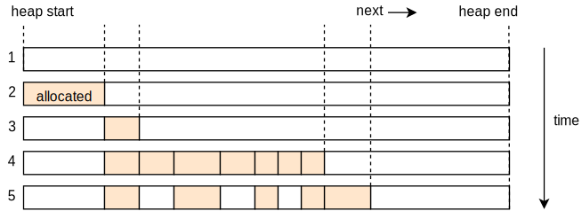
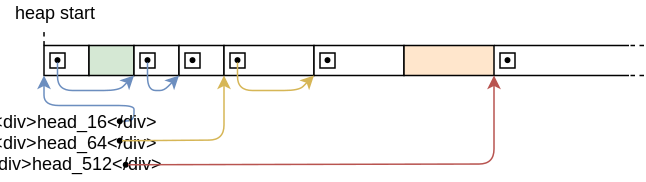

+++
title = "Diseños de Allocadores"
weight = 11
path = "allocator-designs"
date = 2020-01-20

[extra]
chapter = "Gestión de Memoria"
+++

Este post explica cómo implementar allocadores de heap desde cero. Presenta y discute diferentes diseños de allocadores, incluyendo asignación de bump, asignación de lista enlazada y asignación de bloques de tamaño fijo. Para cada uno de los tres diseños, crearemos una implementación básica que se puede utilizar para nuestro kernel.

<!-- more -->

Este blog se desarrolla abiertamente en [GitHub]. Si tienes problemas o preguntas, por favor abre un issue allí. También puedes dejar comentarios [al final]. El código fuente completo para este post se puede encontrar en la rama [`post-11`][post branch].

[GitHub]: https://github.com/phil-opp/blog_os
[al final]: #comments
<!-- fix for zola anchor checker (target is in template): <a id="comments"> -->
[post branch]: https://github.com/phil-opp/blog_os/tree/post-11

<!-- toc -->

## Introducción

En el [post anterior], añadimos soporte básico para asignaciones de heap a nuestro kernel. Para ello, [creamos una nueva región de memoria][map-heap] en las tablas de páginas y [utilizamos el crate `linked_list_allocator`][use-alloc-crate] para gestionar esa memoria. Aunque ahora tenemos un heap operativo, dejamos la mayor parte del trabajo al crate del allocador sin intentar entender cómo funciona.

[post anterior]: @/edition-2/posts/10-heap-allocation/index.md
[map-heap]: @/edition-2/posts/10-heap-allocation/index.md#creating-a-kernel-heap
[use-alloc-crate]: @/edition-2/posts/10-heap-allocation/index.md#using-an-allocator-crate

En este post, mostraremos cómo crear nuestro propio allocador de heap desde cero en lugar de depender de un crate de allocador existente. Discutiremos diferentes diseños de allocadores, incluyendo un _allocador de bump_ simplista y un _allocador de bloques de tamaño fijo_ básico, y usaremos este conocimiento para implementar un allocador con mejor rendimiento (en comparación con el crate `linked_list_allocator`).

### Objetivos de Diseño

La responsabilidad de un allocador es gestionar la memoria heap disponible. Necesita devolver memoria no utilizada en las llamadas a `alloc` y mantener un registro de la memoria liberada por `dealloc` para que pueda ser reutilizada. Más importante aún, nunca debe entregar memoria que ya esté en uso en otro lugar, ya que esto causaría un comportamiento indefinido.

Aparte de la corrección, hay muchos objetivos secundarios de diseño. Por ejemplo, el allocador debería utilizar de manera efectiva la memoria disponible y mantener baja la [_fragmentación_]. Además, debería funcionar bien para aplicaciones concurrentes y escalar a cualquier número de procesadores. Para un rendimiento máximo, podría incluso optimizar el diseño de la memoria con respecto a los cachés de CPU para mejorar la [localidad de caché] y evitar [compartición falsa].

[localidad de caché]: https://www.geeksforgeeks.org/locality-of-reference-and-cache-operation-in-cache-memory/
[_fragmentación_]: https://es.wikipedia.org/wiki/Fragmentaci%C3%B3n_(computaci%C3%B3n)
[compartición falsa]: https://mechanical-sympathy.blogspot.de/2011/07/false-sharing.html

Estos requisitos pueden hacer que los buenos allocadores sean muy complejos. Por ejemplo, [jemalloc] tiene más de 30.000 líneas de código. Esta complejidad a menudo es indeseable en el código del kernel, donde un solo error puede conducir a vulnerabilidades de seguridad graves. Afortunadamente, los patrones de asignación del código del kernel son a menudo mucho más simples en comparación con el código de espacio de usuario, de manera que diseños de allocadores relativamente simples suelen ser suficientes.

[jemalloc]: http://jemalloc.net/

A continuación, presentamos tres posibles diseños de allocadores del kernel y explicamos sus ventajas e inconvenientes.

## Allocador de Bump

El diseño de allocador más simple es un _allocador de bump_ (también conocido como _allocador de pila_). Asigna memoria de forma lineal y solo lleva un registro del número de bytes asignados y del número de asignaciones. Solo es útil en casos de uso muy específicos porque tiene una limitación severa: solo puede liberar toda la memoria a la vez.

### Idea

La idea detrás de un allocador de bump es asignar memoria linealmente al incrementar una variable llamada `next`, que apunta al inicio de la memoria no utilizada. Al principio, `next` es igual a la dirección de inicio del heap. En cada asignación, `next` se incrementa por el tamaño de la asignación, de manera que siempre apunta al límite entre la memoria utilizada y no utilizada:


El puntero `next` solo se mueve en una sola dirección y por lo tanto nunca entrega la misma región de memoria dos veces. Cuando alcanza el final del heap, no se puede asignar más memoria, resultando en un error de falta de memoria en la siguiente asignación.

Un allocador de bump se implementa a menudo con un contador de asignaciones, que se incrementa en 1 con cada llamada a `alloc` y se disminuye en 1 con cada llamada a `dealloc`. Cuando el contador de asignaciones llega a cero, significa que todas las asignaciones en el heap han sido liberadas. En este caso, el puntero `next` puede restablecerse a la dirección de inicio del heap, de manera que toda la memoria del heap esté disponible para nuevas asignaciones nuevamente.

### Implementación

Comenzamos nuestra implementación declarando un nuevo submódulo `allocator::bump`:

```rust
// en src/allocator.rs

pub mod bump;
```

El contenido del submódulo vive en un nuevo archivo `src/allocator/bump.rs`, que creamos con el siguiente contenido:

```rust
// en src/allocator/bump.rs

pub struct BumpAllocator {
    heap_start: usize,
    heap_end: usize,
    next: usize,
    allocations: usize,
}

impl BumpAllocator {
    /// Crea un nuevo allocador de bump vacío.
    pub const fn new() -> Self {
        BumpAllocator {
            heap_start: 0,
            heap_end: 0,
            next: 0,
            allocations: 0,
        }
    }

    /// Inicializa el allocador de bump con los límites de heap dados.
    ///
    /// Este método es inseguro porque el llamador debe garantizar que el rango de memoria dado no está en uso. Además, este método debe ser llamado solo una vez.
    pub unsafe fn init(&mut self, heap_start: usize, heap_size: usize) {
        self.heap_start = heap_start;
        self.heap_end = heap_start + heap_size;
        self.next = heap_start;
    }
}
```

Los campos `heap_start` y `heap_end` mantienen un registro de los límites inferior y superior de la región de memoria heap. El llamador necesita asegurarse de que estas direcciones son válidas, de lo contrario, el allocador retornaría memoria inválida. Por esta razón, la función `init` necesita ser `insegura` para su llamada.

El propósito del campo `next` es apuntar siempre al primer byte no utilizado del heap, es decir, la dirección de inicio de la siguiente asignación. Se establece en `heap_start` en la función `init` porque al principio, todo el heap está sin usar. En cada asignación, este campo se incrementará por el tamaño de la asignación (_"bump"_) para asegurar que no devolvemos la misma región de memoria dos veces.

El campo `allocations` es un contador simple para las asignaciones activas con el objetivo de restablecer el allocador después de que la última asignación ha sido liberada. Se inicializa con 0.

Elegimos crear una función `init` separada en lugar de realizar la inicialización directamente en `new` para mantener la interfaz idéntica a la proporcionada por el crate `linked_list_allocator`. De esta manera, los allocadores pueden cambiarse sin cambios adicionales en el código.

### Implementando `GlobalAlloc`

Como [se explicó en el post anterior][global-alloc], todos los allocadores de heap necesitan implementar el trait [`GlobalAlloc`], que se define de la siguiente manera:

[global-alloc]: @/edition-2/posts/10-heap-allocation/index.md#the-allocator-interface
[`GlobalAlloc`]: https://doc.rust-lang.org/alloc/alloc/trait.GlobalAlloc.html

```rust
pub unsafe trait GlobalAlloc {
    unsafe fn alloc(&self, layout: Layout) -> *mut u8;
    unsafe fn dealloc(&self, ptr: *mut u8, layout: Layout);

    unsafe fn alloc_zeroed(&self, layout: Layout) -> *mut u8 { ... }
    unsafe fn realloc(
        &self,
        ptr: *mut u8,
        layout: Layout,
        new_size: usize
    ) -> *mut u8 { ... }
}
```

Solo se requieren los métodos `alloc` y `dealloc`; los otros dos métodos tienen implementaciones predeterminadas y pueden ser omitidos.

#### Primer Intento de Implementación

Intentemos implementar el método `alloc` para nuestro `BumpAllocator`:

```rust
// en src/allocator/bump.rs

use alloc::alloc::{GlobalAlloc, Layout};

unsafe impl GlobalAlloc for BumpAllocator {
    unsafe fn alloc(&self, layout: Layout) -> *mut u8 {
        // TODO: alineación y verificación de límites
        let alloc_start = self.next;
        self.next = alloc_start + layout.size();
        self.allocations += 1;
        alloc_start as *mut u8
    }

    unsafe fn dealloc(&self, _ptr: *mut u8, _layout: Layout) {
        todo!();
    }
}
```

Primero, utilizamos el campo `next` como la dirección de inicio para nuestra asignación. Luego actualizamos el campo `next` para que apunte a la dirección final de la asignación, que es la siguiente dirección no utilizada en el heap. Antes de devolver la dirección de inicio de la asignación como un puntero `*mut u8`, incrementamos el contador de `allocations` en 1.

Ten en cuenta que no realizamos ninguna verificación de límites o ajustes de alineación, por lo que esta implementación aún no es segura. Esto no importa mucho porque falla al compilar de todos modos con el siguiente error:

```
error[E0594]: cannot assign to `self.next` which is behind a `&` reference
  --> src/allocator/bump.rs:29:9
   |
29 |         self.next = alloc_start + layout.size();
   |         ^^^^^^^^^^^^^^^^^^^^^^^^^^^^^^^^^^^^^^^ `self` is a `&` reference, so the data it refers to cannot be written
```

(El mismo error también ocurre para la línea `self.allocations += 1`. Lo omitimos aquí por brevedad.)

El error ocurre porque los métodos [`alloc`] y [`dealloc`] del trait [`GlobalAlloc`] solo operan en una referencia inmutable `&self`, por lo que no es posible actualizar los campos `next` y `allocations`. Esto es problemático porque actualizar `next` en cada asignación es el principio esencial de un allocador de bump.

[`alloc`]: https://doc.rust-lang.org/alloc/alloc/trait.GlobalAlloc.html#tymethod.alloc
[`dealloc`]: https://doc.rust-lang.org/alloc/alloc/trait.GlobalAlloc.html#tymethod.dealloc

#### `GlobalAlloc` y Mutabilidad

Antes de buscar una posible solución a este problema de mutabilidad, intentemos entender por qué los métodos del trait `GlobalAlloc` están definidos con argumentos `&self`: Como vimos [en el post anterior][global-allocator], el allocador de heap global se define añadiendo el atributo `#[global_allocator]` a un `static` que implementa el trait `GlobalAlloc`. Las variables estáticas son inmutables en Rust, así que no hay forma de llamar a un método que tome `&mut self` en el allocador estático. Por esta razón, todos los métodos de `GlobalAlloc` solo toman una referencia inmutable `&self`.

[global-allocator]:  @/edition-2/posts/10-heap-allocation/index.md#the-global-allocator-attribute

Afortunadamente, hay una manera de obtener una referencia `&mut self` de una referencia `&self`: podemos usar la [mutabilidad interna] sincronizada envolviendo el allocador en un [`spin::Mutex`] spinlock. Este tipo proporciona un método `lock` que realiza [exclusión mutua] y, por lo tanto, convierte de manera segura una referencia `&self` a una referencia `&mut self`. Ya hemos utilizado el tipo wrapper varias veces en nuestro kernel, por ejemplo, para el [búfer de texto VGA][vga-mutex].

[mutabilidad interna]: https://doc.rust-lang.org/book/ch15-05-interior-mutability.html
[vga-mutex]: @/edition-2/posts/03-vga-text-buffer/index.md#spinlocks
[`spin::Mutex`]: https://docs.rs/spin/0.5.0/spin/struct.Mutex.html
[exclusión mutua]: https://es.wikipedia.org/wiki/Exclusi%C3%B3n_mutua

#### Un Tipo Wrapper `Locked`

Con la ayuda del tipo wrapper `spin::Mutex`, podemos implementar el trait `GlobalAlloc` para nuestro allocador de bump. El truco es implementar el trait no para `BumpAllocator` directamente, sino para el tipo envuelto `spin::Mutex<BumpAllocator>`:

```rust
unsafe impl GlobalAlloc for spin::Mutex<BumpAllocator> {…}
```

Desafortunadamente, esto aún no funciona porque el compilador de Rust no permite implementaciones de traits para tipos definidos en otros crates:

```
error[E0117]: only traits defined in the current crate can be implemented for arbitrary types
  --> src/allocator/bump.rs:28:1
   |
28 | unsafe impl GlobalAlloc for spin::Mutex<BumpAllocator> {
   | ^^^^^^^^^^^^^^^^^^^^^^^^^^^^--------------------------
   | |                           |
   | |                           `spin::mutex::Mutex` is not defined in the current crate
   | impl doesn't use only types from inside the current crate
   |
   = note: define and implement a trait or new type instead
```

Para solucionar esto, necesitamos crear nuestro propio tipo wrapper alrededor de `spin::Mutex`:

```rust
// en src/allocator.rs

/// Un wrapper alrededor de spin::Mutex para permitir implementaciones de traits.
pub struct Locked<A> {
    inner: spin::Mutex<A>,
}

impl<A> Locked<A> {
    pub const fn new(inner: A) -> Self {
        Locked {
            inner: spin::Mutex::new(inner),
        }
    }

    pub fn lock(&self) -> spin::MutexGuard<A> {
        self.inner.lock()
    }
}
```

El tipo es un wrapper genérico alrededor de `spin::Mutex<A>`. No impone restricciones sobre el tipo envuelto `A`, por lo que puede ser utilizado para envolver todo tipo de tipos, no solo allocadores. Proporciona una simple función constructora `new` que envuelve un valor dado. Para mayor comodidad, también proporciona una función `lock` que llama a `lock` en el `Mutex` envuelto. Dado que el tipo `Locked` es lo suficientemente general como para ser útil para otras implementaciones de allocadores también, lo colocamos en el módulo `allocator` padre.

#### Implementación para `Locked<BumpAllocator>`

El tipo `Locked` se define en nuestro propio crate (en contraste con `spin::Mutex`), por lo que podemos usarlo para implementar `GlobalAlloc` para nuestro allocador de bump. La implementación completa es la siguiente:

```rust
// en src/allocator/bump.rs

use super::{align_up, Locked};
use alloc::alloc::{GlobalAlloc, Layout};
use core::ptr;

unsafe impl GlobalAlloc for Locked<BumpAllocator> {
    unsafe fn alloc(&self, layout: Layout) -> *mut u8 {
        let mut bump = self.lock(); // obtener una referencia mutable

        let alloc_start = align_up(bump.next, layout.align());
        let alloc_end = match alloc_start.checked_add(layout.size()) {
            Some(end) => end,
            None => return ptr::null_mut(),
        };

        if alloc_end > bump.heap_end {
            ptr::null_mut() // sin memoria
        } else {
            bump.next = alloc_end;
            bump.allocations += 1;
            alloc_start as *mut u8
        }
    }

    unsafe fn dealloc(&self, _ptr: *mut u8, _layout: Layout) {
        let mut bump = self.lock(); // obtener una referencia mutable

        bump.allocations -= 1;
        if bump.allocations == 0 {
            bump.next = bump.heap_start;
        }
    }
}
```

El primer paso para ambos métodos `alloc` y `dealloc` es llamar al método `Mutex::lock` a través del campo `inner` para obtener una referencia mutable al tipo de allocador envuelto. La instancia permanece bloqueada hasta el final del método, de modo que no puede ocurrir ninguna condición de carrera en contextos multihilo (agregaremos soporte para hilos pronto).

Comparado con el prototipo anterior, la implementación de `alloc` ahora respeta los requisitos de alineación y realiza una verificación de límites para asegurarse de que las asignaciones se mantengan dentro de la región de memoria heap. El primer paso es redondear la dirección `next` a la alineación especificada por el argumento `Layout`. El código de la función `align_up` se muestra en un momento. Luego sumamos el tamaño de la asignación a `alloc_start` para obtener la dirección final de la asignación. Para prevenir el desbordamiento de enteros en asignaciones grandes, utilizamos el método `checked_add`. Si ocurre un desbordamiento o si la dirección final de la asignación es mayor que la dirección final del heap, devolvemos un puntero nulo para señalar una situación de falta de memoria. De lo contrario, actualizamos la dirección `next` y aumentamos el contador de `allocations` en 1 como antes. Finalmente, devolvemos la dirección `alloc_start` convertida a un puntero `*mut u8`.

[`checked_add`]: https://doc.rust-lang.org/std/primitive.usize.html#method.checked_add
[`Layout`]: https://doc.rust-lang.org/alloc/alloc/struct.Layout.html

La función `dealloc` ignora el puntero y los argumentos de `Layout` dados. En su lugar, simplemente disminuye el contador de `allocations`. Si el contador alcanza 0 nuevamente, significa que todas las asignaciones fueron liberadas nuevamente. En este caso, restablece la dirección `next` a la dirección `heap_start` para hacer que toda la memoria del heap esté disponible nuevamente.

#### Alineación de Direcciones

La función `align_up` es lo suficientemente general como para que podamos ponerla en el módulo `allocator` padre. Una implementación básica se ve así:

```rust
// en src/allocator.rs

/// Alinea la dirección dada `addr` hacia arriba a la alineación `align`.
fn align_up(addr: usize, align: usize) -> usize {
    let remainder = addr % align;
    if remainder == 0 {
        addr // addr ya está alineado
    } else {
        addr - remainder + align
    }
}
```

La función primero calcula el [resto] de la división de `addr` entre `align`. Si el resto es `0`, la dirección ya está alineada con la alineación dada. De lo contrario, alineamos la dirección restando el resto (para que el nuevo resto sea 0) y luego sumando la alineación (para que la dirección no se vuelva más pequeña que la dirección original).

[resto]: https://es.wikipedia.org/wiki/Divisi%C3%B3n_euclidiana

Ten en cuenta que esta no es la forma más eficiente de implementar esta función. Una implementación mucho más rápida se ve así:

```rust
/// Alinea la dirección dada `addr` hacia arriba a la alineación `align`.
///
/// Requiere que `align` sea una potencia de dos.
fn align_up(addr: usize, align: usize) -> usize {
    (addr + align - 1) & !(align - 1)
}
```

Este método requiere que `align` sea una potencia de dos, lo que puede ser garantizado utilizando el trait `GlobalAlloc` (y su parámetro [`Layout`]). Esto hace posible crear una [máscara de bits] para alinear la dirección de manera muy eficiente. Para entender cómo funciona, repasemos el proceso paso a paso, comenzando por el lado derecho:

[`Layout`]: https://doc.rust-lang.org/alloc/alloc/struct.Layout.html
[máscara de bits]: https://es.wikipedia.org/wiki/M%C3%A1scara_(computaci%C3%B3n)

- Dado que `align` es una potencia de dos, su [representación binaria] tiene solo un solo bit establecido (por ejemplo, `0b000100000`). Esto significa que `align - 1` tiene todos los bits inferiores establecidos (por ejemplo, `0b00011111`).
- Al crear el [NO bit a bit] a través del operador `!`, obtenemos un número que tiene todos los bits establecidos excepto los bits inferiores a `align` (por ejemplo, `0b…111111111100000`).
- Al realizar un [Y bit a bit] en una dirección y `!(align - 1)`, alineamos la dirección _hacia abajo_. Esto funciona borrando todos los bits que están por debajo de `align`.
- Dado que queremos alinear hacia arriba en lugar de hacia abajo, incrementamos `addr` en `align - 1` antes de realizar el Y bit a bit. De esta manera, las direcciones ya alineadas permanecen iguales mientras que las direcciones no alineadas se redondean al siguiente límite de alineación.

[representación binaria]: https://es.wikipedia.org/wiki/N%C3%BAmero_binario#Representaci%C3%B3n
[NO bit a bit]: https://es.wikipedia.org/wiki/Operaci%C3%B3n_bit_a_bit#NO
[Y bit a bit]: https://es.wikipedia.org/wiki/Operaci%C3%B3n_bit_a_bit#Y

Qué variante elijas depende de ti. Ambas calculan el mismo resultado, solo que utilizan diferentes métodos.

### Usándolo

Para usar el allocador de bump en lugar del crate `linked_list_allocator`, necesitamos actualizar el estático `ALLOCATOR` en `allocator.rs`:

```rust
// en src/allocator.rs

use bump::BumpAllocator;

#[global_allocator]
static ALLOCATOR: Locked<BumpAllocator> = Locked::new(BumpAllocator::new());
```

Aquí se vuelve importante que declaramos `BumpAllocator::new` y `Locked::new` como funciones [`const`]. Si fueran funciones normales, ocurriría un error de compilación porque la expresión de inicialización de un `static` debe ser evaluable en tiempo de compilación.

[`const`]: https://doc.rust-lang.org/reference/items/functions.html#const-functions

No necesitamos cambiar la llamada `ALLOCATOR.lock().init(HEAP_START, HEAP_SIZE)` en nuestra función `init_heap` porque el allocador de bump proporciona la misma interfaz que el allocador proporcionado por el `linked_list_allocator`.

Ahora nuestro kernel usa nuestro allocador de bump. ¡Todo debería seguir funcionando, incluyendo las pruebas del [`heap_allocation`] que creamos en el post anterior!

[`heap_allocation`]: @/edition-2/posts/10-heap-allocation/index.md#adding-a-test

```
> cargo test --test heap_allocation
[…]
Running 3 tests
simple_allocation... [ok]
large_vec... [ok]
many_boxes... [ok]
```

### Discusión

La gran ventaja de la asignación de bump es que es muy rápida. Comparada con otros diseños de allocadores (ver abajo) que necesitan buscar activamente un bloque de memoria adecuado y realizar varias tareas de contabilidad en `alloc` y `dealloc`, un allocador de bump [puede ser optimizado][bump downwards] a solo unas pocas instrucciones de ensamblador. Esto hace que los allocadores de bump sean útiles para optimizar el rendimiento de la asignación, por ejemplo cuando se crea una [biblioteca de DOM virtual].

[bump downwards]: https://fitzgeraldnick.com/2019/11/01/always-bump-downwards.html
[biblioteca de DOM virtual]: https://hacks.mozilla.org/2019/03/fast-bump-allocated-virtual-doms-with-rust-and-wasm/

Si bien un allocador de bump se usa raramente como el allocador global, el principio de la asignación de bump se aplica a menudo en la forma de [asignación de arena], que básicamente agrupa asignaciones individuales para mejorar el rendimiento. Un ejemplo de un allocador de arena para Rust se encuentra en el crate [`toolshed`].

[asignación de arena]: https://mgravell.github.io/Pipelines.Sockets.Unofficial/docs/arenas.html
[`toolshed`]: https://docs.rs/toolshed/0.8.1/toolshed/index.html

#### La Desventaja de un Allocador de Bump

La principal limitación de un allocador de bump es que solo puede reutilizar la memoria liberada después de que todas las asignaciones han sido liberadas. Esto significa que una sola asignación de larga duración es suficiente para evitar la reutilización de memoria. Podemos ver esto cuando agregamos una variación de la prueba `many_boxes`:

```rust
// en tests/heap_allocation.rs

#[test_case]
fn many_boxes_long_lived() {
    let long_lived = Box::new(1); // nueva
    for i in 0..HEAP_SIZE {
        let x = Box::new(i);
        assert_eq!(*x, i);
    }
    assert_eq!(*long_lived, 1); // nueva
}
```

Como la prueba `many_boxes`, esta prueba crea un gran número de asignaciones para provocar un error de falta de memoria si el allocador no reutiliza la memoria liberada. Adicionalmente, la prueba crea una asignación `long_lived`, que vive para toda la ejecución del bucle.

Cuando intentamos ejecutar nuestra nueva prueba, vemos que efectivamente falla:

```
> cargo test --test heap_allocation
Running 4 tests
simple_allocation... [ok]
large_vec... [ok]
many_boxes... [ok]
many_boxes_long_lived... [failed]

Error: panicked at 'allocation error: Layout { size_: 8, align_: 8 }', src/lib.rs:86:5
```

Intentemos entender por qué ocurre este fallo en detalle: Primero, la asignación `long_lived` se crea al inicio del heap, aumentando así el contador de `allocations` en 1. Para cada iteración del bucle, se crea una asignación de corta duración y se libera inmediatamente antes de que comience la siguiente iteración. Esto significa que el contador de `allocations` aumenta temporalmente a 2 al comienzo de una iteración y disminuye a 1 al final. El problema ahora es que el allocador de bump solo puede reutilizar la memoria después de que _todas_ las asignaciones han sido liberadas, es decir, cuando el contador de `allocations` cae a 0. Dado que esto no ocurre antes del final del bucle, cada iteración del bucle asigna una nueva región de memoria, lo que lleva a un error de falta de memoria después de un número de iteraciones.

#### ¿Arreglando la Prueba?

Hay dos trucos potenciales que podríamos utilizar para arreglar la prueba para nuestro allocador de bump:

- Podríamos actualizar `dealloc` para verificar si la asignación liberada fue la última asignación devuelta por `alloc` comparando su dirección final con el puntero `next`. En caso de que sean iguales, podemos restablecer de manera segura `next` a la dirección de inicio de la asignación liberada. De esta manera, cada iteración del bucle reutiliza el mismo bloque de memoria.
- Podríamos agregar un método `alloc_back` que asigna memoria desde el _final_ del heap utilizando un campo adicional `next_back`. Entonces podríamos utilizar manualmente este método de asignación para todas las asignaciones de larga duración, separando así las asignaciones de corta y larga duración en el heap. Ten en cuenta que esta separación solo funciona si se sabe de antemano cuánto tiempo vivirá cada asignación. Otra desventaja de este enfoque es que realizar asignaciones manualmente es engorroso y potencialmente inseguro.

Si bien ambos enfoques funcionan para arreglar la prueba, no son una solución general ya que solo pueden reutilizar memoria en casos muy específicos. La pregunta es: ¿hay una solución general que reutilice _toda_ la memoria liberada?

#### ¿Reutilizando Toda la Memoria Liberada?

Como aprendimos [en el post anterior][heap-intro], las asignaciones pueden vivir indefinidamente y pueden liberarse en un orden arbitrario. Esto significa que necesitamos llevar un registro de un número potencialmente ilimitado de regiones de memoria no utilizadas no contiguas, como se ilustra en el siguiente ejemplo:

[heap-intro]: @/edition-2/posts/10-heap-allocation/index.md#dynamic-memory



La gráfica muestra el heap a lo largo del tiempo. Al principio, todo el heap está sin usar y la dirección `next` es igual a `heap_start` (línea 1). Luego ocurre la primera asignación (línea 2). En la línea 3, se asigna un segundo bloque de memoria y se libera la primera asignación. Se agregan muchas más asignaciones en la línea 4. La mitad de ellas son de muy corta duración y ya se liberan en la línea 5, donde también se agrega otra nueva asignación.

La línea 5 muestra el problema fundamental: tenemos cinco regiones de memoria no utilizadas con diferentes tamaños, pero el puntero `next` solo puede apuntar al comienzo de la última región. Mientras que podríamos almacenar las direcciones de inicio y tamaños de las otras regiones no utilizadas en un arreglo de tamaño 4 para este ejemplo, esta no es una solución general, ya que podríamos crear fácilmente un ejemplo con 8, 16 o 1000 regiones de memoria no utilizadas.

Normalmente, cuando tenemos un número potencialmente ilimitado de elementos, podemos usar simplemente una colección asignada en el heap. Esto no es realmente posible en nuestro caso, ya que el allocador de heap no puede depender de sí mismo (causaría una recursión infinita o bloqueos). Así que necesitamos encontrar una solución diferente.

## Allocador de Lista Enlazada

Un truco común para llevar un registro de un número arbitrario de áreas de memoria libres al implementar allocadores es utilizar estas áreas de memoria como almacenamiento de respaldo. Esto utiliza el hecho de que las regiones aún están mapeadas a una dirección virtual y respaldadas por un marco físico, pero la información almacenada ya no es necesaria. Al almacenar la información sobre la región liberada en la región misma, podemos rastrear un número ilimitado de regiones liberadas sin necesidad de memoria adicional.

El enfoque de implementación más común es construir una lista enlazada simple en la memoria liberada, donde cada nodo es una región de memoria liberada:


Cada nodo de la lista contiene dos campos: el tamaño de la región de memoria y un puntero a la siguiente región de memoria no utilizada. Con este enfoque, solo necesitamos un puntero a la primera región no utilizada (llamada `head`) para llevar un registro de todas las regiones no utilizadas, independientemente de su número. La estructura de datos resultante se denomina a menudo [_lista libre_].

[_lista libre_]: https://es.wikipedia.org/wiki/Free_list

Como puedes adivinar por el nombre, esta es la técnica que utiliza el crate `linked_list_allocator`. Los allocadores que utilizan esta técnica a menudo se llaman también _allocadores de piscina_.

### Implementación

En lo siguiente, crearemos nuestro propio tipo simple `LinkedListAllocator` que utiliza el enfoque anterior para mantener el seguimiento de las regiones de memoria liberadas. Esta parte del post no es necesaria para los posts futuros, así que puedes omitir los detalles de implementación si lo deseas.

#### El Tipo de Allocador

Comenzamos creando una estructura privada `ListNode` en un nuevo submódulo `allocator::linked_list`:

```rust
// en src/allocator.rs

pub mod linked_list;
```

```rust
// en src/allocator/linked_list.rs

struct ListNode {
    size: usize,
    next: Option<&'static mut ListNode>,
}
```

Al igual que en la gráfica, un nodo de lista tiene un campo `size` y un puntero opcional al siguiente nodo, representado por el tipo `Option<&'static mut ListNode>`. El tipo `&'static mut` describe semánticamente un objeto [propietario] detrás de un puntero. Básicamente, es un [`Box`] sin un destructor que libera el objeto al final del ámbito.

[propietario]: https://doc.rust-lang.org/book/ch04-01-what-is-ownership.html
[`Box`]: https://doc.rust-lang.org/alloc/boxed/index.html

Implementamos el siguiente conjunto de métodos para `ListNode`:

```rust
// en src/allocator/linked_list.rs

impl ListNode {
    const fn new(size: usize) -> Self {
        ListNode { size, next: None }
    }

    fn start_addr(&self) -> usize {
        self as *const Self as usize
    }

    fn end_addr(&self) -> usize {
        self.start_addr() + self.size
    }
}
```

El tipo tiene una función constructora simple llamada `new` y métodos para calcular las direcciones de inicio y final de la región representada. Hacemos que la función `new` sea una [función const], que será necesaria más tarde al construir un allocador de lista enlazada estática. Ten en cuenta que cualquier uso de referencias mutables en funciones const (incluido el establecimiento del campo `next` en `None`) sigue siendo inestable. Para que compile, necesitamos agregar **`#![feature(const_mut_refs)]`** en la parte superior de nuestro `lib.rs`.

[función const]: https://doc.rust-lang.org/reference/items/functions.html#const-functions

Con la estructura `ListNode` como bloque de construcción, ahora podemos crear la estructura `LinkedListAllocator`:

```rust
// en src/allocator/linked_list.rs

pub struct LinkedListAllocator {
    head: ListNode,
}

impl LinkedListAllocator {
    /// Crea un LinkedListAllocator vacío.
    pub const fn new() -> Self {
        Self {
            head: ListNode::new(0),
        }
    }

    /// Inicializa el allocador con los límites de heap dados.
    ///
    /// Esta función es insegura porque el llamador debe garantizar que los
    /// límites de heap dados son válidos y que el heap está sin usar. Este método debe ser
    /// llamado solo una vez.
    pub unsafe fn init(&mut self, heap_start: usize, heap_size: usize) {
        self.add_free_region(heap_start, heap_size);
    }

    /// Agrega la región de memoria dada al inicio de la lista.
    unsafe fn add_free_region(&mut self, addr: usize, size: usize) {
        todo!();
    }
}
```

La estructura contiene un nodo `head` que apunta a la primera región del heap. Solo nos interesa el valor del puntero `next`, por lo que configuramos el `size` en 0 en la función `ListNode::new`. Hacer `head` un `ListNode` en lugar de solo un `&'static mut ListNode` tiene la ventaja de que la implementación del método `alloc` será más sencilla.

Al igual que para el allocador de bump, la función `new` no inicializa el allocador con los límites del heap. Además de mantener la compatibilidad con la API, la razón es que la rutina de inicialización requiere escribir un nodo en la memoria del heap, lo que solo puede ocurrir en tiempo de ejecución. La función `new`, sin embargo, necesita ser una [`función const`] que se evalúe en tiempo de compilación porque se utilizará para inicializar el estático `ALLOCATOR`. Por esta razón, proporcionamos nuevamente un método `init` separado y no constante.

[`función const`]: https://doc.rust-lang.org/reference/items/functions.html#const-functions

El método `init` utiliza un método `add_free_region`, cuya implementación se mostrará más adelante. Por ahora, usamos el macro [`todo!`] para proporcionar una implementación de marcador de posición que siempre provoca un pánico.

[`todo!`]: https://doc.rust-lang.org/core/macro.todo.html

#### El Método `add_free_region`

El método `add_free_region` proporciona la operación fundamental de _inserción_ en la lista vinculada. Actualmente solo llamamos a este método desde `init`, pero también será el método central en nuestra implementación de `dealloc`. Recuerda que la función `dealloc` se llama cuando una región de memoria asignada se libera nuevamente. Para llevar un registro de esta región de memoria liberada, queremos agregarla a la lista enlazada.

La implementación del método `add_free_region` se ve así:

```rust
// en src/allocator/linked_list.rs

use super::align_up;
use core::mem;

impl LinkedListAllocator {
    /// Agrega la región de memoria dada al inicio de la lista.
    unsafe fn add_free_region(&mut self, addr: usize, size: usize) {
        // asegúrate de que la región liberada sea capaz de contener ListNode
        assert_eq!(align_up(addr, mem::align_of::<ListNode>()), addr);
        assert!(size >= mem::size_of::<ListNode>());

        // crea un nuevo nodo de lista y agréguelo al inicio de la lista
        let mut node = ListNode::new(size);
        node.next = self.head.next.take();
        let node_ptr = addr as *mut ListNode;
        node_ptr.write(node);
        self.head.next = Some(&mut *node_ptr)
    }
}
```

El método toma la dirección y el tamaño de una región de memoria como argumento y la agrega al inicio de la lista. Primero, asegura que la región dada tiene el tamaño y la alineación necesarios para almacenar un `ListNode`. Luego crea el nodo e inserta en la lista a través de los siguientes pasos:


El paso 0 muestra el estado del heap antes de que se llame a `add_free_region`. En el paso 1, se llama al método con la región de memoria marcada como `liberada` en la gráfica. Después de las verificaciones iniciales, el método crea un nuevo `node` en su pila con el tamaño de la región liberada. Luego utiliza el método [`Option::take`] para restablecer el puntero `next` del nodo al puntero actual de `head`, convirtiéndolo en `None`.

[`Option::take`]: https://doc.rust-lang.org/core/option/enum.Option.html#method.take

En el paso 2, el método escribe el `node` recién creado al comienzo de la región de memoria liberada mediante el método [`write`] de la punta. Luego señala el puntero de `head` al nuevo nodo. La estructura de punteros resultante puede parecer algo caótica porque la región liberada siempre se inserta al principio de la lista, pero si seguimos los punteros, vemos que cada región libre todavía es accesible desde el puntero `head`.

[`write`]: https://doc.rust-lang.org/std/primitive.pointer.html#method.write

#### El Método `find_region`

La segunda operación fundamental de una lista enlazada es encontrar una entrada y eliminarla de la lista. Esta es la operación central necesaria para implementar el método `alloc`. Implementamos la operación como un método `find_region` de la siguiente manera:

```rust
// en src/allocator/linked_list.rs

impl LinkedListAllocator {
    /// Busca una región libre con el tamaño y alineación dados y la elimina de la lista.
    ///
    /// Devuelve una tupla del nodo de la lista y la dirección de inicio de la asignación.
    fn find_region(&mut self, size: usize, align: usize)
        -> Option<(&'static mut ListNode, usize)>
    {
        // referencia al nodo actual de la lista, actualizada en cada iteración
        let mut current = &mut self.head;
        // busca una región de memoria lo suficientemente grande en la lista enlazada
        while let Some(ref mut region) = current.next {
            if let Ok(alloc_start) = Self::alloc_from_region(&region, size, align) {
                // región adecuada para la asignación -> eliminar nodo de la lista
                let next = region.next.take();
                let ret = Some((current.next.take().unwrap(), alloc_start));
                current.next = next;
                return ret;
            } else {
                // región no adecuada -> continuar con la siguiente región
                current = current.next.as_mut().unwrap();
            }
        }

        // no se encontró ninguna región adecuada
        None
    }
}
```

El método utiliza una variable `current` y un [`while let`] bucle para iterar sobre los elementos de la lista. Al principio, `current` se establece en el nodo (ficticio) `head`. En cada iteración, luego se actualiza al campo `next` del nodo actual (en el bloque `else`). Si la región es adecuada para una asignación con el tamaño y alineación dados, se elimina la región de la lista y se devuelve junto con la dirección de `alloc_start`.

[`while let`]: https://doc.rust-lang.org/reference/expressions/loop-expr.html#predicate-pattern-loops

Cuando el puntero `current.next` se convierte en `None`, el bucle sale. Esto significa que hemos iterado sobre toda la lista, pero no se encontró ninguna región adecuada para una asignación. En ese caso, devolvemos `None`. Si una región es adecuada, es comprobada por la función `alloc_from_region`, cuya implementación se mostrará en un momento.

Veamos más detenidamente cómo se elimina una región adecuada de la lista:


El paso 0 muestra la situación antes de realizar cualquier ajuste de punteros. El `region` y las regiones `current` y los punteros `region.next` y `current.next` están marcados en la gráfica. En el paso 1, tanto el puntero `region.next` como el puntero `current.next` se restablecen a `None` usando el método [`Option::take`] nuevamente. Los punteros originales se almacenan en variables locales llamadas `next` y `ret`.

En el paso 2, el puntero `current.next` se establece en el puntero local `next`, que es el puntero original `region.next`. El efecto es que `current` ahora apunta directamente a la región después de `region`, de modo que `region` ya no es un elemento de la lista enlazada. La función luego devuelve el puntero a `region` almacenado en la variable local `ret`.

##### La Función `alloc_from_region`

La función `alloc_from_region` devuelve si una región es adecuada para una asignación con un tamaño y alineación dados. Se define de esta manera:

```rust
// en src/allocator/linked_list.rs

impl LinkedListAllocator {
    /// Intenta usar la región dada para una asignación con el tamaño y
    /// alineación dados.
    ///
    /// Devuelve la dirección de inicio de la asignación en caso de éxito.
    fn alloc_from_region(region: &ListNode, size: usize, align: usize)
        -> Result<usize, ()>
    {
        let alloc_start = align_up(region.start_addr(), align);
        let alloc_end = alloc_start.checked_add(size).ok_or(())?;

        if alloc_end > region.end_addr() {
            // región demasiado pequeña
            return Err(());
        }

        let excess_size = region.end_addr() - alloc_end;
        if excess_size > 0 && excess_size < mem::size_of::<ListNode>() {
            // el resto de la región es demasiado pequeño para almacenar un ListNode (requerido porque la
            // asignación divide la región en una parte utilizada y una parte libre)
            return Err(());
        }

        // región adecuada para la asignación
        Ok(alloc_start)
    }
}
```

Primero, la función calcula la dirección de inicio y final de una posible asignación, utilizando la función `align_up` que definimos anteriormente y el método [`checked_add`]. Si ocurre un desbordamiento o si la dirección final está detrás de la dirección final de la región, la asignación no cabe en la región y devolvemos un error.

La función realiza una verificación menos obvia después de eso. Esta verificación es necesaria porque la mayoría de las veces una asignación no cabe perfectamente en una región adecuada, de modo que una parte de la región permanece utilizable después de la asignación. Esta parte de la región debe almacenar su propio `ListNode` después de la asignación, por lo que debe ser lo suficientemente grande para hacerlo. La verificación comprueba exactamente eso: o la asignación cabe perfectamente (`excess_size == 0`) o el tamaño excedente es lo suficientemente grande para almacenar un `ListNode`.

#### Implementando `GlobalAlloc`

Con las operaciones fundamentales proporcionadas por los métodos `add_free_region` y `find_region`, finalmente podemos implementar el trait `GlobalAlloc`. Al igual que con el allocador de bump, no implementamos el trait directamente para `LinkedListAllocator`, sino solo para un `Locked<LinkedListAllocator>` envuelto. El tipo de [`Locked`] agrega mutabilidad interna a través de un spinlock, lo que nos permite modificar la instancia del allocador incluso si los métodos `alloc` y `dealloc` solo toman referencias `&self`.

[`Locked`]: @/edition-2/posts/11-allocator-designs/index.md#a-locked-wrapper-type

La implementación se ve así:

```rust
// en src/allocator/linked_list.rs

use super::Locked;
use alloc::alloc::{GlobalAlloc, Layout};
use core::ptr;

unsafe impl GlobalAlloc for Locked<LinkedListAllocator> {
    unsafe fn alloc(&self, layout: Layout) -> *mut u8 {
        // realizar ajustes de layout
        let (size, align) = LinkedListAllocator::size_align(layout);
        let mut allocator = self.lock();

        if let Some((region, alloc_start)) = allocator.find_region(size, align) {
            let alloc_end = alloc_start.checked_add(size).expect("overflow");
            let excess_size = region.end_addr() - alloc_end;
            if excess_size > 0 {
                allocator.add_free_region(alloc_end, excess_size);
            }
            alloc_start as *mut u8
        } else {
            ptr::null_mut()
        }
    }

    unsafe fn dealloc(&self, ptr: *mut u8, layout: Layout) {
        // realizar ajustes de layout
        let (size, _) = LinkedListAllocator::size_align(layout);

        self.lock().add_free_region(ptr as usize, size)
    }
}
```

Comencemos con la función `dealloc` porque es más sencilla: Primero, realiza algunos ajustes de layout, que explicaremos en un momento. Luego, obtiene una referencia `&mut LinkedListAllocator` al llamar a la función [`Mutex::lock`] sobre el tipo [`Locked`]. Por último, llama a la función `add_free_region` para agregar la región liberada a la lista libre.

El método `alloc` es un poco más complejo. Comienza con los mismos ajustes de layout y también llama a la función [`Mutex::lock`] para recibir una referencia mutable del allocador. Luego utiliza el método `find_region` para encontrar una región de memoria adecuada para la asignación y eliminarla de la lista. Si esto no tiene éxito y se devuelve `None`, devuelve `null_mut` para señalar un error ya que no hay región de memoria adecuada.

En el caso de éxito, el método `find_region` devuelve una tupla de la región adecuada (ya no está en la lista) y la dirección de inicio de la asignación. Usando `alloc_start`, el tamaño de la asignación y la dirección final de la región, calcula la dirección final de la asignación y el tamaño excedente nuevamente. Si el tamaño excedente no es nulo, llama a `add_free_region` para agregar el tamaño excedente de la región de memoria nuevamente a la lista libre. Por último, devuelve la dirección `alloc_start` convertida a un puntero `*mut u8`.

#### Ajustes de Layout

Así que, ¿cuáles son esos ajustes de layout que hacemos al principio de ambos métodos `alloc` y `dealloc`? Aseguran que cada bloque asignado sea capaz de almacenar un `ListNode`. Esto es importante porque el bloque de memoria se va a liberar en algún momento, y queremos escribir un `ListNode` en él. Si el bloque es más pequeño que un `ListNode` o no tiene la alineación correcta, puede ocurrir un comportamiento indefinido.

Los ajustes de layout se realizan mediante la función `size_align`, que se define así:

```rust
// en src/allocator/linked_list.rs

impl LinkedListAllocator {
    /// Ajusta el layout dado para que la región de memoria resultante
    /// también sea capaz de almacenar un `ListNode`.
    ///
    /// Devuelve el tamaño y la alineación ajustados como una tupla (tamaño, alineación).
    fn size_align(layout: Layout) -> (usize, usize) {
        let layout = layout
            .align_to(mem::align_of::<ListNode>())
            .expect("ajuste de alineación fallido")
            .pad_to_align();
        let size = layout.size().max(mem::size_of::<ListNode>());
        (size, layout.align())
    }
}
```

Primero, la función utiliza el método [`align_to`] sobre el `Layout` pasado para aumentar la alineación a la alineación de un `ListNode` si es necesario. Luego usa el método [`pad_to_align`] para redondear el tamaño a un múltiplo de la alineación para garantizar que la dirección de inicio del siguiente bloque de memoria tendrá la alineación correcta para almacenar un `ListNode` también.
En el segundo paso, utiliza el método [`max`] para imponer un tamaño mínimo de asignación de `mem::size_of::<ListNode>`. De esta manera, la función `dealloc` puede escribir de forma segura un `ListNode` en el bloque de memoria liberado.

[`align_to`]: https://doc.rust-lang.org/core/alloc/struct.Layout.html#method.align_to
[`pad_to_align`]: https://doc.rust-lang.org/core/alloc/struct.Layout.html#method.pad_to_align
[`max`]: https://doc.rust-lang.org/std/cmp/trait.Ord.html#method.max

### Usándolo

Ahora podemos actualizar el estático `ALLOCATOR` en el módulo `allocator` para usar nuestro nuevo `LinkedListAllocator`:

```rust
// en src/allocator.rs

use linked_list::LinkedListAllocator;

#[global_allocator]
static ALLOCATOR: Locked<LinkedListAllocator> =
    Locked::new(LinkedListAllocator::new());
```

Dado que la función `init` se comporta de la misma manera para el allocador de bump y el allocador de lista enlazada, no necesitamos modificar la llamada `init` en `init_heap`.

Cuando ejecutamos nuestras pruebas de `heap_allocation` nuevamente, vemos que todas las pruebas pasan ahora, incluida la prueba `many_boxes_long_lived` que falló con el allocador de bump:

```
> cargo test --test heap_allocation
simple_allocation... [ok]
large_vec... [ok]
many_boxes... [ok]
many_boxes_long_lived... [ok]
```

Esto demuestra que nuestro allocador de lista enlazada puede reutilizar la memoria liberada para asignaciones subsiguientes.

### Discusión

En contraste con el allocador de bump, el allocador de lista enlazada es mucho más adecuado como un allocador de propósito general, principalmente porque es capaz de reutilizar directamente la memoria liberada. Sin embargo, también tiene algunas desventajas. Algunas de ellas son solo causadas por nuestra implementación básica, pero también hay desventajas fundamentales del diseño del allocador en sí.

#### Fusionando Bloques Liberados

El principal problema con nuestra implementación es que solo divide el heap en bloques más pequeños pero nunca los fusiona nuevamente. Considera este ejemplo:


En la primera línea, se crean tres asignaciones en el heap. Dos de ellas son liberadas nuevamente en la línea 2 y la tercera es liberada en la línea 3. Ahora el heap completo está sin usar nuevamente, pero todavía está dividido en cuatro bloques individuales. En este punto, una asignación grande podría no ser posible porque ninguno de los cuatro bloques es lo suficientemente grande. Con el tiempo, el proceso continúa y el heap se divide en bloques cada vez más pequeños. En algún momento, el heap está tan fragmentado que incluso las asignaciones de tamaño normal fallarán.

Para solucionar este problema, necesitamos fusionar los bloques liberados adyacentes nuevamente. Para el ejemplo anterior, esto significaría lo siguiente:


Al igual que antes, dos de las tres asignaciones se liberan en la línea `2`. En lugar de mantener el heap fragmentado, ahora realizamos un paso adicional en la línea `2a` para fusionar de nuevo los dos bloques más a la derecha. En la línea `3`, se libera la tercera asignación (como antes), resultando en un heap completamente sin usar representado por tres bloques distintos. En un paso adicional de fusión en la línea `3a`, luego fusionamos los tres bloques adyacentes nuevamente.

El crate `linked_list_allocator` implementa esta estrategia de fusión de la siguiente manera: En lugar de insertar bloques de memoria liberados al principio de la lista enlazada en `deallocate`, siempre mantiene la lista ordenada por dirección de inicio. De esta manera, la fusión se puede realizar directamente en la llamada a `deallocate` al examinar las direcciones y tamaños de los dos bloques vecinos en la lista. Por supuesto, la operación de liberación es más lenta de esta manera, pero previene la fragmentación del heap que vimos arriba.

#### Rendimiento

Como aprendimos arriba, el allocador de bump es extremadamente rápido y puede optimizarse a solo unas pocas operaciones de ensamblador. El allocador de lista enlazada tiene un rendimiento mucho peor en esta categoría. El problema es que una solicitud de asignación puede requerir recorrer la lista enlazada completa hasta que encuentre un bloque adecuado.

Dado que la longitud de la lista depende del número de bloques de memoria no utilizados, el rendimiento puede variar extremadamente para diferentes programas. Un programa que solo crea un par de asignaciones experimentará un rendimiento relativamente rápido en la asignación. Sin embargo, para un programa que fragmenta el heap con muchas asignaciones, el rendimiento de la asignación será muy malo porque la lista enlazada será muy larga y contendrá en su mayoría bloques muy pequeños.

Es importante notar que este problema de rendimiento no es un problema causado por nuestra implementación básica, sino un problema fundamental del enfoque de la lista enlazada. Dado que el rendimiento de asignación puede ser muy importante para el código a nivel de kernel, exploramos un tercer diseño de allocador a continuación que intercambia un rendimiento mejorado por una utilización de memoria reducida.

## Allocador de Bloques de Tamaño Fijo

A continuación, presentamos un diseño de allocador que utiliza bloques de memoria de tamaño fijo para satisfacer las solicitudes de asignación. De esta manera, el allocador a menudo devuelve bloques que son más grandes de lo que se necesita para las asignaciones, lo que resulta en memoria desperdiciada debido a [fragmentación interna]. Por otro lado, reduce drásticamente el tiempo requerido para encontrar un bloque adecuado (en comparación con el allocador de lista enlazada), lo que resulta en un mejor rendimiento de asignación.

### Introducción

La idea detrás de un _allocador de bloques de tamaño fijo_ es la siguiente: En lugar de asignar exactamente la cantidad de memoria solicitada, definimos un pequeño número de tamaños de bloque y redondeamos cada asignación al siguiente tamaño de bloque. Por ejemplo, con tamaños de bloque de 16, 64 y 512 bytes, una asignación de 4 bytes devolvería un bloque de 16 bytes, una asignación de 48 bytes un bloque de 64 bytes y una asignación de 128 bytes un bloque de 512 bytes.

Al igual que el allocador de lista enlazada, llevamos un registro de la memoria no utilizada creando una lista enlazada en la memoria no utilizada. Sin embargo, en lugar de usar una sola lista con diferentes tamaños de bloque, creamos una lista separada para cada clase de tamaño. Cada lista solo almacena bloques de un solo tamaño. Por ejemplo, con tamaños de bloque de 16, 64 y 512, habría tres listas enlazadas separadas en la memoria:

.

En lugar de un solo puntero `head`, tenemos los tres punteros `head_16`, `head_64` y `head_512` que apuntan cada uno al primer bloque no utilizado del tamaño correspondiente. Todos los nodos en una sola lista tienen el mismo tamaño. Por ejemplo, la lista iniciada por el puntero `head_16` solo contiene bloques de 16 bytes. Esto significa que ya no necesitamos almacenar el tamaño en cada nodo de lista, ya que ya está especificado por el nombre del puntero de cabeza.

Dado que cada elemento en una lista tiene el mismo tamaño, cada elemento de la lista es igualmente adecuado para una solicitud de asignación. Esto significa que podemos realizar una asignación de manera muy eficiente usando los siguientes pasos:

- Redondear el tamaño de asignación solicitado al siguiente tamaño de bloque. Por ejemplo, cuando se solicita una asignación de 12 bytes, elegiríamos el tamaño de bloque de 16 en el ejemplo anterior.
- Recuperar el puntero de cabeza para la lista, por ejemplo, para el tamaño de bloque 16, necesitamos usar `head_16`.
- Eliminar el primer bloque de la lista y devolverlo.

Lo más notable es que siempre podemos devolver el primer elemento de la lista y ya no necesitamos recorrer toda la lista. Por lo tanto, las asignaciones son mucho más rápidas que con el allocador de lista enlazada.

#### Tamaños de Bloques y Memoria Desperdiciada

Dependiendo de los tamaños de los bloques, perdemos mucha memoria al redondear. Por ejemplo, cuando se devuelve un bloque de 512 bytes para una asignación de 128 bytes, tres cuartas partes de la memoria asignada están sin usar. Al definir tamaños de bloque razonables, es posible limitar la cantidad de memoria desperdiciada hasta cierto grado. Por ejemplo, al usar potencias de 2 (4, 8, 16, 32, 64, 128, …) como tamaños de bloque, podemos limitar el desperdicio de memoria a la mitad del tamaño de la asignación en el peor caso y a un cuarto del tamaño de la asignación en el caso promedio.

También es común optimizar los tamaños de bloque en función de los tamaños de asignación comunes en un programa. Por ejemplo, podríamos agregar un tamaño de bloque de 24 para mejorar el uso de memoria en programas que realizan asignaciones de 24 bytes con frecuencia. De esta manera, la cantidad de memoria desperdiciada se puede reducir a menudo sin perder los beneficios de rendimiento.

#### Desasignación

Al igual que la asignación, la desasignación también es muy rápida. Implica los siguientes pasos:

- Redondear el tamaño de asignación liberado al siguiente tamaño de bloque. Esto es necesario ya que el compilador solo pasa el tamaño de asignación solicitado a `dealloc`, no el tamaño del bloque que fue devuelto por `alloc`. Al utilizar la misma función de ajuste de tamaño en ambos métodos `alloc` y `dealloc`, podemos asegurarnos de que siempre liberamos la cantidad correcta de memoria.
- Recuperar el puntero de cabeza para la lista.
- Agregar el bloque liberado al inicio de la lista actualizando el puntero de cabeza.

Lo más notable es que tampoco se requiere recorrer la lista para la desasignación. Esto significa que el tiempo requerido para una llamada a `dealloc` se mantiene constante, independientemente de la longitud de la lista.

#### Allocador de Respaldo

Dado que las asignaciones grandes (>2&nbsp;KB) son raras, especialmente en los núcleos de sistemas operativos, puede tener sentido retroceder a un allocador diferente para estas asignaciones. Por ejemplo, podríamos utilizar un allocador de lista enlazada para asignaciones mayores de 2048 bytes a fin de reducir el desperdicio de memoria. Dado que solo se espera muy pocas asignaciones de ese tamaño, la lista enlazada se mantendría pequeña y las (de)asignaciones seguirían siendo razonablemente rápidas.

#### Creando Nuevos Bloques

Arriba, asumimos siempre que hay suficiente bloques de un tamaño específico en la lista para satisfacer todas las solicitudes de asignación. Sin embargo, en algún momento, la lista enlazada para un tamaño de bloque específico se queda vacía. En este punto, hay dos formas en las que podemos crear nuevos bloques no utilizados de un tamaño específico para satisfacer una solicitud de asignación:

- Asignar un nuevo bloque del allocador de respaldo (si hay uno).
- Dividir un bloque más grande de otra lista. Esto funciona mejor si los tamaños de bloque son potencias de dos. Por ejemplo, un bloque de 32 bytes se puede dividir en dos bloques de 16 bytes.

Para nuestra implementación, asignaremos nuevos bloques del allocador de respaldo, ya que la implementación es mucho más simple.

### Implementación

Ahora que sabemos cómo funciona un allocador de bloques de tamaño fijo, podemos comenzar nuestra implementación. No dependeremos de la implementación del allocador de lista enlazada creada en la sección anterior, así que puedes seguir esta parte incluso si omitiste la implementación del allocador de lista enlazada.

#### Nodo de Lista

Comenzamos nuestra implementación creando un tipo `ListNode` en un nuevo módulo `allocator::fixed_size_block`:

```rust
// en src/allocator.rs

pub mod fixed_size_block;
```

```rust
// en src/allocator/fixed_size_block.rs

struct ListNode {
    next: Option<&'static mut ListNode>,
}
```

Este tipo es similar al tipo `ListNode` de nuestra [implementación del allocador de lista enlazada], con la diferencia de que no tenemos un campo `size`. No es necesario porque cada bloque en una lista tiene el mismo tamaño con el diseño del allocador de bloques de tamaño fijo.

[implementación del allocador de lista enlazada]: #el-tipo-de-allocador

#### Tamaños de Bloques

A continuación, definimos un slice constante `BLOCK_SIZES` con los tamaños de bloque utilizados para nuestra implementación:

```rust
// en src/allocator/fixed_size_block.rs

/// Los tamaños de bloque a utilizar.
///
/// Los tamaños deben ser cada uno potencia de 2 porque también se utilizan como
/// la alineación del bloque (las alineaciones deben ser siempre potencias de 2).
const BLOCK_SIZES: &[usize] = &[8, 16, 32, 64, 128, 256, 512, 1024, 2048];
```

Como tamaños de bloque, usamos potencias de 2, comenzando desde 8 hasta 2048. No definimos tamaños de bloque más pequeños que 8 porque cada bloque debe ser capaz de almacenar un puntero de 64 bits al siguiente bloque cuando se libera. Para asignaciones mayores de 2048 bytes, retrocederemos a un allocador de lista enlazada.

Para simplificar la implementación, definimos el tamaño de un bloque como su alineación necesaria en la memoria. Así que un bloque de 16 bytes siempre está alineado en un límite de 16 bytes y un bloque de 512 bytes está alineado en un límite de 512 bytes. Dado que las alineaciones siempre deben ser potencias de 2, esto excluye cualquier otro tamaño de bloque. Si necesitamos tamaños de bloque que no sean potencias de 2 en el futuro, aún podemos ajustar nuestra implementación para ello (por ejemplo, definiendo un segundo arreglo `BLOCK_ALIGNMENTS`).

#### El Tipo de Allocador

Usando el tipo `ListNode` y el slice `BLOCK_SIZES`, ahora podemos definir nuestro tipo de allocador:

```rust
// en src/allocator/fixed_size_block.rs

pub struct FixedSizeBlockAllocator {
    list_heads: [Option<&'static mut ListNode>; BLOCK_SIZES.len()],
    fallback_allocator: linked_list_allocator::Heap,
}
```

El campo `list_heads` es un arreglo de punteros `head`, uno para cada tamaño de bloque. Esto se implementa utilizando el `len()` del slice `BLOCK_SIZES` como longitud del arreglo. Como allocador de respaldo para asignaciones más grandes que el mayor tamaño de bloque, usamos el allocador proporcionado por el `linked_list_allocator`. También podríamos usar el `LinkedListAllocator` que implementamos nosotros mismos, pero tiene la desventaja de que no [fusiona bloques liberados].

[fusiona bloques liberados]: #fusionando-bloques-liberados

Para construir un `FixedSizeBlockAllocator`, proporcionamos las mismas funciones `new` e `init` que implementamos para los otros tipos de allocadores también:

```rust
// en src/allocator/fixed_size_block.rs

impl FixedSizeBlockAllocator {
    /// Crea un FixedSizeBlockAllocator vacío.
    pub const fn new() -> Self {
        const EMPTY: Option<&'static mut ListNode> = None;
        FixedSizeBlockAllocator {
            list_heads: [EMPTY; BLOCK_SIZES.len()],
            fallback_allocator: linked_list_allocator::Heap::empty(),
        }
    }

    /// Inicializa el allocador con los límites de heap dados.
    ///
    /// Esta función es insegura porque el llamador debe garantizar que los
    /// límites de heap dados son válidos y que el heap está sin usar. Este método debe ser
    /// llamado solo una vez.
    pub unsafe fn init(&mut self, heap_start: usize, heap_size: usize) {
        self.fallback_allocator.init(heap_start, heap_size);
    }
}
```

La función `new` solo inicializa el arreglo `list_heads` con nodos vacíos y crea un allocador de lista enlazada [`empty`] como `fallback_allocator`. La constante `EMPTY` es necesaria para decirle al compilador de Rust que queremos inicializar el arreglo con un valor constante. Inicializar el arreglo directamente como `[None; BLOCK_SIZES.len()]` no funciona, porque entonces el compilador requiere que `Option<&'static mut ListNode>` implemente el trait `Copy`, lo que no hace. Esta es una limitación actual del compilador de Rust, que podría desaparecer en el futuro.

[`empty`]: https://docs.rs/linked_list_allocator/0.9.0/linked_list_allocator/struct.Heap.html#method.empty

Si aún no lo has hecho para la implementación del `LinkedListAllocator`, también necesitas agregar **`#![feature(const_mut_refs)]`** en la parte superior de tu `lib.rs`. La razón es que cualquier uso de tipos de referencia mutables en funciones const sigue siendo inestable, incluido el tipo de elemento de referencia `Option<&'static mut ListNode>` del campo `list_heads` (incluso si lo establecemos en `None`).

La función insegura `init` solo llama a la función [`init`] del `fallback_allocator` sin realizar ninguna inicialización adicional del arreglo `list_heads`. En su lugar, lo inicializaremos de manera perezosa en las llamadas a `alloc` y `dealloc`.

[`init`]: https://docs.rs/linked_list_allocator/0.9.0/linked_list_allocator/struct.Heap.html#method.init

Para mayor comodidad, también creamos un método privado `fallback_alloc` que asigna usando el `fallback_allocator`:

```rust
// en src/allocator/fixed_size_block.rs

use alloc::alloc::Layout;
use core::ptr;

impl FixedSizeBlockAllocator {
    /// Asigna usando el allocador de respaldo.
    fn fallback_alloc(&mut self, layout: Layout) -> *mut u8 {
        match self.fallback_allocator.allocate_first_fit(layout) {
            Ok(ptr) => ptr.as_ptr(),
            Err(_) => ptr::null_mut(),
        }
    }
}
```

El tipo [`Heap`] del crate `linked_list_allocator` no implementa [`GlobalAlloc`] (ya que es [no posible sin bloquear]). En su lugar, proporciona un método [`allocate_first_fit`] que tiene una interfaz ligeramente diferente. En lugar de devolver un `*mut u8` y usar un puntero nulo para señalar un error, devuelve un `Result<NonNull<u8>, ()>`. El tipo [`NonNull`] es una abstracción para un puntero en bruto que se garantiza que no sea un puntero nulo. Mapeando el caso `Ok` al método [`NonNull::as_ptr`] y el caso `Err` a un puntero nulo, podemos traducir fácilmente esto de nuevo a un tipo `*mut u8`.

[`Heap`]: https://docs.rs/linked_list_allocator/0.9.0/linked_list_allocator/struct.Heap.html
[no posible sin bloquear]: #globalalloc-y-mutabilidad
[`allocate_first_fit`]: https://docs.rs/linked_list_allocator/0.9.0/linked_list_allocator/struct.Heap.html#method.allocate_first_fit
[`NonNull`]: https://doc.rust-lang.org/nightly/core/ptr/struct.NonNull.html
[`NonNull::as_ptr`]: https://doc.rust-lang.org/nightly/core/ptr/struct.NonNull.html#method.as_ptr

#### Calculando el Índice de la Lista

Antes de implementar el trait `GlobalAlloc`, definimos una función auxiliar `list_index` que devuelve el tamaño de bloque más bajo posible para un dado [`Layout`]:

```rust
// en src/allocator/fixed_size_block.rs

/// Elige un tamaño de bloque apropiado para el layout dado.
///
/// Devuelve un índice en el arreglo `BLOCK_SIZES`.
fn list_index(layout: &Layout) -> Option<usize> {
    let required_block_size = layout.size().max(layout.align());
    BLOCK_SIZES.iter().position(|&s| s >= required_block_size)
}
```

El bloque debe tener al menos el tamaño y la alineación requeridos por el `Layout` dado. Dado que definimos que el tamaño del bloque es también su alineación, esto significa que el `required_block_size` es el [máximo] de los atributos [`size()`] y [`align()`] del layout. Para encontrar el siguiente bloque más grande en el slice `BLOCK_SIZES`, primero usamos el método [`iter()`] para obtener un iterador y luego el método [`position()`] para encontrar el índice del primer bloque que es al menos tan grande como el `required_block_size`.

[máximo]: https://doc.rust-lang.org/core/cmp/trait.Ord.html#method.max
[`size()`]: https://doc.rust-lang.org/core/alloc/struct.Layout.html#method.size
[`align()`]: https://doc.rust-lang.org/core/alloc/struct.Layout.html#method.align
[`iter()`]: https://doc.rust-lang.org/std/primitive.slice.html#method.iter
[`position()`]:  https://doc.rust-lang.org/core/iter/trait.Iterator.html#method.position

Ten en cuenta que no devolvemos el tamaño del bloque en sí, sino el índice en el slice `BLOCK_SIZES`. La razón es que queremos utilizar el índice devuelto como índice en el arreglo `list_heads`.

#### Implementando `GlobalAlloc`

El último paso es implementar el trait `GlobalAlloc`:

```rust
// en src/allocator/fixed_size_block.rs

use super::Locked;
use alloc::alloc::GlobalAlloc;

unsafe impl GlobalAlloc for Locked<FixedSizeBlockAllocator> {
    unsafe fn alloc(&self, layout: Layout) -> *mut u8 {
        todo!();
    }

    unsafe fn dealloc(&self, ptr: *mut u8, layout: Layout) {
        todo!();
    }
}
```

Al igual que con los otros allocadores, no implementamos el trait `GlobalAlloc` directamente para nuestro tipo de allocador, sino que usamos el wrapper [`Locked`] para agregar mutabilidad interna sincronizada. Dado que las implementaciones de `alloc` y `dealloc` son relativamente grandes, las introduciremos una por una a continuación.

##### `alloc`

La implementación del método `alloc` se ve así:

```rust
// en el bloque `impl` en src/allocator/fixed_size_block.rs

unsafe fn alloc(&self, layout: Layout) -> *mut u8 {
    let mut allocator = self.lock();
    match list_index(&layout) {
        Some(index) => {
            match allocator.list_heads[index].take() {
                Some(node) => {
                    allocator.list_heads[index] = node.next.take();
                    node as *mut ListNode as *mut u8
                }
                None => {
                    // no existe un bloque en la lista => asignar un nuevo bloque
                    let block_size = BLOCK_SIZES[index];
                    // solo funciona si todos los tamaños de bloque son potencia de 2
                    let block_align = block_size;
                    let layout = Layout::from_size_align(block_size, block_align)
                        .unwrap();
                    allocator.fallback_alloc(layout)
                }
            }
        }
        None => allocator.fallback_alloc(layout),
    }
}
```

Repasemos el proceso paso a paso:

Primero, utilizamos el método `Locked::lock` para obtener una referencia mutable a la instancia del allocador envuelta. A continuación, llamamos a la función `list_index` que acabamos de definir para calcular el tamaño de bloque apropiado para el layout dado y obtener el índice correspondiente en el arreglo `list_heads`. Si este índice es `None`, ningún tamaño de bloque encaja para la asignación, por lo que utilizamos el `fallback_allocator` usando la función `fallback_alloc`.

Si el índice de la lista es `Some`, intentamos eliminar el primer nodo en la lista correspondiente iniciada por `list_heads[index]` usando el método [`Option::take`]. Si la lista no está vacía, entramos en la rama `Some(node)` de la declaración `match`, donde apuntamos el puntero de cabeza de la lista al sucesor del nodo eliminado (utilizando [`take`] de nuevo). Finalmente, devolvemos el puntero `node` como un `*mut u8`.

[`Option::take`]: https://doc.rust-lang.org/core/option/enum.Option.html#method.take

Si el puntero de cabeza es `None`, indica que la lista de bloques está vacía. Esto significa que necesitamos construir un nuevo bloque como se [describió arriba](#creando-nuevos-bloques). Para ello, primero obtenemos el tamaño actual del bloque del slice `BLOCK_SIZES` y lo utilizamos como tamaño y alineación para el nuevo bloque. Luego, creamos un nuevo `Layout` a partir de él y llamamos al método `fallback_alloc` para realizar la asignación. La razón para ajustar el layout y la alineación es que el bloque se agregará a la lista de bloques en la desasignación.

#### `dealloc`

La implementación del método `dealloc` se ve así:

```rust
// en src/allocator/fixed_size_block.rs

use core::{mem, ptr::