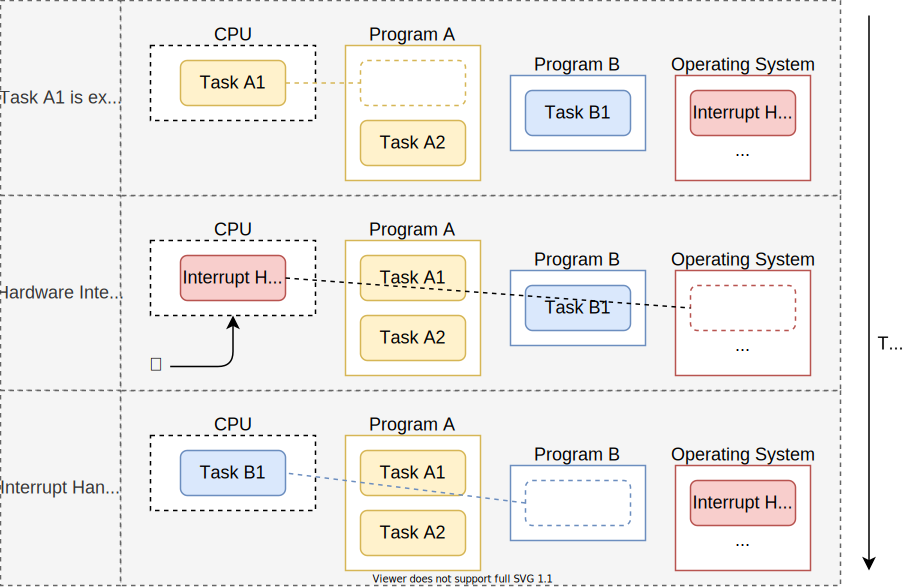
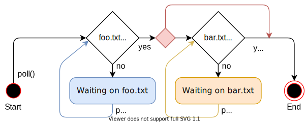
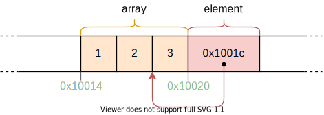
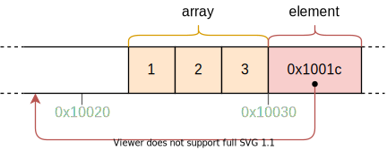
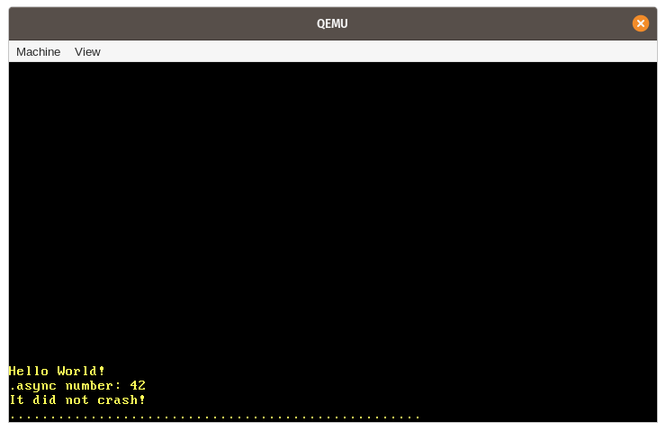
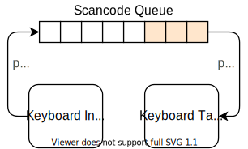

+++
title = "Async/Await"
weight = 12
path = "ar/async-await"
date = 2020-03-27

[extra]
chapter = "تعدد المهام"

# GitHub usernames of the people that translated this post
translators = ["mindfreq"]
rtl = true
+++

في هذا المقال، نستكشف _cooperative multitasking_ وميزة _async/await_ في Rust. نلقي نظرة مفصلة على كيفية عمل async/await في Rust، بما في ذلك تصميم trait `Future`، وتحويل state machine، و _pinning_. ثم نضيف دعمًا أساسيًا لـ async/await لنواتنا بإنشاء مهمة لوحة مفاتيح غير متزامنة و executor أساسي.

<!-- more -->

هذا المدونة مطوّرة بشكل مفتوح على [GitHub]. إذا كان لديك أي مشاكل أو أسئلة، يرجى فتح issue هناك. يمكنك أيضًا ترك تعليقات [في الأسفل]. يمكن العثور على الكود المصدري الكامل لهذا المقال في فرع [`post-12`][post branch].

[GitHub]: https://github.com/phil-opp/blog_os
[at the bottom]: #comments
<!-- fix for zola anchor checker (target is in template): <a id="comments"> -->
[post branch]: https://github.com/phil-opp/blog_os/tree/post-12

<!-- toc -->

## تعدد المهام

واحد من الميزات الأساسية لمعظم أنظمة التشغيل هو [_multitasking_]، وهو القدرة على تنفيذ عدة مهام بشكل متزامن. على سبيل المثال، ربما لديك برامج أخرى مفتوحة أثناء مشاهدة هذا المقال، مثل محرر نصوص أو نافذة طرفية. حتى إذا كان لديك نافذة متصفح واحدة فقط مفتوحة، هناك على الأرجح العديد من مهام الخلفية لإدارة نوافذ سطح المكتب أو التحقق من التحديثات أو فهرسة الملفات.

[_multitasking_]: https://en.wikipedia.org/wiki/Computer_multitasking

بينما يبدو أن جميع البرامج تعمل بالتوازي، يمكن لـ CPU واحد فقط تنفيذ مهمة واحدة في كل مرة. لخلق الوهم بأن المهام تعمل بالتوازي، ينتقل نظام التشغيل بسرعة بين المهام النشطة بحيث يمكن لكل منها إحراز بعض التقدم. بما أن أجهزة الكمبيوتر سريعة، لا نلاحظ هذه التبديلات في معظم الأحيان.

بينما يمكن لـ CPUs أحادية النواة تنفيذ مهمة واحدة فقط في كل مرة، يمكن لـ CPUs متعددة النواة تشغيل عدة مهام بالتوازي الحقيقي. على سبيل المثال، CPU بـ 8 أنوية يمكنه تشغيل 8 مهام في نفس الوقت. سنشرح كيفية إعداد CPUs متعددة النواة في مقال مستقبلي. في هذا المقال، سنركز على CPUs أحادية النواة للتبسيط. (من الجدير بالذكر أن جميع CPUs متعددة النواة تبدأ بنواة نشطة واحدة فقط، لذا يمكننا التعامل معها كـ CPUs أحادية النواة الآن.)

هناك شكلان من تعدد المهام: تعدد المهام _التعاوني_ يتطلب من المهام التخلي عن وحدة المعالجة المركزية بانتظام حتى تتمكن المهام الأخرى من التقدم. تعدد المهام _الاستباقي_ يستخدم وظائف نظام التشغيل لتبديل الخيوط في نقاط زمنية عشوائية بإيقافها قسرًا. في التالي سنستكشف شكلي تعدد المهام بمزيد من التفصيل ونناقش مزايا وعيوب كل منهما.

### تعدد المهام الاستباقي

الفكرة وراء تعدد المهام الاستباقي هي أن نظام التشغيل يتحكم في موعد تبديل المهام. لتحقيق ذلك، يستفيد من حقيقة أنه يستعيد التحكم في CPU عند كل مقاطعة. هذا يجعل من الممكن تبديل المهام كلما كان هناك إدخال جديد متاح للنظام. على سبيل المثال، من الممكن التبديل بين المهام عند تحريك الماوس أو وصول حزمة شبكة. يمكن لنظام التشغيل أيضًا تحديد الوقت الدقيق المسموح لمهمة بالعمل به عن طريق تكوين مؤقت عتاد لإرسال مقاطعة بعد ذلك الوقت.

الرسم البياني التالي يوضح عملية تبديل المهام عند مقاطعة عتاد:



في الصف الأول، CPU ينفذ المهمة `A1` من البرنامج `A`. جميع المهام الأخرى متوقفة. في الصف الثاني، تصل مقاطعة عتاد إلى CPU. كما هو موضح في مقال [_Hardware Interrupts_]، يتوقف CPU فورًا عن تنفيذ المهمة `A1` وينتقل إلى دالة معالجة المقاطعة المحددة في interrupt descriptor table (IDT). من خلال معالج المقاطعة هذا، يستعيد نظام التشغيل التحكم في CPU مرة أخرى، مما يسمح له بالتبديل إلى المهمة `B1` بدلاً من متابعة المهمة `A1`.

[_Hardware Interrupts_]: @/edition-2/posts/07-hardware-interrupts/index.md

#### حفظ الحالة

بما أن المهام تُقاطع في نقاط زمنية عشوائية، فقد تكون في منتصف بعض العمليات الحسابية. لكي يتمكن من استئنافها لاحقًا، يجب على نظام عمل نسخ احتياطي لحالة المهمة بالكامل، بما في ذلك [call stack] وقيم جميع سجلات CPU. تُسمى هذه العملية بـ [_context switch_].

[call stack]: https://en.wikipedia.org/wiki/Call_stack
[_context switch_]: https://en.wikipedia.org/wiki/Context_switch

بما أن call stack يمكن أن يكون كبيرًا جدًا، عادةً ما يُعدّد نظام التشغيل call stack منفصل لكل مهمة بدلاً من نسخ محتويات call stack عند كل تبديل مهمة. مثل هذه المهمة مع stack خاص بها تُسمى [_thread of execution_] أو _thread_ باختصار. باستخدام stack منفصل لكل مهمة، يحتاج فقط إلى حفظ محتويات السجلات عند تبديل السياق (بما في ذلك program counter و stack pointer). هذا النهج يقلل من أداء تبديل السياق، وهو مهم جدًا لأن تبديلات السياق تحدث غالبًا حتى 100 مرة في الثانية.

[_thread of execution_]: https://en.wikipedia.org/wiki/Thread_(computing)

#### النقاش

الميزة الرئيسية لتعدد المهام الاستباقي هي أن نظام التشغيل يمكنه التحكم بالكامل في وقت التنفيذ المسموح به للمهمة. بهذه الطريقة، يمكنه ضمان حصول كل مهمة على حصة عادلة من وقت CPU، دون الحاجة إلى الوثوق بالمهام للتعاون. هذا مهم بشكل خاص عند تشغيل مهام غير موثوقة أو عندما يشارك عدة مستخدمين في نظام.

عيب الاستباقية هو أن كل مهمة تحتاج إلى stack خاص بها. مقارنة بـ stack مشترك، ينتج عن ذلك استخدام أعلى للذاكرة لكل مهمة ويحد غالبًا من عدد المهام في النظام. عيب آخر هو أن نظام التشغيل يحتاج دائمًا إلى حفظ حالة سجلات CPU كاملة عند كل تبديل مهمة، حتى إذا كانت المهمة تستخدم فقط مجموعة صغيرة من السجلات.

تعدد المهام الاستباقي والخيوط مكونات أساسية لنظام التشغيل لأنها تجعل من الممكن تشغيل برامج userspace غير الموثوقة. سنناقش هذه المفاهيم بالتفصيل الكامل في المقالات المستقبلية. في هذا المقال، مع ذلك، سنركز على تعدد المهام التعاوني، الذي يوفر أيضًا قدرات مفيدة لـ kernel الخاص بنا.

### تعدد المهام التعاوني

بدلاً من إيقاف المهام العاملة قسرًا في نقاط زمنية عشوائية، يتيح تعدد المهام التعاوني لكل مهمة العمل حتى تتخلى طواعية عن التحكم في CPU. هذا يسمح للمهام بإيقاف نفسها في نقاط زمنية مناسبة، على سبيل المثال، عندما تحتاج إلى الانتظار لعملية I/O على أي حال.

غالبًا ما يُستخدم تعدد المهام التعاوني على مستوى اللغة، مثل في شكل [coroutines] أو [async/await]. الفكرة هي أن المبرمج أو المترجم يدرج عمليات [_yield_] في البرنامج، التي تتخلى عن التحكم في CPU وتتيح للمهام الأخرى العمل. على سبيل المثال، يمكن إدراج yield بعد كل تكرار من حلقة معقدة.

[coroutines]: https://en.wikipedia.org/wiki/Coroutine
[async/await]: https://rust-lang.github.io/async-book/01_getting_started/04_async_await_primer.html
[_yield_]: https://en.wikipedia.org/wiki/Yield_(multithreading)

من الشائع دمج تعدد المهام التعاوني مع [asynchronous operations]. بدلاً من الانتظار حتى تنتهي العملية ومنع المهام الأخرى من العمل خلال هذا الوقت، ترجع العمليات غير المتزامنة حالة "غير جاهزة" إذا لم تنته العملية بعد. في هذه الحالة، يمكن للمهمة المنتظرة تنفيذ عملية yield للسماح للمهام الأخرى بالعمل.

[asynchronous operations]: https://en.wikipedia.org/wiki/Asynchronous_I/O

#### حفظ الحالة

بما أن المهام تحدد نقاط الإيقاف بنفسها، لا تحتاج إلى نظام التشغيل لحفظ حالتها. بدلاً من ذلك، يمكنها حفظ الحالة التي تحتاجها للاستمرار بالضبط قبل أن توقف نفسها، مما ينتج عنه أداء أفضل غالبًا. على سبيل المثال، مهمة أنهت للتو عملية حسابية معقدة قد تحتاج فقط إلى نسخ النتيجة النهائية احتياطيًا لأنها لم تعد تحتاج إلى النتائج الوسيطة.

تنفيذات المهام التعاونية المدعومة من اللغة غالبًا ما تكون قادرة حتى على حفظ الأجزاء المطلوبة من call stack قبل الإيقاف. كمثال، يخزن تنفيذ async/await في Rust جميع المتغيرات المحلية التي لا تزال مطلوبة في struct مُنشأ تلقائيًا (انظر أدناه). بحفظ الأجزاء ذات الصلة من call stack قبل الإيقاف، يمكن لجميع المهام مشاركة call stack واحد، مما ينتج عنه استهلاك ذاكرة أقل بكثير لكل مهمة. هذا يجعل من الممكن إنشاء عدد شبه عشوائي من المهام التعاونية دون نفاد الذاكرة.

#### النقاش

عيب تعدد المهام التعاوني هو أن المهمة غير المتعاونة يمكن أن تعمل لفترة غير محدودة من الوقت. وبالتالي، يمكن لمهمة ضارة أو بها أخطاء أن تمنع المهام الأخرى من العمل وتبطئ أو حتى تمنع النظام بالكامل. لهذا السبب، يجب استخدام تعدد المهام التعاوني فقط عندما يكون معروفًا أن جميع المهام تتعاون. كمثال مضاد، ليس من الجيد جعل نظام التشغيل يعتمد على تعاون برامج عشوائية على مستوى المستخدم.

مع ذلك، فإن أداء وذاكرة تعدد المهام التعاوني القويين يجعلانه نهجًا جيدًا للاستخدام _داخل_ برنامج، خاصة بالاشتراك مع العمليات غير المتزامنة. بما أن kernel نظام التشغيل هو برنامج حاسم للأداء ويتفاعل مع عتاد غير متزامن، يبدو تعدد المهام التعاوني نهجًا جيدًا لتنفيذ التزامن.

## Async/Await في Rust

توفر لغة Rust دعمًا من الدرجة الأولى لتعدد المهام التعاوني في شكل async/await. قبل أن نستكشف ما هو async/await وكيف يعمل، نحتاج إلى فهم كيف تعمل _futures_ والبرمجة غير المتزامنة في Rust.

### Futures

الـ _future_ يمثل قيمة قد لا تكون متاحة بعد. يمكن أن يكون هذا، على سبيل المثال، عددًا صحيحًا تحسبه مهمة أخرى أو ملفًا يتم تنزيله من الشبكة. بدلاً من الانتظار حتى تصبح القيمة متاحة، تجعل futures من الممكن متابعة التنفيذ حتى تصبح القيمة مطلوبة.

#### مثال

يتم توضيح مفهوم futures بشكل أفضل بمثال صغير:


مخطط التسلسل هذا يظهر دالة `main` تقرأ ملفًا من نظام الملفات ثم تستدعي دالة `foo`. تتكرر هذه العملية مرتين: مرة باستدعاء متزامن `read_file` ومرة باستدعاء غير متزامن `async_read_file`.

بالاستدعاء المتزامن، تحتاج دالة `main` إلى الانتظار حتى يتم تحميل الملف من نظام الملفات. فقط بعد ذلك يمكنها استدعاء دالة `foo`، مما يتطلب منها الانتظار مرة أخرى للنتيجة.

بالاستدعاء غير المتزامن `async_read_file`، يرجع نظام الملفات مباشرة future ويحمّل الملف بشكل غير متزامن في الخلفية. هذا يسمح لدالة `main` باستدعاء `foo` في وقت أبكر بكثير، الذي يعمل بالتوازي مع تحميل الملف. في هذا المثال، ينتهي تحميل الملف حتى قبل أن ترجع `foo`، لذا يمكن لـ `main` العمل مباشرة مع الملف دون انتظار إضافي بعد رجوع `foo`.

#### Futures في Rust

في Rust، يتم تمثيل futures بـ trait [`Future`]، الذي يبدو هكذا:

[`Future`]: https://doc.rust-lang.org/nightly/core/future/trait.Future.html

```rust
pub trait Future {
    type Output;
    fn poll(self: Pin<&mut Self>, cx: &mut Context) -> Poll<Self::Output>;
}
```

[النوع المرتبط][associated type] `Output` يحدد نوع القيمة غير المتزامنة. على سبيل المثال، دالة `async_read_file` في الرسم البياني أعلاه ستُرجع مثقف `Future` مع `Output` مُعيّن إلى `File`.

[associated type]: https://doc.rust-lang.org/book/ch20-02-advanced-traits.html#associated-types

دالة [`poll`] تتيح التحقق مما إذا كانت القيمة متاحة بالفعل. تُرجع enum [`Poll`]، الذي يبدو هكذا:

[`poll`]: https://doc.rust-lang.org/nightly/core/future/trait.Future.html#tymethod.poll
[`Poll`]: https://doc.rust-lang.org/nightly/core/task/enum.Poll.html

```rust
pub enum Poll<T> {
    Ready(T),
    Pending,
}
```

عندما تكون القيمة متاحة بالفعل (مثلًا، تم قراءة الملف بالكامل من القرص)، تُرجع مغلفة في المتغير `Ready`. خلاف ذلك، يُرجع المتغير `Pending`، الذي يشير إلى المتصل بأن القيمة غير متاحة بعد.

دالة `poll` تأخذ وسيطتين: `self: Pin<&mut Self>` و `cx: &mut Context`. الأولى تتصرف بشكل مشابه لمرجع `&mut self` عادي، باستثناء أن قيمة `Self` [_مُثبّتة_] إلى موقعها في الذاكرة. فهم `Pin` ولماذا هو مطلوب صعب دون فهم كيف يعمل async/await أولاً. لذلك سنشرحه لاحقًا في هذا المقال.

[_pinned_]: https://doc.rust-lang.org/nightly/core/pin/index.html

الغرض من وسيطة `cx: &mut Context` هو تمرير مثقف [`Waker`] إلى المهمة غير المتزامنة، مثلًا، تحميل نظام الملفات. هذا `Waker` يتيح للمهمة غير المتزامنة الإشارة إلى أنها (أو جزء منها) انتهت، مثلًا، أن الملف تم تحميله من القرص. بما أن المهمة الرئيسية تعرف أنها ستُخطَر عندما يكون `Future` جاهزًا، فلا تحتاج إلى استدعاء `poll` مرارًا وتكرارًا. سنشرح هذه العملية بمزيد من التفصيل لاحقًا في هذا المقال عندما ننفذ نوع waker الخاص بنا.

[`Waker`]: https://doc.rust-lang.org/nightly/core/task/struct.Waker.html

### العمل مع Futures

نعرف الآن كيف تُعرَّف futures ونفهم الفكرة الأساسية وراء دالة `poll`. مع ذلك، لا نزال لا نعرف كيف نعمل بفعالية مع futures. المشكلة هي أن futures تمثل نتائج المهام غير المتزامنة، التي قد لا تكون متاحة بعد. في الممارسة العملية، مع ذلك، غالبًا ما نحتاج إلى هذه القيم مباشرة لمزيد من الحسابات. لذا السؤال هو: كيف يمكننا استرجاع قيمة future بفعالية عندما نحتاج إليها؟

#### الانتظار على Futures {#waiting-on-futures}

إجابة ممكنة هي الانتظار حتى يصبح future جاهزًا. يمكن أن يبدو شيء كهذا:

```rust
let future = async_read_file("foo.txt");
let file_content = loop {
    match future.poll(…) {
        Poll::Ready(value) => break value,
        Poll::Pending => {}, // do nothing
    }
}
```

هنا _ننتظر بنشاط_ على future باستدعاء `poll` مرارًا وتكرارًا في حلقة. الوسائط لـ `poll` لا تهم هنا، لذا حذفناها. بينما يعمل هذا الحل، فهو غير فعال جدًا لأننا نبقي CPU مشغولاً حتى تصبح القيمة متاحة.

نهج أكثر فعالية يمكن أن يكون _حظر_ الخيط الحالي حتى يصبح future متاحًا. هذا، بالطبع، ممكن فقط إذا كان لديك خيوط، لذا هذا الحل لا يعمل لـ kernel الخاص بنا، على الأقل ليس بعد. حتى على الأنظمة التي يدعم فيها الحظر، غالبًا ما يكون غير مرغوب فيه لأنه يحول مهمة غير متزامنة إلى مهمة متزامنة مرة أخرى، مما يمنع بذلك مزايا الأداء المحتملة للمهام المتوازية.

#### Future Combinators

بديل للانتظار هو استخدام future combinators. future combinators هي دوال مثل `map` تتيح السلسلة والدمج futures معًا، مشابهة لطرائق trait [`Iterator`]. بدلاً من الانتظار على future، هذه combinators تُرجع future بنفسها، التي تطبق عملية التعيين على `poll`.

[`Iterator`]: https://doc.rust-lang.org/stable/core/iter/trait.Iterator.html

كمثال، combinator `string_len` بسيط لتحويل `Future<Output = String>` إلى `Future<Output = usize>` يمكن أن يبدو هكذا:

```rust
struct StringLen<F> {
    inner_future: F,
}

impl<F> Future for StringLen<F> where F: Future<Output = String> {
    type Output = usize;

    fn poll(mut self: Pin<&mut Self>, cx: &mut Context<'_>) -> Poll<T> {
        match self.inner_future.poll(cx) {
            Poll::Ready(s) => Poll::Ready(s.len()),
            Poll::Pending => Poll::Pending,
        }
    }
}

fn string_len(string: impl Future<Output = String>)
    -> impl Future<Output = usize>
{
    StringLen {
        inner_future: string,
    }
}

// Usage
fn file_len() -> impl Future<Output = usize> {
    let file_content_future = async_read_file("foo.txt");
    string_len(file_content_future)
}
```

هذا الكود لا يعمل تمامًا لأنه لا يتعامل مع [_pinning_]، لكنه يكفي كمثال. الفكرة الأساسية هي أن دالة `string_len` تلتف مثقف `Future` معطى في struct `StringLen` جديد، الذي ينفذ أيضًا `Future`. عند polling على future الملفوف، يستدعي poll على future الداخلي. إذا لم تكن القيمة جاهزة بعد، يُرجع `Poll::Pending` من future الملفوف أيضًا. إذا كانت القيمة جاهزة، يتم استخراج السلسلة من متغير `Poll::Ready` وحساب طولها. بعد ذلك، تُغلف في `Poll::Ready` مرة أخرى وتُرجع.

[_pinning_]: https://doc.rust-lang.org/stable/core/pin/index.html

بهذه الدالة `string_len`، يمكننا حساب طول سلسلة غير متزامنة دون الانتظار لها. بما أن الدالة تُرجع `Future` مرة أخرى، لا يمكن للمتصل العمل مباشرة على القيمة المُرجعة، لكن يحتاج إلى استخدام دوال combinator مرة أخرى. بهذه الطريقة، يصبح call graph بالكامل غير متزامن ويمكننا الانتظار بفعالية على عدة futures مرة واحدة في نقطة ما، مثلًا، في الدالة الرئيسية.

لأن كتابة دوال combinator يدويًا صعبة، غالبًا ما توفرها المكتبات. بينما مكتبة Rust القياسية نفسها لا توفر طرائق combinator بعد، crate [`futures`] شبه الرسمي (ومتوافق مع `no_std`) يفعل ذلك. trait [`FutureExt`] الخاص به يوفر طرائق combinator عالية المستوى مثل [`map`] أو [`then`]، التي يمكن استخدامها للتلاعب بالنتيجة مع closures عشوائية.

[`futures`]: https://docs.rs/futures/0.3.4/futures/
[`FutureExt`]: https://docs.rs/futures/0.3.4/futures/future/trait.FutureExt.html
[`map`]: https://docs.rs/futures/0.3.4/futures/future/trait.FutureExt.html#method.map
[`then`]: https://docs.rs/futures/0.3.4/futures/future/trait.FutureExt.html#method.then

##### المزايا

الميزة الكبيرة لـ future combinators هي أنها تحافظ على العمليات غير متزامنة. بالاشتراك مع واجهات I/O غير المتزامنة، يمكن أن يؤدي هذا النهج إلى أداء عالٍ جدًا. حقيقة أن future combinators تُنفذ كـ structs عادية مع تنفيذات trait يسمح للمترجم بتحسينها بشكل مفرط. لمزيد من التفاصيل، انظر مقال [_Zero-cost futures in Rust_]، الذي أعلن إضافة futures إلى نظام Rust البيئي.

[_Zero-cost futures in Rust_]: https://aturon.github.io/blog/2016/08/11/futures/

##### العيوب {#drawbacks}

بينما تجعل future combinators من الممكن كتابة كود فعال جدًا، يمكن أن تكون صعبة الاستخدام في بعض الحالات بسبب نظام الواجهة القائمة على closures. على سبيل المثال، ضع في اعتبارك كود كهذا:

```rust
fn example(min_len: usize) -> impl Future<Output = String> {
    async_read_file("foo.txt").then(move |content| {
        if content.len() < min_len {
            Either::Left(async_read_file("bar.txt").map(|s| content + &s))
        } else {
            Either::Right(future::ready(content))
        }
    })
}
```

([جربها على playground](https://play.rust-lang.org/?version=stable&mode=debug&edition=2024&gist=91fc09024eecb2448a85a7ef6a97b8d8))

هنا نقرأ الملف `foo.txt` ثم نستخدم combinator [`then`] لسلسلة future ثانية بناءً على محتوى الملف. إذا كان طول المحتوى أصغر من `min_len` المعطى، نقرأ ملف `bar.txt` مختلف ونلحقه بـ `content` باستخدام combinator [`map`]. خلاف ذلك، نرجع فقط محتوى `foo.txt`.

نحتاج إلى استخدام الكلمة المفتاحية [`move`] للـ closure الممرّر إلى `then` لأنه خلاف ذلك سيكون هناك خطأ عمر لـ `min_len`. سبب التفاف [`Either`] هو أن كتلتي `if` و `else` يجب أن يكون لها نفس النوع دائمًا. بما أننا نرجع أنواع future مختلفة في الكتل، يجب استخدام نوع wrapper لتوحيدها في نوع واحد. دالة [`ready`] تلتف قيمة في future، الذي يكون جاهزًا فورًا. الدالة مطلوبة هنا لأن النوع `Either` يتوقع أن القيمة الملفوفة تنفذ `Future`.

[`move` keyword]: https://doc.rust-lang.org/std/keyword.move.html
[`Either`]: https://docs.rs/futures/0.3.4/futures/future/enum.Either.html
[`ready`]: https://docs.rs/futures/0.3.4/futures/future/fn.ready.html

كما يمكنك التخيل، يمكن أن يؤدي هذا بسرعة إلى كود معقد جدًا للمشاريع الأكبر. يصبح أكثر تعقيدًا إذا كان borrowing والأعمار المختلفة متورطة. لهذا السبب، استُثمر الكثير من العمل في إضافة دعم async/await إلى Rust، بهدف جعل كتابة الكود غير المتزامن أسهل بشكل جذري.

### نمط Async/Await

الفكرة وراء async/await هي السماح للمبرمج بكتابة كود _يبدو_ مثل الكود المتزامن العادي، لكن يتم تحويله إلى كود غير متزامن بواسطة المترجم. يعمل بناءً على الكلمتين المفتاحيتين `async` و `await`. يمكن استخدام الكلمة المفتاحية `async` في توقيع دالة لتحويل دالة متزامنة إلى دالة غير متزامنة تُرجع future:

```rust
async fn foo() -> u32 {
    0
}

// the above is roughly translated by the compiler to:
fn foo() -> impl Future<Output = u32> {
    future::ready(0)
}
```

هذه الكلمة المفتاحية وحدها لن تكون مفيدة جدًا. مع ذلك، داخل دوال `async`، يمكن استخدام الكلمة المفتاحية `await` لاسترجاع القيمة غير المتزامنة من future:

```rust
async fn example(min_len: usize) -> String {
    let content = async_read_file("foo.txt").await;
    if content.len() < min_len {
        content + &async_read_file("bar.txt").await
    } else {
        content
    }
}
```

([جربها على playground](https://play.rust-lang.org/?version=stable&mode=debug&edition=2024&gist=d93c28509a1c67661f31ff820281d434))

هذه الدالة هي ترجمة مباشرة لدالة `example` من [أعلاه](#drawbacks) التي استخدمت دوال combinator. باستخدام المعامل `.await`، يمكننا استرجاع قيمة future دون الحاجة إلى أي closures أو أنواع `Either`. نتيجة لذلك، يمكننا كتابة كودنا مثلما نكتب كود متزامن عادي، مع الفارق أن _هذا لا يزال كودًا غير متزامن_.

#### تحويل State Machine

خلف الكواليس، يحوّل المترجم جسم دالة `async` إلى [_state machine_]، مع كل استدعاء `.await` يمثل حالة مختلفة. لدالة `example` أعلاه، ينشئ المترجم state machine بأربع حالات:

[_state machine_]: https://en.wikipedia.org/wiki/Finite-state_machine


كل حالة تمثل نقطة إيقاف مختلفة في الدالة. تمثل حالتا _"Start"_ و _"End"_ الدالة في بداية ونهاية تنفيذها. حالة _"Waiting on foo.txt"_ تمثل أن الدالة تنتظر حاليًا نتيجة `async_read_file` الأولى. بالمثل، حالة _"Waiting on bar.txt"_ تمثل نقطة الإيقاف حيث تنتظر الدالة نتيجة `async_read_file` الثانية.

state machine ينفذ trait `Future` بجعل كل استدعاء `poll` انتقال حالة محتمل:



يستخدم الرسم البياني الأسهم لتمثيل تبديلات الحالة والأشكال الماسية لتمثيل الطرق البديلة. على سبيل المثال، إذا لم يكن ملف `foo.txt` جاهزًا، يُؤخذ المسار المُعلّم بـ _"no"_ وتُدخل حالة _"Waiting on foo.txt"_. خلاف ذلك، يُؤخذ المسار _"yes"_. الماسة الحمراء الصغيرة بدون تسمية تمثل فرع `if content.len() < 100` لدالة `example`.

نرى أن استدعاء `poll` الأول يبدأ الدالة ويدعها تعمل حتى تصل إلى future غير جاهز بعد. إذا كانت جميع futures على المسار جاهزة، يمكن للدالة العمل حتى حالة _"End"_، حيث تُرجع نتيجتها مغلفة في `Poll::Ready`. خلاف ذلك، تدخل state machine حالة انتظار وتُرجع `Poll::Pending`. عند استدعاء `poll` التالي، تبدأ state machine من حالة الانتظار الأخيرة وتعيد محاولة العملية الأخيرة.

#### حفظ الحالة

من أجل القدرة على المتابعة من حالة الانتظار الأخيرة، يجب أن تبقي state machine على تتبع الحالة الحالية داخليًا. بالإضافة إلى ذلك، يجب أن تحفظ جميع المتغيرات التي تحتاجها لمتابعة التنفيذ عند استدعاء `poll` التالي. هنا يمكن للمترجم أن يتألق حقًا: بما أنه يعرف أي متغيرات تُستخدم متى، يمكنه تلقائيًا إنشاء structs بالمتغيرات المطلوبة بالضبط.

كمثال، ينشئ المترجم structs مثل التالية لدالة `example` أعلاه:

```rust
// The `example` function again so that you don't have to scroll up
async fn example(min_len: usize) -> String {
    let content = async_read_file("foo.txt").await;
    if content.len() < min_len {
        content + &async_read_file("bar.txt").await
    } else {
        content
    }
}

// The compiler-generated state structs:

struct StartState {
    min_len: usize,
}

struct WaitingOnFooTxtState {
    min_len: usize,
    foo_txt_future: impl Future<Output = String>,
}

struct WaitingOnBarTxtState {
    content: String,
    bar_txt_future: impl Future<Output = String>,
}

struct EndState {}
```

في حالتي "start" و _"Waiting on foo.txt"_، يجب تخزين المعلمة `min_len` للمقارنة اللاحقة مع `content.len()`. حالة _"Waiting on foo.txt"_ تخزن بالإضافة إلى ذلك `foo_txt_future`، الذي يمثل future المُرجع من استدعاء `async_read_file`. يجب polling هذا future مرة أخرى عندما تستأنف state machine، لذا يجب حفظه.

حالة _"Waiting on bar.txt"_ تحتوي على متغير `content` لسلسلة السلسلة اللاحقة عندما يكون `bar.txt` جاهزًا. كما تخزن `bar_txt_future` الذي يمثل التحميل الجاري لـ `bar.txt`. struct لا يحتوي على متغير `min_len` لأنه لم يعد مطلوبًا بعد مقارنة `content.len()`. في حالة _"end"_، لا يتم تخزين أي متغيرات لأن الدالة أكملت بالفعل.

ضع في اعتبارك أن هذا مجرد مثال على الكود الذي يمكن للمترجم إنشاؤه. أسماء structs وتخطيط الحقول هي تفاصيل تنفيذ وقد تكون مختلفة.

#### نوع State Machine الكامل

بينما الكود الدقيق الذي ينشئه المترجم هو تفصيل تنفيذي، يساعد في الفهم تخيل كيف يمكن أن يبدو state machine المُولّد لدالة `example`. عرّفنا بالفعل structs التي تمثل الحالات المختلفة وتحتوي على المتغيرات المطلوبة. لإنشاء state machine فوقها، يمكننا دمجها في [`enum`]:

[`enum`]: https://doc.rust-lang.org/book/ch06-01-defining-an-enum.html

```rust
enum ExampleStateMachine {
    Start(StartState),
    WaitingOnFooTxt(WaitingOnFooTxtState),
    WaitingOnBarTxt(WaitingOnBarTxtState),
    End(EndState),
}
```

نعرّف متغير enum منفصل لكل حالة ونضيف struct الحالة المقابل كحقل لكل متغير. لتنفيذ انتقالات الحالة، ينشئ المترجم تنفيذ trait `Future` بناءً على دالة `example`:

```rust
impl Future for ExampleStateMachine {
    type Output = String; // return type of `example`

    fn poll(self: Pin<&mut Self>, cx: &mut Context) -> Poll<Self::Output> {
        loop {
            match self { // TODO: handle pinning
                ExampleStateMachine::Start(state) => {…}
                ExampleStateMachine::WaitingOnFooTxt(state) => {…}
                ExampleStateMachine::WaitingOnBarTxt(state) => {…}
                ExampleStateMachine::End(state) => {…}
            }
        }
    }
}
```

نوع `Output` للـ future هو `String` لأنه نوع الإرجاع لدالة `example`. لتنفيذ دالة `poll`، نستخدم عبارة `match` على الحالة الحالية داخل `loop`. الفكرة هي أننا ننتقل إلى الحالة التالية طالما أمكن ونستخدم `return Poll::Pending` صريح عندما لا نستطيع المتابعة.

للتبسيط، نعرض فقط كودًا مبسطًا ولا نتعامل مع [pinning][_pinning_]، الملكية، الأعمار، إلخ. لذا يجب معاملة هذا والكود التالي كـ pseudo-code وعدم استخدامه مباشرة. بالطبع، الكود الحقيقي الذي ينشئه المترجم يتعامل مع كل شيء بشكل صحيح، وإن كان بطريقة مختلفة ربما.

لإبقاء مقتطفات الكود صغيرة، نقدم الكود لكل ذراع `match` بشكل منفصل. لنبدأ بحالة `Start`:

```rust
ExampleStateMachine::Start(state) => {
    // from body of `example`
    let foo_txt_future = async_read_file("foo.txt");
    // `.await` operation
    let state = WaitingOnFooTxtState {
        min_len: state.min_len,
        foo_txt_future,
    };
    *self = ExampleStateMachine::WaitingOnFooTxt(state);
}
```

state machine في حالة `Start` عندما يكون في بداية الدالة بالضبط. في هذه الحالة، ننفذ كل الكود من جسم دالة `example` حتى أول `.await`. للتعامل مع عملية `.await`، نغير حالة state machine `self` إلى `WaitingOnFooTxt`، الذي يتضمن بناء struct `WaitingOnFooTxtState`.

بما أن عبارة `match self {…}` تُنفذ في حلقة، ينتقل التنفيذ بعد ذلك إلى ذراع `WaitingOnFooTxt`:

```rust
ExampleStateMachine::WaitingOnFooTxt(state) => {
    match state.foo_txt_future.poll(cx) {
        Poll::Pending => return Poll::Pending,
        Poll::Ready(content) => {
            // from body of `example`
            if content.len() < state.min_len {
                let bar_txt_future = async_read_file("bar.txt");
                // `.await` operation
                let state = WaitingOnBarTxtState {
                    content,
                    bar_txt_future,
                };
                *self = ExampleStateMachine::WaitingOnBarTxt(state);
            } else {
                *self = ExampleStateMachine::End(EndState);
                return Poll::Ready(content);
            }
        }
    }
}
```

في ذراع `match` هذا، نستدعي أولاً دالة `poll` لـ `foo_txt_future`. إذا لم يكن جاهزًا، نخرج من الحلقة ونُرجع `Poll::Pending`. بما أن `self` تبقى في حالة `WaitingOnFooTxt` في هذه الحالة، فإن استدعاء `poll` التالي على state machine سيدخل نفس ذراع `match` ويعيد محاولة polling لـ `foo_txt_future`.

عندما يكون `foo_txt_future` جاهزًا، نعيّن النتيجة إلى متغير `content` ونستمر في تنفيذ كود دالة `example`: إذا كان `content.len()` أصغر من `min_len` المخزن في struct الحالة، يتم قراءة ملف `bar.txt` بشكل غير متزامن. نترجم مرة أخرى عملية `.await` إلى تغيير حالة، هذه المرة إلى حالة `WaitingOnBarTxt`. بما أننا ننفذ `match` داخل حلقة، ينتقل التنفيذ مباشرة إلى ذراع `match` للحالة الجديدة بعد ذلك، حيث يتم polling لـ `bar_txt_future`.

في حالة دخولنا فرع `else`، لا تحدث عملية `.await` إضافية. نصل إلى نهاية الدالة ونُرجع `content` مغلفًا في `Poll::Ready`. نغير أيضًا الحالة الحالية إلى حالة `End`.

الكود لحالة `WaitingOnBarTxt` يبدو هكذا:

```rust
ExampleStateMachine::WaitingOnBarTxt(state) => {
    match state.bar_txt_future.poll(cx) {
        Poll::Pending => return Poll::Pending,
        Poll::Ready(bar_txt) => {
            *self = ExampleStateMachine::End(EndState);
            // from body of `example`
            return Poll::Ready(state.content + &bar_txt);
        }
    }
}
```

مشابه لحالة `WaitingOnFooTxt`، نبدأ بـ polling لـ `bar_txt_future`. إذا كان لا يزال معلقًا، نخرج من الحلقة ونُرجع `Poll::Pending`. خلاف ذلك، يمكننا تنفيذ العملية الأخيرة لدالة `example`: سلسلة متغير `content` مع النتيجة من future. نحدّث state machine إلى حالة `End` ثم نرجع النتيجة مغلفة في `Poll::Ready`.

أخيرًا، الكود لحالة `End` يبدو هكذا:

```rust
ExampleStateMachine::End(_) => {
    panic!("poll called after Poll::Ready was returned");
}
```

لا يجب polling futures مرة أخرى بعد أن تُرجع `Poll::Ready`، لذا ننفذ panic إذا تم استدعاء `poll` ونحن بالفعل في حالة `End`.

نعرف الآن كيف يمكن أن يبدو state machine الذي ينشئه المترجم وتنفيذه لـ trait `Future` _ربما_. في الممارسة العملية، ينشئ المترجم كودًا بطريقة مختلفة. (في حال كنت مهتمًا، التنفيذ حاليًا يعتمد على [_coroutines_]، لكن هذا فقط تفصيل تنفيذي.)

[_coroutines_]: https://doc.rust-lang.org/stable/unstable-book/language-features/coroutines.html

آخر قطعة من اللغز هي الكود المُولّد لدالة `example` نفسها. تذكر، تم تعريف رأس الدالة هكذا:

```rust
async fn example(min_len: usize) -> String
```

بما أن جسم الدالة بالكامل مُنفذ الآن بواسطة state machine، الشيء الوحيد الذي يجب أن تفعله الدالة هو تهيئة state machine وإرجاعه. الكود المُولّد لهذا يمكن أن يبدو هكذا:

```rust
fn example(min_len: usize) -> ExampleStateMachine {
    ExampleStateMachine::Start(StartState {
        min_len,
    })
}
```

لم تعد الدالة تحتوي على معدّل `async` لأنها الآن تُرجع صراحة نوع `ExampleStateMachine`، الذي ينفذ trait `Future`. كما هو متوقع، يتم بناء state machine في حالة `Start` و struct الحالة المقابل يُهيّئ بالمعلمة `min_len`.

لاحظ أن هذه الدالة لا تبدأ تنفيذ state machine. هذا قرار تصميم أساسي لـ futures في Rust: لا تفعل شيئًا حتى يتم polling عليها لأول مرة.

### Pinning

لقد تعثرنا بـ _pinning_ عدة مرات في هذا المقال. الآن حان الوقت أخيرًا لاستكشاف ما هو pinning ولماذا هو مطلوب.

#### Self-Referential Structs

كما هو موضح أعلاه، تحويل state machine يخزن المتغيرات المحلية لكل نقطة إيقاف في struct. للأمثلة الصغيرة مثل دالة `example` الخاصة بنا، كان هذا مباشرًا ولم يؤدِ إلى أي مشاكل. مع ذلك، تصبح الأمور أكثر صعوبة عندما تشير المتغيرات إلى بعضها البعض. على سبيل المثال، ضع في اعتبارك هذه الدالة:

```rust
async fn pin_example() -> i32 {
    let array = [1, 2, 3];
    let element = &array[2];
    async_write_file("foo.txt", element.to_string()).await;
    *element
}
```

هذه الدالة تنشئ `array` صغير بالمحتويات `1` و `2` و `3`. ثم تنشئ مرجعًا لآخر عنصر في المصفوفة وتخزنه في متغير `element`. بعد ذلك، تكتب بشكل غير متزامن الرقم المحوّل إلى سلسلة إلى ملف `foo.txt`. أخيرًا، تُرجع الرقم المشار إليه بواسطة `element`.

بما أن الدالة تستخدم عملية `await` واحدة، فإن state machine الناتج له ثلاث حالات: البداية، النهاية، و "الانتظار على الكتابة". الدالة لا تأخذ أي وسائط، لذا struct حالة البداية فارغ. مثل السابق، struct حالة النهاية فارغ لأن الدالة انتهت في هذه النقطة. Struct حالة "الانتظار على الكتابة" أكثر إثارة للاهتمام:

```rust
struct WaitingOnWriteState {
    array: [1, 2, 3],
    element: 0x1001c, // address of the last array element
}
```

نحتاج إلى تخزين كل من `array` و `element` لأن `element` مطلوب لقيمة الإرجاع و `array` يُشار إليه بواسطة `element`. بما أن `element` مرجع، فهو يخزن _مؤشرًا_ (أي عنوان ذاكرة) إلى العنصر المشار إليه. استخدمنا `0x1001c` كعنوان ذاكرة مثال هنا. في الواقع، يجب أن يكون عنوان العنصر الأخير من حقل `array`، لذا يعتمد على مكان وجود struct في الذاكرة. تسمى structs ذات هذه المؤشرات الداخلية _self-referential_ لأنها تشير إلى نفسها من أحد حقولها.

#### المشكلة مع Self-Referential Structs

المؤشر الداخلي لـ self-referential struct الخاص بنا يؤدي إلى مشكلة أساسية، تصبح واضحة عندما ننظر إلى تخطيط الذاكرة الخاص به:



حقل `array` يبدأ عند العنوان 0x10014 وحقل `element` عند العنوان 0x10020. يشير إلى العنوان 0x1001c لأن العنصر الأخير في المصفوفة يعيش في هذا العنوان. في هذه النقطة، كل شيء لا يزال على ما يرام. مع ذلك، تحدث مشكلة عندما ننقل هذا struct إلى عنوان ذاكرة مختلف:



نقلنا struct قليلاً بحيث يبدأ عند العنوان `0x10024` الآن. هذا يمكن أن يحدث، على سبيل المثال، عندما نمرر struct كوسيطة دالة أو نعيّنه إلى متغير stack مختلف. المشكلة هي أن حقل `element` لا يزال يشير إلى العنوان `0x1001c` رغم أن العنصر الأخير في `array` يعيش الآن عند العنوان `0x1002c`. وبالتالي، المؤشر أصبح dangling، مع نتيجة حدوث سلوك غير معرّف عند استدعاء `poll` التالي.

#### الحلول الممكنة

هناك ثلاثة نهج أساسية لحل مشكلة المؤشر dangling:

- **تحديث المؤشر عند النقل**: الفكرة هي تحديث المؤشر الداخلي كلما تم نقل struct في الذاكرة بحيث يبقى صالحًا بعد النقل. للأسف، هذا النهج سيتطلب تغييرات واسعة في Rust قد تنتج خسائر أداء كبيرة محتملة. السبب هو أن نوعًا من runtime سيحتاج إلى تتبع نوع جميع حقول struct والتحقق عند كل عملية نقل مما إذا كان تحديث المؤشر مطلوبًا.
- **تخزين offset بدلاً من المراجع الذاتية**: لتجنب الحاجة إلى تحديث المؤشرات، يمكن للمترجم محاولة تخزين المراجع الذاتية كـ offsets من بداية struct بدلاً. على سبيل المثال، يمكن تخزين حقل `element` لـ struct `WaitingOnWriteState` أعلاه في شكل حقل `element_offset` بقيمة 8 لأن عنصر المصفوفة الذي يشير إليه المرجع يبدأ 8 بايت بعد بداية struct. بما أن offset يبقى كما هو عند نقل struct، لا تتطلب تحديثات الحقول.

  مشكلة هذا النهج هي أنه يتطلب من المترجم اكتشاف جميع المراجع الذاتية. هذا غير ممكن في وقت التجميع لأن قيمة المرجع قد تعتمد على إدخال المستخدم، لذا سنحتاج إلى نظام runtime مرة أخرى لتحليل المراجع وإنشاء state structs بشكل صحيح. هذا لن ينتج عنه تكاليف runtime فحسب بل سيمنع أيضًا تحسينات معينة للمترجم، بحيث سيسبب خسائر أداء كبيرة مرة أخرى.
- **منع نقل struct**: كما رأينا أعلاه، المؤشر dangling يحدث فقط عندما ننقل struct في الذاكرة. بمنع عمليات النقل تمامًا على self-referential structs، يمكن تجنب المشكلة أيضًا. الميزة الكبيرة لهذا النهج هي أنه يمكن تنفيذه على مستوى نظام النوع دون تكاليف runtime إضافية. العيب هو أنه يضع عبء التعامل مع عمليات النقل على structs التي قد تكون self-referential على المبرمج.

اختارت Rust الحل الثالث بسبب مبدأها في توفير _zero cost abstractions_، مما يعني أن التجريدات يجب ألا تفرض تكاليف runtime إضافية. تم اقتراح API [_pinning_] لهذا الغرض في [RFC 2349](https://github.com/rust-lang/rfcs/blob/master/text/2349-pin.md). فيما يلي، سنقدم نظرة عامة قصيرة على هذا API ونشرح كيف يعمل مع async/await و futures.

#### قيم Heap

الملاحظة الأولى هي أن القيم [heap-allocated] لديها بالفعل عنوان ذاكرة ثابت في معظم الأحيان. يتم إنشاؤها باستخدام استدعاء `allocate` ثم يُشار إليها بنوع مؤشر مثل `Box<T>`. بينما نقل نوع المؤشر ممكن، القيمة المحجوزة على heap التي يشير إليها المؤشر تبقى في نفس عنوان الذاكرة حتى يتم تحريرها عبر استدعاء `deallocate` مرة أخرى.

[heap-allocated]: @/edition-2/posts/10-heap-allocation/index.md

باستخدام حجز heap، يمكننا محاولة إنشاء self-referential struct:

```rust
fn main() {
    let mut heap_value = Box::new(SelfReferential {
        self_ptr: 0 as *const _,
    });
    let ptr = &*heap_value as *const SelfReferential;
    heap_value.self_ptr = ptr;
    println!("heap value at: {:p}", heap_value);
    println!("internal reference: {:p}", heap_value.self_ptr);
}

struct SelfReferential {
    self_ptr: *const Self,
}
```

([جربها على playground][playground-self-ref])

[playground-self-ref]: https://play.rust-lang.org/?version=stable&mode=debug&edition=2024&gist=ce1aff3a37fcc1c8188eeaf0f39c97e8

ننشئ struct بسيط باسم `SelfReferential` يحتوي على حقل مؤشر واحد. أولاً، نهيئ هذا struct بمؤشر null ثم نخصصه على heap باستخدام `Box::new`. بعد ذلك، نحدد عنوان الذاكرة لـ struct المحجوز على heap ونخزنه في متغير `ptr`. أخيرًا، نجعل struct self-referential بتعيين متغير `ptr` إلى حقل `self_ptr`.

عندما ننفذ هذا الكود [على playground][playground-self-ref]، نرى أن عنوان قيمة heap ومؤشرها الداخلي متساويان، مما يعني أن حقل `self_ptr` هو مرجع ذاتي صالح. بما أن متغير `heap_value` هو فقط مؤشر، نقله (مثلًا، بتمريره إلى دالة) لا يغير عنوان struct نفسه، لذا يبقى `self_ptr` صالحًا حتى لو تم نقل المؤشر.

مع ذلك، لا تزال هناك طريقة لكسر هذا المثال: يمكننا النقل من `Box<T>` أو استبدال محتواه:

```rust
let stack_value = mem::replace(&mut *heap_value, SelfReferential {
    self_ptr: 0 as *const _,
});
println!("value at: {:p}", &stack_value);
println!("internal reference: {:p}", stack_value.self_ptr);
```

([جربها على playground](https://play.rust-lang.org/?version=stable&mode=debug&edition=2024&gist=e160ee8a64cba4cebc1c0473dcecb7c8))

هنا نستخدم دالة [`mem::replace`] لاستبدال القيمة المحجوزة على heap بمثقف struct جديد. هذا يسمح لنا بنقل `heap_value` الأصلي إلى stack، بينما حقل `self_ptr` للـ struct الآن مؤشر dangling لا يزال يشير إلى عنوان heap القديم. عندما تحاول تشغيل المثال على playground، ترى أن سطري _"value at:"_ و _"internal reference:"_ المطبوعين يظهران مؤشرات مختلفة بالفعل. لذا حجز heap للقيمة ليس كافيًا لجعل المراجع الذاتية آمنة.

[`mem::replace`]: https://doc.rust-lang.org/nightly/core/mem/fn.replace.html

المشكلة الأساسية التي سمحت بالكسر أعلاه هي أن `Box<T>` يسمح لنا بالحصول على مرجع `&mut T` للقيمة المحجوزة على heap. مرجع `&mut` هذا يجعل من الممكن استخدام طرائق مثل [`mem::replace`] أو [`mem::swap`] لإبطال القيمة المحجوزة على heap. لحل هذه المشكلة، يجب منع إنشاء مراجع `&mut` لـ self-referential structs.

[`mem::swap`]: https://doc.rust-lang.org/nightly/core/mem/fn.swap.html

#### `Pin<Box<T>>` و `Unpin`

يوفر pinning API حلًا لمشكلة `&mut T` في شكل نوع wrapper [`Pin`] و trait marker [`Unpin`]. الفكرة وراء هذه الأنواع هي تقييد جميع طرائق `Pin` التي يمكن استخدامها للحصول على مراجع `&mut` للقيمة الملفوفة (مثل [`get_mut`][pin-get-mut] أو [`deref_mut`][pin-deref-mut]) على trait `Unpin`. trait `Unpin` هو [_auto trait_]، يتم تنفيذه تلقائيًا لجميع الأنواع باستثناء تلك التي تختار صراحة عدم التنفيذ. بجعل self-referential structs تختار عدم تنفيذ `Unpin`، لا توجد طريقة (آمنة) للحصول على `&mut T` من نوع `Pin<Box<T>>` لها. نتيجة لذلك، مراجعها الذاتية الداخلية مضمونة أن تبقى صالحة.

[`Pin`]: https://doc.rust-lang.org/stable/core/pin/struct.Pin.html
[`Unpin`]: https://doc.rust-lang.org/nightly/std/marker/trait.Unpin.html
[pin-get-mut]: https://doc.rust-lang.org/nightly/core/pin/struct.Pin.html#method.get_mut
[pin-deref-mut]: https://doc.rust-lang.org/nightly/core/pin/struct.Pin.html#method.deref_mut
[_auto trait_]: https://doc.rust-lang.org/reference/special-types-and-traits.html#auto-traits

كمثال، لنحدّث نوع `SelfReferential` من أعلاه ليختار عدم تنفيذ `Unpin`:

```rust
use core::marker::PhantomPinned;

struct SelfReferential {
    self_ptr: *const Self,
    _pin: PhantomPinned,
}
```

نختار عدم التنفيذ بإضافة حقل `_pin` ثانٍ من نوع [`PhantomPinned`]. هذا النوع هو نوع marker بدون حجم وهدفه الوحيد هو _عدم_ تنفيذ trait `Unpin`. بسبب طريقة عمل [auto traits][_auto trait_]، حقل واحد غير `Unpin` يكفي لجعل struct بالكامل يختار عدم تنفيذ `Unpin`.

[`PhantomPinned`]: https://doc.rust-lang.org/nightly/core/marker/struct.PhantomPinned.html

الخطوة الثانية هي تغيير نوع `Box<SelfReferential>` في المثال إلى نوع `Pin<Box<SelfReferential>>`. أسهل طريقة للقيام بذلك هي استخدام دالة [`Box::pin`] بدلاً من [`Box::new`] لإنشاء القيمة المحجوزة على heap:

[`Box::pin`]: https://doc.rust-lang.org/nightly/alloc/boxed/struct.Box.html#method.pin
[`Box::new`]: https://doc.rust-lang.org/nightly/alloc/boxed/struct.Box.html#method.new

```rust
let mut heap_value = Box::pin(SelfReferential {
    self_ptr: 0 as *const _,
    _pin: PhantomPinned,
});
```

بالإضافة إلى تغيير `Box::new` إلى `Box::pin`، نحتاج أيضًا إلى إضافة حقل `_pin` الجديد في مهيئ struct. بما أن `PhantomPinned` هو نوع بدون حجم، نحتاج فقط إلى اسم النوع لتهيئته.

عندما [نحاول تشغيل مثالنا المعدّل](https://play.rust-lang.org/?version=stable&mode=debug&edition=2024&gist=961b0db194bbe851ff4d0ed08d3bd98a) الآن، نرى أنه لم يعد يعمل:

```
error[E0594]: cannot assign to data in dereference of `Pin<Box<SelfReferential>>`
  --> src/main.rs:10:5
   |
10 |     heap_value.self_ptr = ptr;
   |     ^^^^^^^^^^^^^^^^^^^^^^^^^ cannot assign
   |
   = help: trait `DerefMut` is required to modify through a dereference, but it is not implemented for `Pin<Box<SelfReferential>>`

error[E0596]: cannot borrow data in dereference of `Pin<Box<SelfReferential>>` as mutable
  --> src/main.rs:16:36
   |
16 |     let stack_value = mem::replace(&mut *heap_value, SelfReferential {
   |                                    ^^^^^^^^^^^^^^^^ cannot borrow as mutable
   |
   = help: trait `DerefMut` is required to modify through a dereference, but it is not implemented for `Pin<Box<SelfReferential>>`
```

كلا الخطأين يحدثان لأن نوع `Pin<Box<SelfReferential>>` لم يعد ينفذ trait `DerefMut`. هذا بالضبط ما أردناه، لأن trait `DerefMut` سيرجع مرجع `&mut`، وهو ما أردنا منعه. هذا يحدث فقط لأننا اخترنا عدم تنفيذ `Unpin` وغيّرنا `Box::new` إلى `Box::pin`.

المشكلة الآن هي أن المترجم لا يمنع فقط نقل النوع في السطر 16، بل يمنع أيضًا تهيئة حقل `self_ptr` في السطر 10. يحدث هذا لأن المترجم لا يمكنه التمييز بين الاستخدامات الصالحة وغير الصالحة لمراجع `&mut`. لجعل التهيئة تعمل مرة أخرى، يجب علينا استخدام دالة [`get_unchecked_mut`] غير الآمنة:

[`get_unchecked_mut`]: https://doc.rust-lang.org/nightly/core/pin/struct.Pin.html#method.get_unchecked_mut

```rust
// safe because modifying a field doesn't move the whole struct
unsafe {
    let mut_ref = Pin::as_mut(&mut heap_value);
    Pin::get_unchecked_mut(mut_ref).self_ptr = ptr;
}
```

([جربها على playground](https://play.rust-lang.org/?version=stable&mode=debug&edition=2024&gist=b9ebbb11429d9d79b3f9fffe819e2018))

دالة [`get_unchecked_mut`] تعمل على `Pin<&mut T>` بدلاً من `Pin<Box<T>>`، لذا يجب علينا استخدام [`Pin::as_mut`] لتحويل القيمة. ثم يمكننا تعيين حقل `self_ptr` باستخدام مرجع `&mut` المُرجع من `get_unchecked_mut`.

[`Pin::as_mut`]: https://doc.rust-lang.org/nightly/core/pin/struct.Pin.html#method.as_mut

الخطأ الوحيد المتبقي الآن هو الخطأ المطلوب على `mem::replace`. تذكر، هذه العملية تحاول نقل القيمة المحجوزة على heap إلى stack، مما سيكسر المرجع الذاتي المخزن في حقل `self_ptr`. باختيار عدم تنفيذ `Unpin` واستخدام `Pin<Box<T>>`، يمكننا منع هذه العملية في وقت التجميع وبالتالي العمل بأمان مع self-referential structs. كما رأينا، المترجم غير قادر على إثبات أن إنشاء المرجع الذاتي آمن (حتى الآن)، لذا نحتاج إلى استخدام كتلة unsafe والتحقق من الصحة بأنفسنا.

#### Stack Pinning و `Pin<&mut T>`

في القسم السابق، تعلمنا كيف نستخدم `Pin<Box<T>>` لإنشاء قيمة self-referential محجوزة على heap بأمان. بينما يعمل هذا النهج بشكل جيد وآمن نسبيًا (بصرف النظر عن البناء غير الآمن)، فإن حجز heap المطلوب يأتي بتكلفة أداء. بما أن Rust стремится لتوفير _zero-cost abstractions_ كلما أمكن، فإن pinning API يسمح أيضًا بإنشاء مثيلات `Pin<&mut T>` التي تشير إلى قيم مخزنة على stack.

على عكس مثيلات `Pin<Box<T>>`، التي لديها _ملكية_ القيمة الملفوفة، مثيلات `Pin<&mut T>` تقرص مؤقتًا القيمة الملفوفة فقط. هذا يجعل الأمور أكثر تعقيدًا، لأنه يتطلب من المبرمج ضمان إضافي بنفسه. الأهم من ذلك، يجب أن يبقى `Pin<&mut T>` مثبتًا طوال عمر `T` المشار إليه، وهو ما قد يكون صعب التحقق منه لمتغيرات stack-based. للمساعدة في هذا، توجد crates مثل [`pin-utils`]، لكنني لا أزال لا أوصي بالتثبيت على stack إلا إذا كنت تعرف حقًا ما تفعله.

[`pin-utils`]: https://docs.rs/pin-utils/0.1.0-alpha.4/pin_utils/

لمزيد من القراءة، تحقق من توثيق وحدة [`pin` module] ودالة [`Pin::new_unchecked`].

[`pin` module]: https://doc.rust-lang.org/nightly/core/pin/index.html
[`Pin::new_unchecked`]: https://doc.rust-lang.org/nightly/core/pin/struct.Pin.html#method.new_unchecked

#### Pinning و Futures

كما رأينا بالفعل في هذا المقال، دالة [`Future::poll`] تستخدم pinning في شكل معامل `Pin<&mut Self>`:

[`Future::poll`]: https://doc.rust-lang.org/nightly/core/future/trait.Future.html#tymethod.poll

```rust
fn poll(self: Pin<&mut Self>, cx: &mut Context) -> Poll<Self::Output>
```

السبب في أن هذه الدالة تأخذ `self: Pin<&mut Self>` بدلاً من `&mut self` العادي هو أن مثيلات futures المُنشأة من async/await غالبًا ما تكون self-referential، كما رأينا [أعلاه][self-ref-async-await]. بلف `Self` في `Pin` وجعل المترجم يختار عدم تنفيذ `Unpin` لـ futures self-referential المُولّدة من async/await، يُضمن أن futures لا تُنقل في الذاكرة بين استدعاءات `poll`. هذا يضمن أن جميع المراجع الداخلية لا تزال صالحة.

[self-ref-async-await]: @/edition-2/posts/12-async-await/index.md#self-referential-structs

من الجدير بالذكر أن نقل futures قبل استدعاء `poll` الأول لا بأس. هذا نتيجة لحقيقة أن futures كسولة ولا تفعل شيئًا حتى يتم polling عليها لأول مرة. حالة `start` لـ state machines المُولّدة تحتوي فقط على وسائط الدالة لكن لا مراجع داخلية. لاستدعاء `poll`، يجب على المتصل لف future في `Pin` أولاً، مما يضمن أن future لا يمكن نقلها في الذاكرة بعد الآن. بما أن stack pinning أصعب لتنفيذه بشكل صحيح، أوصي دائمًا باستخدام [`Box::pin`] مع [`Pin::as_mut`] لهذا.

[`futures`]: https://docs.rs/futures/0.3.4/futures/

إذا كنت مهتمًا بفهم كيفية تنفيذ دالة future combinator بأمان باستخدام stack pinning بنفسك، ألقِ نظرة على [source of the `map` combinator method][map-src] القصير نسبيًا لـ crate `futures` والقسم حول [projections and structural pinning] من توثيق pin.

[map-src]: https://docs.rs/futures-util/0.3.4/src/futures_util/future/future/map.rs.html
[projections and structural pinning]: https://doc.rust-lang.org/stable/std/pin/index.html#projections-and-structural-pinning

### Executors و Wakers

باستخدام async/await، من الممكن العمل بشكل مريح مع futures بطريقة غير متزامنة بالكامل. مع ذلك، كما تعلمنا أعلاه، futures لا تفعل شيئًا حتى يتم polling عليها. هذا يعني أننا يجب أن نستدعي `poll` عليها في مرحلة ما، وإلا فلن يُنفذ الكود غير المتزامن أبدًا.

مع future واحد، يمكننا دائمًا الانتظار لكل future يدويًا باستخدام حلقة [كما هو موضح أعلاه](#waiting-on-futures). مع ذلك، هذا النهج غير فعال جدًا وغير عملي للبرامج التي تنشئ عددًا كبيرًا من futures. الحل الأكثر شيوعًا لهذه المشكلة هو تعريف _executor_ عالمي مسؤول عن polling على جميع futures في النظام حتى تنتهي.

#### Executors

الغرض من executor هو السماح بـ spawning futures كمهام مستقلة، عادةً من خلال نوع من دالة `spawn`. executor مسؤول بعد ذلك عن polling على جميع futures حتى تنتهي. الميزة الكبيرة لإدارة جميع futures في مكان مركزي هي أن executor يمكنه التبديل إلى future مختلف كلما أرجع future `Poll::Pending`. وبالتالي، تُنفذ العمليات غير المتزامنة بالتوازي ويُبقى CPU مشغولاً.

يمكن للعديد من تنفيذات executor الاستفادة أيضًا من الأنظمة ذات أنوية CPU متعددة. تنشئ [thread pool] قادر على استخدام جميع الأنوية إذا كان هناك عمل كافٍ متاح وتستخدم تقنيات مثل [work stealing] لموازنة الحمل بين الأنوية. هناك أيضًا تنفيذات executor خاصة للأنظمة المضمنة التي تحسّن لزمن الاستجابة المنخفض وتكاليف الذاكرة.

[thread pool]: https://en.wikipedia.org/wiki/Thread_pool
[work stealing]: https://en.wikipedia.org/wiki/Work_stealing

لتجنب عبء polling على futures مرارًا وتكرارًا، تستفيد executors عادةً من API _waker_ المدعوم من futures في Rust.

#### Wakers

الفكرة وراء API waker هي أن نوع [`Waker`] خاص يُمرّر إلى كل استدعاء لـ `poll`، ملفوف في نوع [`Context`]. يُنشأ `Waker` هذا بواسطة executor ويمكن استخدامه بواسطة المهمة غير المتزامنة للإشارة إلى اكتمالها (أو اكتمال جزئي). نتيجة لذلك، لا يحتاج executor إلى استدعاء `poll` على future أرجعت سابقًا `Poll::Pending` حتى يُخطَر بواسطة waker المقابل.

[`Context`]: https://doc.rust-lang.org/nightly/core/task/struct.Context.html

يتم توضيح هذا بشكل أفضل بمثال صغير:

```rust
async fn write_file() {
    async_write_file("foo.txt", "Hello").await;
}
```

هذه الدالة تكتب بشكل غير متزامن السلسلة "Hello" إلى ملف `foo.txt`. بما أن كتابة القرص الصلب تستغرق بعض الوقت، فإن استدعاء `poll` الأول على هذا future سيرجع على الأرجح `Poll::Pending`. مع ذلك، سيقوم driver القرص الصلب بتخزين `Waker` الممرّر إلى استدعاء `poll` داخليًا ويستخدمه لإخطار executor عندما يُكتب الملف إلى القرص. بهذه الطريقة، لا يحتاج executor إلى إضاعة أي وقت في محاولة `poll` على future مرة أخرى قبل أن يستلم إشعار waker.

سنرى كيف يعمل نوع `Waker` بالتفصيل عندما ننشئ executor خاص بنا مع دعم waker في قسم التنفيذ من هذا المقال.

### Cooperative Multitasking؟

في بداية هذا المقال، تحدثنا عن تعدد المهام الاستباقي والتعاوني. بينما يعتمد تعدد المهام الاستباقي على نظام التشغيل لإيقاف المهام العاملة قسرًا بانتظام، يتطلب تعدد المهام التعاوني أن تتخلى المهام طواعية عن التحكم في CPU من خلال عملية _yield_ بشكل منتظم. الميزة الكبيرة للنهج التعاوني هي أن المهام يمكنها حفظ حالتها بنفسها، مما ينتج عنه تبديلات سياق أكثر فعالية ويجعل من الممكن مشاركة call stack نفس بين المهام.

قد لا يكون واضحًا على الفور، لكن futures و async/await هما تنفيذ لنمط تعدد المهام التعاوني:

- كل future يُضاف إلى executor هو أساسًا مهمة تعاونية.
- بدلاً من استخدام عملية yield صريحة، تتخلى futures عن التحكم في CPU core بإرجاع `Poll::Pending` (أو `Poll::Ready` في النهاية).
    - لا يوجد شيء يجبر futures على التخلي عن CPU. إذا أرادت، يمكنها ألا ترجع من `poll` أبدًا، مثلًا، بالدوران في حلقة لا نهائية.
    - بما أن كل future يمكنه حظر تنفيذ futures الأخرى في executor، نحتاج إلى الوثوق بها ألا تكون ضارة.
- futures تخزن داخليًا كل الحالة التي تحتاجها لمتابعة التنفيذ عند استدعاء `poll` التالي. مع async/await، يكتشف المترجم تلقائيًا جميع المتغيرات المطلوبة ويخزنها داخل state machine المُولّد.
    - يتم حفظ الحد الأدنى من الحالة المطلوبة للمتابعة فقط.
    - بما أن دالة `poll` تتخلى عن call stack عندما ترجع، يمكن استخدام stack نفس لـ polling futures أخرى.

نرى أن futures و async/await يناسبان نمط تعدد المهام التعاوني تمامًا؛ فقط يستخدمان بعض المصطلحات المختلفة. في التالي، سنستخدم بالتالي مصطلحي "task" و "future" بالتبادل.

## التنفيذ

الآن بعد أن فهمنا كيف يعمل تعدد المهام التعاوني بناءً على futures و async/await في Rust، حان الوقت لإضافة دعم له لـ kernel الخاص بنا. بما أن trait [`Future`] هو جزء من مكتبة `core` و async/await هو ميزة من اللغة نفسها، لا يوجد شيء خاص يجب علينا فعله لاستخدامه في kernel `#![no_std]` الخاص بنا. المتطلب الوحيد هو أننا نستخدم على الأقل nightly `2020-03-25` من Rust لأن async/await لم يكن متوافقًا مع `no_std` قبل ذلك.

مع nightly حديث بما يكفي، يمكننا البدء في استخدام async/await في `main.rs`:

```rust
// in src/main.rs

async fn async_number() -> u32 {
    42
}

async fn example_task() {
    let number = async_number().await;
    println!("async number: {}", number);
}
```

دالة `async_number` هي `async fn`، لذا يحولها المترجم إلى state machine ينفذ `Future`. بما أن الدالة ترجع فقط `42`، فإن future الناتج سيرجع مباشرة `Poll::Ready(42)` عند أول استدعاء `poll`. مثل `async_number`، دالة `example_task` هي أيضًا `async fn`. تنتظر الرقم المُرجع من `async_number` ثم تطبعه باستخدام macro `println`.

لتشغيل future المُرجع من `example_task`، نحتاج إلى استدعاء `poll` عليه حتى يشير إلى اكتماله بإرجاع `Poll::Ready`. للقيام بذلك، نحتاج إلى إنشاء نوع executor بسيط.

### Task

قبل بدء تنفيذ executor، ننشئ وحدة `task` جديدة بنوع `Task`:

```rust
// in src/lib.rs

pub mod task;
```

```rust
// in src/task/mod.rs

use core::{future::Future, pin::Pin};
use alloc::boxed::Box;

pub struct Task {
    future: Pin<Box<dyn Future<Output = ()>>>,
}
```

struct `Task` هو wrapper newtype حول future مثبت ومحجوز على heap ومُصرّف بشكل ديناميكي مع النوع الفارغ `()` كخرج. دعنا نمر بالتفصيل:

- نطلب أن future المرتبط بمهمة يرجع `()`. هذا يعني أن المهام لا تُرجع أي نتيجة، تُنفذ فقط لتأثيراتها الجانبية. على سبيل المثال، دالة `example_task` التي عرّفناها أعلاه ليس لها قيمة إرجاع، لكنها تطبع شيئًا على الشاشة كتأثير جانبي.
- الكلمة المفتاحية `dyn` تشير إلى أننا نخزن [_trait object_] في `Box`. هذا يعني أن الطرائق على future [_مُصرّفة ديناميكيًا_]، مما يسمح لأنواع مختلفة من futures بأن تُخزن في نوع `Task`. هذا مهم لأن كل `async fn` له نوعه الخاص ونريد أن نكون قادرين على إنشاء عدة مهام مختلفة.
- كما تعلمنا في [قسم حول pinning]، نوع `Pin<Box>` يضمن أن القيمة لا يمكن نقلها في الذاكرة بوضعها على heap ومنع إنشاء مراجع `&mut` لها. هذا مهم لأن futures المُولّدة من async/await قد تكون self-referential، أي تحتوي على مؤشرات إلى نفسها ستُبطّل عند نقل future.

[_trait object_]: https://doc.rust-lang.org/book/ch17-02-trait-objects.html
[_dynamically dispatched_]: https://doc.rust-lang.org/book/ch18-02-trait-objects.html#trait-objects-perform-dynamic-dispatch
[section about pinning]: #pinning

للسماح بإنشاء مثيلات `Task` جديدة من futures، ننشئ دالة `new`:

```rust
// in src/task/mod.rs

impl Task {
    pub fn new(future: impl Future<Output = ()> + 'static) -> Task {
        Task {
            future: Box::pin(future),
        }
    }
}
```

تأخذ الدالة future عشوائي بنوع إرجاع `()` وتثبته في الذاكرة عبر دالة [`Box::pin`]. ثم تلتف future الملفوف في struct `Task` وتُرجعه. العمر `'static` مطلوب هنا لأن `Task` المُرجع يمكن أن يعيش لفترة عشوائية، لذا يجب أن يكون future صالحًا لذلك الوقت أيضًا.

نضيف أيضًا دالة `poll` للسماح للـ executor بـ polling على future المخزنة:

```rust
// in src/task/mod.rs

use core::task::{Context, Poll};

impl Task {
    fn poll(&mut self, context: &mut Context) -> Poll<()> {
        self.future.as_mut().poll(context)
    }
}
```

بما أن دالة [`poll`] لـ trait `Future` تتوقع أن تُستدعى على نوع `Pin<&mut T>`، نستخدم دالة [`Pin::as_mut`] لتحويل حقل `self.future` من نوع `Pin<Box<T>>` أولاً. ثم نستدعي `poll` على حقل `self.future` المحوّل ونُرجع النتيجة. بما أن دالة `Task::poll` يجب أن تُستدعى فقط من executor الذي سننشئه بعد لحظة، نبقي الدالة خاصة بوحدة `task`.

### Executor بسيط

بما أن executors يمكن أن تكون معقدة جدًا، نبدأ عمدًا بإنشاء executor أساسي جدًا قبل تنفيذ executor أكثر ميزات لاحقًا. لهذا، ننشئ أولاً submodule جديد `task::simple_executor`:

```rust
// in src/task/mod.rs

pub mod simple_executor;
```

```rust
// in src/task/simple_executor.rs

use super::Task;
use alloc::collections::VecDeque;

pub struct SimpleExecutor {
    task_queue: VecDeque<Task>,
}

impl SimpleExecutor {
    pub fn new() -> SimpleExecutor {
        SimpleExecutor {
            task_queue: VecDeque::new(),
        }
    }

    pub fn spawn(&mut self, task: Task) {
        self.task_queue.push_back(task)
    }
}
```

الـ struct يحتوي على حقل `task_queue` واحد من نوع [`VecDeque`]، وهو أساسًا vector يسمح بعمليات push و pop على كلا الطرفين. الفكرة وراء استخدام هذا النوع هي أننا ندخل مهام جديدة عبر دالة `spawn` في النهاية وننزع المهمة التالية للتنفيذ من المقدمة. بهذه الطريقة، نحصل على [FIFO queue] بسيط (_"الأول يدخل، الأول يخرج"_).

[`VecDeque`]: https://doc.rust-lang.org/stable/alloc/collections/vec_deque/struct.VecDeque.html
[FIFO queue]: https://en.wikipedia.org/wiki/FIFO_(computing_and_electronics)

#### Dummy Waker

من أجل استدعاء دالة `poll`، نحتاج إلى إنشاء نوع [`Context`]، يلف نوع [`Waker`]. للبدء ببساطة، سننشئ أولاً waker وهمي لا يفعل شيئًا. لهذا، ننشئ مثقف [`RawWaker`]، يحدد تنفيذ طرائق `Waker` المختلفة، ثم نستخدم دالة [`Waker::from_raw`] لتحويله إلى `Waker`:

[`RawWaker`]: https://doc.rust-lang.org/stable/core/task/struct.RawWaker.html
[`Waker::from_raw`]: https://doc.rust-lang.org/stable/core/task/struct.Waker.html#method.from_raw

```rust
// in src/task/simple_executor.rs

use core::task::{Waker, RawWaker};

fn dummy_raw_waker() -> RawWaker {
    todo!();
}

fn dummy_waker() -> Waker {
    unsafe { Waker::from_raw(dummy_raw_waker()) }
}
```

دالة `from_raw` غير آمنة لأن سلوكًا غير معرّف يمكن أن يحدث إذا لم يلتزم المبرمج بمتطلبات `RawWaker` الموثقة. قبل أن ننظر إلى تنفيذ دالة `dummy_raw_waker`، نحاول أولاً فهم كيف يعمل نوع `RawWaker`.

##### `RawWaker`

نوع [`RawWaker`] يتطلب من المبرمج تعريف [_virtual method table_] (_vtable_) صريح يحدد الدوال التي يجب استدعاؤها عندما يُستنسخ `RawWaker` أو يُوقظ أو يُحذف. تخطيط هذا vtable مُعرّف بواسطة نوع [`RawWakerVTable`]. كل دالة تستقبل وسيطة `*const ()`، وهي مؤشر _type-erased_ إلى بعض القيم. سبب استخدام مؤشر `*const ()` بدلاً من مرجع صحيح هو أن نوع `RawWaker` يجب أن يكون غير عام ومع ذلك يدعم جميع الأنواع. المؤشر يُوفّر بوضعه في وسيطة `data` لـ [`RawWaker::new`]، الذي فقط يهيئ `RawWaker`. `Waker` يستخدم هذا `RawWaker` لاستدعاء دوال vtable مع `data`.

[_virtual method table_]: https://en.wikipedia.org/wiki/Virtual_method_table
[`RawWakerVTable`]: https://doc.rust-lang.org/stable/core/task/struct.RawWakerVTable.html
[`RawWaker::new`]: https://doc.rust-lang.org/stable/core/task/struct.RawWaker.html#method.new

عادةً، يُنشأ `RawWaker` لبعض struct محجوز على heap ملفوف في نوع [`Box`] أو [`Arc`]. لمثل هذه الأنواع، يمكن استخدام طرائق مثل [`Box::into_raw`] لتحويل `Box<T>` إلى مؤشر `*const T`. هذا المؤشر يمكن بعد ذلك تحويله إلى مؤشر `*const ()` مجهول وتمريره إلى `RawWaker::new`. بما أن كل دالة vtable تستقبل نفس `*const ()` كوسيطة، يمكن للدوال بأمان تحويل المؤشر مرة أخرى إلى `Box<T>` أو `&T` للعمل عليه. كما يمكنك التخيل، هذه العملية خطيرة للغاية ويمكن أن تؤدي بسهولة إلى سلوك غير معرّف عند الأخطاء. لهذا السبب، لا يُنصح بإنشاء `RawWaker` يدويًا ما لم يكن ضروريًا.

[`Box`]: https://doc.rust-lang.org/stable/alloc/boxed/struct.Box.html
[`Arc`]: https://doc.rust-lang.org/stable/alloc/sync/struct.Arc.html
[`Box::into_raw`]: https://doc.rust-lang.org/stable/alloc/boxed/struct.Box.html#method.into_raw

##### `RawWaker` وهمي

بينما إنشاء `RawWaker` يدويًا غير مستحسن، لا توجد حاليًا طريقة أخرى لإنشاء `Waker` وهمي لا يفعل شيئًا. لحسن الحظ، حقيقة أننا نريد ألا يفعل شيئًا تجعل تنفيذ دالة `dummy_raw_waker` آمنًا نسبيًا:

```rust
// in src/task/simple_executor.rs

use core::task::RawWakerVTable;

fn dummy_raw_waker() -> RawWaker {
    fn no_op(_: *const ()) {}
    fn clone(_: *const ()) -> RawWaker {
        dummy_raw_waker()
    }

    let vtable = &RawWakerVTable::new(clone, no_op, no_op, no_op);
    RawWaker::new(0 as *const (), vtable)
}
```

أولاً، نعرّف دالتين داخليتين باسم `no_op` و `clone`. دالة `no_op` تأخذ مؤشر `*const ()` ولا تفعل شيئًا. دالة `clone` تأخذ أيضًا مؤشر `*const ()` وتُرجع `RawWaker` جديد باستدعاء `dummy_raw_waker` مرة أخرى. نستخدم هاتين الدالتين لإنشاء `RawWakerVTable` بسيط: دالة `clone` تُستخدم لعمليات الاستنساخ، ودالة `no_op` تُستخدم لجميع العمليات الأخرى. بما أن `RawWaker` لا يفعل شيئًا، لا يهم أننا نرجع `RawWaker` جديد من `clone` بدلاً من استنساخه.

بعد إنشاء `vtable`، نستخدم دالة [`RawWaker::new`] لإنشاء `RawWaker`. `*const ()` الممرّر لا يهم لأن أياً من دوال vtable لا تستخدمه. لهذا السبب، نمرر ببساطة مؤشر null.

#### دالة `run`

الآن لدينا طريقة لإنشاء مثقف `Waker`، يمكننا استخدامه لتنفيذ دالة `run` على executor الخاص بنا. أبسط دالة `run` هي polling بشكل متكرر على جميع المهام في قائمة الانتظار في حلقة حتى تنتهي جميعها. هذا ليس فعالاً جدًا لأنه لا يستخدم إشعارات نوع `Waker`، لكنه طريقة سهلة لتشغيل الأمور:

```rust
// in src/task/simple_executor.rs

use core::task::{Context, Poll};

impl SimpleExecutor {
    pub fn run(&mut self) {
        while let Some(mut task) = self.task_queue.pop_front() {
            let waker = dummy_waker();
            let mut context = Context::from_waker(&waker);
            match task.poll(&mut context) {
                Poll::Ready(()) => {} // task done
                Poll::Pending => self.task_queue.push_back(task),
            }
        }
    }
}
```

تستخدم الدالة حلقة `while let` لمعالجة جميع المهام في `task_queue`. لكل مهمة، تنشئ أولاً نوع `Context` بلف مثقف `Waker` المُرجع من دالة `dummy_waker` الخاصة بنا. ثم تستدعي دالة `Task::poll` مع هذا `context`. إذا أرجعت دالة `poll` `Poll::Ready`، تنتهي المهمة ويمكننا المتابعة مع المهمة التالية. إذا كانت المهمة لا تزال `Poll::Pending`، نضيفها إلى نهاية قائمة الانتظار مرة أخرى بحيث يتم polling عليها مرة أخرى في تكرار لاحق من الحلقة.

#### تجربته

بنوع `SimpleExecutor` الخاص بنا، يمكننا الآن تجربة تشغيل المهمة المُرجعة من دالة `example_task` في `main.rs`:

```rust
// in src/main.rs

use blog_os::task::{Task, simple_executor::SimpleExecutor};

fn kernel_main(boot_info: &'static BootInfo) -> ! {
    // […] initialization routines, including `init_heap`

    let mut executor = SimpleExecutor::new();
    executor.spawn(Task::new(example_task()));
    executor.run();

    // […] test_main, "it did not crash" message, hlt_loop
}


// Below is the example_task function again so that you don't have to scroll up

async fn async_number() -> u32 {
    42
}

async fn example_task() {
    let number = async_number().await;
    println!("async number: {}", number);
}
```

عندما نشغله، نرى أن رسالة _"async number: 42"_ المتوقعة تُطبع على الشاشة:



لنلخص الخطوات المختلفة التي تحدث في هذا المثال:

- أولاً، يتم إنشاء مثقف جديد لنوع `SimpleExecutor` الخاص بنا مع `task_queue` فارغ.
- بعد ذلك، نستدعي دالة `example_task` غير المتزامنة، التي تُرجع future. نلف هذا future في نوع `Task`، الذي ينقله إلى heap ويثبته، ثم نضيف المهمة إلى `task_queue` للـ executor عبر دالة `spawn`.
- نستدعي بعد ذلك دالة `run` لبدء تنفيذ المهمة الوحيدة في قائمة الانتظار. يتضمن ذلك:
    - نزع المهمة من مقدمة `task_queue`.
    - إنشاء `RawWaker` للمهمة، تحويله إلى مثقف [`Waker`]، ثم إنشاء مثقف [`Context`] منه.
    - استدعاء دالة [`poll`] على future المهمة، باستخدام `Context` الذي أنشأناه للتو.
    - بما أن `example_task` لا تنتظر أي شيء، يمكنها العمل مباشرة حتى نهايتها عند أول استدعاء `poll`. هنا يتم طباعة سطر _"async number: 42"_.
    - بما أن `example_task` ترجع مباشرة `Poll::Ready`، لا تُعاد إلى قائمة انتظار المهام.
- دالة `run` ترجع بعد أن تصبح `task_queue` فارغة. يستمر تنفيذ دالة `kernel_main` الخاصة بنا وتُطبع رسالة _"It did not crash!"_.

### إدخال لوحة مفاتيح غير متزامن

executor البسيط الخاص بنا لا يستخدم إشعارات `Waker` ويدور ببساطة على جميع المهام في حلقة حتى تنتهي. هذا لم يكن مشكلة لمثالنا لأن `example_task` يمكنها العمل مباشرة حتى الانتهاء عند أول استدعاء `poll`. لرؤية مزايا الأداء لتنفيذ `Waker` صحيح، نحتاج أولاً إلى إنشاء مهمة غير متزامنة حقًا، أي مهمة ستُرجع على الأرجح `Poll::Pending` عند أول استدعاء `poll`.

لدينا بالفعل نوع من عدم التزامن في نظامنا يمكننا استخدامه لهذا: مقاطعات العتاد. كما تعلمنا في مقال [_Interrupts_]، مقاطعات العتاد يمكن أن تحدث في نقاط زمنية عشوائية، يحددها بعض الأجهزة الخارجية. على سبيل المثال، يرسل مؤقت عتاد مقاطعة إلى CPU بعد مرور بعض الوقت المحدد مسبقًا. عندما يستلم CPU مقاطعة، ينقل فورًا التحكم إلى دالة المعالجة المقابلة المحددة في interrupt descriptor table (IDT).

[_Interrupts_]: @/edition-2/posts/07-hardware-interrupts/index.md

في التالي، سننشئ مهمة غير متزامنة بناءً على مقاطعة لوحة المفاتيح. مقاطعة لوحة المفاتيح مرشحة جيدة لهذا لأنها غير حتمية وحساسة لزمن الاستجابة. غير حتمية تعني أنه لا توجد طريقة للتنبؤ بموعد ضغطة المفتاح التالية لأنها تعتمد كليًا على المستخدم. حساسة لزمن الاستجابة تعني أننا نريد معالجة إدخال لوحة المفاتيح في الوقت المناسب، وإلا سيشعر المستخدم بتأخير. لدعم مثل هذه المهمة بطريقة فعالة، سيكون من الضروري أن يكون لدى executor دعم صحيح لإشعارات `Waker`.

#### قائمة انتظار Scancode

حاليًا، نتعامل مع إدخال لوحة المفاتيح مباشرة في معالج المقاطعة. هذا ليس فكرة جيدة على المدى الطويل لأن معالجات المقاطعات يجب أن تبقى قصيرة قدر الإمكان لأنها قد تقاطع عملًا مهمًا. بدلاً من ذلك، يجب أن تنفذ معالجات المقاطعات الحد الأدنى من العمل الضروري فقط (مثل قراءة scancode لوحة المفاتيح) وتترك بقية العمل (مثل تفسير scancode) لمهمة خلفية.

نمط شائع لتفويض العمل إلى مهمة خلفية هو إنشاء نوع من قائمة الانتظار. معالج المقاطعة يدفع وحدات العمل إلى قائمة الانتظار، ومهمة الخلفية تتعامل مع العمل في قائمة الانتظار. مطبقًا على مقاطعة لوحة المفاتيح الخاصة بنا، هذا يعني أن معالج المقاطعة يقرأ فقط scancode من لوحة المفاتيح، يدفعه إلى قائمة الانتظار، ثم يرجع. مهمة لوحة المفاتيح تجلس على الطرف الآخر من قائمة الانتظار وتفسر وتتعامل مع كل scancode يُدفع إليها:



تنفيذ بسيط لتلك القائمة يمكن أن يكون [`VecDeque`] محمي بـ mutex. مع ذلك، استخدام mutexes في معالجات المقاطعات ليس فكرة جيدة لأنه يمكن أن يؤدي بسهولة إلى deadlocks. على سبيل المثال، عندما يضغط المستخدم على مفتاح بينما مهمة لوحة المفاتيح أقفلت قائمة الانتظار، يحاول معالج المقاطعة اكتساب القفل مرة أخرى ويتعلق إلى أجل غير مسمى. مشكلة أخرى مع هذا النهج هي أن `VecDeque` يزيد تلقائيًا من سعته بإجراء حجز heap جديد عندما يمتلئ. هذا يمكن أن يؤدي إلى deadlocks مرة أخرى لأن المخصص الخاص بنا يستخدم أيضًا mutex داخليًا. مشاكل أخرى هي أن حجز heap يمكن أن يفشل أو يستغرق وقتًا كبيرًا عندما يكون heap مجزأً.

لمنع هذه المشاكل، نحتاج إلى تنفيذ قائمة انتظار لا يتطلب mutexes أو حجزات لعملية `push` الخاصة به. يمكن تنفيذ مثل هذه القوائم باستخدام عمليات [ذرية] lock-free للدفع والسحب. بهذه الطريقة، من الممكن إنشاء عمليتي `push` و `pop` تتطلبان فقط مرجع `&self` وبالتالي قابلة للاستخدام بدون mutex. لتجنب الحجزات عند `push`، يمكن دعم القائمة بـ buffer ثابت محجوز مسبقًا. بينما يجعل هذا القائمة _bounded_ (أي لها طول أقصى)، غالبًا ما يكون من الممكن تحديد حدود عليا معقولة لطول القائمة في الممارسة العملية، لذا هذه ليست مشكلة كبيرة.

[atomic operations]: https://doc.rust-lang.org/core/sync/atomic/index.html

##### Crate `crossbeam`

تنفيذ مثل هذه القائمة بشكل صحيح وفعال صعب جدًا، لذا أوصي بالالتزام بالتنفيذات الموجودة والمختبرة جيدًا. مشروع Rust شائع ينفذ أنواعًا متنوعة بدون mutex للبرمجة المتزامنة هو [`crossbeam`]. يوفر نوعًا باسم [`ArrayQueue`] هو بالضبط ما نحتاجه في هذه الحالة. ولدينا حظ: النوع متوافق تمامًا مع crates `no_std` مع دعم التخصيص.

[`crossbeam`]: https://github.com/crossbeam-rs/crossbeam
[`ArrayQueue`]: https://docs.rs/crossbeam/0.7.3/crossbeam/queue/struct.ArrayQueue.html

لاستخدام النوع، نحتاج إلى إضافة اعتماد على crate `crossbeam-queue`:

```toml
# in Cargo.toml

[dependencies.crossbeam-queue]
version = "0.3.11"
default-features = false
features = ["alloc"]
```

افتراضيًا، يعتمد crate على المكتبة القياسية. لجعله متوافقًا مع `no_std`، نحتاج إلى تعطيل ميزاته الافتراضية وبدلاً من ذلك تفعيل ميزة `alloc`. <span class="gray">(لاحظ أنه يمكننا أيضًا إضافة اعتماد على crate `crossbeam` الرئيسي، الذي يعيد تصدير crate `crossbeam-queue`، لكن هذا سينتج عنه عدد أكبر من الاعتمادات وأوقات تجميع أطول.)</span>

##### تنفيذ قائمة الانتظار

باستخدام نوع `ArrayQueue`، يمكننا الآن إنشاء قائمة انتظار scancode عالمية في وحدة `task::keyboard` جديدة:

```rust
// in src/task/mod.rs

pub mod keyboard;
```

```rust
// in src/task/keyboard.rs

use conquer_once::spin::OnceCell;
use crossbeam_queue::ArrayQueue;

static SCANCODE_QUEUE: OnceCell<ArrayQueue<u8>> = OnceCell::uninit();
```

بما أن [`ArrayQueue::new`] تنفذ حجز heap، وهو غير ممكن في وقت التجميع ([حتى الآن][const-heap-alloc])، لا يمكننا تهيئة المتغير الثابت مباشرة. بدلاً من ذلك، نستخدم نوع [`OnceCell`] من crate [`conquer_once`]، الذي يجعل من الممكن تهيئة آمن لمرة واحدة للقيم الثابتة. لتضمين crate، نحتاج إلى إضافته كاعتماد في `Cargo.toml`:

[`ArrayQueue::new`]: https://docs.rs/crossbeam/0.7.3/crossbeam/queue/struct.ArrayQueue.html#method.new
[const-heap-alloc]: https://github.com/rust-lang/const-eval/issues/20
[`OnceCell`]: https://docs.rs/conquer-once/0.2.0/conquer_once/raw/struct.OnceCell.html
[`conquer_once`]: https://docs.rs/conquer-once/0.2.0/conquer_once/index.html

```toml
# in Cargo.toml

[dependencies.conquer-once]
version = "0.2.0"
default-features = false
```

بدلاً من البدائية [`OnceCell`]، يمكننا أيضًا استخدام macro [`lazy_static`] هنا. مع ذلك، نوع `OnceCell` له ميزة أننا يمكننا ضمان أن التهيئة لا تحدث في معالج المقاطعة، مما يمنع معالج المقاطعة من تنفيذ حجز heap.

[`lazy_static`]: https://docs.rs/lazy_static/1.4.0/lazy_static/index.html

#### ملء قائمة الانتظار

لملء قائمة انتظار scancode، ننشئ دالة `add_scancode` جديدة سنستدعيها من معالج المقاطعة:

```rust
// in src/task/keyboard.rs

use crate::println;

/// Called by the keyboard interrupt handler
///
/// Must not block or allocate.
pub(crate) fn add_scancode(scancode: u8) {
    if let Ok(queue) = SCANCODE_QUEUE.try_get() {
        if let Err(_) = queue.push(scancode) {
            println!("WARNING: scancode queue full; dropping keyboard input");
        }
    } else {
        println!("WARNING: scancode queue uninitialized");
    }
}
```

نستخدم [`OnceCell::try_get`] للحصول على مرجع لقائمة الانتظار المهيأة. إذا لم تكن قائمة الانتظار مهيأة بعد، نتجاهل scancode لوحة المفاتيح ونطبع تحذيرًا. من المهم ألا نحاول تهيئة قائمة الانتظار في هذه الدالة لأنها ستُستدعى من معالج المقاطعة، الذي لا يجب أن ينفذ حجزات heap. بما أن هذه الدالة لا يجب أن تكون قابلة للاستدعاء من `main.rs` الخاص بنا، نستخدم رؤية `pub(crate)` لجعلها متاحة فقط لـ `lib.rs`.

[`OnceCell::try_get`]: https://docs.rs/conquer-once/0.2.0/conquer_once/raw/struct.OnceCell.html#method.try_get

حقيقة أن دالة [`ArrayQueue::push`] تتطلب فقط مرجع `&self` تجعل استدعاء الدالة على القائمة الثابتة بسيطًا جدًا. نوع `ArrayQueue` ينفذ جميع المزامنة الضرورية بنفسه، لذا لا نحتاج إلى wrapper mutex هنا. في حالة امتلاء قائمة الانتظار، نطبع تحذيرًا أيضًا.

[`ArrayQueue::push`]: https://docs.rs/crossbeam/0.7.3/crossbeam/queue/struct.ArrayQueue.html#method.push

لاستدعاء دالة `add_scancode` عند مقاطعات لوحة المفاتيح، نحدّث دالة `keyboard_interrupt_handler` في وحدة `interrupts`:

```rust
// in src/interrupts.rs

extern "x86-interrupt" fn keyboard_interrupt_handler(
    _stack_frame: InterruptStackFrame
) {
    use x86_64::instructions::port::Port;

    let mut port = Port::new(0x60);
    let scancode: u8 = unsafe { port.read() };
    crate::task::keyboard::add_scancode(scancode); // new

    unsafe {
        PICS.lock()
            .notify_end_of_interrupt(InterruptIndex::Keyboard.as_u8());
    }
}
```

أزلنا كل كود معالجة لوحة المفاتيح من هذه الدالة وبدلاً من ذلك أضفنا استدعاءً لدالة `add_scancode`. بقية الدالة تبقى كما كانت من قبل.

كما هو متوقع، لم تعد ضغطات المفاتيح تُطبع على الشاشة عندما نشغّل مشروعنا باستخدام `cargo run` الآن. بدلاً من ذلك، نرى التحذير بأن قائمة انتظار scancode غير مهيأة لكل ضغطة مفتاح.

#### تيار Scancode

لتهيئة `SCANCODE_QUEUE` وقراءة scancodes من قائمة الانتظار بطريقة غير متزامنة، ننشئ نوع `ScancodeStream` جديد:

```rust
// in src/task/keyboard.rs

pub struct ScancodeStream {
    _private: (),
}

impl ScancodeStream {
    pub fn new() -> Self {
        SCANCODE_QUEUE.try_init_once(|| ArrayQueue::new(100))
            .expect("ScancodeStream::new should only be called once");
        ScancodeStream { _private: () }
    }
}
```

الغرض من الحقل `_private` هو منع بناء struct من خارج الوحدة. هذا يجعل دالة `new` الطريقة الوحيدة لبناء النوع. في الدالة، نحاول أولاً تهيئة static `SCANCODE_QUEUE`. ننفذ panic إذا كان مهيأً بالفعل لضمان أن مثقف `ScancodeStream` واحد فقط يمكن إنشاؤه.

لجعل scancodes متاحة للمهام غير المتزامنة، الخطوة التالية هي تنفيذ دالة شبيهة بـ `poll` تحاول سحب scancode التالي من قائمة الانتظار. بينما يبدو هذا وكأنه يجب أن ننفذ trait [`Future`] لنوعنا، هذا لا يناسب تمامًا هنا. المشكلة هي أن trait `Future` يجرّد فقط قيمة غير متزامنة واحدة ويتوقع ألا تُستدعى دالة `poll` مرة أخرى بعد أن تُرجع `Poll::Ready`. قائمة انتظار scancode الخاصة بنا، مع ذلك، تحتوي على قيم غير متزامنة متعددة، لذا لا بأس من الاستمرار في polling عليها.

##### Trait `Stream`

بما أن الأنواع التي تنتج قيم غير متزامنة متعددة شائعة، يوفر crate [`futures`] تجريدًا مفيدًا لمثل هذه الأنواع: trait [`Stream`]. يُعرّف trait هكذا:

[`Stream`]: https://rust-lang.github.io/async-book/05_streams/01_chapter.html

```rust
pub trait Stream {
    type Item;

    fn poll_next(self: Pin<&mut Self>, cx: &mut Context)
        -> Poll<Option<Self::Item>>;
}
```

هذا التعريف قريب جدًا من trait [`Future`]، مع الفروق التالية:

- النوع المرتبط اسمه `Item` بدلاً من `Output`.
- بدلاً من دالة `poll` التي تُرجع `Poll<Self::Item>`، يحدد trait `Stream` دالة `poll_next` تُرجع `Poll<Option<Self::Item>>` (لاحظ `Option` الإضافي).

هناك أيضًا فرق دلالي: يمكن استدعاء `poll_next` بشكل متكرر، حتى تُرجع `Poll::Ready(None)` للإشارة إلى أن التيار انتهى. في هذا الصدد، الدالة مشابهة لدالة [`Iterator::next`]، التي تُرجع أيضًا `None` بعد القيمة الأخيرة.

[`Iterator::next`]: https://doc.rust-lang.org/stable/core/iter/trait.Iterator.html#tymethod.next

##### تنفيذ `Stream`

لننفذ trait `Stream` لـ `ScancodeStream` الخاص بنا لتوفير قيم `SCANCODE_QUEUE` بطريقة غير متزامنة. لهذا، نحتاج أولاً إلى إضافة اعتماد على crate `futures-util`، الذي يحتوي على نوع `Stream`:

```toml
# in Cargo.toml

[dependencies.futures-util]
version = "0.3.4"
default-features = false
features = ["alloc"]
```

نعطل الميزات الافتراضية لجعل crate متوافقًا مع `no_std` ونفعّل ميزة `alloc` لجعل أنواعه القائمة على التخصيص متاحة (سنحتاج إليها لاحقًا). <span class="gray">(لاحظ أنه يمكننا أيضًا إضافة اعتماد على crate `futures` الرئيسي، الذي يعيد تصدير crate `futures-util`، لكن هذا سينتج عنه عدد أكبر من الاعتمادات وأوقات تجميع أطول.)</span>

الآن يمكننا استيراد وتنفيذ trait `Stream`:

```rust
// in src/task/keyboard.rs

use core::{pin::Pin, task::{Poll, Context}};
use futures_util::stream::Stream;

impl Stream for ScancodeStream {
    type Item = u8;

    fn poll_next(self: Pin<&mut Self>, cx: &mut Context) -> Poll<Option<u8>> {
        let queue = SCANCODE_QUEUE.try_get().expect("not initialized");
        match queue.pop() {
            Some(scancode) => Poll::Ready(Some(scancode)),
            None => Poll::Pending,
        }
    }
}
```

نستخدم أولاً دالة [`OnceCell::try_get`] للحصول على مرجع لقائمة انتظار scancode المهيأة. هذا لا يجب أن يفشل أبدًا لأننا نهيئ قائمة الانتظار في دالة `new`، لذا يمكننا بأمان استخدام دالة `expect` لتنفيذ panic إذا لم تكن مهيأة. بعد ذلك، نستخدم دالة [`ArrayQueue::pop`] لمحاولة الحصول على العنصر التالي من قائمة الانتظار. إذا نجح، نرجع scancode ملفوفًا في `Poll::Ready(Some(…))`. إذا فشل، فهذا يعني أن قائمة الانتظار فارغة. في هذه الحالة، نرجع `Poll::Pending`.

[`ArrayQueue::pop`]: https://docs.rs/crossbeam/0.7.3/crossbeam/queue/struct.ArrayQueue.html#method.pop

#### دعم Waker

مثل دالة `Futures::poll`، دالة `Stream::poll_next` تتطلب من المهمة غير المتزامنة إخطار executor عندما تصبح جاهزة بعد إرجاع `Poll::Pending`. بهذه الطريقة، لا يحتاج executor إلى polling على نفس المهمة مرة أخرى حتى يُخطَر، مما يقلل بشكل كبير من عبء الأداء للمهام المنتظرة.

لإرسال هذا الإشعار، يجب على المهمة استخراج [`Waker`] من مرجع [`Context`] الممرّر وتخزينه في مكان ما. عندما تصبح المهمة جاهزة، يجب أن تستدعي دالة [`wake`] على `Waker` المخزن لإخطار executor بأنه يجب polling على المهمة مرة أخرى.

##### AtomicWaker

لتنفيذ إشعار `Waker` لـ `ScancodeStream` الخاص بنا، نحتاج إلى مكان يمكننا فيه تخزين `Waker` بين استدعاءات poll. لا يمكننا تخزينه كحقل في `ScancodeStream` نفسه لأنه يجب أن يكون متاحًا من دالة `add_scancode`. الحل لهذا هو استخدام متغير ثابت من نوع [`AtomicWaker`] المقدم من crate `futures-util`. مثل نوع `ArrayQueue`، هذا النوع يعتمد على التعليمات الذرية ويمكن تخزينه بأمان في `static` وتعديله بشكل متزامن.

[`AtomicWaker`]: https://docs.rs/futures-util/0.3.4/futures_util/task/struct.AtomicWaker.html

لنستخدم نوع [`AtomicWaker`] لتعريف `WAKER` ثابت:

```rust
// in src/task/keyboard.rs

use futures_util::task::AtomicWaker;

static WAKER: AtomicWaker = AtomicWaker::new();
```

الفكرة هي أن تنفيذ `poll_next` يخزن waker الحالي في هذا static، ودالة `add_scancode` تستدعي دالة `wake` عليه عندما يُضاف scancode جديد إلى قائمة الانتظار.

##### تخزين Waker

العقد المحدد بواسطة `poll`/`poll_next` يتطلب من المهمة تسجيل wakeup لـ `Waker` الممرّر عندما تُرجع `Poll::Pending`. لنعدّل تنفيذ `poll_next` لدينا لتلبية هذا المتطلب:

```rust
// in src/task/keyboard.rs

impl Stream for ScancodeStream {
    type Item = u8;

    fn poll_next(self: Pin<&mut Self>, cx: &mut Context) -> Poll<Option<u8>> {
        let queue = SCANCODE_QUEUE
            .try_get()
            .expect("scancode queue not initialized");

        // fast path
        if let Some(scancode) = queue.pop() {
            return Poll::Ready(Some(scancode));
        }

        WAKER.register(&cx.waker());
        match queue.pop() {
            Some(scancode) => {
                WAKER.take();
                Poll::Ready(Some(scancode))
            }
            None => Poll::Pending,
        }
    }
}
```

مثل السابق، نستخدم أولاً دالة [`OnceCell::try_get`] للحصول على مرجع لقائمة انتظار scancode المهيأة. ثم نحاول بشكل متفائل `pop` من قائمة الانتظار ونُرجع `Poll::Ready` عندما ينجح. بهذه الطريقة، يمكننا تجنب عبء الأداء لتسجيل waker عندما لا تكون قائمة الانتظار فارغة.

إذا لم ينجح الاستدعاء الأول لـ `queue.pop()`، فقائمة الانتظار فارغة على الأرجح. على الأرجح فقط لأن معالج المقاطعة قد يكون ملأ قائمة الانتظار بشكل غير متزامن مباشرة بعد الفحص. بما أن هذا race condition يمكن أن يحدث مرة أخرى للفحص التالي، نحتاج إلى تسجيل `Waker` في static `WAKER` قبل الفحص الثاني. بهذه الطريقة، قد يحدث wakeup قبل أن نرجع `Poll::Pending`، لكن مضمون أننا سنحصل على wakeup لأي scancodes تُدفع بعد الفحص.

بعد تسجيل `Waker` الموجود في [`Context`] الممرّر عبر دالة [`AtomicWaker::register`]، نحاول السحب من قائمة الانتظار مرة ثانية. إذا نجح الآن، نرجع `Poll::Ready`. نزيل أيضًا waker المسجل مرة أخرى باستخدام [`AtomicWaker::take`] لأن إشعار waker لم يعد مطلوبًا. في حالة فشل `queue.pop()` للمرة الثانية، نرجع `Poll::Pending` مثل السابق، لكن هذه المرة مع wakeup مسجل.

[`AtomicWaker::register`]: https://docs.rs/futures-util/0.3.4/futures_util/task/struct.AtomicWaker.html#method.register
[`AtomicWaker::take`]: https://docs.rs/futures/0.3.4/futures/task/struct.AtomicWaker.html#method.take

لاحظ أن هناك طريقتين يمكن أن يحدث فيهما wakeup لمهمة لم تُرجع `Poll::Pending` (بعد). إحدى الطريقتين هي race condition المذكورة عندما يحدث wakeup مباشرة قبل إرجاع `Poll::Pending`. الطريقة الأخرى هي عندما لم تعد قائمة الانتظار فارغة بعد تسجيل waker، بحيث يُرجع `Poll::Ready`. بما أن هذه wakeups الزائفة لا يمكن منعها، يجب أن يكون executor قادرًا على التعامل معها بشكل صحيح.

##### إيقاظ Waker المخزن

لإيقاظ `Waker` المخزن، نضيف استدعاءً لـ `WAKER.wake()` في دالة `add_scancode`:

```rust
// in src/task/keyboard.rs

pub(crate) fn add_scancode(scancode: u8) {
    if let Ok(queue) = SCANCODE_QUEUE.try_get() {
        if let Err(_) = queue.push(scancode) {
            println!("WARNING: scancode queue full; dropping keyboard input");
        } else {
            WAKER.wake(); // new
        }
    } else {
        println!("WARNING: scancode queue uninitialized");
    }
}
```

التغيير الوحيد الذي أجريناه هو إضافة استدعاء لـ `WAKER.wake()` إذا نجح الدفع إلى قائمة انتظار scancode. إذا كان هناك waker مسجل في static `WAKER`، ستستدعي هذه الدالة دالة [`wake`] التي تحمل الاسم نفسه عليه، التي تُخطِر executor. خلاف ذلك، العملية هي no-op، أي لا يحدث شيء.

[`wake`]: https://doc.rust-lang.org/stable/core/task/struct.Waker.html#method.wake

من المهم أن نستدعي `wake` فقط بعد الدفع إلى قائمة الانتظار لأنه خلاف ذلك قد تُوقظ المهمة مبكرًا جدًا بينما قائمة الانتظار لا تزال فارغة. هذا يمكن أن يحدث، على سبيل المثال، عند استخدام executor متعدد الخيوط يبدأ المهمة الموقظة بشكل متزامن على CPU core مختلف. بينما لا نملك دعم threads بعد، سنضيفه قريبًا ولا نريد أن تنكسر الأمور حينها.

#### مهمة لوحة المفاتيح

الآن بعد أن نفذنا trait `Stream` لـ `ScancodeStream` الخاص بنا، يمكننا استخدامه لإنشاء مهمة لوحة مفاتيح غير متزامنة:

```rust
// in src/task/keyboard.rs

use futures_util::stream::StreamExt;
use pc_keyboard::{layouts, DecodedKey, HandleControl, Keyboard, ScancodeSet1};
use crate::print;

pub async fn print_keypresses() {
    let mut scancodes = ScancodeStream::new();
    let mut keyboard = Keyboard::new(ScancodeSet1::new(),
        layouts::Us104Key, HandleControl::Ignore);

    while let Some(scancode) = scancodes.next().await {
        if let Ok(Some(key_event)) = keyboard.add_byte(scancode) {
            if let Some(key) = keyboard.process_keyevent(key_event) {
                match key {
                    DecodedKey::Unicode(character) => print!("{}", character),
                    DecodedKey::RawKey(key) => print!("{:?}", key),
                }
            }
        }
    }
}
```

الكود مشابه للكود الذي كان لدينا في [معالج مقاطعة لوحة المفاتيح] قبل أن نعدله في هذا المقال. الفرق الوحيد هو أنه بدلاً من قراءة scancode من منفذ I/O، نأخذه من `ScancodeStream`. لهذا، ننشئ أولاً تيار `Scancode` جديد ثم نستخدم بشكل متكرر دالة [`next`] المقدمة من trait [`StreamExt`] للحصول على `Future` يحل إلى العنصر التالي في التيار. باستخدام المعامل `await` عليه، ننتظر بشكل غير متزامن نتيجة future.

[keyboard interrupt handler]: @/edition-2/posts/07-hardware-interrupts/index.md#interpreting-the-scancodes
[`next`]: https://docs.rs/futures-util/0.3.4/futures_util/stream/trait.StreamExt.html#method.next
[`StreamExt`]: https://docs.rs/futures-util/0.3.4/futures_util/stream/trait.StreamExt.html

نستخدم `while let` للتكرار حتى يُرجع التيار `None` للإشارة إلى نهايته. بما أن دالة `poll_next` لا تُرجع `None` أبدًا، فهذه بشكل فعال حلقة لا نهائية، لذا مهمة `print_keypresses` لا تنتهي أبدًا.

لنضف مهمة `print_keypresses` إلى executor الخاص بنا في `main.rs` للحصول على إدخال لوحة مفاتيح يعمل مرة أخرى:

```rust
// in src/main.rs

use blog_os::task::keyboard; // new

fn kernel_main(boot_info: &'static BootInfo) -> ! {

    // […] initialization routines, including init_heap, test_main

    let mut executor = SimpleExecutor::new();
    executor.spawn(Task::new(example_task()));
    executor.spawn(Task::new(keyboard::print_keypresses())); // new
    executor.run();

    // […] "it did not crash" message, hlt_loop
}
```

عندما ننفذ `cargo run` الآن، نرى أن إدخال لوحة المفاتيح يعمل مرة أخرى:


إذا أبقيت عينك على استخدام CPU لجهاز الكمبيوتر الخاص بك، سترى أن عملية `QEMU` تشغل الآن CPU بشكل مستمر. يحدث هذا لأن `SimpleExecutor` الخاص بنا يستدعي polling على المهام مرارًا وتكرارًا في حلقة. لذا حتى إذا لم نضغط على أي مفاتيح على لوحة المفاتيح، يستدعي executor `poll` على مهمة `print_keypresses` بشكل متكرر، رغم أن المهمة لا يمكنها إحراز أي تقدم وستُرجع `Poll::Pending` في كل مرة.

### Executor مع دعم Waker

لإصلاح مشكلة الأداء، نحتاج إلى إنشاء executor يستخدم بشكل صحيح إشعارات `Waker`. بهذه الطريقة، يُخطَر executor عندما تحدث مقاطعة لوحة المفاتيح التالية، لذا لا يحتاج إلى الاستمرار في polling على مهمة `print_keypresses` مرارًا وتكرارًا.

#### Task Id

الخطوة الأولى في إنشاء executor مع دعم صحيح لإشعارات waker هي إعطاء كل مهمة ID فريد. هذا مطلوب لأننا نحتاج إلى طريقة لتحديد أي مهمة يجب إيقاظها. نبدأ بإنشاء نوع wrapper `TaskId` جديد:

```rust
// in src/task/mod.rs

#[derive(Debug, Clone, Copy, PartialEq, Eq, PartialOrd, Ord)]
struct TaskId(u64);
```

struct `TaskId` هو نوع wrapper بسيط حول `u64`. نشتق عددًا من الطرائق له لجعله قابل للطباعة والنسخ والمقارنة والترتيب. الأخير مهم لأننا نريد استخدام `TaskId` كنوع مفتاح لـ [`BTreeMap`] بعد لحظة.

[`BTreeMap`]: https://doc.rust-lang.org/alloc/collections/btree_map/struct.BTreeMap.html

لإنشاء ID فريد جديد، ننشئ دالة `TaskId::new`:

```rust
use core::sync::atomic::{AtomicU64, Ordering};

impl TaskId {
    fn new() -> Self {
        static NEXT_ID: AtomicU64 = AtomicU64::new(0);
        TaskId(NEXT_ID.fetch_add(1, Ordering::Relaxed))
    }
}
```

تستخدم الدالة متغير `NEXT_ID` ثابت من نوع [`AtomicU64`] لضمان أن كل ID يُعيّن مرة واحدة فقط. دالة [`fetch_add`] تزيد القيمة بشكل ذري وتُرجع القيمة السابقة في عملية ذرية واحدة. هذا يعني أنه حتى إذا تم استدعاء دالة `TaskId::new` بالتوازي، يُرجع كل ID مرة واحدة بالضبط. معامل [`Ordering`] يحدد ما إذا كان يُسمح للمترجم بإعادة ترتيب عملية `fetch_add` في تسلسل التعليمات. بما أننا نطلب فقط أن يكون ID فريدًا، فإن ترتيب `Relaxed` بأضعف المتطلبات يكفي في هذه الحالة.

[`AtomicU64`]: https://doc.rust-lang.org/core/sync/atomic/struct.AtomicU64.html
[`fetch_add`]: https://doc.rust-lang.org/core/sync/atomic/struct.AtomicU64.html#method.fetch_add
[`Ordering`]: https://doc.rust-lang.org/core/sync/atomic/enum.Ordering.html

يمكننا الآن توسيع نوع `Task` بحقل `id` إضافي:

```rust
// in src/task/mod.rs

pub struct Task {
    id: TaskId, // new
    future: Pin<Box<dyn Future<Output = ()>>>,
}

impl Task {
    pub fn new(future: impl Future<Output = ()> + 'static) -> Task {
        Task {
            id: TaskId::new(), // new
            future: Box::pin(future),
        }
    }
}
```

الحقل الجديد `id` يجعل من الممكن تسمية مهمة بشكل فريد، وهو مطلوب لإيقاظ مهمة محددة.

#### نوع `Executor`

ننشئ نوع `Executor` الجديد في وحدة `task::executor`:

```rust
// in src/task/mod.rs

pub mod executor;
```

```rust
// in src/task/executor.rs

use super::{Task, TaskId};
use alloc::{collections::BTreeMap, sync::Arc};
use core::task::Waker;
use crossbeam_queue::ArrayQueue;

pub struct Executor {
    tasks: BTreeMap<TaskId, Task>,
    task_queue: Arc<ArrayQueue<TaskId>>,
    waker_cache: BTreeMap<TaskId, Waker>,
}

impl Executor {
    pub fn new() -> Self {
        Executor {
            tasks: BTreeMap::new(),
            task_queue: Arc::new(ArrayQueue::new(100)),
            waker_cache: BTreeMap::new(),
        }
    }
}
```

بدلاً من تخزين المهام في [`VecDeque`] كما فعلنا لـ `SimpleExecutor`، نستخدم `task_queue` من معرفات المهام و [`BTreeMap`] باسم `tasks` يحتوي على مثيلات `Task` الفعلية. الخريطة مفهرسة بـ `TaskId` للسماح بمتابعة فعالة لمهمة محددة.

حقل `task_queue` هو [`ArrayQueue`] من معرفات المهام، ملفوف في نوع [`Arc`] الذي ينفذ _reference counting_. Reference counting يجعل من الممكن مشاركة ملكية القيمة بين عدة مالكين. يعمل بحجز القيمة على heap وعدّ عدد المراجع النشطة لها. عندما يصل عدد المراجع النشطة إلى الصفر، لم تعد القيمة مطلوبة ويمكن تحريرها.

نستخدم نوع `Arc<ArrayQueue>` هذا لـ `task_queue` لأنه سيتم مشاركته بين executor و wakers. الفكرة هي أن wakers تدفع ID المهمة الموقظة إلى قائمة الانتظار. Executor يجلس على الطرف المستقبل من قائمة الانتظار، ويسترجع المهام الموقظة بمعرفاتها من خريطة `tasks`، ثم ينفذها. سبب استخدام قائمة انتظار بحجم ثابت بدلاً من قائمة انتظار غير محدودة مثل [`SegQueue`] هو أن معالجات المقاطعات لا يجب أن تحجز عند الدفع إلى قائمة الانتظار هذه.

بالإضافة إلى `task_queue` وخريطة `tasks`، نوع `Executor` يحتوي على حقل `waker_cache` هو أيضًا خريطة. هذه الخريطة تخزن [`Waker`] لمهمة بعد إنشائها. هذا لسببين: أولاً، يحسن الأداء بإعادة استخدام نفس waker لعدة wake-ups لنفس المهمة بدلاً من إنشاء waker جديد في كل مرة. ثانيًا، يضمن أن wakers المرجعية لا تُحرر داخل معالجات المقاطعات لأنه يمكن أن يؤدي إلى deadlocks (هناك المزيد من التفاصيل حول هذا أدناه).

[`Arc`]: https://doc.rust-lang.org/stable/alloc/sync/struct.Arc.html
[`SegQueue`]: https://docs.rs/crossbeam-queue/0.2.1/crossbeam_queue/struct.SegQueue.html

لإنشاء `Executor`، نوفر دالة `new` بسيطة. نختار سعة 100 لـ `task_queue`، والتي يجب أن تكون أكثر من كافية للمستقبل المنظور. في حال كان لدينا أكثر من 100 مهمة متزامنة في مرحلة ما، يمكننا بسهولة زيادة هذا الحجم.

#### Spawning Tasks

كما في `SimpleExecutor`، نوفر دالة `spawn` على نوع `Executor` الخاص بنا تضيف مهمة معطاة إلى خريطة `tasks` وتوقظها فورًا بدفع معرفها إلى `task_queue`:

```rust
// in src/task/executor.rs

impl Executor {
    pub fn spawn(&mut self, task: Task) {
        let task_id = task.id;
        if self.tasks.insert(task.id, task).is_some() {
            panic!("task with same ID already in tasks");
        }
        self.task_queue.push(task_id).expect("queue full");
    }
}
```

إذا كانت هناك مهمة بالفعل بنفس ID في الخريطة، ترجع دالة [`BTreeMap::insert`] إياها. هذا لا يجب أن يحدث أبدًا لأن كل مهمة لها ID فريد، لذا ننفذ panic في هذه الحالة لأنه يشير إلى خطأ في كودنا. بالمثل، ننفذ panic عندما تكون `task_queue` ممتلئة لأن هذا لا يجب أن يحدث أبدًا إذا اخترنا حجم قائمة انتظار كبيرًا بما يكفي.

#### تشغيل المهام

لتنفيذ جميع المهام في `task_queue`، ننشئ دالة خاصة `run_ready_tasks`:

```rust
// in src/task/executor.rs

use core::task::{Context, Poll};

impl Executor {
    fn run_ready_tasks(&mut self) {
        // destructure `self` to avoid borrow checker errors
        let Self {
            tasks,
            task_queue,
            waker_cache,
        } = self;

        while let Some(task_id) = task_queue.pop() {
            let task = match tasks.get_mut(&task_id) {
                Some(task) => task,
                None => continue, // task no longer exists
            };
            let waker = waker_cache
                .entry(task_id)
                .or_insert_with(|| TaskWaker::new(task_id, task_queue.clone()));
            let mut context = Context::from_waker(waker);
            match task.poll(&mut context) {
                Poll::Ready(()) => {
                    // task done -> remove it and its cached waker
                    tasks.remove(&task_id);
                    waker_cache.remove(&task_id);
                }
                Poll::Pending => {}
            }
        }
    }
}
```

الفكرة الأساسية لهذه الدالة مشابهة لـ `SimpleExecutor`: الدوران على جميع المهام في `task_queue`، إنشاء waker لكل مهمة، ثم polling عليها. مع ذلك، بدلاً من إعادة المهام المعلقة إلى نهاية `task_queue`، ندع تنفيذ `TaskWaker` يهتم بإضافة المهام الموقظة إلى قائمة الانتظار. تنفيذ نوع waker هذا سيُعرض بعد لحظة.

دعنا ننظر في بعض تفاصيل التنفيذ لدالة `run_ready_tasks`:

- نستخدم [_destructuring_] لتقسيم `self` إلى حقوله الثلاثة لتجنب بعض أخطاء borrow checker. تحديدًا، تنفيذنا يحتاج إلى الوصول إلى `self.task_queue` من داخل closure، الذي يحاول حاليًا استعارة `self` بالكامل. هذه مشكلة borrow checker أساسية سيتم حلها عندما يُنفذ [RFC 2229].

- لكل معرف مهمة منزوع، نسترجع مرجعًا قابلًا للتعديل للمهمة المقابلة من خريطة `tasks`. بما أن تنفيذ `ScancodeStream` يسجل wakers قبل التحقق مما إذا كانت مهمة تحتاج إلى إيقاف، قد يحدث أن wakeup يحدث لمهمة لم تعد موجودة. في هذه الحالة، نتجاهل wakeup ببساطة ونستمر مع ID التالي من قائمة الانتظار.

[_destructuring_]: https://doc.rust-lang.org/book/ch19-03-pattern-syntax.html#destructuring-to-break-apart-values
[RFC 2229]: https://github.com/rust-lang/rfcs/pull/2229
[RFC 2229 impl]: https://github.com/rust-lang/rust/issues/53488

[`BTreeMap::entry`]: https://doc.rust-lang.org/alloc/collections/btree_map/struct.BTreeMap.html#method.entry
[`Entry::or_insert_with`]: https://doc.rust-lang.org/alloc/collections/btree_map/enum.Entry.html#method.or_insert_with

تنتهي المهمة عندما تُرجع `Poll::Ready`. في هذه الحالة، نزيلها من خريطة `tasks` باستخدام دالة [`BTreeMap::remove`]. نزيل أيضًا waker المخزن الخاص بها، إذا كان موجودًا.

[`BTreeMap::remove`]: https://doc.rust-lang.org/alloc/collections/btree_map/struct.BTreeMap.html#method.remove

#### تصميم Waker

وظيفة waker هي دفع ID المهمة الموقظة إلى `task_queue` للـ executor. ننفذ هذا بإنشاء struct `TaskWaker` جديد يخزن معرف المهمة ومرجعًا إلى `task_queue`:

```rust
// in src/task/executor.rs

struct TaskWaker {
    task_id: TaskId,
    task_queue: Arc<ArrayQueue<TaskId>>,
}
```

بما أن ملكية `task_queue` مشتركة بين executor و wakers، نستخدم نوع wrapper [`Arc`] لتنفيذ ملكية مرجعية مشتركة معدودة.

[`Arc`]: https://doc.rust-lang.org/stable/alloc/sync/struct.Arc.html

تنفيذ عملية الإيقاظ بسيط جدًا:

```rust
// in src/task/executor.rs

impl TaskWaker {
    fn wake_task(&self) {
        self.task_queue.push(self.task_id).expect("task_queue full");
    }
}
```

ندفع `task_id` إلى `task_queue` المشار إليه. بما أن التعديلات على نوع [`ArrayQueue`] تتطلب فقط مرجعًا مشتركًا، يمكننا تنفيذ هذه الدالة على `&self` بدلاً من `&mut self`.

##### Trait `Wake`

من أجل استخدام نوع `TaskWaker` لـ polling على futures، نحتاج إلى تحويله إلى مثقف [`Waker`] أولاً. هذا مطلوب لأن دالة [`Future::poll`] تأخذ مثقف [`Context`] كوسيطة، الذي يمكن بناؤه فقط من نوع `Waker`. بينما يمكننا فعل هذا بتوفير تنفيذ لنوع [`RawWaker`]، من الأبسط والأكثر أمانًا بدلاً من ذلك تنفيذ trait [`Wake`][wake-trait] القائم على `Arc` ثم استخدام تنفيذات [`From`] المقدمة من المكتبة القياسية لبناء `Waker`.

تنفيذ trait يبدو هكذا:

[wake-trait]: https://doc.rust-lang.org/nightly/alloc/task/trait.Wake.html

```rust
// in src/task/executor.rs

use alloc::task::Wake;

impl Wake for TaskWaker {
    fn wake(self: Arc<Self>) {
        self.wake_task();
    }

    fn wake_by_ref(self: &Arc<Self>) {
        self.wake_task();
    }
}
```

بما أن wakers تُشارك عادةً بين executor والمهام غير المتزامنة، طرائق trait تتطلب أن مثقف `Self` ملفوف في نوع [`Arc`]، الذي ينفذ ملكية معدودة المرجع. هذا يعني أنه يجب علينا نقل `TaskWaker` إلى `Arc` لاستدعائها.

الفرق بين دالتي `wake` و `wake_by_ref` هو أن الأخيرة تتطلب فقط مرجعًا لـ `Arc`، بينما الأولى تأخذ ملكية `Arc` وبالتالي تتطلب غالبًا زيادة في عدّاد المرجع. ليس كل الأنواع تدعم الإيقاظ بالمرجع، لذا تنفيذ دالة `wake_by_ref` اختياري. مع ذلك، يمكن أن يؤدي إلى أداء أفضل لأنه يتجنب تعديلات عدّاد المرجع غير الضرورية. في حالتنا، يمكننا ببساطة توجيه كلتا دالتي trait إلى دالة `wake_task`، التي تتطلب فقط مرجع `&self` مشترك.

##### إنشاء Wakers

بما أن نوع `Waker` يدعم تحويلات [`From`] لجميع القيم الملفوفة بـ `Arc` التي تنفذ trait `Wake`، يمكننا الآن تنفيذ دالة `TaskWaker::new` المطلوبة من دالة `Executor::run_ready_tasks`:

[`From`]: https://doc.rust-lang.org/nightly/core/convert/trait.From.html

```rust
// in src/task/executor.rs

impl TaskWaker {
    fn new(task_id: TaskId, task_queue: Arc<ArrayQueue<TaskId>>) -> Waker {
        Waker::from(Arc::new(TaskWaker {
            task_id,
            task_queue,
        }))
    }
}
```

ننشئ `TaskWaker` باستخدام `task_id` و `task_queue` الممرّرين. ثم نلف `TaskWaker` في `Arc` ونستخدم تنفيذ `Waker::from` لتحويله إلى [`Waker`]. دالة `from` هذه تهتم ببناء [`RawWakerVTable`] ومثقف [`RawWaker`] لنوع `TaskWaker` الخاص بنا. في حال كنت مهتمًا بكيفية عملها بالتفصيل، تحقق من [التنفيذ في crate `alloc`][waker-from-impl].

[waker-from-impl]: https://github.com/rust-lang/rust/blob/cdb50c6f2507319f29104a25765bfb79ad53395c/src/liballoc/task.rs#L58-L87

#### دالة `run`

بتنفيذ waker الخاص بنا في مكانه، يمكننا أخيرًا بناء دالة `run` للـ executor:

```rust
// in src/task/executor.rs

impl Executor {
    pub fn run(&mut self) -> ! {
        loop {
            self.run_ready_tasks();
        }
    }
}
```

هذه الدالة فقط تستدعي دالة `run_ready_tasks` في حلقة. بينما يمكننا نظريًا الرجوع من الدالة عندما تصبح خريطة `tasks` فارغة، هذا لن يحدث أبدًا لأن مهمة `keyboard::print_keypresses` لا تنتهي أبدًا، لذا `loop` بسيط يجب أن يكفي. بما أن الدالة لا ترجع أبدًا، نستخدم نوع الإرجاع `!` لوسم الدالة كـ [diverging] للمترجم.

[diverging]: https://doc.rust-lang.org/stable/rust-by-example/fn/diverging.html

يمكننا الآن تغيير `kernel_main` لاستخدام `Executor` الجديد بدلاً من `SimpleExecutor`:

```rust
// in src/main.rs

use blog_os::task::executor::Executor; // new

fn kernel_main(boot_info: &'static BootInfo) -> ! {
    // […] initialization routines, including init_heap, test_main

    let mut executor = Executor::new(); // new
    executor.spawn(Task::new(example_task()));
    executor.spawn(Task::new(keyboard::print_keypresses()));
    executor.run();
}
```

نحتاج فقط إلى تغيير الاستيراد واسم النوع. بما أن دالة `run` موسومة كـ diverging، يعرف المترجم أنها لا ترجع أبدًا، لذا لم نعد نحتاج إلى استدعاء `hlt_loop` في نهاية دالة `kernel_main`.

عندما نشغّل kernel باستخدام `cargo run` الآن، نرى أن إدخال لوحة المفاتيح لا يزال يعمل:


مع ذلك، استخدام CPU لـ QEMU لم يتحسن. سبب هذا هو أننا لا نزال نشغل CPU طوال الوقت. لم نعد نجرِ polling على المهام حتى تُوقظ مرة أخرى، لكن لا نزال نتحقق من `task_queue` في حلقة مشغولة. لإصلاح هذا، نحتاج إلى وضع CPU في وضع السكون إذا لم يكن هناك المزيد من العمل.

#### النوم إذا خامل

الفكرة الأساسية هي تنفيذ [تعليمية `hlt`] عندما تكون `task_queue` فارغة. هذه التعليمة تضع CPU في وضع السكون حتى تصل المقاطعة التالية. حقيقة أن CPU يصبح نشطًا مرة أخرى فورًا عند المقاطعات يضمن أننا لا نزال قادرين على التفاعل مباشرة عندما يدفع معالج مقاطعة إلى `task_queue`.

[`hlt` instruction]: https://en.wikipedia.org/wiki/HLT_(x86_instruction)

لتنفيذ هذا، ننشئ دالة `sleep_if_idle` جديدة في executor ونستدعيها من دالة `run`:

```rust
// in src/task/executor.rs

impl Executor {
    pub fn run(&mut self) -> ! {
        loop {
            self.run_ready_tasks();
            self.sleep_if_idle();   // new
        }
    }

    fn sleep_if_idle(&self) {
        if self.task_queue.is_empty() {
            x86_64::instructions::hlt();
        }
    }
}
```

بما أننا نستدعي `sleep_if_idle` مباشرة بعد `run_ready_tasks`، الذي يدور حتى تصبح `task_queue` فارغة، قد يبدو التحقق من قائمة الانتظار مرة أخرى غير ضروري. مع ذلك، قد تحدث مقاطعة عتاد مباشرة بعد رجوع `run_ready_tasks`، لذا قد تكون هناك مهمة جديدة في قائمة الانتظار عند استدعاء دالة `sleep_if_idle`. فقط إذا كانت قائمة الانتظار لا تزال فارغة، نضع CPU في وضع السكون بتنفيذ تعليمة `hlt` عبر دالة wrapper [`instructions::hlt`] المقدمة من crate [`x86_64`].

[`instructions::hlt`]: https://docs.rs/x86_64/0.14.2/x86_64/instructions/fn.hlt.html
[`x86_64`]: https://docs.rs/x86_64/0.14.2/x86_64/index.html

للأسف، لا تزال هناك race condition دقيقة في هذا التنفيذ. بما أن المقاطعات غير متزامنة ويمكن أن تحدث في أي وقت، من الممكن أن تحدث مقاطعة مباشرة بين فحص `is_empty` واستدعاء `hlt`:

```rust
if self.task_queue.is_empty() {
    /// <--- interrupt can happen here
    x86_64::instructions::hlt();
}
```

في حالة أن هذه المقاطعة تدفع إلى `task_queue`، نضع CPU في وضع السكون رغم وجود مهمة جاهزة الآن. في أسوأ الحالات، هذا يمكن أن يؤخر معالجة مقاطعة لوحة المفاتيح حتى ضغطة المفتاح التالية أو مقاطعة المؤقت التالية. لذا كيف نمنع هذا؟

الإجابة هي تعطيل المقاطعات على CPU قبل الفحص وتمكينها بشكل ذري مع تعليمة `hlt` مرة أخرى. بهذه الطريقة، جميع المقاطعات التي تحدث في ما بينها تُؤجل بعد تعليمة `hlt` بحيث لا تُفوت أي wake-ups. لتنفيذ هذا النهج، يمكننا استخدام دالة [`interrupts::enable_and_hlt`][`enable_and_hlt`] المقدمة من crate [`x86_64`].

[`enable_and_hlt`]: https://docs.rs/x86_64/0.14.2/x86_64/instructions/interrupts/fn.enable_and_hlt.html

التنفيذ المحدّث لدالة `sleep_if_idle` يبدو هكذا:

```rust
// in src/task/executor.rs

impl Executor {
    fn sleep_if_idle(&self) {
        use x86_64::instructions::interrupts::{self, enable_and_hlt};

        interrupts::disable();
        if self.task_queue.is_empty() {
            enable_and_hlt();
        } else {
            interrupts::enable();
        }
    }
}
```

لتجنب race conditions، نعطل المقاطعات قبل التحقق مما إذا كانت `task_queue` فارغة. إذا كانت كذلك، نستخدم دالة [`enable_and_hlt`] لتمكين المقاطعات ووضع CPU في وضع السكون كعملية ذرية واحدة. في حالة أن قائمة الانتظار لم تعد فارغة، فهذا يعني أن مقاطعة أوقظت مهمة بعد رجوع `run_ready_tasks`. في تلك الحالة، نمكّن المقاطعات مرة أخرى ونستمر في التنفيذ مباشرة دون تنفيذ `hlt`.

الآن يضع executor الخاص بنا CPU في وضع السكون بشكل صحيح عندما لا يكون هناك عمل للقيام به. يمكننا أن نرى أن عملية QEMU لديها استخدام CPU أقل بكثير عندما نشغّل kernel باستخدام `cargo run` مرة أخرى.

#### امتدادات ممكنة

executor الخاص بنا الآن قادر على تنفيذ المهام بطريقة فعالة. يستخدم إشعارات waker لتجنب polling على المهام المنتظرة ويضع CPU في وضع السكون عندما لا يكون هناك عمل حاليًا. مع ذلك، executor الخاص بنا لا يزال أساسيًا جدًا، وهناك العديد من الطرق الممكنة لتوسيع وظائفه:

- **الجدولة**: لـ `task_queue`، نستخدم حاليًا نوع [`VecDeque`] لتنفيذ استراتيجية _الأول يدخل الأول يخرج_ (FIFO)، التي تُسمى غالبًا جدولة _round robin_. هذه الاستراتيجية قد لا تكون الأكثر فعالية لجميع أحمال العمل. على سبيل المثال، قد يكون من المنطقي إعطاء أولوية للمهام الحساسة لزمن الاستجابة أو المهام التي تجري الكثير من I/O. انظر [فصل الجدولة] من كتاب [_Operating Systems: Three Easy Pieces_] أو [مقال ويكيبيديا عن الجدولة][scheduling-wiki] لمزيد من المعلومات.
- **Spawning المهام**: دالة `Executor::spawn` تتطلب حاليًا مرجع `&mut self` وبالتالي لم تعد متاحة بعد استدعاء دالة `run`. لإصلاح هذا، يمكننا إنشاء نوع `Spawner` إضافي يشارك نوعًا من قائمة الانتظار مع executor ويسمح بإنشاء المهام من داخل المهام نفسها. يمكن أن تكون قائمة الانتظار هي `task_queue` مباشرة أو قائمة انتظار منفصلة يتحقق منها executor في حلقة run.
- **استخدام Threads**: لا نملك دعم threads بعد، لكن سنضيفه في المقال التالي. هذا سيجعل من الممكن إطلاق عدة مثيلات من executor في threads مختلفة. ميزة هذا النهج هي أن التأخير المفروض من المهام طويلة التشغيل يمكن تقليله لأن المهام الأخرى يمكن أن تعمل بالتوازي. هذا النهج يسمح أيضًا باستخدام عدة أنوية CPU.
- **موازنة الحمل**: عند إضافة دعم threading، يصبح من المهم معرفة كيفية توزيع المهام بين executors لضمان استخدام جميع أنوية CPU. تقنية شائعة لهذا هي [_work stealing_].

[scheduling chapter]: http://pages.cs.wisc.edu/~remzi/OSTEP/cpu-sched.pdf
[_Operating Systems: Three Easy Pieces_]: http://pages.cs.wisc.edu/~remzi/OSTEP/
[scheduling-wiki]: https://en.wikipedia.org/wiki/Scheduling_(computing)
[_work stealing_]: https://en.wikipedia.org/wiki/Work_stealing

## الملخص

بدأنا هذا المقال بتقديم **multitasking** والتفريق بين تعدد المهام _الاستباقي_، الذي يوقف المهام العاملة قسرًا بانتظام، وتعدد المهام _التعاوني_، الذي يدع المهام تعمل حتى تتخلى طواعية عن التحكم في CPU.

ثم استكشفنا كيف يوفر دعم Rust لـ **async/await** تنفيذًا على مستوى اللغة لتعدد المهام التعاوني. يأسس Rust تنفيذه على trait `Future` القائم على polling، الذي يجرّد المهام غير المتزامنة. باستخدام async/await، من الممكن العمل مع futures تقريبًا مثل الكود المتزامن العادي. الفرق هو أن الدوال غير المتزامنة تُرجع `Future` مرة أخرى، الذي يجب إضافته إلى executor في مرحلة ما لتنفيذه.

خلف الكواليس، يحوّل المترجم كود async/await إلى _state machines_، مع كل عملية `.await` تتوافق مع نقطة إيقاف ممكنة. باستخدام معرفته بالبرنامج، يستطيع المترجم حفظ الحد الأدنى من الحالة فقط لكل نقطة إيقاف، مما ينتج عنه استهلاك ذاكرة صغير جدًا لكل مهمة. أحد التحديات هو أن state machines المُولّدة قد تحتوي على structs _self-referential_، على سبيل المثال عندما تشير المتغيرات المحلية للدالة غير المتزامنة إلى بعضها البعض. لمنع إبطال المؤشر، يستخدم Rust نوع `Pin` لضمان أن futures لا يمكن نقلها في الذاكرة بعد أن يتم polling عليها لأول مرة.

لـ **تنفيذنا**، أنشأنا أولاً executor أساسي جدًا يستدعي polling على جميع المهام في حلقة مشغولة دون استخدام نوع `Waker` على الإطلاق. ثم أظهرنا ميزة إشعارات waker بتنفيذ مهمة لوحة مفاتيح غير متزامنة. المهمة تعرّف `SCANCODE_QUEUE` ثابت باستخدام نوع `ArrayQueue` بدون mutex المقدم من crate `crossbeam`. بدلاً من معالجة ضغطات المفاتيح مباشرة، يضع معالج مقاطعة لوحة المفاتيح الآن جميع scancodes المستلمة في قائمة الانتظار ثم يوقظ `Waker` المسجل للإشارة إلى أن إدخال جديد متاح. على الطرف المستقبل، أنشأنا نوع `ScancodeStream` لتوفير `Future` يحل إلى scancode التالي في قائمة الانتظار. هذا جعل من الممكن إنشاء مهمة `print_keypresses` غير متزامنة تستخدم async/await لتفسير وطباعة scancodes في قائمة الانتظار.

لاستخدام إشعارات waker لمهمة لوحة المفاتيح، أنشأنا نوع `Executor` جديد يستخدم `task_queue` مشترك بـ `Arc` للمهام الجاهزة. نفذنا نوع `TaskWaker` يدفع ID المهام الموقظة مباشرة إلى `task_queue` هذا، التي يتم polling عليها مرة أخرى من executor. لتوفير الطاقة عندما لا تكون هناك مهام قابلة للتنفيذ، أضفنا دعمًا لوضع CPU في وضع السكون باستخدام تعليمة `hlt`. أخيرًا، ناقشنا بعض الامتدادات المحتملة لـ executor، مثل توفير دعم متعدد الأنوية.

## ما التالي؟

باستخدام async/await، أصبح لدينا الآن دعم أساسي لتعدد المهام التعاوني في kernel الخاص بنا. بينما تعدد المهام التعاوني فعال جدًا، يؤدي إلى مشاكل زمن الاستجابة عندما تستمر المهام الفردية في العمل لفترة طويلة جدًا، مما يمنع المهام الأخرى من العمل. لهذا السبب، من المنطقي إضافة دعم لتعدد المهام الاستباقي لـ kernel الخاص بنا أيضًا.

في المقال التالي، سنقدّم _threads_ كأكثر أشكال تعدد المهام الاستباقي شيوعًا. بالإضافة إلى حل مشكلة المهام طويلة التشغيل، threads ستُعدّنا أيضًا لاستخدام عدة أنوية CPU وتشغيل برامج مستخدمين غير موثوقة في المستقبل.
