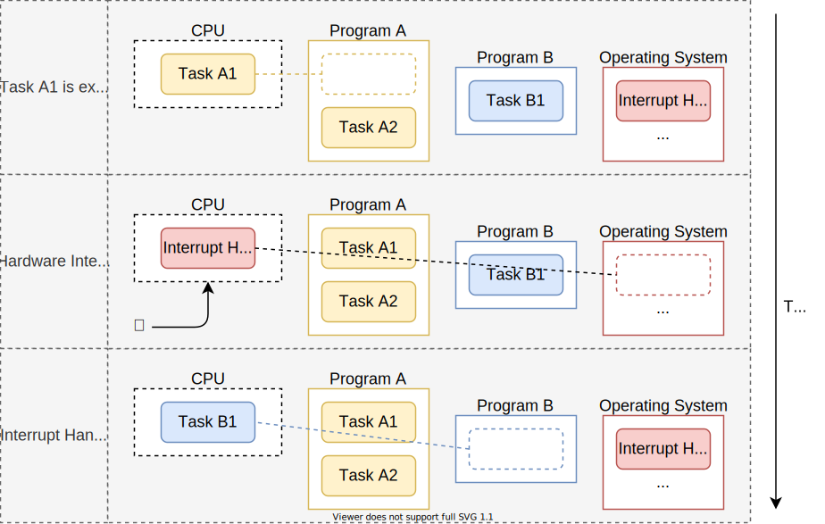
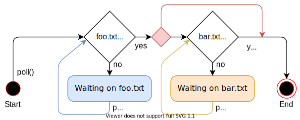
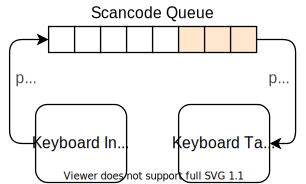

+++
title = "Async/Await"
weight = 12
path = "ja/async-await"
date = 2021-05-03

[extra]
chapter = "Multitasking"
+++

この記事では、Rustの _cooperative multitasking_ と _async/await_ 機能について説明します。Rustのasync/await機能については、`Future` trait の設計、ステートマシンの変換、 _pinning_ などを含めて詳しく説明します。そして、非同期キーボードタスクと基本的なexecutorを作成することで、カーネルにasync/awaitの基本的なサポートを追加します。

<!-- more -->

このブログは[GitHub]でオープンに開発されています。何か問題や質問があれば、そこで課題を開いてください。また、[下部]にコメントを残すこともできます。この記事の完全なソースコードは、[`post-12`][post branch]ブランチにあります。

[GitHub]: https://github.com/phil-opp/blog_os
[下部]: #comments
[post branch]: https://github.com/phil-opp/blog_os/tree/post-12

<!-- toc -->

## Multitasking

ほとんどのOSの基本機能のひとつに、複数のタスクを同時に実行できる[_multitasking_]というものがあります。例えば、この記事をご覧になっている間も、テキストエディタやターミナルウィンドウなど、他のプログラムを開いていることでしょう。また、ブラウザのウィンドウを1つだけ開いていたとしても、デスクトップのウィンドウを管理したり、アップデートをチェックしたり、ファイルのインデックスを作成したりと、さまざまなバックグラウンドタスクがあるはずです。

[_multitasking_]: https://en.wikipedia.org/wiki/Computer_multitasking

一見、すべてのタスクが並行して実行されているように見えますが、1つのCPUコアで同時に実行できるのは1つのタスクだけです。タスクが並列に実行されているように見せるために、OSは実行中のタスクを素早く切り替えて、それぞれのタスクが少しずつ進むようにしています。コンピュータは高速なので、ほとんどの場合、この切り替えに気づくことはありません。

シングルコアのCPUは一度に1つのタスクしか実行できませんが、マルチコアのCPUは複数のタスクを真の意味で並列に実行することができます。例えば、8コアのCPUであれば、8つのタスクを同時に実行することができます。マルチコアCPUの設定方法については、今後の記事でご紹介します。この記事では、わかりやすくするために、シングルコアのCPUに焦点を当てます。なお、マルチコアCPUは、最初は1つのアクティブコアしかないので、ここではシングルコアCPUとして扱うことにします)。

マルチタスクには2つの形態があります。cooperative multitaskingでは、タスクが定期的にCPUの制御を放棄することで、他のタスクの処理を進めます。preemptive multitaskingは、OSの機能を利用して、任意の時点でスレッドを強制的に一時停止させて切り替えるものです。以下では、この2つのマルチタスクについて、それぞれの長所と短所を説明します。

### Preemptive Multitasking

preemptive multitaskingの考え方は、タスクを切り替えるタイミングをOSが制御するというものです。そのためには、割り込みのたびにCPUの制御権がOS側に戻ってくることを利用します。これにより、システムに新しい入力があったときに、タスクを切り替えることができます。例えば、マウスを動かしたときやネットワークパケットが届いたときなどにタスクを切り替えることができます。OSは、ハードウェアのタイマーを設定して、その時間が経過したら割り込みを送るようにすることで、タスクの実行が許される正確な時間を決定することもできます。

hardware interruptでのタスク切り替え処理を下図に示します:



最初の行では、CPUがプログラム`A`のタスク`A1`を実行しています。他のすべてのタスクは一時停止しています。2行目では、CPUにhardware interruptが入ります。[_Hardware Interrupts_]の記事で説明したように、CPUは直ちにタスク`A1`の実行を停止し、割り込み記述子テーブル(IDT)に定義されている割り込みハンドラにジャンプします。この割り込みハンドラを介して、OSは再びCPUを制御できるようになり、タスク`A1`の継続ではなく、タスク`B1`に切り替えることができます。

[_Hardware Interrupts_]: @/edition-2/posts/07-hardware-interrupts/index.md

#### Saving State

タスクは任意の時点で中断されるため、計算の途中である可能性もあります。後で再開できるようにするために、OSは、タスクの[コールスタック]やすべてのCPUレジスタの値など、タスクの状態全体をバックアップする必要があります。この作業を[_context switch_]といいます。

[コールスタック]: https://en.wikipedia.org/wiki/Call_stack
[_context switch_]: https://en.wikipedia.org/wiki/Context_switch

コールスタックは非常に大きくなる可能性があるため、OSは通常、各タスクのスイッチでコールスタックの内容をバックアップする代わりに、各タスクに個別のコールスタックを設定します。このような独立したスタックを持つタスクは、[_thread of execution_](略して _thread_)と呼ばれます。タスクごとに独立したスタックを使用することで、コンテキスト・スイッチの際に保存する必要があるのはレジスタの内容だけになります(プログラム・カウンタとスタック・ポインタを含む)。この方法を取ることで、コンテキスト・スイッチの性能上のオーバーヘッドが最小限になります。これは、コンテキスト・スイッチが1秒間に100回も行われることがあるため、非常に重要なことです。

[_thread of execution_]: https://en.wikipedia.org/wiki/Thread_(computing)

#### Discussion

preemptive multitaskingの主な利点は、OSがタスクの許容実行時間を完全に制御できることです。これにより、各タスクが協力しなくても、CPU時間を公平に確保できることが保証されます。これは、サードパーティのタスクを実行する場合や、複数のユーザーがシステムを共有する場合に特に重要です。

preemptive multitaskingの欠点は、各タスクが独自のスタックを必要とすることです。共有スタックと比べると、タスクごとのメモリ使用量が多くなり、システム内のタスク数が制限されることが多くなります。また、タスクがレジスタの小さなサブセットしか使用していない場合でも、タスクが切り替わるたびにOSは常にCPUレジスタの状態を完全に保存しなければならないというデメリットもあります。

preemptive multitaskingとスレッドは、信頼されていないユーザースペース・プログラムの実行を可能にする、OSの基本的な構成要素です。これらの概念については、今後の記事で詳しく説明します。しかし今回は、カーネルにも有用な機能を提供するcooperative multitaskingに焦点を当てます。

### Cooperative Multitasking

cooperative multitaskingでは、実行中のタスクを任意のタイミングで強制的に停止させるのではなく、各タスクが自発的にCPUの制御を放棄するまで実行させます。これにより、例えば、I/O操作を待つ必要がある場合など、都合の良いタイミングでタスクを一時停止させることができます。

cooperative multitaskingは、言語レベルで使われることが多いです。具体的には、[coroutines]や[async/await]などの形で登場します。これは、プログラマやコンパイラがプログラムに[_yield_]操作を挿入することで、CPUの制御を放棄し、他のタスクを実行させるというものです。例えば、複雑なループの各反復の後に yield を挿入することができます。

[coroutines]: https://en.wikipedia.org/wiki/Coroutine
[async/await]: https://rust-lang.github.io/async-book/01_getting_started/04_async_await_primer.html
[_yield_]: https://en.wikipedia.org/wiki/Yield_(multithreading)

cooperative multitaskingと[asynchronous operations]を組み合わせるのが一般的です。asynchronous operations では、Operationが終了するまで待って、その間に他のタスクが実行できないようにする代わりに、操作がまだ終了していない場合は"not ready"というステータスを返します。この場合、待機中のタスクは yield operation を実行して他のタスクを実行させることができます。

[asynchronous operations]: https://en.wikipedia.org/wiki/Asynchronous_I/O

#### Saving State

タスクは自分で一時停止のポイントを決めるので、OSがタスクの状態を保存しなくてよくなります。その代わり、継続するのに必要になる状態だけを保存することができ、その結果、パフォーマンスが向上しがちです。例えば、複雑な計算を終えたばかりのタスクは、中間結果を必要としないため、計算の最終結果をバックアップするだけで済むかもしれません。

言語でサポートされている協調タスクの実装では、一時停止する前にコールスタックの必要な部分をバックアップすることもできます。例えば、Rustのasync/awaitの実装では、まだ必要なすべてのローカル変数を、自動的に生成された構造体に格納しています（以下参照）。一時停止の前にコールスタックの関連部分をバックアップすることで、すべてのタスクが単一のコールスタックを共有することができ、タスクごとのメモリ消費量が大幅に少なくなります。これにより、メモリ不足に陥ることなく、ほぼ任意の数の協調タスクを作成することができます。

#### Discussion

cooperative multitaskingの欠点は、非協力的なタスクが潜在的に無制限の時間実行できることです。そのため、悪意のあるタスクやバグのあるタスクが他のタスクの実行を妨げ、システム全体の速度を低下させたり、ブロックしたりすることがあります。このような理由から、cooperative multitaskingは、すべてのタスクが協調することがわかっている場合にのみ使用する必要があります。反例として、任意のユーザーレベルプログラムの協力にOSを依存させるのはよくありません。

しかし、cooperative multitaskingは、パフォーマンスやメモリの面で非常に優れているため、非同期処理と組み合わせて、プログラムの中で使用するのに適した手法です。OSのカーネルは、非同期のハードウェアとやりとりするパフォーマンスクリティカルなプログラムであるため、cooperative multitaskingは同時実行の実装に適したアプローチであると言えます。

## Async/Await in Rust

Rust言語は、async/awaitという形で協調的マルチタスクのファーストクラスのサポートを提供しています。async/awaitとは何か、どのように機能するのかを探る前に、Rustで _futures_ と非同期プログラミングがどのように機能するのかを理解する必要があります。

### Futures

_future_ は、まだ利用できない可能性のある値を表します。例えば、他のタスクで計算された整数や、ネットワークからダウンロードされたファイルなどが考えられます。futureは、値が利用可能になるまで待つのではなく、値が必要になるまで実行を続けることを可能にします。

#### Example

future の概念は、小さな例で説明するのが一番です:


このシーケンス図は、ファイルシステムからファイルを読み込み、関数 `foo` を呼び出す `main` 関数を示している。この処理は2回繰り返されます。同期的な `read_file` の呼び出しと、非同期的な `async_read_file` の呼び出しです。

同期呼び出しの場合、`main`関数はファイルシステムからファイルが読み込まれるまで待つ必要があります。それが終わって初めて、`foo`関数を呼び出すことができ、結果を再び待つ必要があります。

非同期の `async_read_file` 呼び出しでは、ファイルシステムが直接futureを返し、バックグラウンドで非同期にファイルをロードします。これにより、`main`関数は`foo`をより早く呼び出すことができ、`foo`はファイルのロードと並行して実行されます。この例では、ファイルのロードは `foo` が戻る前に終了しているので、`main` は `foo` が戻った後にさらに待つことなく、ファイルを直接処理することができます。

#### Futures in Rust

Rustでは、futuresは[`Future`]という trait で表され、次のようになります:

[`Future`]: https://doc.rust-lang.org/nightly/core/future/trait.Future.html

```rust
pub trait Future {
    type Output;
    fn poll(self: Pin<&mut Self>, cx: &mut Context) -> Poll<Self::Output>;
}
```

[関連型] `Output` は非同期値の型を指定します。例えば、上の図の `async_read_file` 関数は、`Output` を `File` に設定した `Future` インスタンスを返します。

[関連型]: https://doc.rust-lang.org/book/ch19-03-advanced-traits.html#specifying-placeholder-types-in-trait-definitions-with-associated-types

[`poll`]メソッドは、その値がすでに利用可能かどうかをチェックすることができます。このメソッドは、以下のような [`Poll`] 列挙体を返します。

[`poll`]: https://doc.rust-lang.org/nightly/core/future/trait.Future.html#tymethod.poll
[`Poll`]: https://doc.rust-lang.org/nightly/core/task/enum.Poll.html

```rust
pub enum Poll<T> {
    Ready(T),
    Pending,
}
```

値が既に利用可能な場合(例えば、ファイルがディスクから完全に読み込まれた場合)、その値は `Ready` variantにラップされて返されます。それ以外の場合は、`Pending` variantが返され、呼び出し側に値がまだ利用できないことを知らせます。

`poll`メソッドは2つの引数を取ります。`self: Pin<&mut Self>`と`cx: &mut Context`です。前者は通常の `&mut self` の参照のように動作しますが、`self` の値がそのメモリロケーションに [_pin_] されるという違いがあります。`Pin`とその必要性を理解するには、まずasync/awaitの仕組みを理解しなければなりません。そのため、この記事の後半で説明します。

[_pinned_]: https://doc.rust-lang.org/nightly/core/pin/index.html

`cx: &mut Context`パラメータの目的は、ファイルシステムのロードなどの非同期タスクに[`Waker`]インスタンスを渡すことです。この `Waker` によって、非同期タスクは自分（またはその一部）が終了したこと、例えばファイルがディスクから読み込まれたことを通知することができます。メインタスクは`Future`が準備できたら通知されることを知っているので、`poll`を何度も何度も呼び出す必要はありません。このプロセスについては、後ほど独自のwaker typeを実装する際に詳しく説明します。

[`Waker`]: https://doc.rust-lang.org/nightly/core/task/struct.Waker.html

### Working with Futures

futuresがどのように定義されているか、また、`poll`メソッドの基本的な考え方を理解しました。しかし、futuresを効果的に使う方法はまだわかっていません。問題は、futuresが非同期タスクの結果を表していて、それがまだ利用できない可能性があることです。しかし、実際には、これらの値が次の計算のために直接必要になることがよくあります。そこで問題となるのは、どうすれば効率的にfutureの値を取り出すことができるかということです。

#### Waiting on Futures

1つの可能な答えは、futureの準備が整うまで待つことです。これは次のようなものです:

```rust
let future = async_read_file("foo.txt");
let file_content = loop {
    match future.poll(…) {
        Poll::Ready(value) => break value,
        Poll::Pending => {}, // do nothing
    }
}
```

ここでは、`poll`をループで何度も呼び出すことで、futureを積極的に待つようにしています。`poll`の引数はここでは重要ではないので、省略しています。このソリューションは動作しますが、値が利用可能になるまでCPUを忙しくさせているので、非常に非効率的です。

より効率的なアプローチは、futureが利用可能になるまで現在のスレッドを **ブロック** することです。もちろん、これはスレッドがある場合にのみ可能なことで、この解決策は少なくとも現時点では、私たちのカーネルでは機能しません。ブロッキングがサポートされているシステムでも、非同期タスクが再び同期タスクになってしまい、並列タスクの潜在的なパフォーマンスの利点が阻害されてしまうため、ブロッキングは好まれません。

#### Future Combinators

待機する代わりに、future combinatorsを使うこともできます。future combinatorsは `map` のようなメソッドで、[`Iterator`] のメソッドと同じように、futureを連鎖させたり組み合わせたりすることができます。futureを待つのではなく、これらのcombinatorsはfuture自身を返し、`poll`のマッピング操作を適用します。

[`Iterator`]: https://doc.rust-lang.org/stable/core/iter/trait.Iterator.html

例として、`Future<Output = String>`を`Future<Output = usize>`に変換するためのシンプルな`string_len`コンビネーターは次のようになります

```rust
struct StringLen<F> {
    inner_future: F,
}

impl<F> Future for StringLen<F> where F: Future<Output = String> {
    type Output = usize;

    fn poll(mut self: Pin<&mut Self>, cx: &mut Context<'_>) -> Poll<T> {
        match self.inner_future.poll(cx) {
            Poll::Ready(s) => Poll::Ready(s.len()),
            Poll::Pending => Poll::Pending,
        }
    }
}

fn string_len(string: impl Future<Output = String>)
    -> impl Future<Output = usize>
{
    StringLen {
        inner_future: string,
    }
}

// Usage
fn file_len() -> impl Future<Output = usize> {
    let file_content_future = async_read_file("foo.txt");
    string_len(file_content_future)
}
```

このコードは、[_pinning_]を扱っていないので、完全には動作しませんが、例としては十分です。基本的なアイデアは、`string_len` 関数が、与えられた `Future` インスタンスを、新しい `StringLen` 構造体にラップするというもので、この構造体も `Future` を実装しています。ラップされたfutureがポーリングされると、内部のfutureをポーリングします。値がまだ準備できていない場合は、ラップされたfutureからも `Poll::Pending` が返されます。値の準備ができていれば、`Poll::Ready` variantから文字列が抽出され、その長さが計算されます。その後、再び `Poll::Ready` にラップされて返されます。

[_pinning_]: https://doc.rust-lang.org/stable/core/pin/index.html

この`string_len`関数を使えば、非同期の文字列を待つことなく、その長さを計算することができます。この関数は再び`Future`を返すので、呼び出し側は返された値を直接扱うことはできず、再びコンビネータ関数を使う必要があります。このようにして、コールグラフ全体が非同期になり、どこかの時点で、例えばmain関数の中で、一度に複数のfutureを効率的に待つことができるようになりました。

combinator関数を手動で書くのは難しいので、ライブラリで提供されることが多いです。Rustの標準ライブラリ自体はまだcombinatorのメソッドを提供していませんが、半公式(かつ`no_std`互換)の[`futures`]クレートは提供しています。その[`FutureExt`] traitは、[`map`]や[`then`]といった高レベルのコンビネータメソッドを提供しており、これを使って任意のクロージャで結果を操作することができます。

[`futures`]: https://docs.rs/futures/0.3.4/futures/
[`FutureExt`]: https://docs.rs/futures/0.3.4/futures/future/trait.FutureExt.html
[`map`]: https://docs.rs/futures/0.3.4/futures/future/trait.FutureExt.html#method.map
[`then`]: https://docs.rs/futures/0.3.4/futures/future/trait.FutureExt.html#method.then

##### Advantages

future combinatorsの大きな利点は、Operationを非同期に保つことができることです。非同期I/Oインターフェイスと組み合わせることで、このアプローチは非常に高いパフォーマンスを実現します。future combinatorsは通常の構造体として実装されていますが、traitの実装があるため、そのおかげで、コンパイラはこれを非常によく最適化できます。詳細については、Rustのエコシステムにfuturesが追加されたことを発表した[_Zero-cost futures in Rust_]の記事を参照してください。

[_Zero-cost futures in Rust_]: https://aturon.github.io/blog/2016/08/11/futures/

##### Drawbacks

future combinatorsを使うと、非常に効率的なコードを書くことができますが、型システムやクロージャベースのインターフェイスのため、状況によっては使いにくいことがあります。例えば、次のようなコードを考えてみましょう:

```rust
fn example(min_len: usize) -> impl Future<Output = String> {
    async_read_file("foo.txt").then(move |content| {
        if content.len() < min_len {
            Either::Left(async_read_file("bar.txt").map(|s| content + &s))
        } else {
            Either::Right(future::ready(content))
        }
    })
}
```

([Try it on the playground](https://play.rust-lang.org/?version=stable&mode=debug&edition=2018&gist=91fc09024eecb2448a85a7ef6a97b8d8))

ここでは、ファイル `foo.txt` を読み込んでから、[`then`] コンビネータを使って、ファイルの内容に基づいて 2 番目の future を連鎖させています。もしコンテンツの長さが与えられた `min_len` よりも小さければ、別の `bar.txt` ファイルを読み込んで、[`map`] コンビネータを使って `content` に追加します。それ以外の場合は、`foo.txt` の内容のみを返します。

そうしないと `min_len` のライフタイムエラーが発生してしまうので、`then` に渡すクロージャには [`move` キーワード]を使用する必要があります。[`Either`] ラッパーを使う理由は、if と else のブロックは常に同じ型でなければならないからです。ブロックの中で異なるfutureの型を返しているので、ラッパーの型を使って単一の型に統一する必要があります。[`ready`] 関数とは、もう既に手元にあるデータを、『一瞬で準備の完了するfuture』へと変換する関数です。`Either` ラッパーはラップされた値が`Future`を実装していることを期待しているので、ここではこの関数が必要です。

[`move` キーワード]: https://doc.rust-lang.org/std/keyword.move.html
[`Either`]: https://docs.rs/futures/0.3.4/futures/future/enum.Either.html
[`ready`]: https://docs.rs/futures/0.3.4/futures/future/fn.ready.html

ご想像のとおり、大規模なプロジェクトでは非常に複雑なコードになることがあります。特に、借用や異なるライフタイムが関係する場合は複雑になります。このような理由から、Rustにasync/awaitのサポートを追加するために多くの作業が行われ、非同期のコードを圧倒的にシンプルに書くことができるようになりました。

### The Async/Await Pattern

async/awaitの背後にある考え方は、プログラマが、見た目は通常の同期コードのように見えるが、コンパイラによって非同期コードに変換されるコードを書かせることです。これは `async` と `await` という2つのキーワードに基づいて動作します。キーワード `async` は、関数のシグネチャの中で使用することができ、同期関数を、futureの値を返す非同期関数に変えることができます:

```rust
async fn foo() -> u32 {
    0
}

// the above is roughly translated by the compiler to:
fn foo() -> impl Future<Output = u32> {
    future::ready(0)
}
```

このキーワードだけではそれほど便利ではありません。しかし、`async`関数の中では、`await`キーワードを使って、futureの値を非同期に取得することができます:

```rust
async fn example(min_len: usize) -> String {
    let content = async_read_file("foo.txt").await;
    if content.len() < min_len {
        content + &async_read_file("bar.txt").await
    } else {
        content
    }
}
```

([Try it on the playground](https://play.rust-lang.org/?version=stable&mode=debug&edition=2018&gist=d93c28509a1c67661f31ff820281d434))

この関数は、[上記](#drawbacks)のcombinator関数を使った `example` 関数をそのまま翻訳したものです(#欠点). `.await` 演算子を使うことで、クロージャや `Either` 型を必要とせずに future の値を取得することができます。その結果、通常の同期コードを書くようにコードを書くことができます。ただし、「これは非同期コードである」という違いはあります。

#### State Machine Transformation

舞台裏で何をしているかというと、`async`関数の本体を[_state machine_]に変換し、`.await`を呼び出すたびに異なる状態を表すようにしています。上記の `example` 関数の場合、コンパイラは以下の4つの状態を持つステートマシンを作成します:

[_state machine_]: https://en.wikipedia.org/wiki/Finite-state_machine


各ステートは、関数の異なるpause pointを表しています。 _"Start"_ と _"End"_ の状態は、関数の実行開始時と終了時を表しています。 _"Waiting on foo.txt"_ の状態は、関数が最初の`async_read_file` の結果を待っていることを表しています。同様に、 _"Waiting on bar.txt"_ 状態は、関数が2つ目の`async_read_file`の結果を待っているpause pointを表しています。

ステートマシンは、各 `poll` コールを可能な状態遷移とすることで、`Future` 特性を実装しています:



この図では、矢印で状態の切り替えを、ダイヤ形で条件分岐を表現しています。例えば、`foo.txt`のファイルが準備できていない場合、 _"no"_ と書かれたパスが取られ、 _"Waiting on foo.txt"_ の状態になります。それ以外の場合は、 _"yes"_ のパスが取られます。キャプションのない小さな赤いダイヤは、`example`関数の`if content.len() < 100`の分岐を表しています。

最初の `poll` 呼び出しで関数が開始され、まだ準備ができていないfutureに到達するまで実行されていることがわかります。パス上のすべてのfutureが準備できていれば、関数は _"End"_ 状態まで実行でき、そこで結果を `Poll::Ready` でラップして返します。そうでなければ、ステートマシンは待機状態になり、`Poll::Pending`を返します。次の `poll` 呼び出し時には、ステートマシンは最後の待ち状態から開始し、最後の操作を再試行します。

#### Saving State

最後に待機していた状態から継続できるようにするために、ステートマシンは現在の状態を内部的に追跡する必要があります。さらに、次の `poll` 呼び出しで実行を継続するために必要なすべての変数を保存する必要があります。ここでコンパイラが威力を発揮します。コンパイラは、どの変数がいつ使われるかを知っているので、必要な変数だけを持つ構造体を自動的に生成することができます。

例として、コンパイラは上記の `example` 関数に対して以下のような構造体を生成します:

```rust
// The `example` function again so that you don't have to scroll up
async fn example(min_len: usize) -> String {
    let content = async_read_file("foo.txt").await;
    if content.len() < min_len {
        content + &async_read_file("bar.txt").await
    } else {
        content
    }
}

// The compiler-generated state structs:

struct StartState {
    min_len: usize,
}

struct WaitingOnFooTxtState {
    min_len: usize,
    foo_txt_future: impl Future<Output = String>,
}

struct WaitingOnBarTxtState {
    content: String,
    bar_txt_future: impl Future<Output = String>,
}

struct EndState {}
```

"start "と _"Waiting on foo.txt"_ の状態では、`min_len`パラメータを保存する必要があります。これは後に`content.len()`と比較する際に必要になるからです。 _"Waiting on foo.txt"_ 状態では、さらに`foo_txt_future`が格納されます。これは、`async_read_file`コールが返したfutureを表します。このfutureは、ステートマシンが継続する際に再びポーリングされる必要があるため、保存する必要があります。

_"Waiting on bar.txt"_ の状態には、`bar.txt`の準備ができた後の文字列の連結に必要な`content`変数が含まれています。また、`bar.txt`のロード中を表す`bar_txt_future`も格納されています。この構造体には、`min_len`変数は含まれていません。これは、`content.len()`の比較の後では、もはや必要ないからです。 _"end"_ の状態では、関数はすでに完了まで実行されているので、変数は格納されません。

コンパイラが生成しうるコードの一例に過ぎないことに注意してください。構造体の名前やフィールドのレイアウトは実装上の詳細であり、異なる可能性があります。

#### The Full State Machine Type

具体的にコンパイラがどのようなコードを生成するのかは実装依存ですが、`example` 関数に対してどのようなステートマシンが生成されうるかを想像することは、理解を助けることになります。異なる状態を表し、必要な変数を含む構造体はすでに定義されています。これらの構造体の上にステートマシンを作成するという方法があります。これらの構造体を[`enum`]構造体にまとめることができます:

[`enum`]: https://doc.rust-lang.org/book/ch06-01-defining-an-enum.html

```rust
enum ExampleStateMachine {
    Start(StartState),
    WaitingOnFooTxt(WaitingOnFooTxtState),
    WaitingOnBarTxt(WaitingOnBarTxtState),
    End(EndState),
}
```

各状態に対応して個別のenum variantを定義し、対応するstate構造体をフィールドとして各variantに追加しています。状態の遷移を実装するために、コンパイラは `example` 関数に基づいて `Future` traitの実装を生成します:

```rust
impl Future for ExampleStateMachine {
    type Output = String; // return type of `example`

    fn poll(self: Pin<&mut Self>, cx: &mut Context) -> Poll<Self::Output> {
        loop {
            match self { // TODO: handle pinning
                ExampleStateMachine::Start(state) => {…}
                ExampleStateMachine::WaitingOnFooTxt(state) => {…}
                ExampleStateMachine::WaitingOnBarTxt(state) => {…}
                ExampleStateMachine::End(state) => {…}
            }
        }
    }
}
```

関数 `example` の戻り値であるため、futureの `Output` タイプは `String` となります。`poll`関数を実装するために、`loop` の中で現在の状態に対するmatch文を使います。これは、可能な限り次の状態に切り替え、継続できないときには明示的に `return Poll::Pending` を使用するというものです。

簡略化のため、簡略化したコードのみを示し、[pinning][_pinning_]、所有権、寿命などは扱っていません。そのため、このコードと以下のコードは疑似コードとして扱い、直接使用しないでください。もちろん、実際にコンパイラが生成したコードは、おそらく異なる方法ではあるものの、すべてを正しく処理します。

コードの抜粋を少なくするために、各match armのコードを別々に紹介します。まず、`Start`の状態から始めましょう:

```rust
ExampleStateMachine::Start(state) => {
    // from body of `example`
    let foo_txt_future = async_read_file("foo.txt");
    // `.await` operation
    let state = WaitingOnFooTxtState {
        min_len: state.min_len,
        foo_txt_future,
    };
    *self = ExampleStateMachine::WaitingOnFooTxt(state);
}
```

関数の冒頭ではステートマシンが `Start` 状態にあります。この例では、`example`関数のボディから最初の`.await`までのすべてのコードを実行します。`.await`の操作を処理するために、`self`ステートマシンの状態を`WaitingOnFooTxt`に変更し、`WaitingOnFooTxtState`構造体の構築を行います。

`match self {...}`Hogeステートメントはループで実行されるため、実行は次に `WaitingOnFooTxt` アームにジャンプします:

```rust
ExampleStateMachine::WaitingOnFooTxt(state) => {
    match state.foo_txt_future.poll(cx) {
        Poll::Pending => return Poll::Pending,
        Poll::Ready(content) => {
            // from body of `example`
            if content.len() < state.min_len {
                let bar_txt_future = async_read_file("bar.txt");
                // `.await` operation
                let state = WaitingOnBarTxtState {
                    content,
                    bar_txt_future,
                };
                *self = ExampleStateMachine::WaitingOnBarTxt(state);
            } else {
                *self = ExampleStateMachine::End(EndState));
                return Poll::Ready(content);
            }
        }
    }
}
```

このマッチアームでは、まず `foo_txt_future` の `poll` 関数を呼び出します。もし準備ができていなければ、ループを抜けて `Poll::Pending` を返します。この場合、`self`は`WaitingOnFooTxt`状態のままなので、ステートマシンの次の`poll`コールは同じマッチアームに入り、`foo_txt_future`のポーリングを再試行することになります。

`foo_txt_future`の準備ができたら、その結果を`content`変数に代入して、引き続き`example`関数のコードを実行します。`content.len()`がstate構造体に保存されている`min_len`よりも小さければ、`bar.txt`ファイルが非同期に読み込まれます。`.await`の操作を再び状態の変化に変換し、今回は`WaitingOnBarTxt`の状態にします。ループ内で `match` を実行しているので、実行はその後の新しい状態のマッチアームに直接ジャンプし、そこで `bar_txt_future` がポーリングされます。

`else`の分岐に入った場合、それ以上の`.await`操作は発生しません。関数の最後に到達して、`Poll::Ready`で包まれた`content`を返します。また、現在の状態を `End` に変更します。

`WaitingOnBarTxt`ステートのコードは以下のようになります:

```rust
ExampleStateMachine::WaitingOnBarTxt(state) => {
    match state.bar_txt_future.poll(cx) {
        Poll::Pending => return Poll::Pending,
        Poll::Ready(bar_txt) => {
            *self = ExampleStateMachine::End(EndState));
            // from body of `example`
            return Poll::Ready(state.content + &bar_txt);
        }
    }
}
```

`WaitingOnFooTxt`の状態と同様に、まず`bar_txt_future`をポーリングします。まだ保留中であれば、ループを抜けて `Poll::Pending` を返します。そうでなければ、`example`関数の最後の操作(つまり、`content`変数とfutureからの結果を連結します)を行います。ステートマシンを `End` 状態に更新して、`Poll::Ready` で包まれた結果を返します。

最後に、`End`ステートのコードは以下のようになります:

```rust
ExampleStateMachine::End(_) => {
    panic!("poll called after Poll::Ready was returned");
}
```

Futuresは `Poll::Ready` を返した後、再びポーリングされるべきではありません。したがって、すでに `End` の状態にあるときに `poll` が呼ばれるとパニックするようにしましょう。

これで、コンパイラが生成するステートマシンとその `Future` traitの実装がどのように見えるかがわかりました。実際には、コンパイラは異なる方法でコードを生成しています。 (一応、現在は[_generators_]をベースにした実装になっていますが、これはあくまでも実装の詳細です。)

[_generators_]: https://doc.rust-lang.org/nightly/unstable-book/language-features/generators.html

パズルの最後のピースは、生成された `example` 関数自体のコードです。関数のヘッダは次のように定義されていたことを思い出してください:

```rust
async fn example(min_len: usize) -> String
```

関数本体はステートマシンによって完全に実装されているので、関数に必要なことはステートマシンを初期化して返すことだけになります。このための生成コードは次のようになります:

```rust
fn example(min_len: usize) -> ExampleStateMachine {
    ExampleStateMachine::Start(StartState {
        min_len,
    })
}
```

この関数は、`async`修飾子を持たなくなり、`Future` traitを実装した`ExampleStateMachine`型を明示的に返すようになりました。予想通り、ステートマシンは `Start` 状態で構築され、対応するステート構造体は `min_len` パラメータで初期化されます。

この関数は、ステートマシンの実行を開始しないことに注意してください。これは『最初にポーリングされるまで何もしない』という、Rustにおけるfuturesの基本的な設計上の決定を反映したものです。

### Pinning

この記事の中で、すでに何度も「ピン留め」について触れています。今こそ、ピン留めとは何か、なぜピン留めが必要なのかを探る時です。

#### Self-Referential Structs

上で説明したように、ステートマシン変換では、各ポーズポイントのローカル変数を構造体に格納します。私たちの `example` 関数のような小さな例では、これは簡単で、特に問題にはなりませんでした。しかし、変数が相互に参照し合う場合には、問題が難しくなります。例えば、次の関数を考えてみましょう:

```rust
async fn pin_example() -> i32 {
    let array = [1, 2, 3];
    let element = &array[2];
    async_write_file("foo.txt", element.to_string()).await;
    *element
}
```

この関数は、内容が `1`, `2`, `3` の小さな `array` を作成します。そして、配列の最後の要素への参照を作成し、それを `element` 変数に格納します。次に、文字列に変換された数値を非同期的に `foo.txt` ファイルに書き込みます。最後に、`element`で参照していた数値を返します。

この関数は単一の `await` オペレーションを使用するため、結果として得られるステートマシンには start、end、"waiting on write" の 3 つの状態があります。この関数は引数を取らないので、開始状態の構造体は空です。先ほどと同じように、この時点で関数は終了しているので、終了状態の構造体も空になります。"waiting on write"の状態を表す構造体はもっと面白いです:

```rust
struct WaitingOnWriteState {
    array: [1, 2, 3],
    element: 0x1001c, // address of the last array element
}
```

戻り値には `element` が必要であり、 `array` は `element` によって参照されるので、`array` と `element` の両方の変数を格納する必要があります。`element`は参照なので、参照されている要素への **ポインタ** (つまり、メモリ上のアドレス)を格納します。ここでは、メモリアドレスの例として、`0x1001c` を使用しました。実際には、`array`フィールドの最後の要素のアドレスである必要がありますので、構造体がメモリ内のどこに存在するかに依存します。このような内部ポインタを持つ構造体は、フィールドの1つから自分自身を参照するため、 _self-referential_ 構造体と呼ばれます。

#### The Problem with Self-Referential Structs

自己参照構造体の内部ポインタには根本的な問題があり、それは構造体のメモリレイアウトを見ると明らかになります:


`array`フィールドはアドレス0x10014から始まり、`element`フィールドはアドレス0x10020から始まります。最後の配列要素がこのアドレスにあるので、アドレス0x1001cを指しています。この時点では、まだすべてが順調です。しかし、この構造体を別のメモリアドレスに移動させると問題が発生します:


構造体を少し移動して、現在はアドレス `0x10024` から始まるようにしました。これは、構造体を関数の引数として渡したり、別のスタック変数に代入したりしたときに起こります。問題は、最後の `array` 要素が `0x1002c` 番地にあるにもかかわらず、`element` フィールドが `0x1001c` 番地を指していることです。そのため、ポインタがぶら下がり、次の `poll` 呼び出し時に未定義の動作が発生してしまいます。

#### Possible Solutions

dangling pointer問題を解決するための基本的なアプローチは3つあります:

- **Update the pointer on move:** このアイデアは、構造体がメモリ内で移動するたびに内部ポインタを更新し、移動後も有効になるようにするものです。残念ながら、この方法では Rust に大規模な変更を加える必要があり、その結果、パフォーマンスが大幅に低下する可能性があります。その理由は、ある種のランタイムがすべての構造体フィールドの型を追跡し、移動操作のたびにポインタの更新が必要かどうかをチェックする必要があるからです。
- **Store an offset instead of self-references:**: ポインタを更新する必要性を回避するために、コンパイラは自己参照を構造体の先頭からのオフセットとして格納することを試みるという手があります。例えば、上記の `WaitingOnWriteState` 構造体の `element` フィールドは、値が 8 の `element_offset` フィールドの形で保存できます。これは、参照先の配列要素が構造体の先頭から 8 バイト後に始まるからです。構造体を移動してもオフセットは変わらないので、フィールドの更新は必要ありません。

  このアプローチの問題点は、コンパイラがすべての自己参照を検出する必要があることです。これは、参照の値がユーザーの入力に依存する可能性があるため、コンパイル時には不可能です。そのため、参照を分析して状態構造体を正しく作成するために、再びランタイムシステムが必要になります。これではランタイムのコストがかかるだけでなく、コンパイラの最適化もできないため、再び大きなパフォーマンスの低下を招くことになります。
- **Forbid moving the struct:** 上で見たように、ポインタがぶら下がるのは、構造体をメモリ上で移動させたときだけです。自己参照構造体の移動操作を完全に禁止することで、この問題も回避することができます。この方法の大きな利点は、ランタイムの追加コストなしに、型システムレベルで実装できることです。欠点は、自己参照構造体の移動操作を処理する負担がプログラマにかかってしまうことです。

_zero cost abstractions_ を提供するというRustの理念から、Rustは3つ目の解決策を選択しました。そのために [RFC2349](https://github.com/rust-lang/rfcs/blob/master/text/2349-pin.md) で提案されたのが [_pinning_] APIです。以下では、このAPIの概要を説明し、async/awaitやfuturesでどのように動作するかを説明します。

#### Heap Values

まず最初に、[heap確保]された値は、ほとんどの場合、すでに固定のメモリアドレスを持っているということです。これらの値は、`allocate` の呼び出しで作成され、`Box<T>`のようなポインタ型で参照されます。pointer typeを移動することは可能ですが、ポインタが指すheap値は、再び `deallocate` 呼び出しで解放されるまで、同じメモリアドレスに留まります。

[heap allocated]: @/edition-2/posts/10-heap-allocation/index.md

heapの割り当てを利用して、自己参照型の構造体を作成してみましょう:

```rust
fn main() {
    let mut heap_value = Box::new(SelfReferential {
        self_ptr: 0 as *const _,
    });
    let ptr = &*heap_value as *const SelfReferential;
    heap_value.self_ptr = ptr;
    println!("heap value at: {:p}", heap_value);
    println!("internal reference: {:p}", heap_value.self_ptr);
}

struct SelfReferential {
    self_ptr: *const Self,
}
```

([Try it on the playground][playground-self-ref])

[playground-self-ref]: https://play.rust-lang.org/?version=stable&mode=debug&edition=2018&gist=ce1aff3a37fcc1c8188eeaf0f39c97e8

`SelfReferential` という名前のシンプルな構造体を作成します。この構造体には1つのポインタフィールドが含まれます。まず、この構造体をNULLポインタで初期化し、`Box::new`を使ってheap上に確保します。次に、heapに割り当てられた構造体のメモリアドレスを決定し、それを `ptr` 変数に格納します。最後に、`ptr`変数を`self_ptr`フィールドに代入して、構造体を自己参照にします。

このコードを[playground][playground-self-ref]で実行すると、heap値のアドレスとその内部ポインタが等しいことがわかります。これは、`self_ptr`フィールドが有効な自己参照であることを意味します。`heap_value` 変数は単なるポインタなので、それを移動させても（例えば関数に渡しても）構造体自体のアドレスは変わらないので、ポインタを移動させても`self_ptr`は有効なままです。

しかし、この例を破る方法はまだあります。`Box<T>`から移動したり、その内容を置き換えたりすることができます:

```rust
let stack_value = mem::replace(&mut *heap_value, SelfReferential {
    self_ptr: 0 as *const _,
});
println!("value at: {:p}", &stack_value);
println!("internal reference: {:p}", stack_value.self_ptr);
```

([Try it on the playground](https://play.rust-lang.org/?version=stable&mode=debug&edition=2018&gist=e160ee8a64cba4cebc1c0473dcecb7c8))

ここでは、[`mem::replace`]関数を使用して、heapに割り当てられた値を新しい構造体のインスタンスで置き換えています。これにより、元の `heap_value` をスタックに移動させることができますが、構造体の `self_ptr` フィールドは、古いheapアドレスを指し示すダングリングポインタになっています。この例をプレイグラウンドで実行してみると、印刷された _"value at:"_ と _"internal reference:"_ の行には、実際に異なるポインタが表示されていることがわかります。つまり、値をheapに割り当てるだけでは、自己参照を安全にするには不十分なのです。

[`mem::replace`]: https://doc.rust-lang.org/nightly/core/mem/fn.replace.html

上記の破損を許した根本的な問題は、`Box<T>`によって、heapに割り当てられた値への`&mut T`参照を得ることができることです。この `&mut` 参照によって、 [`mem::replace`] や [`mem::swap`] などのメソッドを使って、heapに割り当てられた値を無効にすることが可能になります。この問題を解決するためには、自己参照構造体への `&mut` 参照が作成できないようにする必要があります。

[`mem::swap`]: https://doc.rust-lang.org/nightly/core/mem/fn.swap.html

#### `Pin<Box<T>>` and `Unpin`

pinning APIは、[`Pin`]ラッパー型と[`Unpin`]マーカー特性という形で、`&mut T`問題に対する解決策を提供します。これらの型の背景にある考え方は、ラップされた値への `&mut` 参照を取得するために使用できる `Pin` のすべてのメソッド (例えば、[`get_mut`][pin-get-mut] や [`deref_mut`][pin-deref-mut]) を `Unpin` trait にゲートすることです。`Unpin` traitは[_auto trait_]であり、明示的にオプトアウトした型を除くすべての型に対して自動的に実装されます。自己参照構造体は `Unpin` をオプトアウトすることで、`Pin<Box<T>>` 型から `&mut T` を得る (安全な) 方法がありません。その結果、それらの内部の自己参照が有効であることが保証されます。

[`Pin`]: https://doc.rust-lang.org/stable/core/pin/struct.Pin.html
[`Unpin`]: https://doc.rust-lang.org/nightly/std/marker/trait.Unpin.html
[pin-get-mut]: https://doc.rust-lang.org/nightly/core/pin/struct.Pin.html#method.get_mut
[pin-deref-mut]: https://doc.rust-lang.org/nightly/core/pin/struct.Pin.html#impl-DerefMut
[_auto trait_]: https://doc.rust-lang.org/reference/special-types-and-traits.html#auto-traits

例として、上記の `SelfReferential` タイプを更新して、`Unpin` を除外してみましょう:

```rust
use core::marker::PhantomPinned;

struct SelfReferential {
    self_ptr: *const Self,
    _pin: PhantomPinned,
}
```

そこで、[`PhantomPinned`]型の2つ目の `_pin` フィールドを追加することでオプトアウトします。この型はゼロサイズのマーカー型で、`Unpin` trait を実装**しない**ようにすることだけが目的です。[auto traits][_auto trait_]の仕組み上、`Unpin`ではない1つのフィールドがあれば、構造体全体が`Unpin`をオプトアウトするのに十分です。

[`PhantomPinned`]: https://doc.rust-lang.org/nightly/core/marker/struct.PhantomPinned.html

第二のステップは、例題の `Box<SelfReferential>` 型を `Pin<Box<SelfReferential>>` 型に変更することです。これを行う最も簡単な方法は、heapに割り当てられた値を作成するために、[Box::new`]ではなく、[Box::pin`]関数を使用することです:

[`Box::pin`]: https://doc.rust-lang.org/nightly/alloc/boxed/struct.Box.html#method.pin
[`Box::new`]: https://doc.rust-lang.org/nightly/alloc/boxed/struct.Box.html#method.new

```rust
let mut heap_value = Box::pin(SelfReferential {
    self_ptr: 0 as *const _,
    _pin: PhantomPinned,
});
```

`Box::new` を `Box::pin` に変更することに加えて、構造体のイニシャライザに新しい `_pin` フィールドを追加する必要があります。`PhantomPinned` はゼロサイズの型なので、初期化に必要なのはその型名だけです。

今、[調整した例を実行してみると](https://play.rust-lang.org/?version=stable&mode=debug&edition=2018&gist=961b0db194bbe851ff4d0ed08d3bd98a)、もう動作しないことがわかります:

```
error[E0594]: cannot assign to data in a dereference of `std::pin::Pin<std::boxed::Box<SelfReferential>>`
  --> src/main.rs:10:5
   |
10 |     heap_value.self_ptr = ptr;
   |     ^^^^^^^^^^^^^^^^^^^^^^^^^ cannot assign
   |
   = help: trait `DerefMut` is required to modify through a dereference, but it is not implemented for `std::pin::Pin<std::boxed::Box<SelfReferential>>`

error[E0596]: cannot borrow data in a dereference of `std::pin::Pin<std::boxed::Box<SelfReferential>>` as mutable
  --> src/main.rs:16:36
   |
16 |     let stack_value = mem::replace(&mut *heap_value, SelfReferential {
   |                                    ^^^^^^^^^^^^^^^^ cannot borrow as mutable
   |
   = help: trait `DerefMut` is required to modify through a dereference, but it is not implemented for `std::pin::Pin<std::boxed::Box<SelfReferential>>`
```

どちらのエラーも、`Pin<Box<SelfReferential>>` 型が `DerefMut` trait を実装しなくなったために発生します。これはまさに求めていた結果であり、というのも、`DerefMut` trait は `&mut` 参照を返してしまうからで、これを防ぎたいのです。これは、`Unpin` をオプトアウトして、`Box::new` を `Box::pin` に変更したからこそ起こる現象です。

ここで問題になるのは、コンパイラが16行目の型の移動を禁止するだけでなく、10行目の`self_ptr`フィールドの初期化も禁止してしまうことです。これは、コンパイラが `&mut` 参照の有効な使用と無効な使用を区別できないために起こります。初期化を再開するには、安全ではない [get_unchecked_mut`] メソッドを使用する必要があります:

[`get_unchecked_mut`]: https://doc.rust-lang.org/nightly/core/pin/struct.Pin.html#method.get_unchecked_mut

```rust
// フィールドを変更しても構造体全体が移動するわけではないので、安全です。
unsafe {
    let mut_ref = Pin::as_mut(&mut heap_value);
    Pin::get_unchecked_mut(mut_ref).self_ptr = ptr;
}
```

([Try it on the playground](https://play.rust-lang.org/?version=stable&mode=debug&edition=2018&gist=b9ebbb11429d9d79b3f9fffe819e2018))

[`get_unchecked_mut`] 関数は `Pin<Box<T>>` ではなく `Pin<&mut T>` で動作するため、事前に値の変換に [`Pin::as_mut`] を使用する必要があります。その後、`get_unchecked_mut` が返す `&mut` 参照を使って、`self_ptr` フィールドを設定することができます。

[`Pin::as_mut`]: https://doc.rust-lang.org/nightly/core/pin/struct.Pin.html#method.as_mut

これで残された唯一のエラーは、`mem::replace`での望ましいエラーです。この操作は、heapに割り当てられた値をスタックに移動させようとするもので、`self_ptr` フィールドに格納されている自己参照を破壊することになります。`Unpin`を使用せず、`Pin<Box<T>>` を使用することで、コンパイル時にこの操作を防ぐことができ、自己参照構造体を安全に扱うことができます。先ほど見たように、コンパイラは自己参照の生成が安全であることを(まだ)証明することができないので、unsafe ブロックを使用して、自分で正しさを検証する必要があります。

#### Stack Pinning and `Pin<&mut T>`

前のセクションでは、`Pin<Box<T>>` を使って、heapに割り当てられた自己参照の値を安全に作成する方法を学びました。この方法は(安全でない構造を除けば)うまく機能し、比較的安全ですが、必要なheapの割り当てにはパフォーマンス上のコストがかかります。Rust は常に可能な限り _zero-cost abstractions_ を提供したいと考えていますので、pinning API では、スタックに割り当てられた値を指す `Pin<&mut T>` インスタンスを作成することもできます。

ラップされた値の所有権を持つ `Pin<Box<T>>` インスタンスとは異なり、`Pin<&mut T>` インスタンスはラップされた値を一時的に借りるだけです。これは、プログラマーが自分で追加の保証をする必要があるため、事態をより複雑にしています。最も重要なことは、`Pin<&mut T>` は、参照される `T` のライフタイム全体にわたって固定されていなければならないということですが、これはスタックベースの変数の場合には検証が困難です。この問題を解決するために、[`pin-utils`]のような crate が存在しますが、自分が何をしているかを本当に理解していない限り、スタックへの固定はお勧めできません。

[`pin-utils`]: https://docs.rs/pin-utils/0.1.0-alpha.4/pin_utils/

詳しくは、[`pin` module]と[`Pin::new_unchecked`]メソッドのドキュメントをご覧ください。

[`pin` module]: https://doc.rust-lang.org/nightly/core/pin/index.html
[`Pin::new_unchecked`]: https://doc.rust-lang.org/nightly/core/pin/struct.Pin.html#method.new_unchecked

#### Pinning and Futures

この記事ですでに見たように、[`Future::poll`]メソッドは、`Pin<&mut Self>`パラメータの形でピンを使用しています:

[`Future::poll`]: https://doc.rust-lang.org/nightly/core/future/trait.Future.html#tymethod.poll

```rust
fn poll(self: Pin<&mut Self>, cx: &mut Context) -> Poll<Self::Output>
```

このメソッドが通常の`&mut self`ではなく`self: Pin<&mut Self>`を取る理由は、[上][self-ref-async-await]で見たように、async/awaitから生成されるfutureのインスタンスは自己参照構造体です。`Self` を `Pin` にラップして、async/await から生成された自己参照のfuturesに対して、コンパイラに `Unpin` を選択させることで、`poll` 呼び出しの間にfutureがメモリ内で移動しないことが保証されます。これにより、すべての内部参照が有効であることが保証されます。

[self-ref-async-await]: @/edition-2/posts/12-async-await/index.md#self-referential-structs

注目すべきは、最初の `poll` コールの前にfutureを動かすことは問題ないということです。これは、futureがlazyであり、最初にポーリングされるまで何もしないという事実に起因しています。そのため、生成されたステートマシンの `start` 状態には、関数の引数だけが含まれており、内部参照は含まれていません。`poll` を呼び出すために、呼び出し側はまずfutureを `Pin` にラップしなければなりません。これにより、futureがメモリ上で移動できなくなります。スタック上で正しく pin するのは、ヒープ上でするよりも難しいので、[`Box::pin`]と[`Pin::as_mut`]を組み合わせて使用することをお勧めします。

[`futures`]: https://docs.rs/futures/0.3.4/futures/

自分でスタックピンニングを使ってfutureのcombinator関数を安全に実装する方法を知りたい場合は、比較的短い `futures` クレートの [source of `map` combinator method][map-src] と pin ドキュメントの [projections and structural pinning] のセクションを見てください。

[map-src]: https://docs.rs/futures-util/0.3.4/src/futures_util/future/future/map.rs.html
[projections and structural pinning]: https://doc.rust-lang.org/stable/std/pin/index.html#projections-and-structural-pinning

### Executors and Wakers

async/awaitを使えば、人間工学的に完全な非同期でfutureを扱うことができます。しかし、上で学んだように、futureはポーリングされるまで何もしません。つまり、どこかの時点で`poll`を呼ばないと、非同期コードは実行されないということです。

単一のfutureであれば、[上述のように](#waiting-on-futures)ループを使って常に手動で各futureを待つことができます。しかし、この方法は非常に効率が悪く、多数のfutureを作成するプログラムでは実用的ではありません。この問題を解決する最も一般的な方法は、システム内のすべてのfutureが終了するまでポーリングする責任を負う、グローバルな _executor_ を定義することです。

#### Executors

executorの目的は、ある種の `spawn` メソッドを使って、独立したtaskとしてfutureを生成することです。そうすることで executor はすべてのfutureが完了するまでポーリングする責任を担うのです。すべてのfutureを中央で管理することの大きな利点は、あるfutureが `Poll::Pending` を返すたびに、executorが別のfutureに切り替えることができることです。このようにして、非同期の処理が並行して実行され、CPUをずっと忙しくしておけます。

多くのexecutorの実装では、システムが複数のCPUコアを持っている場合にそれを生かすことができます。これらの実装では、十分な作業量があればすべてのコアを利用できる[thread pool]を作成したり、[work stealing]などの手法を用いてコア間の負荷を分散させたりします。また、低レイテンシーとメモリオーバーヘッドに最適化した、組み込みシステム用の特別なexecutorの実装もあります。

[thread pool]: https://en.wikipedia.org/wiki/Thread_pool
[work stealing]: https://en.wikipedia.org/wiki/Work_stealing

futureを何度もポーリングするオーバーヘッドを避けるために、executorsは通常、Rustのfutureがサポートする_waker_ APIを利用します。

#### Wakers

waker APIの背景にある考え方は、特別な[`Waker`]タイプが[`Context`]タイプにラップされて、`poll`の各呼び出しに渡されるというものです。この `Waker` 型はexecutorによって作成され、非同期タスクがその(部分的な)完了を知らせるために使用することができます。その結果、executorは以前に `Poll::Pending` を返したfutureに対して、対応するwakerから通知されるまで `poll` をコールする必要がありません。

[`Context`]: https://doc.rust-lang.org/nightly/core/task/struct.Context.html

これは、小さな例で説明するのが一番です。:

```rust
async fn write_file() {
    async_write_file("foo.txt", "Hello").await;
}
```

この関数は文字列 "Hello" を `foo.txt` ファイルに非同期的に書き込みます。ハードディスクへの書き込みには時間がかかるので、このfutureの最初の `poll` コールはおそらく `Poll::Pending` を返すでしょう。しかし、ハードディスクドライバは `poll` 呼び出しに渡された `Waker` を内部に保存し、ファイルがディスクに書き込まれたときにそれを使ってエクゼキュータに通知します。これにより、エクゼキュータはwakerの通知を受け取る前に、再びfutureを `poll` しようとして時間を無駄にする必要がありません。

この記事の実装セクションで、wakerをサポートした独自のexecutorを作成する際に、`Waker`タイプがどのように機能するかを詳しく見ていきます。

### Cooperative Multitasking?

この記事の冒頭で、preemptive multitasking と cooperative multitaskingについて説明しました。preemptive multitaskingは、OSが実行中のタスクを強制的に切り替えることに依存していますが、cooperative multitaskingでは、タスクが定期的に _yield_ 操作によって自発的にCPUの制御を放棄する必要があります。cooperative multitaskingの大きな利点は、タスクが自分で状態を保存できることです。これにより、コンテキスト・スイッチの効率が向上し、タスク間で同じコールスタックを共有することが可能になります。

すぐにはわからないかもしれませんが、futureとasync/awaitは、cooperative multitaskingパターンの実装です:

- executorに追加される各futureは、基本的に協力なタスクです。
- future は、明示的なyield operationを使用する代わりに、`Poll::Pending`（もしくは最後に`Poll::Ready`）を返すことで、CPU コアの制御を放棄します。
  - futureがCPUを手放すことを強制するものは何もありません。望むならば、例えばループで無限に回転させるなどして、`poll`から決して戻らないようにすることができます。
  - それぞれのfutureは、executor内の他のfutureの実行をブロックできるため、悪意がないことを信用する必要があります。
- futureは、次の `poll` 呼び出しで実行を継続するために必要なすべての状態を内部に保存します。async/awaitでは、コンパイラが必要なすべての変数を自動的に検出し、生成されたステートマシンの内部に格納します。
  - 継続に必要な最低限の状態のみが保存されます。
  - `poll`メソッドはreturn時にコールスタックを放棄するので、同じスタックを他のfutureのポーリングに使用することができます。

futureとasync/awaitは、cooperative multitaskingのパターンに完全に適合していることがわかりますが、使用している用語が異なるだけです。以下では、"task "と "future"という用語を互換的に使用しています。

## Implementation

future と async/await に基づいたcooperative multitaskingが Rust でどのように動作するかを理解したので、今度はカーネルにそのサポートを追加しましょう。[`Future`] trait は `core` ライブラリの一部であり、async/await は言語自体の機能なので、`#![no_std]` カーネルで使用するために特別なことをする必要はありません。唯一の要件は、Rust の少なくとも nightly `2020-03-25` を使用することです。なぜなら、async/await は以前は `no_std` に対応していなかったからです。

最近のnightlyでは、`main.rs` で async/await を使い始めることができます:

```rust
// in src/main.rs

async fn async_number() -> u32 {
    42
}

async fn example_task() {
    let number = async_number().await;
    println!("async number: {}", number);
}
```

関数 `async_number` は `async fn` なので、コンパイラはこれを `Future` を実装したステートマシンに変換します。この関数は `42` しか返さないので、できあがったfutureは最初の `poll` 呼び出しで `Poll::Ready(42)` を直接返します。`async_number`と同様に、`example_task`関数も`async fn`です。この関数は `async_number` が返す数値を待ち、`println` マクロを使ってその数値を表示します。

`example_task` が返す future を実行するには、`Poll::Ready` を返すことで完了を知らせるまで、`poll` を呼び出す必要があります。そのためには、シンプルなexecutor typeを作成する必要があります。

### Task

executorの実装を始める前に、新しい `task` モジュールを `Task` 型で作成します:

```rust
// in src/lib.rs

pub mod task;
```

```rust
// in src/task/mod.rs

use core::{future::Future, pin::Pin};
use alloc::boxed::Box;

pub struct Task {
    future: Pin<Box<dyn Future<Output = ()>>>,
}
```

`Task` 構造体は、ピン留めされ、heapに割り当てられ、empty type `()` を出力として持つ、動的にディスパッチされるfutureのnewtypeのラッパーです。詳細を見てみましょう:

- 私たちは、タスクに関連するfutureが `()` を返すことを要求しています。これは、タスクが結果を返さず、副作用のために実行されることを意味します。例えば、上で定義した`example_task`関数は、戻り値はありませんが、副作用として画面に何かを表示します。
- `dyn`キーワードは、`Box`に[_trait object_]を格納することを示しています。これはfuture上のメソッドが[_動的にディスパッチされる_]ことを意味しており、`Task` 型に異なるタイプのfutureを格納することが可能になります。各 `async fn` はそれぞれ異なる型を持っている一方で、複数の異なるタスクを作成できるようにしたいので、これは重要です。
- [pinningについて]で学んだように、`Pin<Box>` 型は、値をheap上に配置し、その値への `&mut` 参照の作成を防ぐことで、メモリ内で値が移動できないようにします。これは、async/awaitによって生成されたfutureが自己参照構造体である可能性があるため、重要です。つまり、futureが移動されたときに無効になるような自分自身へのポインタを含む可能性があります。

[_trait object_]: https://doc.rust-lang.org/book/ch17-02-trait-objects.html
[_動的にディスパッチされる_]: https://doc.rust-lang.org/book/ch17-02-trait-objects.html#trait-objects-perform-dynamic-dispatch
[pinningについて]: #pinning

future から新しい `Task` 構造体を作成できるように、`new` 関数を作成します:

```rust
// in src/task/mod.rs

impl Task {
    pub fn new(future: impl Future<Output = ()> + 'static) -> Task {
        Task {
            future: Box::pin(future),
        }
    }
}
```

この関数は、出力型が `()` の任意のfutureを受け取り、[`Box::pin`] 関数を使ってそれをメモリに固定します。そして、ボックス化されたfutureを `Task` 構造体でラップして返します。ここで `'static` lifetime が必要なのは、返された `Task` が任意の時間だけ生き続けることができるので、futureもその時間だけ有効である必要があるからです。

また、`poll`メソッドを追加して、エクゼqueueタがstored futureをポーリングできるようにしましょう:

```rust
// in src/task/mod.rs

use core::task::{Context, Poll};

impl Task {
    fn poll(&mut self, context: &mut Context) -> Poll<()> {
        self.future.as_mut().poll(context)
    }
}
```

`Future` trait の [`poll`] メソッドは `Pin<Box<T>>` 型で呼び出されることを期待しているので、[`Pin::as_mut`] メソッドを使って `self.future` フィールドをまず `Pin<&mut T>` 型に変換します。そして、変換された `self.future` フィールドに対して `poll` を呼び出し、その結果を返します。`Task::poll`メソッドは、これから作成するexecutorからのみ呼び出されるべきものなので、この関数は`task`モジュールのプライベートなものにしています。

### Simple Executor

エクゼqueueタは非常に複雑なものになる可能性があるので、より機能的なエクゼqueueタを後から実装する前に、あえて非常に基本的なエクゼqueueタを作ることから始めます。そのために、まず新しい `task::simple_executor` サブモジュールを作成します:

```rust
// in src/task/mod.rs

pub mod simple_executor;
```

```rust
// in src/task/simple_executor.rs

use super::Task;
use alloc::collections::VecDeque;

pub struct SimpleExecutor {
    task_queue: VecDeque<Task>,
}

impl SimpleExecutor {
    pub fn new() -> SimpleExecutor {
        SimpleExecutor {
            task_queue: VecDeque::new(),
        }
    }

    pub fn spawn(&mut self, task: Task) {
        self.task_queue.push_back(task)
    }
}
```

この構造体には、[`VecDeque`]型の`task_queue`フィールドが1つ含まれています。これは基本的に、両端でpushとpopの操作ができるvectorです。この型を使うアイデアは、最後に `spawn` メソッドを使って新しいタスクを末尾に挿入し、前から次のタスクを実行するために先頭からpopするというものです。これにより、単純な[FIFO queue](_"first in, first out"_)が得られます。

[`VecDeque`]: https://doc.rust-lang.org/stable/alloc/collections/vec_deque/struct.VecDeque.html
[FIFO queue]: https://en.wikipedia.org/wiki/FIFO_(computing_and_electronics)

#### Dummy Waker

`poll`メソッドを呼び出すためには、[`Context`]型を作成して、[`Waker`]型をラップする必要があります。簡単に始めるために、まず何もしないdummy wakerを作ります。このために、さまざまな `Waker` のメソッドの実装を定義した [`RawWaker`] インスタンスを作成し、 [`Waker::from_raw`] 関数を使用して `Waker` に変換します:

[`RawWaker`]: https://doc.rust-lang.org/stable/core/task/struct.RawWaker.html
[`Waker::from_raw`]: https://doc.rust-lang.org/stable/core/task/struct.Waker.html#method.from_raw

```rust
// in src/task/simple_executor.rs

use core::task::{Waker, RawWaker};

fn dummy_raw_waker() -> RawWaker {
    todo!();
}

fn dummy_waker() -> Waker {
    unsafe { Waker::from_raw(dummy_raw_waker()) }
}
```

`from_raw` 関数はunsafeです。なぜならば、プログラマが `RawWaker` の文書化された要件を守らないと、未定義の動作が発生する可能性があるからです。`dummy_raw_waker` 関数の実装を見る前に、まず `RawWaker` 型がどのように動作するかを理解しましょう。

##### `RawWaker`

[`RawWaker`] 型では、プログラマが [_virtual method table_] (_vtable_) を明示的に定義する必要があります。このテーブルは、`RawWaker` がクローンされたり、起こされたり、落とされたりしたときに呼び出されるべき関数を指定します。このvtableのレイアウトは[`RawWakerVTable`]という型で定義されています。各関数は、基本的にはheap上に確保された構造体への**型消去された** `&self` ポインタである `*const ()` 引数を受け取ります。参照ではなく `*const ()` ポインタを使う理由は、`RawWaker` の型はnon-genericであるべきだが、それでも任意の型をサポートする必要があるからである。関数に渡されるポインタの値は [`RawWaker::new`] に渡される `data` ポインタです。

[_virtual method table_]: https://en.wikipedia.org/wiki/Virtual_method_table
[`RawWakerVTable`]: https://doc.rust-lang.org/stable/core/task/struct.RawWakerVTable.html
[`RawWaker::new`]: https://doc.rust-lang.org/stable/core/task/struct.RawWaker.html#method.new

通常、`RawWaker` は [`Box`] や [`Arc`] 型にラッピングされた、heapに割り当てられた構造体に対して作成されます。このような型では、 [`Box::into_raw`] のようなメソッドを使用して、 `Box<T>` を `*const T` ポインタに変換することができます。このポインタをanonymousの `*const ()` ポインタにキャストして、 `RawWaker::new` に渡すことができます。各vtable関数は同じ`*const ()`を引数として受け取るので、各関数は安全にポインタを`Box<T>`や`&T`にキャストし直して操作することができます。想像できると思いますが、この処理は非常に危険で、間違っても未定義の動作になりやすいです。このような理由から、`RawWaker` を手動で作成することは、必要な場合を除いてお勧めできません。

[`Box`]: https://doc.rust-lang.org/stable/alloc/boxed/struct.Box.html
[`Arc`]: https://doc.rust-lang.org/stable/alloc/sync/struct.Arc.html
[`Box::into_raw`]: https://doc.rust-lang.org/stable/alloc/boxed/struct.Box.html#method.into_raw

##### A Dummy `RawWaker`

手動で `RawWaker` を作成することはお勧めできませんが、何もしないdummy `Waker` を作成する方法は今のところありません。幸いなことに、何もしたくないという事実は、`dummy_raw_waker`関数を実装する上で比較的安全です:

```rust
// in src/task/simple_executor.rs

use core::task::RawWakerVTable;

fn dummy_raw_waker() -> RawWaker {
    fn no_op(_: *const ()) {}
    fn clone(_: *const ()) -> RawWaker {
        dummy_raw_waker()
    }

    let vtable = &RawWakerVTable::new(clone, no_op, no_op, no_op);
    RawWaker::new(0 as *const (), vtable)
}
```

まず、`no_op`と`clone`という2つの内部関数を定義します。`no_op`関数は`*const ()`のポインタを受け取り、何もしません。また、`clone`関数は`*const ()`のポインタを受け取り、`dummy_raw_waker`を再度呼び出して新しい`RawWaker`を返します。これらの2つの関数を使って最小限の `RawWakerVTable` を作成します。`clone`関数はクローン作成のために用いられ、それ以外の操作には`no_op`関数が用いられます。`RawWaker`は何もしないので、クローンを作る代わりに`clone`から新しい`RawWaker`を返しても問題ありません。

`vtable`を作成した後、[`RawWaker::new`]関数を使って`RawWaker`を作成します。渡された `*const ()` は、どのvtable関数も使用しないので、重要ではありません。そのため、単にnullポインタを渡します。

#### A `run` Method

これで `Waker` インスタンスを作成する方法ができたので、これを使ってエクゼqueueタに `run` メソッドを実装することができます。最もシンプルな `run` メソッドは、queueに入っているすべてのタスクを、すべて完了するまでループで繰り返しポーリングするものです。これは `Waker` 型の通知を利用していないのであまり効率的ではありませんが、物事を実行するための簡単な方法です:

```rust
// in src/task/simple_executor.rs

use core::task::{Context, Poll};

impl SimpleExecutor {
    pub fn run(&mut self) {
        while let Some(mut task) = self.task_queue.pop_front() {
            let waker = dummy_waker();
            let mut context = Context::from_waker(&waker);
            match task.poll(&mut context) {
                Poll::Ready(()) => {} // task done
                Poll::Pending => self.task_queue.push_back(task),
            }
        }
    }
}
```

この関数は `while let` ループを使用して、`task_queue` 内のすべてのタスクを処理します。各タスクでは、まず `dummy_waker` 関数が返す `Waker` インスタンスをラップして `Context` タイプを作成します。そして、この `context` で `Task::poll` メソッドを呼び出します。もし `poll` メソッドが `Poll::Ready` を返せば、タスクは終了し、次のタスクに進むことができます。タスクがまだ `Poll::Pending` であれば、そのタスクを再びqueueの後ろに追加して、次のループの繰り返しで再びポーリングされるようにします。

#### Trying It

`SimpleExecutor` 型ができたので、`example_task` 関数で返されたタスクを `main.rs`で実行してみましょう:

```rust
// in src/main.rs

use blog_os::task::{Task, simple_executor::SimpleExecutor};

fn kernel_main(boot_info: &'static BootInfo) -> ! {
    // […] initialization routines, including `init_heap`

    let mut executor = SimpleExecutor::new();
    executor.spawn(Task::new(example_task()));
    executor.run();

    // […] test_main, "it did not crash" message, hlt_loop
}


// Below is the example_task function again so that you don't have to scroll up

async fn async_number() -> u32 {
    42
}

async fn example_task() {
    let number = async_number().await;
    println!("async number: {}", number);
}
```

実行してみると、期待通りの _"async number: 42"_ メッセージがスクリーンに表示されています:


この例で起こる様々なステップをまとめてみましょう:

- まず、`SimpleExecutor`タイプの新しいインスタンスが、空の`task_queue`とともに作成されます。
- 次に、非同期の `example_task` 関数を呼び出して、futureを返します。このfutureを `Task` 型でラップして、heapに移動してピン留めし、`spawn` メソッドでタスクをexecutorの `task_queue` に追加します。
- そして、`run`メソッドを呼び出して、queueの中の一つのタスクの実行を開始します。これには:
    - タスクを `task_queue` の前に移動させる。
    - タスク用の `RawWaker` を作成し、それを [`Waker`] インスタンスに変換し、そこから [`Context`] インスタンスを作成しています。
    - 先ほど作成した `Context` を使って、タスクのfutureに [`poll`] メソッドを呼び出します。
    - この `example_task` は何も待たないので、最初の `poll` 呼び出しで終了するまで直接実行することができます。ここで _"async number: 42"_ の行が表示されます。
    - この `example_task` は直接 `Poll::Ready` を返すので、タスクqueueには戻されません。
- `run`メソッドは、`task_queue`が空になってから戻ります。`kernel_main`関数の実行は継続され、 _"It did not crash!"_ というメッセージが表示されます。

### Async Keyboard Input

私たちのシンプルなエクゼqueueタは、`Waker`通知を利用せず、単純にすべてのタスクを完了するまでループさせます。今回の例では、最初の `poll` 呼び出しで `example_task` が直接実行されて終了するので、これは問題になりませんでした。適切な `Waker` の実装によるパフォーマンス上の利点を見るためには、まず真の非同期タスクを作成する必要があります。つまり、最初の `poll` 呼び出しで `Poll::Pending` を返すようなタスクです。

私たちのシステムには、すでにこのために利用できるある種のasynchronicityがあります: hardware interrupts。[_Interrupts_]の項でご紹介したように、ハードウェアによる割り込みは、外部からの任意のタイミングで発生させることができます。例えば、ハードウェア・タイマーは、あらかじめ定義された時間が経過すると、CPUに割り込みを送ります。CPUは割り込みを受信すると、即座にinterrupt descriptor table (IDT)で定義された対応するハンドラー関数に制御を移します。

[_Interrupts_]: @/edition-2/posts/07-hardware-interrupts/index.md

以下では、キーボード割り込みを利用した非同期タスクを作成します。キーボード割り込みは、non-deterministicであり、かつlatency-criticalであるため、これに適した候補となります。non-deterministicとは、次のキー押下がいつ発生するかを予測する方法がないことを意味します。latency-criticalとは、キーボード入力をタイムリーに処理したいということで、そうしないとユーザーはラグを感じることになります。このようなタスクを効率的にサポートするためには、executorが `Waker` 通知を適切にサポートすることが不可欠となります。

#### Scancode Queue

現在、キーボードの入力を割り込みハンドラで直接処理しています。割り込みハンドラは重要な作業を中断する可能性があるため、できるだけ短くする必要があるため、これは長期的には良いアイデアではありません。その代わり、割り込みハンドラは必要最小限の作業(e.g. キーボードのscancodeの読み取りなど)のみを行い、残りの作業(e.g. scancodeの解釈など)はバックグラウンドタスクに任せるべきです。

バックグラウンドタスクに作業を委ねるための一般的なパターンは、ある種のqueueを作成することです。割り込みハンドラは仕事の単位をqueueにpushし、バックグラウンドタスクはqueue内の仕事を処理します。今回のキーボード割込みに適用すると、割込みハンドラはキーボードからscancodeを読み取って、それをqueueにpushした後、returnするだけということになります。キーボードタスクは、queueの反対側に位置し、pushされた各scancodeを解釈して処理します:



そのqueueを簡単に実装したものがmutex-protected [`VecDeque`]になります。しかし、割り込みハンドラにmutexを使用することは、デッドロックにつながりやすいため、あまり良いアイデアではありません。例えば、キーボードタスクがqueueをロックしているときにユーザがキーを押すと、割込みハンドラは再度ロックを取得しようとして、無期限にハングアップしてしまいます。この方法のもう一つの問題点は、`VecDeque`が満杯になったときに新しいヒープの割り当てを行うことで、自動的に容量を増やしてしまうことです。これは、アロケータが内部でmutexを使用しているため、再びデッドロックを引き起こす可能性があります。さらに、ヒープが断片化されていると、ヒープの割り当てに失敗したり、かなりの時間がかかったりするという問題もあります。

これらの問題を防ぐためには、`push`操作にmutexやアロケートを必要としないqueueの実装が必要です。このようなqueueは、要素のpushとpopにロックフリーの[atomic operations]を用いることで実装できます。この方法では、`&self`の参照だけを必要とする`push`と`pop`の操作を作成することができ、したがって、mutexなしで使用することができます。`push`での割り当てを避けるために、queueはあらかじめ割り当てられた固定サイズのバッファでバックアップすることができます。これにより、queueは _bound_ (i.e. 最大の長さを持つ)ことになりますが、実際には、queueの長さに妥当な上限を定義することが可能な場合が多いので、これは大きな問題ではありません。

[atomic operations]: https://doc.rust-lang.org/core/sync/atomic/index.html

##### The `crossbeam` Crate

このようなqueueを正しく効率的に実装するのは非常に難しいので、既存の、よくテストされた実装にこだわることをお勧めします。concurrent programmingのために様々なmutex-free型を実装している人気のあるRustプロジェクトの1つに[`crossbeam`]があります。このプロジェクトでは、[`ArrayQueue`]という名前の型が提供されており、今回のケースでまさに必要なものです。そして幸運なことに、この型はアロケーションをサポートする `no_std` クレートと完全に互換性があります。

[`crossbeam`]: https://github.com/crossbeam-rs/crossbeam
[`ArrayQueue`]: https://docs.rs/crossbeam/0.7.3/crossbeam/queue/struct.ArrayQueue.html

このタイプを使用するには、`crossbeam-queue` クレートへの依存関係を追加する必要があります:

```toml
# in Cargo.toml

[dependencies.crossbeam-queue]
version = "0.2.1"
default-features = false
features = ["alloc"]
```

デフォルトでは、クレートは標準ライブラリに依存しています。`no_std`互換にするためには、そのデフォルト機能を無効にして、代わりに`alloc`機能を有効にする必要があります。<span class="gray">(メインの `crossbeam` クレートに依存しても、ここでは動作しないことに注意してください。なぜなら、`no_std` に対する `queue` モジュールのエクスポートがないからです。これを修正するために [pull request](https://github.com/crossbeam-rs/crossbeam/pull/480) を提出しましたが、まだ crates.io でリリースされていませんでした。)</span>

##### Queue Implementation

`ArrayQueue`型を使って、新しい`task::keyboard`モジュールの中に、グローバルなscancode queueを作ることができます:

```rust
// in src/task/mod.rs

pub mod keyboard;
```

```rust
// in src/task/keyboard.rs

use conquer_once::spin::OnceCell;
use crossbeam_queue::ArrayQueue;

static SCANCODE_QUEUE: OnceCell<ArrayQueue<u8>> = OnceCell::uninit();
```

[`ArrayQueue::new`]はヒープの割り当てを行いますが、これはコンパイル時にはできないので([yet][const-heap-alloc])、スタティック変数を直接初期化することはできません。代わりに、[`conquer_once`]クレートの[`OnceCell`]型を使用して、静的な値の安全な1回限りの初期化を行うことができます。このクレートを組み込むには、`Cargo.toml`に依存関係として追加する必要があります:

[`ArrayQueue::new`]: https://docs.rs/crossbeam/0.7.3/crossbeam/queue/struct.ArrayQueue.html#method.new
[const-heap-alloc]: https://github.com/rust-lang/const-eval/issues/20
[`OnceCell`]: https://docs.rs/conquer-once/0.2.0/conquer_once/raw/struct.OnceCell.html
[`conquer_once`]: https://docs.rs/conquer-once/0.2.0/conquer_once/index.html

```toml
# in Cargo.toml

[dependencies.conquer-once]
version = "0.2.0"
default-features = false
```

ここで、[`OnceCell`]プリミティブの代わりに、[`lazy_static`]マクロを使うこともできます。しかし、`OnceCell`型には、初期化が割込みハンドラ内で行われないようにすることで、割込みハンドラがヒープの割り当てを行うことを防ぐことができるという利点があります。

[`lazy_static`]: https://docs.rs/lazy_static/1.4.0/lazy_static/index.html

#### Filling the Queue

scancode queueを埋めるために、新しい `add_scancode` 関数を作成し、割り込みハンドラから呼び出すことにします:

```rust
// in src/task/keyboard.rs

use crate::println;

/// Called by the keyboard interrupt handler
///
/// Must not block or allocate.
pub(crate) fn add_scancode(scancode: u8) {
    if let Ok(queue) = SCANCODE_QUEUE.try_get() {
        if let Err(_) = queue.push(scancode) {
            println!("WARNING: scancode queue full; dropping keyboard input");
        }
    } else {
        println!("WARNING: scancode queue uninitialized");
    }
}
```

初期化されたqueueへの参照を得るために、[`OnceCell::try_get`]を使用します。queueがまだ初期化されていない場合は、キーボードのscancodeを無視して、警告を表示します。この関数は、ヒープの割り当てを行うべきではない割り込みハンドラから呼び出されるため、この関数でqueueの初期化を試みないことが重要です。この関数は、`main.rs`から呼び出し可能であってはならないので、`pub(crate)`の可視性を使用して、`lib.rs`からのみ利用できるようにしています。

[`OnceCell::try_get`]: https://docs.rs/conquer-once/0.2.0/conquer_once/raw/struct.OnceCell.html#method.try_get

[`ArrayQueue::push`]メソッドは`&self`の参照のみを必要とするため、static queue上のメソッドを非常に簡単に呼び出すことができます。`ArrayQueue`型は必要な同期をすべて自分で行うので、ここではmutexのラッパーは必要ありません。queueがいっぱいになった場合には、警告を表示します。

[`ArrayQueue::push`]: https://docs.rs/crossbeam/0.7.3/crossbeam/queue/struct.ArrayQueue.html#method.push

キーボード割り込みで`add_scancode`関数を呼び出すには、`interrupts`モジュール内の`keyboard_interrupt_handler`関数を更新します:

```rust
// in src/interrupts.rs

extern "x86-interrupt" fn keyboard_interrupt_handler(
    _stack_frame: &mut InterruptStackFrame
) {
    use x86_64::instructions::port::Port;

    let mut port = Port::new(0x60);
    let scancode: u8 = unsafe { port.read() };
    crate::task::keyboard::add_scancode(scancode); // new

    unsafe {
        PICS.lock()
            .notify_end_of_interrupt(InterruptIndex::Keyboard.as_u8());
    }
}
```

この関数からキーボードを扱うコードをすべて削除し、代わりに `add_scancode` 関数の呼び出しを追加しました。この関数の残りの部分は以前と同じです。

予想通り、`cargo run` を使ってプロジェクトを実行しても、keypressesが画面に表示されなくなりました。代わりに、keystrokeのたびにscancode queueが初期化されていないという警告が表示されます。

#### Scancode Stream

`SCANCODE_QUEUE`を初期化し、queueから非同期的にscancodesを読み取るために、新しい`ScancodeStream`型を作成します:

```rust
// in src/task/keyboard.rs

pub struct ScancodeStream {
    _private: (),
}

impl ScancodeStream {
    pub fn new() -> Self {
        SCANCODE_QUEUE.try_init_once(|| ArrayQueue::new(100))
            .expect("ScancodeStream::new should only be called once");
        ScancodeStream { _private: () }
    }
}
```

`_private`フィールドの目的は、モジュールの外部から構造体を構築できないようにすることです。そのため、この型を構築するには、`new`関数が唯一の方法となります。この関数では、まず、`SCANCODE_QUEUE`という静的変数を初期化しようとします。既に初期化されている場合にはパニックを起こし、1つの`ScancodeStream`インスタンスしか作成できないようにします。

非同期タスクがscancodesを利用できるようにするためには、次のステップとして `poll` のようなメソッドを実装して、queueから次のscancodeを取り出そうとします。これは、私たちの型に[`Future`]特性を実装するべきであるように聞こえますが、これはここでは全く適合しません。問題は、`Future` trait は単一の非同期値を抽象化するだけであり、`Poll` メソッドが `Poll::Ready` を返した後は二度と呼び出されないことを期待しています。しかし、私たちのscancode queueは複数の非同期値を含んでいるので、ポーリングし続けても問題ありません。

##### The `Stream` Trait

複数の非同期値を得る型は一般的なので、[`futures`]クレートはそのような型のための便利な抽象化である[`Stream`] traitを提供しています。この trait は次のように定義されています:

[`Stream`]: https://rust-lang.github.io/async-book/05_streams/01_chapter.html

```rust
pub trait Stream {
    type Item;

    fn poll_next(self: Pin<&mut Self>, cx: &mut Context)
        -> Poll<Option<Self::Item>>;
}
```

この定義は、[`Future`] traitとよく似ていますが、以下のような違いがあります:

- 関連する型の名前は、`Output`ではなく`Item`です。
- `Stream` trait では、`Poll<Self::Item>` を返す `poll` メソッドの代わりに、`Poll<Option<Self::Item>>` を返す `poll_next` メソッドが定義されています(追加の `Option` に注意)。

また、意味的な違いもあります。`poll_next` は、ストリームが終了したことを知らせるために `Poll::Ready(None)` を返すまで、繰り返し呼び出すことができます。この点で、このメソッドは [`Iterator::next`] メソッドに似ています。このメソッドも最後の値の後に `None` を返します。

[`Iterator::next`]: https://doc.rust-lang.org/stable/core/iter/trait.Iterator.html#tymethod.next

##### Implementing `Stream`

では、`SCANCODE_QUEUE`の値を非同期に提供するために、`ScancodeStream`に`Stream`型を実装してみましょう。そのためにはまず、`Stream`型を含む`futures-util`クレートへの依存関係を追加する必要があります:

```toml
# in Cargo.toml

[dependencies.futures-util]
version = "0.3.4"
default-features = false
features = ["alloc"]
```

クレート `no_std` と互換性を持たせるためにデフォルトの機能を無効にし、アロケーションベースの型を利用できるように `alloc` 機能を有効にしています（これは後で必要になります）。<span class="gray">(なお、メインの `futures` クレートに依存関係を追加して、`futures-util` クレートを再エクスポートすることもできますが、この場合は依存関係の数が増え、コンパイル時間が長くなります。)</span>

これで、`Stream`という特性をインポートして実装できるようになりました:

```rust
// in src/task/keyboard.rs

use core::{pin::Pin, task::{Poll, Context}};
use futures_util::stream::Stream;

impl Stream for ScancodeStream {
    type Item = u8;

    fn poll_next(self: Pin<&mut Self>, cx: &mut Context) -> Poll<Option<u8>> {
        let queue = SCANCODE_QUEUE.try_get().expect("not initialized");
        match queue.pop() {
            Ok(scancode) => Poll::Ready(Some(scancode)),
            Err(crossbeam_queue::PopError) => Poll::Pending,
        }
    }
}
```

まず、[`OnceCell::try_get`]メソッドを使って、初期化されたscancode queueへの参照を取得します。`new`関数でqueueを初期化しているので、これが失敗することはないはずです。したがって、初期化されていない場合には、安全に`expect`メソッドを使ってパニックを起こすことができます。次に、[`ArrayQueue::pop`]メソッドを使って、queueから次の要素を取得しようとします。もし成功すれば、`Poll::Ready(Some(...))`でラップされたscancodeを返します。失敗した場合は、queueが空であることを意味します。その場合は、`Poll::Pending`を返します。

[`ArrayQueue::pop`]: https://docs.rs/crossbeam/0.7.3/crossbeam/queue/struct.ArrayQueue.html#method.pop

#### Waker Support

`Futures::poll`メソッドと同様に、`Stream::poll_next`メソッドは、`Poll::Pending`が返された後、非同期タスクが準備ができたら実行者に通知することを要求します。こうすることで、executorは通知されるまで同じタスクを再度ポーリングする必要がなくなり、待機中のタスクのパフォーマンスオーバーヘッドを大幅に削減することができます。

この通知を送るために、タスクは渡された[`Context`]参照から[`Waker`]を取り出してどこかに保存しなければなりません。タスクの準備ができたら、保存されている `Waker` に対して [`wake`] メソッドを呼び出して、タスクが再びポーリングされるべきであることをexecutorに通知しなければなりません。

##### AtomicWaker

`Waker`通知を`ScancodeStream`に実装するためには、poll callsの間に`Waker`を保存できる場所が必要です。これは `add_scancode` 関数からアクセスできる必要があるため、`ScancodeStream` 自身のフィールドとして保存することはできません。これを解決するには、`futures-util` クレートが提供する [`AtomicWaker`] 型の静的変数を使用します。`ArrayQueue`型と同様に、この型はアトミックな命令に基づいており、スタティックに安全に保存して、同時に変更することができます。

[`AtomicWaker`]: https://docs.rs/futures-util/0.3.4/futures_util/task/struct.AtomicWaker.html

[`AtomicWaker`]型を使って、静的な`WAKER`を定義してみましょう:

```rust
// in src/task/keyboard.rs

use futures_util::task::AtomicWaker;

static WAKER: AtomicWaker = AtomicWaker::new();
```

アイデアとしては、`poll_next`の実装では、現在のwakerをこのstaticに格納し、`add_scancode`関数では、新しいscancodeがqueueに追加されたときに、`wake`関数を呼び出すというものです。

##### Storing a Waker

`poll`/`poll_next` で定義されているコントラクトでは、タスクが `Poll::Pending` を返したときに、渡された `Waker` に対してwakeupを登録することを要求しています。この要求を満たすために、`poll_next` の実装を変更してみましょう:

```rust
// in src/task/keyboard.rs

impl Stream for ScancodeStream {
    type Item = u8;

    fn poll_next(self: Pin<&mut Self>, cx: &mut Context) -> Poll<Option<u8>> {
        let queue = SCANCODE_QUEUE
            .try_get()
            .expect("scancode queue not initialized");

        // fast path
        if let Ok(scancode) = queue.pop() {
            return Poll::Ready(Some(scancode));
        }

        WAKER.register(&cx.waker());
        match queue.pop() {
            Ok(scancode) => {
                WAKER.take();
                Poll::Ready(Some(scancode))
            }
            Err(crossbeam_queue::PopError) => Poll::Pending,
        }
    }
}
```

前回と同様に、まず [`OnceCell::try_get`] 関数を使用して、初期化されたscancode queueへの参照を取得します。そして、queueからの `pop` を楽観的に試み、成功したら `Poll::Ready` を返します。このようにして、queueが空でないときにwakerを登録するというパフォーマンスのオーバーヘッドを回避することができます。

最初の `queue.pop()` の呼び出しが成功しなかった場合、queueは潜在的に空です。ただ、潜在的にというのは、割り込みハンドラがチェックの直後に非同期的にqueueを満たした可能性があるからです。この競合状態は次のチェックでも発生する可能性があるので、2回目のチェックの前に `WAKER` スタティックに `Waker` を登録する必要があります。こうすることで、`Poll::Pending`を返す前にwakeupが起こるかもしれませんが、チェックの後にpushされたscancodeに対してwakeupが得られることが保証されます。

渡された [`Context`] に含まれる `Waker` を [`AtomicWaker::register`] 関数で登録した後、queueからのpopを2回目に試みます。成功すると `Poll::Ready` を返します。また、wakerの通知が不要になったので、[`AtomicWaker::take`]を使って登録したwakerを再び削除します。もし `queue.pop()` が2回目の失敗をした場合は、先ほどと同様に `Poll::Pending` を返しますが、今度は登録されたwakerを返します。

[`AtomicWaker::register`]: https://docs.rs/futures-util/0.3.4/futures_util/task/struct.AtomicWaker.html#method.register
[`AtomicWaker::take`]: https://docs.rs/futures/0.3.4/futures/task/struct.AtomicWaker.html#method.take

(まだ)`Poll::Pending`を返さなかったタスクに対してwakeupが発生する方法は2つあることに注意してください。1つは、`Poll::Pending`を返す直前にwakeupが発生する、前述の競合状態です。もうひとつの方法は、wakeupを登録した後にqueueが空でなくなり、`Poll::Ready`が返される場合です。これらの偽のwakeupは防ぐことができないので、executorはこれらを正しく処理する必要があります。

##### Waking the Stored Waker

保存されている`Waker`を起こすために、`add_scancode`関数の中に`WAKER.wake()`の呼び出しを追加します:

```rust
// in src/task/keyboard.rs

pub(crate) fn add_scancode(scancode: u8) {
    if let Ok(queue) = SCANCODE_QUEUE.try_get() {
        if let Err(_) = queue.push(scancode) {
            println!("WARNING: scancode queue full; dropping keyboard input");
        } else {
            WAKER.wake(); // new
        }
    } else {
        println!("WARNING: scancode queue uninitialized");
    }
}
```

今回行った唯一の変更点は、scancode queueへのpushが成功した場合に、`WAKER.wake()`への呼び出しを追加したことです。`WAKER` staticにwakerが登録されていれば、このメソッドは同じ名前の[`wake`]メソッドをそのwakerに対して呼び出し、executorに通知します。そうでなければ、この操作はno-op、つまり何も起こりません。

[`wake`]: https://doc.rust-lang.org/stable/core/task/struct.Waker.html#method.wake

そうしないと、queueがまだ空なのにタスクが早く起こされてしまう可能性があるからです。そうしないと、queueがまだ空なのにタスクが早く起こされてしまう可能性があるからです。これは例えば、マルチスレッドのexecutorを使用して、起こされたタスクを別のCPUコアで同時に開始する場合などに起こります。まだスレッドをサポートしていませんが、近日中にサポートを追加する予定であり、その際に問題が発生しないようにしたいと考えています。

#### Keyboard Task

さて、`ScancodeStream`に`Stream` traitを実装したので、これを使って非同期のキーボードタスクを作ることができます:

```rust
// in src/task/keyboard.rs

use futures_util::stream::StreamExt;
use pc_keyboard::{layouts, DecodedKey, HandleControl, Keyboard, ScancodeSet1};
use crate::print;

pub async fn print_keypresses() {
    let mut scancodes = ScancodeStream::new();
    let mut keyboard = Keyboard::new(layouts::Us104Key, ScancodeSet1,
        HandleControl::Ignore);

    while let Some(scancode) = scancodes.next().await {
        if let Ok(Some(key_event)) = keyboard.add_byte(scancode) {
            if let Some(key) = keyboard.process_keyevent(key_event) {
                match key {
                    DecodedKey::Unicode(character) => print!("{}", character),
                    DecodedKey::RawKey(key) => print!("{:?}", key),
                }
            }
        }
    }
}
```

このコードは、この記事で修正する前の[keyboard interrupt handler]にあったコードと非常によく似ています。唯一の違いは、I/O portからscancodeを読み込むのではなく、`ScancodeStream`からscancodeを取得することです。このために、まず新しい `Scancode` ストリームを作成し、次に [`StreamExt`] traitが提供する [`next`] メソッドを繰り返し使用して、ストリーム内の次の要素に解決する `Future` を取得します。これに `await` 演算子を用いることで、futureの結果を非同期的に待ちます。

[keyboard interrupt handler]: @/edition-2/posts/07-hardware-interrupts/index.md#interpreting-the-scancodes
[`next`]: https://docs.rs/futures-util/0.3.4/futures_util/stream/trait.StreamExt.html#method.next
[`StreamExt`]: https://docs.rs/futures-util/0.3.4/futures_util/stream/trait.StreamExt.html

ストリームが終了の合図として `None` を返すまで、`while let` を使ってループします。`poll_next` メソッドが `None` を返すことはないので、これは事実上の無限ループとなり、`print_keypresses` タスクは決して終了しません。

`main.rs`の中で、`print_keypresses`タスクをexecutorに追加して、キーボード入力を復活させましょう:

```rust
// in src/main.rs

use blog_os::task::keyboard; // new

fn kernel_main(boot_info: &'static BootInfo) -> ! {

    // […] initialization routines, including init_heap, test_main

    let mut executor = SimpleExecutor::new();
    executor.spawn(Task::new(example_task()));
    executor.spawn(Task::new(keyboard::print_keypresses())); // new
    executor.run();

    // […] "it did not crash" message, hlt_loop
}
```

ここで`cargo run`を実行すると、キーボード入力が再び機能することがわかります:


コンピュータのCPU使用率を監視してみると、`QEMU`プロセスが継続的にCPUを忙しくしていることがわかります。これは、`SimpleExecutor` がループで何度も何度もタスクをポーリングするからです。つまり、キーボードのキーを何も押さなくても、実行者は `print_keypresses` タスクの `poll` を繰り返し呼び出しています。

### Executor with Waker Support

このパフォーマンスの問題を解決するためには、`Waker`の通知を適切に利用するexecutorを作成する必要があります。この方法では、次のキーボード割り込みが発生したときに実行者に通知されるので、`print_keypresses`タスクを何度もポーリングする必要はありません。

#### Task Id

waker通知を適切にサポートするexecutorを作成するための最初のステップは、各タスクに一意のIDを与えることです。これは、どのタスクが起こされるべきかを指定する方法が必要だからです。まず、新しい `TaskId` ラッパータイプを作成します:

```rust
// in src/task/mod.rs

#[derive(Debug, Clone, Copy, PartialEq, Eq, PartialOrd, Ord)]
struct TaskId(u64);
```

The `TaskId` struct is a simple wrapper type around `u64`. We derive a number of traits for it to make it printable, copyable, comparable, and sortable. The latter is important because we want to use `TaskId` as the key type of a [`BTreeMap`] in a moment.

[`BTreeMap`]: https://doc.rust-lang.org/alloc/collections/btree_map/struct.BTreeMap.html

To create a new unique ID, we create a `TaskID::new` function:

```rust
use core::sync::atomic::{AtomicU64, Ordering};

impl TaskId {
    fn new() -> Self {
        static NEXT_ID: AtomicU64 = AtomicU64::new(0);
        TaskId(NEXT_ID.fetch_add(1, Ordering::Relaxed))
    }
}
```

この関数は、各IDが一度だけ割り当てられることを保証するために、[`AtomicU64`]型の静的な`NEXT_ID`変数を使用します。[`fetch_add`]メソッドは、1回のアトミックな操作で、値を増やし、前の値を返します。つまり、`TaskId::new` メソッドが並列に呼ばれた場合でも、すべてのIDが一度だけ返されることになります。[`Ordering`]パラメータは、コンパイラが命令ストリームにおける`fetch_add`操作の順序を変更することを許可するかどうかを定義します。ここではIDが一意であることだけを要求しているので、最も弱い要求を持つ`Relaxed`の順序で十分です。

[`AtomicU64`]: https://doc.rust-lang.org/core/sync/atomic/struct.AtomicU64.html
[`fetch_add`]: https://doc.rust-lang.org/core/sync/atomic/struct.AtomicU64.html#method.fetch_add
[`Ordering`]: https://doc.rust-lang.org/core/sync/atomic/enum.Ordering.html

これで、`Task` 型に `id` フィールドを追加して拡張することができます:

```rust
// in src/task/mod.rs

pub struct Task {
    id: TaskId, // new
    future: Pin<Box<dyn Future<Output = ()>>>,
}

impl Task {
    pub fn new(future: impl Future<Output = ()> + 'static) -> Task {
        Task {
            id: TaskId::new(), // new
            future: Box::pin(future),
        }
    }
}
```

新しい`id`フィールドにより、タスクに一意の名前を付けることが可能になり、これは特定のタスクを起こすために必要です。

#### The `Executor` Type

新しい `Executor` タイプを `task::executor` モジュールで作成します:

```rust
// in src/task/mod.rs

pub mod executor;
```

```rust
// in src/task/executor.rs

use super::{Task, TaskId};
use alloc::{collections::BTreeMap, sync::Arc};
use core::task::Waker;
use crossbeam_queue::ArrayQueue;

pub struct Executor {
    tasks: BTreeMap<TaskId, Task>,
    task_queue: Arc<ArrayQueue<TaskId>>,
    waker_cache: BTreeMap<TaskId, Waker>,
}

impl Executor {
    pub fn new() -> Self {
        Executor {
            tasks: BTreeMap::new(),
            task_queue: Arc::new(ArrayQueue::new(100)),
            waker_cache: BTreeMap::new(),
        }
    }
}
```

`SimpleExecutor`で行ったように、タスクを[`VecDeque`]に格納する代わりに、タスクIDの`task_queue`と、実際の`Task`インスタンスを格納する`tasks`という名前の[`BTreeMap`]を使用します。このマップは、特定のタスクを効率的に継続できるように、`TaskId`でインデックス化されています。

`task_queue`フィールドはタスクIDの[`ArrayQueue`]で、_reference counting_ を実装した[`Arc`]型にラップされています。参照カウントは、複数の所有者の間で値の所有権を共有することを可能にします。これは、ヒープ上に値を割り当て、その値へのアクティブな参照の数をカウントすることで動作します。アクティブな参照の数がゼロになると、その値は不要になり、解放されます。

この `Arc<ArrayQueue>` 型を `task_queue` に使用しているのは、executorとwakerの間で共有されるからです。wakerは起こされたタスクのIDをqueueにpushするというものです。executorはqueueの受信側に座り、`tasks`マップからIDによって起こされたタスクを取り出し、それを実行します。[`SegQueue`]のような無制限のqueueではなく、固定サイズのqueueを使う理由は、割り当ててはいけない割込みハンドラがこのqueueにpushするからです。

`Executor` 型には、`task_queue` と `tasks` マップに加えて、`waker_cache` フィールドがあり、これもマップです。このマップはタスクが作成された後にそのタスクの[`Waker`]をキャッシュします。これには2つの理由があります。1つ目は、同じタスクの複数回のwakeupに対して、毎回新しいwakeupを作成するのではなく、同じwakeupを再利用することでパフォーマンスを向上させることです。2つ目は、reference-counted wakerが割り込みハンドラ内で解放されないようにするためです。これはデッドロックにつながる可能性があるからです(これについては以下で詳しく説明します)。

[`Arc`]: https://doc.rust-lang.org/stable/alloc/sync/struct.Arc.html
[`SegQueue`]: https://docs.rs/crossbeam-queue/0.2.1/crossbeam_queue/struct.SegQueue.html

`Executor`を作成するために、簡単な`new`関数を用意しました。`task_queue`の容量は100としていますが、これは当面の間は十分すぎる量です。将来的に100以上のタスクが同時に発生するような場合には、このサイズを簡単に増やすことができます。

#### Spawning Tasks

`SimpleExecutor`では、`Executor`型の`spawn`メソッドを用意しています。このメソッドは、与えられたタスクを`tasks`マップに追加し、そのIDを`task_queue`にpushすることで、すぐにタスクを起動します:

```rust
// in src/task/executor.rs

impl Executor {
    pub fn spawn(&mut self, task: Task) {
        let task_id = task.id;
        if self.tasks.insert(task.id, task).is_some() {
            panic!("task with same ID already in tasks");
        }
        self.task_queue.push(task_id).expect("queue full");
    }
}
```

同じIDのタスクがすでにマップ内に存在する場合、[`BTreeMap::insert`]メソッドはそれを返します。各タスクはユニークなIDを持っているので、このようなことは絶対に起こってはならず、この場合はコードのバグを示すのでパニックになります。同様に、`task_queue` がいっぱいになったときもパニックになります。

#### Running Tasks

`task_queue`内のすべてのタスクを実行するには、プライベートの`run_ready_tasks`メソッドを作成します:

```rust
// in src/task/executor.rs

use core::task::{Context, Poll};

impl Executor {
    fn run_ready_tasks(&mut self) {
        // destructure `self` to avoid borrow checker errors
        let Self {
            tasks,
            task_queue,
            waker_cache,
        } = self;

        while let Ok(task_id) = task_queue.pop() {
            let task = match tasks.get_mut(&task_id) {
                Some(task) => task,
                None => continue, // task no longer exists
            };
            let waker = waker_cache
                .entry(task_id)
                .or_insert_with(|| TaskWaker::new(task_id, task_queue.clone()));
            let mut context = Context::from_waker(waker);
            match task.poll(&mut context) {
                Poll::Ready(()) => {
                    // task done -> remove it and its cached waker
                    tasks.remove(&task_id);
                    waker_cache.remove(&task_id);
                }
                Poll::Pending => {}
            }
        }
    }
}
```

この関数の基本的な考え方は、私たちの `SimpleExecutor` と似ています。`task_queue` にあるすべてのタスクをループし、各タスクのwakerを作成し、ポーリングします。しかし、保留中のタスクを `task_queue` の最後に戻すのではなく、`TaskWaker` の実装に、待機中のタスクをqueueに戻すことを任せます。このwakerタイプの実装については、後ほどご紹介します。

この `run_ready_tasks` メソッドの実装の詳細を見てみましょう:

- 借用チェックのエラーを避けるために、[_destructuring_]を使って`self`を3つのフィールドに分割しています。つまり、私たちの実装ではクロージャの中から `self.task_queue` にアクセスする必要があり、現在は `self` を完全に借りようとしています。これはborrow checkerの基本的な問題であり、[RFC 2229]が[implementation][RFC 2229 impl]されたときに解決されるでしょう。

- ポップアップされた各タスクIDに対して、`tasks`マップから対応するタスクのmutable referenceを取得します。この `ScancodeStream` の実装では、タスクをスリープさせる必要があるかどうかをチェックする前にwakeupを登録するので、もはや存在しないタスクに対してwakeupが発生することがあります。この場合には、単純にwakeupを無視して、queueから次のIDで続行します。

- poll毎にwakerを作成することによるパフォーマンスのオーバーヘッドを避けるために、`waker_cache`マップを使用して、各タスクのwakerが作成された後に保存します。これには、[`BTreeMap::entry`]メソッドと[`Entry::or_insert_with`]を組み合わせて使用し、新しいwakerがまだ存在しない場合には新しいwakerを作成して、そのwakerへの変異可能な参照を取得します。新しいwakerを作成するには、`task_queue` をクローンして、タスク ID と共に `TaskWaker::new` 関数に渡します (以下の実装)。`task_queue` は `Arc` にラップされているので、`clone` は値の参照カウントを増やすだけですが、それでも同じヒープに割り当てられたqueueを指しています。このようにwakerを再利用することは、すべてのwakerの実装で可能なわけではありませんが、私たちの `TaskWaker` 型ではそれが可能であることに注意してください。

[_destructuring_]: https://doc.rust-lang.org/book/ch18-03-pattern-syntax.html#destructuring-to-break-apart-values
[RFC 2229]: https://github.com/rust-lang/rfcs/pull/2229
[RFC 2229 impl]: https://github.com/rust-lang/rust/issues/53488

[`BTreeMap::entry`]: https://doc.rust-lang.org/alloc/collections/btree_map/struct.BTreeMap.html#method.entry
[`Entry::or_insert_with`]: https://doc.rust-lang.org/alloc/collections/btree_map/enum.Entry.html#method.or_insert_with

タスクは `Poll::Ready` を返すと終了します。その場合、[`BTreeMap::remove`]メソッドを使って `tasks` マップからタスクを削除します。また、キャッシュされたwakerがあれば、それも削除します。

[`BTreeMap::remove`]: https://doc.rust-lang.org/alloc/collections/btree_map/struct.BTreeMap.html#method.remove

#### Waker Design

wakerの仕事は、起こされたタスクのIDをexecutorの`task_queue`にpushすることです。新しい `TaskWaker` 構造体を作成して、タスクの ID と `task_queue` への参照を格納することで、これを実装します:

```rust
// in src/task/executor.rs

struct TaskWaker {
    task_id: TaskId,
    task_queue: Arc<ArrayQueue<TaskId>>,
}
```

`task_queue`の所有権はexecutorとwakerの間で共有されるので、[`Arc`]ラッパータイプを使って、参照カウント式の共有所有権を実装します。

[`Arc`]: https://doc.rust-lang.org/stable/alloc/sync/struct.Arc.html

wakeオペレーションの実装は非常にシンプルです:

```rust
// in src/task/executor.rs

impl TaskWaker {
    fn wake_task(&self) {
        self.task_queue.push(self.task_id).expect("task_queue full");
    }
}
```

参照されている `task_queue` に `task_id` をpushします。[`ArrayQueue`]型の変更は共有参照だけが必要なので、このメソッドは `&mut self` の代わりに `&self` に実装することができます。

##### The `Wake` Trait

Futureのポーリングに`TaskWaker`型を使うには、まずこれを[`Waker`]インスタンスに変換する必要があります。これは [`Future::poll`] メソッドが引数として [`Context`] インスタンスを取るためで、このインスタンスは `Waker` 型からしか構築できません。これは [`RawWaker`] 型の実装を提供することで可能ですが、代わりに `Arc` ベースの [`Wake`][wake-trait] trait を実装し、標準ライブラリが提供する [`From`] の実装を使用して `Waker` を構築する方が、よりシンプルで安全でしょう。

traitの実装は以下のようになっています:

[wake-trait]: https://doc.rust-lang.org/nightly/alloc/task/trait.Wake.html

```rust
// in src/task/executor.rs

use alloc::task::Wake;

impl Wake for TaskWaker {
    fn wake(self: Arc<Self>) {
        self.wake_task();
    }

    fn wake_by_ref(self: &Arc<Self>) {
        self.wake_task();
    }
}
```

Waker は通常、executorと非同期タスクの間で共有されるので、この trait メソッドでは、`Self` インスタンスを、参照カウントされた所有権を実装する [`Arc`] 型でラップする必要があります。つまり、これらのメソッドを呼び出すためには、`TaskWaker` を `Arc` に移動させる必要があります。

`wake`と`wake_by_ref`メソッドの違いは、後者は`Arc`への参照のみを必要とするのに対し、前者は`Arc`の所有権を取得するため、しばしば参照カウントの増加を必要とすることです。すべての型がwaking by referenceをサポートしているわけではないので、`wake_by_ref` メソッドの実装はオプションですが、不必要な参照カウントの変更を避けることができるので、パフォーマンスの向上につながります。今回の例では、両方の trait メソッドを単純に `wake_task` 関数にフォワードすることで、共有の `&self` 参照だけで済みます。

##### Creating Wakers

`Waker` 型は、`Wake` 特性を実装したすべての `Arc` ラッピングされた値の [`From`] 変換をサポートしているので、`Executor::run_ready_tasks` メソッドで必要となる `TaskWaker::new` 関数を実装することができます:

[`From`]: https://doc.rust-lang.org/nightly/core/convert/trait.From.html

```rust
// in src/task/executor.rs

impl TaskWaker {
    fn new(task_id: TaskId, task_queue: Arc<ArrayQueue<TaskId>>) -> Waker {
        Waker::from(Arc::new(TaskWaker {
            task_id,
            task_queue,
        }))
    }
}
```

渡された `task_id` と `task_queue` を使って `TaskWaker` を作成します。次に `TaskWaker` を `Arc` で囲み、`Waker::from` の実装を使用してそれを [`Waker`] に変換します。この `from` メソッドは、`TaskWaker` 型の [`RawWakerVTable`] と [`RawWaker`] インスタンスの構築を行います。このメソッドの詳細については、[implementation in the `alloc` crate][waker-from-impl]をご覧ください。

[waker-from-impl]: https://github.com/rust-lang/rust/blob/cdb50c6f2507319f29104a25765bfb79ad53395c/src/liballoc/task.rs#L58-L87

#### A `run` Method

wakerの実装ができたので、いよいよexecutorの`run`メソッドを構築します:

```rust
// in src/task/executor.rs

impl Executor {
    pub fn run(&mut self) -> ! {
        loop {
            self.run_ready_tasks();
        }
    }
}
```

このメソッドは `run_ready_tasks` 関数をループで呼び出すだけです。理論的には、`tasks`マップが空になったときにこの関数から戻ることもできますが、`keyboard_task`が終了しないので、このようなことは起こらず、単純な`loop`で十分です。この関数は決して戻りませんので、`!`という戻り値の型を使って、コンパイラにこの関数が[diverging]であることを示します。

[diverging]: https://doc.rust-lang.org/stable/rust-by-example/fn/diverging.html

これで、`kernel_main`で、`SimpleExecutor`の代わりに新しい`Executor`を使うように変更することができます:

```rust
// in src/main.rs

use blog_os::task::executor::Executor; // new

fn kernel_main(boot_info: &'static BootInfo) -> ! {
    // […] initialization routines, including init_heap, test_main

    let mut executor = Executor::new(); // new
    executor.spawn(Task::new(example_task()));
    executor.spawn(Task::new(keyboard::print_keypresses()));
    executor.run();
}
```

必要なのは import と型名を変更するだけです。関数 `run` は分岐しているとマークされているので、コンパイラはこの関数が決して戻らないことを認識し、`kernel_main` 関数の最後に `hlt_loop` を呼び出す必要がなくなりました。

ここで、`cargo run`を使ってカーネルを実行すると、キーボード入力が正常に動作することがわかります:


しかし、QEMUのCPU使用率は一向に向上しませんでした。その理由は、CPUをずっとbusy状態にしているからです。タスクが再び起こされるまでポーリングすることはなくなりましたが、busy loopで`task_queue`をチェックしています。この問題を解決するには、やるべき仕事がなくなったらCPUをスリープさせる必要があります。

#### Sleep If Idle

基本的な考え方は、`task_queue`が空になったときに[`hlt` instruction]を実行するというものです。この命令は、次の割り込みが来るまでCPUをスリープ状態にします。割り込みが入るとCPUがすぐに活動を再開するので、割り込みハンドラが`task_queue`にpushされたときにも直接反応できるようになっています。

[`hlt` instruction]: https://en.wikipedia.org/wiki/HLT_(x86_instruction)

これを実現するために、executorに新しい`sleep_if_idle`メソッドを作成し、`run`メソッドから呼び出します:

```rust
// in src/task/executor.rs

impl Executor {
    pub fn run(&mut self) -> ! {
        loop {
            self.run_ready_tasks();
            self.sleep_if_idle();   // new
        }
    }

    fn sleep_if_idle(&self) {
        if self.task_queue.is_empty() {
            x86_64::instructions::hlt();
        }
    }
}
```

`sleep_if_idle`は、`task_queue`が空になるまでループする`run_ready_tasks`の直後に呼び出されるので、queueを再度チェックする必要はないと思われるかもしれません。しかし、`run_ready_tasks` が戻ってきた直後にハードウェア割り込みが発生する可能性があるため、`sleep_if_idle` 関数が呼ばれた時点でqueueに新しいタスクがあるかもしれません。queueがまだ空の場合のみ、[`x86_64`]クレートが提供する[`instructions::hlt`]ラッパー関数を介して`hlt`命令を実行することで、CPUをスリープさせます。

[`instructions::hlt`]: https://docs.rs/x86_64/0.13.2/x86_64/instructions/fn.hlt.html
[`x86_64`]: https://docs.rs/x86_64/0.13.2/x86_64/index.html

残念ながら、この実装には微妙な競合状態が残っています。割り込みは非同期であり、いつでも発生する可能性があるため、`is_empty` のチェックと `hlt` の呼び出しの間に割り込みが発生する可能性があります:

```rust
if self.task_queue.is_empty() {
    /// <--- interrupt can happen here
    x86_64::instructions::hlt();
}
```

この割り込みが`task_queue`にpushされた場合、タスクの準備ができているにもかかわらず、CPUをスリープ状態にしてしまいます。最悪の場合、キーボード割り込みの処理が次のkeypressや次のタイマー割り込みまで遅れることになります。では、これを防ぐにはどうしたらよいでしょうか?

その答えは、チェックの前にCPUの割り込みを無効にし、`hlt`命令と一緒にアトミックに再度有効にすることです。この方法では、その間に発生するすべての割り込みが `hlt` 命令の後に遅延されるため、wake-upsが失敗することはありません。この方法を実装するには、[`x86_64`]クレートが提供する[`interrupts::enable_and_hlt`][`enable_and_hlt`]関数を使用します。

[`enable_and_hlt`]: https://docs.rs/x86_64/0.13.2/x86_64/instructions/interrupts/fn.enable_and_hlt.html

更新された `sleep_if_idle` 関数の実装は次のようになります:

```rust
// in src/task/executor.rs

impl Executor {
    fn sleep_if_idle(&self) {
        use x86_64::instructions::interrupts::{self, enable_and_hlt};

        interrupts::disable();
        if self.task_queue.is_empty() {
            enable_and_hlt();
        } else {
            interrupts::enable();
        }
    }
}
```

競合状態を避けるために、`task_queue` が空であるかどうかを確認する前に、割り込みを無効にします。空いていれば、[`enable_and_hlt`]関数を使用して割り込みを有効にし、単一のアトミック操作としてCPUをスリープさせます。queueが空でない場合は、`run_ready_tasks` が戻ってきた後に、割り込みがタスクを起動したことを意味します。その場合は、再び割り込みを有効にして、`hlt`を実行せずに直接実行を継続します。

これで、実行することがないときには、executorが適切にCPUをスリープ状態にします。再び`cargo run`を使ってカーネルを実行すると、QEMUプロセスのCPU使用率が大幅に低下していることがわかります。

#### Possible Extensions

executorは、効率的な方法でタスクを実行できるようになりました。待機中のタスクのポーリングを避けるためにwaker通知を利用し、現在やるべきことがないときはCPUをスリープさせます。しかし、このexecutorはまだ非常に基本的なものであり、機能を拡張する方法はたくさんあります:

- **Scheduling**: 現在、我々は[`VecDeque`]型を使用して、先入れ先出し(FIFO)戦略を`task_queue`に実装しています。これはしばしば _round robin_ スケジューリングとも呼ばれます。この戦略は、すべてのワークロードにとって最も効率的であるとは限りません。例えば、レイテンシーが重要なタスクや、I/Oを大量に行うタスクを優先させることは意味があるかもしれません。詳しくは、『_Operating Systems: Three Easy Pieces』の「スケジューリングの章」や、[Wikipedia article on scheduling][scheduling-wiki]をご覧ください。
- **Task Spawning**: 現在、私たちの `Executor::spawn` メソッドは `&mut self` の参照を必要とするため、`run` メソッドを開始した後は利用できません。この問題を解決するには、追加の `Spawner` タイプを作成します。このタイプは、ある種のqueueをexecutorと共有し、タスク自身の中からタスクを作成することができます。このqueueは、例えば `task_queue` を直接使用することもできますし、executorが実行ループの中でチェックする別のqueueを使用することもできます。
- **Utilizing Threads**: まだスレッドのサポートはしていませんが、次の投稿で追加する予定です。これにより、executorの複数のインスタンスを異なるスレッドで起動することが可能になります。このアプローチの利点は、他のタスクが同時に実行できるため、長時間実行するタスクによって課せられる遅延を減らすことができることです。また、この方法では、複数のCPUコアを利用することもできます。
- **Load Balancing**: スレッドサポートを追加した場合、すべてのCPUコアが利用されるように、実行者間でどのようにタスクを分配するかが重要になります。このための一般的なテクニックは、[_work stealing_]です。

[scheduling chapter]: http://pages.cs.wisc.edu/~remzi/OSTEP/cpu-sched.pdf
[_Operating Systems: Three Easy Pieces_]: http://pages.cs.wisc.edu/~remzi/OSTEP/
[scheduling-wiki]: https://en.wikipedia.org/wiki/Scheduling_(computing)
[_work stealing_]: https://en.wikipedia.org/wiki/Work_stealing

## Summary

この記事ではまず、**multitasking**について紹介し、実行中のタスクを定期的に強制的に中断させる _preemptive_ multitasking と、タスクが自発的にCPUの制御を放棄するまで実行させる _cooperative_ multitasking の違いを説明しました。

次に、Rustがサポートする**async/await**がどのようにしてcooperative multitaskingの言語レベルの実装を提供しているかを調べました。Rustは、非同期タスクを抽象化するポーリングベースの`Future` traitをベースにして実装しています。async/awaitを使うと、通常の同期コードとほぼ同じようにfutureを扱うことができます。違いは、非同期関数が再び `Future` を返すことで、それを実行するためにはどこかの時点でexecutorに追加する必要があります。

舞台裏では、コンパイラが async/await コードを _state machine_ に変換し、各 `.await` オペレーションが可能なpause pointに対応するようにします。プログラムに関する知識を活用することで、コンパイラは各pause pointの最小限の状態のみを保存することができ、その結果、タスクあたりのメモリ消費量は非常に小さくなります。一つの課題は、生成されたステートマシンに _self-referential_ 構造体が含まれている可能性があることです。例えば、非同期関数のローカル変数が互いに参照している場合などです。ポインタの無効化を防ぐために、Rustは`Pin`型を用いて、futureが最初にポーリングされた後は、メモリ内で移動できないようにしています。

私たちの**実装**では、まず、`Waker`タイプを全く使わずに、busy loopですべてのspawnされたタスクをポーリングする非常に基本的なexecutorを作成しました。次に、非同期のキーボードタスクを実装することで、waker通知の利点を示しました。このタスクは、`crossbeam`クレートが提供するミューテックスフリーの`ArrayQueue`型を使って、静的な`SCANCODE_QUEUE`を定義します。キーボード割り込みハンドラは、キープレスを直接処理する代わりに、受信したすべてのスキャンコードをキューに入れ、登録されている `Waker` をウェイクして、新しい入力が利用可能であることを通知します。受信側では、`ScancodeStream`タイプを作成して、キュー内の次のスキャンコードに解決する`Future`を提供しています。これにより、非同期の `print_keypresses` タスクを作成することができました。このタスクは、キュー内のスキャンコードを解釈して印刷するために async/await を使用します。

キーボードタスクのwaker通知を利用するために、新しい `Executor` タイプを作成しました。このタイプは、ready タスク用に `Arc` 共有の `task_queue` を使用します。 私たちは`TaskWaker`型を実装し、起こされたタスクのIDを直接この`task_queue`にpushし、それをexecutorが再びポーリングするようにしました。また、実行可能なタスクがないときに電力を節約するために、`hlt`命令を用いてCPUをスリープさせる機能を追加しました。最後に、マルチコアへの対応など、executorの拡張の可能性について述べました。

## What's Next?

async/waitを使うことで、カーネルでcooperative multitaskingを基本的にサポートできるようになりました。cooperative multitaskingは非常に効率的ですが、個々のタスクの実行時間が長すぎるために他のタスクの実行が妨げられ、遅延の問題が発生します。このため、カーネルにpreemptive multitaskingのサポートを追加することは理にかなっています。

次回は、preemptive multitaskingの最も一般的な形態である _thread_ を紹介します。スレッドは、長時間実行されるタスクの問題を解決するだけでなく、将来的に複数のCPUコアを利用したり、信頼できないユーザープログラムを実行したりするための準備にもなります。
