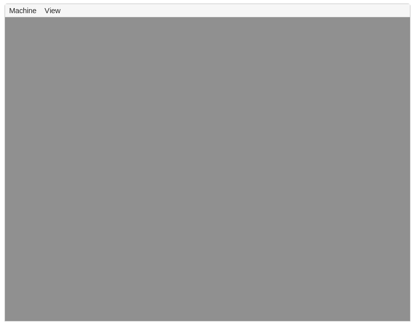
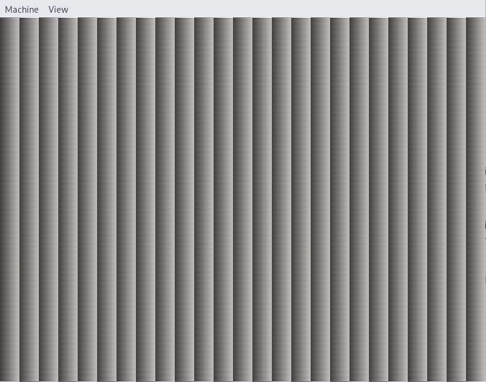

+++
title = "Booting"
weight = 2
path = "booting"
date = 0000-01-01
draft = true

[extra]
chapter = "Bare Bones"
icon = '''
<svg xmlns="http://www.w3.org/2000/svg" fill="currentColor" class="bi bi-power" viewBox="0 0 16 16">
  <path d="M7.5 1v7h1V1h-1z"/>
  <path d="M3 8.812a4.999 4.999 0 0 1 2.578-4.375l-.485-.874A6 6 0 1 0 11 3.616l-.501.865A5 5 0 1 1 3 8.812z"/>
</svg>
'''

extra_content = ["uefi/index.md"]
+++

In this post, we explore the boot process on both BIOS and UEFI-based systems.
We combine the [minimal kernel] created in the previous post with a bootloader to create a bootable disk image.
We then show how this image can be started in the [QEMU] emulator and run on real hardware.

[minimal kernel]: @/edition-3/posts/01-minimal-kernel/index.md
[QEMU]: https://www.qemu.org/

<!-- more -->

This blog is openly developed on [GitHub].
If you have any problems or questions, please open an issue there.
You can also leave comments [at the bottom].
The complete source code for this post can be found in the [`post-3.2`][post branch] branch.

[GitHub]: https://github.com/phil-opp/blog_os
[at the bottom]: #comments
<!-- fix for zola anchor checker (target is in template): <a id="comments"> -->
[post branch]: https://github.com/phil-opp/blog_os/tree/post-3.2

<!-- toc -->

## The Boot Process
When you turn on a computer, it begins executing firmware code that is stored in motherboard [ROM].
This code performs a [power-on self-test], detects available RAM, and pre-initializes the CPU and other hardware.
Afterwards it looks for a bootable disk and starts booting the operating system kernel.

[ROM]: https://en.wikipedia.org/wiki/Read-only_memory
[power-on self-test]: https://en.wikipedia.org/wiki/Power-on_self-test

On x86, there are two firmware standards: the “Basic Input/Output System“ (**[BIOS]**) and the newer “Unified Extensible Firmware Interface” (**[UEFI]**).
The BIOS standard is outdated and not standardized, but relatively simple and supported on almost any x86 machine since the 1980s.
UEFI, in contrast, is more modern and has much more features, but also more complex and only runs on fairly recent hardware (built since ~2012).

[BIOS]: https://en.wikipedia.org/wiki/BIOS
[UEFI]: https://en.wikipedia.org/wiki/Unified_Extensible_Firmware_Interface

### BIOS

Almost all x86 systems have support for BIOS booting, including most UEFI-based machines that support an emulated BIOS.
This is great, because you can use the same boot logic across all machines from the last centuries.
The drawback is that the standard is very old, for example the CPU is put into a 16-bit compatibility mode called [real mode] before booting so that archaic bootloaders from the 1980s would still work.
Also, BIOS-compatibility will be slowly removed on newer UEFI machines over the next years (see below).

#### Boot Process

When you turn on a BIOS-based computer, it first loads the BIOS firmware from some special flash memory located on the motherboard.
The BIOS runs self test and initialization routines of the hardware, then it looks for bootable disks.
For that it loads the first disk sector (512 bytes) of each disk into memory, which contains the [_master boot record_] (MBR) structure.
This structure has the following general format:

[_master boot record_]: https://en.wikipedia.org/wiki/Master_boot_record

| Offset | Field             | Size |
| ------ | ----------------- | ---- |
| 0      | bootstrap code    | 446  |
| 446    | partition entry 1 | 16   |
| 462    | partition entry 2 | 16   |
| 478    | partition entry 3 | 16   |
| 444    | partition entry 4 | 16   |
| 510    | boot signature    | 2    |

The bootstrap code is commonly called the _bootloader_ and responsible for loading and starting the operating system kernel.
The four partition entries describe the [disk partitions] such as the `C:` partition on Windows.
The boot signature field at the end of the structure specifies whether this disk is bootable or not.
If it is bootable, the signature field must be set to the [magic bytes] `0xaa55`.
It's worth noting that there are [many extensions][mbr-extensions] of the MBR format, which for example include a 5th partition entry or a disk signature.

[disk partitions]: https://en.wikipedia.org/wiki/Disk_partitioning
[magic bytes]: https://en.wikipedia.org/wiki/Magic_number_(programming)
[mbr-extensions]: https://en.wikipedia.org/wiki/Master_boot_record#Sector_layout

The BIOS itself only cares for the boot signature field.
If it finds a disk with a boot signature equal to `0xaa55`, it directly passes control to the bootloader code stored at the beginning of the disk.
This bootloader is then responsible for multiple things:

- **Loading the kernel from disk:** The bootloader has to determine the location of the kernel image on the disk and load it into memory.
- **Initializing the CPU:** As noted above, all `x86_64` CPUs start up in a 16-bit [real mode] to be compatible with older operating systems.
So in order to run current 64-bit operating systems, the bootloader needs to switch the CPU from the 16-bit [real mode] first to the 32-bit [protected mode], and then to the 64-bit [long mode], where all CPU registers and the complete main memory are available.
- **Querying system information:** The third job of the bootloader is to query certain information from the BIOS and pass it to the OS kernel.
This, for example, includes information about the available main memory and graphical output devices.
- **Setting up an execution environment:** Kernels are typically stored as normal executable files (e.g. in the [ELF] or [PE] format), which require some loading procedure.
This includes setting up a [call stack] and a [page table].

[ELF]: https://en.wikipedia.org/wiki/Executable_and_Linkable_Format
[PE]: https://en.wikipedia.org/wiki/Portable_Executable
[call stack]: https://en.wikipedia.org/wiki/Call_stack
[real mode]: https://en.wikipedia.org/wiki/Real_mode
[protected mode]: https://en.wikipedia.org/wiki/Protected_mode
[long mode]: https://en.wikipedia.org/wiki/Long_mode
[memory segmentation]: https://en.wikipedia.org/wiki/X86_memory_segmentation
[page table]: https://en.wikipedia.org/wiki/Page_table

Some bootloaders also include a basic user interface for [choosing between multiple installed OSs][multi-booting] or entering a recovery mode.
Since it is not possible to do all that within the available 446 bytes, most bootloaders are split into a small first stage, which is as small as possible, and a second stage, which is subsequently loaded by the first stage.

[multi-booting]: https://en.wikipedia.org/wiki/Multi-booting

Writing a BIOS bootloader is cumbersome as it requires assembly language and a lot of non insightful steps like _“write this magic value to this processor register”_.
Therefore we don't cover bootloader creation in this post and instead use the existing [`bootloader`] crate to make our kernel bootable.

(If you are interested in building your own BIOS bootloader, you can look through the [BIOS source code] of the `bootloader` crate on GitHub, which is mostly written in Rust and has only about 50 lines of assembly code.)

[BIOS source code]: https://github.com/rust-osdev/bootloader/tree/main/bios

#### The Future of BIOS

As noted above, most modern systems still support booting operating systems written for the legacy BIOS firmware for backwards-compatibility.
However, there are [plans to remove this support soon][end-bios-support].
Thus, it is strongly recommended to make operating system kernels compatible with the newer UEFI standard too.
Fortunately, it is possible to create a kernel that supports booting on both BIOS (for older systems) and UEFI (for modern systems).

[end-bios-support]: https://arstechnica.com/gadgets/2017/11/intel-to-kill-off-the-last-vestiges-of-the-ancient-pc-bios-by-2020/

### UEFI

The Unified Extensible Firmware Interface (UEFI) replaces the classical BIOS firmware on most modern computers.
The specification provides lots of useful features that make bootloader implementations much simpler:

- It supports initializing the CPU directly into 64-bit mode, instead of starting in a DOS-compatible 16-bit mode like the BIOS firmware.
- It understands disk partitions and executable files.
Thus it is able to fully load the bootloader from disk into memory (no 512-byte "first stage" is required anymore).
- A standardized [specification][uefi-specification] minimizes the differences between systems.
This isn't the case for the legacy BIOS firmware, so that bootloaders often have to try different methods because of hardware differences.
- The specification is independent of the CPU architecture, so that the same interface can be used to boot on `x86_64` and e.g. `ARM` CPUs.
- It natively supports network booting without requiring additional drivers.

[uefi-specification]: https://uefi.org/specifications

The UEFI standard also tries to make the boot process safer through a so-called _"secure boot"_ mechanism.
The idea is that the firmware only allows loading bootloaders that are signed by a trusted [digital signature].
Thus, malware should be prevented from compromising the early boot process.

[digital signature]: https://en.wikipedia.org/wiki/Digital_signature

#### Issues & Criticism

While most of the UEFI specification sounds like a good idea, there are also many issues with the standard.
The main issue for most people is the fear that the _secure boot_ mechanism could be used to lock users into a specific operating system (e.g. Windows) and thus prevent the installation of alternative operating systems.

Another point of criticism is that the large number of features make the UEFI firmware very complex, which increases the chance that there are some bugs in the firmware implementation itself.
This can lead to security problems because the firmware has complete control over the hardware.
For example, a vulnerability in the built-in network stack of an UEFI implementation can allow attackers to compromise the system and e.g. silently observe all I/O data.
The fact that most UEFI implementations are not open-source makes this issue even more problematic, since there is no way to audit the firmware code for potential bugs.

While there are open firmware projects such as [coreboot] that try to solve these problems, there is no way around the UEFI standard on most modern consumer computers.
So we have to live with these drawbacks for now if we want to build a widely compatible bootloader and operating system kernel.

[coreboot]: https://www.coreboot.org/

#### Boot Process

The UEFI boot process works in the following way:

- After powering on and self-testing all components, the UEFI firmware starts looking for special bootable disk partitions called [EFI system partitions].
These partitions must be formatted with the [FAT file system] and assigned a special ID that indicates them as EFI system partition.
The UEFI standard understands both the [MBR] and [GPT] partition table formats for this, at least theoretically.
In practice, some UEFI implementations seem to [directly switch to BIOS-style booting when an MBR partition table is used][mbr-csm], so it is recommended to only use the GPT format with UEFI.
- If the firmware finds an EFI system partition, it looks for an executable file named `efi\boot\bootx64.efi` (on x86_64 systems).
This executable must use the [Portable Executable (PE)] format, which is common in the Windows world.
- It then loads the executable from disk to memory, sets up the execution environment (CPU state, page tables, etc.) in a standardized way, and finally jumps to the entry point of the loaded executable.

[MBR]: https://en.wikipedia.org/wiki/Master_boot_record
[GPT]: https://en.wikipedia.org/wiki/GUID_Partition_Table
[mbr-csm]: https://bbs.archlinux.org/viewtopic.php?id=142637
[EFI system partitions]: https://en.wikipedia.org/wiki/EFI_system_partition
[FAT file system]: https://en.wikipedia.org/wiki/File_Allocation_Table
[Portable Executable (PE)]: https://en.wikipedia.org/wiki/Portable_Executable

From this point on, the loaded executable has control.
Typically, this executable is a bootloader that then loads the actual operating system kernel.
Theoretically, it would also be possible to let the UEFI firmware load the kernel directly without a bootloader in between, but this would make it more difficult to port the kernel to other architectures.

Bootloaders and kernels typically need additional information about the system, for example the amount of available memory.
For this reason, the UEFI firmware passes a pointer to a special _system table_ as an argument when invoking the bootloader entry point function.
Using this table, the bootloader can query various system information and even invoke special functions provided by the UEFI firmware, for example for accessing the hard disk.

#### How we will use UEFI

As it is probably clear at this point, the UEFI interface is very powerful and complex.
The wide range of functionality makes it even possible to write an operating system directly as an UEFI application, using the UEFI services provided by the system table instead of creating own drivers.
In practice, however, most operating systems use UEFI only for the bootloader since own drivers give you better performance and more control over the system.
We will also follow this path for our OS implementation.

To keep this post focused, we won't cover the creation of an UEFI bootloader here.
Instead, we will use the already mentioned [`bootloader`] crate, which allows loading our kernel on both UEFI and BIOS systems.
If you're interested in how to create an UEFI bootloader yourself, check out our extra post about [**UEFI Booting**].

[**UEFI Booting**]: @/edition-3/posts/02-booting/uefi/index.md

### The Multiboot Standard

To avoid that every operating system implements its own bootloader that is only compatible with a single OS, the [Free Software Foundation] created an open bootloader standard called [Multiboot] in 1995.
The standard defines an interface between the bootloader and operating system, so that any Multiboot compliant bootloader can load any Multiboot compliant operating system on both BIOS and UEFI systems.
The reference implementation is [GNU GRUB], which is the most popular bootloader for Linux systems.

[Free Software Foundation]: https://en.wikipedia.org/wiki/Free_Software_Foundation
[Multiboot]: https://www.gnu.org/software/grub/manual/multiboot2/multiboot.html
[GNU GRUB]: https://en.wikipedia.org/wiki/GNU_GRUB

To make a kernel Multiboot compliant, one just needs to insert a so-called [Multiboot header] at the beginning of the kernel file.
This makes it very easy to boot an OS in GRUB.
However, GRUB and the Multiboot standard have some issues too:

[Multiboot header]: https://www.gnu.org/software/grub/manual/multiboot/multiboot.html#OS-image-format

- The standard is designed to make the bootloader simple instead of the kernel.
For example, the kernel needs to be linked with an [adjusted default page size], because GRUB can't find the Multiboot header otherwise.
Another example is that the [boot information], which is passed to the kernel, contains lots of architecture-dependent structures instead of providing clean abstractions.
- The standard supports only the 32-bit protected mode on BIOS systems.
This means that you still have to do the CPU configuration to switch to the 64-bit long mode.
- For UEFI systems, the standard provides very little added value as it simply exposes the normal UEFI interface to kernels.
- Both GRUB and the Multiboot standard are only sparsely documented.
- GRUB needs to be installed on the host system to create a bootable disk image from the kernel file.
This makes development on Windows or Mac more difficult.

[adjusted default page size]: https://wiki.osdev.org/Multiboot#Multiboot_2
[boot information]: https://www.gnu.org/software/grub/manual/multiboot/multiboot.html#Boot-information-format

Because of these drawbacks we decided to not use GRUB or the Multiboot standard for this series.
However, we might add Multiboot support to our [`bootloader`] crate at some point, so that it becomes possible to load your kernel on a GRUB system too.
If you're interested in writing a Multiboot compliant kernel, check out the [first edition] of this blog series.

[first edition]: @/edition-1/_index.md

## Bootable Disk Image

We now know that most operating system kernels are loaded by bootloaders, which are small programs that initialize the hardware to reasonable defaults, load the kernel from disk, and provide it with some fundamental information about the underlying system.
In this section, we will learn how to combine the [minimal kernel] we created in the previous post with the `bootloader` crate in order to create a bootable disk image.

The [`bootloader`] crate supports both BIOS and UEFI booting on `x86_64` and creates a reasonable default execution environment for our kernel.
This way, we can focus on the actual kernel design in the following posts instead of spending a lot of time on system initialization.

### The `bootloader_api` Crate

In order to make our kernel compatible with the `bootloader` crate, we first need to add a dependency on the [`bootloader_api`] crate:

[`bootloader`]: https://docs.rs/bootloader/latest/bootloader/
[`bootloader_api`]: https://docs.rs/bootloader_api/latest/bootloader_api/

```toml,hl_lines=4
# in Cargo.toml

[dependencies]
bootloader_api = "0.11.2"
```

Now we need to replace our custom `_start` entry point function with [`bootloader_api::entry_point`] macro. This macro instructs the compiler to create a special `.bootloader-config` section with encoded configuration options in the resulting executable, which is later read by the bootloader implementation.

[`bootloader_api::entry_point`]: https://docs.rs/bootloader_api/latest/bootloader_api/macro.entry_point.html

We will take a closer look at the `entry_point` macro and the different configuration options later. For now, we just use the default setup:

```rust,hl_lines=3 6-8
// in main.rs

bootloader_api::entry_point!(kernel_main);

// ↓ this replaces the `_start` function ↓
fn kernel_main(bootinfo: &'static mut bootloader_api::BootInfo) -> ! {
    loop {}
}
```

There are a few notable things:

- The `kernel_main` function is just a normal Rust function with an arbitrary name. No `#[no_mangle]` attribute is needed anymore since the `entry_point` macro handles this internally.
- Like before, our entry point function is [diverging], i.e. it must never return. We ensure this by looping endlessly.
- There is a new [`BootInfo`] argument, which the bootloader fills with various system information. We will use this argument later.
- The `entry_point` macro verifies that the `kernel_main` function has the correct arguments and return type, otherwise a compile error will occur. This is important because undefined behavior might occur when the function signature does not match the bootloader's expectations.

[diverging]: https://doc.rust-lang.org/rust-by-example/fn/diverging.html
[`BootInfo`]: https://docs.rs/bootloader_api/latest/bootloader_api/info/struct.BootInfo.html

To verify that the `entry_point` macro worked as expected, we can use the `objdump` tool as [described in the previous post][objdump-prev]. First, we recompile using `cargo build --target x86_64-unknown-none`, then we inspect the section headers using `objdump` or `rust-objdump`:

[objdump-prev]: @/edition-3/posts/01-minimal-kernel/index.md#objdump

```hl_lines=8
❯ rust-objdump -h target/x86_64-unknown-none/debug/kernel

target/x86_64-unknown-none/debug/kernel:        file format elf64-x86-64

Sections:
Idx Name               Size     VMA              Type
  0                    00000000 0000000000000000
  1 .bootloader-config 0000007c 0000000000200120 DATA
  2 .text              00000075 00000000002011a0 TEXT
  3 .debug_abbrev      000001c8 0000000000000000 DEBUG
  4 .debug_info        00000b56 0000000000000000 DEBUG
  5 .debug_aranges     00000090 0000000000000000 DEBUG
  6 .debug_ranges      00000040 0000000000000000 DEBUG
  7 .debug_str         00000997 0000000000000000 DEBUG
  8 .debug_pubnames    0000014c 0000000000000000 DEBUG
  9 .debug_pubtypes    00000548 0000000000000000 DEBUG
 10 .debug_frame       000000b0 0000000000000000 DEBUG
 11 .debug_line        0000012c 0000000000000000 DEBUG
 12 .comment           00000013 0000000000000000
 13 .symtab            000000a8 0000000000000000
 14 .shstrtab          000000b8 0000000000000000
 15 .strtab            000000cd 0000000000000000
```

We see that there is indeed a new `.bootloader-config` section of size `0x7c` in our kernel executable. This means that we can now look into how to create a bootable disk image from our kernel.

### Creating a Disk Image

The [docs of the `bootloader` crate][`bootloader` docs] describe how to create a bootable disk image for a kernel.
The first step is to find the directory where cargo placed the source code of the `bootloader` dependency.
Then, a special build command needs to be executed in that directory, passing the paths to the kernel binary and its `Cargo.toml` as arguments.
This will result in multiple disk image files as output, which can be used to boot the kernel on BIOS and UEFI systems.

[`bootloader` docs]: https://docs.rs/bootloader/0.11.0/bootloader/

#### A `boot` crate

Since following these steps manually is cumbersome, we create a script to automate it.
For that we create a new `boot` crate in a subdirectory, in which we will implement the build steps:

```
cargo new --bin boot
```

This command creates a new `boot` subfolder with a `Cargo.toml` and a `src/main.rs` in it.
Since this new cargo project will be tightly coupled with our main project, it makes sense to combine the two crates as a [cargo workspace].
This way, they will share the same `Cargo.lock` for their dependencies and place their compilation artifacts in a common `target` folder.
To create such a workspace, we add the following to the `Cargo.toml` of our main project:

[cargo workspace]: https://doc.rust-lang.org/cargo/reference/workspaces.html

```toml
# in Cargo.toml

[workspace]
members = ["boot"]
```

After creating the workspace, we can begin the implementation of the `boot` crate.
Note that the crate will be invoked as part as our build process, so it can be a normal Rust executable that runs on our host system.
This means that is has a classical `main` function and can use standard library types such as [`Path`] or [`Command`] without problems.

[`Path`]: https://doc.rust-lang.org/std/path/struct.Path.html
[`Command`]: https://doc.rust-lang.org/std/process/struct.Command.html

#### Artifact Dependencies

The first step in creating the bootable disk image is to enable support for [artifact dependencies](https://doc.rust-lang.org/nightly/cargo/reference/unstable.html#artifact-dependencies) from inside your kernel's `.cargo/config.toml` because we're going to need that support later:

```toml
# in .cargo/config.toml

[unstable]
bindeps = true
```

After this, you need to add an artifact dependency on your kernel from inside the boot crate. This tells the bootloader crate where the source code to your kernel resides:

```toml
# in boot/Cargo.toml

[dependencies]
kernel = { path = "..", artifact = "bin", target = "x86_64-unknown-none" }
```

Finally, you need to add a dependency on the main `bootloader` crate. Previous versions used `bootloader_locator` instead, but now, thanks to artifact dependencies, that is no longer necessary.

```toml
# in boot/Cargo.toml

[dependencies]
bootloader = "0.11.0"
```

We can see how this works by printing the Cargo-generated environment variable pointing to the absolute path of the kernel binary

```rust
// in boot/src/main.rs
use std::path::Path;      // new

pub fn main() {
    let kernel_binary = Path::new(env!("CARGO_BIN_FILE_KERNEL_kernel"));
    dbg!(kernel_binary);
}
```

The `CARGO_BIN_FILE_KERNEL_kernel` environment variable is defined by Cargo as the absolute path to the binary file created after compiling an artifact dependency — and in this case, the binary file it points to is your kernel's binary. This makes it very easy to begin the process of boot image creation, as explained in detail below.

[`dbg!`]: https://doc.rust-lang.org/std/macro.dbg.html

To run the `boot` crate from our workspace root (i.e. the kernel directory), we can pass a [`--package`] argument to `cargo run`:

[`--package`]: https://doc.rust-lang.org/cargo/commands/cargo-run.html#package-selection

```
> cargo run --package boot
[boot/src/main.rs:5] kernel_path = "/.../target/x86_64-unknown-none/debug/deps/artifact/kernel-.../bin/kernel-..."
```

It worked! We see that the kernel binary lives somewhere in the dependency tree of our `boot` crate.
By depending on the kernel as a binary dependency of `boot`, we ensure that the bootloader and the kernel use the exact same version of the `BootInfo` type.
This is important because the `BootInfo` type is not stable yet, so undefined behavior can occur when when using different `BootInfo` versions.

#### Building a Boot Image

The next step is to actually build the boot image.
From the [`bootloader` docs] we learn that the crate defines two completely unique bootloader objects: `BiosBoot` for BIOS and `UefiBoot` for UEFI. To keep it simple, we will support both, although it's possible to choose which to exclusively support later to keep your workflow streamlined as your kernel becomes more complex.

```toml
# in boot/Cargo.toml

[dependencies]
bootloader = "0.11.0"
kernel = { path = "..", artifact = "bin", target = "x86_64-unknown-none" }
```

Once all dependencies are accounted for, it's time to put everything together:

```rust
// in boot/src/main.rs

// new
use bootloader::{BiosBoot, UefiBoot}
use std::{path::Path, process::exit};

pub fn main() {
    // new code below

    let kernel_dir = todo!();
    let bios_image = todo!();
    let uefi_image = todo!();

    // invoke UEFI boot image builder
    let uefi = UefiBoot::new(&kernel_binary);

    // invoke BIOS boot image builder
    let bios = BiosBoot::new(&kernel_binary);

    // attempt to create UEFI boot image
    if let Err(e) = uefi.create_disk_image(&uefi_path) {
        eprintln!("{:#?}", &e);
        exit(1)
    }

    // attempt to create BIOS boot image
    if let Err(e) = bios.create_disk_image(&bios_path) {
        eprintln!("{:#?}", &e);
        exit(1)
    }
}
```

We use both the `UefiBoot` and `BiosBoot` types to create disk images for the BIOS and UEFI implementations, respectively. By using the `if let` syntax, we can exit the build gracefully whenever an error occurs.

After creating the `UefiBoot` and  `BiosBoot` types using the `CARGO_BIN_FILE_KERNEL_kernel` environment variable that we went over previously as the constructor argument for both, we now are ready for the next step.

#### Filling in the Blanks

We still need to fill in the paths we marked as `todo!` above. Like with the kernel binary, we can also use the `env!()` builtin for this, since another environment variable can also be used as a reference point for determining the filenames for the disk images:

```rust
// in `main` in boot/src/main.rs

// we know that the kernel lives in the parent directory of the `boot` crate
let kernel_dir = Path::new(env!("CARGO_MANIFEST_DIR")).manifest_dir.parent().unwrap();

// use the above as a target folder in which to place both the BIOS and UEFI disk images
let bios_image = kernel_dir.join("bootimage-bios-blog_os.img");
let uefi_image = kernel_dir.join("bootimage-uefi-blog_os.img");
```

The [`CARGO_MANIFEST_DIR`] environment variable always points to the `boot` directory, even if the crate is built from a different directory (e.g. via cargo's `--manifest-path` argument).
This gives use a good starting point for creating the paths we care about since we know that our kernel lives in the [parent][`Path::parent`] directory.

[`Path::parent`]: https://doc.rust-lang.org/std/path/struct.Path.html
[`CARGO_MANIFEST_DIR`]: https://doc.rust-lang.org/cargo/reference/environment-variables.html#environment-variables-cargo-sets-for-crates

From the `kernel_dir`, we can then construct the `bios_image` and `uefi_image` paths using the [`Path::join`] method.

[`Path::join`]: https://doc.rust-lang.org/std/path/struct.Path.html#method.join

#### Creating the Disk Images

There is one last step before we can create the bootable disk images: The `bootloader` build requires the [rustup component] `llvm-tools-preview`.
To install it, we can either run `rustup component add llvm-tools-preview` or specify it in our `rust-toolchain.toml` file:

[rustup component]: https://rust-lang.github.io/rustup/concepts/components.html

```toml
# in rust-toolchain.toml

[toolchain]
channel = "nightly"
components = ["rust-src", "rustfmt", "clippy", "llvm-tools-preview"]
```

After that can finally use our `boot` crate to create some bootable disk images from our kernel:

```bash
> cargo run --package boot
```

Because we're using artifact dependencies, when you run the `boot` package, the kernel is automatically pulled in and compiled as a dependency. Previously, in version 0.10 of the bootloader crate, you had to build the kernel binary first, but now, thanks to artifact dependencies, this is no longer required.
Note that the command will only work from the root directory of our project.
This is because we hardcoded the `kernel_binary` path in our `main` function.
We will fix this later in the post, but first it is time to actually run our kernel!

Note also that we specified names for the image files. Although we used `bootimage-bios-blog_os.img` and `bootimage-uefi-blog_os.img` for compatibility, they can now be given whatever names you see fit.

## Running our Kernel

After creating a bootable disk image for our kernel, we are finally able to run it.
Before we learn how to run it on real hardware, we start by running it inside the [QEMU] system emulator.
This has multiple advantages:

- We can't break anything: Our kernel has full hardware access, so that a bug might have serious consequences on read hardware.
- We don't need a separate computer: QEMU runs as a normal program on our development computer.
- The edit-test cycle is much faster: We don't need to copy the disk image to bootable usb stick on every kernel change.
- It's possible to debug our kernel via QEMU's debug tools and GDB.

We will still learn how to boot our kernel on real hardware later in this post, but for now we focus on QEMU.
For that you need to install QEMU on your machine as described on the [QEMU download page].

[QEMU download page]: https://www.qemu.org/download/

### Running in QEMU

After installing QEMU, you can run `qemu-system-x86_64 --version` in a terminal to verify that it is installed.
Then you can run the BIOS disk image of our kernel through the following command:

```
qemu-system-x86_64 -drive \
    format=raw,file=bootimage-bios-blog_os.img
```

As a result, you should see a window open that looks like this:


This output comes from the bootloader.
As we see, the last line is _"Jumping to kernel entry point at […]"_.
This is the point where the `_start` function of our kernel is called.
Since we currently only `loop {}` in that function nothing else happens, so it is expected that we don't see any additional output.

Running the UEFI disk image works in a similar way, but we need to pass some additional files to QEMU to emulate an UEFI firmware.
This is necessary because QEMU does not support emulating an UEFI firmware natively.
The files that we need are provided by the [Open Virtual Machine Firmware (OVMF)][OVMF] project, which is a sub-project of [TianoCore] and implements UEFI support for virtual machines.
Unfortunately, the project is only [sparsely documented][ovmf-whitepaper] and does not even have a clear homepage.

[OVMF]: https://github.com/tianocore/tianocore.github.io/wiki/OVMF
[TianoCore]: https://www.tianocore.org/
[ovmf-whitepaper]: https://www.linux-kvm.org/downloads/lersek/ovmf-whitepaper-c770f8c.txt

The easiest way to work with OVMF is to download pre-built images of the code.
We provide such images in the [`rust-osdev/ovmf-prebuilt`] repository, which is updated daily from [Gerd Hoffman's RPM builds](https://www.kraxel.org/repos/).
The compiled OVMF are provided as [GitHub releases][ovmf-prebuilt-releases].

[`rust-osdev/ovmf-prebuilt`]: https://github.com/rust-osdev/ovmf-prebuilt/
[ovmf-prebuilt-releases]: https://github.com/rust-osdev/ovmf-prebuilt/releases/latest

To run our UEFI disk image in QEMU, we need the `OVMF_pure-efi.fd` file (other files might work as well).
After downloading it, we can then run our UEFI disk image using the following command:

```
qemu-system-x86_64 -drive \
    format=raw,file=bootimage-uefi-blog_os.img \
    -bios /path/to/OVMF_pure-efi.fd,
```

If everything works, this command opens a window with the following content:


The output is a bit different than with the BIOS disk image.
Among other things, it explicitly mentions that this is an UEFI boot right on top.

### Screen Output

While we see some screen output from the bootloader, our kernel still does nothing.
Let's fix this by trying to output something to the screen from our kernel too.

Screen output works through a so-called [_framebuffer_].
A framebuffer is a memory region that contains the pixels that should be shown on the screen.
The graphics card automatically reads the contents of this region on every screen refresh and updates the shown pixels accordingly.

[_framebuffer_]: https://en.wikipedia.org/wiki/Framebuffer

Since the size, pixel format, and memory location of the framebuffer can vary between different systems, we need to find out these parameters first.
The easiest way to do this is to read it from the [boot information structure][`BootInfo`] that the bootloader passes as argument to our kernel entry point:

```rust
// in src/main.rs

fn kernel_main(boot_info: &'static mut BootInfo) -> ! {
    if let Some(framebuffer) = boot_info.framebuffer.as_ref() {
        let info = framebuffer.info();
        let buffer = framebuffer.buffer();
    }
    loop {}
}
```

Even though most systems support a framebuffer, some might not.
The [`BootInfo`] type reflects this by specifying its `framebuffer` field as an [`Option`].
Since screen output won't be essential for our kernel (there are other possible communication channels such as serial ports), we use an [`if let`] statement to run the framebuffer code only if a framebuffer is available.

[`Option`]: https://doc.rust-lang.org/std/option/enum.Option.html
[`if let`]: https://doc.rust-lang.org/reference/expressions/if-expr.html#if-let-expressions

The [`FrameBuffer`] type provides two methods: The `info` method returns a [`FrameBufferInfo`] instance with all kinds of information about the framebuffer format, including the pixel type and the screen resolution.
The `buffer` method returns the actual framebuffer content in form of a mutable byte [slice].

[`FrameBuffer`]: https://docs.rs/bootloader/0.11.0/bootloader/boot_info/struct.FrameBuffer.html
[`FrameBufferInfo`]: https://docs.rs/bootloader/0.11.0/bootloader/boot_info/struct.FrameBufferInfo.html
[slice]: https://doc.rust-lang.org/std/primitive.slice.html

We will look into programming the framebuffer in detail in the next post.
For now, let's just try setting the whole screen to some color.
For this, we just set every pixel in the byte slice to some fixed value:


```rust
// in src/main.rs

fn kernel_main(boot_info: &'static mut BootInfo) -> ! {
    if let Some(framebuffer) = boot_info.framebuffer.as_mut() {
        for byte in framebuffer.buffer_mut() {
            *byte = 0x90;
        }
    }
    loop {}
}
```

While it depends on the pixel color format how these values are interpreted, the result will likely be some shade of gray since we set the same value for every color channel (e.g. in the RGB color format).

After running `cargo kbuild` and then our `boot` script again, we can boot the new version in QEMU.
We see that our guess that the whole screen would turn gray was right:



We finally see some output from our own little kernel!

You can try experimenting with the pixel bytes if you like, for example by increasing the pixel value on each loop iteration:

```rust
// in src/main.rs

fn kernel_main(boot_info: &'static mut BootInfo) -> ! {
    if let Some(framebuffer) = boot_info.framebuffer.as_mut() {
        let mut value = 0x90;
        for byte in framebuffer.buffer_mut() {
            *byte = value;
            value = value.wrapping_add(1);
        }
    }
    loop {}
}
```

We use the [`wrapping_add`] method here because Rust panics on implicit integer overflow (at least in debug mode).
By adding a prime number, we try to add some variety.
The result looks as follows:



### Booting on Real Hardware

To boot on real hardware, you first need to write either the `bootimage-uefi-blog_os.img` or the `bootimage-bios-blog_os.img` disk image to an USB stick.
This deletes everything on the stick, so be careful.
The actual steps to do this depend on your operating system.


#### Unix-like

On any Unix-like host OS (including both Linux and macOS), you can use the `dd` command to write the disk image directly to a USB drive.
First run either `sudo fdisk -l` (on Linux) or `diskutil list` (on a Mac) to get info about where in `/dev` the file representing your device is located.
After that, open a terminal window and run either of the following commands:

##### Linux
```
# replace /dev/sdX with device filename as revealed by "sudo fdisk -l"
$ sudo dd if=boot-uefi-blog_os.img of=/dev/sdX
```

##### macOS
```
# replace /dev/diskX with device filename as revealed by "diskutil list"
$ sudo dd if=boot-uefi-blog_os.img of=/dev/diskX
```

**WARNING**: Be very careful when running this command.
If you specify the wrong device as the `of=` parameter, you could end up wiping your system clean, so make sure the device you run it on is a removable one.

#### Windows

On Windows, you can use the [Rufus] tool, which is developed as an open-source project [on GitHub][rufus-github].
After downloading it you can directly run it, there's no installation necessary.
In the interface, you select the USB stick you want to write to

[Rufus]: https://rufus.ie/
[rufus-github]: https://github.com/pbatard/rufus

## Support for `cargo run`

- take `kernel_binary` path as argument instead of hardcoding it
- set `boot` crate as runner in `.cargo/config` (for no OS targets only)
- add `krun` alias


### Only create disk images

- Add support for new `--no-run` arg to `boot` crate
- Add `cargo disk-image` alias for `cargo run --package boot -- --no-run`


# OLD


For running `bootimage` and building the bootloader, you need to have the `llvm-tools-preview` rustup component installed.
You can do so by executing `rustup component add llvm-tools-preview`.


### Real Machine

It is also possible to write it to an USB stick and boot it on a real machine:

```
> dd if=target/x86_64-blog_os/debug/bootimage-blog_os.img of=/dev/sdX && sync
```

Where `sdX` is the device name of your USB stick.
**Be careful** to choose the correct device name, because everything on that device is overwritten.

After writing the image to the USB stick, you can run it on real hardware by booting from it.
You probably need to use a special boot menu or change the boot order in your BIOS configuration to boot from the USB stick.
Note that it currently doesn't work for UEFI machines, since the `bootloader` crate has no UEFI support yet.

### Using `cargo run`

To make it easier to run our kernel in QEMU, we can set the `runner` configuration key for cargo:

```toml
# in .cargo/config.toml

[target.'cfg(target_os = "none")']
runner = "bootimage runner"
```

The `target.'cfg(target_os = "none")'` table applies to all targets that have set the `"os"` field of their target configuration file to `"none"`.
This includes our `x86_64-blog_os.json` target.
The `runner` key specifies the command that should be invoked for `cargo run`.
The command is run after a successful build with the executable path passed as first argument.
See the [cargo documentation][cargo configuration] for more details.

The `bootimage runner` command is specifically designed to be usable as a `runner` executable.
It links the given executable with the project's bootloader dependency and then launches QEMU.
See the [Readme of `bootimage`] for more details and possible configuration options.

[Readme of `bootimage`]: https://github.com/rust-osdev/bootimage

Now we can use `cargo run` to compile our kernel and boot it in QEMU.

## What's next?

In the next post, we will explore the VGA text buffer in more detail and write a safe interface for it.
We will also add support for the `println` macro.
