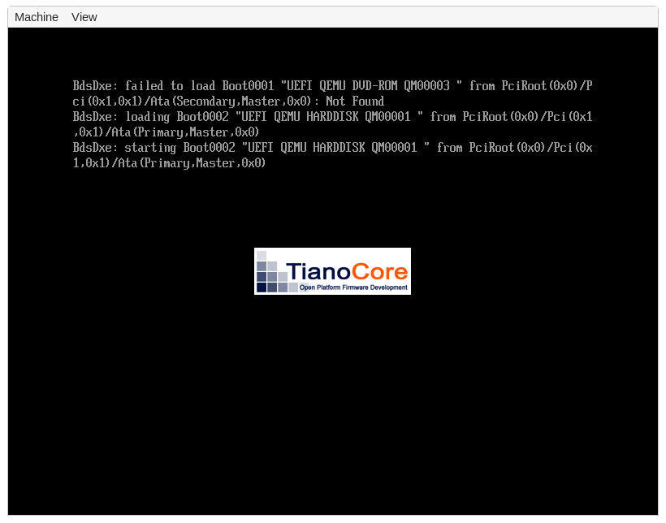
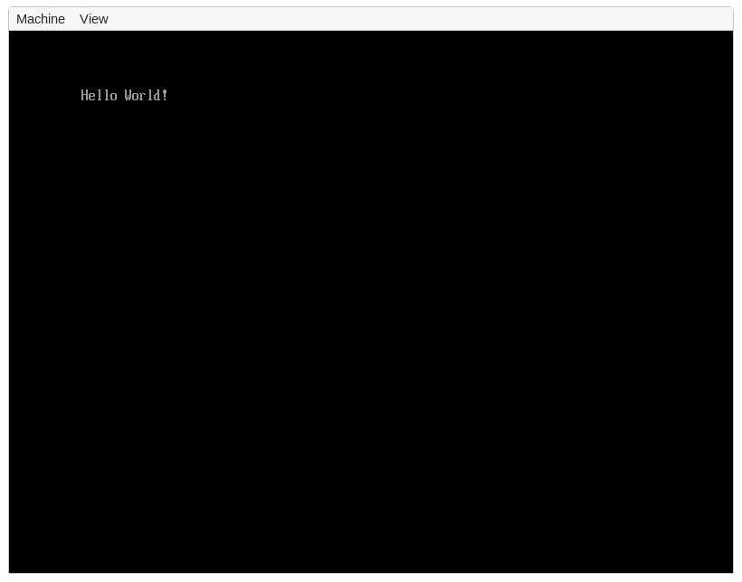

+++
title = "UEFI Booting"
path = "booting/uefi"
date = 0000-01-01
template = "edition-3/page.html"

[extra]
hide_next_prev = true
icon = '''
<!--
- icon source: https://de.wikipedia.org/wiki/Datei:Uefi_logo.svg
- used with permission of the UEFI Administration
-->
<svg baseProfile="tiny" xmlns="http://www.w3.org/2000/svg" viewBox = "0 0 367.92 424.8">
<path fill="#FFF" d="M183.505 7.5l12.515.016 59.87 34.233.632 13.683 23.938.38L339.524 89.6l16.386 30.31 5.136 192.808L349.92 329.3l-56.88 32.657-19.564-1.81-13.315 20.69-56.41 32.404-89.687-32.764L4.375 312.71 7.5 109.59z"/>
<path fill="#DC0000" d="M182.88 0l13.14 7.516-86.427 50.52S83.443 71.21 74.16 81.362c-11.362 12.428-7.917 30.125 2.16 42.48 24.693 30.28 88.66 54.367 141.12 34.56C239.666 150.01 339.524 89.6 339.524 89.6l28.397 16.243v213.12l-18 10.337V207.36l-56.88 32.66v121.937l-32.88 18.88V311.04l20.28-12.24v-51.543l-20.28 11.646s-2.37-32.09 1.92-42.902c4.1-10.31 15.74-21.72 25.2-18.72 6.95 2.21 5.76 24.95 5.76 24.95s42.95-24.85 56.88-32.86c2.25-36.34-9.13-59-43.92-55.44-15.87 1.63-28.37 10.02-38.88 17.28-11.14 7.7-20.4 16.555-28.8 26.64-15.89 19.1-33.02 45.26-35.28 76.32-1.77 24.357.71 159.07.71 159.07L183.6 424.8 0 318.96V105.84L182.88 0zM115.2 167.04c-13.318-10.95-29.718-21.208-47.52-25.2-11.942-2.678-23.93-1.128-32.4 3.6-22.328 12.466-28.844 45.437-26.64 77.76 3.508 51.445 22.065 86.146 48.96 113.04 17.977 17.977 47.576 39.66 74.16 41.76 27.702 2.187 36.335-16.023 42.48-36.72-20.956-14.324-44.265-26.296-65.52-40.32-3.91 2.99-3.572 6.328-9.36 6.48-5.15.135-10.955-4.727-14.4-9.36-6.09-8.19-8.026-21.054-8.64-30.96 33.78 18.062 66.363 37.317 100.08 55.44 3.688-67.27-23.104-124.2-61.2-155.52zM280.46 55.813l-85.795 52.732s-22.85 14.813-38.136 13.134c-4.99-.55-13.31-4.77-13.68-8.64-.7-7.16 25.2-21.02 25.2-21.02l87.84-50.27L280.46 55.8zM109.44 241.2c-11.23-5.81-21.966-12.114-32.4-18.72 1.032-7.922 2.438-15.645 12.24-13.68 11.49 2.303 19.817 20.686 20.16 32.4z"/>
</svg>
'''
+++

This post is an addendum to our main [**Booting**] post. It explains how to create a basic UEFI application from scratch that can be directly booted on modern x86_64 systems. This includes creating a minimal application suitable for the UEFI environment, turning it into a bootable disk image, and interacting with the hardware through the UEFI system tables and the `uefi` crate.

[**Booting**]: @/edition-3/posts/02-booting/index.md

<!-- more -->

This blog is openly developed on [GitHub]. If you have any problems or questions, please open an issue there. You can also leave comments [at the bottom].

[GitHub]: https://github.com/phil-opp/blog_os
[at the bottom]: #comments

<!-- toc -->

## Minimal UEFI App

We start by creating a new `cargo` project with a `Cargo.toml` and a `src/main.rs`:

```toml
# in Cargo.toml

[package]
name = "uefi_app"
version = "0.1.0"
authors = ["Your Name <your-email@example.com>"]
edition = "2018"

[dependencies]
```

This `uefi_app` project is independent of the OS kernel created in the [_Booting_], so we use a separate directory.

[_Booting_]: @/edition-3/posts/02-booting/index.md

In the `src/main.rs`, we create a minimal `no_std` executable as shown in the [_Minimal Kernel_] post:

[_Minimal Kernel_]: @/edition-3/posts/01-minimal-kernel/index.md

```rust
// in src/main.rs

#![no_std]
#![no_main]

use core::panic::PanicInfo;

#[panic_handler]
fn panic(_info: &PanicInfo) -> ! {
    loop {}
}
```

The `#![no_std]` attribute disables the linking of the Rust standard library, which is not available on bare metal. The `#![no_main]` attribute, we disable the normal entry point function that based on the C runtime. The `#[panic_handler]` attribute specifies which function should be called when a panic occurs.

Next, we create an entry point function named `efi_main`:

```rust
// in src/main.rs

#![feature(abi_efiapi)]

use core::ffi::c_void;

#[no_mangle]
pub extern "efiapi" fn efi_main(
    image: *mut c_void,
    system_table: *const c_void,
) -> usize {
    loop {}
}
```

This function signature is standardized by the UEFI specification, which is available [in PDF form][uefi-pdf] on [uefi.org]. You can find the signature of the entry point function in section 4.1. Since UEFI also defines a specific [calling convention] (in section 2.3), we set the [`efiapi` calling convention] for our function. Since support for this calling function is still unstable in Rust, we need to add `#![feature(abi_efiapi)]` at the very top of our file.

[uefi-pdf]: https://uefi.org/sites/default/files/resources/UEFI%20Spec%202.8B%20May%202020.pdf
[uefi.org]: https://uefi.org/specifications
[calling convention]: https://en.wikipedia.org/wiki/Calling_convention
[`efiapi` calling convention]: https://github.com/rust-lang/rust/issues/65815

The function takes two arguments: an _image handle_ and a _system table_. The image handle is a firmware-allocated handle that identifies the UEFI image. The system table contains some input and output handles and provides access to various functions provided by the UEFI firmware. The function returns an `EFI_STATUS` integer to signal whether the function was successful. It is normally only returned by UEFI apps that are not bootloaders, e.g. UEFI drivers or apps that are launched manually from the UEFI shell. Bootloaders typically pass control to a OS kernel and never return.

### UEFI Target

For our minimal kernel, we needed to create a [custom target] because none of the [officially supported targets] was suitable. For our UEFI application we are more lucky: Rust has built-in support for a **`x86_64-unknown-uefi`** target, which we can use without problems.

[custom target]: @/edition-3/posts/01-minimal-kernel/index.md#kernel-target
[officially supported targets]: https://doc.rust-lang.org/rustc/platform-support.html

 If you're curious, you can query the JSON specification of the target with the following command:

```bash
rustc +nightly --print target-spec-json -Z unstable-options --target x86_64-unknown-uefi
```

This outputs looks something like the following:

```json
{
  "abi-return-struct-as-int": true,
  "allows-weak-linkage": false,
  "arch": "x86_64",
  "code-model": "large",
  "cpu": "x86-64",
  "data-layout": "e-m:w-p270:32:32-p271:32:32-p272:64:64-i64:64-f80:128-n8:16:32:64-S128",
  "disable-redzone": true,
  "emit-debug-gdb-scripts": false,
  "exe-suffix": ".efi",
  "executables": true,
  "features": "-mmx,-sse,+soft-float",
  "is-builtin": true,
  "is-like-msvc": true,
  "is-like-windows": true,
  "linker": "rust-lld",
  "linker-flavor": "lld-link",
  "lld-flavor": "link",
  "llvm-target": "x86_64-unknown-windows",
  "max-atomic-width": 64,
  "os": "uefi",
  "panic-strategy": "abort",
  "pre-link-args": {
    "lld-link": [
      "/NOLOGO",
      "/NXCOMPAT",
      "/entry:efi_main",
      "/subsystem:efi_application"
    ],
    "msvc": [
      "/NOLOGO",
      "/NXCOMPAT",
      "/entry:efi_main",
      "/subsystem:efi_application"
    ]
  },
  "singlethread": true,
  "split-debuginfo": "packed",
  "stack-probes": {
    "kind": "call"
  },
  "target-pointer-width": "64"
}
```

From the output we can derive multiple properties of the target:

- The `exe-suffix` is `.efi`, which means that all executables compiled for this target have the suffix `.efi`.
- As for our [kernel target][custom target], both the redzone and SSE are disabled.
- The `is-like-windows` is an indicator that the target uses the conventions of Windows world, e.g. [PE] instead of [ELF] executables.
- The LLD linker is used, which means that we don't have to install any additional linker even when compiling on non-Windows systems.
- Like for all (most?) bare-metal targets, the `panic-strategy` is set to `abort` to disable unwinding.
- Various linker arguments are specified. For example, the `/entry` argument sets the name of the entry point function. This is the reason that we named our entry point function `efi_main` and applied the `#[no_mangle]` attribute above.

[PE]: https://en.wikipedia.org/wiki/Portable_Executable
[ELF]: https://en.wikipedia.org/wiki/Executable_and_Linkable_Format

If you're interested in understanding all these fields, check out the docs for Rust's internal [`Target`] and [`TargetOptions`] types. These are the types that the above JSON is converted to.

[`Target`]: https://doc.rust-lang.org/nightly/nightly-rustc/rustc_target/spec/struct.Target.html
[`TargetOptions`]: https://doc.rust-lang.org/nightly/nightly-rustc/rustc_target/spec/struct.TargetOptions.html

### Building

Even though the `x86_64-unknown-uefi` target is built-in, there are no precompiled versions of the `core` library available for it. This means that we need to use cargo's [`build-std` feature] as described in the [_Minimal Kernel_][minimal-kernel-build-std] post.

[`build-std` feature]: https://doc.rust-lang.org/nightly/cargo/reference/unstable.html#build-std
[minimal-kernel-build-std]: @/edition-3/posts/01-minimal-kernel/index.md#the-build-std-option

A nightly Rust compiler is required for building, so we need to set up a [rustup override] for the directory. We can do this either by running a [`rustup ovrride` command] or by adding a [`rust-toolchain` file].

[rustup override]: https://rust-lang.github.io/rustup/overrides.html
[`rustup override` command]: https://rust-lang.github.io/rustup/overrides.html#directory-overrides
[`rust-toolchain` file]: https://rust-lang.github.io/rustup/overrides.html#the-toolchain-file

The full build command looks like this:

```bash
cargo build --target x86_64-unknown-uefi -Z build-std=core \
    -Z build-std-features=compiler-builtins-mem
```

This results in a `uefi_app.efi` file in our `x86_64-unknown-uefi/debug` folder. Congratulations! We just created our own minimal UEFI app.

## Bootable Disk Image

To make our minimal UEFI app bootable, we need to create a new [GPT] disk image with a [EFI system partition]. On that partition, we need to put our `.efi` file under `efi\boot\bootx64.efi`. Then the UEFI firmware should automatically detect and load it when we boot from the corresponding disk. See the section about the [UEFI boot process][uefi-boot-process] in the _Booting_ post for more details.

[GPT]: https://en.wikipedia.org/wiki/GUID_Partition_Table
[EFI system partition]: https://en.wikipedia.org/wiki/EFI_system_partition
[uefi-boot-process]:  @/edition-3/posts/02-booting/index.md#boot-process-1

To create this disk image, we create a new `disk_image` executable:

```bash
> cargo new --bin disk_image
```

This creates a new cargo project in a `disk_image` subdirectory. To share the `target` folder and `Cargo.lock` file with our `uefi_app` project, we set up a cargo workspace:

```toml
# in Cargo.toml

[workspace]
members = ["disk_image"]
```

### FAT Filesystem

The first step to create an EFI system partition is to create a new partition image formatted with the [FAT] file system. The reason for using FAT is that this is the only file system that the UEFI standard requires. In practice, most UEFI firmware implementations also support the [NTFS] filesystem, but we can't rely on that since this is not required by the standard.

[FAT]: https://en.wikipedia.org/wiki/File_Allocation_Table
[NTFS]: https://en.wikipedia.org/wiki/NTFS

To create a new FAT file system, we use the [`fatfs`] crate:

[`fatfs`]: https://docs.rs/fatfs/0.3.5/fatfs/

```toml
# in disk_image/Cargo.toml

[dependencies]
fatfs = "0.3.5"
```

We leave the `main` function unchanged for now and instead create a `create_fat_filesystem` function next to it:

```rust
// in disk_image/src/main.rs

use std::{fs, io, path::Path};

fn create_fat_filesystem(fat_path: &Path, efi_file: &Path) {
    // retrieve size of `.efi` file and round it up
    let efi_size = fs::metadata(&efi_file).unwrap().len();
    let mb = 1024 * 1024; // size of a megabyte
                          // round it to next megabyte
    let efi_size_rounded = ((efi_size - 1) / mb + 1) * mb;

    // create new filesystem image file at the given path and set its length
    let fat_file = fs::OpenOptions::new()
        .read(true)
        .write(true)
        .create(true)
        .truncate(true)
        .open(&fat_path)
        .unwrap();
    fat_file.set_len(efi_size_rounded).unwrap();

    // create new FAT file system and open it
    let format_options = fatfs::FormatVolumeOptions::new();
    fatfs::format_volume(&fat_file, format_options).unwrap();
    let filesystem = fatfs::FileSystem::new(&fat_file, fatfs::FsOptions::new()).unwrap();

    // copy EFI file to FAT filesystem
    let root_dir = filesystem.root_dir();
    root_dir.create_dir("efi").unwrap();
    root_dir.create_dir("efi/boot").unwrap();
    let mut bootx64 = root_dir.create_file("efi/boot/bootx64.efi").unwrap();
    bootx64.truncate().unwrap();
    io::copy(&mut fs::File::open(&efi_file).unwrap(), &mut bootx64).unwrap();
}
```

We first use [`fs::metadata`] to query the size of our `.efi` file and then round it up to the next megabyte. We then use this rounded size to create a new FAT filesystem image file. I'm not sure if the rounding is really necessary, but I had some problems with the `fatfs` crate when trying to use the unaligned size.

[`fs::metadata`]: https://doc.rust-lang.org/std/fs/fn.metadata.html

After creating the file that should hold the FAT filesystem image, we use the [`format_volume`] function of `fatfs` to create the new FAT filesystem. After creating it, we use the [`FileSystem::new`] function to open it. The last step is to create the `efi/boot` directory and the `bootx64.efi` file on the filesystem. To write our `.efi` file to the filesystem image, we use the [`io::copy`] function of the Rust standard library.

[`format_volume`]: https://docs.rs/fatfs/0.3.5/fatfs/fn.format_volume.html
[`FileSystem::new`]: https://docs.rs/fatfs/0.3.5/fatfs/struct.FileSystem.html#method.new
[`io::copy`]: https://doc.rust-lang.org/std/io/fn.copy.html

Note that we're not doing any error handling here to keep the code short. This is not that problematic because the `disk_image` crate is only part of our build process, but you still might to use at least [`expect`] instead of `unwrap()` or an error handling crate such as [`anyhow`].

[`expect`]: https://doc.rust-lang.org/std/result/enum.Result.html#method.expect
[`anyhow`]: https://docs.rs/anyhow/1.0.38/anyhow/

### GPT Disk Image

To make the FAT filesystem that we just created bootable, we need to place it as an [EFI system partition] on a [`GPT`]-formatted disk. To create the GPT disk image, we use the [`gpt`] crate:

[`GPT`]: https://en.wikipedia.org/wiki/GUID_Partition_Table
[`gpt`]: https://docs.rs/gpt/2.0.0/gpt/

```toml
# in disk_image/Cargo.toml

[dependencies]
gpt = "2.0.0"
```

Like for the FAT image, we create a separate function to create the GPT disk image:

```rust
// in disk_image/src/main.rs

use std::{convert::TryFrom, fs::File, io::Seek};

fn create_gpt_disk(disk_path: &Path, fat_image: &Path) {
    // create new file
    let mut disk = fs::OpenOptions::new()
        .create(true)
        .truncate(true)
        .read(true)
        .write(true)
        .open(&disk_path)
        .unwrap();

    // set file size
    let partition_size: u64 = fs::metadata(&fat_image).unwrap().len();
    let disk_size = partition_size + 1024 * 64; // for GPT headers
    disk.set_len(disk_size).unwrap();

    // create a protective MBR at LBA0 so that disk is not considered
    // unformatted on BIOS systems
    let mbr = gpt::mbr::ProtectiveMBR::with_lb_size(
        u32::try_from((disk_size / 512) - 1).unwrap_or(0xFF_FF_FF_FF),
    );
    mbr.overwrite_lba0(&mut disk).unwrap();

    // create new GPT structure
    let block_size = gpt::disk::LogicalBlockSize::Lb512;
    let mut gpt = gpt::GptConfig::new()
        .writable(true)
        .initialized(false)
        .logical_block_size(block_size)
        .create_from_device(Box::new(&mut disk), None)
        .unwrap();
    gpt.update_partitions(Default::default()).unwrap();

    // add new EFI system partition and get its byte offset in the file
    let partition_id = gpt
        .add_partition("boot", partition_size, gpt::partition_types::EFI, 0)
        .unwrap();
    let partition = gpt.partitions().get(&partition_id).unwrap();
    let start_offset = partition.bytes_start(block_size).unwrap();

    // close the GPT structure and write out changes
    gpt.write().unwrap();

    // place the FAT filesystem in the newly created partition
    disk.seek(io::SeekFrom::Start(start_offset)).unwrap();
    io::copy(&mut File::open(&fat_image).unwrap(), &mut disk).unwrap();
}
```

First, we create a new disk image file at the given `disk_path`. We set its size to the size of the FAT partition plus some extra amount to account for the GPT structure itself.

To ensure that the disk image is not detected as an unformatted disk on older systems and accidentally overwritten, we create a so-called [_protective MBR_]. The idea is to create a normal [master boot record] structure on the disk that specifies a single partition that spans the whole disk. This way, older systems that don't know the `GPT` format see a disk formatted with an unknown parititon type instead of an unformatted disk.

[_protective MBR_]: https://en.wikipedia.org/wiki/GUID_Partition_Table#Protective_MBR_(LBA_0)
[master boot record]: https://en.wikipedia.org/wiki/Master_boot_record

Next, we create the actual [`GPT`] structure through the [`GptConfig`] type and its [`create_from_device`] method. The result is a [`GptDisk`] type that writes to our `disk` file. Since we want to start with an empty partition table, we use the [`update_partitions`] method to reset the partition table. This isn't strictly necessary since we create a completely new GPT disk, but it's better to be safe.

[`GptConfig`]: https://docs.rs/gpt/2.0.0/gpt/struct.GptConfig.html
[`create_from_device`]: https://docs.rs/gpt/2.0.0/gpt/struct.GptConfig.html#method.create_from_device
[`GptDisk`]: https://docs.rs/gpt/2.0.0/gpt/struct.GptDisk.html
[`update_partitions`]: https://docs.rs/gpt/2.0.0/gpt/struct.GptDisk.html#method.update_partitions

After resetting the new partition table, we create a new partition named `boot` in the partition table. This operation only looks for a free region on the disk and stores the offset and size of that region in the table, together with the partition name and type (an [EFI system partition] in this case). It does not write any bytes to the partition itself. To do that later, we keep track of the `start_offset` of the partition.

At this point, we are done with the GPT structure. To write it out to our `disk` file, we use the [`GptDisk::write`] function.

[`GptDisk::write`]: https://docs.rs/gpt/2.0.0/gpt/struct.GptDisk.html#method.write

The final step is to write our `FAT` filesystem image to the newly created partition. For that we use the [`Seek::seek`] function to move the file cursor to the `start_offset` of the parititon. We then use the [`io::copy`] function to copy all the bytes from our `FAT` image file to the disk partition.

[`Seek::seek`]: https://doc.rust-lang.org/std/io/trait.Seek.html#tymethod.seek

### Putting it Together

We now have functions to create the FAT filesystem and GPT disk image. We just need to put them together in our `main` function:

```rust
// in disk_image/src/main.rs

use std::path::PathBuf;

fn main() {
    // take efi file path as command line argument
    let mut args = std::env::args();
    let _exe_name = args.next().unwrap();
    let efi_path = PathBuf::from(args.next()
        .expect("path to `.efi` files must be given as argument"));

    let fat_path = efi_path.with_extension("fat");
    let disk_path = fat_path.with_extension("img");

    create_fat_filesystem(&fat_path, &efi_path);
    create_gpt_disk(&disk_path, &fat_path);
}
```

To be flexible, we take the path to the `.efi` file as command line argument. For retrieving the arguments we use the [`env::args`] function. The first argument is always set to the path of the executable itself by the operating system, even if the executable is invoked without arguments. We don't need it, so we prefix the variable name with an underscore to silence the "unused variable" warning.

[`env::args`]: https://doc.rust-lang.org/std/env/fn.args.html

Note that this is a very rudimentary way of doing argument parsing. There are a lot of crates out there that provide nice abstractions for this, for example [`clap`], [`structopt`], or [`argh`]. It is strongly recommend to use such a crate instead of writing your own argument parsing.

[`clap`]: https://docs.rs/clap/2.33.3/clap/index.html
[`structopt`]: https://docs.rs/structopt/0.3.21/structopt/
[`argh`]: https://docs.rs/argh/0.1.4/argh/

From the `efi_path` given as argument, we construct the `fat_path` and `disk_path`. By changing only the file extension using [`Path::with_extension`], we place the FAT and GPT image file next to our `.efi` file. The final step is to invoke our `create_fat_filesystem` and `create_gpt_disk` functions with the corresponding paths as argument.

[`Path::with_extension`]: https://doc.rust-lang.org/std/path/struct.Path.html#method.with_extension

Now we can run our `disk_image` executable to create the bootable disk image from our `uefi_app`:

```
cargo run --package disk_image -- target/x86_64-unknown-uefi/debug/uefi_app.efi
```

Note the additional `--` argument. The `cargo run` uses this special argument to separate `cargo run` arguments from the arguments that should be passed to the compiled executable. The path of course depends on your working directory, i.e. whether you run it from the project root or from the `disk_image` subdirectory. It also depends on whether you compiled the `uefi_app` in debug or `--release` mode.

The result of this command is a `.fat` and a `.img` file next to the given `.efi` executable. These files can be launched in QEMU and on real hardware [as described][run-instructions] in the main _Booting_ post. The result should look something like this:

[run-instructions]: @/edition-3/posts/02-booting/index.md#running-our-kernel



We don't see any output from our `uefi_app` on the screen yet since we only `loop {}` in our `efi_main`. Instead, we see some output from the UEFI firmware itself that was created before our application was started.

[`uefi`]: https://docs.rs/uefi/0.8.0/uefi/

Let's try to improve this by printing something to the screen from our `uefi_app` as well.

## The `uefi` Crate

In order to print something to the screen, we need to call some functions provided by the UEFI firmware. These functions can be invoked through the `system_table` argument passed to our `efi_main` function. This table provides [function pointers] for all kinds of functionality, including access to the screen, disk, or network.

[function pointers]: https://en.wikipedia.org/wiki/Function_pointer

Since the system table has a standardized format that is identical on all systems, it makes sense to create an abstraction for it. This is what the `uefi` crate does. It provides a [`SystemTable`] type that abstracts the UEFI system table functions as normal Rust methods. It is not complete, but the most important functions are all available.

[`SystemTable`]: https://docs.rs/uefi/0.8.0/uefi/table/struct.SystemTable.html

To use the crate, we first add it as a dependency in our root `Cargo.toml` (_not in `disk_image/Cargo.toml`_):

```toml
# in Cargo.toml

[dependencies]
uefi = "0.8.0"
```

Now we can change the types of the `image` and `system_table` arguments in our `efi_main` declaration:

```rust
// in src/main.rs

#[no_mangle]
pub extern "efiapi" fn efi_main(
    image: uefi::Handle,
    system_table: uefi::table::SystemTable<uefi::table::Boot>,
) -> uefi::Status {
    loop {}
}
```

Instead of using raw pointers and an anonymous `usize` return type, we now use the [`Handle`], [`SystemTable`], and [`Status`] abstraction types provided by the `uefi` crate. This way, we can use the higher-level API provided by the crate instead of carefully calculating pointer offsets to access the system table manually.

[`Handle`]: https://docs.rs/uefi/0.8.0/uefi/data_types/struct.Handle.html
[`Status`]: https://docs.rs/uefi/0.8.0/uefi/struct.Status.html

While the above function signature works, it is very fragile because the Rust compiler is not able to typecheck the function signature of entry point functions. Thus, we could accidentally use the wrong signature (e.g. after updating the `uefi` crate), which would cause undefined behavior. To prevent this, the `uefi` crate provides an [`entry` macro] to enforce the correct signature. To use it, we change our entry point function in the following way:

[`entry` macro]: https://docs.rs/uefi/0.8.0/uefi/prelude/attr.entry.html

```rust
// in src/main.rs

use uefi::prelude::entry;

#[entry]
fn efi_main(
    image: uefi::Handle,
    system_table: uefi::table::SystemTable<uefi::table::Boot>,
) -> uefi::Status {
    loop {}
}
```

The macro already inserts the `#[no_mangle]` attribute and the `pub extern "efiapi"` modifiers for us, so we no longer need them. We will now get a compile error if the function signature is not correct (try it if you like).

### Printing to Screen

The UEFI standard supports multiple interfaces for printing to the screen. The most simple one is the _Simple Text Output_ protocol, which provides a console-like output interface. It is described in section 11.4 of the UEFI specification ([PDF][uefi-pdf]). We can use it through the [`SystemTable::stdout`] method provided by theThe `uefi` crate supports`uefi` crate:

[`SystemTable::stdout`]: https://docs.rs/uefi/0.8.0/uefi/table/struct.SystemTable.html#method.stdout

```rust
// in src/main.rs

use core::fmt::Write;

#[entry]
fn efi_main(
    image: uefi::Handle,
    system_table: uefi::table::SystemTable<uefi::table::Boot>,
) -> uefi::Status {
    let stdout = system_table.stdout();
    stdout.clear().unwrap().unwrap();
    writeln!(stdout, "Hello World!").unwrap();

    loop {}
}
```

We first use the [`SystemTable::stdout`] method to get an [`Output`] reference. Through this reference, we can then [`clear`] the screen and write a "Hello World!" message through Rust's [`writeln`] macro. In order to be able to use the macro, we need to import the [`fmt::Write`] trait. Since this is only prototype code, we use the [`Result::unwrap`] method to panic on errors. For the `clear` call, we additionally call the [`Completion::unwrap`] method to ensure that the UEFI firmware did not throw any warnings.

[`Output`]: https://docs.rs/uefi/0.8.0/uefi/proto/console/text/struct.Output.html
[`clear`]: https://docs.rs/uefi/0.8.0/uefi/proto/console/text/struct.Output.html#method.clear
[`writeln`]: https://doc.rust-lang.org/nightly/core/macro.writeln.html
[`fmt::Write`]: https://doc.rust-lang.org/nightly/core/fmt/trait.Write.html
[`Result::unwrap`]: https://doc.rust-lang.org/nightly/core/result/enum.Result.html#method.unwrap
[`Completion::unwrap`]: https://docs.rs/uefi/0.8.0/uefi/struct.Completion.html

After recompiling and creating a new disk image, we can now see out "Hello World!" on the screen:

```bash
> cargo build --target x86_64-unknown-uefi -Z build-std=core \
    -Z build-std-features=compiler-builtins-mem
> cargo run --package disk_image -- target/x86_64-unknown-uefi/debug/uefi_app.efi
> qemu-system-x86_64 -drive format=raw,file=target/x86_64-unknown-uefi/debug/uefi_app.fat \
    -bios # [...] TODO
```



The [`Output`] type also allows to use different colors through its [`set_color`] method and some other customization options.

[`set_color`]: https://docs.rs/uefi/0.8.0/uefi/proto/console/text/struct.Output.html#method.set_color

All of these functions are directly provided by the UEFI firmware, the `uefi` crate just provides some abstractions for this. By looking at the source code of the `uefi` crate, we see that the [`SystemTable`][system-table-src] is just a pointer to a [`SystemTableImpl`] struct, which is created by the UEFI firmware in a standardized format (see section _4.3_ of the UEFI specification ([PDF][uefi-pdf])). It has a `stdout` field, which is a pointer to an [`Output`][output-src] table fillThe `uefi` crate supportsd with [function pointers]. The methods of the `Output` type are just [small wrappers] around these function pointers, so all of the functionality is implemented directly in the UEFI firmware.

[system-table-src]: https://docs.rs/uefi/0.8.0/src/uefi/table/system.rs.html#44-47
[`SystemTableImpl`]: https://docs.rs/uefi/0.8.0/src/uefi/table/system.rs.html#209-230
[output-src]: https://docs.rs/uefi/0.8.0/src/uefi/proto/console/text/output.rs.html#13-29
[small wrappers]: https://docs.rs/uefi/0.8.0/src/uefi/proto/console/text/output.rs.html#41-43

### Boot Services

If we take a closer look at the documentation of the [`SystemTable`] type, we see that it has a generic `View` parameter. The documentation provides a good explanation why this parameter is needed:

> [...] Not all UEFI services will remain accessible forever. Some services, called "boot services", may only be called during a bootstrap stage where the UEFI firmware still has control of the hardware, and will become unavailable once the firmware hands over control of the hardware to an operating system loader. Others, called "runtime services", may still be used after that point [...]
>
> We handle this state transition by providing two different views of the UEFI system table, the "Boot" view and the "Runtime" view.

The distinction between "boot" and "runtime" services is defined directly by the UEFI standard ( in section 6), the `uefi` crate just provides an abstraction for this. The distinction is necessary because the UEFI firmware provides such a wide range of functionality, for example a memory allocator or access to network devices. These functions can easily conflict with operating system functionality, so they are only available before an operating system is loaded. To hand over hardware control from the UEFI firmware to an operating system, the UEFI standard provides an `ExitBootServices` function. The `uefi` crate abstracts this function as an [`SystemTable::exit_boot_services`] method.

[`SystemTable::exit_boot_services`]: https://docs.rs/uefi/0.8.0/uefi/table/struct.SystemTable.html#method.exit_boot_services

### Interesting UEFI Protocols

The UEFI firmware supports many different hardware functions through so-called protocols. Most of them are not used by traditional operating systems, which instead implement their own drivers and access the different hardware devices directly. There are multiple reasons for this. For one, many protocols are no longer available after exiting boot services, so using the protocols is only possible as long as UEFI stays in control of the hardware (including physical memory allocation). Other reasons are performance (most drivers provided by UEFI are not optimized), control (not all device features are supported in UEFI), and compatibility (most operating systems want to run on non-UEFI systems too).

Even if most operating systems quickly use the `ExitBootServices` function to take over hardware control, there are still a few useful UEFI protocols that are useful when implementing a bootloader. In the following, we present a few useful protocols and show how to use them.

### Memory Allocation

As already mentioned above, the UEFI firmware is in control of memory until we use `ExitBootServices`. To supply additional memory to applications, the UEFI standard defines different memory allocation functions, which are defined in section _6.2_ of the standard ([PDF][uefi-pdf]). The `uefi` crate supports them too: We have to use the [`SystemTable::boot_services`] function to get access to the [`BootServices`] table. Then we can call the [`allocate_pool`] method to allocate a number of bytes from a UEFI-managed memory pool. Alternatively, we can allocate a number of 4KiB pages through [`allocate_pages`]. To free allocated memory again, we can use the [`free_pool`] and [`free_pages`] methods.

[`SystemTable::boot_services`]: https://docs.rs/uefi/0.8.0/uefi/table/struct.SystemTable.html#method.boot_services
[`BootServices`]: https://docs.rs/uefi/0.8.0/uefi/table/boot/struct.BootServices.html
[`allocate_pool`]: https://docs.rs/uefi/0.8.0/uefi/table/boot/struct.BootServices.html#method.allocate_pool
[`allocate_pages`]: https://docs.rs/uefi/0.8.0/uefi/table/boot/struct.BootServices.html#method.allocate_pages
[`free_pool`]: https://docs.rs/uefi/0.8.0/uefi/table/boot/struct.BootServices.html#method.free_pool
[`free_pages`]: https://docs.rs/uefi/0.8.0/uefi/table/boot/struct.BootServices.html#method.free_pages

Using these methods, it is possible to create a Rust-compatible [`GlobalAlloc`], which allows linking the [`alloc`] crate (see the other posts on this blog). The `uefi` crate already provides such an allocator if we enable its `alloc` feature:

[`GlobalAlloc`]: https://doc.rust-lang.org/nightly/core/alloc/trait.GlobalAlloc.html
[`alloc`]: https://doc.rust-lang.org/nightly/alloc/index.html

```toml
# in Cargo.toml

[dependencies]
uefi = { version = "0.8.0", features = ["alloc"] }
```

Now we can use the `alloc` crate in our UEFI application:

```rust
// in src/main.rs

// the `alloc_error_handler` attribute is still unstable
#![feature(alloc_error_handler)]

// link the alloc crate
extern crate alloc;

use alloc::vec::Vec;

#[entry]
fn efi_main(
    image: uefi::Handle,
    system_table: uefi::table::SystemTable<uefi::table::Boot>,
) -> uefi::Status {
    // ... (as before)

    // initialize the allocator
    unsafe {
        uefi::alloc::init(system_table.boot_services());
    }

    // we can now use the allocator
    let mut v = Vec::new();
    v.push(1);
    v.push(2);
    writeln!(stdout, "v = {:?}", v).unwrap();

    loop {}
}

/// This function is called when an allocation fails,
/// typically because the system is out of memory.
#[alloc_error_handler]
fn alloc_error(_layout: Layout) -> ! {
    panic!("out of memory")
}
```

To compile it, we need a slight modification to our build command since the `alloc` crate needs to be cross-compiled for our UEFI target as well:

```shell
cargo build --target x86_64-unknown-uefi -Z build-std=core,alloc \
     -Z build-std-features=compiler-builtins-mem
```

The only change is that `build-std` is now set to `core,alloc` instead of just `core`.

Note that the UEFI-provided allocation functions are only usable until `ExitBootServices` is called. This is the reason that the `uefi::alloc::init` function requires `unsafe`.

### Locating the ACPI Tables

The [ACPI] standard is used to discover and configure hardware devices. It consists of multiple tables that are placed somewhere in memory. To find out where in memory these tables are, we can use the UEFI configuration table, which is defined in section _4.6_ of the standard ([PDF][uefi-pdf]). To access it with the `uefi` crate, we use the [`SystemTable::config_table`] method, which returns a slice of [`ConfigTableEntry`] structs. To find the relevant ACPI [RSDP] table, we look for an entry with a [GUID] that is equal to [`ACPI_GUID`] or [`ACPI2_GUID`]. The `address` field of that entry then tells us the memory address of the RSPD table.

[ACPI]: https://en.wikipedia.org/wiki/Advanced_Configuration_and_Power_Interface
[`SystemTable::config_table`]: https://docs.rs/uefi/0.8.0/uefi/table/struct.SystemTable.html#method.config_table
[`ConfigTableEntry`]: https://docs.rs/uefi/0.8.0/uefi/table/cfg/struct.ConfigTableEntry.html
[RSDP]: https://wiki.osdev.org/RSDP
[GUID]: https://de.wikipedia.org/wiki/Globally_Unique_Identifier
[`ACPI_GUID`]: https://docs.rs/uefi/0.8.0/uefi/table/cfg/constant.ACPI_GUID.html
[`ACPI2_GUID`]: https://docs.rs/uefi/0.8.0/uefi/table/cfg/constant.ACPI2_GUID.html

Putting things together, the code can look like this:

```rust
use uefi::table::cfg;

let mut config_entries = system_table.config_table().iter();
let rsdp_addr = config_entries
    .find(|entry| matches!(entry.guid, cfg::ACPI_GUID | cfg::ACPI2_GUID))
    .map(|entry| entry.address);
```

We won't do anything with RSDP table here, but bootloaders typically provide it to loaded kernels, e.g. via the boot information structure they send.

### Graphics Output

As noted above, the text-based output protocol is only available until exiting UEFI boot services. Another drawback of it is that in only provides a text-based interface instead of allowing to set individual pixels. Fortunately, UEFI also supports a _Graphics Output Protocol_ (GOP) that fixes both of these problems. We can use it in the following way:

```rust
use uefi::proto::console::gop::GraphicsOutput;

let protocol = system_table.boot_services().locate_protocol::<GraphicsOutput>().unwrap();
let gop = unsafe { &mut *protocol.get()};
```

The [`locate_protocol`] method can be used to locate any protocol that implements the [`Protocol`] trait, including [`GraphicsOutput`]. Not all protocols are available on all systems though. In our case, we use `unwrap` to panic if the GOP protocol is not available.

[`locate_protocol`]: https://docs.rs/uefi/0.8.0/uefi/table/boot/struct.BootServices.html#method.locate_protocol
[`GraphicsOutput`]: https://docs.rs/uefi/0.8.0/uefi/proto/console/gop/struct.GraphicsOutput.html
[`Protocol`]: https://docs.rs/uefi/0.8.0/uefi/proto/trait.Protocol.html

Since the UEFI-provided functions are neither thread-safe nor reentrant, the `locate_protocol` method returns an [`&UnsafeCell`], which is unsafe to access. We are sure that this is the first and only time that we use the GOP protocol, so we directly convert it to a `&mut` reference by using the [`UnsafeCell::get`] method and then converting the resulting `*mut` pointer via `&mut *`.

[`&UnsafeCell`]: https://doc.rust-lang.org/nightly/core/cell/struct.UnsafeCell.html
[`UnsafeCell::get`]: https://doc.rust-lang.org/nightly/core/cell/struct.UnsafeCell.html#method.get

The [`GraphicsOutput`] type provides a wide range of functionality for configuring a pixel-based framebuffer. Through [`current_mode_info`], [`modes`], and [`set_mode`] we can query the currently active graphics mode, get a list of all supported modes, and enable a different mode. The [`frame_buffer`] method gives us direct access to the framebuffer through a [`FrameBuffer`] abstraction type. We can then read the raw pointer and size of the framebuffer via [`FrameBuffer::as_mut_ptr`] and [`FrameBuffer::size`].

[`current_mode_info`]: https://docs.rs/uefi/0.8.0/uefi/proto/console/gop/struct.GraphicsOutput.html#method.current_mode_info
[`modes`]: https://docs.rs/uefi/0.8.0/uefi/proto/console/gop/struct.GraphicsOutput.html#method.modes
[`set_mode`]: https://docs.rs/uefi/0.8.0/uefi/proto/console/gop/struct.GraphicsOutput.html#method.set_mode
[`frame_buffer`]: https://docs.rs/uefi/0.8.0/uefi/proto/console/gop/struct.GraphicsOutput.html#method.frame_buffer
[`FrameBuffer`]: https://docs.rs/uefi/0.8.0/uefi/proto/console/gop/struct.FrameBuffer.html
[`FrameBuffer::as_mut_ptr`]: https://docs.rs/uefi/0.8.0/uefi/proto/console/gop/struct.FrameBuffer.html#method.as_mut_ptr
[`FrameBuffer::size`]: https://docs.rs/uefi/0.8.0/uefi/proto/console/gop/struct.FrameBuffer.html#method.size

As already mentioned, the GOP framebuffer stays available even after exiting boot services. Thus we can simply pass the framebuffer pointer, its mode info, and its size to the kernel, which can then easily write to screen, as we show in our [TODO] post.

### Physical Memory Map

When the kernel takes control of memory management, it needs to know which physical memory areas are freely usable, which are still in use, and which are reserved by some hardware devices. To query this _memory map_ from the UEFI firmware, we can use the [`SystemTable::memory_map`] method. However the resulting memory map might still change as long as the UEFI firmware has control over memory and we still call other UEFI functions. For this reason, the UEFI firmware also returns an up-to-date memory map when [exiting boot services], which is the recommended way of retrieving the memory map.

[`SystemTable::memory_map`]: https://docs.rs/uefi/0.8.0/uefi/table/boot/struct.BootServices.html#method.memory_map
[exiting boot services]: https://docs.rs/uefi/0.8.0/uefi/table/struct.SystemTable.html#method.exit_boot_services

To use the [`exit_boot_services`], we need to provide a buffer that is big enough to hold the memory map. To find out how large the buffer needs to be, we can use the [`BootServices::memory_map_size`] method. Then we can use the [`allocate_pool`] method to allocate a buffer region of that size. However, since the `allocate_pool` call might change the memory map, it might become a bit larger than returned by `memory_map_size`. For this reason, we need to allocate a bit extra space. This can be implemented in the following way:

[`exit_boot_services`]: https://docs.rs/uefi/0.8.0/uefi/table/struct.SystemTable.html#method.exit_boot_services
[`BootServices::memory_map_size`]: https://docs.rs/uefi/0.8.0/uefi/table/boot/struct.BootServices.html#method.memory_map_size

```rust
use uefi::table::boot::{MemoryDescriptor, MemoryType};

let mmap_storage = {
    let max_mmap_size = system_table.boot_services().memory_map_size()
        + 8 * mem::size_of::<MemoryDescriptor>();
    let ptr = system_table
        .boot_services()
        .allocate_pool(MemoryType::LOADER_DATA, max_mmap_size)?
        .unwrap();
    unsafe { slice::from_raw_parts_mut(ptr, max_mmap_size) }
};

let (system_table, memory_map) = system_table
    .exit_boot_services(image, mmap_storage).unwrap()
```

This returns a new [`SystemTable`] instance that no longer provides access to the boot services. The `memory_map` return type is an iterator of [`MemoryDescriptor`] instances, which describe the physical start address, size, and type of each memory region.

[`MemoryDescriptor`]: https://docs.rs/uefi/0.8.0/uefi/table/boot/struct.MemoryDescriptor.html

Note that we also need to call `uefi::alloc::exit_boot_services()` before exiting boot services to uninitialize the heap allocator again. Otherwise undefined behavior might occur if we accidentally use the `alloc` crate again afterwards.

## Creating a Bootloader


### Loading the Kernel

We already saw how to set up a framebuffer for screen output and query the physical memory map and the APIC base register address. This is already all the system information that a basic kernel needs from the bootloader.

The next step is to load the kernel executable. This involves loading the kernel from disk into memory, allocating a stack for it, and setting up a new page table hierarchy to properly map it to virtual memory.

#### Loading it from Disk

One approach for including our kernel could be to place it in the FAT partition created by our `disk_image` crate. Then we could use the TODO protocol of the `uefi` crate to load it from disk into memory.

To keep things simple, we will use a different appoach here. Instead of loading the kernel separately, we place its bytes as a `static` variable inside our bootloader executable. This way, the UEFI firmware directly loads it into memory when launching the bootloader. To implement this, we can use the [`include_bytes`] macro of Rust's `core` library:

```rust
// TODO
```

#### Parsing the Kernel

Now that we have our kernel executable in memory, we need to parse it. In the following, we assume that the kernel uses the ELF executable format, which is popular in the Linux world. This is also the excutable format that the kernel created in this blog series uses.

The ELF format is structured like this:

TODO

The various headers are useful in different situations. For loading the executable into memory, the _program header_ is most relevant. It looks like this:

TODO

TODO: mention readelf/objdump/etc for looking at program header

There are already a number of ELF parsing crates in the Rust ecosystem, so we don't need to create our own. In the following, we will use the [`xmas_elf`] crate, but other crates might work equally well.

TODO: load program segements and print them

TODO: .bss section -> mem_size might be larger than file_size

#### Page Table Mappings

TODO:

- create new page table
- map each segment
    - special-case: mem_size > file_size

#### Create a Stack

### Switching to Kernel

### Challenges

#### Boot Information

- Physical Memory

#### Integration in Build System

#### Common Interface with BIOS

#### Configurability
