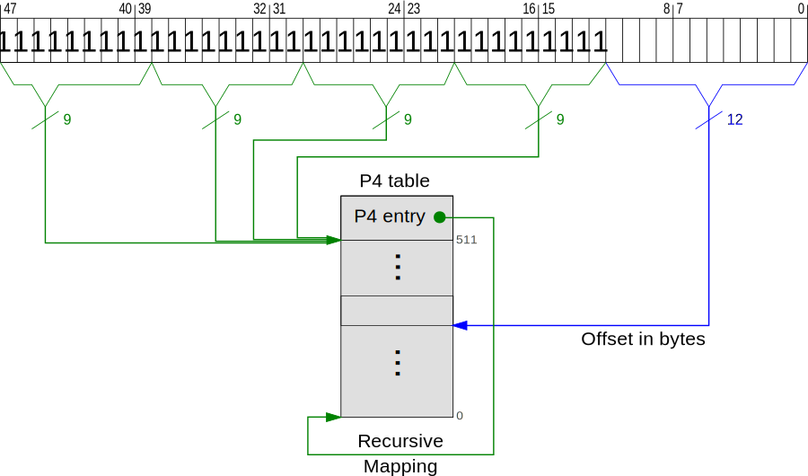

+++
title = "Page Tables"
weight = 6
path = "page-tables"
aliases = ["page-tables.html", "modifying-page-tables.html"]
date  = 2015-12-09
template = "first-edition/page.html"
+++

In this post we will create a paging module, which allows us to access and modify the 4-level page table. We will explore recursive page table mapping and use some Rust features to make it safe. Finally we will create functions to translate virtual addresses and to map and unmap pages.

<!-- more -->

You can find the source code and this post itself on [GitHub][source repository]. Please file an issue there if you have any problems or improvement suggestions. There is also a comment section at the end of this page. Note that this post requires a current Rust nightly.

[source repository]: https://github.com/phil-opp/blog_os/tree/first_edition_post_6

## Paging
_Paging_ is a memory management scheme that separates virtual and physical memory. The address space is split into equal sized _pages_ and _page tables_ specify which virtual page points to which physical frame. For an extensive paging introduction take a look at the paging chapter ([PDF][paging chapter]) of the [Three Easy Pieces] OS book.

[paging chapter]: http://pages.cs.wisc.edu/~remzi/OSTEP/vm-paging.pdf
[Three Easy Pieces]: http://pages.cs.wisc.edu/~remzi/OSTEP/

The x86 architecture uses a 4-level page table in 64-bit mode. A virtual address has the following structure:


The bits 48–63 are so-called _sign extension_ bits and must be copies of bit 47. The following 36 bits define the page table indexes (9 bits per table) and the last 12 bits specify the offset in the 4KiB page.

Each table has 2^9 = 512 entries and each entry is 8 byte. Thus a page table fits exactly in one page (4 KiB).

To translate an address, the CPU reads the P4 address from the CR3 register. Then it uses the indexes to walk the tables:


The P4 entry points to a P3 table, where the next 9 bits of the address are used to select an entry. The P3 entry then points to a P2 table and the P2 entry points to a P1 table. The P1 entry, which is specified through bits 12–20, finally points to the physical frame.

## A Basic Paging Module
Let's create a basic paging module in `memory/paging/mod.rs`:

```rust
use memory::PAGE_SIZE; // needed later

const ENTRY_COUNT: usize = 512;

pub type PhysicalAddress = usize;
pub type VirtualAddress = usize;

pub struct Page {
   number: usize,
}
```
We import the `PAGE_SIZE` and define a constant for the number of entries per table. To make future function signatures more expressive, we can use the type aliases `PhysicalAddress` and `VirtualAddress`. The `Page` struct is similar to the `Frame` struct in the [previous post], but represents a virtual page instead of a physical frame.

[previous post]: ./first-edition/posts/05-allocating-frames/index.md#a-memory-module

### Page Table Entries
To model page table entries, we create a new `entry` submodule:

```rust
use memory::Frame; // needed later

pub struct Entry(u64);

impl Entry {
    pub fn is_unused(&self) -> bool {
        self.0 == 0
    }

    pub fn set_unused(&mut self) {
        self.0 = 0;
    }
}
```
We define that an unused entry is completely 0. That allows us to distinguish unused entries from other non-present entries in the future. For example, we could define one of the available bits as the `swapped_out` bit for pages that are swapped to disk.

Next we will model the contained physical address and the various flags. Remember, entries have the following format:

Bit(s)                | Name | Meaning
--------------------- | ------ | ----------------------------------
0 | present | the page is currently in memory
1 | writable | it's allowed to write to this page
2 | user accessible | if not set, only kernel mode code can access this page
3 | write through caching | writes go directly to memory
4 | disable cache | no cache is used for this page
5 | accessed | the CPU sets this bit when this page is used
6 | dirty | the CPU sets this bit when a write to this page occurs
7 | huge page/null | must be 0 in P1 and P4, creates a 1GiB page in P3, creates a 2MiB page in P2
8 | global | page isn't flushed from caches on address space switch (PGE bit of CR4 register must be set)
9-11 | available | can be used freely by the OS
12-51 | physical address | the page aligned 52bit physical address of the frame or the next page table
52-62 | available | can be used freely by the OS
63 | no execute | forbid executing code on this page (the NXE bit in the EFER register must be set)

To model the various flags, we will use the [bitflags] crate. To add it as a dependency, add the following to your `Cargo.toml`:

[bitflags]: https://github.com/rust-lang-nursery/bitflags

```toml
[dependencies]
...
bitflags = "0.9.1"
```

To import the macro, we need to use `#[macro_use]` above the `extern crate` definition:

```rust
// in src/lib.rs
#[macro_use]
extern crate bitflags;
```

Now we can model the various flags:

```rust
bitflags! {
    pub struct EntryFlags: u64 {
        const PRESENT =         1 << 0;
        const WRITABLE =        1 << 1;
        const USER_ACCESSIBLE = 1 << 2;
        const WRITE_THROUGH =   1 << 3;
        const NO_CACHE =        1 << 4;
        const ACCESSED =        1 << 5;
        const DIRTY =           1 << 6;
        const HUGE_PAGE =       1 << 7;
        const GLOBAL =          1 << 8;
        const NO_EXECUTE =      1 << 63;
    }
}
```
To extract the flags from the entry we create an `Entry::flags` method that uses [from_bits_truncate]:

[from_bits_truncate]: https://doc.rust-lang.org/bitflags/bitflags/index.html#methods-1

```rust
pub fn flags(&self) -> EntryFlags {
    EntryFlags::from_bits_truncate(self.0)
}
```
This allows us to check for flags through the `contains()` function. For example, `flags().contains(PRESENT | WRITABLE)` returns true if the entry contains _both_ flags.

To extract the physical address, we add a `pointed_frame` method:

```rust
pub fn pointed_frame(&self) -> Option<Frame> {
    if self.flags().contains(PRESENT) {
        Some(Frame::containing_address(
            self.0 as usize & 0x000fffff_fffff000
        ))
    } else {
        None
    }
}
```
If the entry is present, we mask bits 12–51 and return the corresponding frame. If the entry is not present, it does not point to a valid frame so we return `None`.

To modify entries, we add a `set` method that updates the flags and the pointed frame:

```rust
pub fn set(&mut self, frame: Frame, flags: EntryFlags) {
    assert!(frame.start_address() & !0x000fffff_fffff000 == 0);
    self.0 = (frame.start_address() as u64) | flags.bits();
}
```
The start address of a frame should be page aligned and smaller than 2^52 (since x86 uses 52bit physical addresses). Since an invalid address could mess up the entry, we add an assertion. To actually set the entry, we just need to `or` the start address and the flag bits.

The missing `Frame::start_address` method is pretty simple:

```rust
use self::paging::PhysicalAddress;

fn start_address(&self) -> PhysicalAddress {
    self.number * PAGE_SIZE
}
```
We add it to the `impl Frame` block in `memory/mod.rs`.

### Page Tables
To model page tables, we create a basic `Table` struct in a new `table` submodule:

```rust
use memory::paging::entry::*;
use memory::paging::ENTRY_COUNT;

pub struct Table {
    entries: [Entry; ENTRY_COUNT],
}
```
It's just an array of 512 page table entries.

To make the `Table` indexable itself, we can implement the `Index` and `IndexMut` traits:

```rust
use core::ops::{Index, IndexMut};

impl Index<usize> for Table {
    type Output = Entry;

    fn index(&self, index: usize) -> &Entry {
        &self.entries[index]
    }
}

impl IndexMut<usize> for Table {
    fn index_mut(&mut self, index: usize) -> &mut Entry {
        &mut self.entries[index]
    }
}
```
Now it's possible to get the 42th entry through `some_table[42]`. Of course we could replace `usize` with `u32` or even `u16` here but it would cause more numerical conversions (`x as u16`).

Let's add a method that sets all entries to unused. We will need it when we create new page tables in the future. The method looks like this:

```rust
pub fn zero(&mut self) {
    for entry in self.entries.iter_mut() {
        entry.set_unused();
    }
}
```

Now we can read page tables and retrieve the mapping information. We can also update them through the `IndexMut` trait and the `Entry::set` method. But how do we get references to the various page tables?

We could read the `CR3` register to get the physical address of the P4 table and read its entries to get the P3 addresses. The P3 entries then point to the P2 tables and so on. But this method only works for identity-mapped pages. In the future we will create new page tables, which aren't in the identity-mapped area anymore. Since we can't access them through their physical address, we need a way to map them to virtual addresses.

## Mapping Page Tables
So how do we map the page tables itself? We don't have that problem for the current P4, P3, and P2 table since they are part of the identity-mapped area, but we need a way to access future tables, too.

One solution is to identity map all page tables. That way we would not need to differentiate virtual and physical addresses and could easily access the tables. But it clutters the virtual address space and increases fragmentation. And it makes creating page tables much more complicated since we need a physical frame whose corresponding page isn't already used for something else.

An alternative solution is to map the page tables only temporary. To read/write a page table, we would map it to some free virtual address until we're done. We could use a small pool of such virtual addresses and reuse them for various tables. This method occupies only few virtual addresses and thus is a good solution for 32-bit systems, which have small address spaces. But it makes things much more complicated since we need to temporary map up to 4 tables to access a single page. And the temporary mapping requires modification of other page tables, which need to be mapped, too.

We will solve the problem in another way using a trick called _recursive mapping_.

### Recursive Mapping
The trick is to map the P4 table recursively: The last entry doesn't point to a P3 table, but to the P4 table itself. We can use this entry to remove a translation level so that we land on a page table instead. For example, we can “loop” once to access a P1 table:


By selecting the 511th P4 entry, which points points to the P4 table itself, the P4 table is used as the P3 table. Similarly, the P3 table is used as a P2 table and the P2 table is treated like a P1 table. Thus the P1 table becomes the target page and can be accessed through the offset.

It's also possible to access P2 tables by looping twice. And if we select the 511th entry three times, we can access and modify P3 tables:


So we just need to specify the desired P3 table in the address through the P1 index. By choosing the 511th entry multiple times, we stay on the P4 table until the address's P1 index becomes the actual P4 index.

To access the P4 table itself, we loop once more and thus never leave the frame:



So we can access and modify page tables of all levels by just setting one P4 entry once. Most work is done by the CPU, we just the recursive entry to remove one or more translation levels. It may seem a bit strange at first, but it's a clean and simple solution once you wrapped your head around it.

By using recursive mapping, each page table is accessible through an unique virtual address. The math checks out, too: If all page tables are used, there is 1 P4 table, 511 P3 tables (the last entry is used for the recursive mapping), `511*512` P2 tables, and `511*512*512` P1 tables. So there are `134217728` page tables altogether. Each page table occupies 4KiB, so we need `134217728 * 4KiB = 512GiB` to store them. That's exactly the amount of memory that can be accessed through one P4 entry since `4KiB per page * 512 P1 entries * 512 P2 entries * 512 P3 entries = 512GiB`.

Of course recursive mapping has some disadvantages, too. It occupies a P4 entry and thus 512GiB of the virtual address space. But since we're in long mode and have a 48-bit address space, there are still 225.5TiB left. The bigger problem is that only the active table can be modified by default. To access another table, the recursive entry needs to be replaced temporary. We will tackle this problem in the next post when we switch to a new page table.

### Implementation
To map the P4 table recursively, we just need to point the 511th entry to the table itself. Of course we could do it in Rust, but it would require some fiddling with unsafe pointers. It's easier to just add some lines to our boot assembly:

```nasm
mov eax, p4_table
or eax, 0b11 ; present + writable
mov [p4_table + 511 * 8], eax
```
I put it right after the `set_up_page_tables` label, but you can add it wherever you like.

Now we can use special virtual addresses to access the page tables. The P4 table is available at `0xfffffffffffff000`. Let's add a P4 constant to the `table` submodule:

```rust
pub const P4: *mut Table = 0xffffffff_fffff000 as *mut _;
```

Let's switch to the octal system, since it makes more sense for the other special addresses. The P4 address from above is equivalent to `0o177777_777_777_777_777_0000` in octal. You can see that is has index `777` in all tables and offset `0000`. The `177777` bits on the left are the sign extension bits, which are copies of the 47th bit. They are required because x86 only uses 48bit virtual addresses.

The other tables can be accessed through the following addresses:

Table | Address                         | Indexes
----- | ------------------------------- | ----------------------------------
P4    | `0o177777_777_777_777_777_0000` | –
P3    | `0o177777_777_777_777_XXX_0000` | `XXX` is the P4 index
P2    | `0o177777_777_777_XXX_YYY_0000` | like above, and `YYY` is the P3 index
P1    | `0o177777_777_XXX_YYY_ZZZ_0000` | like above, and `ZZZ` is the P2 index

If we look closely, we can see that the P3 address is equal to `(P4 << 9) | XXX_0000`. And the P2 address is calculated through `(P3 << 9) | YYY_0000`. So to get the next address, we need to shift it 9 bits to the left and add the table index. As a formula:

```
next_table_address = (table_address << 9) | (index << 12)
```

### The `next_table` Methods
Let's add the above formula as a `Table` method:

```rust
fn next_table_address(&self, index: usize) -> Option<usize> {
    let entry_flags = self[index].flags();
    if entry_flags.contains(PRESENT) && !entry_flags.contains(HUGE_PAGE) {
        let table_address = self as *const _ as usize;
        Some((table_address << 9) | (index << 12))
    } else {
        None
    }
}
```
The next table address is only valid if the corresponding entry is present and does not create a huge page. Then we can do some pointer casting to get the table address and use the formula to calculate the next address.

If the index is out of bounds, the function will panic since Rust checks array bounds. The panic is desired here since a wrong index should not be possible and indicates a bug.

To convert the address into references, we add two functions:

```rust
pub fn next_table(&self, index: usize) -> Option<&Table> {
    self.next_table_address(index)
        .map(|address| unsafe { &*(address as *const _) })
}

pub fn next_table_mut(&mut self, index: usize) -> Option<&mut Table> {
    self.next_table_address(index)
        .map(|address| unsafe { &mut *(address as *mut _) })
}
```
We convert the address into raw pointers through `as` casts and then convert them into Rust references through `&mut *`. The latter is an `unsafe` operation since Rust can't guarantee that the raw pointer is valid.

Note that `self` stays borrowed as long as the returned reference is valid. This is because of Rust's [lifetime elision] rules. Basically, these rules say that the lifetime of an output reference is the same as the lifetime of the input reference by default. So the above function signatures are expanded to:

[lifetime elision]: https://doc.rust-lang.org/book/lifetimes.html#lifetime-elision

```rust
pub fn next_table<'a>(&'a self, index: usize) -> Option<&'a Table> {...}

pub fn next_table_mut<'a>(&'a mut self, index: usize)
    -> Option<&'a mut Table>
{...}
```

Note the additional lifetime parameters, which are identical for input and output references. That's exactly what we want. It ensures that we can't modify tables as long as we have references to lower tables. For example, it would be very bad if we could unmap a P3 table if we still write to one of its P2 tables.

#### Safety
Now we can start at the `P4` constant and use the `next_table` functions to access the lower tables. And we don't even need `unsafe` blocks to do it! Right now, your alarm bells should be ringing. Thanks to Rust, everything we've done before in this post was completely safe. But we just introduced two unsafe blocks to convince Rust that there are valid tables at the specified addresses. Can we really be sure?

First, these addresses are only valid if the P4 table is mapped recursively. Since the paging module will be the only module that modifies page tables, we can introduce an invariant for the module:

> _The 511th entry of the active P4 table must always be mapped to the active P4 table itself._

So if we switch to another P4 table at some time, it needs to be identity mapped _before_ it becomes active. As long as we obey this invariant, we can safely use the special addresses. But even with this invariant, there is a big problem with the two methods:

_What happens if we call them on a P1 table?_

Well, they would calculate the address of the next table (which does not exist) and treat it as a page table. Either they construct an invalid address (if `XXX < 400`)[^fn-invalid-address] or access the mapped page itself. That way, we could easily corrupt memory or cause CPU exceptions by accident. So these two functions are not _safe_ in Rust terms. Thus we need to make them `unsafe` functions unless we find some clever solution.

## Some Clever Solution
We can use Rust's type system to statically guarantee that the `next_table` methods can only be called on P4, P3, and P2 tables, but not on a P1 table. The idea is to add a `Level` parameter to the `Table` type and implement the `next_table` methods only for level 4, 3, and 2.

To model the levels we use a trait and empty enums:

```rust
pub trait TableLevel {}

pub enum Level4 {}
pub enum Level3 {}
pub enum Level2 {}
pub enum Level1 {}

impl TableLevel for Level4 {}
impl TableLevel for Level3 {}
impl TableLevel for Level2 {}
impl TableLevel for Level1 {}
```
An empty enum has size zero and disappears completely after compiling. Unlike an empty struct, it's not possible to instantiate an empty enum. Since we will use `TableLevel` and the table levels in exported types, they need to be public.

To differentiate the P1 table from the other tables, we introduce a `HierarchicalLevel` trait, which is a subtrait of `TableLevel`. But we implement it only for the levels 4, 3, and 2:

```rust
pub trait HierarchicalLevel: TableLevel {}

impl HierarchicalLevel for Level4 {}
impl HierarchicalLevel for Level3 {}
impl HierarchicalLevel for Level2 {}
```

Now we add the level parameter to the `Table` type:

```rust
use core::marker::PhantomData;

pub struct Table<L: TableLevel> {
    entries: [Entry; ENTRY_COUNT],
    level: PhantomData<L>,
}
```
We need to add a [PhantomData] field because unused type parameters are not allowed in Rust.

[PhantomData]: https://doc.rust-lang.org/core/marker/struct.PhantomData.html#unused-type-parameters

Since we changed the `Table` type, we need to update every use of it:

```rust
pub const P4: *mut Table<Level4> = 0xffffffff_fffff000 as *mut _;
...
impl<L> Table<L> where L: TableLevel
{
    pub fn zero(&mut self) {...}
}

impl<L> Table<L> where L: HierarchicalLevel
{
    pub fn next_table(&self, index: usize) -> Option<&Table<???>> {...}

    pub fn next_table_mut(&mut self, index: usize) -> Option<&mut Table<???>>
    {...}

    fn next_table_address(&self, index: usize) -> Option<usize> {...}
}

impl<L> Index<usize> for Table<L> where L: TableLevel {...}

impl<L> IndexMut<usize> for Table<L> where L: TableLevel {...}
```
Now the `next_table` methods are only available for P4, P3, and P2 tables. But they have the incomplete return type `Table<???>` now. What should we fill in for the `???`?

For a P4 table we would like to return a `Table<Level3>`, for a P3 table a `Table<Level2>`, and for a P2 table a `Table<Level1>`. So we want to return a table of the _next level_.

We can define the next level by adding an associated type to the `HierarchicalLevel` trait:

```rust
trait HierarchicalLevel: TableLevel {
    type NextLevel: TableLevel;
}

impl HierarchicalLevel for Level4 {
    type NextLevel = Level3;
}

impl HierarchicalLevel for Level3 {
    type NextLevel = Level2;
}

impl HierarchicalLevel for Level2 {
    type NextLevel = Level1;
}
```

Now we can replace the `Table<???>` types with `Table<L::NextLevel>` types and our code works as intended. You can try it with a simple test function:

```rust
fn test() {
    let p4 = unsafe { &*P4 };
    p4.next_table(42)
      .and_then(|p3| p3.next_table(1337))
      .and_then(|p2| p2.next_table(0xdeadbeaf))
      .and_then(|p1| p1.next_table(0xcafebabe))
}
```
Most of the indexes are completely out of bounds, so it would panic if it's called. But we don't need to call it since it already fails at compile time:

```
error: no method named `next_table` found for type
  `&memory::paging::table::Table<memory::paging::table::Level1>`
  in the current scope
```
Remember that this is bare metal kernel code. We just used type system magic to make low-level page table manipulations safer. Rust is just awesome!

## Translating Addresses
Now let's do something useful with our new module. We will create a function that translates a virtual address to the corresponding physical address. We add it to the `paging/mod.rs` module:

```rust
pub fn translate(virtual_address: VirtualAddress)
    -> Option<PhysicalAddress>
{
    let offset = virtual_address % PAGE_SIZE;
    translate_page(Page::containing_address(virtual_address))
        .map(|frame| frame.number * PAGE_SIZE + offset)
}
```
It uses two functions we haven't defined yet: `translate_page` and `Page::containing_address`. Let's start with the latter:

```rust
pub fn containing_address(address: VirtualAddress) -> Page {
    assert!(address < 0x0000_8000_0000_0000 ||
        address >= 0xffff_8000_0000_0000,
        "invalid address: 0x{:x}", address);
    Page { number: address / PAGE_SIZE }
}
```
The assertion is needed because there can be invalid addresses. Addresses on x86 are just 48-bit long and the other bits are just _sign extension_, i.e. a copy of the most significant bit. For example:

```
invalid address: 0x0000_8000_0000_0000
valid address:   0xffff_8000_0000_0000
                        └── bit 47
```
So the address space is split into two halves: the _higher half_ containing addresses with sign extension and the _lower half_ containing addresses without. Everything in between is invalid.

Since we added `containing_address`, we add the inverse method as well (maybe we need it later):

```rust
fn start_address(&self) -> usize {
    self.number * PAGE_SIZE
}
```

The other missing function, `translate_page`, looks like this:

```rust
use memory::Frame;

fn translate_page(page: Page) -> Option<Frame> {
    use self::entry::HUGE_PAGE;

    let p3 = unsafe { &*table::P4 }.next_table(page.p4_index());

    let huge_page = || {
        // TODO
    };

    p3.and_then(|p3| p3.next_table(page.p3_index()))
      .and_then(|p2| p2.next_table(page.p2_index()))
      .and_then(|p1| p1[page.p1_index()].pointed_frame())
      .or_else(huge_page)
}
```
We use an unsafe block to convert the raw `P4` pointer to a reference. Then we use the [Option::and_then] function to go through the four table levels. If some entry along the way is `None`, we check if the page is a huge page through the (unimplemented) `huge_page` closure.

The `Page::p*_index` functions return the different table indexes. They look like this:

[Option::and_then]: https://doc.rust-lang.org/nightly/core/option/enum.Option.html#method.and_then

```rust
fn p4_index(&self) -> usize {
    (self.number >> 27) & 0o777
}
fn p3_index(&self) -> usize {
    (self.number >> 18) & 0o777
}
fn p2_index(&self) -> usize {
    (self.number >> 9) & 0o777
}
fn p1_index(&self) -> usize {
    (self.number >> 0) & 0o777
}
```

### Safety
We use an `unsafe` block to convert the raw `P4` pointer into a shared reference. It's safe because we don't create any `&mut` references to the table right now and don't switch the P4 table either. But as soon as we do something like that, we have to revisit this method.

### Huge Pages

The `huge_page` closure calculates the corresponding frame if huge pages are used. Its content looks like this:

```rust
p3.and_then(|p3| {
      let p3_entry = &p3[page.p3_index()];
      // 1GiB page?
      if let Some(start_frame) = p3_entry.pointed_frame() {
          if p3_entry.flags().contains(HUGE_PAGE) {
              // address must be 1GiB aligned
              assert!(start_frame.number % (ENTRY_COUNT * ENTRY_COUNT) == 0);
              return Some(Frame {
                  number: start_frame.number + page.p2_index() *
                          ENTRY_COUNT + page.p1_index(),
              });
          }
      }
      if let Some(p2) = p3.next_table(page.p3_index()) {
          let p2_entry = &p2[page.p2_index()];
          // 2MiB page?
          if let Some(start_frame) = p2_entry.pointed_frame() {
              if p2_entry.flags().contains(HUGE_PAGE) {
                  // address must be 2MiB aligned
                  assert!(start_frame.number % ENTRY_COUNT == 0);
                  return Some(Frame {
                      number: start_frame.number + page.p1_index()
                  });
              }
          }
      }
      None
  })
```
This function is much longer and more complex than the `translate_page` function itself. To avoid this complexity in the future, we will only work with standard 4KiB pages from now on.

## Mapping Pages
Let's add a function that modifies the page tables to map a `Page` to a `Frame`:

```rust
pub use self::entry::*;
use memory::FrameAllocator;

pub fn map_to<A>(page: Page, frame: Frame, flags: EntryFlags,
                 allocator: &mut A)
    where A: FrameAllocator
{
    let p4 = unsafe { &mut *P4 };
    let mut p3 = p4.next_table_create(page.p4_index(), allocator);
    let mut p2 = p3.next_table_create(page.p3_index(), allocator);
    let mut p1 = p2.next_table_create(page.p2_index(), allocator);

    assert!(p1[page.p1_index()].is_unused());
    p1[page.p1_index()].set(frame, flags | PRESENT);
}
```
We add an re-export for all `entry` types since they are required to call the function. We assert that the page is unmapped and always set the present flag (since it wouldn't make sense to map a page without setting it).

The `Table::next_table_create` method doesn't exist yet. It should return the next table if it exists, or create a new one. For the implementation we need the `FrameAllocator` from the [previous post] and the `Table::zero` method:

```rust
use memory::FrameAllocator;

pub fn next_table_create<A>(&mut self,
                            index: usize,
                            allocator: &mut A)
                            -> &mut Table<L::NextLevel>
    where A: FrameAllocator
{
    if self.next_table(index).is_none() {
        assert!(!self.entries[index].flags().contains(HUGE_PAGE),
                "mapping code does not support huge pages");
        let frame = allocator.allocate_frame().expect("no frames available");
        self.entries[index].set(frame, PRESENT | WRITABLE);
        self.next_table_mut(index).unwrap().zero();
    }
    self.next_table_mut(index).unwrap()
}
```
We can use `unwrap()` here since the next table definitely exists.

### Safety
We used an `unsafe` block in `map_to` to convert the raw `P4` pointer to a `&mut` reference. That's bad. It's now possible that the `&mut` reference is not exclusive, which breaks Rust's guarantees. It's only a matter time before we run into a data race. For example, imagine that one thread maps an entry to `frame_A` and another thread (on the same core) tries to map the same entry to `frame_B`.

The problem is that there's no clear _owner_ for the page tables. So let's define page table ownership!

### Page Table Ownership
We define the following:

> A page table owns all of its subtables.

We already obey this rule: To get a reference to a table, we need to borrow it from its parent table through the `next_table` method. But who owns the P4 table?

> The recursively mapped P4 table is owned by a `ActivePageTable` struct.

We just defined some random owner for the P4 table. But it will solve our problems. And it will also provide the interface to other modules.

So let's create the struct:

```rust
use self::table::{Table, Level4};
use core::ptr::Unique;

pub struct ActivePageTable {
    p4: Unique<Table<Level4>>,
}
```
We can't store the `Table<Level4>` directly because it needs to be at a special memory location (like the [VGA text buffer]). We could use a raw pointer or `&mut` instead of [Unique], but Unique indicates ownership better.

[VGA text buffer]: ./first-edition/posts/04-printing-to-screen/index.md#the-text-buffer
[Unique]: https://doc.rust-lang.org/nightly/core/ptr/struct.Unique.html

Because the `ActivePageTable` owns the unique recursive mapped P4 table, there must be only one `ActivePageTable` instance. Thus we make the constructor function unsafe:

```rust
impl ActivePageTable {
    pub unsafe fn new() -> ActivePageTable {
        ActivePageTable {
            p4: Unique::new_unchecked(table::P4),
        }
    }
}
```

We add some methods to get P4 references:

```rust
fn p4(&self) -> &Table<Level4> {
    unsafe { self.p4.as_ref() }
}

fn p4_mut(&mut self) -> &mut Table<Level4> {
    unsafe { self.p4.as_mut() }
}
```

Since we will only create valid P4 pointers, the `unsafe` blocks are safe. However, we don't make these functions public since they can be used to make page tables invalid. Only the higher level functions (such as `translate` or `map_to`) should be usable from other modules.

Now we can make the `map_to` and `translate` functions safe by making them methods of `ActivePageTable`:

```rust
impl ActivePageTable {
    pub unsafe fn new() -> ActivePageTable {...}

    fn p4(&self) -> &Table<Level4> {...}

    fn p4_mut(&mut self) -> &mut Table<Level4> {...}

    pub fn translate(&self, virtual_address: VirtualAddress)
        -> Option<PhysicalAddress>
    {
        ...
        self.translate_page(...).map(...)
    }

    fn translate_page(&self, page: Page) -> Option<Frame> {
        let p3 = self.p4().next_table(...);
        ...
    }

    pub fn map_to<A>(&mut self,
                     page: Page,
                     frame: Frame,
                     flags: EntryFlags,
                     allocator: &mut A)
        where A: FrameAllocator
    {
        let mut p3 = self.p4_mut().next_table_create(...);
        ...
    }
}
```
Now the `p4()` and `p4_mut()` methods should be the only methods containing an `unsafe` block in the `paging/mod.rs` file.

### More Mapping Functions

For convenience, we add a `map` method that just picks a free frame for us:

```rust
pub fn map<A>(&mut self, page: Page, flags: EntryFlags, allocator: &mut A)
    where A: FrameAllocator
{
    let frame = allocator.allocate_frame().expect("out of memory");
    self.map_to(page, frame, flags, allocator)
}
```

We also add a `identity_map` function to make it easier to remap the kernel in the next post:

```rust
pub fn identity_map<A>(&mut self,
                       frame: Frame,
                       flags: EntryFlags,
                       allocator: &mut A)
    where A: FrameAllocator
{
    let page = Page::containing_address(frame.start_address());
    self.map_to(page, frame, flags, allocator)
}
```

### Unmapping Pages
To unmap a page, we set the corresponding P1 entry to unused:

```rust
fn unmap<A>(&mut self, page: Page, allocator: &mut A)
    where A: FrameAllocator
{
    assert!(self.translate(page.start_address()).is_some());

    let p1 = self.p4_mut()
                 .next_table_mut(page.p4_index())
                 .and_then(|p3| p3.next_table_mut(page.p3_index()))
                 .and_then(|p2| p2.next_table_mut(page.p2_index()))
                 .expect("mapping code does not support huge pages");
    let frame = p1[page.p1_index()].pointed_frame().unwrap();
    p1[page.p1_index()].set_unused();
    // TODO free p(1,2,3) table if empty
    allocator.deallocate_frame(frame);
}
```
The assertion ensures that the page is mapped. Thus the corresponding P1 table and frame must exist for a standard 4KiB page. We set the entry to unused and free the associated frame in the supplied frame allocator.

We can also free the P1, P2, or even P3 table when the last entry is freed. But checking the whole table on every `unmap` would be very expensive. So we leave the `TODO` in place until we find a good solution. I'm open for suggestions :).

_Spoiler_: There is an ugly bug in this function, which we will find in the next section.

## Testing and Bugfixing
To test it, we add a `test_paging` function in `memory/paging/mod.rs`:

```rust
pub fn test_paging<A>(allocator: &mut A)
    where A: FrameAllocator
{
    let mut page_table = unsafe { ActivePageTable::new() };

    // test it
}
```
We borrow the frame allocator since we will need it for the mapping functions. To be able to call that function from main, we need to re-export it in `memory/mod.rs`:

```rust
// in memory/mod.rs
pub use self::paging::test_paging;

// lib.rs
let mut frame_allocator = ...;
memory::test_paging(&mut frame_allocator);
```

### map_to
Let's test the `map_to` function:

```rust
let addr = 42 * 512 * 512 * 4096; // 42th P3 entry
let page = Page::containing_address(addr);
let frame = allocator.allocate_frame().expect("no more frames");
println!("None = {:?}, map to {:?}",
         page_table.translate(addr),
         frame);
page_table.map_to(page, frame, EntryFlags::empty(), allocator);
println!("Some = {:?}", page_table.translate(addr));
println!("next free frame: {:?}", allocator.allocate_frame());
```
We just map some random page to a free frame. To be able to borrow the page table as `&mut`, we need to make it mutable.

You should see output similar to this:

```
None = None, map to Frame { number: 0 }
Some = Some(0)
next free frame: Some(Frame { number: 3 })
```
It's frame 0 because it's the first frame returned by the frame allocator. Since we map the 42th P3 entry, the mapping code needs to create a P2 and a P1 table. So the next free frame returned by the allocator is frame 3.

### unmap
To test the `unmap` function, we unmap the test page so that it translates to `None` again:

```rust
page_table.unmap(Page::containing_address(addr), allocator);
println!("None = {:?}", page_table.translate(addr));
```
It causes a panic since we call the unimplemented `deallocate_frame` method in `unmap`. If we comment this call out, it works without problems. But there is some bug in this function nevertheless.

Let's read something from the mapped page (of course before we unmap it again):

```rust
println!("{:#x}", unsafe {
    *(Page::containing_address(addr).start_address() as *const u64)
});
```
Since we don't zero the mapped pages, the output is random. For me, it's `0xf000ff53f000ff53`.

If `unmap` worked correctly, reading it again after unmapping should cause a page fault. But it doesn't. Instead, it just prints the same number again. When we remove the first read, we get the desired page fault (i.e. QEMU reboots again and again). So this seems to be some cache issue.

An x86 processor has many different caches because always accessing the main memory would be very slow. Most of these caches are completely _transparent_. That means everything works exactly the same as without them, it's just much faster. But there is one cache, that needs to be updated manually: the _translation lookaside buffer_.

The translation lookaside buffer, or TLB, caches the translation of virtual to physical addresses. It's filled automatically when a page is accessed. But it's not updated transparently when the mapping of a page changes. This is the reason that we still can access the page even through we unmapped it in the page table.

So to fix our `unmap` function, we need to remove the cached translation from the TLB. We can use the [x86_64][x86_64 crate] crate to do this easily. To add it, we append the following to our `Cargo.toml`:

[x86_64 crate]: https://docs.rs/x86_64

```toml
[dependencies]
...
x86_64 = "0.1.2"
```

 Now we can use it to fix `unmap`:

```rust
...
    p1[page.p1_index()].set_unused();

    use x86_64::instructions::tlb;
    use x86_64::VirtualAddress;
    tlb::flush(VirtualAddress(page.start_address()));

    // TODO free p(1,2,3) table if empty
    //allocator.deallocate_frame(frame);
}
```
Now the desired page fault occurs even when we access the page before.

## Conclusion
This post has become pretty long. So let's summarize what we've done:

- we created a paging module and modeled page tables plus entries
- we mapped the P4 page recursively and created `next_table` methods
- we used empty enums and associated types to make the `next_table` functions safe
- we wrote a function to translate virtual to physical addresses
- we created safe functions to map and unmap pages
- and we fixed stack overflow and TLB related bugs

## What's next?
In the [next post] we will extend this module and add a function to modify inactive page tables. Through that function, we will create a new page table hierarchy that maps the kernel correctly using 4KiB pages. Then we will switch to the new table to get a safer kernel environment.

[next post]: ./first-edition/posts/07-remap-the-kernel/index.md

Afterwards, we will use this paging module to build a heap allocator. This will allow us to use allocation and collection types such as `Box` and `Vec`.

<small>Image sources: [^virtual_physical_translation_source]</small>

## Footnotes
[^fn-invalid-address]: If the `XXX` part of the address is smaller than `0o400`, it's binary representation doesn't start with `1`. But the sign extension bits, which should be a copy of that bit, are `1` instead of `0`. Thus the address is not valid.

[^virtual_physical_translation_source]: Image sources: Modified versions of an image from  [Wikipedia](https://commons.wikimedia.org/wiki/File:X86_Paging_64bit.svg). The modified files are licensed under the Creative Commons Attribution-Share Alike 3.0 Unported license.
