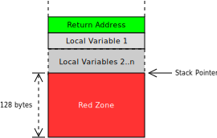

+++
title = "Disable the Red Zone"
weight = 1
path = "red-zone"
template = "second-edition/extra.html"
+++

The [red zone] is an optimization of the [System V ABI] that allows functions to temporarily use the 128 bytes below its stack frame without adjusting the stack pointer:

[red zone]: http://eli.thegreenplace.net/2011/09/06/stack-frame-layout-on-x86-64#the-red-zone
[System V ABI]: http://wiki.osdev.org/System_V_ABI

<!-- more -->

The image shows the stack frame of a function with `n` local variables. On function entry, the stack pointer is adjusted to make room on the stack for the return address and the local variables.

The red zone is defined as the 128 bytes below the adjusted stack pointer. The function can use this area for temporary data that's not needed across function calls. Thus, the two instructions for adjusting the stack pointer can be avoided in some cases (e.g. in small leaf functions).

However, this optimization leads to huge problems with exceptions or hardware interrupts. Let's assume that an exception occurs while a function uses the red zone:

The CPU and the exception handler overwrite the data in red zone. But this data is still needed by the interrupted function. So the function won't work correctly anymore when we return from the exception handler. This might lead to strange bugs that [take weeks to debug].

[take weeks to debug]: http://forum.osdev.org/viewtopic.php?t=21720

To avoid such bugs when we implement exception handling in the future, we disable the red zone right from the beginning. This is achieved by adding the `"disable-redzone": true` line to our target configuration file.
