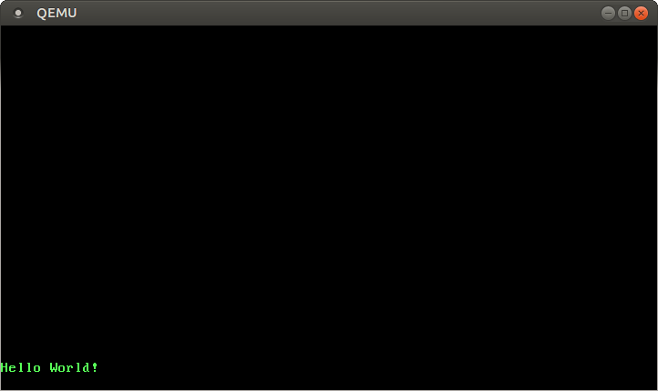
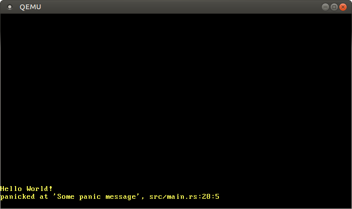

+++
title = "VGA Text Mode"
weight = 3
path = "vga-text-mode"
date  = 2018-02-26
template = "second-edition/page.html"
+++

The [VGA text mode] is a simple way to print text to the screen. In this post, we create an interface that makes its usage safe and simple, by encapsulating all unsafety in a separate module. We also implement support for Rust's [formatting macros].

[VGA text mode]: https://en.wikipedia.org/wiki/VGA-compatible_text_mode
[formatting macros]: https://doc.rust-lang.org/std/fmt/#related-macros

<!-- more -->

This blog is openly developed on [Github]. If you have any problems or questions, please open an issue there. You can also leave comments [at the bottom]. The complete source code for this post can be found [here][post branch].

[Github]: https://github.com/phil-opp/blog_os
[at the bottom]: #comments
[post branch]: https://github.com/phil-opp/blog_os/tree/post-03

## The VGA Text Buffer
To print a character to the screen in VGA text mode, one has to write it to the text buffer of the VGA hardware. The VGA text buffer is a two-dimensional array with typically 25 rows and 80 columns, which is directly rendered to the screen. Each array entry describes a single screen character through the following format:

Bit(s) | Value
------ | ----------------
0-7    | ASCII code point
8-11   | Foreground color
12-14  | Background color
15     | Blink

The following colors are available:

Number | Color      | Number + Bright Bit | Bright Color
------ | ---------- | ------------------- | -------------
0x0    | Black      | 0x8                 | Dark Gray
0x1    | Blue       | 0x9                 | Light Blue
0x2    | Green      | 0xa                 | Light Green
0x3    | Cyan       | 0xb                 | Light Cyan
0x4    | Red        | 0xc                 | Light Red
0x5    | Magenta    | 0xd                 | Pink
0x6    | Brown      | 0xe                 | Yellow
0x7    | Light Gray | 0xf                 | White

Bit 4 is the _bright bit_, which turns for example blue into light blue.

The VGA text buffer is accessible via [memory-mapped I/O] to the address `0xb8000`. This means that reads and writes to that address don't access the RAM, but directly the text buffer on the VGA hardware. This means that we can read and write it through normal memory operations to that address.

[memory-mapped I/O]: https://en.wikipedia.org/wiki/Memory-mapped_I/O

Note that memory-mapped hardware might not support all normal RAM operations. For example, a device could only support byte-wise reads and return junk when an `u64` is read. Fortunately, the text buffer [supports normal reads and writes], so that we don't have to treat it in special way.

[supports normal reads and writes]: https://web.stanford.edu/class/cs140/projects/pintos/specs/freevga/vga/vgamem.htm#manip

## A Rust Module
Now that we know how the VGA buffer works, we can create a Rust module to handle printing:

```rust
// in src/main.rs
mod vga_buffer;
```

For the content of this module we create a new `src/vga_buffer.rs` file. All of the code below goes into our new module (unless specified otherwise).

### Colors
First, we represent the different colors using an enum:

```rust
// in src/vga_buffer.rs

#[allow(dead_code)]
#[derive(Debug, Clone, Copy, PartialEq, Eq)]
#[repr(u8)]
pub enum Color {
    Black = 0,
    Blue = 1,
    Green = 2,
    Cyan = 3,
    Red = 4,
    Magenta = 5,
    Brown = 6,
    LightGray = 7,
    DarkGray = 8,
    LightBlue = 9,
    LightGreen = 10,
    LightCyan = 11,
    LightRed = 12,
    Pink = 13,
    Yellow = 14,
    White = 15,
}
```
We use a [C-like enum] here to explicitly specify the number for each color. Because of the `repr(u8)` attribute each enum variant is stored as an `u8`. Actually 4 bits would be sufficient, but Rust doesn't have an `u4` type.

[C-like enum]: http://rustbyexample.com/custom_types/enum/c_like.html

Normally the compiler would issue a warning for each unused variant. By using the `#[allow(dead_code)]` attribute we disable these warnings for the `Color` enum.

By [deriving] the [`Copy`], [`Clone`], [`Debug`], [`PartialEq`], and [`Eq`] traits, we enable [copy semantics] for the type and make it printable and comparable.

[deriving]: http://rustbyexample.com/trait/derive.html
[`Copy`]: https://doc.rust-lang.org/nightly/core/marker/trait.Copy.html
[`Clone`]: https://doc.rust-lang.org/nightly/core/clone/trait.Clone.html
[`Debug`]: https://doc.rust-lang.org/nightly/core/fmt/trait.Debug.html
[`PartialEq`]: https://doc.rust-lang.org/nightly/core/cmp/trait.PartialEq.html
[`Eq`]: https://doc.rust-lang.org/nightly/core/cmp/trait.Eq.html
[copy semantics]: https://doc.rust-lang.org/book/first-edition/ownership.html#copy-types

To represent a full color code that specifies foreground and background color, we create a [newtype] on top of `u8`:

[newtype]: https://rustbyexample.com/generics/new_types.html

```rust
// in src/vga_buffer.rs

#[derive(Debug, Clone, Copy, PartialEq, Eq)]
struct ColorCode(u8);

impl ColorCode {
    fn new(foreground: Color, background: Color) -> ColorCode {
        ColorCode((background as u8) << 4 | (foreground as u8))
    }
}
```
The `ColorCode` contains the full color byte, containing foreground and background color. Like before, we derive the `Copy` and `Debug` traits for it.

### Text Buffer
Now we can add structures to represent a screen character and the text buffer:

```rust
// in src/vga_buffer.rs

#[derive(Debug, Clone, Copy, PartialEq, Eq)]
#[repr(C)]
struct ScreenChar {
    ascii_character: u8,
    color_code: ColorCode,
}

const BUFFER_HEIGHT: usize = 25;
const BUFFER_WIDTH: usize = 80;

struct Buffer {
    chars: [[ScreenChar; BUFFER_WIDTH]; BUFFER_HEIGHT],
}
```
Since the field ordering in default structs is undefined in Rust, we need the [`repr(C)`] attribute. It guarantees that the struct's fields are laid out exactly like in a C struct and thus guarantees the correct field ordering.

[`repr(C)`]: https://doc.rust-lang.org/nightly/nomicon/other-reprs.html#reprc

To actually write to screen, we now create a writer type:

```rust
// in src/vga_buffer.rs

pub struct Writer {
    column_position: usize,
    color_code: ColorCode,
    buffer: &'static mut Buffer,
}
```
The writer will always write to the last line and shift lines up when a line is full (or on `\n`). The `column_position` field keeps track of the current position in the last row. The current foreground and background colors are specified by `color_code` and a reference to the VGA buffer is stored in `buffer`. Note that we need an [explicit lifetime] here to tell the compiler how long the reference is valid. The [`'static`] lifetime specifies that the reference is valid for the whole program run time (which is true for the VGA text buffer).

[explicit lifetime]: https://doc.rust-lang.org/book/first-edition/lifetimes.html#syntax
[`'static`]: https://doc.rust-lang.org/book/first-edition/lifetimes.html#static

### Printing
Now we can use the `Writer` to modify the buffer's characters. First we create a method to write a single ASCII byte:

```rust
// in src/vga_buffer.rs

impl Writer {
    pub fn write_byte(&mut self, byte: u8) {
        match byte {
            b'\n' => self.new_line(),
            byte => {
                if self.column_position >= BUFFER_WIDTH {
                    self.new_line();
                }

                let row = BUFFER_HEIGHT - 1;
                let col = self.column_position;

                let color_code = self.color_code;
                self.buffer.chars[row][col] = ScreenChar {
                    ascii_character: byte,
                    color_code,
                };
                self.column_position += 1;
            }
        }
    }

    fn new_line(&mut self) {/* TODO */}
}
```
If the byte is the [newline] byte `\n`, the writer does not print anything. Instead it calls a `new_line` method, which we'll implement later. Other bytes get printed to the screen in the second match case.

[newline]: https://en.wikipedia.org/wiki/Newline

When printing a byte, the writer checks if the current line is full. In that case, a `new_line` call is required before to wrap the line. Then it writes a new `ScreenChar` to the buffer at the current position. Finally, the current column position is advanced.

To print whole strings, we can convert them to bytes and print them one-by-one:

```rust
// in src/vga_buffer.rs

impl Writer {
    pub fn write_string(&mut self, s: &str) {
        for byte in s.bytes() {
            match byte {
                // printable ASCII byte or newline
                0x20...0x7e | b'\n' => self.write_byte(byte),
                // not part of printable ASCII range
                _ => self.write_byte(0xfe),
            }

        }
    }
}
```

The VGA text buffer only supports ASCII and the additional bytes of [code page 437]. Rust strings are [UTF-8] by default, so they might contain bytes that are not supported by the VGA text buffer. We use a match to differentiate printable ASCII bytes (a newline or anything in between a space character and a `~` character) and unprintable bytes. For unprintable bytes, we print a `■` character, which has the hex code `0xfe` on the VGA hardware.

[code page 437]: https://en.wikipedia.org/wiki/Code_page_437
[UTF-8]: http://www.fileformat.info/info/unicode/utf8.htm

#### Try it out!
To write some characters to the screen, you can create a temporary function:

```rust
// in src/vga_buffer.rs

pub fn print_something() {
    let mut writer = Writer {
        column_position: 0,
        color_code: ColorCode::new(Color::Yellow, Color::Black),
        buffer: unsafe { &mut *(0xb8000 as *mut Buffer) },
    };

    writer.write_byte(b'H');
    writer.write_string("ello ");
    writer.write_string("Wörld!");
}
```
It first creates a new Writer that points to the VGA buffer at `0xb8000`. The syntax for this might seem a bit strange: First, we cast the integer `0xb8000` as an mutable [raw pointer]. Then we convert it to a mutable reference by dereferencing it (through `*`) and immediately borrowing it again (through `&mut`). This conversion requires an [`unsafe` block], since the compiler can't guarantee that the raw pointer is valid.

[raw pointer]: https://doc.rust-lang.org/book/second-edition/ch19-01-unsafe-rust.html#dereferencing-a-raw-pointer
[`unsafe` block]: https://doc.rust-lang.org/book/second-edition/ch19-01-unsafe-rust.html#unsafe-rust

Then it writes the byte `b'H'` to it. The `b` prefix creates a [byte literal], which represents an ASCII character. By writing the strings `"ello "'` and `"Wörld!"`, we test our `write_string` method and the handling of unprintable characters.  When we call `vga_buffer::print_something` in our `_start` function (in `src/main.rs`), a `Hello W■■rld!` should be printed in the _lower_ left corner of the screen in yellow:

[byte literal]: https://doc.rust-lang.org/reference/tokens.html#byte-literals


Notice that the `ö` is printed as two `■` characters. That's because `ö` is represented by two bytes in [UTF-8], which both don't fall into the printable ASCII range. In fact, this is a fundamental property of UTF-8: the individual bytes of multi-byte values are never valid ASCII.

### Volatile
We just saw that our message was printed correctly. However, it might not work with future Rust compilers that optimize more aggressively.

The problem is that we only write to the `Buffer` and never read from it again. The compiler doesn't know that we really access VGA buffer memory (instead of normal RAM) and knows nothing about the side effect that some characters appear on the screen. So it might decide that these writes are unnecessary and can be omitted. To avoid this erroneous optimization, we need to specify these writes as _[volatile]_. This tells the compiler that the write has side effects and should not be optimized away.

[volatile]: https://en.wikipedia.org/wiki/Volatile_(computer_programming)

In order to use volatile writes for the VGA buffer, we use the [volatile][volatile crate] library. This _crate_ (this is how packages are called in the Rust world) provides a `Volatile` wrapper type with `read` and `write` methods. These methods internally use the [read_volatile] and [write_volatile] functions of the core library and thus guarantee that the reads/writes are not optimized away.

[volatile crate]: https://docs.rs/volatile
[read_volatile]: https://doc.rust-lang.org/nightly/core/ptr/fn.read_volatile.html
[write_volatile]: https://doc.rust-lang.org/nightly/core/ptr/fn.write_volatile.html

We can add a dependency on the `volatile` crate by adding it to the `dependencies` section of our `Cargo.toml`:

```toml
# in Cargo.toml

[dependencies]
volatile = "0.2.3"
```

The `0.2.3` is the [semantic] version number. For more information, see the [Specifying Dependencies] guide of the cargo documentation.

[semantic]: http://semver.org/
[Specifying Dependencies]: http://doc.crates.io/specifying-dependencies.html

Let's use it to make writes to the VGA buffer volatile. We update our `Buffer` type as follows:

```rust
// in src/vga_buffer.rs

use volatile::Volatile;

struct Buffer {
    chars: [[Volatile<ScreenChar>; BUFFER_WIDTH]; BUFFER_HEIGHT],
}
```
Instead of a `ScreenChar`, we're now using a `Volatile<ScreenChar>`. (The `Volatile` type is [generic] and can wrap (almost) any type). This ensures that we can't accidentally write to it through a “normal” write. Instead, we have to use the `write` method now.

[generic]: https://doc.rust-lang.org/book/second-edition/ch10-00-generics.html

This means that we have to update our `Writer::write_byte` method:

```rust
// in src/vga_buffer.rs

impl Writer {
    pub fn write_byte(&mut self, byte: u8) {
        match byte {
            b'\n' => self.new_line(),
            byte => {
                ...

                self.buffer.chars[row][col].write(ScreenChar {
                    ascii_character: byte,
                    color_code: color_code,
                });
                ...
            }
        }
    }
    ...
}
```

Instead of a normal assignment using `=`, we're now using the `write` method. This guarantees that the compiler will never optimize away this write.

### Formatting Macros
It would be nice to support Rust's formatting macros, too. That way, we can easily print different types like integers or floats. To support them, we need to implement the [`core::fmt::Write`] trait. The only required method of this trait is `write_str` that looks quite similar to our `write_string` method, just with a `fmt::Result` return type:

[`core::fmt::Write`]: https://doc.rust-lang.org/nightly/core/fmt/trait.Write.html

```rust
// in src/vga_buffer.rs

use core::fmt;

impl fmt::Write for Writer {
    fn write_str(&mut self, s: &str) -> fmt::Result {
        self.write_string(s);
        Ok(())
    }
}
```
The `Ok(())` is just a `Ok` Result containing the `()` type.

Now we can use Rust's built-in `write!`/`writeln!` formatting macros:

```rust
// in src/vga_buffer.rs

pub fn print_something() {
    use core::fmt::Write;
    let mut writer = Writer {
        column_position: 0,
        color_code: ColorCode::new(Color::Yellow, Color::Black),
        buffer: unsafe { &mut *(0xb8000 as *mut Buffer) },
    };

    writer.write_byte(b'H');
    writer.write_string("ello! ");
    write!(writer, "The numbers are {} and {}", 42, 1.0/3.0).unwrap();
}
```

Now you should see a `Hello! The numbers are 42 and 0.3333333333333333` at the bottom of the screen. The `write!` call returns a `Result` which causes a warning if not used, so we call the [`unwrap`] function on it, which panics if an error occurs. This isn't a problem in our case, since writes to the VGA buffer never fail.

[`unwrap`]: https://doc.rust-lang.org/core/result/enum.Result.html#method.unwrap

### Newlines
Right now, we just ignore newlines and characters that don't fit into the line anymore. Instead we want to move every character one line up (the top line gets deleted) and start at the beginning of the last line again. To do this, we add an implementation for the `new_line` method of `Writer`:

```rust
// in src/vga_buffer.rs

impl Writer {
    fn new_line(&mut self) {
        for row in 1..BUFFER_HEIGHT {
            for col in 0..BUFFER_WIDTH {
                let character = self.buffer.chars[row][col].read();
                self.buffer.chars[row - 1][col].write(character);
            }
        }
        self.clear_row(BUFFER_HEIGHT - 1);
        self.column_position = 0;
    }

    fn clear_row(&mut self, row: usize) {/* TODO */}
}
```
We iterate over all screen characters and move each character one row up. Note that the range notation (`..`) is exclusive the upper bound. We also omit the 0th row (the first range starts at `1`) because it's the row that is shifted off screen.

To finish the newline code, we add the `clear_row` method:

```rust
// in src/vga_buffer.rs

impl Writer {
    fn clear_row(&mut self, row: usize) {
        let blank = ScreenChar {
            ascii_character: b' ',
            color_code: self.color_code,
        };
        for col in 0..BUFFER_WIDTH {
            self.buffer.chars[row][col].write(blank);
        }
    }
}
```
This method clears a row by overwriting all of its characters with a space character.

## A Global Interface
To provide a global writer that can used as an interface from other modules without carrying a `Writer` instance around, we try to create a static `WRITER`:

```rust
// in src/vga_buffer.rs

pub static WRITER: Writer = Writer {
    column_position: 0,
    color_code: ColorCode::new(Color::Yellow, Color::Black),
    buffer: unsafe { &mut *(0xb8000 as *mut Buffer) },
};
```

However, if we try to compile it now, the following errors occur:

```
error[E0015]: calls in statics are limited to constant functions, tuple structs and tuple variants
 --> src/vga_buffer.rs:7:17
  |
7 |     color_code: ColorCode::new(Color::Yellow, Color::Black),
  |                 ^^^^^^^^^^^^^^^^^^^^^^^^^^^^^^^^^^^^^^^^^^^

error[E0396]: raw pointers cannot be dereferenced in statics
 --> src/vga_buffer.rs:8:22
  |
8 |     buffer: unsafe { &mut *(0xb8000 as *mut Buffer) },
  |                      ^^^^^^^^^^^^^^^^^^^^^^^^^^^^^^ dereference of raw pointer in constant

error[E0017]: references in statics may only refer to immutable values
 --> src/vga_buffer.rs:8:22
  |
8 |     buffer: unsafe { &mut *(0xb8000 as *mut Buffer) },
  |                      ^^^^^^^^^^^^^^^^^^^^^^^^^^^^^^ statics require immutable values

error[E0017]: references in statics may only refer to immutable values
 --> src/vga_buffer.rs:8:13
  |
8 |     buffer: unsafe { &mut *(0xb8000 as *mut Buffer) },
  |             ^^^^^^^^^^^^^^^^^^^^^^^^^^^^^^^^^^^^^^^^^ statics require immutable values
```

To understand what's happening here, we need to know that statics are initialized at compile time, in contrast to normal variables that are initialized at run time. The component of the Rust compiler that evaluates such initialization expressions is called the “[const evaluator]”. Its functionality is still limited, but there is ongoing work to expand it, for example in the “[Allow panicking in constants]” RFC.

[const evaluator]: https://rust-lang.github.io/rustc-guide/const-eval.html
[Allow panicking in constants]: https://github.com/rust-lang/rfcs/pull/2345

The issue about `ColorCode::new` would be solvable by using [`const` functions], but the fundamental problem here is that Rust's const evaluator is not able to convert raw pointers to references at compile time. Maybe it will work someday, but until then, we have to find another solution.

[`const` functions]: https://doc.rust-lang.org/unstable-book/language-features/const-fn.html

### Lazy Statics
The one-time initialization of statics with non-const functions is a common problem in Rust. Fortunately, there already exists a good solution in a crate named [lazy_static]. This crate provides a `lazy_static!` macro that defines a lazily initialized `static`. Instead of computing its value at compile time, the `static` laziliy initializes itself when it's accessed the first time. Thus, the initialization happens at runtime so that arbitrarily complex initialization code is possible.

[lazy_static]: https://docs.rs/lazy_static/1.0.1/lazy_static/

Let's add the `lazy_static` crate to our project:

```toml
# in Cargo.toml

[dependencies.lazy_static]
version = "1.0"
features = ["spin_no_std"]
```

We need the `spin_no_std` feature, since we don't link the standard library.

With `lazy_static`, we can define our static `WRITER` without problems:

```rust
// in src/vga_buffer.rs

use lazy_static::lazy_static;

lazy_static! {
    pub static ref WRITER: Writer = Writer {
        column_position: 0,
        color_code: ColorCode::new(Color::Yellow, Color::Black),
        buffer: unsafe { &mut *(0xb8000 as *mut Buffer) },
    };
}
```

However, this `WRITER` is pretty useless since it is immutable. This means that we can't write anything to it (since all the write methods take `&mut self`). One possible solution would be to use a [mutable static]. But then every read and write to it would be unsafe since it could easily introduce data races and other bad things. Using `static mut` is highly discouraged, there were even proposals to [remove it][remove static mut]. But what are the alternatives? We could try to use a immutable static with a cell type like [RefCell] or even [UnsafeCell] that provides [interior mutability]. But these types aren't [Sync] \(with good reason), so we can't use them in statics.

[mutable static]: https://doc.rust-lang.org/book/second-edition/ch19-01-unsafe-rust.html#accessing-or-modifying-a-mutable-static-variable
[remove static mut]: https://internals.rust-lang.org/t/pre-rfc-remove-static-mut/1437
[RefCell]: https://doc.rust-lang.org/nightly/core/cell/struct.RefCell.html
[UnsafeCell]: https://doc.rust-lang.org/nightly/core/cell/struct.UnsafeCell.html
[interior mutability]: https://doc.rust-lang.org/book/first-edition/mutability.html#interior-vs-exterior-mutability
[Sync]: https://doc.rust-lang.org/nightly/core/marker/trait.Sync.html

### Spinlocks
To get synchronized interior mutability, users of the standard library can use [Mutex]. It provides mutual exclusion by blocking threads when the resource is already locked. But our basic kernel does not have any blocking support or even a concept of threads, so we can't use it either. However there is a really basic kind of mutex in computer science that requires no operating system features: the [spinlock]. Instead of blocking, the threads simply try to lock it again and again in a tight loop and thus burn CPU time until the mutex is free again.

[Mutex]: https://doc.rust-lang.org/nightly/std/sync/struct.Mutex.html
[spinlock]: https://en.wikipedia.org/wiki/Spinlock

To use a spinning mutex, we can add the [spin crate] as a dependency:

[spin crate]: https://crates.io/crates/spin

```toml
# in Cargo.toml
[dependencies]
spin = "0.4.9"
```

Then we can use the spinning Mutex to add safe [interior mutability] to our static `WRITER`:

```rust
// in src/vga_buffer.rs

use spin::Mutex;
...
lazy_static! {
    pub static ref WRITER: Mutex<Writer> = Mutex::new(Writer {
        column_position: 0,
        color_code: ColorCode::new(Color::Yellow, Color::Black),
        buffer: unsafe { &mut *(0xb8000 as *mut Buffer) },
    });
}
```
Now we can delete the `print_something` function and print directly from our `_start` function:

```rust
// in src/main.rs
#[no_mangle]
pub extern "C" fn _start() -> ! {
    use core::fmt::Write;
    vga_buffer::WRITER.lock().write_str("Hello again").unwrap();
    write!(vga_buffer::WRITER.lock(), ", some numbers: {} {}", 42, 1.337).unwrap();

    loop {}
}
```
We need to import the `fmt::Write` trait in order to be able to use its functions.

### Safety
Note that we only have a single unsafe block in our code, which is needed to create a `Buffer` reference pointing to `0xb8000`. Afterwards, all operations are safe. Rust uses bounds checking for array accesses by default, so we can't accidentally write outside the buffer. Thus, we encoded the required conditions in the type system and are able to provide a safe interface to the outside.

### A println Macro
Now that we have a global writer, we can add a `println` macro that can be used from anywhere in the codebase. Rust's [macro syntax] is a bit strange, so we won't try to write a macro from scratch. Instead we look at the source of the [`println!` macro] in the standard library:

[macro syntax]: https://doc.rust-lang.org/nightly/book/second-edition/appendix-04-macros.html
[`println!` macro]: https://doc.rust-lang.org/nightly/std/macro.println!.html

```rust
#[macro_export]
macro_rules! println {
    () => (print!("\n"));
    ($($arg:tt)*) => (print!("{}\n", format_args!($($arg)*)));
}
```

Macros are defined through one or more rules, which are similar to `match` arms. The `println` macro has two rules: The first rule for is invocations without arguments (e.g `println!()`), which is expanded to `print!("\n")` and thus just prints a newline. the second rule is for invocations with parameters such as `println!("Hello")` or `println!("Number: {}", 4)`. It is also expanded to an invocation of the `print!` macro, passing all arguments and an additional newline `\n` at the end.

The `#[macro_export]` attribute makes the available to the whole crate (not just the module it is defined) and external crates. It also places the macro at the crate root, which means that we have to import the macro through `use std::println` instead of `std::macros::println`.

The [`print!` macro] is defined as:

[`print!` macro]: https://doc.rust-lang.org/nightly/std/macro.print!.html

```rust
#[macro_export]
macro_rules! print {
    ($($arg:tt)*) => ($crate::io::_print(format_args!($($arg)*)));
}
```

The macro expands to a call of the [`_print` function] in the `io` module. The [`$crate` variable] ensures that the macro also works from outside the `std` crate by expanding to `std` when it's used in other crates.

The [`format_args` macro] builds a [fmt::Arguments] type from the passed arguments, which is passed to `_print`. The [`_print` function] of libstd calls `print_to`, which is rather complicated because it supports different `Stdout` devices. We don't need that complexity since we just want to print to the VGA buffer.

[`_print` function]: https://github.com/rust-lang/rust/blob/29f5c699b11a6a148f097f82eaa05202f8799bbc/src/libstd/io/stdio.rs#L698
[`$crate` variable]: https://doc.rust-lang.org/book/first-edition/macros.html#the-variable-crate
[`format_args` macro]: https://doc.rust-lang.org/nightly/std/macro.format_args.html
[fmt::Arguments]: https://doc.rust-lang.org/nightly/core/fmt/struct.Arguments.html

To print to the VGA buffer, we just copy the `println!` and `print!` macros, but modify them to use our own `_print` function:

```rust
// in src/vga_buffer.rs

#[macro_export]
macro_rules! print {
    ($($arg:tt)*) => ($crate::vga_buffer::_print(format_args!($($arg)*)));
}

#[macro_export]
macro_rules! println {
    () => ($crate::print!("\n"));
    ($($arg:tt)*) => ($crate::print!("{}\n", format_args!($($arg)*)));
}

#[doc(hidden)]
pub fn _print(args: fmt::Arguments) {
    use core::fmt::Write;
    WRITER.lock().write_fmt(args).unwrap();
}
```

One thing that we changed from the original `println` definition is that we prefixed the invocations of the `print!` macro with `$crate` too. This ensures that we don't need to have to import the `print!` macro too if we only want to use `println`.

Like in the standard library, we add the `#[macro_export]` attribute to both macros to make them available everywhere in our crate. Note that this places the macros in the root namespace of the crate, so importing them via `use crate::vga_buffer::println` does not work. Instead, we have to do `use crate::println`.

The `_print` function locks our static `WRITER` and calls the `write_fmt` method on it. This method is from the `Write` trait, we need to import that trait. The additional `unwrap()` at the end panics if printing isn't successful. But since we always return `Ok` in `write_str`, that should not happen.

Since the macros need to be able to call `_print` from outside of the module, the function needs to be public. However, since we consider this a private implementation detail, we add the [`doc(hidden)` attribute] to hide it from the generated documentation.

[`doc(hidden)` attribute]: https://doc.rust-lang.org/nightly/rustdoc/the-doc-attribute.html#dochidden

### Hello World using `println`
Now we can use `println` in our `_start` function:

```rust
// in src/main.rs

#[no_mangle]
pub extern "C" fn _start() {
    println!("Hello World{}", "!");

    loop {}
}
```

Note that we don't have to import the macro in the main function, because it already lives in the root namespace.

As expected, we now see a _“Hello World!”_ on the screen:



### Printing Panic Messages

Now that we have a `println` macro, we can use it in our panic function to print the panic message and the location of the panic:

```rust
// in main.rs

/// This function is called on panic.
#[panic_handler]
fn panic(info: &PanicInfo) -> ! {
    println!("{}", info);
    loop {}
}
```

When we now insert `panic!("Some panic message");` in our `_start` function, we get the following output:



So we know not only that a panic has occurred, but also the panic message and where in the code it happened.

## Summary
In this post we learned about the structure of the VGA text buffer and how it can be written through the memory mapping at address `0xb8000`. We created a Rust module that encapsulates the unsafety of writing to this memory mapped buffer and presents a safe and convenient interface to the outside.

We also saw how easy it is to add dependencies on third-party libraries, thanks to cargo. The two dependencies that we added, `lazy_static` and `spin`, are very useful in OS development and we will use them in more places in future posts.

## What's next?
The next post explains how to set up Rust's built in unit test framework. We will then create some basic unit tests for the VGA buffer module from this post.
