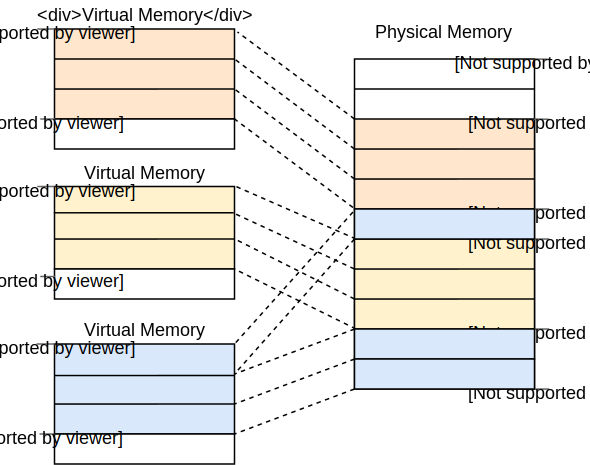
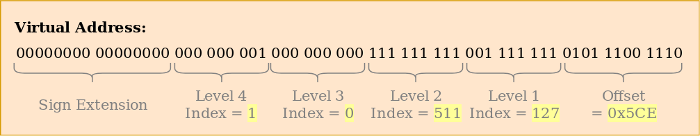
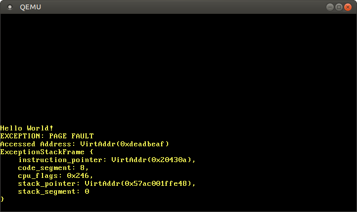

+++
title = "Introduction to Paging"
weight = 9
path = "paging-introduction"
date = 2019-01-14

+++

This post introduces _paging_, a very common memory management scheme that we will also use for our operating system. It explains why memory isolation is needed, how _segmentation_ works, what _virtual memory_ is, and how paging solves memory fragmentation issues. It also explores the layout of multilevel page tables on the x86_64 architecture.

<!-- more -->

This blog is openly developed on [GitHub]. If you have any problems or questions, please open an issue there. You can also leave comments [at the bottom].  The complete source code for this post can be found in the [`post-09`][post branch] branch.

[GitHub]: https://github.com/phil-opp/blog_os
[at the bottom]: #comments
[post branch]: https://github.com/phil-opp/blog_os/tree/post-09

<!-- toc -->

## Memory Protection

One main task of an operating system is to isolate programs from each other. Your web browser shouldn't be able to interfere with your text editor, for example. To achieve this goal, operating systems utilize hardware functionality to ensure that memory areas of one process are not accessible by other processes. There are different approaches, depending on the hardware and the OS implementation.

As an example, some ARM Cortex-M processors (used for embedded systems) have a [_Memory Protection Unit_] (MPU), which allows you to define a small number (e.g. 8) of memory regions with different access permissions (e.g. no access, read-only, read-write). On each memory access the MPU ensures that the address is in a region with correct access permissions and throws an exception otherwise. By changing the regions and access permissions on each process switch, the operating system can ensure that each process only accesses its own memory, and thus isolate processes from each other.

[_Memory Protection Unit_]: https://developer.arm.com/docs/ddi0337/e/memory-protection-unit/about-the-mpu

On x86, the hardware supports two different approaches to memory protection: [segmentation] and [paging].

[segmentation]: https://en.wikipedia.org/wiki/X86_memory_segmentation
[paging]: https://en.wikipedia.org/wiki/Virtual_memory#Paged_virtual_memory

## Segmentation

Segmentation was already introduced in 1978, originally to increase the amount of addressable memory. The situation back then was that CPUs only used 16-bit addresses, which limited the amount of addressable memory to 64KiB. To make more than these 64KiB accessible, additional segment registers were introduced, each containing an offset address. The CPU automatically added this offset on each memory access, so that up to 1MiB of memory were accessible.

The segment register is chosen automatically by the CPU, depending on the kind of memory access: For fetching instructions the code segment `CS` is used and for stack operations (push/pop) the stack segment `SS` is used. Other instructions use data segment `DS` or the extra segment `ES`. Later two additional segment registers `FS` and `GS` were added, which can be used freely.

In the first version of segmentation, the segment registers directly contained the offset and no access control was performed. This was changed later with the introduction of the [_protected mode_]. When the CPU runs in this mode, the segment descriptors contain an index into a local or global [_descriptor table_], which contains – in addition to an offset address – the segment size and access permissions. By loading separate global/local descriptor tables for each process that confine memory accesses to the process's own memory areas, the OS can isolate processes from each other.

[_protected mode_]: https://en.wikipedia.org/wiki/X86_memory_segmentation#Protected_mode
[_descriptor table_]: https://en.wikipedia.org/wiki/Global_Descriptor_Table

By modifying the memory addresses before the actual access, segmentation already employed a technique that is now used almost everywhere: _virtual memory_.

### Virtual Memory

The idea behind virtual memory is to abstract away the memory addresses from the underlying physical storage device. Instead of directly accessing the storage device, a translation step is performed first. For segmentation, the translation step is to add the offset address of the active segment. Imagine a program accessing memory address `0x1234000` in a segment with offset `0x1111000`: The address that is really accessed is `0x2345000`.

To differentiate the two address types, addresses before the translation are called _virtual_ and addresses after the translation are called _physical_. One important difference between these two kinds of addresses is that physical addresses are unique and always refer to the same, distinct memory location. Virtual addresses on the other hand depend on the translation function. It is entirely possible that two different virtual addresses refer to the same physical address. Also, identical virtual addresses can refer to different physical addresses when they use different translation functions.

An example where this property is useful is running the same program twice in parallel:


Here the same program runs twice, but with different translation functions. The first instance has an segment offset of 100, so that its virtual addresses 0–150 are translated to the physical addresses 100–250. The second instance has offset 300, which translates its virtual addresses  0–150 to physical addresses 300–450. This allows both programs to run the same code and use the same virtual addresses without interfering with each other.

Another advantage is that programs can be placed at arbitrary physical memory locations now, even if they use completely different virtual addresses. Thus, the OS can utilize the full amount of available memory without needing to recompile programs.

### Fragmentation

The differentiation between virtual and physical addresses makes segmentation really powerful. However, it has the problem of fragmentation. As an example, imagine that we want to run a third copy of the program we saw above:


There is no way to map the third instance of the program to virtual memory without overlapping, even though there is more than enough free memory available. The problem is that we need _continuous_ memory and can't use the small free chunks.

One way to combat this fragmentation is to pause execution, move the used parts of the memory closer together, update the translation, and then resume execution:


Now there is enough continuous space to start the third instance of our program.

The disadvantage of this defragmentation process is that is needs to copy large amounts of memory which decreases performance. It also needs to be done regularly before the memory becomes too fragmented. This makes performance unpredictable, since programs are paused at random times and might become unresponsive.

The fragmentation problem is one of the reasons that segmentation is no longer used by most systems. In fact, segmentation is not even supported in 64-bit mode on x86 anymore. Instead _paging_ is used, which completely avoids the fragmentation problem.

## Paging

The idea is to divide both the virtual and the physical memory space into small, fixed-size blocks. The blocks of the virtual memory space are called _pages_ and the blocks of the physical address space are called _frames_. Each page can be individually mapped to a frame, which makes it possible to split larger memory regions across non-continuous physical frames.

The advantage of this becomes visible if we recap the example of the fragmented memory space, but use paging instead of segmentation this time:



In this example we have a page size of 50 bytes, which means that each of our memory regions is split across three pages. Each page is mapped to a frame individually, so a continuous virtual memory region can be mapped to non-continuous physical frames. This allows us to start the third instance of the program without performing any defragmentation before.

### Hidden Fragmentation

Compared to segmentation, paging uses lots of small, fixed sized memory regions instead of a few large, variable sized regions. Since every frame has the same size, there are no frames that are too small to be used so that no fragmentation occurs.

Or it _seems_ like no fragmentation occurs. There is still some hidden kind of fragmentation, the so-called _internal fragmentation_. Internal fragmentation occurs because not every memory region is an exact multiple of the page size. Imagine a program of size 101 in the above example: It would still need three pages of size 50, so it would occupy 49 bytes more than needed. To differentiate the two types of fragmentation, the kind of fragmentation that happens when using segmentation is called _external fragmentation_.

Internal fragmentation is unfortunate, but often better than the external fragmentation that occurs with segmentation. It still wastes memory, but does not require defragmentation and makes the amount of fragmentation predictable (on average half a page per memory region).

### Page Tables

We saw that each of the potentially millions of pages is individually mapped to a frame. This mapping information needs to be stored somewhere. Segmentation uses an individual segment selector register for each active memory region, which is not possible for paging since there are way more pages than registers. Instead paging uses a table structure called _page table_ to store the mapping information.

For our above example the page tables would look like this:


We see that each program instance has its own page table. A pointer to the currently active table is stored in a special CPU register. On `x86`, this register is called `CR3`. It is the job of the operating system to load this register with the pointer to the correct page table before running each program instance.

On each memory access, the CPU reads the table pointer from the register and looks up the mapped frame for the accessed page in the table. This is entirely done in hardware and completely transparent to the running program. To speed up the translation process, many CPU architectures have a special cache that remembers the results of the last translations.

Depending on the architecture, page table entries can also store attributes such as access permissions in a flags field. In the above example, the "r/w" flag makes the page both readable and writable.

### Multilevel Page Tables

The simple page tables we just saw have a problem in larger address spaces: they waste memory. For example, imagine a program that uses the four virtual pages `0`, `1_000_000`, `1_000_050`, and `1_000_100` (we use `_` as a thousands separator):


It only needs 4 physical frames, but the page table has over a million entries. We can't omit the empty entries because then the CPU would no longer be able to jump directly to the correct entry in the translation process (e.g. it is no longer guaranteed that the fourth page uses the fourth entry).

To reduce the wasted memory, we can use a **two-level page table**. The idea is that we use different page tables for different address regions. An additional table called _level 2_ page table contains the mapping between address regions and (level 1) page tables.

This is best explained by an example. Let's define that each level 1 page table is responsible for a region of size `10_000`. Then the following tables would exist for the above example mapping:


Page 0 falls into the first `10_000` byte region, so it uses the first entry of the level 2 page table. This entry points to level 1 page table T1, which specifies that page `0` points to frame `0`.

The pages `1_000_000`, `1_000_050`, and `1_000_100` all fall into the 100th `10_000` byte region, so they use the 100th entry of the level 2 page table. This entry points at a different level 1 page table T2, which maps the three pages to frames `100`, `150`, and `200`. Note that the page address in level 1 tables does not include the region offset, so e.g. the entry for page `1_000_050` is just `50`.

We still have 100 empty entries in the level 2 table, but much fewer than the million empty entries before. The reason for this savings is that we don't need to create level 1 page tables for the unmapped memory regions between `10_000` and `1_000_000`.

The principle of two-level page tables can be extended to three, four, or more levels. Then the page table register points at the highest level table, which points to the next lower level table, which points to the next lower level, and so on. The level 1 page table then points at the mapped frame. The principle in general is called a _multilevel_ or _hierarchical_ page table.

Now that we know how paging and multilevel page tables works, we can look at how paging is implemented in the x86_64 architecture (we assume in the following that the CPU runs in 64-bit mode).

## Paging on x86_64

The x86_64 architecture uses a 4-level page table and a page size of 4KiB. Each page table, independent of the level, has a fixed sized of 512 entries. Each entry has a size of 8 bytes, so each table is 512 * 8B = 4KiB large and thus fits exactly into one page.

The page table index for level is derived directly from the virtual address:


We see that each table index consists of 9 bits, which makes sense because each table has 2^9 = 512 entries. The lowest 12 bits are the offset in the 4KiB page (2^12 bytes = 4KiB). Bits 48 to 64 are discarded, which means that x86_64 is not really 64-bit since it only supports 48-bit addresses. There are plans to extend the address size to 57 bits through a [5-level page table], but no processor that supports this feature exists yet.

[5-level page table]: https://en.wikipedia.org/wiki/Intel_5-level_paging

Even though bits 48 to 64 are discarded, they can't be set to arbitrary values. Instead all bits in this range have to be copies of bit 47 in order to keep addresses unique and allow future extensions like the 5-level page table. This is called _sign-extension_ because it's very similar to the [sign extension in two's complement]. When a address is not correctly sign-extended, the CPU throws an exception.

[sign extension in two's complement]: https://en.wikipedia.org/wiki/Two's_complement#Sign_extension

### Example Translation

Let's go through an example to understand how the translation process works in detail:


The physical address of the currently active level 4 page table, which is the root of the 4-level page table, is stored in the `CR3` register. Each page table entry then points to the physical frame of the next level table. The entry of the level 1 table then points to the mapped frame. Note that all addresses in the page tables are physical instead of virtual, because otherwise the CPU would need to translate those addresses too (which could cause a never-ending recursion).

The above page table hierarchy maps two pages (in blue). From the page table indices we can deduce that the virtual addresses of these two pages are `0x803FE7F000` and `0x803FE00000`. Let's see what happens when the program tries to read from address `0x803FE7F5CE`. First, we convert the address to binary and determine the page table indices and the page offset for the address:



With these indices, we can now walk the page table hierarchy to determine the mapped frame for the address:

- We start by reading the address of the level 4 table out of the `CR3` register.
- The level 4 index is 1, so we look at the entry with index 1 of that table, which tells us that the level 3 table is stored at address 16KiB.
- We load the level 3 table from that address and look at the entry with index 0, which points us to the level 2 table at 24KiB.
- The level 2 index is 511, so we look at the last entry of that page to find out the address of the level 1 table.
- Through the entry with index 127 of the level 1 table we finally find out that the page is mapped to frame 12KiB, or 0xc000 in hexadecimal.
- The final step is to add the page offset to the frame address to get the physical address 0xc000 + 0x5ce = 0xc5ce.


The permissions for the page in the level 1 table are `r`, which means read-only. The hardware enforces these permissions and would throw an exception if we tried to write to that page. Permissions in higher level pages restrict the possible permissions in lower level, so if we set the level 3 entry to read-only, no pages that use this entry can be writable, even if lower levels specify read/write permissions.

It's important to note that even though this example used only a single instance of each table, there are typically multiple instances of each level in each address space. At maximum, there are:

- one level 4 table,
- 512 level 3 tables (because the level 4 table has 512 entries),
- 512 * 512 level 2 tables (because each of the 512 level 3 tables has 512 entries), and
- 512 * 512 * 512 level 1 tables (512 entries for each level 2 table).

### Page Table Format

Page tables on the x86_64 architecture are basically an array of 512 entries. In Rust syntax:

```rust
#[repr(align(4096))]
pub struct PageTable {
    entries: [PageTableEntry; 512],
}
```

As indicated by the `repr` attribute, page tables need to be page aligned, i.e. aligned on a 4KiB boundary. This requirement guarantees that a page table always fills a complete page and allows an optimization that makes entries very compact.

Each entry is 8 bytes (64 bits) large and has the following format:

Bit(s) | Name | Meaning
------ | ---- | -------
0 | present | the page is currently in memory
1 | writable | it's allowed to write to this page
2 | user accessible | if not set, only kernel mode code can access this page
3 | write through caching | writes go directly to memory
4 | disable cache | no cache is used for this page
5 | accessed | the CPU sets this bit when this page is used
6 | dirty | the CPU sets this bit when a write to this page occurs
7 | huge page/null | must be 0 in P1 and P4, creates a 1GiB page in P3, creates a 2MiB page in P2
8 | global | page isn't flushed from caches on address space switch (PGE bit of CR4 register must be set)
9-11 | available | can be used freely by the OS
12-51 | physical address | the page aligned 52bit physical address of the frame or the next page table
52-62 | available | can be used freely by the OS
63 | no execute | forbid executing code on this page (the NXE bit in the EFER register must be set)

We see that only bits 12–51 are used to store the physical frame address, the remaining bits are used as flags or can be freely used by the operating system. This is possible because we always point to a 4096-byte aligned address, either to a page-aligned page table or to the start of a mapped frame. This means that bits 0–11 are always zero, so there is no reason to store these bits because the hardware can just set them to zero before using the address. The same is true for bits 52–63, because the x86_64 architecture only supports 52-bit physical addresses (similar to how it only supports 48-bit virtual addresses).

Let's take a closer look at the available flags:

- The `present` flag differentiates mapped pages from unmapped ones. It can be used to temporarily swap out pages to disk when main memory becomes full. When the page is accessed subsequently, a special exception called _page fault_ occurs, to which the operating system can react by reloading the missing page from disk and then continuing the program.
- The `writable` and `no execute` flags control whether the contents of the page are writable or contain executable instructions respectively.
- The `accessed` and `dirty` flags are automatically set by the CPU when a read or write to the page occurs. This information can be leveraged by the operating system e.g. to decide which pages to swap out or whether the page contents were modified since the last save to disk.
- The `write through caching` and `disable cache` flags allow to control the caches for every page individually.
- The `user accessible` flag makes a page available to userspace code, otherwise it is only accessible when the CPU is in kernel mode. This feature can be used to make [system calls] faster by keeping the kernel mapped while an userspace program is running. However, the [Spectre] vulnerability can allow userspace programs to read these pages nonetheless.
- The `global` flag signals to the hardware that a page is available in all address spaces and thus does not need to be removed from the translation cache (see the section about the TLB below) on address space switches. This flag is commonly used together with a cleared `user accessible` flag to map the kernel code to all address spaces.
- The `huge page` flag allows to create pages of larger sizes by letting the entries of the level 2 or level 3 page tables directly point to a mapped frame. With this bit set, the page size increases by factor 512 to either 2MiB = 512 * 4KiB for level 2 entries or even 1GiB = 512 * 2MiB for level 3 entries. The advantage of using larger pages is that fewer lines of the translation cache and fewer page tables are needed.

[system calls]: https://en.wikipedia.org/wiki/System_call
[Spectre]: https://en.wikipedia.org/wiki/Spectre_(security_vulnerability)

The `x86_64` crate provides types for [page tables] and their [entries], so we don't need to create these structures ourselves.

[page tables]: https://docs.rs/x86_64/0.5.2/x86_64/structures/paging/struct.PageTable.html
[entries]: https://docs.rs/x86_64/0.5.2/x86_64/structures/paging/page_table/struct.PageTableEntry.html

### The Translation Lookaside Buffer

A 4-level page table makes the translation of virtual addresses expensive, because each translation requires 4 memory accesses. To improve performance, the x86_64 architecture caches the last few translations in the so-called _translation lookaside buffer_ (TLB). This allows to skip the translation when the translation is still cached.

Unlike the other CPU caches, the TLB is not fully transparent and does not update or remove translations when the contents of page tables change. This means that the kernel must manually update the TLB whenever it modifies a page table. To do this, there is a special CPU instruction called [`invlpg`] (“invalidate page”) that removes the translation for the specified page from the TLB, so that it is loaded again from the page table on the next access. The TLB can also be flushed completely by reloading the `CR3` register, which simulates an address space switch. The `x86_64` crate provides Rust functions for both variants in the [`tlb` module].

[`invlpg`]: https://www.felixcloutier.com/x86/INVLPG.html
[`tlb` module]: https://docs.rs/x86_64/0.5.2/x86_64/instructions/tlb/index.html

It is important to remember flushing the TLB on each page table modification because otherwise the CPU might keep using the old translation, which can lead to non-deterministic bugs that are very hard to debug.

## Implementation

One thing that we did not mention yet: **Our kernel already runs on paging**. The bootloader that we added in the ["A minimal Rust Kernel"] post already set up a 4-level paging hierarchy that maps every page of our kernel to a physical frame. The bootloader does this because paging is mandatory in 64-bit mode on x86_64.

["A minimal Rust kernel"]: ./second-edition/posts/02-minimal-rust-kernel/index.md#creating-a-bootimage

This means that every memory address that we used in our kernel was a virtual address. Accessing the VGA buffer at address `0xb8000` only worked because the bootloader _identity mapped_ that memory page, which means that it mapped the virtual page `0xb8000` to the physical frame `0xb8000`.

Paging makes our kernel already relatively safe, since every memory access that is out of bounds causes a page fault exception instead of writing to random physical memory. The bootloader even set the correct access permissions for each page, which means that only the pages containing code are executable and only data pages are writable.

### Page Faults

Let's try to cause a page fault by accessing some memory outside of our kernel. First, we create a page fault handler and register it in our IDT, so that we see a page fault exception instead of a generic [double fault] :

[double fault]: ./second-edition/posts/07-double-faults/index.md

```rust
// in src/interrupts.rs

lazy_static! {
    static ref IDT: InterruptDescriptorTable = {
        let mut idt = InterruptDescriptorTable::new();

        […]

        idt.page_fault.set_handler_fn(page_fault_handler); // new

        idt
    };
}

use x86_64::structures::idt::PageFaultErrorCode;

extern "x86-interrupt" fn page_fault_handler(
    stack_frame: &mut InterruptStackFrame,
    _error_code: PageFaultErrorCode,
) {
    use crate::hlt_loop;
    use x86_64::registers::control::Cr2;

    println!("EXCEPTION: PAGE FAULT");
    println!("Accessed Address: {:?}", Cr2::read());
    println!("{:#?}", stack_frame);
    hlt_loop();
}
```

The [`CR2`] register is automatically set by the CPU on a page fault and contains the accessed virtual address that caused the page fault. We use the [`Cr2::read`] function of the `x86_64` crate to read and print it. Normally the [`PageFaultErrorCode`] type would provide more information about the type of memory access that caused the page fault, but there is currently an [LLVM bug] that passes an invalid error code, so we ignore it for now. We can't continue execution without resolving the page fault, so we enter a [`hlt_loop`] at the end.

[`CR2`]: https://en.wikipedia.org/wiki/Control_register#CR2
[`Cr2::read`]: https://docs.rs/x86_64/0.5.2/x86_64/registers/control/struct.Cr2.html#method.read
[`PageFaultErrorCode`]: https://docs.rs/x86_64/0.5.2/x86_64/structures/idt/struct.PageFaultErrorCode.html
[LLVM bug]: https://github.com/rust-lang/rust/issues/57270
[`hlt_loop`]: ./second-edition/posts/08-hardware-interrupts/index.md#the

Now we can try to access some memory outside our kernel:

```rust
// in src/main.rs

#[cfg(not(test))]
#[no_mangle]
pub extern "C" fn _start() -> ! {
    use blog_os::interrupts::PICS;

    println!("Hello World{}", "!");

    // set up the IDT first, otherwise we would enter a boot loop instead of
    // invoking our page fault handler
    blog_os::gdt::init();
    blog_os::interrupts::init_idt();
    unsafe { PICS.lock().initialize() };
    x86_64::instructions::interrupts::enable();

    // new
    let ptr = 0xdeadbeaf as *mut u32;
    unsafe { *ptr = 42; }

    println!("It did not crash!");
    blog_os::hlt_loop();
}
```

When we run it, we see that our page fault handler is called:



The `CR2` register indeed contains `0xdeadbeaf`, the address that we tried to access.

We see that the current instruction pointer is `0x20430a`, so we know that this address points to a code page. Code pages are mapped read-only by the bootloader, so reading from this address works but writing causes a page fault. You can try this by changing the `0xdeadbeaf` pointer to `0x20430a`:

```rust
// Note: The actual address might be different for you. Use the address that
// your page fault handler reports.
let ptr = 0x20430a as *mut u32;
// read from a code page -> works
unsafe { let x = *ptr; }
// write to a code page -> page fault
unsafe { *ptr = 42; }
```

By commenting out the last line, we see that the read access works, but the write access causes a page fault.

### Accessing the Page Tables

Let's try to take a look at the page tables that our kernel runs on:

```rust
// in src/main.rs

#[cfg(not(test))]
#[no_mangle]
pub extern "C" fn _start() -> ! {
    […] // initialize GDT, IDT, PICS

    use x86_64::registers::control::Cr3;

    let (level_4_page_table, _) = Cr3::read();
    println!("Level 4 page table at: {:?}", level_4_page_table.start_address());

    println!("It did not crash!");
    blog_os::hlt_loop();
}
```

The [`Cr3::read`] function of the `x86_64` returns the currently active level 4 page table from the `CR3` register. It returns a tuple of a [`PhysFrame`] and a [`Cr3Flags`] type. We are only interested in the frame, so we ignore the second element of the tuple.

[`Cr3::read`]: https://docs.rs/x86_64/0.5.2/x86_64/registers/control/struct.Cr3.html#method.read
[`PhysFrame`]: https://docs.rs/x86_64/0.5.2/x86_64/structures/paging/frame/struct.PhysFrame.html
[`Cr3Flags`]: https://docs.rs/x86_64/0.5.2/x86_64/registers/control/struct.Cr3Flags.html

When we run it, we see the following output:

```
Level 4 page table at: PhysAddr(0x1000)
```

So the currently active level 4 page table is stored at address `0x1000` in _physical_ memory, as indicated by the [`PhysAddr`] wrapper type. The question now is: how can we access this table from our kernel?

[`PhysAddr`]: https://docs.rs/x86_64/0.5.2/x86_64/struct.PhysAddr.html

Accessing physical memory directly is not possible when paging is active, since programs could easily circumvent memory protection and access memory of other programs otherwise. So the only way to access the table is through some virtual page that is mapped to the physical frame at address `0x1000`. This problem of creating mappings for page table frames is a general problem, since the kernel needs to access the page tables regularly, for example when allocating a stack for a new thread.

Solutions to this problem are explained in detail in the next post.

## Summary

This post introduced two memory protection techniques: segmentation and paging. While the former uses variable-sized memory regions and suffers from external fragmentation, the latter uses fixed-sized pages and allows much more fine-grained control over access permissions.

Paging stores the mapping information for pages in page tables with one or more levels. The x86_64 architecture uses 4-level page tables and a page size of 4KiB. The hardware automatically walks the page tables and caches the resulting translations in the translation lookaside buffer (TLB). This buffer is not updated transparently and needs to be flushed manually on page table changes.

We learned that our kernel already runs on top of paging and that illegal memory accesses cause page fault exceptions. We tried to access the currently active page tables, but we weren't able to do it because the CR3 register stores a physical address that we can't access directly from our kernel.

## What's next?

The next post explains how to implement support for paging in our kernel. It presents different ways to access physical memory from our kernel, which makes it possible to access the page tables that our kernel runs on. At this point we are able to implement functions for translating virtual to physical addresses and for creating new mappings in the page tables.
