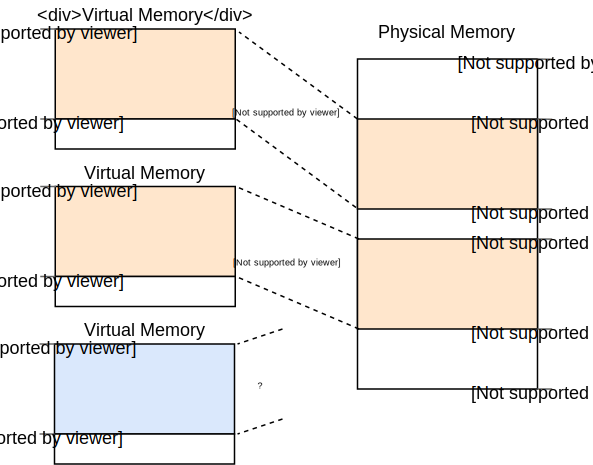
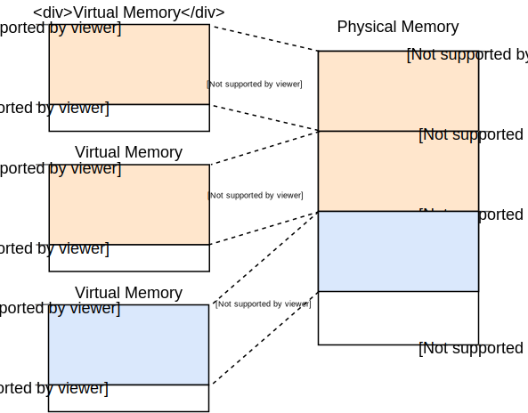

+++
title = "Paging"
order = 9
path = "paging"
date = 0000-01-01
template = "second-edition/page.html"
+++

In this post we start exploring memory management. We explore the difference between virtual memory and physical memory and learn how the translation process works. TODO

<!-- more -->

This blog is openly developed on [Github]. If you have any problems or questions, please open an issue there. You can also leave comments [at the bottom].

[Github]: https://github.com/phil-opp/blog_os
[at the bottom]: #comments

## Memory Protection

One main task of an operating system is to isolate programs from each other. Your web browser shouldn't be able to interfere with your text editior, for example. To achieve this goal, operating systems utilize hardware functionality to ensure that memory areas of one process are not accessible by other processes. There are different approaches, depending on the hardware and the OS implementation.

As an example, some ARM Cortex-M processors (used for embedded systems) have a [_Memory Protection Unit_] (MPU), which allows you to define a small number (e.g. 8) of memory regions with different access permissions (e.g. no access, read-only, read-write). On each memory access the MPU ensures that the address is in a region with correct access permissions and throws an exception otherwise. By changing the regions and access permissions on each process switch, the operating system can ensure that each process only accesses its own memory, and thus isolate processes from each other.

[_Memory Protection Unit_]: https://developer.arm.com/docs/ddi0337/e/memory-protection-unit/about-the-mpu

On x86, two different techniques are supported: [segmentation] and [paging].

[segmentation]: https://en.wikipedia.org/wiki/X86_memory_segmentation
[paging]: https://en.wikipedia.org/wiki/Virtual_memory#Paged_virtual_memory

## Segmentation

Segmentation was already introduced in 1978, originally to increase the amount of addressible memory. The situation back then was that CPUs only used 16-bit addresses, which limited the amount of addressable memory to 64KiB. To make more than these 64KiB accessible, additional segment registers were introduced that each contain an offset address. This offset is added on each memory access, which results in a 20bit address so that up to 1MiB of memory are accessible.

The CPU chooses a ssegment register automatically, depending on the kind of memory access: For fetching instructions the code segment `CS` is used and for stack operations (push/pop) the stack segment `SS` is used. Other instructions use data segment `DS` or the extra segment `ES`. Later two additional segment registers `FS` and `GS` were added, which can be used freely.

In the first version of segmentation, the segment registers directly contained the offset and no access control was performed. This was changed later with the introduction of the [_protected mode_]. When the CPU runs in this mode, the segment descriptors contain an index into a local or global [_descriptor table_], which contains in addition to an offset address the segment size and access permissions. The OS can utilize this to isolate processes from each other by loading separate global/local descriptor tables for each process that confine memory accesses to the process's own memory areas.

[_protected mode_]: https://en.wikipedia.org/wiki/X86_memory_segmentation#Protected_mode
[_descriptor table_]: https://en.wikipedia.org/wiki/Global_Descriptor_Table

Although segmentation is no longer used on modern systems, it already used a technique that is now used everywhere: _virtual memory_.

### Virtual Memory

The idea behind virtual memory is to abstract away the memory addresses from the underlying physical storage device. Instead of directly accessing the storage device, a translation step is performed. For segmentation, this translation step is to add the offset address of the active segment. Imagine a program accessing memory address `0x1234000` in a segment with offset `0x1111000`: The translated address is then `0x2345000`.

To differentiate the two address types, addresses before the translation are called _virtual_ and addresses after the translation are called _physical_. One important difference between these two kind of addresses is that physical addresses are unique and always refer to the same, distinct memory location. Virtual addresses on the other hand depend on the translation function. It is entirely possible that two identical virtual addresses refer to different physical addresses with when different translation functions are used.

An example where this property is useful is running the same program twice in parallel:

Here the same program runs twice, but with different translation functions. The first instance has an segment offset of 100, so that its virtual addresses 0–100 are translated to the physical addresses 100–250. The second instance has offset 300, which translates its virtual addresses to physical addresses 300–450. The important thing here is that both programs can run the same code and use the same virtual addresses without interfering with each other.

Similarly, we can place programs at arbitrary physical memory locations now, even if they use completely different virtual addresses. Thus we can utilize the full amount of available memory without recompiling any program.

### Fragmentation

The differentiation between virtual and physical addresses makes segmentation really powerful. However, it has the problem of fragmentation. As an example, imagine that we want to run a third copy of the program we saw above:

There is no way to map the third instance of the program to virtual memory without overlapping, even though there is more than enough free memory available. The problem is that we need _continuous_ memory and can't use the small free chunks.

One way to combat this fragmentation is to pause execution, move the used parts of the memory closer together, update the translation, and then resume execution:

Now there is enough continuous space to start the third instance of our program.

The disadvantage of this defragmentation process is that is needs to copy large amounts of memory which decreases performance. It also needs to be done regularly before the memory becomes too fragmented. This makes performance unpredictable, since programs are paused at random times and might become unresponsive.

The fragmentation problem is one of the reasons that segmentation is no longer used by most systems. Segmentation is not even supported in 64-bit mode on x86 anymore. Instead _paging_ is used, which completely avoids the fragmentation problem. 

## Paging

The idea is to divide both the virtual and the physical memory space into small, fixed-size blocks. The blocks of the virtual memory space are called _pages_ and the blocks of the physical address space are called _frames_. Each page can be individually mapped to a frame, which makes it possible split larger memory regions across non-continuous physical frames.

The advantage of this becomes visible if we recap the example of the fragmented memory space, but use paging instead of segmentation this time:

In this example we have a page size of 50 bytes, which means that each memory region is split across three pages. Each page is mapped to a frame individually, so a continuous virtual memory region can be mapped to non-continuous memory frames. This allows us to start the third instance of the program without performing any defragmentation before.

### Hidden Fragmentation

Compared to segmentation, paging uses lots of small, fixed sized memory regions instead of a few large, variable sized regions. Since every frame has the same size, there are no frames that are too small to be used so that no fragmentation occurs.

Or it _seems_ like no fragmentation occurs. There is still some hidden kind of fragmentation, the so-called _internal fragmentation_. Internal fragmentation occurs because not every memory region is an exact multiple of the page size. Imagine a program of size 101 in the above example: It would still need three pages of size 50, so it would occupy 49 bytes more than needed.

Internal fragmentation is unfortunate, but often better than the external fragmentation that occurs with segmentation. It still wastes memory, but does not require defragmentation and makes the amount of fragmentation predictable (on average half a page per memory region).

### How does it work?

We saw that each of the potentially thousands of pages is individually mapped to a frame. This mapping information needs to be stored somewhere. Segmentation uses an individual segment selector register for each active memory region, which is not possible for paging since there are way more pages than registers. So the mapping information needs to be stored somewhere else.

-------

TODO: update date