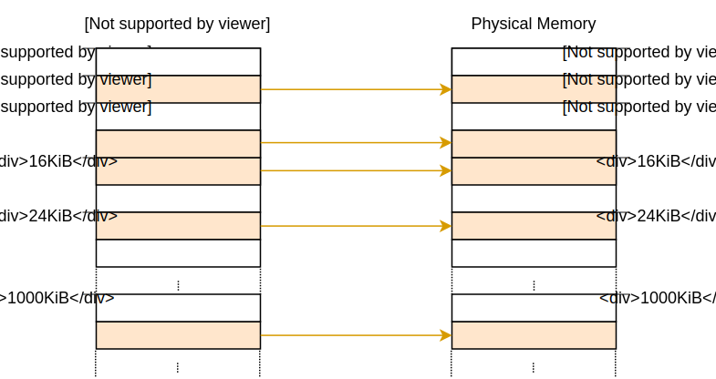
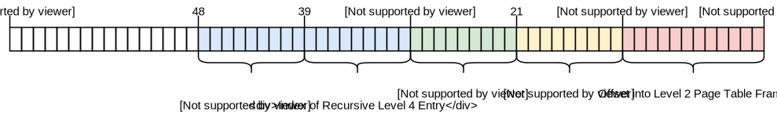

+++
title = "Advanced Paging"
order = 10
path = "advanced-paging"
date = 0000-01-01
template = "second-edition/page.html"
+++

This post TODO

<!-- more -->

This blog is openly developed on [Github]. If you have any problems or questions, please open an issue there. You can also leave comments [at the bottom].

[Github]: https://github.com/phil-opp/blog_os
[at the bottom]: #comments

## Introduction

In the [previous post] we learned about the principles of paging and how the 4-level page tables on the x86_64 architecture work. We also found out that the bootloader already set up a 4-level page table hierarchy for our kernel, since paging is mandatory on x86_64 in 64-bit mode. This means that our kernel already runs on virtual addresses.

[previous post]: ./second-edition/posts/09-paging-introduction/index.md

The problem that page tables use physical addresses internally, which we can't access directly from our kernel. We experienced that problem already [at the end of the previous post] when we tried to inspect the active page tables. The next section discusses the problem in detail and provides different approaches to a solution.

[at the end of the previous post]: ./second-edition/posts/09-paging-introduction/index.md#try-it-out

## Accessing Page Tables

Accessing the page tables from our kernel is not as easy as it may seem. To understand the problem let's take a look at the example 4-level page table hierarchy of the previous post again:


The important thing here is that each page entry stores the _physical_ address of the next table. This avoids the need to run a translation for these addresses too, which would be bad for performance and could easily cause endless translation loops.

The problem for us is that we can't directly access physical addresses from our kernel, since our kernel also runs on top of virtual addresses. For example when we access address `4 KiB`, we access the _virtual_ address `4 KiB`, not the _physical_ address `4 KiB` where the level 4 page table lives. When we want to acccess the physical address `4 KiB`, we can only do so through some virtual address that maps to it.

So in order access page table frames, we need to map some virtual pages to them. There are different ways to create these mappings that all allow us to access arbitrary page table frames:


- A simple solution is to **identity map all page tables**:

  

  In this example we see various identity-mapped page table frames. This way the physical addresses in the page tables are also valid virtual addresses, so that we can easily access the page tables of all levels starting from the CR3 register.

  However, it clutters the virtual address space and makes it more difficult to find continuous memory regions of larger sizes. For example, imagine that we want to create a virtual memory region of size 1000 KiB in the above graphic, e.g. for [memory-mapping a file]. We can't start the region at `26 KiB` because it would collide with the already mapped page at `1004 MiB`. So we have to look further until we find a large enough unmapped area, for example at `1008 KiB`. This is a similar fragmentation problem as with [segmentation].

  [memory-mapping a file]: https://en.wikipedia.org/wiki/Memory-mapped_file
  [segmentation]: ./second-edition/posts/09-paging-introduction/index.md#fragmentation

  Equally, it makes it much more difficult to create new page tables, because we need to find physical frames whose corresponding pages aren't already in use. For example, let's assume that we reserved the _virtual_ 1000 KiB memory region starting at `1008 KiB` for our memory-mapped file. Now we can't use any frame with a _physical_ address between `1000 KiB` and `2008 KiB` anymore, because we can't identity map it.

- Alternatively, we could **map the page tables frames only temporarily** when we need to access them. To be able to create the temporary mappings we only need a single identity-mapped level 1 table:

  

  The level 1 table in this graphic controls the first 2 MiB of the virtual address space. This is because it is reachable by starting at the CR3 register and following the 0th entry in the level 4, level 3, and level 2 page tables. The entry with index `8` maps the virtual page at address `32 KiB` to the physical frame at address `32 KiB`, thereby identity mapping the level 1 table itself. The graphic shows this identity-mapping by the horizontal arrow at `32 KiB`.

  By writing to the identity-mapped level 1 table, our kernel can create up to 511 temporary mappings (512 minus the entry required for the identity mapping). In the above example, the kernel mapped the 0th entry of the level 1 table to the frame with address `24 KiB`. This created a temporary mapping of the virtual page at `0 KiB` to the physical frame of the level 2 page table, indicated by the dashed arrow. Now the kernel can access the level 2 page table by writing to the page starting at `0 KiB`.

  The process for accessing an arbitrary page table frame with temporary mappings would be:

  - Search for a free entry in the identity mapped level 1 table.
  - Map that entry to the physical frame of the page table that we want to access.
  - Access the target frame through the virtual page that maps to the entry.
  - Set the entry back to unused thereby removing the temporary mapping again.

  This approach keeps the virtual address space clean, since it reuses the same 512 virtual pages for creating the mappings. The drawback is that it is a bit cumbersome, especially since a new mapping might require modifications of multiple table levels, which means that we would need to repeat the above process multiple times.

- While both of the above approaches work, there is a third technique called **recursive page tables** that combines their advantages: It keeps all page table frames mapped at all times so that no temporary mappings are needed, and also keeps the mapped pages together to avoid fragmentation of the virtual address space. This is the technique that we will use for our implementation, therefore it is described in detail in the following section.

## Recursive Page Tables

The idea behind this approach sounds simple: _Map some entry of the level 4 page table to the frame of level 4 table itself_. By doing this, we effectively reserve a part of the virtual address space and map all current and future page table frames to that space. Thus, the single entry makes every table of every level accessible through a calculatable address.

Let's go through an example to understand how this all works:


The only difference to the [example at the beginning of this post] is the additional entry at index `511` in the level 4 table, which is mapped to physical frame `4 KiB`, the frame of the level 4 table itself.

[example at the beginning of this post]: #accessing-page-tables

By letting the CPU follow this entry on a translation, it doesn't reach a level 3 table, but the same level 4 table again. This is similar to a recursive function that calls itself, therefore this table is called a _recursive page table_. The important thing is that the CPU assumes that every entry in the level 4 table points to a level 3 table, so it now treats the level 4 table as a level 3 table. This works because tables of all levels have the exact same layout on x86_64.

By following the recursive entry one or multiple times before we start the actual translation, we can effectively shorten the number of levels that the CPU traverses. For example, if we follow the recursive entry once and then proceed to the level 3 table, the CPU thinks that the level 3 table is a level 2 table. Going further, it treats the level 2 table as a level 1 table, and the level 1 table as the mapped frame. This means that we can now read and write the level 1 page table because the CPU thinks that it is the mapped frame. The graphic below illustrates the 5 translation steps:


Similarly, we can follow the recursive entry twice before starting the translation to reduce the number of traversed levels to two:


Let's go through it step by step: First the CPU follows the recursive entry on the level 4 table and thinks that it reaches a level 3 table. Then it follows the recursive entry again and thinks that it reaches a level 2 table. But in reality, it is still on the level 4 table. When the CPU now follows a different entry, it lands on a level 3 table, but thinks it is already on a level 1 table. So while the next entry points at a level 2 table, the CPU thinks that it points to the mapped frame, which allows us to read and write the level 2 table.

Accessing the tables of levels 3 and 4 works in the same way. For accessing the level 3 table, we follow the recursive entry entry three times, tricking the CPU into thinking it is already on a level 1 table. Then we follow another entry and reach a level 3 table, which the CPU treats as a mapped frame. For accessing the level 4 table itself, we just follow the recursive entry four times until the CPU treats the level 4 table itself as mapped frame (in blue in the graphic below).


It might take some time to wrap your head around the concept, but it works quite well in practice.

### Address Calculation

We saw that we can access tables of all levels by following the recursive entry once or multiple times before the actual translation. Since the indexes into the tables of the four levels are derived directly from the virtual address, we need to construct special virtual addresses for this technique. Remember, the page table indexes are derived from the address in the following way:


Let's assume that we want to access the level 1 page table that maps a specific page. As we learned above, this means that we have to follow the recursive entry one time before continuing with the level 4, level 3, and level 2 indexes. To do that we move each block of the address one block to the right and set the original level 4 index to the index of the recursive entry:


For accessing the level 2 table of that page, we move each index block two blocks to the right and set both the blocks of the original level 4 index and the original level 3 index to the index of the recursive entry:



Accessing the level 3 table works by moving each block three blocks to the right and using the recursive index for the original level 4, level 3, and level 2 address blocks:


Finally, we can access the level 4 table by moving each block four blocks to the right and using the recursive index for all address blocks except for the offset:


The page table index blocks are 9 bits, so moving each block one block to the right means a bitshift by 9 bits: `address >> 9`. To derive the 12-bit offset field from the shifted index, we need to multiply it by 8, the size of a page table entry. Through this operation, we can calculate virtual addresses for the page tables of all four levels.

The table below summarizes the address structure for accessing the different kinds of frames:

Mapped Frame for | Address Structure ([octal])
---------------- | -------------------------------
Page             | `0o_SSSSSS_AAA_BBB_CCC_DDD_EEEE`
Level 1 Table    | `0o_SSSSSS_RRR_AAA_BBB_CCC_DDDD`
Level 2 Table    | `0o_SSSSSS_RRR_RRR_AAA_BBB_CCCC`
Level 3 Table    | `0o_SSSSSS_RRR_RRR_RRR_AAA_BBBB`
Level 4 Table    | `0o_SSSSSS_RRR_RRR_RRR_RRR_AAAA`

[octal]: https://en.wikipedia.org/wiki/Octal

Whereas `AAA` is the level 4 index, `BBB` the level 3 index, `CCC` the level 2 index, and `DDD` the level 1 index of the mapped frame, and `EEEE` the offset into it. `RRR` is the index of the recursive entry. When an index (three digits) is transformed to an offset (four digits), it is done by multiplying it by 8 (the size of a page table entry). With this offset, the resulting address directly points to the respective page table entry.

`SSSSSS` are sign extension bits, which means that they are all copies of bit 47. This is a special requirement for valid addresses on the x86_64 architecture. We explained it in the [previous post][sign extension].

[sign extension]: ./second-edition/posts/09-paging-introduction/index.md#paging-on-x86

## Implementation

After all this theory we can finally start our implementation. We already mentioned that the bootloader created page tables for our kernel, but it also created a recursive mapping in the last entry of the level 4 table for us. The bootloader did this, because otherwise there would be a [chicken or egg problem]: We need to access the level 4 table to create a recursive mapping, but we can't access it without some kind of mapping.

[chicken or egg problem]: https://en.wikipedia.org/wiki/Chicken_or_the_egg

We already used this recursive mapping [at the end of the previous post] to access the level 4 table. We did this through the hardcoded address `0xffff_ffff_ffff_f000`. When we convert this address to [octal] and compare it with the above table, we can see that it exactly follows the structure: with `RRR` = `0o777` = 511, `AAAA` = 0, and the sign extension bits set to `1` each:

```
structure: 0o_SSSSSS_RRR_RRR_RRR_RRR_AAAA
address:   0o_177777_777_777_777_777_0000
```

Using hardcoded addresses is rarely a good idea, since they might become outdated. For example, our code would break if a future bootloader version uses a different entry for the recursive mapping. Fortunately the bootloader tells us the recursive entry by passing a _boot information structure_ to our kernel.

### Boot Information

To communicate the index of the recursive entry and other information to our kernel, the bootloader passes a reference to a boot information structure as an argument when calling our `_start` function. Right now we don't have this argument declared in our function, so we just ignore it. Let's add the argument to the signature of our `_start` function:

```rust
// in src/main.rs

use bootloader::bootinfo::BootInfo;

#[cfg(not(test))]
#[no_mangle]
pub extern "C" fn _start(boot_info: &'static BootInfo) -> ! {
    println!("boot_info: {:x?}", boot_info);

    […]
}
```

The [`BootInfo`] struct is still in an early stage, so expect some breakage when updating to future [semver-incompatible] bootloader versions. When we print it, we see that it currently has the three fields `p4_table_addr`, `memory_map`, and `package`:

[`BootInfo`]: https://docs.rs/bootloader/0.3.11/bootloader/bootinfo/struct.BootInfo.html
[semver-incompatible]: https://doc.rust-lang.org/stable/cargo/reference/specifying-dependencies.html#caret-requirements

![QEMU printing a `BootInfo` struct: "boot_info: Bootlnfo { p4_table_addr: fffffffffffff000. memory_map: […]. package: […]"](qemu-bootinfo-print.png)

The most interesting field for us right now is `p4_table_addr`, as it contains a virtual address that is mapped to the physical frame of the level 4 page table. As we see this address is `0xfffffffffffff000`, which is the same as the hardcoded address we used before.

The `memory_map` field will become relevant later in this post. The `package` field is an in-progress feature to bundle additional data with the bootloader. The implementation is not finished, so we can ignore this field for now.

#### The `entry_point` Macro

Since our `_start` function is called externally from the bootloader, no checking of our function signature occurs. This means that we could let it take arbitrary arguments without any compilation errors, but it would fail or cause undefined behavior at runtime.

To make sure that the entry point function has always the correct signature that the bootloader expects, the `bootloader` crate provides an [`entry_point`] macro that provides a type-checked way to define a Rust function as entry point. Let's rewrite our entry point function to use this macro:

[`entry_point`]: https://docs.rs/bootloader/0.3.12/bootloader/macro.entry_point.html

```rust
// in src/main.rs

use bootloader::entry_point;

entry_point!(kernel_main);

#[cfg(not(test))]
fn kernel_main(boot_info: &'static BootInfo) -> ! {
    use blog_os::interrupts::PICS;

    blog_os::gdt::init();
    blog_os::interrupts::init_idt();
    unsafe { PICS.lock().initialize() };
    x86_64::instructions::interrupts::enable();

    println!("It did not crash!");
    blog_os::hlt_loop();
}
```

Note that we no longer need to use `extern "C"` or `no_mangle` for our entry point, since the macro does this for us. We can also use an arbitrary name for our function. When we now try to modify the function signature in any way, for example adding an argument or changing the argument type, a compilation error occurs.

### Translating Addresses

Now we have a clean way to retrieve the virtual address of the recursively mapped level 4 table. which allows us to derive the virtual addreses of all other page tables. As a first step, let's try to create a function that translates a virtual address to a physical address:

```rust
// in src/lib.rs

pub mod memory;
```

```rust
// in src/memory/mod.rs

use x86_64::PhysAddr;
use x86_64::structures::paging::PageTable;

/// Returns the physical address for the given virtual address, or `None` if the
/// virtual address is not mapped.
pub fn translate_addr(addr: usize, level_4_table_addr: usize) -> Option<PhysAddr> {
    // retrieve the page table indices of the address that we want to translate
    let level_4_index = (addr >> 39) & 0o777;
    let level_3_index = (addr >> 30) & 0o777;
    let level_2_index = (addr >> 21) & 0o777;
    let level_1_index = (addr >> 12) & 0o777;
    let page_offset = addr & 0o7777;

    // check that level 4 entry is mapped
    let level_4_table = unsafe {&*(level_4_table_addr as *const PageTable)};
    if level_4_table[level_4_index].addr().is_null() {
        return None;
    }
    let level_3_table_addr = (level_4_table_addr << 9) | (level_4_index << 12);

    // check that level 3 entry is mapped
    let level_3_table = unsafe {&*(level_3_table_addr as *const PageTable)};
    if level_3_table[level_3_index].addr().is_null() {
        return None;
    }
    let level_2_table_addr = (level_3_table_addr << 9) | (level_3_index << 12);

    // check that level 2 entry is mapped
    let level_2_table = unsafe {&*(level_2_table_addr as *const PageTable)};
    if level_2_table[level_2_index].addr().is_null() {
        return None;
    }
    let level_1_table_addr = (level_2_table_addr << 9) | (level_2_index << 12);

    // check that level 1 entry is mapped and retrieve physical address from it
    let level_1_table = unsafe {&*(level_1_table_addr as *const PageTable)};
    let phys_addr = level_1_table[level_1_index].addr();
    if phys_addr.is_null() {
        return None;
    }

    Some(phys_addr + page_offset)
}
```

First, we calculate the page table indices and the page offset from the address:


Then we check the whether the entries in the four tables are empty and return `None` in that case. It's important that we do this because the address of the next table is only valid if the entry is mapped, and we don't want to risk that our translation function causes a page fault.

After we checked the three higher level pages, we can finally read the entry of the level 1 table that tells us the physical frame that the address is mapped to. Finally, we add the page offset to that address and return it.

Now we can use this function to translate some virtual addresses in our `kernel_main` function:

```rust
// in src/main.rs

#[cfg(not(test))]
fn kernel_main(boot_info: &'static BootInfo) -> ! {
    […] // initialize GDT, IDT, PICS

    use blog_os::memory::translate_addr;

    let level_4_table_addr = boot_info.p4_table_addr as usize;

    // the identity-mapped vga buffer page
    println!("0xb8000 -> {:?}", translate_addr(0xb8000, level_4_table_addr));
    // some code page
    println!("0x20010a -> {:?}", translate_addr(0x20010a, level_4_table_addr));
    // some stack page
    println!("0x57ac001ffe48 -> {:?}", translate_addr(0x57ac001ffe48,
        level_4_table_addr));

    println!("It did not crash!");
    blog_os::hlt_loop();
}
```

When we run it, we see the following output:


As expected, the identity-mapped address `0xb8000` translates to the same physical address. The code page and the stack page translate to some arbitrary physical addresses, that depend on how the bootloader created the initial mapping for our kernel.

#### The `RecursivePageTable` Type

The `x86_64` provides a [`RecursivePageTable`] type that implements safe abstractions for various page table operations. By using this type, we can reimplement our `translate_addr` function in a much cleaner way:

[`RecursivePageTable`]: https://docs.rs/x86_64/0.3.5/x86_64/structures/paging/struct.RecursivePageTable.html

```rust
// in src/memory/mod.rs

use x86_64::{VirtAddr, PhysAddr};
use x86_64::structures::paging::{Mapper, Page, PageTable, RecursivePageTable};

/// Returns the physical address for the given virtual address, or
/// `None` if the virtual address is not mapped.
pub fn translate_addr(addr: u64, level_4_table_addr: usize) -> Option<PhysAddr> {
    // create a RecursivePageTable instance from the level 4 address
    let level_4_table_ptr = level_4_table_addr as *mut PageTable;
    let level_4_table = unsafe { &mut *level_4_table_ptr };
    let recursive_page_table = RecursivePageTable::new(level_4_table).unwrap();

    let addr = VirtAddr::new(addr);
    let page: Page = Page::containing_address(addr);

    // perform the translation
    let frame = recursive_page_table.translate_page(page);
    frame.map(|frame| frame.start_address() + addr.page_offset())
}
```

The `RecursivePageTable` type encapsulates the unsafety of the page table walk completely. We only need a single instance of `unsafe` to create a `&mut PageTable` from the level 4 page table address. Also, we no longer need to perform any bitwise operations.

### Creating a new Mapping

Let's try to create a new mapping in the page tables. The `RecursivePageTable` type implements the [`Mapper`] trait, which has a [`map_to`] method with the following signature:

[`Mapper`]: https://docs.rs/x86_64/0.3.5/x86_64/structures/paging/trait.Mapper.html
[`map_to`]: https://docs.rs/x86_64/0.3.5/x86_64/structures/paging/trait.Mapper.html#tymethod.map_to

```rust
pub trait Mapper<S: PageSize> {
    fn map_to<A>(
        &mut self,
        page: Page<S>,
        frame: PhysFrame<S>,
        flags: PageTableFlags,
        allocator: &mut A
    ) -> Result<MapperFlush<S>, MapToError>
    where
        A: FrameAllocator<Size4KiB>;

    […]
}
```

The method creates a mapping in the page table that maps the given [`Page`] to the given [`PhysFrame`] with the given [`PageTableFlags`]. The last parameter is [generic] and expects some type that implements the [`FrameAllocator`] trait. This parameter is needed because the method might need to create new page tables to create the mapping, so it requires empty frames for this. <-- TODO

[`Page`]: https://docs.rs/x86_64/0.3.5/x86_64/structures/paging/struct.Page.html
[`PhysFrame`]: https://docs.rs/x86_64/0.3.5/x86_64/structures/paging/struct.PhysFrame.html
[`PageTableFlags`]: https://docs.rs/x86_64/0.3.5/x86_64/structures/paging/struct.PageTableFlags.html
[generic]: https://doc.rust-lang.org/book/ch10-00-generics.html
[`FrameAllocator`]: https://docs.rs/x86_64/0.3.5/x86_64/structures/paging/trait.FrameAllocator.html

There are two [generic parameters]: `S: PageSize` and `A: FrameAllocator`. The [`PageSize`] trait makes it possible to generate generic code that works with normal 4 KiB pages and huge 2 MiB and 1 GiB pages at the same time. We only use default 4 KiB for now, so we can ignore this parameter for now.

[generic parameters]: https://doc.rust-lang.org/book/ch10-00-generics.html
[`PageSize`]: https://docs.rs/x86_64/0.3.5/x86_64/structures/paging/trait.PageSize.html


TODO:

- Map adddress 0 to the vga buffer
- We need free physical frames for creating new page tables -> memory map

## A Physical Memory Map

## Allocating Stacks

## Summary

## What's next?

---
TODO update post date