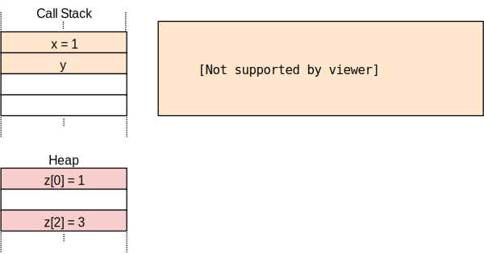

+++
title = "Heap Allocation"
weight = 10
path = "heap-allocation"
date = 0000-01-01
+++

TODO

<!-- more -->

This blog is openly developed on [GitHub]. If you have any problems or questions, please open an issue there. You can also leave comments [at the bottom]. The complete source code for this post can be found in the [`post-10`][post branch] branch.

[GitHub]: https://github.com/phil-opp/blog_os
[at the bottom]: #comments
[post branch]: https://github.com/phil-opp/blog_os/tree/post-10

<!-- toc -->

## Local and Static Variables

We currently use two types of variables in our kernel: local variables and `static` variables. Local variables are stored on the [call stack] and are only valid until the surrounding function returns. Static variables are stored at a fixed memory location and always live for the complete lifetime of the program.

### Local Variables

Local variables are stored on the [call stack], which is a [stack data structure] that supports `push` and `pop` operations. On each function entry, the parameters, the return address, and the local variables of the called function are pushed by the compiler:

[call stack]: https://en.wikipedia.org/wiki/Call_stack
[stack data structure]: https://en.wikipedia.org/wiki/Stack_(abstract_data_type)


The above example shows the call stack after an `outer` function called an `inner` function. We see that the call stack contains the local variables of `outer` first. On the `inner` call, the parameter `1` and the return address for the function were pushed. Then control was transferred to `inner`, which pushed its local variables.

After the `inner` function returns, its part of the call stack is popped again and only the local variables of `outer` remain:


We see that the local variables of `inner` only live until the function returns. The Rust compiler enforces these lifetimes and throws an error when we for example try to return a reference to a local variable:

```rust
fn inner(i: usize) -> &'static u32 {
    let z = [1, 2, 3];
    &z[i]
}
```

([run the example on the playground](https://play.rust-lang.org/?version=stable&mode=debug&edition=2018&gist=6186a0f3a54f468e1de8894996d12819))

While returning a reference makes no sense in this example, there are cases where we want a variable to live longer than the function. We already saw such a case in our kernel when we tried to [load an interrupt descriptor table] and had to use a `static` variable to extend the lifetime.

[load an interrupt descriptor table]: ./second-edition/posts/05-cpu-exceptions/index.md#loading-the-idt

### Static Variables

Static variables are stored at a fixed memory location separate from the stack. This memory location is assigned at compile time by the linker and encoded in the executable. Statics live for the complete runtime of the program, so they have the `'static` lifetime and can always be referenced from local variables:


When the `inner` function returns in the above example, it's part of the call stack is destroyed. The static variables live in a separate memory range that is never destroyed, so the `&Z[1]` reference is still valid after the return.

Apart from the `'static` lifetime, static variables also have the useful property that their location is known at compile time, so that no reference is needed for accessing it. We utilized that property for our `println` macro: By using a [static `Writer`] internally there is no `&mut Writer` reference needed to invoke the macro, which is very useful in [exception handlers] where we don't have access to any non-local references.

[static `Writer`]: ./second-edition/posts/03-vga-text-buffer/index.md#a-global-interface
[exception handlers]: ./second-edition/posts/05-cpu-exceptions/index.md#implementation

However, this property of static variables brings a crucial drawback: They are read-only by default. Rust enforces this because a [data race] would occur if e.g. two threads modify a static variable at the same time. The only way to modify a static variable is to encapsulate it in a [`Mutex`] type, which ensures that only a single `&mut` reference exists at any point in time. We used a `Mutex` for our [static VGA buffer `Writer`][vga mutex].

[data race]: https://doc.rust-lang.org/nomicon/races.html
[`Mutex`]: https://docs.rs/spin/0.5.0/spin/struct.Mutex.html
[vga mutex]: ./second-edition/posts/03-vga-text-buffer/index.md#spinlocks

## Dynamic Memory

Local and static variables are already very powerful together and enable most use cases. However, we saw that they both have their limitations:

- Local variables only live until the end of the surrounding function or block (or shorter with [non lexical lifetimes]). This is because they live on the call stack and are destroyed after the surrounding function returns.
- Static variables always live for the complete runtime of the program, so there is no way to reclaim and reuse their memory when they're no longer needed. Also, they have unclear ownership semantics and are accessible from all functions, so they need to be protected by a [`Mutex`] when we want to modify them.

[non lexical lifetimes]: https://doc.rust-lang.org/nightly/edition-guide/rust-2018/ownership-and-lifetimes/non-lexical-lifetimes.html

Another limitation of local and static variables is that they have a fixed size. So they can't store a collection that dynamically grows when more elements are added. (There are proposals for [unsized rvalues] in Rust that would allow dynamically sized local variables, but they only work in some specific cases.)

[unsized rvalues]: https://github.com/rust-lang/rust/issues/48055

To circumvent these drawbacks, programming languages often support a third memory region for storing variables called the **heap**. The heap supports _dynamic memory allocation_ at runtime through two functions called `allocate` and `deallocate`. It works in the following way: The `allocate` function returns a free chunk of memory of the specified size that can be used to store a variable. This variable then lives until it is freed by calling the `deallocate` function with a reference to the variable.

Let's go through an example:


Here the `inner` function uses heap memory instead of static variables for storing `z`. It first allocates a memory block of the required size, which returns a `*mut u8` [raw pointer]. It then uses the [`ptr::write`] method to write the array `[1,2,3]` to it. In the last step, it uses the [`offset`] function to calculate a pointer to the `i`th element and returns it. (Note that we omitted some required casts and unsafe blocks in this example function for brevity.)

[raw pointer]: https://doc.rust-lang.org/book/ch19-01-unsafe-rust.html#dereferencing-a-raw-pointer
[`ptr::write`]: https://doc.rust-lang.org/core/ptr/fn.write.html
[`offset`]: https://doc.rust-lang.org/std/primitive.pointer.html#method.offset

The allocated memory lives until it is explicitly freed through a call to `deallocate`. Thus, the returned pointer is still valid even after `inner` returned and its part of the call stack was destroyed. The advantage of using heap memory compared to static memory is that the memory can be reused after it is freed, which we do through the `deallocate` call in `outer`. After that call, the situation looks like this:



We see that the `z[1]` slot is free again and can be reused for the next `allocate` call. However, we also see that `z[0]` and `z[2]` are never freed because we never deallocate them. Such a bug is called a _memory leak_ and often the cause of excessive memory consumption of programs (just imagine what happens when we call `inner` repeatedly in a loop). This might seem bad, but there much more dangerous types of bugs that can happen with dynamic allocation.

### Common Errors

Apart from memory leaks, which are unfortunate but don't make the program vulnerable to attackers, there are two common types of bugs with more severe consequences:

- When we accidentally continue to use a variable after calling `deallocate` on it, we have a so-called **use-after-free** vulnerability. Such a bug can often exploited by attackers to execute arbitrary code.
- When we accidentally free a variable twice, we have a **double-free** vulnerability. This is problematic because it might free a different a different allocation that was allocated in the same spot after the first `deallocate` call. Thus, it can lead to an use-after-free vulnerability again.

These types of vulnerabilities are commonly known, so one might expect that people learned how to avoid them by now. But no, there are still new such vulnerabilities found today, for example this recent [use-after-free vulnerability in Linux][linux vulnerability] that allowed arbitrary code execution. This shows that even the best programmers are not always able to correctly handle dynamic memory in complex projects.

[linux vulnerability]: https://securityboulevard.com/2019/02/linux-use-after-free-vulnerability-found-in-linux-2-6-through-4-20-11/

To avoid these issues, many languages such as Java or Python manage dynamic memory automatically using a technique called [_garbage collection_]. The idea is that the programmer never invokes `deallocate` manually. Instead, the programm is regularly paused and scanned for unused heap variables, which are then automatically deallocated. Thus, the above vulnerabilities can never occur. The drawbacks are the performance overhead of the regular scan and the probaby long pause times.

[_garbage collection_]: https://en.wikipedia.org/wiki/Garbage_collection_(computer_science)

Rust takes a different approach to the problem: It uses a concept called [_ownership_] that is able to check the correctness of dynamic memory operations at compile time. Thus no garbage collection is needed and the programmer has fine-grained control over the use of dynamic memory just like in C or C++, but the compiler guarantees that none of the mentioned vulnerabilities can occur.

[_ownership_]: https://doc.rust-lang.org/book/ch04-01-what-is-ownership.html

### Allocations in Rust

First, instead of letting the programmer manually call `allocate` and `deallocate`, the Rust standard library provides abstraction types that call these functions implicitly. The most important type is [**`Box`**], which is an abstraction for a heap-allocated value. It provides a [`Box::new`] constructor function that takes a value, calls `allocate` with the size of the value, and then moves the value to the newly allocated slot on the heap. To free the heap memory again, the `Box` type implements the [`Drop` trait] to call `deallocate` when it goes out of scope:

[**`Box`**]: https://doc.rust-lang.org/std/boxed/index.html
[`Box::new`]: https://doc.rust-lang.org/alloc/boxed/struct.Box.html#method.new
[`Drop` trait]: https://doc.rust-lang.org/book/ch15-03-drop.html

```rust
{
    let z = Box::new([1,2,3]);
    […]
} // z goes out of scope and `deallocate` is called
```

This pattern has the strange name [_resource acquisition is initialization_] (or _RAII_ for short). It originated in C++, where it is used to implement a similar abstraction type called [`std::unique_ptr`].

[_resource acquisition is initialization_]: https://en.wikipedia.org/wiki/Resource_acquisition_is_initialization
[`std::unique_ptr`]: https://en.cppreference.com/w/cpp/memory/unique_ptr

Such a type alone does not suffice to prevent all use-after-free bugs since programmers can still hold on to references after the `Box` goes out of scope and the corresponding heap memory slot is deallocated:

```rust
let x = {
    let z = Box::new([1,2,3]);
    &z[1]
}; // z goes out of scope and `deallocate` is called
println!("{}", x);
```

This is where Rust's ownership comes in. It assigns an abstract [lifetime] to each reference, which is the scope in which the reference is valid. In the above example, the `x` reference is taken from the `z` array, so it becomes invalid after `z` goes out of scope. When you [run the above example on the playground][playground-2] you see that the Rust compiler indeed throws an error:

[lifetime]: https://doc.rust-lang.org/book/ch10-03-lifetime-syntax.html
[playground-2]: https://play.rust-lang.org/?version=stable&mode=debug&edition=2018&gist=28180d8de7b62c6b4a681a7b1f745a48

```
error[E0597]: `z[_]` does not live long enough
 --> src/main.rs:4:9
  |
2 |     let x = {
  |         - borrow later stored here
3 |         let z = Box::new([1,2,3]);
4 |         &z[1]
  |         ^^^^^ borrowed value does not live long enough
5 |     }; // z goes out of scope and `deallocate` is called
  |     - `z[_]` dropped here while still borrowed
```

The terminology can be a bit confusing at first. Taking a reference to a value is called _borrowing_ the value since it's similar to a borrow in real life: You have temporary access to an object but need to return it sometime and you must not destroy it. By checking that all borrows end before an object is destroyed, the Rust compiler can guarantee that no use-after-free situation can occur.

Rust's ownership system goes even further and does not only prevent use-after-free bugs, but provides complete [_memory safety_] like garbage collected languages like Java or Python do. Additionally, it guarantees [_thread safety_] and is thus even safer than those languages in multi-threaded code. And most importantly, all these checks happen at compile time, so there is no runtime overhead compared to hand written memory management in C.

[_memory safety_]: https://en.wikipedia.org/wiki/Memory_safety
[_thread safety_]: https://en.wikipedia.org/wiki/Thread_safety

### Use Cases

We now know the basics of dynamic memory allocation in Rust, but when should we use it? We've come really far with our kernel without dynamic memory allocation, so why do we need it now?

First, dynamic memory allocation always comes with a bit of performance overhead, since we need to find a free slot on the heap for every allocation. For this reason local variables are generally preferable. However, there are cases where dynamic memory allocation is needed or where using it is preferable.

As a basic rule, dynamic memory is required for variables that have a dynamic lifetime or a variable size. The most important type with a dynamic lifetime is [**`Rc`**], which counts the references to its wrapped value and deallocates it after all references went out of scope. Examples for types with a variable size are [**`Vec`**], [**`String`**], and other [collection types] that dynamically grow when more elements are added. These types work by allocating a larger amount of memory when they become full, copying all elements over, and then deallocating the old allocation.

[**`Rc`**]: https://doc.rust-lang.org/alloc/rc/index.html
[**`Vec`**]: https://doc.rust-lang.org/alloc/vec/index.html
[**`String`**]: https://doc.rust-lang.org/alloc/string/index.html
[collection types]: https://doc.rust-lang.org/alloc/collections/index.html

For our kernel we will mostly need the collection types, for example for storing a list of active tasks when implementing multitasking in the next posts.

## The Allocator Interface

The first step in implementing a heap allocator is to add a dependency on the built-in [`alloc`] crate. Like the [`core`] crate, it is a subset of the standard library that additionally contains the allocation and collection types. To add the dependency on `alloc`, we add the following to our `lib.rs`:

[`alloc`]: https://doc.rust-lang.org/alloc/
[`core`]: https://doc.rust-lang.org/core/

```rust
// in src/lib.rs

extern crate alloc;
```

Contrary to normal dependencies, we don't need to modify the `Cargo.toml`. The reason is that the `alloc` crate ships with the Rust compiler as part of the standard library, so we just need to enable it. This is what this `extern crate` statement does. (Historically, all dependencies needed an `extern crate` statement, which is now optional).

The reason that the `alloc` crate is disabled by default in `#[no_std]` crates is that it has additional requirements. We can see these requirements as errors when we try to compile our project now:

```
error: no global memory allocator found but one is required; link to std or add
       #[global_allocator] to a static item that implements the GlobalAlloc trait.

error: `#[alloc_error_handler]` function required, but not found
```

The first error occurs because the `alloc` crate requires an heap allocator. A heap allocator is an object that provides the `allocate` and `deallocate` functions that we mentioned above. In Rust, the heap allocator is described by the [`GlobalAlloc`] trait, which is mentioned in the error message. To set the heap allocator for the crate, the `#[global_allocator]` attribute must be applied to a `static` variable that implements the `GlobalAlloc` trait.

The second error occurs because calls to `allocate` can fail, most commonly when there is no more memory available. Our program must be able to react to this case, which is what the `#[alloc_error_handler]` function is for.

[`GlobalAlloc`]: https://doc.rust-lang.org/alloc/alloc/trait.GlobalAlloc.html

We will describe these traits and attributes in detail in the following sections.

### The `GlobalAlloc` Trait

The [`GlobalAlloc`] trait defines the functions that a heap allocator must provide. All heap allocators must implement it. The trait is special because it is almost never used directly by the programmer. Instead, the compiler will automatically insert the appropriate calls to the trait methods when using the allocation and collection types of `alloc`.

Since we will need to implement the trait for all our allocator types, it is worth taking a closer look at its declaration:

```rust
pub unsafe trait GlobalAlloc {
    unsafe fn alloc(&self, layout: Layout) -> *mut u8;
    unsafe fn dealloc(&self, ptr: *mut u8, layout: Layout);

    unsafe fn alloc_zeroed(&self, layout: Layout) -> *mut u8 { ... }
    unsafe fn realloc(
        &self,
        ptr: *mut u8,
        layout: Layout,
        new_size: usize
    ) -> *mut u8 { ... }
}
```

It defines the two required methods [`alloc`] and [`dealloc`], which correspond to the `allocate` and `deallocate` functions we used in our examples:
- The [`alloc`] method takes a [`Layout`] instance as argument, which describes the desired size and alignment that the allocated memory should have. It returns a [raw pointer] to the first byte of the allocated memory block. Instead of an explicit error value, the `alloc` method returns a null pointer to signal an allocation error. This is a bit non-idiomatic, but it has the advantage that wrapping existing system allocators is easy, since they use the same convention.
- The [`dealloc`] method is the counterpart and responsible for freeing a memory block again. It receives the pointer returned by `alloc` and the `Layout` that was used for the allocation as arguments.

[`alloc`]: https://doc.rust-lang.org/alloc/alloc/trait.GlobalAlloc.html#tymethod.alloc
[`dealloc`]: https://doc.rust-lang.org/alloc/alloc/trait.GlobalAlloc.html#tymethod.dealloc
[`Layout`]: https://doc.rust-lang.org/alloc/alloc/struct.Layout.html

The trait additionally defines the two methods [`alloc_zeroed`] and [`realloc`] with default implementations:

- The [`alloc_zeroed`] method is equivalent to calling `alloc` and then setting the allocated memory block to zero, which is exactly what the provided default implementation does. An allocator implementations can override the default implementations with a more efficient custom implementation if possible.
- The [`realloc`] method allows to grow or shrink an allocation. The default implementation allocates a new memory block with the desired size and copies over all the content from the previous allocation. Again, an allocator implementation can probably provide a more efficient implementation of this method, for example by growing/shrinking the allocation in-place if possible.

[`alloc_zeroed`]: https://doc.rust-lang.org/alloc/alloc/trait.GlobalAlloc.html#method.alloc_zeroed
[`realloc`]: https://doc.rust-lang.org/alloc/alloc/trait.GlobalAlloc.html#method.realloc

#### Unsafety

One thing to notice is that both the trait itself and all trait methods are declared as `unsafe`:

- The reason for declaring the trait as `unsafe` is that the programmer must guarantee that the trait implementation for an allocator type is correct. For example, the `alloc` method must never return a memory block that is already used somewhere else because this would cause undefined behavior.
- Similarly, the reason that the methods are `unsafe` is that the caller must ensure various invariants when calling the methods, for example that the `Layout` passed to `alloc` specifies a non-zero size. This is not really relevant in practice since the methods are normally called directly by the compiler, which ensures that the requirements are met.

### A `DummyAllocator`

Now that we know what an allocator type should provide, we can create a simple dummy allocator. For that we create a new `allocator` module:

```rust
// in src/lib.rs

pub mod allocator;
```

Our dummy allocator will do the absolute minimum to implement the trait and always return an error when `alloc` is called. It looks like this:

```rust
// in src/allocator.rs

use alloc::alloc::{GlobalAlloc, Layout};
use core::ptr::null_mut;

pub struct Dummy;

unsafe impl GlobalAlloc for Dummy {
    unsafe fn alloc(&self, _layout: Layout) -> *mut u8 {
        null_mut()
    }

    unsafe fn dealloc(&self, _ptr: *mut u8, _layout: Layout) {
        panic!("dealloc should be never called")
    }
}
```

The struct does not need any fields, so we create it as a [zero sized type]. As mentioned above, we always return the null pointer from `alloc`, which corresponds to an allocation error. Since the allocator never returns any memory, a call to `dealloc` should never occur. For this reason we simply panic in the `dealloc` method. The `alloc_zeroed` and `realloc` methods have default implementations, so we don't need to provide implementations for them.

[zero sized type]: https://doc.rust-lang.org/nomicon/exotic-sizes.html#zero-sized-types-zsts

We now have a simple allocator, but we still have to tell the Rust compiler that it should use this allocator. This is where the `#[global_allocator]` attribute comes in.

### The `#[global_allocator]` Attribute

The `#[global_allocator]` attribute tells the Rust compiler which allocator instance it should use as the global heap allocator. The attribute is only applicable to a `static` that implements the `GlobalAlloc` trait. Let's register an instance of our `Dummy` allocator as the global allocator:

```rust
// in src/lib.rs

#[global_allocator]
static ALLOCATOR: allocator::Dummy = allocator::Dummy;
```

Since the `Dummy` allocator is a [zero sized type], we don't need to specify any fields in the initialization expression. Note that the `#[global_allocator]` module [cannot be used in submodules][pr51335], so we need to put it into the `lib.rs`.

[pr51335]: https://github.com/rust-lang/rust/pull/51335

When we now try to compile it, the first error should be gone. Let's fix the remaining second error:

```
error: `#[alloc_error_handler]` function required, but not found
```

### The `#[alloc_error_handler]` Attribute

As we learned when discussing the `GlobalAlloc` trait, the `alloc` function can signal an allocation error by returning a null pointer. The question is: how should the Rust runtime react to such an allocation failure. This is where the `#[alloc_error_handler]` attribute comes in. It specifies a function that is called when an allocation error occurs, similar to how our panic handler is called when a panic occurs.

Let's add such a function to fix the compilation error:

```rust
// in src/lib.rs

#![feature(alloc_error_handler)] // at the top of the file

#[alloc_error_handler]
fn alloc_error_handler(layout: alloc::alloc::Layout) -> ! {
    panic!("allocation error: {:?}", layout)
}
```

The `alloc_error_handler` function is still unsafe, so we need a feature gate to enable it. The function receives a single argument: the `Layout` instance that was passed to `alloc` when the allocation failure occurred. There's nothing we can do to resolve that failure, so we just panic with a message that contains the `Layout` instance.

With this function, compilation errors should be fixed. Now we can use the allocation and collection types of `alloc`, for example we can use a [`Box`] to allocate a value on the heap:

[`Box`]: https://doc.rust-lang.org/alloc/boxed/struct.Box.html

```rust
// in src/main.rs

extern crate alloc;

fn kernel_main(boot_info: &'static BootInfo) -> ! {
    // […] print "Hello World!", call `init`, create `mapper` and `frame_allocator`

    let x = Box::new(41);

    // […] call `test_main` in test mode

    println!("It did not crash!");
    blog_os::hlt_loop();
}

```

Note that we need to specify the `extern crate alloc` statement in our `main.rs` too. This is required because the `lib.rs` and `main.rs` part are treated as separate crates. However, we don't need to create another `#[global_allocator]` static because the global allocator applies to all crates in the project. In fact, specifying an additional allocator in another crate would be an error.

When we run the above code, we see that our `alloc_error_handler` function is called:


The error handler is called because the `Box::new` function implicitly calls the `alloc` function of the global allocator. Our dummy allocator always returns a null pointer, so every allocation fails. To fix this we need to create an allocator that actually returns usable memory.

## Heap Memory

Before we can create a proper allocator, we first need to create a heap memory region from which the allocator can allocate memory. To do this, we need to define a virtual memory range for the heap region and then map this region to physical frames. See the [_"Introduction To Paging"_] post for an overview of virtual memory and page tables.

[_"Introduction To Paging"_]: ./second-edition/posts/08-paging-introduction/index.md

The first step is to define a virtual memory region for the heap. We can choose any virtual address range that we like, as long as it is not already used for a different memory region. Let's define it as the memory starting at address `0x_4444_4444_0000` so that we can easily recognize a heap pointer later:

```rust
// in src/allocator.rs

pub const HEAP_START: usize = 0x_4444_4444_0000;
pub const HEAP_SIZE: usize = 100 * 1024; // 100 KiB
```

We set the heap size to 1 KiB for now. If we need more space in the future, we can simply increase it.

If we tried to use this heap region now, a page fault would occur since the virtual memory region is not mapped to physical memory yet. To resolve this, we create an `init_heap` function that maps the heap pages using the [`Mapper` API] that we introduced in the [_"Paging Implementation"_] post:

[`Mapper` API]: ./second-edition/posts/09-paging-implementation/index.md#using-mappedpagetable
[_"Paging Implementation"_]: ./second-edition/posts/09-paging-implementation/index.md

```rust
// in src/allocator.rs

pub fn init_heap(
    mapper: &mut impl Mapper<Size4KiB>,
    frame_allocator: &mut impl FrameAllocator<Size4KiB>,
) -> Result<(), MapToError> {
    let page_range = {
        let heap_start = VirtAddr::new(HEAP_START as u64);
        let heap_end = heap_start + HEAP_SIZE - 1u64;
        let heap_start_page = Page::containing_address(heap_start);
        let heap_end_page = Page::containing_address(heap_end);
        Page::range_inclusive(heap_start_page, heap_end_page)
    };

    for page in page_range {
        let frame = frame_allocator
            .allocate_frame()
            .ok_or(MapToError::FrameAllocationFailed)?;
        let flags = PageTableFlags::PRESENT | PageTableFlags::WRITABLE;
        unsafe { mapper.map_to(page, frame, flags, frame_allocator)?.flush() };
    }

    Ok(())
}
```

The function takes mutable references to a [`Mapper`] and a [`FrameAllocator`] instance, both limited to 4KiB pages by using [`Size4KiB`] as generic parameter. The return value of the function is a [`Result`] with the unit type `()` as success variant and a [`MapToError`] as error variant, which is the error type returned by the [`Mapper::map_to`] method. Reusing the error type makes sense here because the `map_to` method is the main source of errors in this function.

[`Mapper`]:https://docs.rs/x86_64/0.7.0/x86_64/structures/paging/mapper/trait.Mapper.html
[`FrameAllocator`]: https://docs.rs/x86_64/0.7.0/x86_64/structures/paging/trait.FrameAllocator.html
[`Size4KiB`]: https://docs.rs/x86_64/0.7.0/x86_64/structures/paging/page/enum.Size4KiB.html
[`Result`]: https://doc.rust-lang.org/core/result/enum.Result.html
[`MapToError`]: https://docs.rs/x86_64/0.7.0/x86_64/structures/paging/mapper/enum.MapToError.html
[`Mapper::map_to`]: https://docs.rs/x86_64/0.7.0/x86_64/structures/paging/mapper/trait.Mapper.html#tymethod.map_to

The implementation can be broken down into two parts:

- **Creating the page range:**: To create a range of the pages that we want to map, we convert the `HEAP_START` pointer to a [`VirtAddr`] type. Then we calculate the heap end address from it by adding the `HEAP_SIZE`. We want an inclusive bound (the address of the last byte of the heap), so we subtract 1. Next, we convert the addresses into [`Page`] types using the [`containing_address`] function. Finally, we create a page range from the start and end pages using the [`Page::range_inclusive`] function.

- **Mapping the pages:** The second step is to map all pages of the page range we just created. For that we iterate over the pages in that range using a `for` loop. For each page, we do the following:

    - We allocate a physical frame that the page should be mapped to using the [`FrameAllocator::allocate_frame`] method. This method returns [`None`] when there are no more frames left. We deal with that case by mapping it to a [`MapToError::FrameAllocationFailed`] error through the [`Option::ok_or`] method and then apply the [question mark operator] to return early in the case of an error.

    - We set the required `PRESENT` flag and the `WRITABLE` flag for the page. With these flags both read and write accesses are allowed, which makes sense for heap memory.

    - We use the unsafe [`Mapper::map_to`] method for creating the mapping in the active page table. The method can fail, therefore we use the [question mark operator] again to forward the error to the caller. On success, the method returns a [`MapperFlush`] instance that we can use to update the [_translation lookaside buffer_] using the [`flush`] method.

[`VirtAddr`]: https://docs.rs/x86_64/0.7.0/x86_64/struct.VirtAddr.html
[`Page`]: https://docs.rs/x86_64/0.7.0/x86_64/structures/paging/page/struct.Page.html
[`containing_address`]: https://docs.rs/x86_64/0.7.0/x86_64/structures/paging/page/struct.Page.html#method.containing_address
[`Page::range_inclusive`]: https://docs.rs/x86_64/0.7.0/x86_64/structures/paging/page/struct.Page.html#method.range_inclusive
[`FrameAllocator::allocate_frame`]: https://docs.rs/x86_64/0.7.0/x86_64/structures/paging/trait.FrameAllocator.html#tymethod.allocate_frame
[`None`]: https://doc.rust-lang.org/core/option/enum.Option.html#variant.None
[`MapToError::FrameAllocationFailed`]: https://docs.rs/x86_64/0.7.0/x86_64/structures/paging/mapper/enum.MapToError.html#variant.FrameAllocationFailed
[`Option::ok_or`]: https://doc.rust-lang.org/core/option/enum.Option.html#method.ok_or
[question mark operator]: https://doc.rust-lang.org/edition-guide/rust-2018/error-handling-and-panics/the-question-mark-operator-for-easier-error-handling.html
[`MapperFlush`]: https://docs.rs/x86_64/0.7.0/x86_64/structures/paging/mapper/struct.MapperFlush.html
[_translation lookaside buffer_]: ./second-edition/posts/08-paging-introduction/index.md#the-translation-lookaside-buffer
[`flush`]: https://docs.rs/x86_64/0.7.0/x86_64/structures/paging/mapper/struct.MapperFlush.html#method.flush

The final step is to call this function from our `kernel_main`:

```rust
// in src/main.rs

fn kernel_main(boot_info: &'static BootInfo) -> ! {
    use blog_os::allocator; // new import
    use blog_os::memory::{self, BootInfoFrameAllocator};

    println!("Hello World{}", "!");
    blog_os::init();

    let mut mapper = unsafe { memory::init(boot_info.physical_memory_offset) };
    let mut frame_allocator = unsafe {
        BootInfoFrameAllocator::init(&boot_info.memory_map)
    };

    // new
    allocator::init_heap(&mut mapper, &mut frame_allocator)
        .expect("heap initialization failed");

    let x = Box::new(41);

    // […] call `test_main` in test mode

    println!("It did not crash!");
    blog_os::hlt_loop();
}
```

We show the full function for context here. The only new lines are the `blog_os::allocator` import and the call to `allocator::init_heap` function. In case the `init_heap` function returns an error, we panic using the [`Result::expect`] method since there is currently no sensible way for us to handle this error.

[`Result::expect`]: https://doc.rust-lang.org/core/result/enum.Result.html#method.expect

We now have a mapped heap memory region that is ready to be used. The `Box::new` call still uses our old `Dummy` allocator, so you will still see the "out of memory" error when you run it. Let's fix this by creating some proper allocators.

## The LinkedListAllocator Crate

TODO

## Summary

## What's next?
allocator designs (optional)