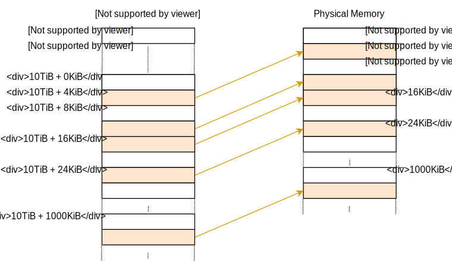
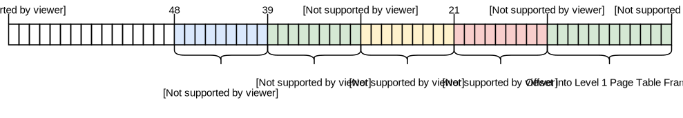
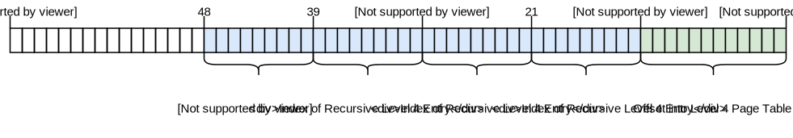
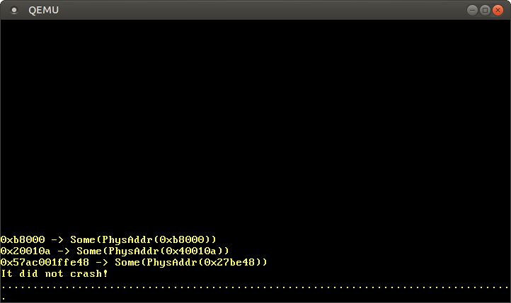
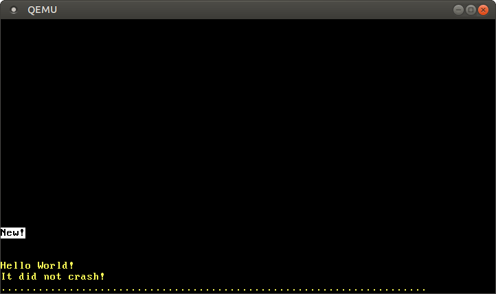

+++
title = "Paging Implementation"
weight = 10
path = "paging-implementation"
date = 2019-03-14
+++

This post shows how to implement paging support in our kernel. It first explores different techniques to make the physical page table frames accessible to the kernel and discusses their respective advantages and drawbacks. It then implements an address translation function and a function to create a new mapping.

<!-- more -->

This blog is openly developed on [GitHub]. If you have any problems or questions, please open an issue there. You can also leave comments [at the bottom]. The complete source code for this post can be found in the [`post-10`][post branch] branch.

[GitHub]: https://github.com/phil-opp/blog_os
[at the bottom]: #comments
[post branch]: https://github.com/phil-opp/blog_os/tree/post-10

<aside class="post_aside">

## Another Paging Post?

If you follow this blog, you have probably seen the [_Advanced Paging_](/advanced-paging) post that was published at the end of January. After receiving some [negative feedback] about the use of recursive page tables in that post, I decided to rewrite that post using a [different approach] for accessing the page table frames.

[negative feedback]: https://news.ycombinator.com/item?id=19017995
[different approach]: https://github.com/phil-opp/blog_os/issues/545

This post is the result of the rewrite. It still explains how recursive page tables work, but it chooses a different approach for the implementation that is both simpler and more powerful. The _Advanced Paging_ post will still be available, but it is marked as deprecated and will no longer receive updates.

I hope that you enjoy this new post!

</aside>

## Introduction

The [previous post] gave an introduction to the concept of paging. It motivated paging by comparing it with segmentation, explained how paging and page tables work, and then introduced the 4-level page table design of `x86_64`. We found out that the bootloader already set up a page table hierarchy for our kernel, which means that our kernel already runs on virtual addresses. This improves safety since illegal memory accesses cause page fault exceptions instead of modifying arbitrary physical memory.

[previous post]: ./second-edition/posts/09-paging-introduction/index.md

The post ended with the problem that we [can't access the page tables from our kernel][end of previous post] because they are stored in physical memory and our kernel already runs on virtual addresses. This post continues at this point and explores different approaches of making the page table frames accessible to our kernel. We will discuss the advantages and drawbacks of each approach and then decide for an approach for our kernel.

[end of previous post]: ./second-edition/posts/09-paging-introduction/index.md#accessing-the-page-tables

To implement the approach, we will need support from the bootloader, so we'll configure it first. Afterward, we will implement a function that traverses the page table hierarchy in order to translate virtual to physical addresses. Finally, we learn how to create new mappings in the page tables and how to find unused memory frames for creating new page tables.

### Dependency Updates

This post requires version 0.4.0 or later of the `bootloader` dependency and version 0.5.2 or later of the `x86_64` dependency. You can update the dependencies in your `Cargo.toml`:

```toml
[dependencies]
bootloader = "0.4.0"
x86_64 = "0.5.2"
```

For an overview of the changes in these versions, check out the [`bootloader` changelog] and the [`x86_64` changelog].

[`bootloader` changelog]: https://github.com/rust-osdev/bootloader/blob/master/Changelog.md
[`x86_64` changelog]: https://github.com/rust-osdev/x86_64/blob/master/Changelog.md

## Accessing Page Tables

Accessing the page tables from our kernel is not as easy as it may seem. To understand the problem let's take a look at the example 4-level page table hierarchy of the previous post again:


The important thing here is that each page entry stores the _physical_ address of the next table. This avoids the need to run a translation for these addresses too, which would be bad for performance and could easily cause endless translation loops.

The problem for us is that we can't directly access physical addresses from our kernel since our kernel also runs on top of virtual addresses. For example, when we access address `4 KiB` we access the _virtual_ address `4 KiB`, not the _physical_ address `4 KiB` where the level 4 page table is stored. When we want to access the physical address `4 KiB`, we can only do so through some virtual address that maps to it.

So in order to access page table frames, we need to map some virtual pages to them. There are different ways to create these mappings that all allow us to access arbitrary page table frames.

### Identity Mapping

A simple solution is to **identity map all page tables**:


In this example, we see various identity-mapped page table frames. This way the physical addresses of page tables are also valid virtual addresses so that we can easily access the page tables of all levels starting from the CR3 register.

However, it clutters the virtual address space and makes it more difficult to find continuous memory regions of larger sizes. For example, imagine that we want to create a virtual memory region of size 1000 KiB in the above graphic, e.g. for [memory-mapping a file]. We can't start the region at `28 KiB` because it would collide with the already mapped page at `1004 MiB`. So we have to look further until we find a large enough unmapped area, for example at `1008 KiB`. This is a similar fragmentation problem as with [segmentation].

[memory-mapping a file]: https://en.wikipedia.org/wiki/Memory-mapped_file
[segmentation]: ./second-edition/posts/09-paging-introduction/index.md#fragmentation

Equally, it makes it much more difficult to create new page tables, because we need to find physical frames whose corresponding pages aren't already in use. For example, let's assume that we reserved the _virtual_ 1000 KiB memory region starting at `1008 KiB` for our memory-mapped file. Now we can't use any frame with a _physical_ address between `1000 KiB` and `2008 KiB` anymore, because we can't identity map it.

### Map at a Fixed Offset

To avoid the problem of cluttering the virtual address space, we can **use a separate memory region for page table mappings**. So instead of identity mapping page table frames, we map them at a fixed offset in the virtual address space. For example, the offset could be 10 TiB:



By using the virtual memory in the range `10TiB..(10TiB + physical memory size)` exclusively for page table mappings, we avoid the collision problems of the identity mapping. Reserving such a large region of the virtual address space is only possible if the virtual address space is much larger than the physical memory size. This isn't a problem on x86_64 since the 48-bit address space is 256 TiB large.

This approach still has the disadvantage that we need to create a new mapping whenever we create a new page table. Also, it does not allow accessing page tables of other address spaces, which would be useful when creating a new process.

### Map the Complete Physical Memory

We can solve these problems by **mapping the complete physical memory** instead of only page table frames:


This approach allows our kernel to access arbitrary physical memory, including page table frames of other address spaces. The reserved virtual memory range has the same size as before, with the difference that it no longer contains unmapped pages.

The disadvantage of this approach is that additional page tables are needed for storing the mapping of the physical memory. These page tables need to be stored somewhere, so they use up a part of physical memory, which can be a problem on devices with a small amount of memory.

On x86_64, however, we can use [huge pages] with size 2MiB for the mapping, instead of the default 4KiB pages. This way, mapping 32 GiB of physical memory only requires 132 KiB for page tables since only one level 3 table and 32 level 2 tables are needed. Huge pages are also more cache efficient since they use fewer entries in the translation lookaside buffer (TLB).

[huge pages]: https://en.wikipedia.org/wiki/Page_%28computer_memory%29#Multiple_page_sizes

### Temporary Mapping

For devices with very small amounts of physical memory, we could **map the page tables frames only temporarily** when we need to access them. To be able to create the temporary mappings we only need a single identity-mapped level 1 table:


The level 1 table in this graphic controls the first 2 MiB of the virtual address space. This is because it is reachable by starting at the CR3 register and following the 0th entry in the level 4, level 3, and level 2 page tables. The entry with index `8` maps the virtual page at address `32 KiB` to the physical frame at address `32 KiB`, thereby identity mapping the level 1 table itself. The graphic shows this identity-mapping by the horizontal arrow at `32 KiB`.

By writing to the identity-mapped level 1 table, our kernel can create up to 511 temporary mappings (512 minus the entry required for the identity mapping). In the above example, the kernel created two temporary mappings:

- By mapping the 0th entry of the level 1 table to the frame with address `24 KiB`, it created a temporary mapping of the virtual page at `0 KiB` to the physical frame of the level 2 page table, indicated by the dashed arrow.
- By mapping the 9th entry of the level 1 table to the frame with address `4 KiB`, it created a temporary mapping of the virtual page at `36 KiB` to the physical frame of the level 4 page table, indicated by the dashed arrow.

Now the kernel can access the level 2 page table by writing to page `0 KiB` and the level 4 page table by writing to page `33 KiB`.

The process for accessing an arbitrary page table frame with temporary mappings would be:

- Search for a free entry in the identity-mapped level 1 table.
- Map that entry to the physical frame of the page table that we want to access.
- Access the target frame through the virtual page that maps to the entry.
- Set the entry back to unused thereby removing the temporary mapping again.

This approach reuses the same 512 virtual pages for creating the mappings and thus requires only 4KiB of physical memory. The drawback is that it is a bit cumbersome, especially since a new mapping might require modifications of multiple table levels, which means that we would need to repeat the above process multiple times.

### Recursive Page Tables

Another interesting approach, that requires no additional page tables at all, is to **map the page table recursively**. The idea behind this approach is to map some entry of the level 4 page table to the level 4 table itself. By doing this, we effectively reserve a part of the virtual address space and map all current and future page table frames to that space.

Let's go through an example to understand how this all works:


The only difference to the [example at the beginning of this post] is the additional entry at index `511` in the level 4 table, which is mapped to physical frame `4 KiB`, the frame of the level 4 table itself.

[example at the beginning of this post]: #accessing-page-tables

By letting the CPU follow this entry on a translation, it doesn't reach a level 3 table, but the same level 4 table again. This is similar to a recursive function that calls itself, therefore this table is called a _recursive page table_. The important thing is that the CPU assumes that every entry in the level 4 table points to a level 3 table, so it now treats the level 4 table as a level 3 table. This works because tables of all levels have the exact same layout on x86_64.

By following the recursive entry one or multiple times before we start the actual translation, we can effectively shorten the number of levels that the CPU traverses. For example, if we follow the recursive entry once and then proceed to the level 3 table, the CPU thinks that the level 3 table is a level 2 table. Going further, it treats the level 2 table as a level 1 table and the level 1 table as the mapped frame. This means that we can now read and write the level 1 page table because the CPU thinks that it is the mapped frame. The graphic below illustrates the 5 translation steps:


Similarly, we can follow the recursive entry twice before starting the translation to reduce the number of traversed levels to two:


Let's go through it step by step: First, the CPU follows the recursive entry on the level 4 table and thinks that it reaches a level 3 table. Then it follows the recursive entry again and thinks that it reaches a level 2 table. But in reality, it is still on the level 4 table. When the CPU now follows a different entry, it lands on a level 3 table but thinks it is already on a level 1 table. So while the next entry points at a level 2 table, the CPU thinks that it points to the mapped frame, which allows us to read and write the level 2 table.

Accessing the tables of levels 3 and 4 works in the same way. For accessing the level 3 table, we follow the recursive entry three times, tricking the CPU into thinking it is already on a level 1 table. Then we follow another entry and reach a level 3 table, which the CPU treats as a mapped frame. For accessing the level 4 table itself, we just follow the recursive entry four times until the CPU treats the level 4 table itself as the mapped frame (in blue in the graphic below).


It might take some time to wrap your head around the concept, but it works quite well in practice.

In the section below we explain how to construct virtual addresses for following the recursive entry one or multiple times. We will not use recursive paging for our implementation, so you don't need to read it to continue with the post. If it interests you, just click on _"Address Calculation"_ to expand it.

---

<details>
<summary><h4>Address Calculation</h4></summary>

We saw that we can access tables of all levels by following the recursive entry once or multiple times before the actual translation. Since the indexes into the tables of the four levels are derived directly from the virtual address, we need to construct special virtual addresses for this technique. Remember, the page table indexes are derived from the address in the following way:


Let's assume that we want to access the level 1 page table that maps a specific page. As we learned above, this means that we have to follow the recursive entry one time before continuing with the level 4, level 3, and level 2 indexes. To do that we move each block of the address one block to the right and set the original level 4 index to the index of the recursive entry:



For accessing the level 2 table of that page, we move each index block two blocks to the right and set both the blocks of the original level 4 index and the original level 3 index to the index of the recursive entry:


Accessing the level 3 table works by moving each block three blocks to the right and using the recursive index for the original level 4, level 3, and level 2 address blocks:


Finally, we can access the level 4 table by moving each block four blocks to the right and using the recursive index for all address blocks except for the offset:



We can now calculate virtual addresses for the page tables of all four levels. We can even calculate an address that points exactly to a specific page table entry by multiplying its index by 8, the size of a page table entry.

The table below summarizes the address structure for accessing the different kinds of frames:

Virtual Address for | Address Structure ([octal])
------------------- | -------------------------------
Page                | `0o_SSSSSS_AAA_BBB_CCC_DDD_EEEE`
Level 1 Table Entry | `0o_SSSSSS_RRR_AAA_BBB_CCC_DDDD`
Level 2 Table Entry | `0o_SSSSSS_RRR_RRR_AAA_BBB_CCCC`
Level 3 Table Entry | `0o_SSSSSS_RRR_RRR_RRR_AAA_BBBB`
Level 4 Table Entry | `0o_SSSSSS_RRR_RRR_RRR_RRR_AAAA`

[octal]: https://en.wikipedia.org/wiki/Octal

Whereas `AAA` is the level 4 index, `BBB` the level 3 index, `CCC` the level 2 index, and `DDD` the level 1 index of the mapped frame, and `EEEE` the offset into it. `RRR` is the index of the recursive entry. When an index (three digits) is transformed to an offset (four digits), it is done by multiplying it by 8 (the size of a page table entry). With this offset, the resulting address directly points to the respective page table entry.

`SSSSSS` are sign extension bits, which means that they are all copies of bit 47. This is a special requirement for valid addresses on the x86_64 architecture. We explained it in the [previous post][sign extension].

[sign extension]: ./second-edition/posts/09-paging-introduction/index.md#paging-on-x86

We use [octal] numbers for representing the addresses since each octal character represents three bits, which allows us to clearly separate the 9-bit indexes of the different page table levels. This isn't possible with the hexadecimal system where each character represents four bits.

##### In Rust Code

To construct such addresses in Rust code, you can use bitwise operations:

```rust
// the virtual address whose corresponding page tables you want to access
let addr: usize = […];

let r = 0o777; // recursive index
let sign = 0o177777 << 48; // sign extension

// retrieve the page table indices of the address that we want to translate
let l4_idx = (addr >> 39) & 0o777; // level 4 index
let l3_idx = (addr >> 30) & 0o777; // level 3 index
let l2_idx = (addr >> 21) & 0o777; // level 2 index
let l1_idx = (addr >> 12) & 0o777; // level 1 index
let page_offset = addr & 0o7777;

// calculate the table addresses
let level_4_table_addr =
    sign | (r << 39) | (r << 30) | (r << 21) | (r << 12);
let level_3_table_addr =
    sign | (r << 39) | (r << 30) | (r << 21) | (l4_idx << 12);
let level_2_table_addr =
    sign | (r << 39) | (r << 30) | (l4_idx << 21) | (l3_idx << 12);
let level_1_table_addr =
    sign | (r << 39) | (l4_idx << 30) | (l3_idx << 21) | (l2_idx << 12);
```

The above code assumes that the last level 4 entry with index `0o777` (511) is recursively mapped. This isn't the case currently, so the code won't work yet. See below on how to tell the bootloader to set up the recursive mapping.

Alternatively to performing the bitwise operations by hand, you can use the [`RecursivePageTable`] type of the `x86_64` crate, which provides safe abstractions for various page table operations. For example, the code below shows how to translate a virtual address to its mapped physical address:

[`RecursivePageTable`]: https://docs.rs/x86_64/0.5.2/x86_64/structures/paging/struct.RecursivePageTable.html

```rust
// in src/memory.rs

use x86_64::structures::paging::{Mapper, Page, PageTable, RecursivePageTable};
use x86_64::{VirtAddr, PhysAddr};

/// Creates a RecursivePageTable instance from the level 4 address.
let level_4_table_addr = […];
let level_4_table_ptr = level_4_table_addr as *mut PageTable;
let recursive_page_table = unsafe {
    let level_4_table = &mut *level_4_table_ptr;
    RecursivePageTable::new(level_4_table).unwrap();
}


/// Retrieve the physical address for the given virtual address
let addr: u64 = […]
let addr = VirtAddr::new(addr);
let page: Page = Page::containing_address(addr);

// perform the translation
let frame = recursive_page_table.translate_page(page);
frame.map(|frame| frame.start_address() + u64::from(addr.page_offset()))
```

Again, a valid recursive mapping is required for this code. With such a mapping, the missing `level_4_table_addr` can be calculated as in the first code example.

</details>

---

Recursive Paging is an interesting technique that shows how powerful a single mapping in a page table can be. It is relatively easy to implement and only requires a minimal amount of setup (just a single recursive entry), so it's a good choice for first experiments with paging.

However, it also has some disadvantages:

- It occupies a large amount of virtual memory (512GiB). This isn't a big problem in the large 48-bit address space, but it might lead to suboptimal cache behavior.
- It only allows accessing the currently active address space easily. Accessing other address spaces is still possible by changing the recursive entry, but a temporary mapping is required for switching back. We described how to do this in the (outdated) [_Remap The Kernel_] post.
- It heavily relies on the page table format of x86 and might not work on other architectures.

[_Remap The Kernel_]: https://os.phil-opp.com/remap-the-kernel/#overview

## Bootloader Support

All of these approaches require page table modifications for their setup. For example, mappings for the physical memory need to be created or an entry of the level 4 table needs to be mapped recursively. The problem is that we can't create these required mappings without an existing way to access the page tables.

This means that we need the help of the bootloader, which creates the page tables that our kernel runs on. The bootloader has access to the page tables, so it can create any mappings that we need. In its current implementation, the `bootloader` crate has support for two of the above approaches, controlled through [cargo features]:

[cargo features]: https://doc.rust-lang.org/cargo/reference/manifest.html#the-features-section

- The `map_physical_memory` feature maps the complete physical memory somewhere into the virtual address space. Thus, the kernel can access all physical memory and can follow the [_Map the Complete Physical Memory_](#map-the-complete-physical-memory) approach.
- With the `recursive_page_table` feature, the bootloader maps an entry of the level 4 page table recursively. This allows the kernel to access the page tables as described in the [_Recursive Page Tables_](#recursive-page-tables) section.

We choose the first approach for our kernel since it is simple, platform-independent, and more powerful (it also allows to access non-page-table-frames). To enable the required bootloader support, we add the `map_physical_memory` feature to our `bootloader` dependency:

```toml
[dependencies]
bootloader = { version = "0.4.0", features = ["map_physical_memory"]}
```

With this feature enabled, the bootloader maps the complete physical memory to some unused virtual address range. To communicate the virtual address range to our kernel, the bootloader passes a _boot information_ structure.

### Boot Information

The `bootloader` crate defines a [`BootInfo`] struct that contains all the information it passes to our kernel. The struct is still in an early stage, so expect some breakage when updating to future [semver-incompatible] bootloader versions. With the `map_physical_memory` feature enabled, it currently has the two fields `memory_map` and `physical_memory_offset`:

[`BootInfo`]: https://docs.rs/bootloader/0.3.11/bootloader/bootinfo/struct.BootInfo.html
[semver-incompatible]: https://doc.rust-lang.org/stable/cargo/reference/specifying-dependencies.html#caret-requirements

- The `memory_map` field contains an overview of the available physical memory. This tells our kernel how much physical memory is available in the system and which memory regions are reserved for devices such as the VGA hardware. The memory map can be queried from the BIOS or UEFI firmware, but only very early in the boot process. For this reason, it must be provided by the bootloader because there is no way for the kernel to retrieve it later. We will need the memory map later in this post.
- The `physical_memory_offset` tells us the virtual start address of the physical memory mapping. By adding this offset to a physical address, we get the corresponding virtual address. This allows us to access arbitrary physical memory from our kernel.

The bootloader passes the `BootInfo` struct to our kernel in the form of a `&'static BootInfo` argument to our `_start` function. We don't have this argument declared in our function yet, so let's add it:

```rust
// in src/main.rs

use bootloader::BootInfo;

#[cfg(not(test))]
#[no_mangle]
pub extern "C" fn _start(boot_info: &'static BootInfo) -> ! { // new argument
    […]
}
```

It wasn't a problem to leave off this argument before because the x86_64 calling convention passes the first argument in a CPU register. Thus, the argument is simply ignored when it isn't declared. However, it would be a problem if we accidentally used a wrong argument type, since the compiler doesn't know the correct type signature of our entry point function.

### The `entry_point` Macro

Since our `_start` function is called externally from the bootloader, no checking of our function signature occurs. This means that we could let it take arbitrary arguments without any compilation errors, but it would fail or cause undefined behavior at runtime.

To make sure that the entry point function has always the correct signature that the bootloader expects, the `bootloader` crate provides an [`entry_point`] macro that provides a type-checked way to define a Rust function as the entry point. Let's rewrite our entry point function to use this macro:

[`entry_point`]: https://docs.rs/bootloader/0.4.0/bootloader/macro.entry_point.html

```rust
// in src/main.rs

use bootloader::{BootInfo, entry_point};

entry_point!(kernel_main);

#[cfg(not(test))]
fn kernel_main(boot_info: &'static BootInfo) -> ! {
    […]
}
```

We no longer need to use `extern "C"` or `no_mangle` for our entry point, as the macro defines the real lower level `_start` entry point for us. The `kernel_main` function is now a completely normal Rust function, so we can choose an arbitrary name for it. The important thing is that it is type-checked so that a compilation error occurs when we use a wrong function signature, for example by adding an argument or changing the argument type.

## Implementation

Now that we have access to physical memory, we can finally start our implementation. First, we will take a look at the currently active page tables that our kernel runs on. In the second step, we will create a translation function that returns the physical address that a given virtual address is mapped to. As the last step, we will try to modify the page tables in order to create a new mapping.

Before we begin, we create a new `memory` module for our code:

```rust
// in src/lib.rs

pub mod memory;
```

For the module we create an empty `src/memory.rs` file.

### Accessing the Page Tables

At the [end of the previous post], we tried to take a look at the page tables our kernel runs on, but failed since we couldn't access the physical frame that the `CR3` register points to. We're now able to continue from there by creating an `active_level_4_table` function that returns a reference to the active level 4 page table:

[end of the previous post]: ./second-edition/posts/09-paging-introduction/index.md#accessing-the-page-tables

```rust
// in src/memory.rs

use x86_64::structures::paging::PageTable;

/// Returns a mutable reference to the active level 4 table.
///
/// This function is unsafe because the caller must guarantee that the
/// complete physical memory is mapped to virtual memory at the passed
/// `physical_memory_offset`. Also, this function must be only called once
/// to avoid aliasing `&mut` references (which is undefined behavior).
pub unsafe fn active_level_4_table(physical_memory_offset: u64)
    -> &'static mut PageTable
{
    use x86_64::{registers::control::Cr3, VirtAddr};

    let (level_4_table_frame, _) = Cr3::read();

    let phys = level_4_table_frame.start_address();
    let virt = VirtAddr::new(phys.as_u64() + physical_memory_offset);
    let page_table_ptr: *mut PageTable = virt.as_mut_ptr();

    &mut *page_table_ptr // unsafe
}
```

First, we read the physical frame of the active level 4 table from the `CR3` register. We then take its physical start address and convert it to a virtual address by adding the passed `physical_memory_offset`. Finally, we convert the address to a `*mut PageTable` raw pointer through the `as_mut_ptr` method and then unsafely create a `&mut PageTable` reference from it. We create a `&mut` reference instead of a `&` reference because we will mutate the page tables later in this post.

We don't need to use an unsafe block here because Rust treats the complete body of an `unsafe fn` like a large `unsafe` block. This makes our code more dangerous since we could accidentally introduce an unsafe operation in previous lines without noticing. It also makes it much more difficult to spot the unsafe operations. There is an [RFC](https://github.com/rust-lang/rfcs/pull/2585) to change this behavior.

We can now use this function to print the entries of the level 4 table:

```rust
// in src/main.rs

#[cfg(not(test))]
fn kernel_main(boot_info: &'static BootInfo) -> ! {
    […] // initialize GDT, IDT, PICS

    use blog_os::memory::active_level_4_table;

    let l4_table = unsafe {
        active_level_4_table(boot_info.physical_memory_offset)
    };
    for (i, entry) in l4_table.iter().enumerate() {
        if !entry.is_unused() {
            println!("L4 Entry {}: {:?}", i, entry);
        }
    }

    println!("It did not crash!");
    blog_os::hlt_loop();
}
```

As `physical_memory_offset` we pass the respective field of the `BootInfo` struct. We then use the `iter` function to iterate over the page table entries and the [`enumerate`] combinator to additionally add an index `i` to each element. We only print non-empty entries because all 512 entries wouldn't fit on the screen.

[`enumerate`]: https://doc.rust-lang.org/core/iter/trait.Iterator.html#method.enumerate

When we run it, we see the following output:


We see that there are various non-empty entries, which all map to different level 3 tables. There are so many regions because kernel code, kernel stack, the physical memory mapping, and the boot information all use separate memory areas.

To traverse the page tables further and take a look at a level 3 table, we can take the mapped frame of an entry convert it to a virtual address again:

```rust
// in the for loop in src/main.rs

use x86_64::{structures::paging::PageTable, VirtAddr};

if !entry.is_unused() {
    println!("L4 Entry {}: {:?}", i, entry);

    // get the physical address from the entry and convert it
    let phys = entry.frame().unwrap().start_address();
    let virt = phys.as_u64() + boot_info.physical_memory_offset;
    let ptr = VirtAddr::new(virt).as_mut_ptr();
    let l3_table: &PageTable = unsafe { &*ptr };

    // print non-empty entries of the level 3 table
    for (i, entry) in l3_table.iter().enumerate() {
        if !entry.is_unused() {
            println!("  L3 Entry {}: {:?}", i, entry);
        }
    }
}
```

For looking at the level 2 and level 1 tables, we repeat that process for the level 3 and level 2 entries. As you can imagine, this gets very verbose quickly, so we don't show the full code here.

Traversing the page tables manually is interesting because it helps to understand how the CPU performs the translation. However, most of the time we are only interested in the mapped physical address for a given virtual address, so let's create a function for that.

### Translating Addresses

For translating a virtual to a physical address, we have to traverse the four-level page table until we reach the mapped frame. Let's create a function that performs this translation:

```rust
// in src/memory.rs

use x86_64::{PhysAddr, VirtAddr};

/// Translates the given virtual address to the mapped physical address, or
/// `None` if the address is not mapped.
///
/// This function is unsafe because the caller must guarantee that the
/// complete physical memory is mapped to virtual memory at the passed
/// `physical_memory_offset`.
pub unsafe fn translate_addr(addr: VirtAddr, physical_memory_offset: u64)
    -> Option<PhysAddr>
{
    translate_addr_inner(addr, physical_memory_offset)
}
```

We forward the function to a safe `translate_addr_inner` function to limit the scope of `unsafe`. As we noted above, Rust treats the complete body of an unsafe fn like a large unsafe block. By calling into a private safe function, we make each `unsafe` operation explicit again.

The private inner function contains the real implementation:

```rust
// in src/memory.rs

/// Private function that is called by `translate_addr`.
///
/// This function is safe to limit the scope of `unsafe` because Rust treats
/// the whole body of unsafe functions as an unsafe block. This function must
/// only be reachable through `unsafe fn` from outside of this module.
fn translate_addr_inner(addr: VirtAddr, physical_memory_offset: u64)
    -> Option<PhysAddr>
{
    use x86_64::structures::paging::page_table::FrameError;
    use x86_64::registers::control::Cr3;

    // read the active level 4 frame from the CR3 register
    let (level_4_table_frame, _) = Cr3::read();

    let table_indexes = [
        addr.p4_index(), addr.p3_index(), addr.p2_index(), addr.p1_index()
    ];
    let mut frame = level_4_table_frame;

    // traverse the multi-level page table
    for &index in &table_indexes {
        // convert the frame into a page table reference
        let virt = frame.start_address().as_u64() + physical_memory_offset;
        let table_ptr: *const PageTable = VirtAddr::new(virt).as_ptr();
        let table = unsafe {&*table_ptr};

        // read the page table entry and update `frame`
        let entry = &table[index];
        frame = match entry.frame() {
            Ok(frame) => frame,
            Err(FrameError::FrameNotPresent) => return None,
            Err(FrameError::HugeFrame) => panic!("huge pages not supported"),
        };
    }

    // calculate the physical address by adding the page offset
    Some(frame.start_address() + u64::from(addr.page_offset()))
}
```

Instead of reusing our `active_level_4_table` function, we read the level 4 frame from the `CR3` register again. We do this because it simplifies this prototype implementation. Don't worry, we will create a better solution in a moment.

The `VirtAddr` struct already provides methods to compute the indexes into the page tables of the four levels. We store these indexes in a small array because it allows us to traverse the page tables using a `for` loop. Outside of the loop, we remember the last visited `frame` to calculate the physical address later. The `frame` points to page table frames while iterating, and to the mapped frame after the last iteration, i.e. after following the level 1 entry.

Inside the loop, we again use the `physical_memory_offset` to convert the frame into a page table reference. We then read the entry of the current page table and use the [`PageTableEntry::frame`] function to retrieve the mapped frame. If the entry is not mapped to a frame we return `None`. If the entry maps a huge 2MiB or 1GiB page we panic for now.

[`PageTableEntry::frame`]: https://docs.rs/x86_64/0.5.1/x86_64/structures/paging/page_table/struct.PageTableEntry.html#method.frame

Let's test our translation function by translating some addresses:

```rust
// in src/main.rs

#[cfg(not(test))]
fn kernel_main(boot_info: &'static BootInfo) -> ! {
    […] // initialize GDT, IDT, PICS

    use blog_os::memory::translate_addr;
    use x86_64::VirtAddr;

    let addresses = [
        // the identity-mapped vga buffer page
        0xb8000,
        // some code page
        0x20010a,
        // some stack page
        0x57ac_001f_fe48,
        // virtual address mapped to physical address 0
        boot_info.physical_memory_offset,
    ];

    for &address in &addresses {
        let virt = VirtAddr::new(address);
        let phys = unsafe {
            translate_addr(virt, boot_info.physical_memory_offset)
        };
        println!("{:?} -> {:?}", virt, phys);
    }

    println!("It did not crash!");
    blog_os::hlt_loop();
}
```

When we run it, we see the following output:



As expected, the identity-mapped address `0xb8000` translates to the same physical address. The code page and the stack page translate to some arbitrary physical addresses, which depend on how the bootloader created the initial mapping for our kernel. The translation of the `physical_memory_offset` should point to physical address `0`, but the translation fails because the mapping uses huge pages for efficiency. Future bootloader version might use the same optimization for kernel and stack pages.

### Using `MappedPageTable`

Translating virtual to physical addresses is a common task in an OS kernel, therefore the `x86_64` crate provides an abstraction for it. The implementation already supports huge pages and several other page table functions apart from `translate_addr`, so we will use it in the following instead of adding huge page support to our own implementation.

The base of the abstraction are two traits that define various page table mapping functions:

- The [`Mapper`] trait is generic over the page size and provides functions that operate on pages. Examples are [`translate_page`], which translates a given page to a frame of the same size, and [`map_to`], which creates a new mapping in the page table.
- The [`MapperAllSizes`] trait implies that the implementor implements `Mapper` for all pages sizes. In addition, it provides functions that work with multiple page sizes such as [`translate_addr`] or the general [`translate`].

[`Mapper`]: https://docs.rs/x86_64/0.5.1/x86_64/structures/paging/mapper/trait.Mapper.html
[`translate_page`]: https://docs.rs/x86_64/0.5.1/x86_64/structures/paging/mapper/trait.Mapper.html#tymethod.translate_page
[`map_to`]: https://docs.rs/x86_64/0.5.1/x86_64/structures/paging/mapper/trait.Mapper.html#tymethod.map_to
[`MapperAllSizes`]: https://docs.rs/x86_64/0.5.1/x86_64/structures/paging/mapper/trait.MapperAllSizes.html
[`translate_addr`]: https://docs.rs/x86_64/0.5.1/x86_64/structures/paging/mapper/trait.MapperAllSizes.html#method.translate_addr
[`translate`]: https://docs.rs/x86_64/0.5.1/x86_64/structures/paging/mapper/trait.MapperAllSizes.html#tymethod.translate

The traits only define the interface, they don't provide any implementation. The `x86_64` crate currently provides two types that implement the traits: [`MappedPageTable`] and [`RecursivePageTable`]. The former type requires that each page table frame is mapped somewhere (e.g. at an offset). The latter type can be used when the level 4 table is [mapped recursively](#recursive-page-tables).

[`MappedPageTable`]: https://docs.rs/x86_64/0.5.1/x86_64/structures/paging/struct.MappedPageTable.html
[`RecursivePageTable`]: https://docs.rs/x86_64/0.5.1/x86_64/structures/paging/struct.RecursivePageTable.html

We have the complete physical memory mapped at `physical_memory_offset`, so we can use the `MappedPageTable` type. To initialize it, we create a new `init` function in our `memory` module:

```rust
use x86_64::structures::paging::{PhysFrame, MapperAllSizes, MappedPageTable};
use x86_64::PhysAddr;

/// Initialize a new MappedPageTable.
///
/// This function is unsafe because the caller must guarantee that the
/// complete physical memory is mapped to virtual memory at the passed
/// `physical_memory_offset`. Also, this function must be only called once
/// to avoid aliasing `&mut` references (which is undefined behavior).
pub unsafe fn init(physical_memory_offset: u64) -> impl MapperAllSizes {
    let level_4_table = active_level_4_table(physical_memory_offset);
    let phys_to_virt = move |frame: PhysFrame| -> *mut PageTable {
        let phys = frame.start_address().as_u64();
        let virt = VirtAddr::new(phys + physical_memory_offset);
        virt.as_mut_ptr()
    };
    MappedPageTable::new(level_4_table, phys_to_virt)
}

// make private
unsafe fn active_level_4_table(physical_memory_offset: u64)
    -> &'static mut PageTable
{…}
```

We can't directly return a `MappedPageTable` from the function because it is generic over a closure type, which can't be named. We avoid this problem by using the [`impl Trait`] syntax. This also has the advantage that we can switch our kernel to use `RecursivePageTable` without changing the signature of the function.

[`impl Trait`]: https://doc.rust-lang.org/book/ch10-02-traits.html#returning-traits

The [`MappedPageTable::new`] function expects two parameters: a mutable reference to the level 4 page table and a `phys_to_virt` closure that converts a physical frame to a page table pointer `*mut PageTable`. For the first parameter we can reuse our `active_level_4_table` function. For the second parameter, we create a closure that uses the `physical_memory_offset` to perform the conversion.

[`MappedPageTable::new`]: https://docs.rs/x86_64/0.5.2/x86_64/structures/paging/struct.MappedPageTable.html#method.new

We also make the `active_level_4_table` private because it should only be called from the `init` function from now on.

To use the `MapperAllSizes::translate_addr` method instead of our own `memory::translate_addr` function, we only need to change a few lines in our `kernel_main`:

```rust
// in src/main.rs

#[cfg(not(test))]
fn kernel_main(boot_info: &'static BootInfo) -> ! {
    […] // initialize GDT, IDT, PICS

    // new: different imports
    use blog_os::memory;
    use x86_64::{structures::paging::MapperAllSizes, VirtAddr};

    // new: initialize a mapper
    let mapper = unsafe { memory::init(boot_info.physical_memory_offset) };

    let addresses = […]; // same as before

    for &address in &addresses {
        let virt = VirtAddr::new(address);
        // new: use the `mapper.translate_addr` method
        let phys = mapper.translate_addr(virt);
        println!("{:?} -> {:?}", virt, phys);
    }

    println!("It did not crash!");
    blog_os::hlt_loop();
}
```

When we run it now, we see the same translation results as before, with the difference that the huge page translation now also works:


As expected the virtual address `physical_memory_offset` translates to the physical address `0x0`. By using the translation function of the `MappedPageTable` type we can spare ourselves the work of implementing huge page support. We also have access to other page functions such as `map_to`, which we will use in the next section. At this point we no longer need our `memory::translate_addr` function, so you can delete it if you want.

### Creating a new Mapping

Until now we only looked at the page tables without modifying anything. Let's change that by creating a new mapping for a previously unmapped page.

We will use the [`map_to`] function of the [`Mapper`] trait for our implementation, so let's take a look at that function first. The documentation tells us that it takes four arguments: the page that we want to map, the frame that the page should be mapped to, a set of flags for the page table entry, and a `frame_allocator`. The frame allocator is needed because mapping the given page might require creating additional page tables, which need unused frames as backing storage.

[`map_to`]: https://docs.rs/x86_64/0.5.2/x86_64/structures/paging/trait.Mapper.html#tymethod.map_to
[`Mapper`]: https://docs.rs/x86_64/0.5.2/x86_64/structures/paging/trait.Mapper.html

#### A `create_example_mapping` Function

The first step of our implementation is to create a new `create_example_mapping` function that maps a given page to `0xb8000`, the physical frame of the VGA text buffer. We choose that frame because it allows us to easily test if the mapping was created correctly: We just need to write to the newly mapped page and see whether we see the write appear on the screen.

The `create_example_mapping` function looks like this:

```rust
// in src/memory.rs

use x86_64::structures::paging::{Page, Size4KiB, Mapper, FrameAllocator};

/// Creates an example mapping for the given page to frame `0xb8000`.
pub fn create_example_mapping(
    page: Page,
    mapper: &mut impl Mapper<Size4KiB>,
    frame_allocator: &mut impl FrameAllocator<Size4KiB>,
) {
    use x86_64::structures::paging::PageTableFlags as Flags;

    let frame = PhysFrame::containing_address(PhysAddr::new(0xb8000));
    let flags = Flags::PRESENT | Flags::WRITABLE;

    let map_to_result = unsafe {
        mapper.map_to(page, frame, flags, frame_allocator)
    };
    map_to_result.expect("map_to failed").flush();
}
```

In addition to the `page` that should be mapped, the function expects a `mapper` instance and a `frame_allocator`. The `mapper` is a type that implements the `Mapper<Size4KiB>` trait, which provides the `map_to` method. The generic `Size4KiB` parameter is needed because the [`Mapper`] trait is [generic] over the [`PageSize`] trait to work with both standard 4KiB pages and huge 2MiB/1GiB pages. We only want to create 4KiB pages, so we can use `Mapper<Size4KiB>` instead of requiring `MapperAllSizes`.

[generic]: https://doc.rust-lang.org/book/ch10-00-generics.html
[`PageSize`]: https://docs.rs/x86_64/0.5.2/x86_64/structures/paging/trait.PageSize.html

For the mapping, we set the `PRESENT` flag because it is required for all valid entries and the `WRITABLE` flag to make the mapped page writable. Calling `map_to` is unsafe because it's possible to break memory safety with invalid arguments, so we need to use an `unsafe` block. For a list of all possible flags, see the [_Page Table Format_] section of the previous post.

[_Page Table Format_]: ./second-edition/posts/09-paging-introduction/index.md#page-table-format

The `map_to` function can fail, so it returns a [`Result`]. Since this is just some example code that does not need to be robust, we just use [`expect`] to panic when an error occurs. On success, the function returns a [`MapperFlush`] type that provides an easy way to flush the newly mapped page from the translation lookaside buffer (TLB) with its [`flush`] method. Like `Result`, the type uses the [`#[must_use]`] attribute to emit a warning when we accidentally forget to use it.

[`Result`]: https://doc.rust-lang.org/core/result/enum.Result.html
[`expect`]: https://doc.rust-lang.org/core/result/enum.Result.html#method.expect
[`MapperFlush`]: https://docs.rs/x86_64/0.5.2/x86_64/structures/paging/struct.MapperFlush.html
[`flush`]: https://docs.rs/x86_64/0.5.2/x86_64/structures/paging/struct.MapperFlush.html#method.flush
[`#[must_use]`]: https://doc.rust-lang.org/std/result/#results-must-be-used

#### A dummy `FrameAllocator`

To be able to call `create_example_mapping` we need to create a `FrameAllocator` first. As noted above, the difficulty of creating a new mapping depends on the virtual page that we want to map. In the easiest case, the level 1 page table for the page already exists and we just need to write a single entry. In the most difficult case, the page is in a memory region for that no level 3 exists yet so that we need to create new level 3, level 2 and level 1 page tables first.

Let's start with the simple case and assume that we don't need to create new page tables. For this case, a frame allocator that always returns `None` suffices. We create such an `EmptyFrameAllocator` for testing our mapping function:

```rust
// in src/memory.rs

/// A FrameAllocator that always returns `None`.
pub struct EmptyFrameAllocator;

impl FrameAllocator<Size4KiB> for EmptyFrameAllocator {
    fn allocate_frame(&mut self) -> Option<PhysFrame> {
        None
    }
}
```

We now need to find a page that we can map without creating new page tables. The bootloader loads itself in the first megabyte of the virtual address space, so we know that a valid level 1 table exists for this region. We can choose any unused page in this memory region for our example mapping, for example, the page at address `0x1000`.

To test our mapping function, we first map page `0x1000` and then try to write to the screen through that mapping:

```rust
// in src/main.rs

#[cfg(not(test))]
fn kernel_main(boot_info: &'static BootInfo) -> ! {
    […] // initialize GDT, IDT, PICS

    use blog_os::memory;
    use x86_64::{structures::paging::Page, VirtAddr};

    let mut mapper = unsafe { memory::init(boot_info.physical_memory_offset) };
    let mut frame_allocator = memory::EmptyFrameAllocator;

    // map a previously unmapped page
    let page = Page::containing_address(VirtAddr::new(0x1000));
    memory::create_example_mapping(page, &mut mapper, &mut frame_allocator);

    // write the string `New!` to the screen through the new mapping
    let page_ptr: *mut u64 = page.start_address().as_mut_ptr();
    unsafe { page_ptr.offset(400).write_volatile(0x_f021_f077_f065_f04e)};

    println!("It did not crash!");
    blog_os::hlt_loop();
}
```

We first create the mapping for the page at `0x1000` by calling our `create_example_mapping` function with a mutable reference to the `mapper` and the `frame_allocator` instances. This maps the page `0x1000` to the VGA text buffer frame, so we should see any write to it on the screen.

Then we convert the page to a raw pointer and write a value to offset `400`. We don't write to the start of the page because the top line of the VGA buffer is directly shifted off the screen by the next `println`. We write the value `0x_f021_f077_f065_f04e`, which represents the string _"New!"_ on white background. As we learned [in the _“VGA Text Mode”_ post], writes to the VGA buffer should be volatile, so we use the [`write_volatile`] method.

[in the _“VGA Text Mode”_ post]: ./second-edition/posts/03-vga-text-buffer/index.md#volatile
[`write_volatile`]: https://doc.rust-lang.org/std/primitive.pointer.html#method.write_volatile

When we run it in QEMU, we see the following output:



The _"New!"_ on the screen is by our write to page `0x1000`, which means that we successfully created a new mapping in the page tables.

Creating that mapping only worked because there was already a level 1 table for mapping page `0x1000`. When we try to map a page for that no level 1 table exists yet, the `map_to` function fails because it tries to allocate frames from the `EmptyFrameAllocator` for creating new page tables. We can see that happen when we try to map page `0xdeadbeaf000` instead of `0x1000`:

```rust
// in src/main.rs

#[cfg(not(test))]
fn kernel_main(boot_info: &'static BootInfo) -> ! {
    […]
    let page = Page::containing_address(VirtAddr::new(0xdeadbeaf000));
    […]
}
```

When we run it, a panic with the following error message occurs:

```
panicked at 'map_to failed: FrameAllocationFailed', /…/result.rs:999:5
```

To map pages that don't have a level 1 page table yet we need to create a proper `FrameAllocator`. But how do we know which frames are unused and how much physical memory is available?

### Allocating Frames

In order to create new page tables, we need to create a proper frame allocator. We start with a generic skeleton:

```rust
// in src/memory.rs

pub struct BootInfoFrameAllocator<I> where I: Iterator<Item = PhysFrame> {
    frames: I,
}

impl<I> FrameAllocator<Size4KiB> for BootInfoFrameAllocator<I>
    where I: Iterator<Item = PhysFrame>
{
    fn allocate_frame(&mut self) -> Option<PhysFrame> {
        self.frames.next()
    }
}
```

The `frames` field can be initialized with an arbitrary [`Iterator`] of frames. This allows us to just delegate `alloc` calls to the [`Iterator::next`] method.

[`Iterator`]: https://doc.rust-lang.org/core/iter/trait.Iterator.html
[`Iterator::next`]: https://doc.rust-lang.org/core/iter/trait.Iterator.html#tymethod.next

For initializing the `BootInfoFrameAllocator` we use the `memory_map` that is passed by the bootloader as part of the `BootInfo` struct. As we explained in the [_Boot Information_](#boot-information) section, the memory map is provided by the BIOS/UEFI firmware. It can only be queried very early in the boot process, so the bootloader already calls the respective functions for us.

The memory map consists of a list of [`MemoryRegion`] structs, which contain the start address, the length, and the type (e.g. unused, reserved, etc.) of each memory region. By creating an iterator that yields frames from unused regions, we can instantiate a valid `BootInfoFrameAllocator`.

The initialization of the `BootInfoFrameAllocator` happens in a new `init_frame_allocator` function:

```rust
// in src/memory.rs

use bootloader::bootinfo::{MemoryMap, MemoryRegionType};

/// Create a FrameAllocator from the passed memory map
pub fn init_frame_allocator(
    memory_map: &'static MemoryMap,
) -> BootInfoFrameAllocator<impl Iterator<Item = PhysFrame>> {
    // get usable regions from memory map
    let regions = memory_map
        .iter()
        .filter(|r| r.region_type == MemoryRegionType::Usable);
    // map each region to its address range
    let addr_ranges = regions.map(|r| r.range.start_addr()..r.range.end_addr());
    // transform to an iterator of frame start addresses
    let frame_addresses = addr_ranges.flat_map(|r| r.step_by(4096));
    // create `PhysFrame` types from the start addresses
    let frames = frame_addresses.map(|addr| {
        PhysFrame::containing_address(PhysAddr::new(addr))
    });

    BootInfoFrameAllocator { frames }
}
```

This function uses iterator combinator methods to transform the initial `MemoryMap` into an iterator of usable physical frames:

- First, we call the `iter` method to convert the memory map to an iterator of [`MemoryRegion`]s. Then we use the [`filter`] method to skip any reserved or otherwise unavailable regions. The bootloader updates the memory map for all the mappings it creates, so frames that are used by our kernel (code, data or stack) or to store the boot information are already marked as `InUse` or similar. Thus we can be sure that `Usable` frames are not used somewhere else.
- In the second step, we use the [`map`] combinator and Rust's [range syntax] to transform our iterator of memory regions to an iterator of address ranges.
- The third step is the most complicated: We convert each range to an iterator through the `into_iter` method and then choose every 4096th address using [`step_by`]. Since 4096 bytes (= 4 KiB) is the page size, we get the start address of each frame. The bootloader page aligns all usable memory areas so that we don't need any alignment or rounding code here. By using [`flat_map`] instead of `map`, we get an `Iterator<Item = u64>` instead of an `Iterator<Item = Iterator<Item = u64>>`.
- In the final step, we convert the start addresses to `PhysFrame` types to construct the desired `Iterator<Item = PhysFrame>`. We then use this iterator to create and return a new `BootInfoFrameAllocator`.

[`MemoryRegion`]: https://docs.rs/bootloader/0.4.0/bootloader/bootinfo/struct.MemoryRegion.html
[`filter`]: https://doc.rust-lang.org/core/iter/trait.Iterator.html#method.filter
[`map`]: https://doc.rust-lang.org/core/iter/trait.Iterator.html#method.map
[range syntax]: https://doc.rust-lang.org/core/ops/struct.Range.html
[`step_by`]: https://doc.rust-lang.org/core/iter/trait.Iterator.html#method.step_by
[`flat_map`]: https://doc.rust-lang.org/core/iter/trait.Iterator.html#method.flat_map

We can now modify our `kernel_main` function to pass a `BootInfoFrameAllocator` instance instead of an `EmptyFrameAllocator`:

```rust
// in src/main.rs

#[cfg(not(test))]
fn kernel_main(boot_info: &'static BootInfo) -> ! {
    […]
    let mut frame_allocator = memory::init_frame_allocator(&boot_info.memory_map);
    […]
}
```

Now the mapping succeeds and we see the black-on-white _"New!"_ on the screen again. Behind the scenes, the `map_to` method creates the missing page tables in the following way:

- Allocate an unused frame from the passed `frame_allocator`.
- Zero the frame to create a new, empty page table.
- Map the entry of the higher level table to that frame.
- Continue with the next table level.

While our `create_example_mapping` function is just some example code, we are now able to create new mappings for arbitrary pages. This will be essential for allocating memory or implementing multithreading in future posts.

## Summary

In this post we learned about different techniques to access the physical frames of page tables, including identity mapping, mapping of the complete physical memory, temporary mapping, and recursive page tables. We chose to map the complete physical memory since it's simple, portable, and powerful.

We can't map the physical memory from our kernel without page table access, so we needed support from the bootloader. The `bootloader` crate supports creating the required mapping through optional cargo features. It passes the required information to our kernel in the form of a `&BootInfo` argument to our entry point function.

For our implementation, we first manually traversed the page tables to implement a translation function, and then used the `MappedPageTable` type of the `x86_64` crate. We also learned how to create new mappings in the page table and how to create the necessary `FrameAllocator` on top of the memory map passed by the bootloader.

## What's next?

The next post will create a heap memory region for our kernel, which will allow us to [allocate memory] and use various [collection types].

[allocate memory]: https://doc.rust-lang.org/alloc/boxed/struct.Box.html
[collection types]: https://doc.rust-lang.org/alloc/collections/index.html
