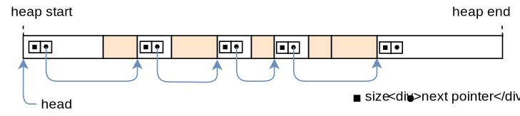

+++
title = "Allocator Designs"
weight = 11
path = "allocator-designs"
date = 0000-01-01
+++

This post explains how to implement heap allocators from scratch. It presents different allocator designs and explains their advantages and drawbacks. We then use this knowledge to create a kernel allocator with improved performance.

TODO

<!-- more -->

This blog is openly developed on [GitHub]. If you have any problems or questions, please open an issue there. You can also leave comments [at the bottom]. The complete source code for this post can be found in the [`post-11`][post branch] branch.

[GitHub]: https://github.com/phil-opp/blog_os
[at the bottom]: #comments
[post branch]: https://github.com/phil-opp/blog_os/tree/post-11

<!-- toc -->

TODO optional

## Introduction

In the [previous post] we added basic support for heap allocations to our kernel. For that, we [created a new memory region][map-heap] in the page tables and [used the `linked_list_allocator` crate][use-alloc-crate] to manage that memory. While we have a working heap now, we left most of the work to the allocator crate without understanding how it works.

[previous post]: @/second-edition/posts/10-heap-allocation/index.md
[map-heap]: @/second-edition/posts/10-heap-allocation/index.md#creating-a-kernel-heap
[use-alloc-crate]: @/second-edition/posts/10-heap-allocation/index.md#using-an-allocator-crate

In this post, we will show how to create our own heap allocator from scratch instead of relying on an existing allocator crate. We will discuss different allocator designs, including a simplistic _bump allocator_ and a basic _fixed-size block allocator_, and use this knowledge to implement an allocator with improved performance.

### Design Goals

The responsibility of an allocator is to manage the available heap memory. It needs to return unused memory on `alloc` calls and keep track of memory freed by `dealloc` so that it can be reused again. Most importantly, it must never hand out memory that is already in use somewhere else because this would cause undefined behavior.

Apart from correctness, there are many secondary design goals. For example, it should effectively utilize the available memory and keep [fragmentation] low. Furthermore, it should work well for concurrent applications and scale to any number of processors. For maximal performance, it could even optimize the memory layout with respect to the CPU caches to improve [cache locality] and avoid [false sharing].

[cache locality]: http://docs.cray.com/books/S-2315-50/html-S-2315-50/qmeblljm.html
[fragmentation]: https://en.wikipedia.org/wiki/Fragmentation_(computing)
[false sharing]: http://mechanical-sympathy.blogspot.de/2011/07/false-sharing.html

These requirements can make good allocators very complex. For example, [jemalloc] has over 30.000 lines of code. This complexity often undesired in kernel code where a single bug can lead to severe security vulnerabilities. Fortunately, the allocation patterns of kernel code are often much simpler compared to userspace code, so that relatively simple allocator designs often suffice.

[jemalloc]: http://jemalloc.net/

In the following we present three possible kernel allocator designs and explain their advantages and drawbacks.

## Bump Allocator

The most simple allocator design is a _bump allocator_. It allocates memory linearly and only keeps track of the number of allocated bytes and the number of allocations. It is only useful in very specific use cases because it has a severe limitation: it can only free all memory at once.

### Idea

The idea behind a bump allocator is to linearly allocate memory by increasing (_"bumping"_) a `next` variable, which points at the beginning of the unused memory. At the beginning, `next` is equal to the start address of the heap. On each allocation, `next` is increased by the allocation so that it always points to the boundary between used and unused memory:


The `next` pointer only moves in a single direction and thus never hands out the same memory region twice. When it reaches the end of the heap, no more memory can be allocated, resulting in an out-of-memory error on the next allocation.

A bump allocator is often implemented with an allocation counter, which is inreased by 1 on each `alloc` call and decreased by 1 on each `dealloc` call. When the allocation counter reaches zero it means that all allocations on the heap were deallocated. In this case, the `next` pointer can be reset to the start address of the heap, so that the complete heap memory is available to allocations again.

### Implementation

We start our implementation by declaring a new `allocator::bump` submodule:

```rust
// in src/allocator.rs

pub mod bump;
```

The content of the submodule lives in a new `src/allocator/bump.rs` file, which we create with the following content:

```rust
// in src/allocator/bump.rs

pub struct BumpAllocator {
    heap_start: usize,
    heap_end: usize,
    next: usize,
    allocations: usize,
}

impl BumpAllocator {
    /// Creates a new empty bump allocator.
    pub const fn new() -> Self {
        BumpAllocator {
            heap_start: 0,
            heap_end: 0,
            next: 0,
            allocations: 0,
        }
    }

    /// Initializes the bump allocator with the given heap bounds.
    ///
    /// This method is unsafe because the caller must ensure that the given
    /// memory range is unused. Also, this method must be called only once.
    pub unsafe fn init(&mut self, heap_start: usize, heap_size: usize) {
        self.heap_start = heap_start;
        self.heap_end = heap_start + heap_size;
        self.next = heap_start;
    }
}
```

The `heap_start` and `heap_end` fields keep track of the lower and upper bound of the heap memory region. The caller needs to ensure that these addresses are valid, otherwise the allocator would return invalid memory. For this reason, the `init` function needs to be `unsafe` to call.

The purpose of the `next` field is to always point to the first unused byte of the heap, i.e. the start address of the next allocation. It is set to `heap_start` in the `init` function because at the beginning the complete heap is unused. On each allocation, this field will be increased by the allocation size (_"bumped"_) to ensure that we don't return the same memory region twice.

The `allocations` field is a simple counter for the active allocations with the goal of resetting the allocator after the last allocation was freed. It is initialized with 0.

We chose to create a separate `init` function instead of performing the initialization directly in `new` in order to keep the interface identical to the allocator provided by the `linked_list_allocator` crate. This way, the allocators can be switched without additional code changes.

### Implementing `GlobalAlloc`

As [explained in the previous post][global-alloc], all heap allocators need to implement the [`GlobalAlloc`] trait, which is defined like this:

[global-alloc]: @/second-edition/posts/10-heap-allocation/index.md#the-allocator-interface
[`GlobalAlloc`]: https://doc.rust-lang.org/alloc/alloc/trait.GlobalAlloc.html

```rust
pub unsafe trait GlobalAlloc {
    unsafe fn alloc(&self, layout: Layout) -> *mut u8;
    unsafe fn dealloc(&self, ptr: *mut u8, layout: Layout);

    unsafe fn alloc_zeroed(&self, layout: Layout) -> *mut u8 { ... }
    unsafe fn realloc(
        &self,
        ptr: *mut u8,
        layout: Layout,
        new_size: usize
    ) -> *mut u8 { ... }
}
```

Only the `alloc` and `dealloc` methods are required, the other two methods have default implementations and can be omitted.

#### First Implementation Attempt

Let's try to implement the `alloc` method for our `BumpAllocator`:

```rust
// in src/allocator/bump.rs

use alloc::alloc::{GlobalAlloc, Layout};

unsafe impl GlobalAlloc for BumpAllocator {
    unsafe fn alloc(&self, layout: Layout) -> *mut u8 {
        // TODO alignment and bounds check
        let alloc_start = self.next;
        self.next = alloc_start + layout.size();
        self.allocations += 1;
        alloc_start as *mut u8
    }

    unsafe fn dealloc(&self, _ptr: *mut u8, _layout: Layout) {
        todo!();
    }
}
```

First, we use the `next` field as the start address for our allocation. Then we update the `next` field to point at the end address of the allocation, which is the next unused address on the heap. Before returning the start address of the allocation as a `*mut u8` pointer, we increase the `allocations` counter by 1.

Note that we don't perform any bounds checks or alignment adjustments, so this implementation is not safe yet. This does not matter much because it fails to compile anyway with the following error:

```
error[E0594]: cannot assign to `self.next` which is behind a `&` reference
  --> src/allocator/bump.rs:29:9
   |
26 |     unsafe fn alloc(&self, layout: Layout) -> *mut u8 {
   |                     ----- help: consider changing this to be a mutable reference: `&mut self`
...
29 |         self.next = alloc_start + layout.size();
   |         ^^^^^^^^^^^^^^^^^^^^^^^^^^^^^^^^^^^^^^^ `self` is a `&` reference, so the data it refers to cannot be written
```

(The same error also occurs for the `self.allocations += 1` line. We omitted it here for brevity.)

The error occurs because the [`alloc`] and [`dealloc`] methods of the `GlobalAlloc` trait only operate on an immutable `&self` reference, so updating the `next` and `allocations` fields is not possible. This is problematic because updating `next` on every allocation is the essential principle of a bump allocator.

[`alloc`]: https://doc.rust-lang.org/alloc/alloc/trait.GlobalAlloc.html#tymethod.alloc
[`dealloc`]: https://doc.rust-lang.org/alloc/alloc/trait.GlobalAlloc.html#tymethod.dealloc

Note that the compiler suggestion to change `&self` to `&mut self` in the method declaration does not work here. The reason is that the method signature is defined by the `GlobalAlloc` trait and can't be changed on the implementation side. (I opened an [issue](https://github.com/rust-lang/rust/issues/68049) in the Rust repository about the invalid suggestion.)

#### `GlobalAlloc` and Mutability

Before we look at a possible solution to this mutability problem, let's try to understand why the `GlobalAlloc` trait methods are defined with `&self` arguments: As we saw [in the previous post][global-allocator], the global heap allocator is defined by adding the `#[global_allocator]` attribute to a `static` that implements the `GlobalAlloc` trait. Static variables are immutable in Rust, so there is no way to call a method that takes `&mut self` on the static allocator. For this reason, all the methods of `GlobalAlloc` only take an immutable `&self` reference.

[global-allocator]:  @/second-edition/posts/10-heap-allocation/index.md#the-global-allocator-attribute

Fortunately there is a way how to get a `&mut self` reference from a `&self` reference: We can use synchronized [interior mutability] by wrapping the allocator in a [`spin::Mutex`] spinlock. This type provides a `lock` method that performs [mutual exclusion] and thus safely turns a `&self` reference to a `&mut self` reference. We already used the wrapper type multiple times in our kernel, for example for the [VGA text buffer][vga-mutex].

[interior mutability]: https://doc.rust-lang.org/book/ch15-05-interior-mutability.html
[vga-mutex]: @/second-edition/posts/03-vga-text-buffer/index.md#spinlocks
[`spin::Mutex`]: https://docs.rs/spin/0.5.0/spin/struct.Mutex.html
[mutual exclusion]: https://en.wikipedia.org/wiki/Mutual_exclusion

#### A `Locked` Wrapper Type

With the help of the `spin::Mutex` wrapper type we can implement the `GlobalAlloc` trait for our bump allocator. The trick is to implement the trait not for the `BumpAllocator` directly, but for the wrapped `spin::Mutex<BumpAllocator>` type:

```rust
unsafe impl GlobalAlloc for spin::Mutex<BumpAllocator> {…}
```

Unfortunately, this still doesn't work because the Rust compiler does not permit trait implementations for types defined in other crates:

```
error[E0117]: only traits defined in the current crate can be implemented for arbitrary types
  --> src/allocator/bump.rs:28:1
   |
28 | unsafe impl GlobalAlloc for spin::Mutex<BumpAllocator> {
   | ^^^^^^^^^^^^^^^^^^^^^^^^^^^^--------------------------
   | |                           |
   | |                           `spin::mutex::Mutex` is not defined in the current crate
   | impl doesn't use only types from inside the current crate
   |
   = note: define and implement a trait or new type instead
```

To fix this, we need to create our own wrapper type around `spin::Mutex`:

```rust
// in src/allocator.rs

/// A wrapper around spin::Mutex to permit trait implementations.
pub struct Locked<A> {
    inner: spin::Mutex<A>,
}

impl<A> Locked<A> {
    pub const fn new(inner: A) -> Self {
        Locked {
            inner: spin::Mutex::new(inner),
        }
    }

    pub fn lock(&self) -> spin::MutexGuard<A> {
        self.inner.lock()
    }
}
```

The type is a generic wrapper around a `spin::Mutex<A>`. It imposes no restrictions on the wrapped type `A`, so it can be used to wrap all kinds of types, not just allocators. It provides a simple `new` constructor function that wraps a given value. For convenience, it also provides a `lock` function that calls `lock` on the wrapped `Mutex`. Since the `Locked` type is general enough to be useful for other allocator implementations too, we put it in the parent `allocator` module.

#### Implementation for `Locked<BumpAllocator>`

The `Locked` type is defined in our own crate (in contrast to `spin::Mutex`), so we can use it to implement `GlobalAlloc` for our bump allocator. The full implementation looks like this:

```rust
// in src/allocator/bump.rs

use super::{align_up, Locked};
use alloc::alloc::{GlobalAlloc, Layout};
use core::ptr;

unsafe impl GlobalAlloc for Locked<BumpAllocator> {
    unsafe fn alloc(&self, layout: Layout) -> *mut u8 {
        let mut bump = self.lock(); // get a mutable reference

        let alloc_start = align_up(bump.next, layout.align());
        let alloc_end = alloc_start + layout.size();

        if alloc_end > bump.heap_end {
            ptr::null_mut() // out of memory
        } else {
            bump.next = alloc_end;
            bump.allocations += 1;
            alloc_start as *mut u8
        }
    }

    unsafe fn dealloc(&self, _ptr: *mut u8, _layout: Layout) {
        let mut bump = self.lock(); // get a mutable reference

        bump.allocations -= 1;
        if bump.allocations == 0 {
            bump.next = bump.heap_start;
        }
    }
}
```

The first step for both `alloc` and `dealloc` is to call the [`Mutex::lock`] method through the `inner` field to get a mutable reference to the wrapped allocator type. The instance remains locked until the end of the method, so that no data race can occur in multithreaded contexts (we will add threading support soon).

[`Mutex::lock`]: https://docs.rs/spin/0.5.0/spin/struct.Mutex.html#method.lock

Compared to the previous prototype, the `alloc` implementation now respects alignment requirements and performs a bounds check to ensure that the allocations stay inside the heap memory region. The first step is to round up the `next` address to the alignment specified by the `Layout` argument. The code for the `align_up` function is shown in a moment. Like before, we then add the requested allocation size to `alloc_start` to get the end address of the allocation. If it is larger than the end address of the heap, we return a null pointer to signal an out-of-memory situation. Otherwise, we update the `next` address and increase the `allocations` counter by 1 like before. Finally, we return the `alloc_start` address converted to a `*mut u8` pointer.

[`Layout`]: https://doc.rust-lang.org/alloc/alloc/struct.Layout.html

The `dealloc` function ignores the given pointer and `Layout` arguments. Instead, it just decreases the `allocations` counter. If the counter reaches `0` again, it means that all allocations were freed again. In this case, it resets the `next` address to the `heap_start` address to make the complete heap memory available again.

The `align_up` function is general enough that we can put it into the parent `allocator` module. It looks like this:

```rust
// in src/allocator.rs

fn align_up(addr: usize, align: usize) -> usize {
    let remainder = addr % align;
    if remainder == 0 {
        addr // addr already aligned
    } else {
        addr - remainder + align
    }
}
```

The function first computes the [remainder] of the division of `addr` by `align`. If the remainder is `0`, the address is already aligned with the given alignment. Otherwise, we align the address by subtracting the remainder (so that the new remainder is 0) and then adding the alignment (so that the address does not become smaller than the original address).

[remainder]: https://en.wikipedia.org/wiki/Euclidean_division

### Using It

To use the bump allocator instead of the `linked_list_allocator` crate, we need to update the `ALLOCATOR` static in `allocator.rs`:

```rust
// in src/allocator.rs

use bump::BumpAllocator;

#[global_allocator]
static ALLOCATOR: Locked<BumpAllocator> = Locked::new(BumpAllocator::new());
```

Here it becomes important that we declared `BumpAllocator::new` and `Locked::new` as [`const` functions]. If they were normal functions, a compilation error would occur because the initialization expression of a `static` must evaluable at compile time.

[`const` functions]: https://doc.rust-lang.org/reference/items/functions.html#const-functions

We don't need to change the  `ALLOCATOR.lock().init(HEAP_START, HEAP_SIZE)` call in our `init_heap` function because the bump allocator provides the same interface as the allocator provided by the `linked_list_allocator`.

Now our kernel uses our bump allocator! Everything should still work, including the [`heap_allocation` tests] that we created in the previous post:

[`heap_allocation` tests]: @/second-edition/posts/10-heap-allocation/index.md#adding-a-test

```
> cargo xtest --test heap_allocation
[…]
Running 3 tests
simple_allocation... [ok]
large_vec... [ok]
many_boxes... [ok]
```

### Discussion

The big advantage of bump allocation is that it's very fast. Compared to other allocator designs (see below) that need to actively look for a fitting memory block and perform various bookkeeping tasks on `alloc` and `dealloc`, a bump allocator [can be optimized][bump downwards] to just a few assembly instructions. This makes bump allocators useful for optimizing the allocation performance, for example when creating a [virtual DOM library].

[bump downwards]: https://fitzgeraldnick.com/2019/11/01/always-bump-downwards.html
[virtual DOM library]: https://hacks.mozilla.org/2019/03/fast-bump-allocated-virtual-doms-with-rust-and-wasm/

While a bump allocator is seldom used as the global allocator, the principle of bump allocation is often applied in form of [arena allocation], which basically batches individual allocations together to improve performance. An example for an arena allocator for Rust is the [`toolshed`] crate.

[arena allocation]: https://mgravell.github.io/Pipelines.Sockets.Unofficial/docs/arenas.html
[`toolshed`]: https://docs.rs/toolshed/0.8.1/toolshed/index.html

#### The Drawback of a Bump Allocator

The main limitation of a bump allocator is that it can only reuse deallocated memory after all allocations have been freed. This means that a single long-lived allocation suffices to prevent memory reuse. We can see this when we add a variation of the `many_boxes` test:

```rust
// in tests/heap_allocation.rs

#[test_case]
fn many_boxes_long_lived() {
    serial_print!("many_boxes_long_lived... ");
    let long_lived = Box::new(1); // new
    for i in 0..HEAP_SIZE {
        let x = Box::new(i);
        assert_eq!(*x, i);
    }
    assert_eq!(*long_lived, 1); // new
    serial_println!("[ok]");
}
```

Like the `many_boxes` test, this test creates a large number of allocations to provoke an out-of-memory failure if the allocator does not reuse freed memory. Additionally, the test creates a `long_lived` allocation, which lives for the whole loop execution.

When we try run our new test, we see that it indeed fails:

```
> cargo xtest --test heap_allocation
Running 4 tests
simple_allocation... [ok]
large_vec... [ok]
many_boxes... [ok]
many_boxes_long_lived... [failed]

Error: panicked at 'allocation error: Layout { size_: 8, align_: 8 }', src/lib.rs:86:5
```

Let's try to understand why this failure occurs in detail: First, the `long_lived` allocation is created at the start of the heap, thereby increasing the `allocations` counter by 1. For each iteration of the loop, a short lived allocation is created and directly freed again before the next iteration starts. This means that the `allocations` counter is temporarily increased to 2 at the beginning of an iteration and decreased to 1 at the end of it. The problem now is that the bump allocator can only reuse memory when _all_ allocations have been freed, i.e. the `allocations` counter falls to 0. Since this doesn't happen before the end of the loop, each loop iteration allocates a new region of memory, leading to an out-of-memory error after a number of iterations.


#### Reusing Freed Memory?

The question is: Can we extend our bump allocator somehow to remove this limitation?

As we learned [in the previous post][heap-intro], allocations can live arbitrarily long and can be freed in an arbitrary order. This means that we need to keep track of a potentially unbounded number of non-continuous, unused memory regions, as illustrated by the following example:

[heap-intro]: @/second-edition/posts/10-heap-allocation/index.md#dynamic-memory


The graphic shows the heap over the course of time. At the beginning, the complete heap is unused and the `next` address is equal to `heap_start` (line 1). Then the first allocation occurs (line 2). In line 3, a second memory block is allocated and the first allocation is freed. Many more allocations are added in line 4. Half of them are very short-lived and already get freed in line 5, where also another new allocation is added.

Line 5 shows the fundamental problem: We have five unused memory regions with different sizes in total, but the `next` pointer can only point to the beginning of the last region. While we could store the start addresses and sizes of the other unused memory regions in an array of size 4 for this example, this isn't a general solution since we could easily create an example with 8, 16, or 1000 unused memory regions.

Normally when we have a potentially unbounded number of items, we can just use a heap allocated collection. This isn't really possible in our case, since the heap allocator can't depend on itself (it would cause endless recursion or deadlocks). So we need to find a different solution.

## LinkedList Allocator

A common trick to keep track of an arbitrary number of free memory areas when implementing allocators is to use these areas itself as backing storage. This utilizes the fact that the regions are still mapped to a virtual address and backed by a physical frame, but the stored information is not needed anymore. By storing the information about the freed region in the region itself, we can keep track of an unbounded number of freed regions without needing additional memory.

The most common implementation approach is to construct a single linked list in the freed memory, with each node being a freed memory region:



Each list node contains two fields: The size of the memory region and a pointer to the next unused memory region. With this approach, we only need a pointer to the first unused region (called `head`) to keep track of all unused regions, independent of their number. As you can guess from the name, this is the technique that the `linked_list_allocator` crate uses.

### Implementation

In the following, we will create our own simple `LinkedListAllocator` type that uses the above approach for keeping track of freed memory regions. This part of the post isn't required for future posts, so you can skip the details if you like.

#### The Allocator Type

We start by creating a private `ListNode` struct in a new `allocator::linked_list` submodule:

```rust
// in src/allocator.rs

pub mod linked_list;
```

```rust
// in src/allocator/linked_list.rs

struct ListNode {
    size: usize,
    next: Option<&'static mut ListNode>,
}
```

Like in the graphic, a list node has a `size` field and an optional pointer to the next node, represented by the `Option<&'static mut ListNode>` type. The `&'static mut` type semantically describes an [owned] object behind a pointer. Basically, it's a [`Box`] without a destructor that frees the object at the end of the scope.

[owned]: https://doc.rust-lang.org/book/ch04-01-what-is-ownership.html
[`Box`]: https://doc.rust-lang.org/alloc/boxed/index.html

We implement the following set of methods for `ListNode`:

```rust
// in src/allocator/linked_list.rs

impl ListNode {
    const fn new(size: usize) -> Self {
        ListNode { size, next: None }
    }

    fn start_addr(&self) -> usize {
        self as *const Self as usize
    }

    fn end_addr(&self) -> usize {
        self.start_addr() + self.size
    }
}
```

The type has a simple constructor function named `new` and methods to calculate the start and end addresses of the represented region. We make the `new` function a [const function], which will be required later when constructing a static linked list allocator. Note that any use of mutable references in const functions (including setting the `next` field to `None`) is still unstable. In order to get it to compile, we need to add **`#![feature(const_fn)]`** to the beginning of our `lib.rs`.

With the `ListNode` struct as building block, we can now create the `LinkedListAllocator` struct:

```rust
// in src/allocator/linked_list.rs

pub struct LinkedListAllocator {
    head: ListNode,
}

impl LinkedListAllocator {
    /// Creates an empty LinkedListAllocator.
    pub const fn new() -> Self {
        Self {
            head: ListNode::new(0),
        }
    }

    /// Initialize the allocator with the given heap bounds.
    ///
    /// This function is unsafe because the caller must guarantee that the given
    /// heap bounds are valid and that the heap is unused. This method must be
    /// called only once.
    pub unsafe fn init(&mut self, heap_start: usize, heap_size: usize) {
        self.add_free_region(heap_start, heap_size);
    }

    /// Adds the given memory region to the front of the list.
    unsafe fn add_free_region(&mut self, addr: usize, size: usize) {
        todo!();
    }
}
```

The struct contains a `head` node that points to the first heap region. We are only interested in the value of the `next` pointer, so we set the `size` to 0 in the `ListNone::new` function. Making `head` a `ListNode` instead of just a `&'static mut ListNode` has the advantage that the implementation of the `alloc` method will be simpler.

Like for the bump allocator, the `new` function doesn't initialize the allocator with the heap bounds. In addition to maintaining API compatibility, the reason is that the initialization routine requires to write a node to the heap memory, which can only happen at runtime. The `new` function, however, needs to be a [`const` function] that can be evaluated at compile time, because it will be used for initializing the `ALLOCATOR` static. For this reason, we again provide a separate, non-constant `init` method.

[`const` function]: https://doc.rust-lang.org/reference/items/functions.html#const-functions

The `init` method uses a `add_free_region` method, whose implementation will be shown in a moment. For now, we use the [`todo!`] macro to provide a placeholder implementation that always panics.

[`todo!`]: https://doc.rust-lang.org/core/macro.todo.html

#### The `add_free_region` Method

The `add_free_region` method provides the fundamental _push_ operation on the linked list. We currently only call this method from `init`, but it will also be the central method in our `dealloc` implementation. Remember, the `dealloc` method is called when an allocated memory region is freed again. To keep track of this freed memory region, we want to push it to the linked list.

The implementation of the `add_free_region` method looks like this:

```rust
// in src/allocator/linked_list.rs

use super::align_up;
use core::mem;

impl LinkedListAllocator {
    /// Adds the given memory region to the front of the list.
    unsafe fn add_free_region(&mut self, addr: usize, size: usize) {
        // ensure that the freed region is capable of holding ListNode
        assert!(align_up(addr, mem::align_of::<ListNode>()) == addr);
        assert!(size >= mem::size_of::<ListNode>());

        // create a new list node and append it at the start of the list
        let mut node = ListNode::new(size);
        node.next = self.head.next.take();
        let node_ptr = addr as *mut ListNode;
        node_ptr.write(node);
        self.head.next = Some(&mut *node_ptr)
    }
}
```

The method takes a memory region represented by an address and size as argument and adds it to the front of the list. First, it ensures that the given region has the necessary size and alignment for storing a `ListNode`. Then it creates the node and inserts it to the list through the following steps:


Step 0 shows the state of the heap before `add_free_region` is called. In step 1, the method is called with the memory region marked as `freed` in the graphic. After the initial checks, the method creates a new `node` on its stack with the size of the freed region. It then uses the [`Option::take`] method to set the `next` pointer of the node to the current `head` pointer, thereby resetting the `head` pointer to `None`.

[`Option::take`]: https://doc.rust-lang.org/core/option/enum.Option.html#method.take

In step 2, the method writes the newly created `node` to the beginning of the freed memory region through the [`write`] method. It then points the `head` pointer to the new node. The resulting pointer structure looks a bit chaotic because the freed region is always inserted at the beginning of the list, but if we follow the pointers we see that each free region is still reachable from the `head` pointer.

[`write`]: https://doc.rust-lang.org/std/primitive.pointer.html#method.write

#### The `find_region` Method

The second fundamental operation on a linked list is finding an entry and removing it from the list. This is the central operation needed for implementing the `alloc` method. We implement the operation as a `find_region` method in the following way:

```rust
// in src/allocator/linked_list.rs

impl LinkedListAllocator {
    /// Looks for a free region with the given size and alignment and removes
    /// it from the list.
    ///
    /// Returns a tuple of the list node and the start address of the allocation.
    fn find_region(&mut self, size: usize, align: usize)
        -> Option<(&'static mut ListNode, usize)>
    {
        // reference to current list node, updated for each iteration
        let mut current = &mut self.head;
        // look for a large enough memory region in linked list
        while let Some(ref mut region) = current.next {
            if let Ok(alloc_start) = Self::alloc_from_region(&region, size, align) {
                // region suitable for allocation -> remove node from list
                let next = region.next.take();
                let ret = Some((current.next.take().unwrap(), alloc_start));
                current.next = next;
                return ret;
            } else {
                // region not suitable -> continue with next region
                current = current.next.as_mut().unwrap();
            }
        }

        // no suitable region found
        None
    }
}
```

The method uses a `current` variable and a [`while let` loop] to iterate over the list elements. At the beginning, `current` is set to the (dummy) `head` node. On each iteration, it is then updated to to the `next` field of the current node (in the `else` block). If the region is suitable for an allocation with the given size and alignment, the region is removed from the list and returned together with the `alloc_start` address.

[`while let` loop]: https://doc.rust-lang.org/reference/expressions/loop-expr.html#predicate-pattern-loops

When the `current.next` pointer becomes `None`, the loop exits. This means that we iterated over the whole list but found no region that is suitable for an allocation. In that case, we return `None`. The check whether a region is suitable is done by a `alloc_from_region` function, whose implementation will be shown in a moment.

Let's take a more detailed look at how a suitable region is removed from the list:


Step 0 shows the situation before any pointer adjustments. The `region` and `current` regions and the `region.next` and `current.next` pointers are marked in the graphic. In step 1, both the `region.next` and `current.next` pointers are reset to `None` by using the [`Option::take`] method. The original pointers are stored in local variables called `next` and `ret`.

In step 2, the `current.next` pointer is set to the local `next` pointer, which is the original `region.next` pointer. The effect is that `current` now directly points to the region after `region`, so that `region` is no longer element of the linked list. The function then returns the pointer to `region` stored in the local `ret` variable.

##### The `alloc_from_region` Function

The `alloc_from_region` function returns whether a region is suitable for an allocation with given size and alignment. It is defined like this:

```rust
// in src/allocator/linked_list.rs

impl LinkedListAllocator {
    /// Try to use the given region for an allocation with given size and
    /// alignment.
    ///
    /// Returns the allocation start address on success.
    fn alloc_from_region(region: &ListNode, size: usize, align: usize)
        -> Result<usize, ()>
    {
        let alloc_start = align_up(region.start_addr(), align);
        let alloc_end = alloc_start + size;

        if alloc_end > region.end_addr() {
            // region too small
            return Err(());
        }

        let excess_size = region.end_addr() - alloc_end;
        if excess_size > 0 && excess_size < mem::size_of::<ListNode>() {
            // rest of region too small to hold a ListNode (required because the
            // allocation splits the region in a used and a free part)
            return Err(());
        }

        // region suitable for allocation
        Ok(alloc_start)
    }
}
```

First, the function calculates the start and end address of a potential allocation, using the `align_up` function we defined earlier. If the end address is behind the end address of the region, the allocation doesn't fit in the region and we return an error.

The function performs a less obvious check after that. This check is necessary because most of the time an allocation does not fit a suitable region perfectly, so that a part of the region remains usable after the allocation. This part of the region must store its own `ListNode` after the allocation, so it must be large enough to do so. The check verifies exactly that: either the allocation fits perfectly (`excess_size == 0`) or the excess size is large enough to store a `ListNode`.

#### Implementing `GlobalAlloc`

With the fundamental operations provided by the `add_free_region` and `find_region` methods, we can now finally implement the `GlobalAlloc` trait. As with the bump allocator, we don't implement the trait directly for the `LinkedListAllocator`, but only for a wrapped `Locked<LinkedListAllocator>`. The [`Locked` wrapper] adds interior mutability through a spinlock, which allows us to modify the allocator instance even though the `alloc` and `dealloc` methods only take `&self` references.

[`Locked` wrapper]: @second-edition/posts/11-allocator-designs/index.md#a-locked-wrapper

The implementation looks like this:

```rust
// in src/allocator/linked_list.rs

use super::Locked;
use alloc::alloc::{GlobalAlloc, Layout};
use core::ptr;

unsafe impl GlobalAlloc for Locked<LinkedListAllocator> {
    unsafe fn alloc(&self, layout: Layout) -> *mut u8 {
        // perform layout adjustments
        let (size, align) = LinkedListAllocator::size_align(layout);
        let mut allocator = self.inner.lock();

        if let Some((region, alloc_start)) = allocator.find_region(size, align) {
            let alloc_end = alloc_start + size;
            let excess_size = region.end_addr() - alloc_end;
            if excess_size > 0 {
                allocator.add_free_region(alloc_end, excess_size);
            }
            alloc_start as *mut u8
        } else {
            ptr::null_mut()
        }
    }

    unsafe fn dealloc(&self, ptr: *mut u8, layout: Layout) {
        // perform layout adjustments
        let (size, _) = LinkedListAllocator::size_align(layout);

        self.inner.lock().add_free_region(ptr as usize, size)
    }
}
```

Let's start with the `dealloc` method because it is simpler: First, it performs some layout adjustments, which we will explain in a moment, and retrieves a `&mut LinkedListAllocator` reference by calling the [`Mutex::lock`] function on the [`Locked` wrapper]. Then it calls the `add_free_region` function to add the deallocated region to the free list.

The `alloc` method is a bit more complex. It starts with the same layout adjustments and also calls the [`Mutex::lock`] function to receive a mutable allocator reference. Then it uses the `find_region` method to find a suitable memory region for the allocation and remove it from the list. If this doesn't succeed and `None` is returned, it returns `null_mut` to signal an error as there is no suitable memory region.

In the success case, the `find_region` method returns a tuple of the suitable region (no longer in the list) and the start address of the allocation. Using `alloc_start`, the allocation size, and the end address of the region, it calculates the end address of the allocation and the excess size again. If the excess size is not null, it calls `add_free_region` to add the excess size of the memory region back to the free list. Finally, it returns the `alloc_start` address casted as a `*mut u8` pointer.

#### Layout Adjustments

So what are these layout adjustments that we do at the beginning of both `alloc` and `dealloc`? They ensure that each allocated block is capable of storing a `ListNode`. This is important because the memory block is going to be deallocated at some point, where we want to write a `ListNode` to it. If the block is smaller than a `ListNode` or does not have the correct alignment, undefined behavior can occur.

The layout adjustments are performed by a `size_align` function, which is defined like this:

```rust
// in src/allocator/linked_list.rs

impl LinkedListAllocator {
    /// Adjust the given layout so that the resulting allocated memory
    /// region is also capable of storing a `ListNode`.
    ///
    /// Returns the adjusted size and alignment as a (size, align) tuple.
    fn size_align(layout: Layout) -> (usize, usize) {
        let layout = layout
            .align_to(mem::align_of::<ListNode>())
            .expect("adjusting alignment failed")
            .pad_to_align();
        let size = layout.size().max(mem::size_of::<ListNode>());
        (size, layout.align())
    }
}
```

First, the function uses the [`align_to`] method on the passed [`Layout`] to increase the alignment to the alignment of a `ListNode` if necessary. It then uses the [`pad_to_align`] method to round up the size to a multiple of the alignment to ensure that the start address of the next memory block will have the correct alignment for storing a `ListNode` too.
In the second step it uses the [`max`] method to enforce a minimum allocation size of `mem::size_of::<ListNode>`. This way, the `dealloc` function can safetly write a `ListNode` to the freed memory block.

[`align_to`]: https://doc.rust-lang.org/core/alloc/struct.Layout.html#method.align_to
[`pad_to_align`]: https://doc.rust-lang.org/core/alloc/struct.Layout.html#method.pad_to_align
[`max`]: https://doc.rust-lang.org/std/cmp/trait.Ord.html#method.max

Both the `align_to` and the `pad_to_align` methods are still unstable. To enable then, we need to add **`#![feature(alloc_layout_extra)]`** to the beginning of our `lib.rs`.

### Using it

We can now update the `ALLOCATOR` static in the `allocator` module to use our new `LinkedListAllocator`:

```rust
// in src/allocator.rs

use linked_list::LinkedListAllocator;

#[global_allocator]
static ALLOCATOR: Locked<LinkedListAllocator> =
    Locked::new(LinkedListAllocator::new());
```

Since the `init` function behaves the same for the bump and linked list allocators, we don't need to modify the `init` call in `init_heap`.

When we now run our `heap_allocation` tests again, we see that all tests pass now, including the `many_boxes_long_lived` test that failed with the bump allocator:

```
> cargo xtest --test heap_allocation
simple_allocation... [ok]
large_vec... [ok]
many_boxes... [ok]
many_boxes_long_lived... [ok]
```

This shows that our linked list allocator is able to reuse freed memory for subsequent allocations.

### Discussion

In contrast to the bump allocator, the linked list allocator is much more suitable as a general purpose allocator, mainly because it is able to directly reuse freed memory. However, it also has some drawbacks. Some of them are only caused by our basic implementation, but there are also fundamental drawbacks of the allocator design itself.

#### Merging Freed Blocks

The main problem of our implementation is that it only splits the heap into smaller blocks, but never merges them back together. Consider this example:

TODO

In the first line, three allocations are created on the heap. Two of them are freed again in line 2 and the third is freed in line 3. Now the complete heap is unused again, but it is still split into four individual blocks. At this point, a large allocation might not be possible anymore because none of the four blocks is large enough. Over time, the process continues and the heap is split into smaller and smaller blocks. At some point, the heap is so fragmented that even normal sized allocations will fail.

To fix this problem, we need to merge adjacent freed blocks back together. For the above example, this would mean the following:

TODO

In line 3, we merge the rightmost allocation, which was just freed, together with the adjacent block representing the unused rest of the heap. In line TODO, we can merge all three unused blocks together because they're adjacent, with the result that the unused heap is represented by a single block again.

The `linked_list_allocator` crate implements this merging strategy in the following way: Instead of inserting freed memory blocks at the beginning of the linked list on `deallocate`, it always keeps the list sorted by start address. This way, merging can be performed directly on the `deallocate` call by examining the addresses and sizes of the two neighbor blocks in the list. Of course, the deallocation operation is slower this way, but it prevents the heap fragmentation we saw above.

#### Performance

As we learned above, the bump allocator is extremely fast and can be optimized to just a few assembly operations. The linked list allocator performs much worse in this category. The problem is that an allocation request might need to traverse the complete linked list until it finds a suitable block. Since the list length depends on the number of unused memory blocks, the performance can vary extremely for different programs. A program that only creates a couple of allocations will experience a relatively fast allocation performance. For a program that fragments the heap with many allocations, however, will experience a very bad allocation performance.

This isn't a problem with our allocation, but a fundamental disadvantage of the linked list approach.

-> fixed size blocks

## Fixed-Size Block Allocator


## Summary

## What's next?


---


# Old


## Performance
The linked list based approach has some performance problems. Each allocation or deallocation might need to scan the complete list of holes in the worst case. However, I think it's good enough for now, since our heap will stay relatively small for the near future. When our allocator becomes a performance problem eventually, we can just replace it with a faster alternative.

## Summary
Now we're able to use heap storage in our kernel without leaking memory. This allows us to effectively process dynamic data such as user supplied strings in the future. We can also use `Rc` and `Arc` to create types with shared ownership. And we have access to various data structures such as `Vec` or `Linked List`, which will make our lives much easier. We even have some well tested and optimized [binary heap] and [B-tree] implementations!

[binary heap]:https://en.wikipedia.org/wiki/Binary_heap
[B-tree]: https://en.wikipedia.org/wiki/B-tree


---

TODO: update date

---
