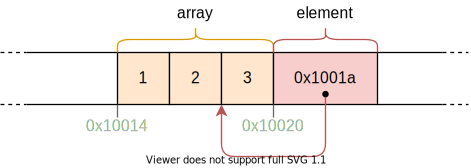
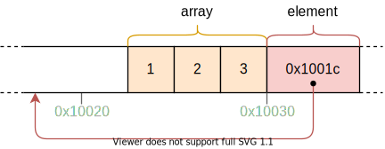
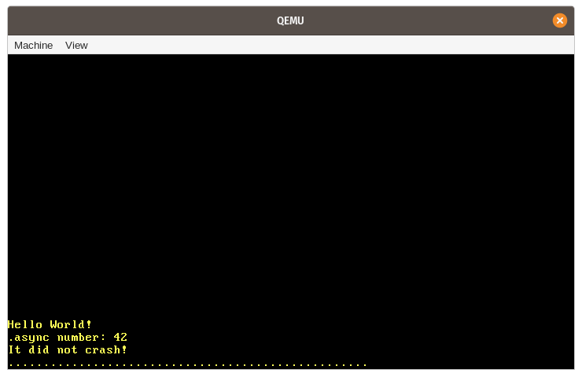

+++
title = "Async/Await"
weight = 12
path = "async-await"
date = 0000-01-01

[extra]
chapter = "Interrupts"
+++

In this post we explore _cooperative multitasking_ and the _async/await_ feature of Rust. This will make it possible to run multiple concurrent tasks in our kernel. TODO

<!-- more -->

This blog is openly developed on [GitHub]. If you have any problems or questions, please open an issue there. You can also leave comments [at the bottom]. The complete source code for this post can be found in the [`post-12`][post branch] branch.

[GitHub]: https://github.com/phil-opp/blog_os
[at the bottom]: #comments
[post branch]: https://github.com/phil-opp/blog_os/tree/post-12

<!-- toc -->

## Multitasking

One of the fundamental features of most operating systems is [_multitasking_], which is the ability to execute multiple tasks concurrently. For example, you probably have other programs open while looking at this post, such as a text editor or a terminal window. Even if you have only a single browser window open, there are probably various background tasks for managing your desktop windows, checking for updates, or indexing files.

[_multitasking_]: https://en.wikipedia.org/wiki/Computer_multitasking

While it seems like all tasks run in parallel, only a single task can be executed on a CPU core at a time. To create the illusion that the tasks run in parallel, the operating system rapidly switches between active tasks so that each one can make a bit of progress. Since computers are fast, we don't notice these switches most of the time.

While single-core CPUs can only execute a single task at a time, multi-core CPUs can run multiple tasks in a truly parallel way. For example, a CPU with 8 cores can run 8 tasks at the same time. We will explain how to setup multi-core CPUs in a future post. For this post, we will focus on single-core CPUs for simplicity. (It's worth noting that all multi-core CPUs start with only a single active core, so we can treat them as single-core CPUs for now.)

There are two forms of multitasking: _Cooperative_ multitasking requires tasks to regularly give up control of the CPU so that other tasks can make progress. _Preemptive_ multitasking uses operating system functionality to switch threads at arbitrary points in time by forcibly pausing them. In the following we will explore the two forms of multitasking in more detail and discuss their respective advantages and drawbacks.

### Preemptive Multitasking

The idea behind preemptive multitasking is that the operating system controls when to switch tasks. For that, it utilizes the fact that it regains control of the CPU on each interrupt. This makes it possible to switch tasks whenever new input is available to the system. For example, it would be possible to switch tasks when the mouse is moved or a network packet arrives. The operating system can also determine the exact time that a task is allowed to run by configuring a hardware timer to send an interrupt after that time.

The following graphic illustrates the task switching process on a hardware interrupt:


In the first row, the CPU is executing task `A1` of program `A`. All other tasks are paused. In the second row, a hardware interrupt arrives at the CPU. As described in the [_Hardware Interrupts_] post, the CPU immediately stops the execution of task `A1` and jumps to the interrupt handler defined in the interrupt descriptor table (IDT). Through this interrupt handler, the operating system now has control of the CPU again, which allows it to switch to task `B1` instead of continuing task `A1`.

[_Hardware Interrupts_]: @/second-edition/posts/07-hardware-interrupts/index.md

#### Saving State

Since tasks are interrupted at arbitrary points in time, they might be in the middle of some calculations. In order to be able to resume them later, the operating system must backup the whole state of the task, including its [call stack] and the values of all CPU registers. This process is called a [_context switch_].

[call stack]: https://en.wikipedia.org/wiki/Call_stack
[_context switch_]: https://en.wikipedia.org/wiki/Context_switch

As the call stack can be very large, the operating system typically sets up a separate call stack for each task instead of backing up the call stack content on each task switch. Such a task with a separate stack is called a [_thread of execution_] or _thread_ for short. By using a separate stack for each task, only the register contents need to be saved on a context switch (including the program counter and stack pointer). This approach minimizes the performance overhead of a context switch, which is very important since context switches often occur up to 100 times per second.

[_thread of execution_]: https://en.wikipedia.org/wiki/Thread_(computing)

#### Discussion

The main advantage of preemptive multitasking is that the operating system can fully control the allowed execution time of a task. This way, it can guarantee that each task gets a fair share of the CPU time, without the need to trust the tasks to cooperate. This is especially important when running third-party tasks or when multiple users share a system.

The disadvantage of preemption is that each task requires its own stack. Compared to a shared stack, this results in a higher memory usage per task and often limits the number of tasks in the system. Another disadvantage is that the operating system always has to save the complete CPU register state on each task switch, even if the task only used a small subset of the registers.

Preemptive multitasking and threads are fundamental components of an operating system because they make it possible to run untrusted userspace programs. We will discuss these concepts in full detail in future posts. For this post, however, we will focus on cooperative multitasking, which also provides useful capabilities for our kernel.

### Cooperative Multitasking

Instead of forcibly pausing running tasks at arbitrary points in time, cooperative multitasking lets each task run until it voluntarily gives up control of the CPU. This allows tasks to pause themselves at convenient points in time, for example when it needs to wait for an I/O operation anyway.

Cooperative multitasking is often used at the language level, for example in form of [coroutines] or [async/await]. The idea is that either the programmer or the compiler inserts [_yield_] operations into the program, which give up control of the CPU and allow other tasks to run. For example, a yield could be inserted after each iteration of a complex loop.

[coroutines]: https://en.wikipedia.org/wiki/Coroutine
[async/await]: https://rust-lang.github.io/async-book/01_getting_started/04_async_await_primer.html
[_yield_]: https://en.wikipedia.org/wiki/Yield_(multithreading)

It is common to combine cooperative multitasking with [asynchronous operations]. Instead of waiting until an operation is finished and preventing other tasks to run in this time, asynchronous operations return a "not ready" status if the operation is not finished yet. In this case, the waiting task can execute a yield operation to let other tasks run.

[asynchronous operations]: https://en.wikipedia.org/wiki/Asynchronous_I/O

#### Saving State

Since tasks define their pause points themselves, they don't need the operating system to save their state. Instead, they can save exactly the state they need for continuation before they pause themselves, which often results in better performance. For example, a task that just finished a complex computation might only need to backup the final result of the computation since it does not need the intermediate results anymore.

Language-supported implementations of cooperative tasks are often even able to backup up the required parts of the call stack before pausing. As an example, Rust's async/await implementation stores all local variables that are still needed in an automatically generated struct (see below). By backing up the relevant parts of the call stack before pausing, all tasks can share a single call stack, which results in a much smaller memory consumption per task. This makes it possible to create an almost arbitrary number of cooperative tasks without running out of memory.

#### Discussion

The drawback of cooperative multitasking is that an uncooperative task can potentially run for an unlimited amount of time. Thus, a malicious or buggy task can prevent other tasks from running and slow down or even block the whole system. For this reason, cooperative multitasking should only be used when all tasks are known to cooperate. As a counterexample, it's not a good idea to make the operating system rely on the cooperation of arbitrary userlevel programs.

However, the strong performance and memory benefits of cooperative multitasking make it a good approach for usage _within_ a program, especially in combination with asynchronous operations. Since an operating system kernel is a performance-critical program that interacts with asynchronous hardware, cooperative multitasking seems like a good approach for concurrency in our kernel.

## Async/Await in Rust

The Rust language provides first-class support for cooperative multitasking in form of async/await. Before we can explore what async/await is and how it works, we need to understand how _futures_ and asynchronous programming work in Rust.

### Futures

A _future_ represents a value that might not be available yet. This could be for example an integer that is computed by another task or a file that is downloaded from the network. Instead of waiting until the value is available, futures make it possible to continue execution until the value is needed.

#### Example

The concept of futures is best illustrated with a small example:


This sequence diagram shows a `main` function that reads a file from the file system and then calls a function `foo`. This process is repeated two times: Once with a synchronous `read_file` call and once with an asynchronous `async_read_file` call.

With the synchronous call, the `main` function needs to wait until the file is loaded from the file system. Only then it can call the `foo` function, which requires it to again wait for the result.

With the asynchronous `async_read_file` call, the file system directly returns a future and loads the file asynchronously in the background. This allows the `main` function to call `foo` much earlier, which then runs in parallel with the file load. In this example, the file load even finishes before `foo` returns, so `main` can directly work with the file without further waiting after `foo` returns.

#### Futures in Rust

In Rust, futures are represented by the [`Future`] trait, which looks like this:

[`Future`]: https://doc.rust-lang.org/nightly/core/future/trait.Future.html

```rust
pub trait Future {
    type Output;
    fn poll(self: Pin<&mut Self>, cx: &mut Context) -> Poll<Self::Output>;
}
```

The [associated type] `Output` specfies the type of the asynchronous value. For example, the `async_read_file` function in the diagram above would return a `Future` instance with `Output` set to `File`.

[associated type]: https://doc.rust-lang.org/book/ch19-03-advanced-traits.html#specifying-placeholder-types-in-trait-definitions-with-associated-types

The [`poll`] method allows to check if the value is already available. It returns a [`Poll`] enum, which looks like this:

[`poll`]: https://doc.rust-lang.org/nightly/core/future/trait.Future.html#tymethod.poll
[`Poll`]: https://doc.rust-lang.org/nightly/core/task/enum.Poll.html

```rust
pub enum Poll<T> {
    Ready(T),
    Pending,
}
```

When the value is already available (e.g. the file was fully read from disk), it is returned wrapped in the `Ready` variant. Otherwise, the `Pending` variant is returned, which signals the caller that the value is not yet available.

The `poll` method takes two arguments: `self: Pin<&mut Self>` and `cx: &mut Context`. The former behaves like a normal `&mut self` reference, with the difference that the `Self` value is [_pinned_] to its memory location. Understanding `Pin` and why it is needed is difficult without understanding how async/await works first. We will therefore explain it later in this post.

[_pinned_]: https://doc.rust-lang.org/nightly/core/pin/index.html

The purpose of the `cx: &mut Context` parameter is to pass a [`Waker`] instance to the asynchronous task, e.g. the file system load. This `Waker` allows the asynchronous task to signal that it (or a part of it) is finished, e.g. that the file was loaded from disk. Since the main task knows that it will be notified when the `Future` is ready, it does not need to call `poll` over and over again. We will explain this process in more detail later in this post when we implement an own waker type.

[`Waker`]: https://doc.rust-lang.org/nightly/core/task/struct.Waker.html

### Working with Futures

We now know how futures are defined and understand the basic idea behind the `poll` method. However, we still don't know how to effectively work with futures. The problem is that futures represent results of asynchronous tasks, which might be not available yet. In practice, however, we often need these values directly for further calculations. So the question is: How can we efficiently retrieve the value of a future when we need it?

#### Waiting on Futures

One possible answer is to wait until a future becomes ready. This could look something like this:

```rust
let future = async_read_file("foo.txt");
let file_content = loop {
    match future.poll(…) {
        Poll::Ready(value) => break value,
        Poll::Pending => {}, // do nothing
    }
}
```

Here we _actively_ wait for the future by calling `poll` over and over again in a loop. The arguments to `poll` don't matter here, so we omitted them. While this solution works, it is very inefficient because we keep the CPU busy until the value becomes available.

A more efficient approach could be to _block_ the current thread until the future becomes available. This is of course only possible if you have threads, so this solution does not work for our kernel, at least not yet. Even on systems where blocking is supported, it is often not desired because it turns an asynchronous task into a synchronous task again, thereby inhibiting the potential performance benefits of parallel tasks.

#### Future Combinators

An alternative to waiting is to use future combinators. Future combinators are functions like `map` that allow chaining and combining futures together, similar to the functions on [`Iterator`]. Instead of waiting on the future, these combinators return a future themselves, which applies the mapping operation on `poll`.

[`Iterator`]: https://doc.rust-lang.org/stable/core/iter/trait.Iterator.html

As an example, a simple `string_len` combinator for converting `Future<Output = String>` to a `Future<Output = usize>` could look like this:

```rust
struct StringLen<F> {
    inner_future: F,
}

impl<F> Future for StringLen<F> where Fut: Future<Output = String> {
    type Output = usize;

    fn poll(mut self: Pin<&mut Self>, cx: &mut Context<'_>) -> Poll<T> {
        match self.inner_future.poll(cx) {
            Poll::Ready(s) => Poll::Ready(s.len()),
            Poll::Pending => Poll::Pending,
        }
    }
}

fn string_len(string: impl Future<Output = String>)
    -> impl Future<Output = usize>
{
    StringLen {
        inner_future: string,
    }
}

// Usage
fn file_len() -> impl Future<Output = usize> {
    let file_content_future = async_read_file("foo.txt");
    string_len(file_content_future)
}
```

This code does not quite work because it does not handle [_pinning_], but it suffices as an example. The basic idea is that the `string_len` function wraps a given `Future` instance into a new `StringLen` struct, which also implements `Future`. When the wrapped future is polled, it polls the inner future. If the value is not ready yet, `Poll::Pending` is returned from the wrapped future too. If the value is ready, the string is extracted from the `Poll::Ready` variant and its length is calculated. Afterwards, it is wrapped in `Poll::Ready` again and returned.

[_pinning_]: https://doc.rust-lang.org/stable/core/pin/index.html

With this `string_len` function, we can calculate the length of an asynchronous string without waiting for it. Since the function returns a `Future` again, the caller can't work directly on the returned value, but needs to use combinator functions again. This way, the whole call graph becomes asynchronous and we can efficiently wait for multiple futures at once at some point, e.g. in the main function.

Manually writing combinator functions is difficult, therefore they are often provided by libraries. While the Rust standard library itself provides no combinator methods yet, the semi-official (and `no_std` compatible) [`futures`] crate does. Its [`FutureExt`] trait provides high-level combinator methods such as [`map`] or [`then`], which can be used to manipulate the result with arbitrary closures.

[`futures`]: https://docs.rs/futures/0.3.4/futures/
[`FutureExt`]: https://docs.rs/futures/0.3.4/futures/future/trait.FutureExt.html
[`map`]: https://docs.rs/futures/0.3.4/futures/future/trait.FutureExt.html#method.map
[`then`]: https://docs.rs/futures/0.3.4/futures/future/trait.FutureExt.html#method.then

##### Advantages

The big advantage of future combinators is that they keep the operations asynchronous. In combination with asynchronous I/O interfaces, this approach can lead to very high performance. The fact that future combinators are implemented as normal structs with trait implementations allows the compiler to excessively optimize them. For more details, see the [_Zero-cost futures in Rust_] post, which announced the addition of futures to the Rust ecosystem.

[_Zero-cost futures in Rust_]: https://aturon.github.io/blog/2016/08/11/futures/

##### Drawbacks

While future combinators make it possible to write very efficient code, they can be difficult to use in some situations because of the type system and the closure based interface. For example, consider code like this:

```rust
fn example(min_len: usize) -> impl Future<Output = String> {
    async_read_file("foo.txt").then(move |content| {
        if content.len() < min_len {
            Either::Left(async_read_file("bar.txt").map(|s| content + &s))
        } else {
            Either::Right(future::ready(content))
        }
    })
}
```

([Try it on the playground](https://play.rust-lang.org/?version=stable&mode=debug&edition=2018&gist=91fc09024eecb2448a85a7ef6a97b8d8))

Here we read the file `foo.txt` and then use the [`then`] combinator to chain a second future based on the file content. If the content length is smaller than the given `min_len`, we read a different `bar.txt` file and append it to `content` using the [`map`] combinator. Otherwise we return only the content of `foo.txt`.

We need to use the [`move` keyword] for the closure passed to `then` because otherwise there would be a lifetime error for `min_len`. The reason for the [`Either`] wrapper is that if and else blocks must always have the same type. Since we return different future types in the blocks, we must use the wrapper type to unify them into a single type. The [`ready`] function wraps a value into a future, which is immediately ready. The function is required here because the `Either` wrapper expects that the wrapped value implements `Future`.

[`move` keyword]: https://doc.rust-lang.org/std/keyword.move.html
[`Either`]: https://docs.rs/futures/0.3.4/futures/future/enum.Either.html
[`ready`]: https://docs.rs/futures/0.3.4/futures/future/fn.ready.html

As you can imagine, this can quickly lead to very complex code for larger projects. It gets especially complicated if borrowing and different lifetimes are involved. For this reason, a lot of work was invested to add support for async/await to Rust, with the goal of making asynchronous code radically simpler to write.

### The Async/Await Pattern

The idea behind async/await is to let the programmer write code that _looks_ like normal synchronous code, but is turned into asynchronous code by the compiler. It works based on the two keywords `async` and `await`. The `async` keyword can be used in a function signature to turn a synchronous function into an asynchronous function that returns a future:

```rust
async fn foo() -> u32 {
    0
}

// the above is roughly translated by the compiler to:
fn foo() -> impl Future<Output = u32> {
    future::ready(0)
}
```

This keyword alone wouldn't be that useful. However, inside `async` functions, the `await` keyword can be used to retrieve the asynchronous value of a future:

```rust
async fn example(min_len: usize) -> String {
    let content = async_read_file("foo.txt").await;
    if content.len() < min_len {
        content + &async_read_file("bar.txt").await
    } else {
        content
    }
}
```

([Try it on the playground](https://play.rust-lang.org/?version=stable&mode=debug&edition=2018&gist=d93c28509a1c67661f31ff820281d434))

This function is a direct translation of the `example` function that used combinator functions from [above](#drawbacks). Using the `.await` operator, we can retrieve the value of a future without needing any closures or `Either` types. As a result, we can write our code like we write normal synchronous code, with the difference that _this is still asynchronous code_.

#### State Machine Transformation

What the compiler does behind this scenes is to transform the body of the `async` function into a [_state machine_], with each `.await` call representing a different state. For the above `example` function, the compiler creates a state machine with the following four states:

[_state machine_]: https://en.wikipedia.org/wiki/Finite-state_machine


Each state represents a different pause point of the function. The _"Start"_ and _"End"_ states represent the function at the beginning and end of its execution. The _"Waiting on foo.txt"_ state represents that the function is currently waiting for the first `async_read_file` result. Similarly, the _"Waiting on bar.txt"_ state represents the pause point where the function is waiting on the second `async_read_file` result.

The state machine implements the `Future` trait by making each `poll` call a possible state transition:


The diagram uses arrows to represent state switches and diamond shapes to represent alternative ways. For example, if the `foo.txt` file is not ready, the path marked with _"no"_ is taken and the _"Waiting on foo.txt"_ state is reached. Otherwise, the _"yes"_ path is taken. The small red diamond without caption represents the `if content.len() < 100` branch of the `example` function.

We see that the first `poll` call starts the function and lets it run until it reaches a future that is not ready yet. If all futures on the path are ready, the function can run till the _"End"_ state, where it returns its result wrapped in `Poll::Ready`. Otherwise, the state machine enters a waiting state and returns `Poll::Pending`. On the next `poll` call, the state machine then starts from the last waiting state and retries the last operation.

#### Saving State

In order to be able to continue from the last waiting state, the state machine must save it internally. In addition, it must save all the variables that it needs to continue execution on the next `poll` call. This is where the compiler can really shine: Since it knows which variables are used when, it can automatically generate structs with exactly the variables that are needed.

As an example, the compiler generates structs like the following for the above `example` function:

```rust
// The `example` function again so that you don't have to scroll up
async fn example(min_len: usize) -> String {
    let content = async_read_file("foo.txt").await;
    if content.len() < min_len {
        content + &async_read_file("bar.txt").await
    } else {
        content
    }
}

// The compiler-generated state structs:

struct StartState {
    min_len: usize,
}

struct WaitingOnFooTxtState {
    min_len: usize,
    foo_txt_future: impl Future<Output = String>,
}

struct WaitingOnBarTxtState {
    content: String,
    bar_txt_future: impl Future<Output = String>,
}

struct EndState {}
```

In the "start" and _"Waiting on foo.txt"_ states, the `min_len` parameter needs to be stored because it is required for the comparison with `content.len()` later. The _"Waiting on foo.txt"_ state additionally stores a `foo_txt_future`, which represents the future returned by the `async_read_file` call. This future needs to be polled again when the state machine continues, so it needs to be saved.

The _"Waiting on bar.txt"_ state contains the `content` variable because it is needed for the string concatenation after `bar.txt` is ready. It also stores a `bar_txt_future` that represents the in-progress load of `bar.txt`. The struct does not contain the `min_len` variable because it is no longer needed after the `content.len()` comparison. In the _"end"_ state, no variables are stored because the function did already run to completion.

Keep in mind that this is only an example for the code that the compiler could generate. The struct names and the field layout are an implementation detail and might be different.

#### The Full State Machine Type

While the exact compiler-generated code is an implementation detail, it helps in understanding to imagine how the generated state machine _could_ look for the `example` function. We already defined the structs representing the different states and containing the required variables. To create a state machine on top of them, we can combine them into an [`enum`]:

[`enum`]: https://doc.rust-lang.org/book/ch06-01-defining-an-enum.html

```rust
enum ExampleStateMachine {
    Start(StartState),
    WaitingOnFooTxt(WaitingOnFooTxtState),
    WaitingOnBarTxt(WaitingOnBarTxtState),
    End(EndState),
}
```

We define a separate enum variant for each state and add the corresponding state struct to each variant as a field. To implement the state transitions, the compiler generates an implementation of the `Future` trait based on the `example` function:

```rust
impl Future for ExampleStateMachine {
    type Output = String; // return type of `example`

    fn poll(self: Pin<&mut Self>, cx: &mut Context) -> Poll<Self::Output> {
        loop {
            match self { // TODO: handle pinning
                ExampleStateMachine::Start(state) => {…}
                ExampleStateMachine::WaitingOnFooTxt(state) => {…}
                ExampleStateMachine::WaitingOnFooTxt(state) => {…}
                ExampleStateMachine::End(state) => {…}
            }
        }
    }
}
```

The `Output` type of the future is `String` because it's the return type of the `example` function. To implement the `poll` function, we use a match statement on the current state inside a `loop`. The idea is that we switch to the next state as long as possible and use an explicit `return Poll::Pending` when we can't continue.

For simplicity, we only show simplified code and don't handle [pinning][_pinning_], ownership, lifetimes, etc. So this and the following code should be treated as pseudo-code and not used directly. Of course, the real compiler-generated code handles everything correctly, albeit possibly in a different way.

To keep the code excerpts small, we present the code for each match arm separately. Let's begin with the `Start` state:

```rust
ExampleStateMachine::Start(state) => {
    // from body of `example`
    let foo_txt_future = async_read_file("foo.txt");
    // `.await` operation
    let state = WaitingOnFooTxtState {
        min_len: state.min_len,
        foo_txt_future,
    };
    *self = ExampleStateMachine::WaitingOnFooTxt(state);
}
```

The state machine is in the `Start` state when it is right at the beginning of the function. In this case, we execute all the code from the body of the `example` function until the first `.await`. To handle the `.await` operation, we change the state of the `self` state machine to `WaitingOnFooTxt`, which includes the construction of the `WaitingOnFooTxtState` struct.

Since the `match self {…}` statement is executed in a loop, the execution jumps to the `WaitingOnFooTxt` arm next:

```rust
ExampleStateMachine::WaitingOnFooTxt(state) => {
    match state.foo_txt_future.poll(cx) {
        Poll::Pending => return Poll::Pending,
        Poll::Ready(content) => {
            // from body of `example`
            if content.len() < state.min_len {
                let bar_txt_future = async_read_file("bar.txt");
                // `.await` operation
                let state = WaitingOnBarTxtState {
                    content,
                    bar_txt_future,
                };
                *self = ExampleStateMachine::WaitingOnBarTxt(state);
            } else {
                *self = ExampleStateMachine::End(EndState));
                return Poll::Ready(content);
            }
        }
    }
}
```

In this match arm we first call the `poll` function of the `foo_txt_future`. If it is not ready, we exit the loop and return `Poll::Pending`. Since `self` stays in the `WaitingOnFooTxt` state in this case, the next `poll` call on the state machine will enter the same match arm and retry polling the `foo_txt_future`.

When the `foo_txt_future` is ready, we assign the result to the `content` variable and continue to execute the code of the `example` function: If `content.len()` is smaller than the `min_len` saved in the state struct, the `bar.txt` file is read asynchronously. We again translate the `.await` operation into a state change, this time into the `WaitingOnBarTxt` state. Since we're executing the `match` inside a loop, the execution directly jumps to the match arm for the new state afterwards, where the `bar_txt_future` is polled.

In case we enter the `else` branch, no further `.await` operation occurs. We reach the end of the function and return `content` wrapped in `Poll::Ready`. We also change the current state to the `End` state.

The code for the `WaitingOnBarTxt` state looks like this:

```rust
ExampleStateMachine::WaitingOnBarTxt(state) => {
    match state.bar_txt_future.poll(cx) {
        Poll::Pending => return Poll::Pending,
        Poll::Ready(bar_txt) => {
            *self = ExampleStateMachine::End(EndState));
            // from body of `example`
            return Poll::Ready(state.content + &bar_txt);
        }
    }
}
```

Similar to the `WaitingOnFooTxt` state, we start by polling the `bar_txt_future`. If it is still pending, we exit the loop and return `Poll::Pending`. Otherwise, we can perform the last operation of the `example` function: Concatenating the `content` variable with the result from the future. We update the state machine to the `End` state and then return the result wrapped in `Poll::Ready`.

Finally, the code for the `End` state looks like this:

```rust
ExampleStateMachine::End(_) => {
    panic!("poll called after Poll::Ready was returned");
}
```

Futures should not be polled again after they returned `Poll::Ready`, therefore we panic if `poll` is called when we are already in the `End` state.

We now know how the compiler-generated state machine and its implementation of the `Future` trait _could_ look like. In practice, the compiler generates code in different way. (In case you're interested, the implementation is currently based on [_generators_], but this is only an implementation detail.)

[_generators_]: https://doc.rust-lang.org/nightly/unstable-book/language-features/generators.html

The last piece of the puzzle is the generated code for the `example` function itself. Remember, the function header was defined like this:

```rust
async fn example(min_len: usize) -> String
```

Since the complete function body is now implemented by the state machine, the only thing that the function needs to do is to initialize the state machine and return it. The generated code for this could look like this:

```rust
fn example(min_len: usize) -> ExampleStateMachine {
    ExampleStateMachine::Start(StartState {
        min_len,
    })
}
```

The function no longer has an `async` modifier since it now explicitly returns a `ExampleStateMachine` type, which implements the `Future` trait. As expected, the state machine is constructed in the `Start` state and the corresponding state struct is initialized with the `min_len` parameter.

Note that this function does not start the execution of the state machine. This is a fundamental design decision of futures in Rust: They do nothing until they are polled for the first time.

### Pinning

We already stumbled across _pinning_ multiple times in this post. Now is finally the time to explore what pinning is and why it is needed.

#### Self-Referential Structs

As explained above, the state machine transformation stores the local variables of each pause point in a struct. For small examples like our `example` function, this was straightforward and did not lead to any problems. However, things become more difficult when variables reference each other. For example, consider this function:

```rust
async fn pin_example() -> i32 {
    let array = [1, 2, 3];
    let element = &array[2];
    async_write_file("foo.txt", element.to_string()).await;
    *element
}
```

This function creates a small `array` with the contents `1`, `2`, and `3`. It then creates a reference to the last array element and stores it in an `element` variable. Next, it asynchronously writes the number converted to a string to a `foo.txt` file. Finally, it returns the number referenced by `element`.

Since the function uses a single `await` operation, the resulting state machine has three states: start, end, and "waiting on write". The function takes no arguments, so the struct for the start state is empty. Like before, the struct for the end state is empty too because the function is finished at this point. The struct for the "waiting on write" state is more interesting:

```rust
struct WaitingOnWriteState {
    array: [1, 2, 3],
    element: 0x1001a, // address of the last array element
}
```

We need to store both the `array` and `element` variables because `element` is required for the return type and `array` is referenced by `element`. Since `element` is a reference, it stores a _pointer_ (i.e. a memory address) to the referenced element. We used `0x1001a` as an example memory address here. In reality it needs to be the address of the last element of the `array` field, so it depends on where the struct lives in memory. Structs with such internal pointers are called _self-referential_ structs because they reference themselves from one of their fields.

#### The Problem with Self-Referential Structs

The internal pointer of our self-referential struct leads to a fundamental problem, which becomes apparent when we look at its memory layout:



The `array` field starts at address 0x10014 and the `element` field at address 0x10020. It points to address 0x1001a because the last array element lives at this address. At this point, everything is still fine. However, an issue occurs when we move this struct to a different memory address:



We moved the struct a bit so that it starts at address `0x10024` now. This could for example happen when we pass the struct as a function argument or assign it to a different stack variable. The problem is that the `element` field still points to address `0x1001a` even though the last `array` element now lives at address `0x1002a`. Thus, the pointer is dangling with the result that undefined behavior occurs on the next `poll` call.

#### Possible Solutions

There are two fundamental approaches to solve the dangling pointer problem:

- **Update the pointer on move:** The idea is to update the internal pointer whenever the struct is moved in memory so that it is still valid after the move. Unfortunately, this approach would require extensive changes to Rust that would result in potentially huge performance losses. The reason is that some kind of runtime would need to keep track of the type of all struct fields and check on every move operation whether a pointer update is required.
- **Forbid moving the struct:** As we saw above, the dangling pointer only occurs when we move the struct in memory. By completely forbidding move operations on self-referential structs, the problem can be also avoided. The big advantage of this approach is that it can be implemented at the type system level without additional runtime costs. The drawback is that it puts the burden of dealing with move operations on possibly self-referential structs on the programmer.

Rust understandably decided for the second solution. For this, the [_pinning_] API was proposed in [RFC 2349](https://github.com/rust-lang/rfcs/blob/master/text/2349-pin.md). In the following, we will give a short overview of this API and explain how it works with async/await and futures.

#### Heap Values

The first observation is that [heap allocated] values already have a fixed memory address most of the time. They are created using a call to `allocate` and then referenced by a pointer type such as `Box<T>`. While moving the pointer type is possible, the heap value that the pointer points to stays at the same memory address until it is freed through a `deallocate` call again.

[heap allocated]: @/second-edition/posts/10-heap-allocation/index.md

Using heap allocation, we can try to create a self-referential struct:

```rust
fn main() {
    let mut heap_value = Box::new(SelfReferential {
        self_ptr: 0 as *const _,
    });
    let ptr = &*heap_value as *const SelfReferential;
    heap_value.self_ptr = ptr;
    println!("heap value at: {:p}", heap_value);
    println!("internal reference: {:p}", heap_value.self_ptr);
}

struct SelfReferential {
    self_ptr: *const Self,
}
```

([Try it on the playground][playground-self-ref])

[playground-self-ref]: https://play.rust-lang.org/?version=stable&mode=debug&edition=2018&gist=ce1aff3a37fcc1c8188eeaf0f39c97e8

We create a simple struct named `SelfReferential` that contains a single pointer field. First, we initialize this struct with a null pointer and then allocate it on the heap using `Box::new`. We then determine the memory address of the heap allocated struct and store it in a `ptr` variable. Finally, we make the struct self-referential by assigning the `ptr` variable to the `self_ptr` field.

When we execute this code [on the playground][playground-self-ref], we see that the address of heap value and its internal pointer are equal, which means that the `self_ptr` field is a valid self-reference. Since the `heap_value` variable is only a pointer, moving it (e.g. by passing it to a function) does not change the address of the struct itself, so the `self_ptr` stays valid even if the pointer is moved.

However, there is still a way to break this example: We can move out of a `Box<T>` or replace its content:

```rust
let stack_value = mem::replace(&mut *heap_value, SelfReferential {
    self_ptr: 0 as *const _,
});
println!("value at: {:p}", &stack_value);
println!("internal reference: {:p}", stack_value.self_ptr);
```

([Try it on the playground](https://play.rust-lang.org/?version=stable&mode=debug&edition=2018&gist=e160ee8a64cba4cebc1c0473dcecb7c8))

Here we use the [`mem::replace`] function to replace the heap allocated value with a new struct instance. This allows us to move the original `heap_value` to the stack, while the `self_ptr` field of the struct is now a dangling pointer that still points to the old heap address. When you try to run the example on the playground, you see that the printed _"value at:"_ and _"internal reference:"_ lines show indeed different pointers. So heap allpcating a value is not enough to make self-references safe.

[`mem::replace`]: https://doc.rust-lang.org/nightly/core/mem/fn.replace.html

The fundamental problem that allowed the above breakage is that `Box<T>` allows us to get a `&mut T` reference to the heap allocated value. This `&mut` reference makes it possible to use methods like [`mem::replace`] or [`mem::swap`] to invalidate the heap allocated value. To resolve this problem, we must prevent that `&mut` references to self-referential structs can be created.

[`mem::swap`]: https://doc.rust-lang.org/nightly/core/mem/fn.swap.html

#### `Pin<Box<T>>` and `Unpin`

The pinning API provides a solution to the `&mut T` problem in form of the [`Pin`] wrapper type and the [`Unpin`] marker trait. The idea behind these types is to gate all methods of `Pin` that can be used to get `&mut` references to the wrapped value (e.g. [`get_mut`][pin-get-mut] or [`deref_mut`][pin-deref-mut]) on the `Unpin` trait. The `Unpin` trait is an [_auto trait_], which is automatically implemented for all types except types that explicitly opt-out. By making self-referential structs opt-out of `Unpin`, there is no (safe) way to get a `&mut T` from a `Pin<Box<T>>` type for them. As a result, their internal self-references are guaranteed to stay valid.

[`Pin`]: https://doc.rust-lang.org/stable/core/pin/struct.Pin.html
[`Unpin`]: https://doc.rust-lang.org/nightly/std/marker/trait.Unpin.html
[pin-get-mut]: https://doc.rust-lang.org/nightly/core/pin/struct.Pin.html#method.get_mut
[pin-deref-mut]: https://doc.rust-lang.org/nightly/core/pin/struct.Pin.html#impl-DerefMut
[_auto trait_]: https://doc.rust-lang.org/reference/special-types-and-traits.html#auto-traits

As an example, let's update the `SelfReferential` type from above to opt-out of `Unpin`:

```rust
use core::marker::PhantomPinned;

struct SelfReferential {
    self_ptr: *const Self,
    _pin: PhantomPinned,
}
```

We opt-out by adding a second `_pin` field of type [`PhantomPinned`]. This type is a zero-sized marker type whose only purpose is to _not_ implement the `Unpin` trait. Because of the way [auto traits][_auto trait_] work, a single field that is not `Unpin` suffices to make the complete struct opt-out of `Unpin`.

[`PhantomPinned`]: https://doc.rust-lang.org/nightly/core/marker/struct.PhantomPinned.html

The second step is to change the `Box<SelfReferential>` type in the example to a `Pin<Box<SelfReferential>>` type. The easiest way to do this is to use the [`Box::pin`] function instead of [`Box::new`] for creating the heap allocated value:

[`Box::pin`]: https://doc.rust-lang.org/nightly/alloc/boxed/struct.Box.html#method.pin
[`Box::new`]: https://doc.rust-lang.org/nightly/alloc/boxed/struct.Box.html#method.new

```rust
let mut heap_value = Box::pin(SelfReferential {
    self_ptr: 0 as *const _,
    _pin: PhantomPinned,
});
```

In addition to changing `Box::new` to `Box::pin`, we also need to add the new `_pin` field in the struct initializer. Since `PhantomPinned` is a zero sized type, we only need its type name to initialize it.

When we [try to run our adjusted example](https://play.rust-lang.org/?version=stable&mode=debug&edition=2018&gist=961b0db194bbe851ff4d0ed08d3bd98a) now, we see that it no longer works:

```
error[E0594]: cannot assign to data in a dereference of `std::pin::Pin<std::boxed::Box<SelfReferential>>`
  --> src/main.rs:10:5
   |
10 |     heap_value.self_ptr = ptr;
   |     ^^^^^^^^^^^^^^^^^^^^^^^^^ cannot assign
   |
   = help: trait `DerefMut` is required to modify through a dereference, but it is not implemented for `std::pin::Pin<std::boxed::Box<SelfReferential>>`

error[E0596]: cannot borrow data in a dereference of `std::pin::Pin<std::boxed::Box<SelfReferential>>` as mutable
  --> src/main.rs:16:36
   |
16 |     let stack_value = mem::replace(&mut *heap_value, SelfReferential {
   |                                    ^^^^^^^^^^^^^^^^ cannot borrow as mutable
   |
   = help: trait `DerefMut` is required to modify through a dereference, but it is not implemented for `std::pin::Pin<std::boxed::Box<SelfReferential>>`
```

Both errors occur because the `Pin<Box<SelfReferential>>` type no longer implements the `DerefMut` trait. This exactly what we wanted because the `DerefMut` trait would return a `&mut` reference, which we want to prevent. This only happens because we both opted-out of `Unpin` and changed `Box::new` to `Box::pin`.

The problem now is that the compiler does not only prevent moving the type in line 16, but also forbids to initialize the `self_ptr` field in line 10. This happens because the compiler can't differentiate between valid and invalid uses of `&mut` references. To get the initialization working again, we have to use the unsafe [`get_unchecked_mut`] method:

[`get_unchecked_mut`]: https://doc.rust-lang.org/nightly/core/pin/struct.Pin.html#method.get_unchecked_mut

```rust
// safe because modifying a field doesn't move the whole struct
unsafe {
    let mut_ref = Pin::as_mut(&mut heap_value);
    Pin::get_unchecked_mut(mut_ref).self_ptr = ptr;
}
```

([Try it on the playground](https://play.rust-lang.org/?version=stable&mode=debug&edition=2018&gist=b9ebbb11429d9d79b3f9fffe819e2018))

The [`get_unchecked_mut`] function works on a `Pin<&mut T>` instead of a `Pin<Box<T>>`, so we have to use the [`Pin::as_mut`] for converting the value before. Then we can set the `self_ptr` field using the `&mut` reference returned by `get_unchecked_mut`.

[`Pin::as_mut`]: https://doc.rust-lang.org/nightly/core/pin/struct.Pin.html#method.as_mut

Now the only error left is the desired error on `mem::replace`. Remember, this operation tries to move the heap allocated value to stack, which would break the self-reference stored in the `self_ptr` field. By opting out of `Unpin` and using `Pin<Box<T>>`, we can prevent this error and safely work with self-referential structs. Note that the compiler is not able to prove that the creation of the self-reference is safe (yet), so we need to use an unsafe block and verify the correctness ourselves.

#### Stack Pinning and `Pin<&mut T>`

In the previous section we learned how to use `Pin<Box<T>>` to safely create a heap allocated self-referential value. While this approach works fine and is relatively safe (apart from the unsafe construction), the required heap allocation comes with a performance cost. Since Rust always wants to provide _zero-cost abstractions_ when possible, the pinning API also allows to create `Pin<&mut T>` instances that point to stack allocated values.

Unlike `Pin<Box<T>>` instances, which have _ownership_ of the wrapped value, `Pin<&mut T>` instances only temporarily borrow the wrapped value. This makes things more compilicated, as it requires the programmer to ensure additional guarantees themself. Most importantly, a `Pin<&mut T>` must stay pinned for the whole lifetime of the referenced `T`, which can be difficult to verify for stack based variables. To help with this, crates like [`pin-utils`] exist, but I still wouldn't recommend pinning to the stack unless you really know what you're doing.

[`pin-utils`]: https://docs.rs/pin-utils/0.1.0-alpha.4/pin_utils/

For further reading, check out the documentation of the [`pin` module] and the [`Pin::new_unchecked`] method.

[`pin` module]: https://doc.rust-lang.org/nightly/core/pin/index.html
[`Pin::new_unchecked`]: https://doc.rust-lang.org/nightly/core/pin/struct.Pin.html#method.new_unchecked

#### Pinning and Futures

As we already saw in this post, the [`Future::poll`] method uses pinning in form of a `Pin<&mut Self>` parameter:

[`Future::poll`]: https://doc.rust-lang.org/nightly/core/future/trait.Future.html#tymethod.poll

```rust
fn poll(self: Pin<&mut Self>, cx: &mut Context) -> Poll<Self::Output>
```

The reason that this method takes `self: Pin<&mut Self>` instead of the normal `&mut self` is that future instances created from async/await are often self-referential, as we saw [above][self-ref-async-await]. By wrapping `Self` into `Pin` and letting the compiler opt-out of `Unpin` for self-referentual futures generated from async/await, it is guaranteed that the futures are not moved in memory between `poll` calls. This ensures that all internal references are still valid.

[self-ref-async-await]: @/second-edition/posts/12-async-await/index.md#self-referential-structs

It is worth noting that moving futures before the first `poll` call is fine. This is a result of the fact that futures are lazy and do nothing until they're polled for the first time. The `start` state of the generated state machines therefore only contains the function arguments, but no internal references. In order to call `poll`, the caller must wrap the future into `Pin` first, which ensures that the future cannot be moved in memory anymore. Since stack pinning is more difficult to get right, I recommend to always use [`Box::pin`] combined with [`Pin::as_mut`] for this.

[`futures`]: https://docs.rs/futures/0.3.4/futures/

In case you're interested in understanding how to safely implement a future combinator function using stack pinning yourself, take a look at the relatively short [source of the `map` combinator method][map-src] of the `futures` crate and the section about [projections and structural pinning] of the pin documentation.

[map-src]: https://docs.rs/futures-util/0.3.4/src/futures_util/future/future/map.rs.html
[projections and structural pinning]: file:///home/philipp/.rustup/toolchains/nightly-x86_64-unknown-linux-gnu/share/doc/rust/html/std/pin/index.html#projections-and-structural-pinning

### Executors and Wakers

Using async/await, it is possible to ergonomically work with futures in a completely asynchronous way. However, as we learned above, futures do nothing until they are polled. This means we have to have to call `poll` on them at some point, otherwise the asynchronous code is never executed.

With a single future, we can always wait for the future using a loop [as described above](#waiting-on-futures). However, this approach is very inefficient, especially for programs that create a large number of futures. An example for such a program could be a web server that handles each request using an asynchronous function:

```rust
async fn handle_request(request: Request) {…}
```

The function is invoked for each request the webserver receives. It has no return type, so it results in a future with the empty type `()` as output. When the web server receives many concurrent requests, this can easily result in hundreds or thousands of futures in the system. While these futures have no return value that we need for future computations, we still want them to be polled to completion because otherwise the requests would not be handled.

The most common approach for this is to define a global _executor_ that is responsible for polling all futures in the system until they are finished.

#### Executors

The purpose of an executor is to allow spawning futures as independent tasks, typically through some sort of `spawn` method. The executor is then responsible for polling all futures until they are completed. The big advantage of managing all futures in a central place is that the executor can switch to a different future whenever a future returns `Poll::Pending`. Thus, asynchronous operations are run in parallel and the CPU is kept busy.

Many executor implementations can also take advantage of systems with multiple CPU cores. They create a [thread pool] that is able to utilize all cores if there is enough work available and use techniques such as [work stealing] to balance the load between cores. There are also special executor implementations for embedded systems that optimize for low latency and memory overhead.

[thread pool]: https://en.wikipedia.org/wiki/Thread_pool
[work stealing]: https://en.wikipedia.org/wiki/Work_stealing

To avoid the overhead of polling futures over and over again, executors typically also take advantage of the _waker_ API supported by Rust's futures.

#### Wakers

The idea behind the waker API is that a special [`Waker`] type is passed to each invocation of `poll`, wrapped in a [`Context`] type for future extensibility. This `Waker` type is created by the executor and can be used by the asynchronous task to signal its (partial) completion. As a result, the executor does not need to call `poll` on a future that previously returned `Poll::Pending` again until it is notified by the corresponding waker.

[`Context`]: https://doc.rust-lang.org/nightly/core/task/struct.Context.html

This is best illustrated by a small example:

```rust
async fn write_file() {
    async_write_file("foo.txt", "Hello").await;
}
```

This function asynchronously writes the string "Hello" to a `foo.txt` file. Since hard disk writes take some time, the first `poll` call on this future will likely return `Poll::Pending`. However, the hard disk driver will internally store the `Waker` passed in the `poll` call and signal it as soon as the file was written to disk. This way, the executor does not need to waste any time trying to `poll` the future again before it receives the waker notification.

We will see how the `Waker` type works in detail when we create our own executor with waker support in the implementation section of this post.

### Cooperative Multitasking?

At the beginning of this post we talked about preemptive and cooperative multitasking. While preemptive multitasking relies on the operating system to forcibly switch between running tasks, cooperative multitasking requires that the tasks voluntarily give up control of the CPU through a _yield_ operation on a regular basis. The big advantage of the cooperative approach is that tasks can save their state themselves, which results in more efficient context switches and makes it possible to share the same call stack between tasks.

It might not be immediately apparent, but futures and async/await are an implementation of the cooperative multitasking pattern:

- Each future that is added to the executor is basically an cooperative task.
- Instead of using an explicit yield operation, futures give up control of the CPU core by returning `Poll::Pending` (or `Poll::Ready` at the end).
    - There is nothing that forces futures to give up the CPU. If they want, they can never return from `poll`, e.g. by spinning endlessly in a loop.
    - Since each future can block the execution of the other futures in the executor, we need to trust they are not malicious.
- Futures internally store all the state they need to continue execution on the next `poll` call. With async/await, the compiler automatically detects all variables that are needed and stores them inside the generated state machine.
    - Only the minimum state required for continuation is saved.
    - Since the `poll` method gives up the call stack when it returns, the same stack can be used for polling other futures.

We see that futures and async/await fit the cooperative multitasking pattern perfectly, they just use some different terminology. In the following, we will therefore use the terms "task" and "future" interchangeably.

## Implementation

Now that we understand how cooperative multitasking based on futures and async/await works in Rust, it's time to add support for it to our kernel. Since the [`Future`] trait is part of the `core` library and async/await is a feature of the language itself, there is nothing special we need to do to use it in our `#![no_std]` kernel. The only requirement is that we use at least nightly-TODO of Rust because async/await was not `no_std` compatible before.

With a recent-enough nightly, we can start using async/await in our `main.rs`:

```rust
// in src/main.rs

async fn async_number() -> u32 {
    42
}

async fn example_task() {
    let number = async_number().await;
    println!("async number: {}", number);
}
```

The `async_number` function is an `async fn`, so the compiler transforms it into a state machine that implements `Future`. Since the function only returns `42`, the resulting future will directly return `Poll::Ready(42)` on the first `poll` call. Like `async_number`, the `example_task` function is also an `async fn`. It awaits the number returned by `async_number` and then prints it using the `println` macro.

To run the future returned by `example_task`, we need to call `poll` on it until it signals its completion by returning `Poll::Ready`. To do this, we need to create a simple executor type.

### Task

Before we start the executor implementation, we create a new `task` module with a `Task` type:

```rust
// in src/lib.rs

pub mod task;
```

```rust
// in src/task/mod.rs

use core::{future::Future, pin::Pin};
use alloc::boxed::Box;

pub struct Task {
    future: Pin<Box<dyn Future<Output = ()>>>,
}
```

The `Task` struct is a newtype wrapper around a pinned, heap allocated, dynamically dispatched future with the empty type `()` as output. Let's go through it in detail:

- We require that the future associated with a task returns `()`. This means that tasks don't return any result, they are just executed for its side effects. For example, the `example_task` function we defined above has no return value, but it prints something to the screen as a side effect.
- The `dyn` keyword indicates that we store a [trait object] in the `Box`. This means that the type of the future is [dynamically dispatched], which makes it possible to store different types of futures in the `Task` type. This is important because each `async fn` has their own type and we want to be able to create different tasks later.
- As we learned in the [section about pinning], the `Pin<Box>` type ensures that a value cannot be moved in memory by placing it on the heap and preventing the creation of `&mut` references to it. This is important because futures generated by async/await might be self-referential, i.e. contain pointers to itself that would be invalidated when the future is moved.

[trait object]: https://doc.rust-lang.org/book/ch17-02-trait-objects.html
[dynamically dispatched]: https://doc.rust-lang.org/book/ch17-02-trait-objects.html#trait-objects-perform-dynamic-dispatch
[section about pinning]: #pinning

To allow the creation of new `Task` structs from futures, we create a `new` function:

```rust
// in src/task/mod.rs

impl Task {
    pub fn new(future: impl Future<Output = ()> + 'static) -> Task {
        Task {
            future: Box::pin(future),
        }
    }
}
```

The function takes an arbitrary future with output type `()` and pins it in memory through the [`Box::pin`] function. Then it wraps it in the `Task` struct and returns the new task. The `'static` lifetime is required here because the returned `Task` can live for an arbitrary time, so the future needs to be valid for that time too.

We also add a `poll` method to allow the executor to poll the corresponding future:

```rust
// in src/task/mod.rs

use core::task::{Context, Poll};

impl Task {
    fn poll(&mut self, context: &mut Context) -> Poll<()> {
        self.future.as_mut().poll(context)
    }
}
```

Since the [`poll`] method of the `Future` trait expects to be called on a `Pin<&mut T>` type, we use the [`Pin::as_mut`] method to convert the `self.future` field of type `Pin<Box<T>>` first. Then we call `poll` on the converted `self.future` field and return the result. Since the `Task::poll` method should be only called by the executor that we create in a moment, we keep the function private to the `task` module.

### Simple Executor

Since executors can be quite complex, we deliberately start with creating a very basic executor before we implement a more featureful executor later. For this, we first create a new `task::simple_executor` submodule:

```rust
// in src/task/mod.rs

pub mod simple_executor;
```

```rust
// in src/task/simple_executor.rs

use super::Task;
use alloc::collections::VecDeque;

pub struct SimpleExecutor {
    task_queue: VecDeque<Task>,
}

impl SimpleExecutor {
    pub fn new() -> SimpleExecutor {
        SimpleExecutor {
            task_queue: VecDeque::new(),
        }
    }

    pub fn spawn(&mut self, task: Task) {
        self.task_queue.push_back(task)
    }
}
```

The struct contains a single `task_queue` field of type [`VecDeque`], which is basically a vector that allows to push and pop on both ends. The idea behind using this type is that we insert new tasks through the `spawn` method at the end and pop the next task for execution from the front. This way, we get a simple [FIFO queue] (_"first in, first out"_).

[`VecDeque`]: https://doc.rust-lang.org/stable/alloc/collections/vec_deque/struct.VecDeque.html
[FIFO queue]: https://en.wikipedia.org/wiki/FIFO_(computing_and_electronics)

#### Dummy Waker

In order to call the `poll` method, we need to create a [`Context`] type, which wraps a [`Waker`] type. To start simple, we will first create a dummy waker that does nothing. The simplest way to do this is by implementing the unstable [`Wake`] trait for an empty `DummyWaker` struct:

[`Wake`]: https://doc.rust-lang.org/nightly/alloc/task/trait.Wake.html

```rust
// in src/task/simple_executor.rs

use alloc::{sync::Arc, task::Wake};

struct DummyWaker;

impl Wake for DummyWaker {
    fn wake(self: Arc<Self>) {
        // do nothing
    }
}
```

The trait is still unstable, so we have to add **`#![feature(wake_trait)]`** to the top of our `lib.rs` to use it. The `wake` method of the trait is normally responsible for waking the corresponding task in the executor. However, our `SimpleExecutor` will not differentiate between ready and waiting tasks, so we don't need to do anything on `wake` calls.

Since wakers are normally shared between the executor and the asynchronous tasks, the `wake` method requires that the `Self` instance is wrapped in the [`Arc`] type, which implements reference-counted ownership. The basic idea is that the value is heap-allocated and the number of active references to it are counted. If the number of active references reaches zero, the value is no longer needed and can be deallocated.

[`Arc`]: https://doc.rust-lang.org/stable/alloc/sync/struct.Arc.html

To make our `DummyWaker` usable with the [`Context`] type, we need a method to convert it to the [`Waker`] defined in the core library:

```rust
// in src/task/simple_executor.rs

use core::task::Waker;

impl DummyWaker {
    fn to_waker(self) -> Waker {
        Waker::from(Arc::new(self))
    }
}
```

The method first makes the `self` instance reference-counted by wrapping it in an [`Arc`]. Then it uses the [`Waker::from`] method to create the `Waker`. This method is available for all reference counted types that implement the [`Wake`] trait.

[`Waker::from`]: TODO

Now we have a way to create a `Waker` instance, we can use it to implement a `run` method on our executor.

#### A `run` Method

The most simple `run` method is to repeatedly poll all queued tasks in a loop until all are done. This is not very efficient since it does not utilize the notifications of the `Waker` type, but it is an easy way to get things running:

```rust
// in src/task/simple_executor.rs

use core::task::{Context, Poll};

impl SimpleExecutor {
    pub fn run(&mut self) {
        while let Some(mut task) = self.task_queue.pop_front() {
            let waker = DummyWaker.to_waker();
            let mut context = Context::from_waker(&waker);
            match task.poll(&mut context) {
                Poll::Ready(()) => {} // task done
                Poll::Pending => self.task_queue.push_back(task),
            }
        }
    }
}
```

The function uses a `while let` loop to handle all tasks in the `task_queue`. For each task, it first creates a `Context` type by wrapping a `Waker` instance created from our `DummyWaker` type. Then it invokes the `Task::poll` method with this `Context`. If the `poll` method returns `Poll::Ready`, the task is finished and we can continue with the next task. If the task is still `Poll::Pending`, we add it to the back of the queue again so that it will be polled again in a subsequent loop iteration.

#### Trying It

With our `SimpleExecutor` type, we can now try running the task returned by the `example_task` function in our `main.rs`:

```rust
// in src/main.rs

use blog_os::task::{Task, simple_executor::SimpleExecutor};

fn kernel_main(boot_info: &'static BootInfo) -> ! {
    // […] initialization routines, including `init_heap`

    let mut executor = SimpleExecutor::new();
    executor.spawn(Task::new(example_task()));
    executor.run();

    // […] test_main, "it did not crash" message, hlt_loop
}
```

When we run it, we see that the expected _"async number: 42"_ message is printed to the screen:



Let's summarize the various steps that happen for this example:

- First, a new instance of our `SimpleExecutor` type is created with an empty `task_queue`.
- Next, we call the asynchronous `example_task` function, which returns a future. We wrap this future in the `Task` type, which moves it to the heap and pins it, and then add the task to the `task_queue` of the executor through the `spawn` method.
- We then wall the `run` method to start the execution of the single task in the queue. This involves:
    - Popping the task from the front of the `task_queue`.
    - Creating a `DummyWaker` for the task, converting it to a [`Waker`] instance, and then creating a [`Context`] instance from it.
    - Calling the [`poll`] method on the future of the task, using the `Context` we just created.
    - Since the `example_task` does not wait for anything, it can directly run til its end on the first `poll` call. This is where the _"async number: 42"_ line is printed.
    - Since the `example_task` directly returns `Poll::Ready`, it is not added back to the task queue.
- The `run` method returns after the `task_queue` becomes empty. The execution of our `kernel_main` function continues and the _"It did not crash!"_ message is printed.

### Async Keyboard Input

Our simple executor does not utilize the `Waker` notifications and simply loops over all tasks until they are done. This wasn't a problem for our example since our `example_task` can directly run to finish on the first `poll` call. To see the performance advantages of a proper `Waker` implementation, we first need to create a task that is truly asynchronous, i.e. a task that will probably return `Poll::Pending` on the first `poll` call. 

We already have some kind of asynchronicity in our system that we can use for this: hardware interrupts. As we learned in the [_Interrupts_] post, hardware interrupts can occur at arbitrary points in time, determined by some external device. For example, a hardware timer sends an interrupt to the CPU after some predefined time elapsed. When the CPU receives an interrupt, it immediately transfers control to the corresponding handler function defined in the interrupt descriptor table (IDT).

[_Interrupts_]: @/second-edition/posts/07-hardware-interrupts/index.md

In the following, we will create an asynchronous task based on the keyboard interrupt. The keyboard interrupt is a good candidate for this because it is both non-deterministic and latency-critical. Non-deteministic means that there is no way to predict when the next key press will occur because it is entirely dependent on the user. Latency-critical means that we want to handle the keyboard input in a timely manner, otherwise the user will feel a lag. To support such a task in an efficient way, it will be essential that the executor has proper support for `Waker` notifications.

#### Scancode Queue

Currently, we handle the keyboard input directly in the interrupt handler. This is not a good idea for the long term because interrupt handlers should stay as short as possible as they might interrupt important work. Instead, interrupt handlers should only perform the minimal amount of work necessary (e.g. reading the keyboard scancode) and leave the rest of the work (e.g. interpreting the scancode) to a background task.

A common pattern for delegating work to a background task is to create some sort of queue. The interrupt handler pushes work units of work to the queue and the background task handles the work in the queue. Applied to our keyboard interrupt, this means that the interrupt handler only reads the scancode from the keyboard, pushes it to the queue, and then returns. The keyboard task sits on the other end of the queue and interprets and handles each scancode that is pushed to it:


A simple implementation of that queue could be a mutex-protected [`VecDeque`]. However, using mutexes in interrupt handlers is not a good idea since it can easily lead to deadlocks. For example, when the user presses a key while the keyboard task has locked the queue, the interrupt handler tries to acquire the lock again and hangs indefinitely. Another problem with this approach is that `VecDeque` automatically increases its capacity by performing a new heap allocation when it becomes full. This can lead to deadlocks again because our allocator also uses a mutex internally. Further problems are that heap allocations can fail or take a considerable amount of time when the heap is fragmented.

To prevent these problems, we need a queue implementation that does not require mutexes or allocations for its `push` operation. Such queues can be implemented by using lock-free [atomic operations] for pushing and popping elements. This way, it is possible to create `push` and `pop` operations that only require a `&self` reference and are thus usable without a mutex. To avoid allocations on `push`, the queue can be backed by a pre-allocated fixed-size buffer. While this makes the queue _bounded_ (i.e. it has a maximum length), it is often possible to define reasonable upper bounds for the queue length in practice so that this isn't a big problem.

[atomic operations]: https://doc.rust-lang.org/core/sync/atomic/index.html

##### The `crossbeam` Crate

Implementing such a queue in a correct and efficient way is very difficult, so I recommend to stick to existing, well-tested implementations. One popular Rust project that implements various mutex-free types for concurrent programming is [`crossbeam`]. It provides a type named [`ArrayQueue`] that is exactly what we need in this case. And we're lucky: The type is fully compatible to `no_std` crates with allocation support.

[`crossbeam`]: https://github.com/crossbeam-rs/crossbeam
[`ArrayQueue`]: https://docs.rs/crossbeam/0.7.3/crossbeam/queue/struct.ArrayQueue.html

To use the type, we need to add a dependency on the `crossbeam-queue` crate:

```toml
# in Cargo.toml

[dependencies.crossbeam-queue]
version = "0.2.1"
default-features = false
features = ["alloc"]
```

By default, the crate depends on the standard library. To make it `no_std` compatible, we need to disable its default features and instead enable the `alloc` feature. <span class="gray">(Note that depending on the main `crossbeam` crate does not work here because it is missing an export of the `queue` module for `no_std`. I filed a [pull request](https://github.com/crossbeam-rs/crossbeam/pull/480) to fix this.)</span>

##### Queue Implementation

Using the `ArrayQueue` type, we can now create a global scancode queue in a new `task::keyboard` module:

```rust
// in src/task/mod.rs

pub mod keyboard;
```

```rust
// in src/task/keyboard.rs

use conquer_once::spin::OnceCell;
use crossbeam_queue::ArrayQueue;

static SCANCODE_QUEUE: OnceCell<ArrayQueue<u8>> = OnceCell::uninit();
```

Since the [`ArrayQueue::new`] performs a heap allocation, which are not possible at compile time ([yet][const-heap-alloc]), we can't initialize the static variable directly. Instead, we use the [`OnceCell`] type of the [`conquer_once`] crate, which makes it possible to perform safe one-time initialization of static values. To include the crate, we need to add it as a dependency in our `Cargo.toml`:

[`ArrayQueue::new`]: https://docs.rs/crossbeam/0.7.3/crossbeam/queue/struct.ArrayQueue.html#method.new
[const-heap-alloc]: https://github.com/rust-lang/const-eval/issues/20
[`OnceCell`]: https://docs.rs/conquer-once/0.2.0/conquer_once/raw/struct.OnceCell.html
[`conquer_once`]: https://docs.rs/conquer-once/0.2.0/conquer_once/index.html

```toml
# in Cargo.toml

[dependencies.conquer-once]
version = "0.2.0"
default-features = false
```

Instead of the [`OnceCell`] primitive, we could also use the [`lazy_static`] macro here. However, the `OnceCell` type has the advantage that we can ensure that the initialization does not happen in the interrupt handler, thus preventing that the interrupt handler performs a heap allocation.

[`lazy_static`]: https://docs.rs/lazy_static/1.4.0/lazy_static/index.html

#### Filling the Queue

To fill the scancode queue, we create a new `add_scancode` function that we will call from the interrupt handler:

```rust
// in src/task/keyboard.rs

/// Called by the keyboard interrupt handler
///
/// Must not block or allocate.
pub(crate) add_scancode(scancode: u8) {
    if let Ok(queue) = SCANCODE_QUEUE.try_get() {
        if let Err(_) = scancode_queue.push(scancode) {
            println!("WARNING: scancode queue full; dropping keyboard input");
        }
    }
}
```

We use the [`OnceCell::try_get`] to get a reference to the initialized queue. If the queue is not initialized yet, we do nothing and ignore the keyboard scancode. It's important that we don't try to initialize the queue in this function because it will be called by the interrupt handler, which should not perform heap allocations. Since this function should not be callable from our `main.rs`, we use the `pub(crate)` visibility to make it only available to our `lib.rs`.

[`OnceCell::try_get`]: https://docs.rs/conquer-once/0.2.0/conquer_once/raw/struct.OnceCell.html#method.try_get

The fact that the [`ArrayQueue::push`] method requires only a `&self` reference makes it very simple to call the method on the static queue. The `ArrayQueue` type performs all necessary synchronization itself, so we don't need a mutex wrapper here.

[`ArrayQueue::push`]: https://docs.rs/crossbeam/0.7.3/crossbeam/queue/struct.ArrayQueue.html#method.push

To call the `add_scancode` function on keyboard interrupts, we update our `keyboard_interrupt_handler` function in the `interrupts` module:

```rust
// in src/interrupts.rs

extern "x86-interrupt" fn keyboard_interrupt_handler(
    _stack_frame: &mut InterruptStackFrame
) {
    use x86_64::instructions::port::Port;

    let mut port = Port::new(0x60);
    let scancode: u8 = unsafe { port.read() };
    crate::task::keyboard::add_scancode(scancode); // new

    unsafe {
        PICS.lock()
            .notify_end_of_interrupt(InterruptIndex::Keyboard.as_u8());
    }
}
```

We removed all the keyboard handling code from this function and instead added a call to the `add_scancode` function. The rest of the function stays the same as before.

As expected, keypresses are no longer printed to the screen when we run our project using `cargo xrun` now. Instead, the scancodes are added to the `SCANCODE_QUEUE`. After 100 keystrokes, the queue becomes full and we see the warning about dropped keyboard input on the screen.

#### Scancode Stream

To read the scancodes from the queue in an asynchronous way, we create a new `ScancodeStream` type:

```rust
// in src/task/keyboard.rs

pub struct ScancodeStream {
    _private: (),
}

impl ScancodeStream {
    pub fn new() -> Self {
        SCANCODE_QUEUE.try_init_once(|| ArrayQueue::new(100))
            .expect("ScancodeStream::new should only be called once");
        ScancodeStream {
            _private: (),
        }
    }
```

The purpose of the `_private` field is to prevent construction of the struct from outside of the module. This makes the `new` function the only way to construct the type. In the function, we first try to initialize the `SCANCODE_QUEUE` static. We panic if it is already initialized to ensure that only a single `ScancodeStream` type can be created.

To make the scancodes available to asynchronous tasks, the next step is to implement `poll`-like method that tries to pop the next scancode off the queue. While this sounds like we should implement [`Future`] trait for our type, this does not quite fit here. The problem is that the `Future` trait only abstracts over a single asynchronous value and expects that the `poll` method is not called again after it returns `Poll::Ready`. Our scancode queue, however, contains multiple asynchronous tasks so that it is ok to keep polling it.

##### The `Stream` Trait

Since types that yield multiple asynchronous values are common, the [`futures`] crate provides a useful abstraction for such types: the [`Stream`] trait. The trait is defined like this:

[`Stream`]: https://rust-lang.github.io/async-book/05_streams/01_chapter.html

```rust
pub trait Stream {
    type Item;

    fn poll_next(self: Pin<&mut Self>, cx: &mut Context)
        -> Poll<Option<Self::Item>>;
}
```

This definition is quite similar to the [`Future`] trait, with the following differences:

- The associated type is named `Item` instead of `Output`.
- Instead of a `poll` method that returns `Poll<Self::Item>`, the `Stream` trait defines a `poll_next` method that returns a `Poll<Option<Self::Item>>` (note the additional `Option`).

There is also a semantic difference: The `poll_next` can be called repeatedly, until it returns `Poll::Ready(None)` to signal that the stream is finished. In this regard, the method is similar to the [`Iterator::next`] method, which also returns `None` after the last value.

[`Iterator::next`]: https://doc.rust-lang.org/stable/core/iter/trait.Iterator.html#tymethod.next

##### Implementing `Stream`

Let's implement the `Stream` trait for our `ScancodeStream` to provide the values of the `SCANCODE_QUEUE` in an asynchronous way. For this, we first need to add a dependency on the `futures-util` crate, which contains the `Stream` type:

```toml
# in Cargo.toml

[dependencies.futures-util]
version = "0.3.4"
default-features = false
features = ["alloc"]
```

We disable the default features to make the crate `no_std` compatible and enable the `alloc` feature to make its allocation-based types available (we will need this later). <span class="gray">(Note that we could also add a dependency on the main `futures` crate, which re-exports the `futures-util` crate, but this would result in a larger number of dependencies and longer compile times.)</span>

Now we can import and implement the `Stream` trait:

```rust
// in src/task/keyboard.rs

use futures_util::stream::Stream;

impl Stream for ScancodeStream {
    type Item = u8;

    fn poll_next(self: Pin<&mut Self>, cx: &mut Context) -> Poll<Option<u8>> {
        let queue = SCANCODE_QUEUE.try_get().expect("not initialized");
        match queue.pop() {
            Ok(scancode) => Poll::Ready(Some(scancode)),
            Err(crossbeam_queue::PopError) => Poll::Pending,
        }
    }
}
```

We first use the [`OnceCell::try_get`] method to get a reference to the initialized scancode queue. This should never fail since we initialize the queue in the `new` function, so we can safely use the `expect` method to panic if it's not initalized. Next, we use the [`ArrayQueue::pop`] to try to get the next element from the queue. If it succeeds we return the scancode wrapped in `Poll::Ready(Some(…))`. If it fails, it means that the queue is empty. In that case, we return `Poll::Pending`.

[`ArrayQueue::pop`]: https://docs.rs/crossbeam/0.7.3/crossbeam/queue/struct.ArrayQueue.html#method.pop

#### Waker Support

Like the `Futures::poll` method, the `Stream::poll_next` method requires that the asynchronous task notifies the executor when it becomes ready after `Poll::Pending` is returned for the first time. This way, the executor does not need to poll the same task again until it is notified, which greatly reduces the performance overhead of waiting tasks.

To send this notification, the task should extract the [`Waker`] from the passed [`Context`] reference and store it somewhere. When the task becomes ready, it should invoke the [`wake`] method on the stored `Waker` to notify the executor that the task should be polled again.

##### AtomicWaker

To implement the `Waker` notification for our `ScancodeStream`, we need a place where we can store the `Waker` between poll calls. We can't store it as a field in the `ScancodeStream` itself because it needs to be accessible from the `add_scancode` function. The solution for this is to use a static variable of the [`AtomicWaker`] type provided by the `futures-util` crate. Like the `ArrayQueue` type, this type is based on atomic instructions and can be safely stored in a static and modified concurrently.

[`AtomicWaker`]: https://docs.rs/futures-util/0.3.4/futures_util/task/struct.AtomicWaker.html

Let's use the [`AtomicWaker`] type to define a static `WAKER`:

```rust
// in src/task/keyboard.rs

static WAKER: AtomicWaker = AtomicWaker::new();
```

The idea is that the `poll_next` implementation stores the current waker in this static and the `add_scancode` function calls the `wake` function on it when a new scancode is added to the queue.

##### Storing a Waker

The contract defined by `poll`/`poll_next` requires that the task registers a wakeup for the passed `Waker` when it returns `Poll::Pending`. Let's modify our `poll_next` implementation to satisfy these requirement:

```rust
// in src/task/keyboard.rs

impl Stream for ScancodeStream {
    type Item = u8;

    fn poll_next(self: Pin<&mut Self>, context: &mut Context) -> Poll<Option<u8>> {
        let queue = SCANCODE_QUEUE
            .try_get()
            .expect("scancode queue not initialized");

        // fast path
        if let Ok(scancode) = queue.pop() {
            return Poll::Ready(Some(scancode));
        }

        WAKER.register(&cx.waker());
        match scancodes.pop() {
            Ok(scancode) => Poll::Ready(scancode),
            Err(crossbeam_queue::PopError) => Poll::Pending,
        }
    }
}
```

Like before, we first use the [`OnceCell::try_get`] function to get a reference to the initialized scancode queue. We then optimistically try to `pop` from the queue and return `Poll::Ready` when it succeeds. This exploits the fact that it's only required to register a wakeup when returning `Poll::Pending`.

If the first call to `queue.pop()` does not succeed, the queue is potentially empty. Only potentially because the interrupt handler might have filled the queue asynchronously immediately after the check. Since this race condition can occur again on the next check, we need to register the `Waker` in the `WAKER` static before the second check. This way, a wakeup might happen before we return `Poll::Pending`, but it is guaranteed that we get a wakeup for any scancodes pushed after the check.

After registering the `Waker` contained in the passed [`Context`] through the [`AtomicWaker::register`] function, we try popping from the queue a second time. If it now succeeds, we return `Poll::Ready`. Otherwise, we return `Poll::Pending` like before, but this time with a registered wakeup.

[`AtomicWaker::register`]: https://docs.rs/futures-util/0.3.4/futures_util/task/struct.AtomicWaker.html#method.register

Note that there are two ways that a wakeup can happen for a task that did not return `Poll::Pending` (yet). One way is the mentioned race condition when the wakeup happens immediately before returning `Poll::Pending`. The other way is when the queue is no longer empty after registering the waker so that `Poll::Ready` is returned. Since these spurious wakeups are not preventable, the executor needs to be able to handle them correctly.

##### Waking the Stored Waker

To wake the stored `Waker`, we add a call to `WAKER.wake()` in the `add_scancode` function:

```rust
// in src/task/keyboard.rs

pub(crate) add_scancode(scancode: u8) {
    if let Ok(queue) = SCANCODE_QUEUE.try_get() {
        if let Err(_) = scancode_queue.push(scancode) {
            println!("WARNING: scancode queue full; dropping keyboard input");
        } else {
            WAKER.wake(); // new
        }
    }
}
```

The only change that we performed is to add a call to `WAKER.wake()` if the push to the scancode queue succeeds. If a waker is registered in the `WAKER` static, this method will call the equally-named [`wake`] method on it, which notifies the executor. Otherwise, the operation is a no-op, i.e. nothing happens.

[`wake`]: https://doc.rust-lang.org/stable/core/task/struct.Waker.html#method.wake

It is important that we call `wake` only after pushing to the queue because otherwise the task might be woken too early when the queue is still empty. This can for example happen when using a multi-threaded executor that starts the woken task concurrently on a different CPU core. While we don't have thread support yet, we will add it soon and we don't want things to break then.


### Executor with Waker Support
