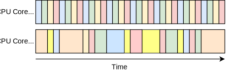
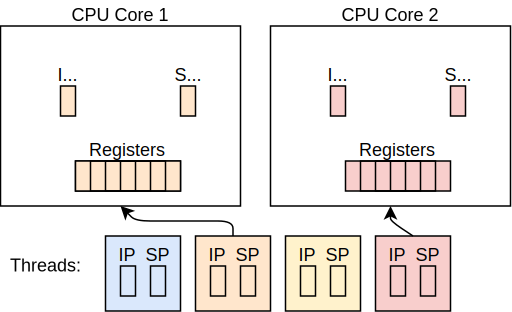

+++
title = "Threads"
weight = 12
path = "threads"
date = 0000-01-01

[extra]
chapter = "Multitasking"
+++

TODO

<!-- more -->

This blog is openly developed on [GitHub]. If you have any problems or questions, please open an issue there. You can also leave comments [at the bottom]. The complete source code for this post can be found in the [`post-12`][post branch] branch.

[GitHub]: https://github.com/phil-opp/blog_os
[at the bottom]: #comments
[post branch]: https://github.com/phil-opp/blog_os/tree/post-12

<!-- toc -->

## Multitasking

One of the fundamental features of most operating systems is [_multitasking_], which is the ability to execute multiple tasks concurrently. For example, you probably have other programs open while looking at this blog post, such as a text editor or a terminal window. Even if you have only a single browser window open, there are probably various background tasks for managing your desktop windows, checking for updates, or indexing files.

[_multitasking_]: https://en.wikipedia.org/wiki/Computer_multitasking

While it seems like all tasks run in parallel, only a single task can be executed on a CPU core at a time. This means that there can be at most 4 active tasks on a quad-core CPU and only a single active task on a single core CPU. A common technique to work around this hardware limitation is _time slicing_.

### Time Slicing

The idea of time slicing is to rapidly switch between tasks multiple times per second. Each task is allowed to run for a short time, then it is paused and another task becomes active. The time until the next task switch is called a _time slice_. By setting the time slice as low as 10ms, it appears like the tasks run in parallel.

The above graphic shows an example for time slicing on two CPU cores. Each color in the graphic hereby represents a different task. CPU core 1 uses a fixed time slice length, which gives each task exactly the same execution time until it is paused again. CPU core 2, on the other hand, uses a variable time slice length. It also does not switch between tasks in a varying order and even executes tasks from core 1 at some times. As we will learn below, both variants have their advantages, so it's up to the operating system designer to decide.

### Preemption

In order to enforce time slices, the operating system must be able to pause a task when its time slice is used up. For this, it must first regain control of the CPU core. Remember, a CPU core can only execute a single task at a time, so the OS kernel can't "run in background" either.

A common way to regain control after a specific time is to program a hardware timer. After the time is elapsed, the timer sends an [interrupt] to the CPU, which in turn invokes an interrupt handler in the kernel. Now the kernel has control again and perform the necessary work to switch to the next task. This technique of forcibly interrupting a running task is called _preemption_ or _preemptive multitasking_.

[interrupt]: @/second-edition/posts/07-hardware-interrupts/index.md

### Cooperative Multitasking

An alternative to enforcing time slices and preempting tasks is to make the tasks _cooperate_. The idea is that each task periodically relinquishes control of the CPU to the kernel, so that the kernel can switch between tasks without forcibly interrupting them. This action of giving up control of the CPU is often called [_yield_].

[_yield_]: https://en.wikipedia.org/wiki/Yield_(multithreading)

The advantage of cooperating multitasking is that a task can specify its pause points itself, which can lead to less memory use and better performance. The drawback is that an uncooperative task can hold onto the CPU as long as it desires, thereby stalling other tasks. Since a single malicious or buggy task can be enough to block or considerably slow down the system, cooperative multitasking is seldom used at the operating system level today. It is, however, often used at the language level in form of [coroutines] or [async/await].

[coroutines]: https://en.wikipedia.org/wiki/Coroutine#Implementations_for_Rust
[async/await]: https://rust-lang.github.io/async-book/01_getting_started/04_async_await_primer.html

Cooperative multitasking and `async/await` are complex topics on their own, so we will explore them in a separate post. For this post, we will focus on preemtive multitasking.

## Threads

In the previous section, we talked about _tasks_ without specifying them further. The most common task abstraction in operating systems is a [_thread of execution_], or "thread" for short. A thread is an independent unit of processing, with an own instruction pointer and stack. The instruction pointer points to the program code and specifies the assembly instruction that should be executed next. The stack pointer points to a [call stack] that is exclusive to the thread, i.e. no other thread uses it.

[call stack]: https://en.wikipedia.org/wiki/Call_stack

A thread can be executed by a CPU core by loading the instruction and stack pointer registers of the thread:

[_thread of execution_]: https://en.wikipedia.org/wiki/Thread_%28computing%29

The graphic shows the two CPU cores from the time slicing example above and four threads. Each thread has an instruction pointer field `IP` and a stack pointer field `SP`. The CPU cores have hardware registers for the instruction and stack pointers and a set of additional registers, e.g. for performing calculations. Thread 2 is loaded to core 1 and thread 4 is loaded to core 2.

To switch to a different thread, the current values of the instruction and stack pointer registers are written back to the `IP` and `SP` field of the thread structure. Then the `IP` and `SP` fields of the next thread are loaded. To ensure that the thread can correctly continue when resumed, the contents of the other CPU registers need to be stored too. One way to implement this is to store them on the call stack when pausing a thread.

Depending on the operating system design, the thread structure typically has some additional fields. For example, it is common to give each thread an unique ID to identify it. Also, thread structures often store an priority for the thread, the ID of the parent thread, or information about the thread state. Some implementations also store the register contents in the thread structure instead of pushing them to the call stack.

It is common to expose the concept of threads to userspace programs, thereby giving the program the ability to launch concurrent tasks. Most programming languages thus have support for threads, even high-level languages such as [Java], [Python], or [Ruby]. For normal Rust applications (not `#![no_std]`), thread support is available in the [`std::thread`] module.

[Java]: https://docs.oracle.com/javase/10/docs/api/java/lang/Thread.html
[Python]: https://docs.python.org/3/library/threading.html
[Ruby]: https://docs.ruby-lang.org/en/master/Thread.html
[`std::thread`]: https://doc.rust-lang.org/std/thread/index.html

## Thread Creation

### Stack Allocation

## Switching Stacks

## Saving Registers

## Scheduler

## Summary
TODO

## What's next?

TODO