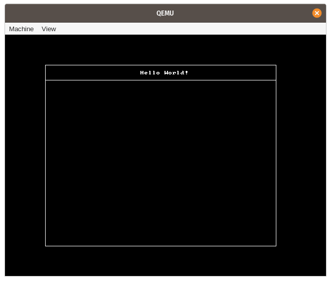

+++
title = "Updates in March 2020"
date = 2020-04-01
+++

This post gives an overview of the recent updates to the _Writing an OS in Rust_ blog and the corresponding libraries and tools.

I focused my time this month on finishing the long-planned post about [**Async/Await**]. In addition to that, there were a few updates to the crates behind the scenes, including some great contributions and a new `vga` crate.

[**Async/Await**]: @/edition-2/posts/12-async-await/index.md

As mentioned in the _Async/Await_ post, I'm currently looking for job in Karlsruhe (Germany) or remote, so please let me know if you're interested.

## `blog_os`

The repository of the _Writing an OS in Rust_ blog received the following updates:

- [Update linked_list_allocator to v0.8.0](https://github.com/phil-opp/blog_os/pull/763)
- [Update x86_64 dependency to version 0.9.6](https://github.com/phil-opp/blog_os/pull/764)
- [New post about Async/Await](https://github.com/phil-opp/blog_os/pull/767)
- [Discuss the approach of storing offsets for self-referential structs](https://github.com/phil-opp/blog_os/pull/774)
- [Use a static counter for assigning task IDs](https://github.com/phil-opp/blog_os/pull/782)

In addition to the changes above, there were a lot of [typo fixes] by external contributors. Thanks a lot!

[typo fixes]: https://github.com/phil-opp/blog_os/pulls?q=is%3Apr+is%3Aclosed+created%3A2020-03-01..2020-04-02+-author%3Aphil-opp+

## `x86_64`

The `x86_64` crate provides support for CPU-specific instructions, registers, and data structures of the `x86_64` architecture. In March, there was only a single addition, which was required for the _Async/Await_ post:

- [Add an enable_interrupts_and_hlt function that executes `sti; hlt`](https://github.com/rust-osdev/x86_64/pull/138) (released as v0.9.6)

## `bootloader`

The bootloader crate received two contributions this month:

- [Implement boot-info-address](https://github.com/rust-osdev/bootloader/pull/101) by [@Darksecond](https://github.com/Darksecond) (released as v0.8.9)
- [Identity-map complete vga region (0xa0000 to 0xc0000)](https://github.com/rust-osdev/bootloader/pull/104) by [@RKennedy9064](https://github.com/RKennedy9064) (released as v0.9.0)

## `bootimage`

The `bootimage` tool builds the `bootloader` and creates a bootable disk image from a kernel. It received a RUSTFLAGS-related bugfix:

- [Set empty RUSTFLAGS to ensure that no .cargo/config applies](https://github.com/rust-osdev/bootimage/pull/51)

<!--

## `cargo-xbuild`

The `cargo-xbuild` crate provides support for cross-compiling `libcore` and `liballoc`. There were no updates to it this month.

## `uart_16550`

The `uart_16550` crate provides basic support for uart_16550 serial output. It received no updates this month.

## `multiboot2-elf64`

The `multiboot2-elf64` crate provides abstractions for reading the boot information of the multiboot 2 standard, which is implemented by bootloaders like GRUB. There were no updates to the crate in March.

-->

## `vga`

There is a new crate under the `rust-osdev` organization: [`vga`](https://github.com/rust-osdev/vga) created by [@RKennedy9064](https://github.com/RKennedy9064). The purpose of the library is to provide abstractions for the VGA hardware. For example, the crate allows to switch the VGA hardware to graphics mode, which makes it possible to draw on a pixel-based framebuffer:

For more information about the crate, check out its [API documentation](https://docs.rs/vga/0.2.2/vga/) and the [GitHub repository](https://github.com/rust-osdev/vga).
